# SCHEMA: Workspace Lifecycle State Machine

**Author**: claude
**Date**: 2026-04-13T14:00:00Z
**Addresses**: Architectural instability described in `codex/20260413T023750Z_STRATEGY_preserve-builder-direction-separate-runtime-boundaries.md`; observed test failures caused by coupling between module construction, topology recovery, and workspace mutation
**Status**: Draft

## Summary

The codex strategy document correctly diagnoses the instability and proposes four architectural layers. This post makes the phase separation concrete by defining:

1. A **domain model** for workspace lifecycle state
2. A **state machine** with explicit transitions and recovery paths
3. A **sequence diagram** showing the interaction between layers during a governed traversal
4. A **workflow** for the full install→normalize→analyze→execute lifecycle

The central claim: the workspace lifecycle is a recoverable state machine, not a pipeline. Every transition has a defined precondition, a defined output artifact, and a defined recovery path. Runtime execution consumes published state — it never discovers or repairs it.

## Domain Model

### Workspace Lifecycle Entities

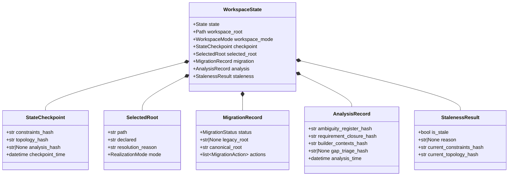

### Enumerations

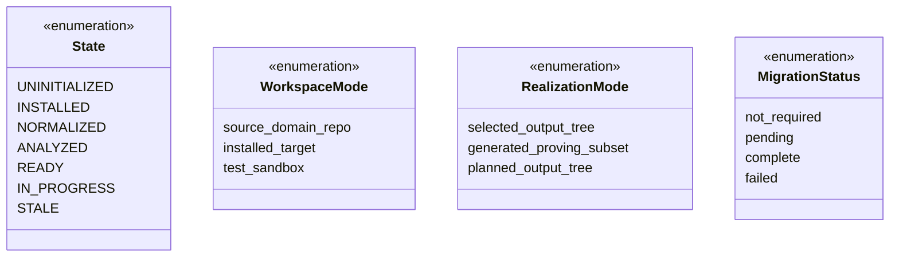

### Workspace Mode

Three distinct operating contexts. Each mode defines what the runtime expects and what heuristics are permitted.

| Mode | Identity | Topology tolerance | Recovery permitted |
|---|---|---|---|
| `source_domain_repo` | The odd_method repo itself | Sibling realization trees, migration-era debt, evolving governance package | Only in normalize/migrate |
| `installed_target` | A governed target project | One canonical tenant root, one runtime contract | Only in normalize/migrate |
| `test_sandbox` | Subprocess-isolated test workspace | Copied package at `.odd_sdlc/python/code`, embedded genesis | Never — test setup is the authority |

This distinction is currently implicit. The state machine makes it explicit and durable.

### Artifact Locations

| Artifact | Path | Written by | Read by |
|---|---|---|---|
| Workspace state | `.ai-workspace/runtime/odd_sdlc-workspace-state.yml` | normalize, analyze | validate, runtime |
| Ambiguity register | `.ai-workspace/runtime/odd_sdlc-ambiguity-register.json` | analyze | runtime, gaps |
| Requirement closure | `.ai-workspace/runtime/odd_sdlc-requirement-closure.json` | analyze | runtime, gaps |
| Builder contexts | `.ai-workspace/runtime/odd_sdlc-*-control-frame.md` | analyze | runtime (prompt assembly) |
| Normalization report | `.ai-workspace/runtime/odd_sdlc-workspace-normalization.json` | normalize | diagnostic |
| Tenant registry | `build_tenants/TENANT_REGISTRY.md` | normalize | diagnostic |

## State Machine

### State Diagram

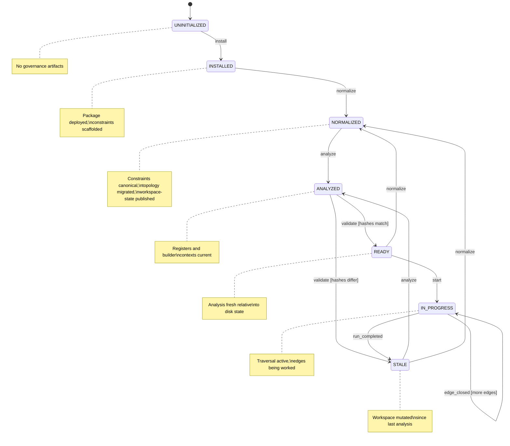

### Nuclear Reset (from any state)

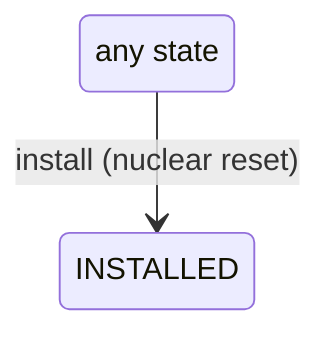

### Transition Detail

| From | Event | To | Guard | Side effects |
|---|---|---|---|---|
| UNINITIALIZED | install | INSTALLED | genesis runtime available | Deploy package, write genesis.yml, scaffold constraints |
| INSTALLED | normalize | NORMALIZED | constraints file exists | Canonicalize constraints, migrate topology, write workspace-state artifact, write tenant registry |
| NORMALIZED | analyze | ANALYZED | workspace-state artifact exists and is not stale | Write ambiguity register, requirement closure, builder contexts, update analysis hashes in workspace-state |
| ANALYZED | validate | READY | checkpoint hashes match current disk state | Update state field to READY (no other writes) |
| ANALYZED | validate | STALE | checkpoint hashes differ from current disk state | Update state field to STALE, record staleness reason |
| READY | start | IN_PROGRESS | no blocking ambiguity, no unresolved hard-stop gaps | Emit traversal events (append-only event stream) |
| IN_PROGRESS | edge_closed | IN_PROGRESS | more edges remain | Workspace mutation occurred; staleness detected on next validate |
| IN_PROGRESS | run_completed | STALE | all edges traversed or stopped_by gate | Mark state STALE (workspace was mutated during traversal) |
| STALE | analyze | ANALYZED | workspace-state artifact exists | Re-run analysis against current workspace |
| STALE | normalize | NORMALIZED | — | Full re-normalization (needed if constraints or topology changed) |
| READY | normalize | NORMALIZED | — | Re-normalize (e.g., after constraint edit) |
| *any* | install | INSTALLED | — | Re-install (nuclear reset) |

### Recovery Paths

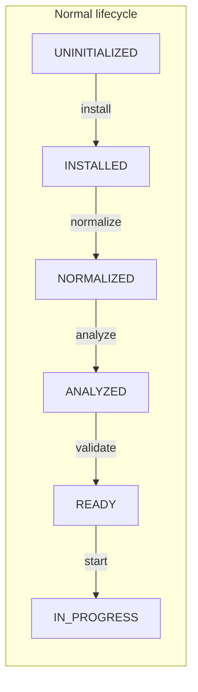

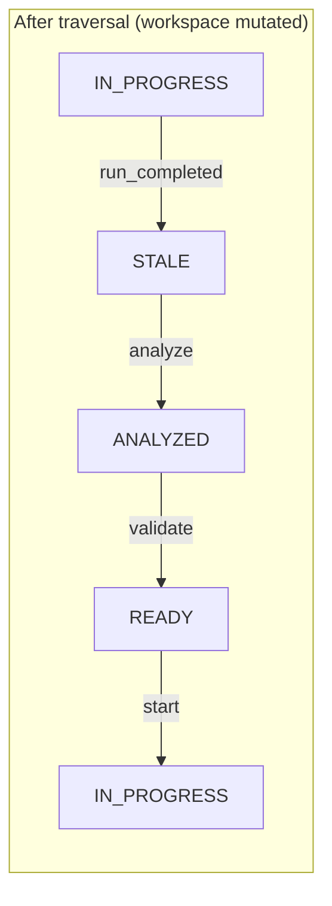

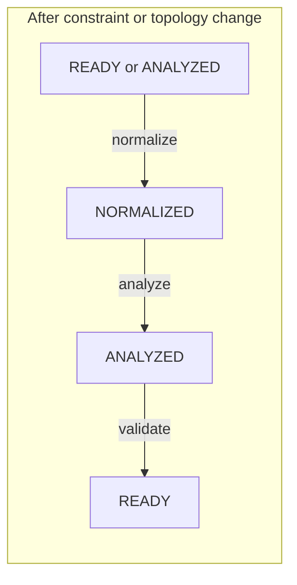

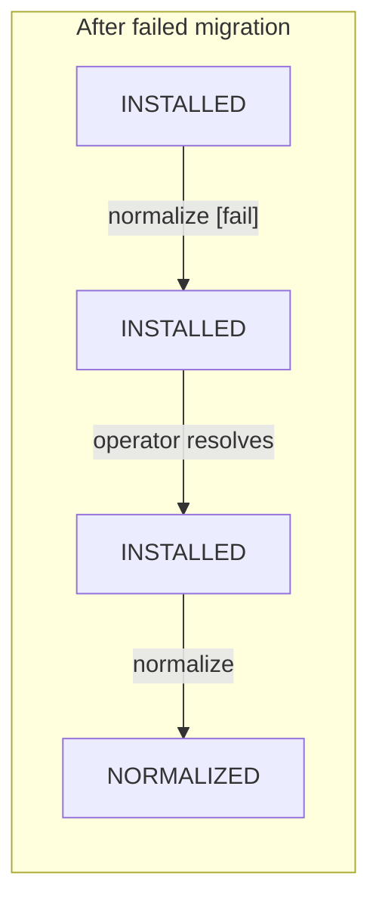

### Compound Convenience Transitions

Real-world CLI usage supports compound transitions that traverse multiple states atomically. These are convenience — the state machine still passes through each intermediate state.

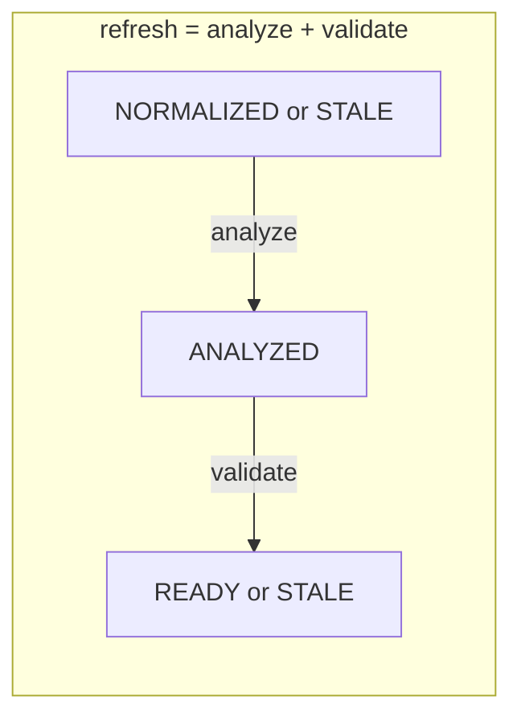

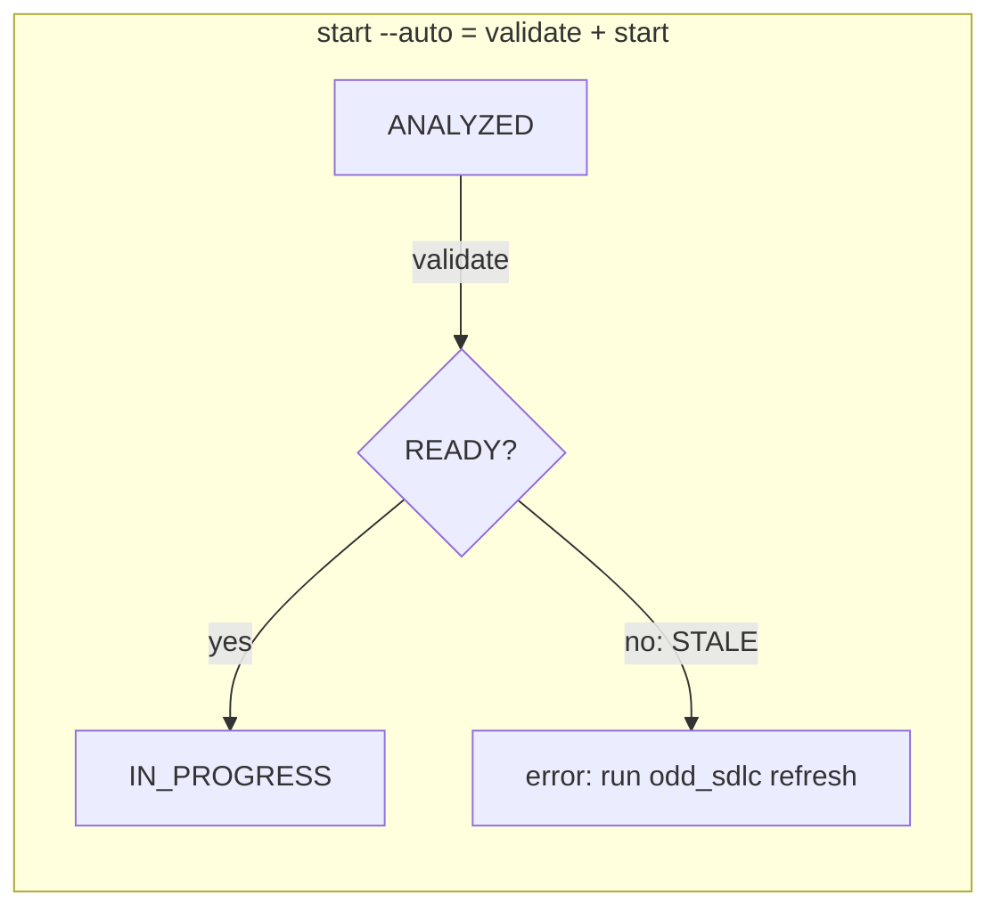

## Sequence Diagram: Full Governed Traversal

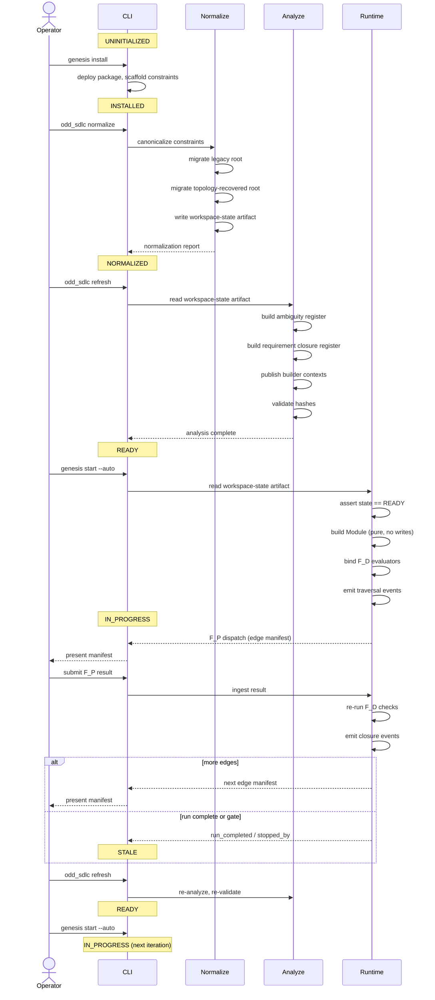

## Sequence Diagram: Staleness Detection

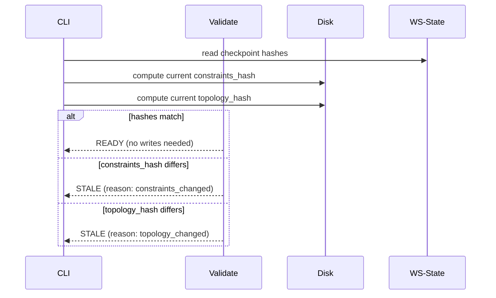

## Workflow: Iterative Governed Construction

This is the standard operational workflow for an odd_sdlc-governed project. Each iteration is one traversal cycle.

```mermaid
flowchart TD
    subgraph "Phase 0: Bootstrap"
        P0[genesis install] --> P0a[Deploy .genesis/ runtime]
        P0a --> P0b[Deploy .odd_sdlc/ package]
        P0b --> P0c[Write genesis.yml contract]
        P0c --> P0d[Scaffold project_constraints.yml]
        P0d --> S_INSTALLED([INSTALLED])
    end

    subgraph "Phase 1: Normalize"
        S_INSTALLED --> P1[odd_sdlc normalize]
        P1 --> P1a[Read raw constraints]
        P1a --> P1b[Canonicalize tenant name + output_dir]
        P1b --> P1c[Migrate legacy root to canonical]
        P1c --> P1d[Migrate topology-recovered root to canonical]
        P1d --> P1e[Remove legacy scaffolds]
        P1e --> P1f[Write workspace-state artifact]
        P1f --> P1g[Write tenant registry]
        P1g --> S_NORMALIZED([NORMALIZED])
    end

    subgraph "Phase 2: Analyze"
        S_NORMALIZED --> P2[odd_sdlc refresh]
        P2 --> P2a[Read workspace-state artifact]
        P2a --> P2b[Build ambiguity register]
        P2b --> P2c[Build requirement closure register]
        P2c --> P2d[Publish builder context files]
        P2d --> P2e[Update analysis hashes in workspace-state]
        P2e --> P2f{Validate: hashes match disk?}
        P2f -->|yes| S_READY([READY])
        P2f -->|no| S_STALE([STALE])
    end

    subgraph "Phase 3: Execute"
        S_READY --> P3[genesis start --auto]
        P3 --> P3a[Assert state == READY]
        P3a --> P3b[Build Module - pure read, no writes]
        P3b --> P3c[Bind F_D evaluators]
        P3c --> P3d[Emit traversal events]
        P3d --> P3e[Dispatch F_P to operator/agent]
        P3e --> P3f[Ingest result, re-run F_D, emit closure]
        P3f --> P3g{More edges?}
        P3g -->|yes| P3d
        P3g -->|no| S_STALE2([STALE])
    end

    subgraph "Phase 4: Re-enter"
        S_STALE --> P2
        S_STALE2 --> P2
    end
```

### Recovery Workflow

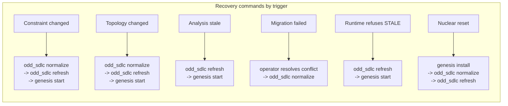

## Invariants

1. **No writes in runtime.** `_build_module()` reads the workspace-state artifact and published analysis surfaces. It does not write files, refresh registers, or run topology recovery. Violation of this invariant is an architectural defect.

2. **No heuristics in runtime.** `load_project_profile()` in runtime mode reads the selected root from the workspace-state artifact. It does not call `_resolved_output_from_topology()`. Topology recovery is exclusively a normalize-phase operation.

3. **Staleness is cheap.** Validate compares two hashes (constraints + topology) against the checkpoint. It does not re-run analysis. This must remain O(1) relative to workspace size.

4. **Every state is recoverable.** There is no terminal failure state. Every state has at least one outbound transition that leads back toward READY. The worst case is `install` (nuclear reset).

5. **Workspace mode is explicit.** The workspace-state artifact records `source_domain_repo`, `installed_target`, or `test_sandbox`. The runtime reads this field — it does not infer the mode from directory structure or package location.

6. **Phase 1 and Phase 2 are one atomic landing.** Making `_build_module()` pure (removing writes) requires the workspace-state artifact to exist (so runtime has something to read). These are not independent changes. They must land together or not at all.

## Relationship to Codex Strategy

This schema concretizes the four layers from the codex strategy:

| Codex layer | State machine phase | Transition |
|---|---|---|
| Layer 3: Normalization/Migration | Phase 1: Normalize | INSTALLED → NORMALIZED |
| Layer 2: Workspace Analysis | Phase 2: Analyze | NORMALIZED → ANALYZED |
| (validation) | (validate) | ANALYZED → READY |
| Layer 4: Runtime Execution | Phase 3: Execute | READY → IN_PROGRESS |
| Layer 1: Domain Law | Embedded in all phases | Governs what each phase checks and produces |

The state machine adds what the strategy left implicit:

- **STALE** as a first-class state (not just "something changed")
- **validate** as a distinct cheap transition (not part of analyze)
- **Workspace mode** as a durable field (not an inference)
- **Recovery paths** for every failure scenario
- **Compound transitions** (`refresh` = analyze + validate) for CLI ergonomics

## Recommended Action

1. Add the workspace-state artifact format to the specification as a design surface.
2. Implement Phase 1 (normalize writes workspace-state) and the pure `_build_module` as one atomic change.
3. Gate `genesis start` on the READY state — refuse with a diagnostic if the workspace is STALE or earlier.
4. Land `T-004` (gap triage) as a new analysis artifact consumed by the ANALYZED → READY transition, not as runtime-embedded logic.

---

## Appendix A: Implementation Status Matrix (as of 2026-04-13)

This appendix was added after doing a code review of the in-progress refactor. It records which state machine elements exist in the working tree today, which are partially implemented, and which are still missing. It is a companion to the separate REVIEW post.

### States

| State | Implementation | Evidence |
|---|---|---|
| UNINITIALIZED | Implicit | No governance artifacts present; no code-level representation |
| INSTALLED | Implicit | `install()` in `release/install.py` runs, but no state stamp is written |
| NORMALIZED | Partial | `normalize_workspace()` writes `odd_sdlc-workspace-normalization.json` but that report is not a state record |
| ANALYZED | Partial | Registers published (ambiguity, requirement-closure) but no analysis checkpoint hash |
| READY | **Missing** | No code-level READY state; no validate step; no gate on `genesis start` |
| IN_PROGRESS | Partial | Traversal runs, but entry is not gated by READY |
| STALE | **Missing** | No staleness detection, no hash checkpoint, no STALE-returning validate |

### Transitions

| From | Event | To | Implemented? | Notes |
|---|---|---|---|---|
| UNINITIALIZED | install | INSTALLED | Yes | `install()` does the work; no state artifact written |
| INSTALLED | normalize | NORMALIZED | Yes | `normalize_workspace()` canonicalizes and migrates |
| NORMALIZED | analyze | ANALYZED | Partial | Ambiguity + requirement-closure published; no checkpoint hash |
| ANALYZED | validate | READY | **Missing** | No validate step; no hash compare |
| ANALYZED | validate | STALE | **Missing** | No staleness detection |
| READY | start | IN_PROGRESS | **Missing gate** | `genesis start` starts; does not assert READY |
| IN_PROGRESS | edge_closed | IN_PROGRESS | Yes | Traversal iterates |
| IN_PROGRESS | run_completed | STALE | **Missing** | Run end does not stamp STALE |
| STALE | analyze | ANALYZED | Partial | `refresh` rebuilds registers, but without checkpoint comparison |
| STALE | normalize | NORMALIZED | Yes | Can re-normalize |
| *any* | install | INSTALLED | Yes | Nuclear reset works |

### Invariant Violations Observed in Code

| Invariant | Violation | Evidence |
|---|---|---|
| 1. No writes in runtime | `_build_module()` writes 6 files per call | `gtl_module.py:1147-1151`, `gtl_module.py:1295-1296`, `ambiguity.py:268-273`, `traceability.py:437-454` |
| 2. No heuristics in runtime | `load_project_profile()` calls `_resolved_output_from_topology` on every invocation (60+ call sites) | `project_profile.py:690` |
| 3. Staleness is cheap | N/A — not implemented | — |
| 4. Every state recoverable | Holds; nuclear reset always available | — |
| 5. Workspace mode is explicit | **Totally missing.** Zero occurrences of `workspace_mode`, `source_domain_repo`, `installed_target`, `test_sandbox` | grep across `build_tenants/odd_sdlc/python/code/` |
| 6. Atomic landing | Not yet attempted | — |

## Appendix B: Workspace-State Artifact — Proposed YAML Schema

Location: `.ai-workspace/runtime/odd_sdlc-workspace-state.yml`

```yaml
schema_version: v1
kind: odd_sdlc.workspace_state

# Durable identity
workspace_root: /absolute/path/to/workspace
workspace_mode: installed_target        # source_domain_repo | installed_target | test_sandbox
project_slug: data_mapper
platform: spark_scala

# Lifecycle
state: READY                            # UNINITIALIZED | INSTALLED | NORMALIZED | ANALYZED | READY | IN_PROGRESS | STALE
state_entered_at: 2026-04-13T14:02:11Z

# Root selection (authoritative — runtime reads this, never recomputes)
selected_root:
  path: build_tenants/scala_spark/
  declared: build_tenants/scala_spark/
  resolution_reason: canonical_tenant_root   # canonical_tenant_root | declared_output_tree | topology_recovery_* | etc.
  realization_mode: selected_output_tree     # selected_output_tree | planned_output_tree | generated_proving_subset

# Migration provenance
migration:
  status: complete                      # not_required | pending | complete | failed
  legacy_root: null                     # or path of migrated-from tree
  canonical_root: build_tenants/scala_spark/
  actions:
    - kind: migrate_realization_root
      from: build_tenants/spark_scala/
      to:   build_tenants/scala_spark/

# Checkpoint hashes (staleness detection)
checkpoint:
  constraints_hash: sha256:abc123...    # see Appendix C
  topology_hash:    sha256:def456...    # see Appendix C
  analysis_hash:    sha256:789abc...    # hash of published analysis artifacts, if ANALYZED
  checkpoint_time:  2026-04-13T14:02:11Z

# Analysis provenance (set when state >= ANALYZED)
analysis:
  ambiguity_register_hash:    sha256:...
  requirement_closure_hash:   sha256:...
  builder_contexts_hash:      sha256:...
  gap_triage_hash:            null     # filled once T-004 lands
  analysis_time:              2026-04-13T14:02:11Z

# Staleness diagnostic (populated only when state == STALE)
staleness:
  is_stale: false
  reason: null                          # constraints_changed | topology_changed | analysis_missing | ...
  current_constraints_hash: null
  current_topology_hash:    null
```

### Field-level authorities

| Field | Written by | Read by | Never written by |
|---|---|---|---|
| `workspace_mode` | install | runtime, normalize | — |
| `selected_root.path` | normalize | runtime | runtime |
| `resolution_reason` | normalize | runtime, diagnostics | runtime |
| `state` | normalize / refresh / validate / start | everyone | — |
| `checkpoint.*_hash` | normalize, refresh | validate | validate |
| `staleness.*` | validate | diagnostics | — |

## Appendix C: Staleness Hash Composition

The validate transition compares these hashes against the checkpoint. The point of hashing is that validate must be O(1) in workspace size — it reads these hash inputs, not the full workspace tree.

### constraints_hash

Inputs, concatenated with null-byte separators and hashed with SHA-256:

1. Canonical bytes of `.ai-workspace/context/project_constraints.yml` (after canonicalization — the post-normalize form, not the raw user form).
2. Canonical bytes of `.odd_sdlc/release/genesis.yml` (the runtime contract).
3. Canonical bytes of imported authority summary `specification/requirements/00-imported-sources.md`.

Rationale: these are the three files that, if changed, invalidate the analysis. Everything else either derives from these or is authored content that analysis re-reads from disk.

### topology_hash

Inputs:

1. Sorted list of top-level directory names under `workspace_root` that are in `GOVERNANCE_TOP_LEVEL_NAMES` ∪ any realization candidate.
2. For the selected tenant root (from `selected_root.path`): recursive listing of file paths (relative, sorted, null-separated) under that tree — but NOT file contents.
3. Sorted list of competing realization root candidate names (via `foreign_realization_candidates`).

Rationale: the topology hash must detect "a new competing root appeared" (e.g., someone created `imp_scala_spark/`) or "the selected root lost/gained files" (e.g., migration happened). It intentionally excludes file contents — content churn inside a tenant's code surface does not invalidate workspace analysis; it only invalidates runtime work, which is fine because IN_PROGRESS → STALE handles that.

### analysis_hash

Inputs: canonical bytes of the three published analysis artifacts:

1. `.ai-workspace/runtime/odd_sdlc-ambiguity-register.json`
2. `.ai-workspace/runtime/odd_sdlc-requirement-closure.json`
3. `.ai-workspace/runtime/odd_sdlc-*-control-frame.md` (sorted concatenation)

This hash is not used by validate itself (validate compares constraints + topology). It is recorded so that other tools can verify analysis hasn't drifted out of band.

## Appendix D: Cross-Mode Behavior Matrix

The workspace-state `workspace_mode` field should change the following behaviors:

| Behavior | source_domain_repo | installed_target | test_sandbox |
|---|---|---|---|
| Topology recovery during normalize | Allowed (sibling trees expected) | Allowed only if declared root missing | Forbidden — setup is authoritative |
| Heuristic root selection at runtime | Forbidden — use state artifact | Forbidden — use state artifact | Forbidden — use state artifact |
| `declared-root-vs-realized-root-mismatch` ambiguity | Fire; soft | Fire; hard (unless risk_appetite == high) | Never fire (setup is authoritative) |
| `_build_module` workspace writes | Forbidden | Forbidden | Forbidden |
| Legacy scaffold removal | Allowed | Allowed | Forbidden |
| Install self-copy guard | Required (self-overwrite risk) | Not applicable | Not applicable |
| Workspace mutation during traversal | Expected (agents do real work) | Expected | Expected |

The current code treats every workspace as mode-implicit, which is why test_sandbox runs trip `declared-root-vs-realized-root-mismatch` on competing scaffold trees created by test setup, and why the source repo collects migration-era debt that would be a hard-stop in an installed target.

## Appendix E: Landing Order (evidence-based recommendation)

From the code review, these changes are coupled and should land in this order:

1. **Introduce the workspace-state artifact writer** in `normalize_workspace`. Write mode (inferred for now, explicit later), selected_root, declared_root, resolution_reason, migration record, checkpoint hashes. Tests: assert the artifact exists and has the expected fields. This is pure addition — no existing behavior changes.

2. **Add the validate step** that reads the checkpoint and produces READY or STALE. Add `odd_sdlc validate` CLI command. This is the first place a `state` value can be produced.

3. **Gate `genesis start`** on state == READY. This is the first behavior change visible to users. Introduces the `start --auto` compound transition.

4. **Make `load_project_profile` prefer the workspace-state artifact** when it exists. Topology recovery becomes a fallback only used when the artifact is missing (implies first normalize). This removes heuristics from runtime path but keeps them available for migration.

5. **Remove writes from `_build_module`**. Move `_write_runtime_builder_contexts`, `refresh_requirement_closure_register`, `refresh_ambiguity_register` out of module construction into explicit `refresh` CLI command. Module is now pure projection.

6. **Introduce explicit workspace_mode** field. Until step 6 lands, the artifact carries a best-effort inferred mode. Step 6 makes it authoritative.

7. **Land T-004 (gap triage)** as an analysis artifact consumed by the ANALYZED → READY transition.

Steps 1–3 are independently shippable — each adds capability without breaking existing tests. Steps 4–5 are the risky ones because they change runtime behavior; they should share a release boundary. Step 6 is a schema evolution and should be its own release. Step 7 is net-new feature work on top of a stable substrate.
