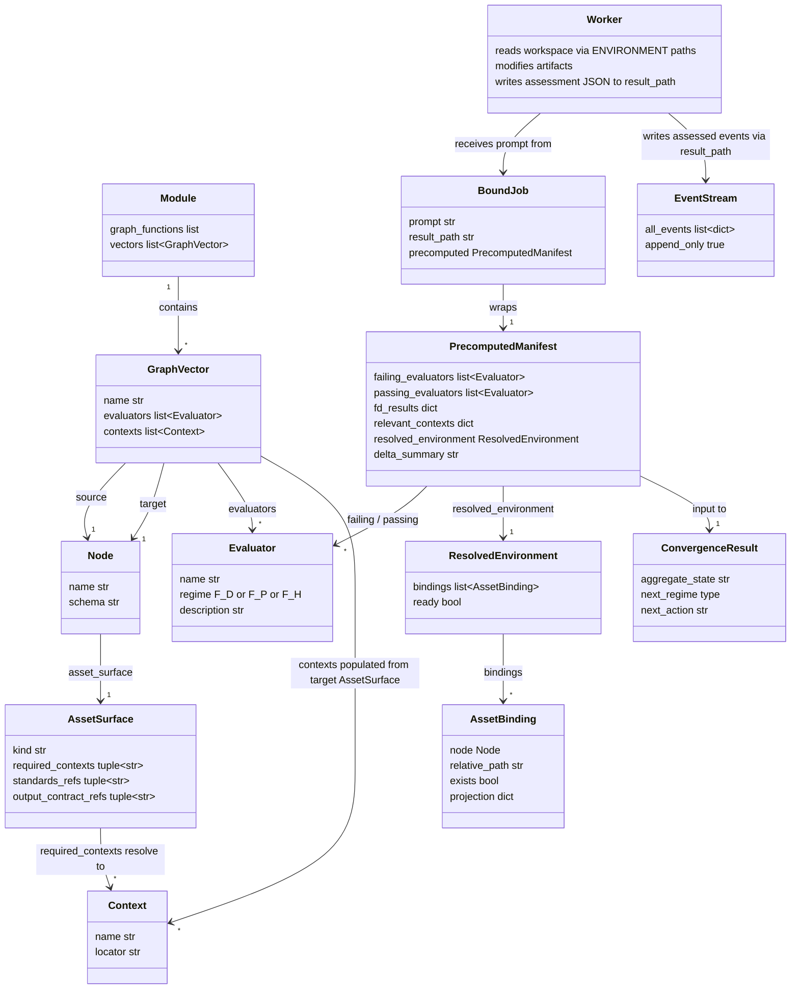
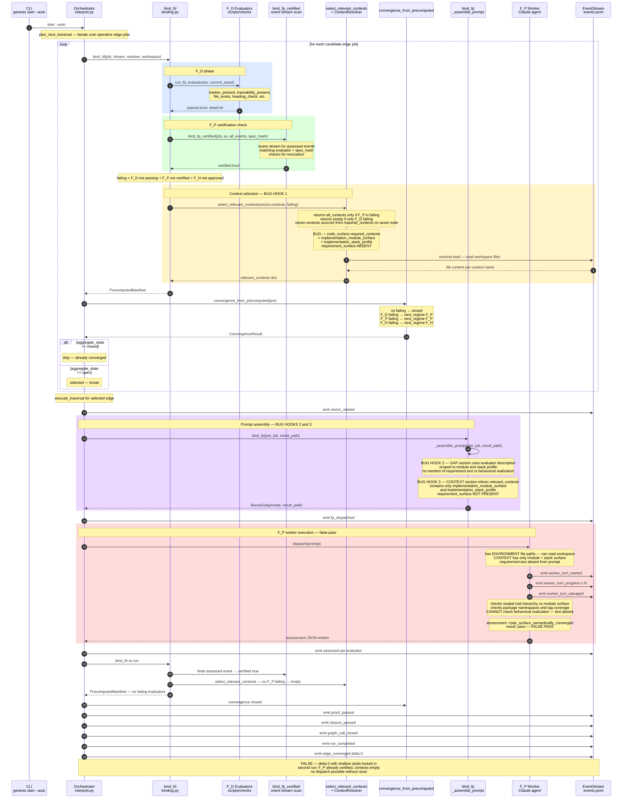

# SCHEMA: ABG Traversal — F_P Gap Analysis Investigation

**Author**: claude
**Date**: 2026-04-18
**Addresses**: B-019, `binding.py`, `interpret.py`, `convergence.py`, `gtl_module.py`
**Status**: Draft — investigation in progress

## Summary

The `code_surface_semantically_converged` F_P evaluator passes on shallow stub
implementations because `requirement_surface` is absent from the F_P prompt
context. The worker cannot do behavioral gap analysis on content it was never
given. This is not a prompt-instruction problem — it is a missing context
binding at `gtl_module.py:196` with a clear fix location.

Three views follow: prose analysis, domain model, flowchart, and sequence
diagram. All annotate the same root cause.

---

## Analysis

### How the F_P prompt is assembled

`binding.py:_assemble_prompt()` (line 1269) builds the prompt in sections:

```
PRECONDITIONS      upstream asset markov conditions
CURRENT STATE      edge name, source/target asset names, status
WORKING METHOD     instructs worker to read current target state from path
GAP                failing evaluators with their description strings
DETERMINISTIC FAILURES  F_D results if any
CONTEXT            content of pre.relevant_contexts (keyed by context name)
ENVIRONMENT        resolved asset bindings with file paths and existence flags
REQUIRED BOUNDARY  invocation-local required context names
ASSET SURFACE      declared required_contexts, standards_refs, output_contract_refs
TARGET BINDING     workspace destination path for the produced asset
OUTPUT CONTRACT    markov conditions + evaluators to pass + assessment file path
EXECUTION RULES    mandatory rules
```

The CONTEXT section is the primary content injection surface. It inlines the
full text of each asset named in `pre.relevant_contexts`. What goes into
`pre.relevant_contexts` is determined by the `required_contexts` declared on
the target asset node in the GTL module.

### The code_surface required_contexts declaration

`gtl_module.py` line 195–200:

```python
_code_surface = _asset_node(
    "code_surface",
    schema="odd.asset.code_surface",
    kind="code_surface",
    required_contexts=("implementation_module_surface", "implementation_stack_profile"),
    output_contract_refs=("published_source_code_surface",),
)
```

The F_P worker receives in CONTEXT:

- `implementation_module_surface` — package structure, module declarations,
  sealed trait and case class signatures
- `implementation_stack_profile` — build.sbt, Scala version, dependency list

It does **not** receive:

- `requirement_surface` — the actual requirement text and behavioral contracts
- `implementation_design_surface` — behavioral design contracts per module

The worker is building code to conform to the module surface shape. It has no
access to the text of REQ-LDM-001 or any other requirement. It cannot know
whether a `sealed trait Foo {}` is sufficient or whether REQ-LDM-001 demands
transitive composition with identity preservation.

### The evaluator description compounds the problem

`code_surface_semantically_converged` (gtl_module.py line 476–480):

> "The code surface is semantically converged for the current generated
> implementation module and stack profile."

This is what the worker reads in the GAP section when assessing. It instructs
verification against module surface and stack profile — not against requirement
behavioral contracts. Both the generation prompt (via `required_contexts`) and
the assessment prompt (via evaluator `description`) are scoped to structural
conformance. The worker is doing exactly what it was asked.

### The propagation chain — actual origin point

`requirement_surface` is present through the early pipeline then drops out
permanently at `implementation_design_surface`:

```
feature_decomp_surface        required_contexts: requirement_surface              ✓
uat_testcases_surface         required_contexts: requirement_surface              ✓
design_surface                required_contexts: requirement_surface, feature_decomp ✓
scenario_surface              required_contexts: requirement_surface, design_surface ✓
implementation_design_surface required_contexts: design_surface, scenario_surface  ✗ ← ORIGIN
implementation_stack_profile  required_contexts: implementation_design_surface     ✗
implementation_module_surface required_contexts: implementation_design_surface, stack ✗
code_surface                  required_contexts: implementation_module_surface, stack ✗
test_design_surface           required_contexts: design_surface, scenario_surface  ✗
test_module_surface           required_contexts: test_design_surface, stack, impl_module ✗
test_run_archive_surface      required_contexts: test_module_surface, test_stack   ✗
```

`design_surface` had `requirement_surface` in context and generated component
structure. `implementation_design_surface` received that structural design and
interpreted it as "implement this shape" — no behavioral contracts, because
requirements weren't present to demand them. Every downstream stage faithfully
implemented the shallow design. The fix at `code_surface` alone would produce
slightly better code assessment but against a still-shallow design surface.
The fix must originate at `implementation_design_surface`.

### v3.0.0 vs v3.1.0

The triage pipeline in v3.0.0 introduced an observation → divergence →
correction cycle that functioned as external behavioral pressure. It forced
design surfaces to deepen because the observation surface could detect
behavioral gaps independently. v3.1.0 removed the triage pipeline, leaving
the evaluator chain as the sole gap-detection mechanism. Since that chain
does not include requirement text, behavioral gaps are undetectable.

### Evidence from data_mapper.test34 (genesis v3.1.0)

`code_surface_semantically_converged` assessment evidence (from events.jsonl):

> "sealed trait hierarchies, trait contracts, and case class signatures are
> faithful to the implementation design surface … all 71 live requirements
> are traceable."

- 112 main Scala files, avg 10.6 LOC — all sealed traits and case class stubs
- 18/18 edges converged, delta 0.0
- Second run: 0 new events — locked in, no re-entry pressure

For comparison, test32 (v3.0.0, with triage): 59 files, avg 49.5 LOC,
2,918 LOC total, 95.8% requirement coverage at depth.

### Lock-in mechanism

`select_relevant_contexts` (binding.py line 1530) returns `[]` when only F_D
evaluators are failing (F_P already certified). Once the false F_P pass is
recorded in the event stream, subsequent dispatches to repair F_D failures
receive no CONTEXT at all. A reset or reopen of the edge is the only recovery
path — re-running start --auto cannot break out of the false pass.

---

## Domain Model

Critical path for B-019: `AssetSurface.required_contexts` →
`select_relevant_contexts` → `PrecomputedManifest.relevant_contexts` →
`_assemble_prompt` CONTEXT section → `BoundJob.prompt` → Worker.



### Context injection chain

```
AssetSurface.required_contexts          ← FIX HERE (gtl_module.py:196)
        │
        ▼  names passed to
select_relevant_contexts(vector.contexts, failing)
        │  returns all contexts only when F_P is in failing list
        ▼  resolver.load() reads each file from workspace
PrecomputedManifest.relevant_contexts   ← dict { name → file_content }
        │
        ▼  inlined verbatim by
_assemble_prompt() CONTEXT section      ← what the worker actually sees
        │
        ▼
BoundJob.prompt  →  F_P Worker (Claude agent)
```

---

## Traversal Flowchart

```mermaid
flowchart TD
    START([genesis start --auto]) --> PLAN

    subgraph PLANLOOP [plan_next_traversal loop]
        PLAN[iterate over operative edge jobs] --> BFD

        subgraph BINDFD [bind_fd — pre-computation phase]
            BFD[bind_fd] --> FD[run F_D evaluators\nscripts: marker, traceability,\nfile_exists, heading_check]
            FD --> FPC[bind_fp_certified\nscan event stream for assessed\nevents matching evaluator + spec_hash]
            FPC --> CTX

            subgraph CTXINJECT [Context injection — BUG HOOK 1]
                CTX[select_relevant_contexts\nvector.contexts filtered by failing evaluators\nreturns all if F_P failing\nreturns empty if only F_D failing]
                CTX --> CTXLOAD[ContextResolver.load\nread each context file from workspace]
            end

            CTXLOAD --> PRE[PrecomputedManifest\nfailing evaluators, fd_results\nrelevant_contexts, resolved_environment]
        end

        PRE --> CONV[convergence_from_precomputed]
        CONV --> CONVDEC{aggregate_state?}
        CONVDEC -->|closed| NEXTJOB{more jobs?}
        CONVDEC -->|open| SELECTED[edge selected for traversal]
        NEXTJOB -->|yes| BFD
        NEXTJOB -->|no| NOTHING([nothing_to_do or run_yielded])
    end

    SELECTED --> VSTART[emit vector_started]
    VSTART --> PASSM

    subgraph EXEC [execute_traversal]

        subgraph PROMPTASM [Prompt assembly — BUG HOOKS 2 and 3]
            PASSM[bind_fp] --> ASM[_assemble_prompt\nPRECONDITIONS — markov conditions\nCURRENT STATE — edge name and status\nWORKING METHOD — inspect path reduce gap\nGAP — evaluator descriptions\nDETERMINISTIC FAILURES — F_D detail\nCONTEXT — inlined relevant_contexts\nENVIRONMENT — asset paths\nOUTPUT CONTRACT — evals to pass\nEXECUTION RULES]
            ASM --> BUGCTX{{BUG HOOK 3\nCONTEXT contains only\nimplementation_module_surface\nimplementation_stack_profile\nNO requirement_surface}}
            BUGCTX --> BUGDESC{{BUG HOOK 2\nGAP uses evaluator description\ncode_surface_semantically_converged\nscoped to module and stack profile\nno behavioral realization check}}
        end

        BUGDESC --> FPDIS[emit fp_dispatched]
        FPDIS --> WKRDISP[dispatch F_P Worker]

        subgraph WORKER [F_P Worker — Claude agent]
            WKRDISP --> WREAD[worker reads workspace files via ENVIRONMENT paths]
            WREAD --> WMOD[modifies artifacts\ngenerates code surface]
            WMOD --> WBUG{{BUG OUTCOME\nassesses structural conformance\nto module surface only\ncannot check behavioral completeness\nrequirement text absent from prompt}}
            WBUG --> WASSESS[writes assessment JSON\ncode_surface_semantically_converged\nresult: pass — FALSE PASS]
        end

        WASSESS --> EMITASS[emit assessed per evaluator]
    end

    EMITASS --> REBFD

    subgraph REEVAL [re-evaluation]
        REBFD[bind_fd re-run\nbind_fp_certified finds assessed event] --> RECONV[convergence_from_precomputed]
        RECONV --> RECONVDEC{all pass?}
        RECONVDEC -->|F_D still failing| PASSM
        RECONVDEC -->|F_H needed| FH[await human approval]
        FH --> REBFD
        RECONVDEC -->|F_P still failing| PASSM
    end

    RECONVDEC -->|closed| PROOF[emit proof_passed]
    PROOF --> CLOS[emit closure_passed]
    CLOS --> GCC[emit graph_call_closed]
    GCC --> RC[emit run_completed]
    RC --> EC[emit edge_converged  delta = 0]

    EC --> LOCK{{FALSE LOCK\nshallow stubs certified complete\nsecond run: F_P already certified\nno F_P failing — contexts empty\nno dispatch — workspace locked}}
    EC --> PLAN

    style BUGCTX fill:#ffcccc,stroke:#cc0000
    style BUGDESC fill:#ffcccc,stroke:#cc0000
    style WBUG fill:#ffcccc,stroke:#cc0000
    style LOCK fill:#ffcccc,stroke:#cc0000
    style CTXINJECT fill:#fff3cc,stroke:#cc9900
    style PROMPTASM fill:#fff3cc,stroke:#cc9900
```



---

## Sequence Diagram

Message-level F_D / F_P relay for a single edge traversal.



---

## Bug Hook Summary

| Hook | Location | What is wrong |
|------|----------|---------------|
| HOOK 1 | `gtl_module.py:196–200` | `code_surface.required_contexts` omits `requirement_surface` and `implementation_design_surface`; never loaded into `relevant_contexts` |
| HOOK 2 | `gtl_module.py:476–480` | `code_surface_semantically_converged` description scoped to module + stack conformance; no instruction to check behavioral realization |
| HOOK 3 | `binding.py:_assemble_prompt` | Correct — inlines exactly what `relevant_contexts` contains; the fix is upstream at HOOK 1, not here |

---

## Proposed Fix

All changes in `gtl_module.py` only. No ABG changes. The evaluator chain is
the tracking surface — `code_surface_semantically_converged` passing is the
realization assertion, recorded in the event stream and certified by spec_hash.
No separate ABG tracking lane is needed or correct; that would encode domain
semantics into the runtime, violating the GTL/ABG boundary.

### Fix 1 — `gtl_module.py:174` implementation_design_surface (origin point)

```python
# before
required_contexts=("design_surface", "scenario_surface"),

# after
required_contexts=("requirement_surface", "design_surface", "scenario_surface"),
```

This is where behavioral depth must be established. If the implementation
design specifies method contracts and behavioral obligations per module,
downstream stages build against a deep design.

### Fix 2 — `gtl_module.py:196` code_surface (direct realization check)

```python
# before
required_contexts=("implementation_module_surface", "implementation_stack_profile"),

# after
required_contexts=("requirement_surface", "implementation_module_surface", "implementation_stack_profile"),
```

### Fix 3 — `gtl_module.py:223` test_run_archive_surface (coverage validation)

```python
# before
required_contexts=("test_module_surface", "test_stack_profile"),

# after
required_contexts=("requirement_surface", "test_module_surface", "test_stack_profile"),
```

### Fix 4 — evaluator descriptions

`implementation_design_surface_semantically_converged`: add explicit requirement
that each module spec includes method-level behavioral contracts, not just type
declarations.

`code_surface_semantically_converged`:
```python
# before
description="The code surface is semantically converged for the current generated implementation module and stack profile."

# after
description=(
    "The code surface is semantically converged: each live requirement's "
    "behavioral contract is realized in implementation bodies, not merely "
    "tagged. Structural conformance to the module surface is necessary but "
    "not sufficient. Sealed traits and case class stubs with no method "
    "bodies do not satisfy requirements that specify behavioral contracts."
)
```

### What is NOT needed

- `implementation_module_surface` does not need `requirement_surface` directly
  — if the implementation design is deep, module planning follows from a deep
  design without re-injecting requirements.
- No changes to `binding.py`, `interpret.py`, `convergence.py`, or any ABG
  runtime file.
- No new event types, projections, or tracking state in ABG.

---

## Open Questions

1. **Is `implementation_stack_profile` self-referential by design?**
   Line 185 shows `required_contexts=("implementation_design_surface",)` on
   `implementation_stack_profile`. Confirm this is intentional — stack profile
   selection uses the design surface as context for picking the right stack.

2. **Does `published_source_code_surface` output contract add behavioral checks?**
   `output_contract_refs=("published_source_code_surface",)` on `code_surface`
   may inject additional constraints via the standards mechanism. Inspect
   whether it references requirement depth — if so, it partially compensates
   for the missing context binding.

3. **Does Fix 1 alone propagate sufficient depth to `code_surface`?**
   If `implementation_design_surface` produces deep behavioral contracts,
   `implementation_module_surface` and `code_surface` build against a deep
   design. Fix 2 may then be belt-and-suspenders rather than required. Run
   a test wave with Fix 1 only before applying all three.

4. **Prompt size at scale.**
   `requirement_surface` inlined into every construction prompt is fine at 71
   requirements. At several hundred requirements in a larger project, full
   injection becomes costly. At that point the right solution is a scoped
   context (requirements relevant to this module) — but that is a future
   concern, not this fix.
