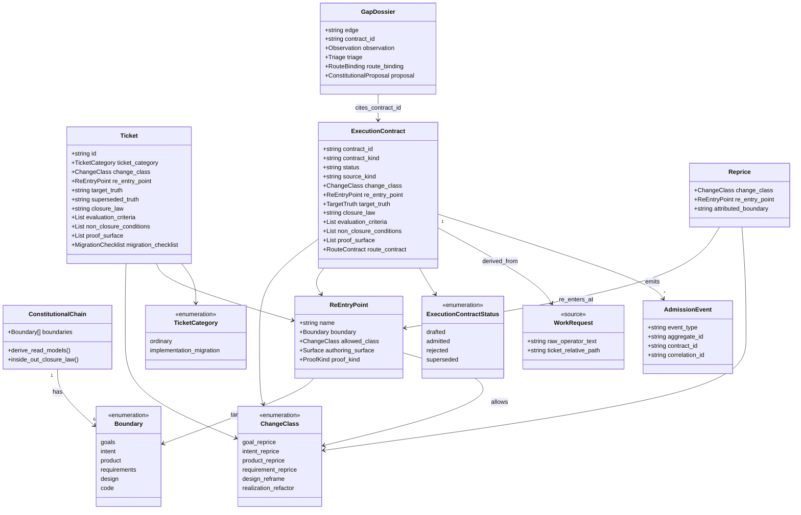
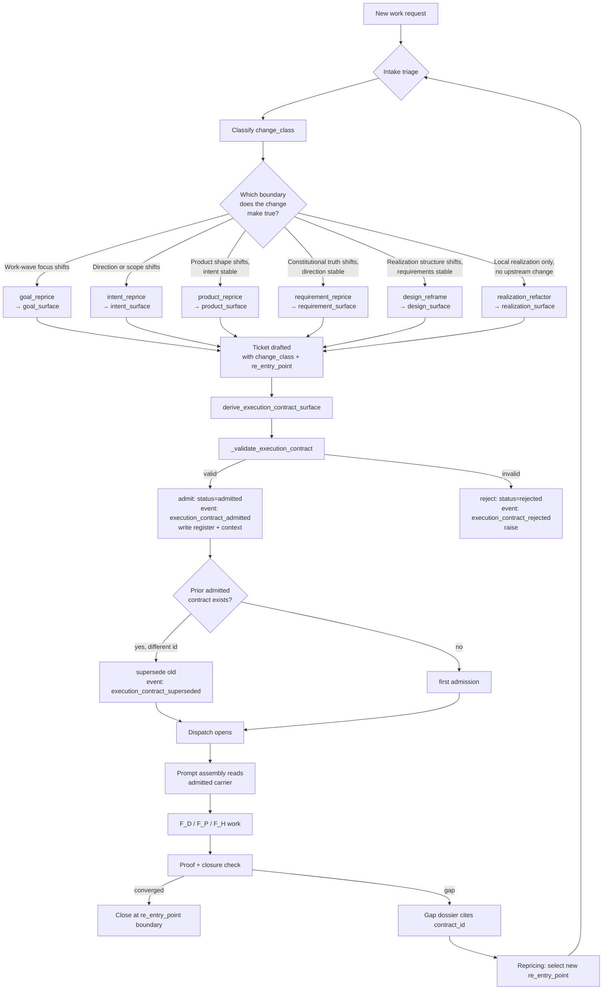
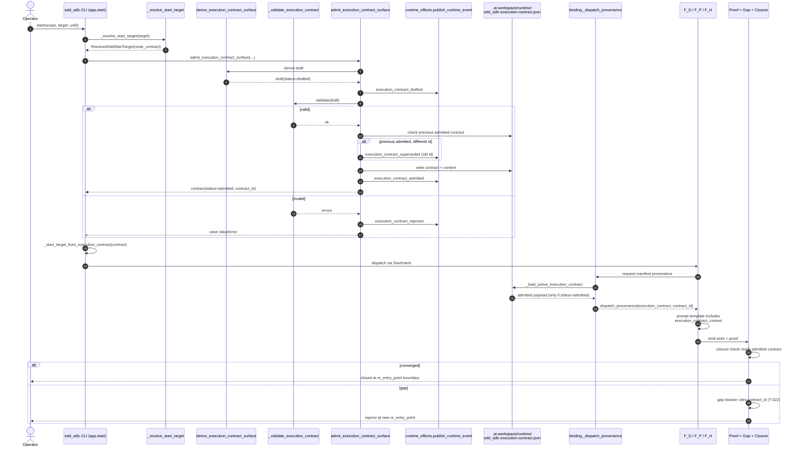
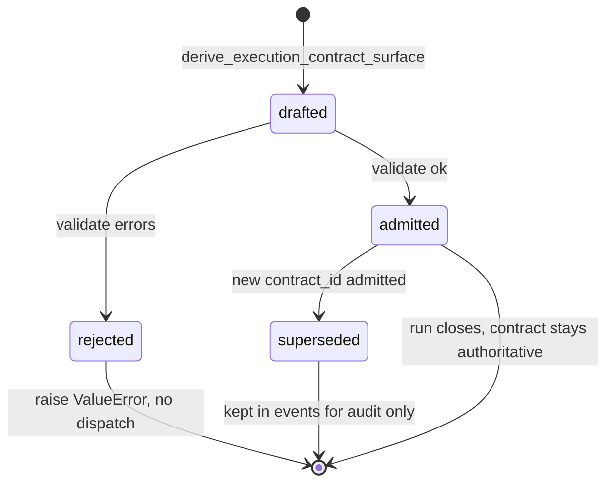
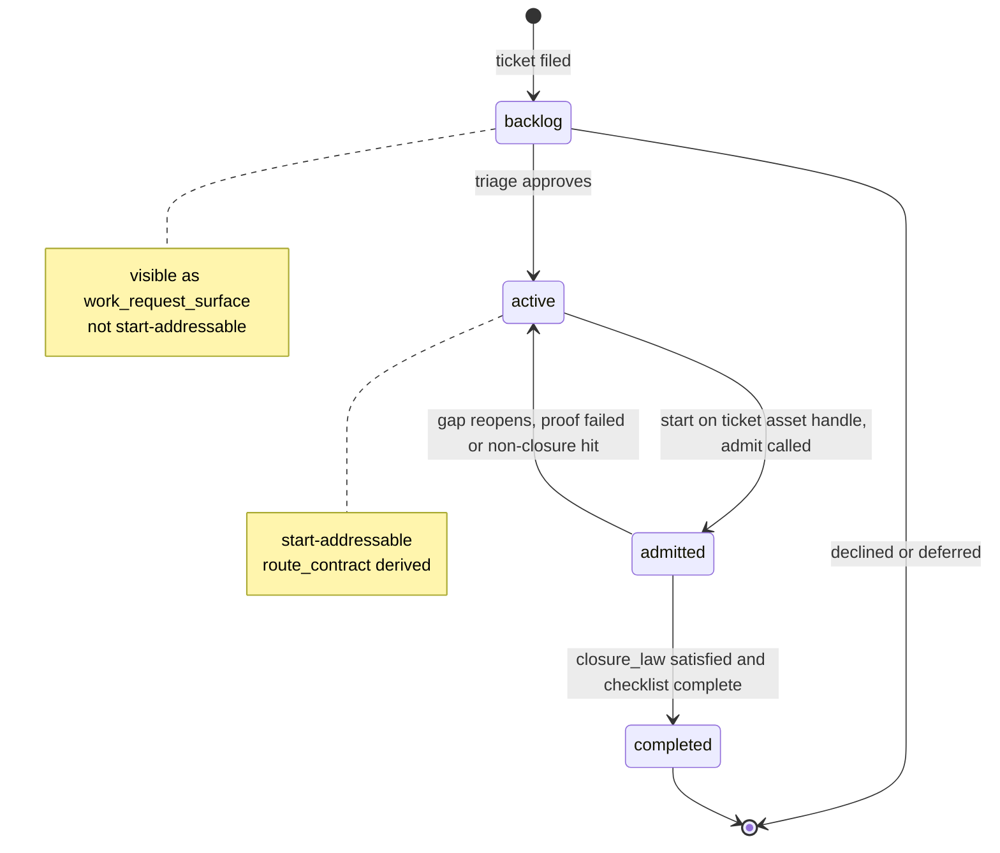
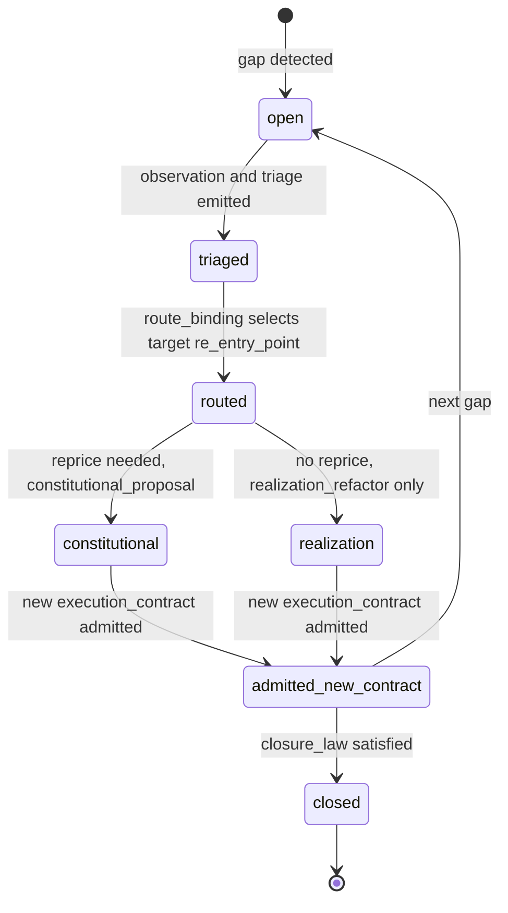
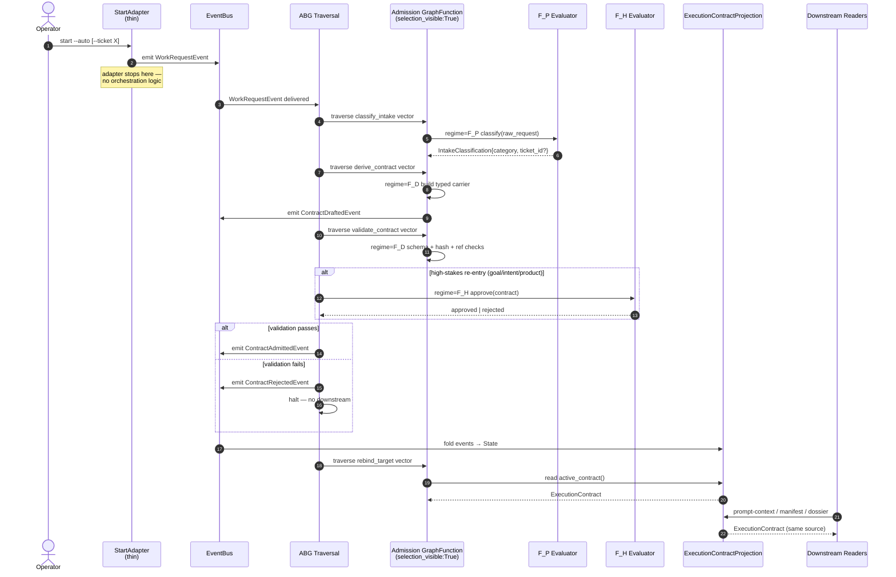
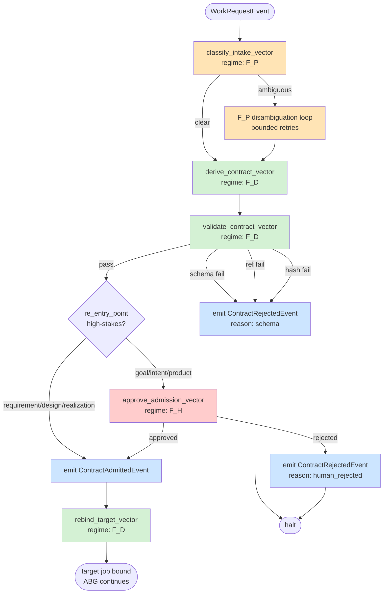

# SCHEMA: SDLC Re-Entry Points — Domain Model, Flow, Sequence, State

**Author**: claude
**Date**: 2026-04-20
**Addresses**: the current odd_sdlc process refactor — re-entry points,
change classes, execution-contract admission, T-023/T-022 work
**Status**: Draft — commentary, not ratified

## Summary

There are not "many" re-entry points — there are **six**, and each one
corresponds to exactly one boundary of the constitutional chain. The
chain has six boundaries; therefore the method has six re-entry points.
Any fewer and some class of change has no lawful entry; any more and the
taxonomy is redundant.

A re-entry point answers one question: *at which boundary of the
constitutional chain does this change first become true?* That boundary is
then the upstream source carrier for the work, and everything downstream
of it is a read-model that re-derives from the new truth.

The constitutional chain:

```
Goals → Intent → Product → Requirements → Design → Code → Events →
  Projection → Delta → Scenarios → Gap → Repricing
```

The six authoring boundaries (where truth can change) are the left six:
Goals, Intent, Product, Requirements, Design, Code. Everything after
Code is derived / observational — it is not a place where authoring
happens, so it has no re-entry point. Repricing loops back to whichever
boundary the gap attributes to.

The execution_contract_surface (T-023) is the **admission** layer on top
of this. It does not add a seventh re-entry point. It names *which* of
the six re-entry points this particular run is entering through, so the
runtime, prompt, dossier, closure, and proof surfaces all agree.

Diagrams below use Mermaid UML.

---

## 1. Domain Model — UML Class Diagram



### Why each class exists

- `ConstitutionalChain` — the source-of-truth ordering. Every other
  class is defined against it.
- `Boundary` — one of six places where authoring truth can change.
- `ReEntryPoint` — the named pair (boundary, change class, surface).
  Six of them. Not arbitrary.
- `ChangeClass` — the class of motion (reprice vs reframe vs refactor).
  One per re-entry point.
- `Ticket` — a human-written declaration of intent to change at a
  specific re-entry point. It is the *input* to admission.
- `ExecutionContract` — the admitted runtime carrier. It is the *output*
  of admission. Prompt, manifest, dossier, closure, and proof all read
  from it.
- `WorkRequest` — raw intake (operator text or ticket markdown). Never
  runtime-authoritative on its own.
- `AdmissionEvent` — the append-only record of drafted / admitted /
  rejected / superseded transitions.
- `GapDossier` — downstream read-model that (post-T-022) cites the
  admitted contract_id.
- `Reprice` — a later re-entry at a re-entry point attributed from a
  gap. Closes the loop.

---

## 2. Flowchart — Re-Entry Point Selection



### Why so many branches at D?

Each branch represents a different *upstream consequence*. A change at
`goal_surface` invalidates every downstream read-model (intent, product,
requirements, design, code). A change at `design_surface` invalidates
only code. A `realization_refactor` invalidates nothing upstream. Naming
the re-entry point is how the method knows **what to re-derive and what
to leave alone**.

Collapsing all six into "fix it" would mean every bug re-derives
everything — which is either prohibitively expensive or (more commonly)
not done at all, producing drift between the layers.

---

## 3. Sequence Diagram — Admission Flow



### Reading this

Steps 3–11 are the **admission boundary**. Before admission, only raw
operator phrasing and ticket markdown exist. After step 11, there is one
admitted `contract_id` that every later consumer reads. The admission
event chain is append-only and visible to later auditing.

Steps 13–16 are the **one-truth read**. `_load_active_execution_contract`
at `.genesis/genesis/binding.py:1855` filters to `status == "admitted"`
— drafted / rejected / superseded registers silently return empty
provenance, so stale state never leaks into prompts.

---

## 4. State Diagrams

### 4a. Execution Contract Lifecycle



**Why this matters**: `admitted` is the only status that reaches prompt
/ manifest / closure. `superseded` is historical. `rejected` never
reaches work at all.

### 4b. Ticket Lifecycle (intake to admission)



**Why backlog ↛ admitted directly**: four-layer gate — route contract
filter (work_item_routing.py:156), asset ownership index filter
(app.py:333), resolve_start_target raise (test line 1219), and validator
re-check (execution_contract.py:246). Backlog cannot leak into execution.

### 4c. Repricing Loop



This is where "why so many re-entry points" is answered materially: a
gap at `design_surface` may attribute to `requirements_surface` (wrong
requirement) or to `realization_surface` (code doesn't match design).
The routing decision — which re-entry point to use — is the same
taxonomy as the original change classes. Reprice lives in the same
coordinate system as first-time authoring, by design.

---

## 5. "Why so many re-entry points?" — the direct answer

Six, not many.

Six = six boundaries where authoring truth can change.

| # | Re-entry point | Change class | What changed | What is re-derived downstream |
|---|---|---|---|---|
| 1 | `goal_surface` | `goal_reprice` | Current work-wave focus | Intent + everything downstream |
| 2 | `intent_surface` | `intent_reprice` | Direction / scope | Product + downstream |
| 3 | `product_surface` | `product_reprice` | Product shape (intent stable) | Requirements + downstream |
| 4 | `requirement_surface` | `requirement_reprice` | Constitutional truth (direction stable) | Design + downstream |
| 5 | `design_surface` | `design_reframe` | Realization structure (requirements stable) | Code |
| 6 | `realization_surface` | `realization_refactor` | Local code (no upstream change) | — |

The method has one re-entry point per authoring boundary because each
boundary re-derives a different downstream scope. Collapsing them into
"just fix the code" is the drift mode the method was written to stop.

The `execution_contract_surface` admission (T-023) does **not** add a
seventh re-entry point — it names *which of the six* this particular run
is entering through, and publishes that choice as runtime truth so
prompt, manifest, dossier, closure, and proof all agree. Before T-023
that choice was implicit (in ticket markdown, in operator phrasing, in
the dispatched prompt). After T-023 it is explicit and log-carried.

That is why the refactor looks like "so many surfaces" — there are six
authoring re-entry points plus one admission carrier over them. The
admission carrier is not a new authoring point, it is the shared
bottleneck that forces all six to be read the same way.

---

## 6. Where each thing lives (code anchors)

- `ChangeClass` taxonomy: `specification_methodology/specification/standards/SPEC_METHOD.md`
  and `CLAUDE.md` Lawful Re-Entry section.
- Ticket format: `specification_methodology/specification/standards/TICKET_METHOD.md`.
- `execution_contract_surface`:
  `odd_sdlc/build_tenants/python/code/odd_sdlc/execution_contract.py`.
  - `derive_execution_contract_surface` line 335.
  - `admit_execution_contract_surface` line 384.
  - `_validate_execution_contract` line 236.
- Admission callsite: `odd_sdlc/build_tenants/python/code/odd_sdlc/app.py:886`.
- Backlog gate: `odd_sdlc/build_tenants/python/code/odd_sdlc/work_item_routing.py:22,156`
  plus `app.py:333` and `execution_contract.py:246`.
- Published graph functions:
  `odd_sdlc/build_tenants/python/code/odd_sdlc/gtl_module.py:1218,1239` —
  `selection_visible: False` (published, not yet graph-traversed).
- Downstream reader: `odd_sdlc/.genesis/genesis/binding.py:1855-1903`.
- Prompt slot: `odd_sdlc/build_tenants/python/code/odd_sdlc/prompt_template.py:32`.
- Dossier (not yet linked to contract_id — T-022 seam):
  `odd_sdlc/build_tenants/python/code/odd_sdlc/gap_dossier.py`.

---

## 7. Target State — Graph-Driven, Event-Sourced, Functor-Regime-Strict

The gap is not semantic. The right nouns exist. The gap is that those
nouns do not yet **run** the system — they are declared alongside an
imperative procedure that still holds authority. The target state makes
the declared nouns the actual runtime:

1. **The carrier is a typed algebraic sum, not a dict.** Every execution
   contract is either an `OperatorRequestContract` or a
   `TicketWorkItemContract`, discriminated by category, pattern-matched
   at every consumer. No string-keyed `.get()` fallback paths.
2. **Admission is a composed graph of single-purpose vectors, not one
   bundled call.** Classify-intake, derive-carrier, validate-carrier,
   emit-admission, rebind-target are separate vectors. Each carries its
   own regime and its own evaluator. Bundled orchestration in
   `app.start()` is dissolved.
3. **Events are the only write path. Projection is the only read path.**
   The per-run register file becomes an **optimization** over the event
   log, not a second authority surface. Reconstruction uses
   `fold(events)` — the register is a snapshot cache with a version tag.
4. **Every transition declares its functor regime explicitly.** `F_D`
   vectors are pure validation/derivation (schema, hash, derivation
   rules). `F_P` vectors are bounded agent disambiguation (intake
   classification when ambiguous, change-class inference). `F_H` vectors
   are human approval gates (high-stakes re-entry, proof overrides). No
   vector silently mixes regimes.
5. **The graph functions are the runtime. `selection_visible: True`**
   everywhere admission flows; traversal chooses them, not a Python
   caller. `app.start()` becomes a thin adapter that emits
   `WorkRequestEvent` and hands control to ABG.
6. **Downstream consumers read projection, not the register.**
   `gap_dossier`, prompt-context, manifest-dispatch, and transport all
   pull from the same `ExecutionContractProjection` reader protocol.
   One reader, many consumers.

That is the target. The current state declares items 1–6 in words and
graph-function entries, and implements a procedural workflow that
happens to produce register files that match. The break from declared
to realized is still ahead.

---

## 8. Target Class Diagram

```mermaid
classDiagram
    class ExecutionContract {
        <<sealed>>
        +contract_id: str
        +event_id: str
        +status: ContractStatus
        +admission_proof: ProofRef
    }

    class OperatorRequestContract {
        +category: "ordinary"
        +change_class: ChangeClass
        +re_entry_point: ReEntryPoint
        +request_text: str
    }

    class TicketWorkItemContract {
        +category: "ticket"
        +ticket_id: str
        +change_class: ChangeClass
        +re_entry_point: ReEntryPoint
        +acceptance_criteria: List
        +proof_conditions: List
    }

    ExecutionContract <|-- OperatorRequestContract
    ExecutionContract <|-- TicketWorkItemContract

    class ContractStatus {
        <<enumeration>>
        drafted
        admitted
        rejected
        superseded
    }

    class ChangeClass {
        <<enumeration>>
        goal_reprice
        intent_reprice
        product_reprice
        requirement_reprice
        design_reframe
        realization_refactor
    }

    class ReEntryPoint {
        <<enumeration>>
        goal_surface
        intent_surface
        product_surface
        requirement_surface
        design_surface
        realization_surface
    }

    class WorkRequestEvent {
        +event_id: str
        +source: AdapterKind
        +payload: RawRequest
    }

    class ContractDraftedEvent {
        +event_id: str
        +parent_event_id: str
        +contract: ExecutionContract
        +derived_by_regime: Regime
    }

    class ContractAdmittedEvent {
        +event_id: str
        +parent_event_id: str
        +contract_id: str
        +evaluator: EvaluatorRef
        +proof: ProofRef
    }

    class ContractRejectedEvent {
        +event_id: str
        +parent_event_id: str
        +contract_id: str
        +evaluator: EvaluatorRef
        +reason: RejectionReason
    }

    WorkRequestEvent <.. ContractDraftedEvent : parent
    ContractDraftedEvent <.. ContractAdmittedEvent : parent
    ContractDraftedEvent <.. ContractRejectedEvent : parent

    class ExecutionContractProjection {
        +fold(events: Seq~Event~) State
        +active_contract() Option~ExecutionContract~
        +history() Seq~ExecutionContract~
    }

    class ExecutionContractRegistry {
        <<protocol>>
        +read_active() Option~ExecutionContract~
        +read_by_id(id: str) Option~ExecutionContract~
    }

    ExecutionContractProjection ..|> ExecutionContractRegistry

    class Regime {
        <<enumeration>>
        F_D
        F_P
        F_H
    }

    class Vector {
        <<abstract>>
        +regime: Regime
        +input_type: Type
        +output_type: Type
    }

    class ClassifyIntakeVector {
        +regime: F_P
    }

    class DeriveContractVector {
        +regime: F_D
    }

    class ValidateContractVector {
        +regime: F_D
    }

    class ApproveAdmissionVector {
        +regime: F_H
    }

    Vector <|-- ClassifyIntakeVector
    Vector <|-- DeriveContractVector
    Vector <|-- ValidateContractVector
    Vector <|-- ApproveAdmissionVector
```



Key target-state properties:
- `ExecutionContract` is a **sealed sum type**. Python achieves this via
  `Union[OperatorRequestContract, TicketWorkItemContract]` plus a
  discriminator field, or via `typing.TypeGuard`. Consumers
  `match/case` on category; no `dict.get("category")` paths survive.
- Events are **parent-linked**. Every contract event names its parent
  event. Replay reconstructs the chain without side channels.
- Projection is a **pure fold**. The register file is an optional
  snapshot cache with a cache-validity event_id. If the cache is
  missing, projection re-folds. If the cache disagrees with projection,
  projection wins.
- `Vector` subclasses encode regime at the type level. An `F_D` vector
  cannot contain agent-call code; the type system refuses to compile
  it.

---

## 9. Target Sequence Diagram



Target-state invariants visible in this diagram:
- **Adapter is thin.** It translates one CLI call into one event and
  stops. No target-derivation, no admission call, no intake resolve.
- **ABG traversal is the runtime.** Each vector is a graph-function
  step chosen by traversal, not by Python control flow.
- **Every transition is an event.** Admission is not a method return
  value; it is a `ContractAdmittedEvent` that projection folds.
- **Regime is explicit per vector.** The diagram labels F_D / F_P / F_H
  per step. A future audit can walk every vector and confirm its
  regime; today, regime is inferred from code shape.
- **Projection is the single reader surface.** Manifest, prompt,
  dossier, and transport all go through the same reader protocol.

---

## 10. Target Functor-Regime-Per-Vector Flowchart



Legend:
- Green = `F_D` deterministic vectors (schema, hash, derivation, rebind)
- Orange = `F_P` probabilistic vectors (agent disambiguation)
- Red = `F_H` human approval vectors (high-stakes re-entry only)
- Blue = event emission nodes (the only write path)

---

## 11. Gap Analysis Matrix — Declared vs Realized

| # | Concern | Current State (declared) | Current State (realized) | Target State | Primary Break |
|---|---------|--------------------------|--------------------------|--------------|---------------|
| 1 | **Controller law** | `app.start()` is documented as a thin dispatcher | 75-line orchestration procedure at `app.py:872-946` owning intake resolve + admission call + target re-derive + prompt build | Adapter emits one event; ABG traversal owns orchestration | Break 5 |
| 2 | **Carrier shape** | Typed contract with category discriminator | Dict-shaped payload; every consumer does `.get()` with fallbacks; `execution_contract.py:109-150` hardcodes `realization_refactor` for ordinary path | `Union[OperatorRequestContract, TicketWorkItemContract]`; `match/case` at every reader | Break 1 |
| 3 | **Bundled admission** | Six vectors (classify, derive, validate, admit, rebind, rebind-target) | One bundled call `admit_execution_contract_surface` at `execution_contract.py:384` does derive+validate+register-write+emit in one frame | Six `selection_visible: True` vectors, each emitting its own event | Break 2 |
| 4 | **Register authority** | Events are the only write path | Register file at `.ai-workspace/runtime/odd_sdlc-execution-contract-register.json` is a second authority surface; `binding.py:1855` reads register, not events | Register is a projection snapshot cache with event_id cache-key; projection from events wins on conflict | Break 3 |
| 5 | **Declarative theater** | Admission runs as graph-function traversal | `GF_DERIVE_EXECUTION_CONTRACT` and `GF_ADMIT_EXECUTION_CONTRACT` at `gtl_module.py:1218,1239` declare `selection_visible: False` — published in the module but not chosen by traversal | All admission graph functions `selection_visible: True`; ABG chooses them | Break 4 |
| 6 | **Functor regime mixing** | Three regimes F_D/F_P/F_H with disjoint responsibilities | Admission call mixes schema validation (F_D) and contract construction (F_D) with intake classification that may need F_P in one procedure; regime is implicit | Each vector is a typed `Vector` subclass with explicit `regime` field; F_P isolated to classify-intake; F_H isolated to approve-admission on high-stakes | Break 2 + Break 4 |
| 7 | **Downstream projection linkage** | Gap dossier and all consumers read one projection | `gap_dossier.py` uses triage/observation/route_binding/constitutional event ids only, no `contract_id` linkage; T-022 consumes T-023 shape without pulling admission evidence | Dossier + prompt + manifest + transport all go through `ExecutionContractProjection` reader protocol | Break 6 |

---

## 12. Sequenced Breaks — "Make and Break" Plan

Each break is ordered so the previous chain becomes **impossible**
before the next break starts. No parallel tracks. No backward
compatibility shims. If a break is done correctly, reverting the next
break will not work because the prior break has already removed the old
seam.

### Break 1 — Typed algebraic carrier

**Change.** Replace the dict-shaped `ExecutionContractSurface` payload
with `Union[OperatorRequestContract, TicketWorkItemContract]`. Add a
discriminator protocol. Remove every `.get("category")` / `.get("kind")`
fallback at consumers.

**What stops working.** Any reader that assumed string-keyed access
breaks loudly. `execution_contract.py:109-150`
`_ordinary_execution_contract` can no longer hardcode
`change_class="realization_refactor"` — the type forces an explicit
operator-request change-class.

**Proof.** All consumers are `match/case` over the sum type. No
`isinstance(dict)` or `.get(` pattern remains for the contract. Grep
proof: `rg "execution_contract.*\.get\(" → 0 hits`.

### Break 2 — Separate admission vectors

**Change.** Split `admit_execution_contract_surface` into five
single-purpose graph functions: `classify_intake`, `derive_contract`,
`validate_contract`, `approve_admission` (F_H, high-stakes only),
`emit_admitted`. Each vector carries a typed `regime` field. Remove the
bundled public function.

**What stops working.** `app.start()` cannot call one admission entry
point. Anything that imported `admit_execution_contract_surface`
breaks.

**Proof.** Five vectors, five regimes declared at module level.
`ValidationError` raised if any vector mixes regimes. `grep
"admit_execution_contract_surface" → 0 hits outside the removal
commit`.

### Break 3 — Events as the only write path

**Change.** Contract state is written **only** by event emission.
Register file is rewritten by a projection consumer, not by admission
code. Reads go through `ExecutionContractProjection.active_contract()`
which folds events; register becomes a cache with
`cache_valid_at_event_id`.

**What stops working.** Any code path that writes to the register
directly breaks. `_write_if_changed` at `execution_contract.py:23` is
removed from admission code path and becomes a projection-side cache
writer.

**Proof.** Register file rebuildable from events alone.
`PYTHONPATH=.genesis python -m genesis rebuild-projection --workspace .`
produces byte-identical register file. Deleting the register and
re-reading still returns correct active contract (via fold).

### Break 4 — Real graph-traversal admission

**Change.** Flip all admission graph functions to `selection_visible:
True`. ABG traversal selects them. Remove the direct Python calls to
the admission functions from `app.start()`. Add an
`ExecutionContractAdmissionGraph` published module.

**What stops working.** `app.start()` no longer has a line that calls
admission. If ABG traversal does not reach admission, intake fails
before downstream — a visible failure, not silent drift.

**Proof.** `events.jsonl` shows a `graph_vector_traversed` event for
every admission step in every successful start. No start completes
without matching traversal events. Removing the published graph causes
start to fail with "no admission graph published", not with silent
success.

### Break 5 — Thin adapter

**Change.** `app.start()` collapses to ~10 lines: parse CLI args,
construct `WorkRequestEvent`, emit to bus, return. All target
derivation, intake resolve, module-with-injected-target-job, and
prompt build move behind traversal vectors driven by the projection
reader.

**What stops working.** Anything that imported helpers from `app.py`
for target derivation breaks. `_resolve_start_target`,
`_start_target_from_execution_contract`,
`_module_with_injected_target_job` either move into vectors or are
deleted.

**Proof.** `app.py` `start()` function body ≤ 15 lines. No function in
`app.py` reads the register file or builds a manifest. End-to-end test
still passes: `test_ticket_asset_start_carries_ticket_execution_context_into_manifest_prompt`.

### Break 6 — Downstream projection linkage (closes T-022)

**Change.** `gap_dossier.py`, prompt template, manifest dispatch, and
transport all consume `ExecutionContractProjection` via a shared reader
protocol. Dossier rows carry `contract_id` so gap analysis traces back
to the admitted contract that motivated the work.

**What stops working.** Any downstream consumer still reading the
register directly breaks — register is now projection-only. Dossiers
generated before this break cannot be linked to contracts; a migration
event is required.

**Proof.** `gap_dossier.py` imports `ExecutionContractProjection`.
Dossier schema includes `contract_id` non-null for any row whose
originating triage event post-dates Break 3. T-022 acceptance criterion
"dossier links to admitted contract" passes.

---

### Closure Mapping

- Breaks 1–5 close **T-023** (source-carrier migration). T-023 becomes
  complete at the end of Break 5, not at admission — because the
  six-vector-graph-traversal realization is what T-023 ultimately
  promises, not just the register file.
- Break 6 closes **T-022** (gap-analysis dossier) because projection
  linkage is what makes dossier rows meaningfully traceable.
- No break introduces a backwards-compat shim. Each break removes the
  prior seam before the next one lands. The progression is
  one-directional.

The current state is a **declarative skin over an imperative spine**.
The sequenced breaks replace the spine one vertebra at a time, each
vertebra forcing the next. When Break 6 lands, the declared nouns are
the runtime.
