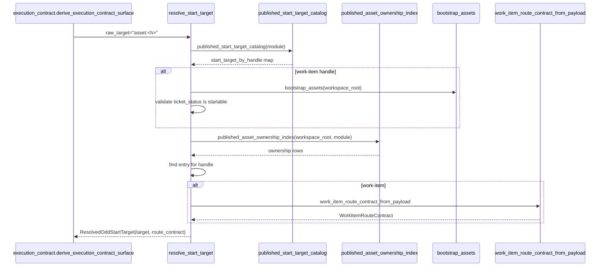
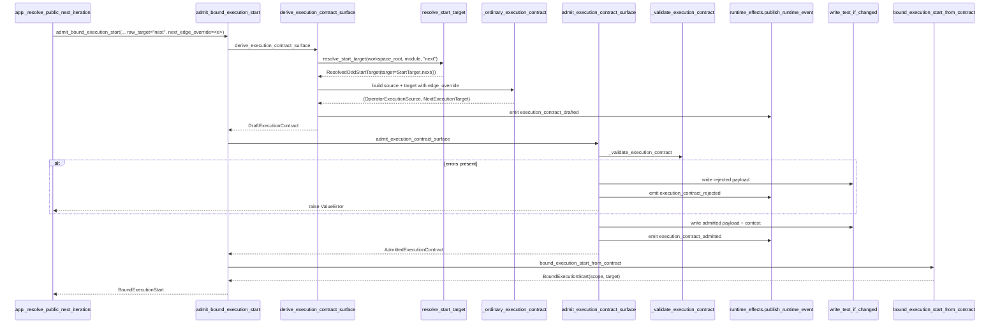

# REVIEW: S-037 Deliverable 2a — Public Control Cluster (app.py, start_targeting.py, execution_contract.py)

**Author**: claude
**Date**: 2026-04-23T00:01:00Z
**Addresses**: S-037 §Deliverables 2 and §Core Review Set (`app.py`, `start_targeting.py`, `execution_contract.py`); consumes the taxonomy from post 01
**Status**: Open

## Summary

This post reviews the three files that jointly own the public `start`/`gaps` surface and the admission carriers that feed it. `app.py` is the only lawful public control surface. `start_targeting.py` resolves raw-target strings to `ResolvedOddStartTarget` carriers. `execution_contract.py` defines the admission carrier family (`DraftExecutionContract` → `AdmittedExecutionContract` → `BoundExecutionStart`) and the admission kernel that publishes it.

Overall the cluster is closer to the target shape than the rest of the repair-wave narrative suggests. The new B-035 slice (`_resolve_public_next_iteration` + `PendingConstitutionalStartGate`) is a clean inside-out migration. The fault lines that remain are:

1. **`start(target != "next")` does not consult the published head-gap carrier** — B-035's new guard is tucked inside the `target == "next"` branch of `app.start`, so operator-driven or explicit-target starts still enter the constructive path past a `pending_fh` head.
2. **`_run_public_next_start` still carries a large procedural tail** — lines 544–708 enumerate stop predicates (`dispatch_required`, `human_gate_required`, `traversal_applied`) and local proof-hold/auto-dispatch logic directly against the runtime result dict. This is where B-036's yield-projection defect lives: `dispatch_result.status == "yield"` is recognized but terminal-error and yield cases are distinguished by string inspection, not by a typed result carrier.
3. **`execution_contract._render_execution_contract_context` is a 60-line prose formatter living next to admission law** — an effect-shell concern smuggled into the kernel file.

## Analysis

### `app.py` — role confirmed: Binding/adapter + public control surface (also thin Effect shell for gate emission)

File purpose: bootstraps an `OddSdlcApp` from config, exposes the public `gaps`, `gap_snapshot`, `iterate`, `start`, `catalog`, `active_programs` functions.

Top-level function inventory (exported / semantic):

| Function | Role | Notes |
|---|---|---|
| `bootstrap`, `initialize` | Binding | constructs `OddSdlcApp` from `AppConfig` |
| `gaps`, `gap_snapshot`, `_build_gap_surface` | Binding + orchestration over published carriers | calls `gen_gaps` → `enrich_gap_snapshot` → `canonical_edge_gaps` → `aggregate_edge_gap_truth` → `build_gap_dossier_register` → `publish_gap_dossier_surfaces` |
| `iterate` | Binding | thin pass-through to `gen_iterate` |
| `start` | Public control surface | splits on `target == "next"` vs explicit target |
| `_run_public_next_start` | Public control surface tail | 50-iteration loop handling FH gate / dispatch / proof hold / traversal / yield |
| `_resolve_public_next_iteration` | Semantic kernel (local) | matches `project_public_next_start_resolution` output to `PendingConstitutionalStartGate` / `PublicNextStartBlock` / `PublicNextStartDirective` and calls `admit_bound_execution_start` on the directive case |
| `_publish_pending_constitutional_start_gate` | Effect shell | emits `fh_gate_pending` |
| `_apply_pending_constitutional_human_proxy` | Effect shell | delegates to `homeostatic_loop.apply_constitutional_proposal` |
| `_attach_public_next_result_metadata` | Projection helper | decorates result dict with `target`/`fh_mode`/`root_mode` |
| `_republish_public_next_homeostatic_surface` | Effect shell | `refresh_analysis` + `_build_gap_surface(publish=True)` |
| `catalog`, `active_programs` | Projection | static catalog surface |

#### Sequence diagram — `app.start(target="next", until="converged")`

```mermaid
sequenceDiagram
    participant Op as Operator / CLI
    participant App as app.start
    participant Loop as _run_public_next_start
    participant Iter as _resolve_public_next_iteration
    participant GD as load_gap_dossier_read_model
    participant Proj as project_public_next_start_resolution
    participant EC as admit_bound_execution_start
    participant ABG as gen_start / auto_dispatch_from_result
    participant Rep as _republish_public_next_homeostatic_surface

    Op->>App: start(scope, target="next", until="converged")
    App->>App: ensure_workspace_ready; parse_gap_scope_selector
    App->>Loop: _run_public_next_start
    loop up to 50 iterations
        Loop->>Iter: resolve next iteration
        Iter->>GD: load_gap_dossier_read_model(workspace_root)
        GD-->>Iter: gap dossier surface
        Iter->>Proj: project_public_next_start_resolution(surface)
        alt PendingConstitutionalStartGate
            Iter->>App: _publish_pending_constitutional_start_gate
            Iter-->>Loop: (None, None, gate.to_start_result())
            Loop-->>App: return blocked_result
        else PublicNextStartBlock
            Iter-->>Loop: (None, None, block.to_start_result())
            Loop-->>App: return blocked_result
        else PublicNextStartDirective
            Iter->>EC: admit_bound_execution_start(directive)
            EC-->>Iter: BoundExecutionStart
            Iter-->>Loop: (directive, bound_start, None)
            Loop->>ABG: gen_start(intent)
            ABG-->>Loop: result dict
            alt status in {converged, nothing_to_do}
                Loop-->>App: return
            else stop_predicate == traversal_applied
                Loop->>Rep: refresh + republish
            else stop_predicate == dispatch_required
                Loop->>ABG: auto_dispatch_from_result
                alt dispatch ok
                    Loop->>Rep: refresh + republish
                else dispatch yield
                    Loop-->>App: return yield-shaped result
                else dispatch error
                    Loop-->>App: return failure-shaped result
                end
            else stop_predicate == human_gate_required && fh_mode == human-proxy
                Loop->>Rep: _emit_human_proxy_approval + refresh + republish
            else
                Loop-->>App: return with stopped_by
            end
        end
    end
```

#### Fault lines in `app.py`

- **F-01 Split-brain gate consult (B-035 partial fix).** `app.start` only routes through `_run_public_next_start` when `target.strip() == "next"`. For `target in {graph_function:*, asset:*, <ticket>}`, the function goes directly to `admit_bound_execution_start` without the gate check. The published `pending_fh` on `derive_intent_surface` is only consulted on the `next` path. The fix is structural: the head-gap consult is not target-type-specific; it should wrap every `start` that would admit an execution contract while a head-edge `pending_fh` is published. Category: **incomplete migration** (also **split carrier vs controller authority** — the controller decides which target types get the carrier consult).
- **F-02 Yield vs terminal-error projection at dispatch tail.** `_run_public_next_start` lines 678–683 distinguish `dispatch_result.status == "yield"` from other error statuses by string check. The `continuation_opened` truth from ABG is not surfaced here as a typed carrier; the operator-facing projection is built ad hoc. This is exactly what B-036 is about. Category: **interface bleed** (ABG runtime status strings are reinterpreted at the public boundary) + **hidden semantic center** (the controller decides whether a dispatch result is yield or failure).
- **F-03 `_run_public_next_start` carries too many decisions for an effect shell.** Proof-hold computation, auto-dispatch, republish cadence, `human_gate_required` handling, max-iteration limiter, and result-dict mutation all live in one 164-line function. The lawful shape is a kernel that emits a typed `PublicNextIterationOutcome` carrier (`ConvergedResult` | `BlockedResult` | `YieldedResult` | `FailureResult` | `ContinueSignal`) and an effect shell that drives the loop on that carrier. Category: **hidden semantic center** (a controller loop reads meaning from runtime result dicts instead of matching on a typed carrier).
- **F-04 Result-dict mutation.** `result["stop_predicate"]`, `result["stopped_by"]`, `result["proof_hold"]` etc. are assigned onto the ABG runtime dict in place. The public result shape is therefore implicitly derived by in-place decoration rather than constructed from a typed public-result carrier. Category: **effect leakage / hidden mutation**. Related to F-02; fixing F-02 cleanly will solve F-04.
- **F-05 Capability augmentation is local to app.py.** `_augment_raw_gap_payload_with_capability_truth` (not shown in excerpt, lines 174–198) reaches into the raw gap payload to decorate it with capability truth before triage runs. This blurs the carrier ownership: capability truth should flow as its own typed carrier into either `span_analysis` or `gap_dossier`. Category: **interface bleed** (app.py is deciding capability-gap meaning inline).

Design-choice justification per function:

- `gaps` / `gap_snapshot` / `_build_gap_surface`: lawful — these are the single authoritative publication site for the homeostatic carrier, and the shape is kernel-call-chain rather than orchestration over mutable state. The only wart is the capability augmentation (F-05).
- `_resolve_public_next_iteration`: **lawful and prime** — one match on the typed resolution, one call to the admission edge. This is the B-035 kernel that should have existed all along.
- `_run_public_next_start`: lawful but over-coupled — see F-02/F-03/F-04. Refactor candidate.
- `start`: the top of the split-brain lives here (F-01). Refactor candidate.
- Effect shells (`_publish_pending_constitutional_start_gate`, `_apply_pending_constitutional_human_proxy`, `_republish_public_next_homeostatic_surface`): lawful and prime — each is a single effect edge.

### `start_targeting.py` — role confirmed: Semantic kernel (pure resolver)

File purpose: publishes the start-target catalog over the GTL module, the asset-ownership index, and the `resolve_start_target(raw_target) → ResolvedOddStartTarget` resolver.

Inventory (all top-level):

| Function | Role | Notes |
|---|---|---|
| `graph_function_entries` | Kernel | projects GTL module graph functions into a normalized dict list |
| `published_start_target_catalog` | Kernel | classifies entries as start-addressable or not |
| `_governing_target_handle_for_asset` | Kernel | maps a workspace asset to its governing start target |
| `published_asset_ownership_index` | Kernel | emits the asset ↔ graph-function ownership rows |
| `resolve_start_target` | Kernel | dispatches on `next` / `graph_function:<h>` / `asset:<h>` / work-item |

#### Sequence diagram — `resolve_start_target("asset:<h>")`



#### Fault lines in `start_targeting.py`

- **F-06 Three magic asset-id frozensets (`_REVIEW_DESIGN_ASSET_IDS`, `_OPERATIONAL_CYCLE_ASSET_IDS`, `_NON_ADDRESSABLE_INDEX_ASSET_IDS`).** These encode policy about which asset ids map to which governing graph function handle. The information is declarative but lives inline as module-private constants rather than in a published catalog entry. If a new asset family is added, the decision about its governing target will silently be wrong until this file is updated. Category: **split carrier vs controller authority** (asset ownership is co-authored between the published module and these inline sets). Low priority; ticket-worthy if a fourth set appears.
- **F-07 Fallback to `bootstrap_release_self_test` when no other handle matches.** `_governing_target_handle_for_asset` defaults to the bootstrap handle for any asset not in the three sets. This is a silent fallback that can claim authority over genuinely new asset classes. Category: **hidden semantic center** (a default binding lives in a private helper). Consider making the "no governing handle" case fail-closed.

Otherwise `start_targeting.py` is a clean kernel: no side effects, returns typed `ResolvedOddStartTarget`, fails closed on unknown handles. **Mostly lawful and prime.**

### `execution_contract.py` — role confirmed: Carrier + Semantic kernel + (local) Effect shell

File purpose: defines the contract carrier family (Draft/Admitted/Rejected/Superseded, plus per-source and per-target variants) and the admission kernel. Writes `odd_sdlc-execution-contract.json` and the `-context.md` prose view; emits four `execution_contract_*` event kinds.

Inventory highlights:

| Function | Role | Notes |
|---|---|---|
| `BoundExecutionStart`, `DraftExecutionContract`, `AdmittedExecutionContract`, `RejectedExecutionContract`, `SupersededExecutionContract`, `AdmittedExecutionContractProjection` | Carrier | typed dataclasses, `to_dict` methods |
| `NextExecutionTarget`, `GraphFunctionExecutionTarget`, `AssetExecutionTarget`, `OperatorExecutionSource`, `TicketWorkItemExecutionSource` | Carrier | source / target variants |
| `_execution_target_from_resolved` | Binding | converts `ResolvedOddStartTarget.target` to execution target variant |
| `_ordinary_execution_contract`, `_ticket_execution_contract` | Kernel | build source + target for one contract |
| `_validate_execution_contract` | Kernel | admission predicate |
| `_draft_execution_contract`, `derive_execution_contract_surface` | Kernel + effect edge | emits `execution_contract_drafted` |
| `admit_execution_contract_surface` | Effect edge | writes register, context file, emits `admitted` / `rejected` / `superseded` |
| `bound_execution_start_from_contract` | Kernel | turns admitted contract into `BoundExecutionStart` (module injection included) |
| `admit_bound_execution_start` | Binding | the composite entry point `app.py` calls |
| `load_admitted_execution_contract_projection` | Projection | re-read the register as a typed projection |
| `_render_execution_contract_context` | Effect shell (prose formatter) | 60 lines of markdown assembly |
| `_parse_key_value_lines`, `_bullet_lines`, `_unchecked_checklist_items`, `_coerce_string_list` | Carrier helpers | string parsing for contract payload derivation |

#### Sequence diagram — `admit_bound_execution_start(target="next", edge_override=<e>)`



#### Fault lines in `execution_contract.py`

- **F-08 `raw_target == "next"` requires `next_edge_override`.** Lines 811–814 raise "raw target 'next' is not start-authoritative; resolve the published head gap route before admitting an execution contract". This is a **defensive double-check**, not a semantic kernel decision: it exists because `app.py` is the upstream gatekeeper. If `app.py` is the sole caller, this is lawful belt-and-braces; if anything else calls `derive_execution_contract_surface` with `raw_target="next"` and no override, the error is opaque. Consider making this a typed rejection (`MissingHeadGapOverride`) rather than a `ValueError`. Low-priority but a symptom of split-brain (F-01): one piece of code has to enforce a contract the caller also enforces.
- **F-09 `_render_execution_contract_context` is a prose formatter living in the semantic-kernel file.** 60+ lines of markdown assembly with `to_dict` inspection and checklist rendering. Per DESIGN_MODULE_METHOD §9 Effect-Edge rule, prose delivery is an effect-shell concern, not admission law. Category: **effect leakage into kernel**. Low-priority refactor: move to a `execution_contract_context.py` or a shared prose-delivery module.
- **F-10 Superseded-contract detection inside admission.** Lines 885–909 load the prior contract and, if present and admitted and different, synthesize a `SupersededExecutionContract` and emit `execution_contract_superseded`. This works but blurs two concerns: computing "does this supersede a prior admission?" is a kernel decision; actually loading the file and emitting the event is an effect. The shape works because it's linear (load → decide → emit → admit); just a note that if supersession rules grow, this should split. Category: **lawful but over-coupled**.
- **F-11 `load_admitted_execution_contract_projection` reconstructs the carrier from JSON.** That is necessary — the register is an on-disk read model — but the lossy path (`_admitted_execution_contract_projection_from_payload`) does not round-trip some fields (e.g. payloads of custom source variants). If `gaps` consumes this projection to make a decision, it will silently lose information. Quick check: `_build_gap_surface` loads it only for metadata display. So low impact today. Category: **unstable identity across refresh or reprojection**. Add a structural round-trip test.

Otherwise the contract family is clean: immutable dataclasses, one admission site, typed target/source variants, explicit rejection/supersession paths. **Mostly lawful; refactors are cosmetic unless F-10 grows.**

## Recommended Action

The cluster has one structural defect (F-01) and two design-coupled defects (F-02/F-03) that together account for the B-035 residual and the B-036 defect respectively. Specific recommendations:

1. **F-01 (gate consult across all targets).** Extract `_consult_head_gap_for_public_start(selector) -> PublicNextStartResolution | None` and call it at the top of `app.start`, before the `target == "next"` split. Match on the typed resolution; if `PendingConstitutionalStartGate`, emit and return. If `None` or `PublicNextStartDirective`, proceed to the existing `target == "next"` branch or explicit-target branch. This turns B-035 into a shape-level invariant rather than a per-target opt-in. Track under B-035 checklist item `public odd_sdlc start reads the published homeostatic carrier before admitting execution for target=next` — currently written as `target=next` only; widen to "for any target admission".

2. **F-02/F-04 (yield vs terminal-error).** Introduce a typed `PublicStartIterationOutcome` carrier (variants: `ConvergedResult`, `YieldedResult`, `BlockedResult`, `ProofHoldResult`, `TraversalProgressContinue`, `DispatchRequiredContinue`, `FailureResult`). Build it once from ABG's `dispatch_result` and let `_run_public_next_start` reduce to: for each iteration, match → effect → continue-or-return. This lands B-036 as a carrier change, not string surgery.

3. **F-03 (shell too heavy).** Follow-on to F-02: once the typed outcome exists, the 50-iteration loop is 20 lines of matching. `_republish_public_next_homeostatic_surface` stays as the single refresh edge.

4. **F-05 (capability augmentation).** Move `_augment_raw_gap_payload_with_capability_truth` into `span_analysis.py` next to other raw-gap normalization, or produce a `CapabilityGap` carrier in `project_profile.py` and let `canonical_edge_gaps` merge it. Keep `app.py` free of raw-gap mutation.

5. **F-06/F-07 (asset-id frozensets + default binding).** Add a note to S-037 synthesis; not urgent. If a new asset family is proposed, take this as a trigger to publish asset-governance via the GTL module itself.

6. **F-08/F-09/F-10/F-11 (execution_contract cosmetics).** Mostly fine to leave unless triggered by a new admission scenario. Track F-09 (prose formatter location) and F-11 (projection round-trip) as minor cleanups.

Where these land in active tickets:

- **B-035**: F-01 belongs inside B-035 closure. Current checklist implicitly assumed `target=next` covers the bypass; rewrite the closure clause to cover all target types.
- **B-036**: F-02/F-03/F-04 are the yield migration. They do not require a new ticket; they are B-036 shape.
- **No new tickets required** from this cluster. F-05 to F-11 are justifications for follow-on refactors once B-035/B-036 are closed.
