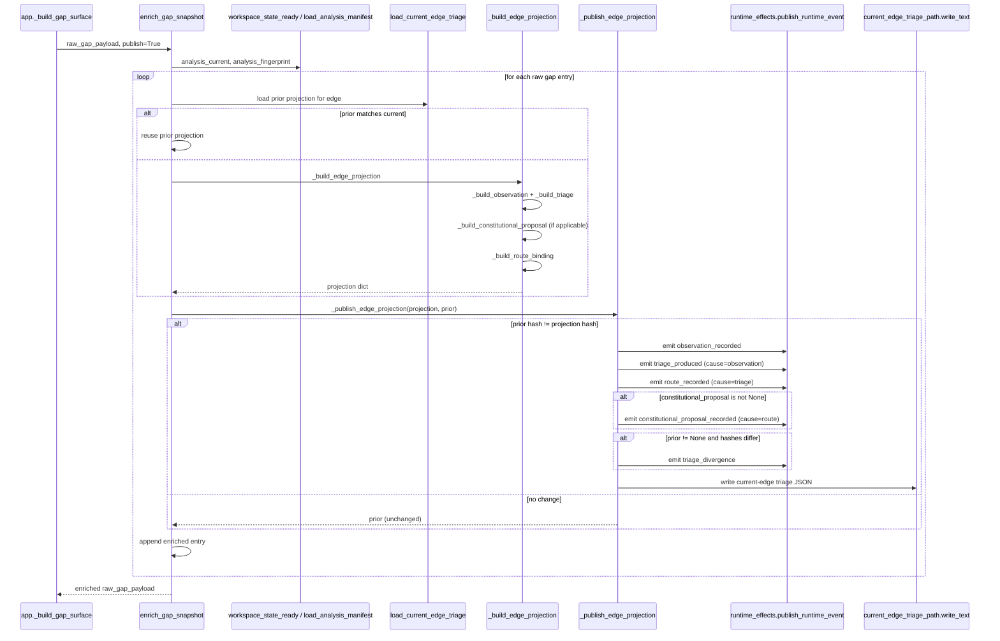
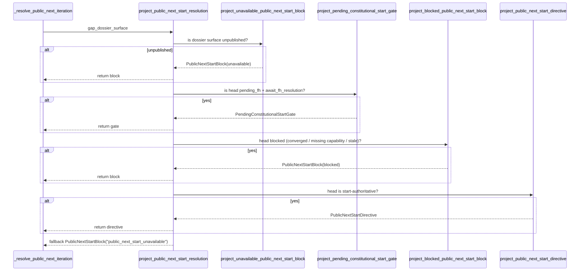
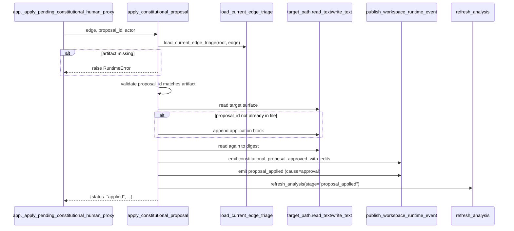

# REVIEW: S-037 Deliverable 2b — Homeostatic Carrier Cluster (gap_dossier.py, triage.py, homeostatic_loop.py)

**Author**: claude
**Date**: 2026-04-23T00:02:00Z
**Addresses**: S-037 §Deliverables 2 and §Core Review Set (`gap_dossier.py`, `triage.py`, `homeostatic_loop.py`); consumes post 01
**Status**: Open

## Summary

This cluster publishes the head-gap truth that the public control surface consumes. `triage.py` converts raw `gen_gaps` entries into typed per-edge projections (observation / triage / route / constitutional) and emits five event kinds. `gap_dossier.py` defines the typed carriers that the public control surface matches on (`PendingConstitutionalStartGate`, `PublicNextStartDirective`, `PublicNextStartBlock`). `homeostatic_loop.py` is the effect shell that applies an approved constitutional proposal to the target surface and reopens the gap.

The cluster is the strongest piece of the repair wave. `gap_dossier.py` is near-textbook carrier+projection shape. The fault lines are concentrated in `triage.py`:

1. **`_build_triage` is one 215-line decision cascade** with a local enumeration of framework layers and process outcomes. It is the semantic kernel, but its structure is procedural rather than compositional.
2. **Constitutional proposal kind is decided inline in `_build_triage`** via `reentry_layer in {"goals", "intent"}`. This is correct for today's wave but is a hidden domain enum smuggled into the cascade.
3. **Projection round-trip is dict-shaped, not carrier-shaped.** `_build_edge_projection` returns a `dict[str, Any]`; consumers downstream (gap_dossier.py, app.py) index it by string keys. The typed carriers live one layer further along in `gap_dossier.py`.

## Analysis

### `triage.py` — role confirmed: Semantic kernel + Effect shell

File purpose: turns `gen_gaps` output into per-edge projections; publishes them as events and current-edge artefacts.

Inventory (semantic surface):

| Function | Role | Notes |
|---|---|---|
| `enrich_gap_snapshot` | Semantic kernel + Effect shell (conditional) | top-level per-edge loop; matches prior triage against current analysis and either reuses or rebuilds; if `publish=True`, calls `_publish_edge_projection` |
| `_artifact_matches_current` | Kernel predicate | decides whether a prior artifact is reusable (analysis fingerprint + work key + event reference currency) |
| `_build_edge_projection` | Kernel | computes `observation`, `triage`, `route_proposal`, `route_binding`, `constitutional_proposal`, `triage_hash` |
| `_build_observation` | Kernel | derives the observation record |
| `_build_triage` | Kernel | decision cascade over 7 framework conditions |
| `_structured_authority_basis` / `_structured_realized_basis` | Kernel helpers | typed basis records |
| `_build_fixed_route_proposal` / `_dynamic_route_candidates` / `_dynamic_route_matches` / `_build_dynamic_route_proposal` / `_assign_route_proposal` | Kernel | route discovery against runtime config |
| `_build_constitutional_proposal` / `_constitutional_policy_mode` / `_constitutional_resolution` | Kernel | mints constitutional proposal carrier |
| `_build_route_binding` | Kernel | computes the route-binding carrier (state + vector + graph function) |
| `_publish_edge_projection` | Effect shell | appends 4+1 event kinds and writes the current-edge JSON artefact |
| `_scan_file_for_shallow_findings` / `_collect_shallow_findings` | Effect (read) | scans workspace files for TODO/FIXME markers |

#### Sequence diagram — `enrich_gap_snapshot(publish=True)`

#### Fault lines in `triage.py`

- **F-12 `_build_triage` is a 215-line procedural cascade.** Lines 715–929 enumerate 8 cases (`not analysis_current`, missing-capability, missing-required-binding, ambiguity, shallow + delta>0, delta>0 + constitutional layer, delta>0 + normal layer, delta>0 + unroutable, delta==0 + complete). Each branch constructs a triage dict of identical shape. This works but it's a classic hidden-enum-in-control-flow: the real domain object is an enumerated `TriageOutcome` (eight variants, each with a gap_kind / process_outcome_kind / resumption_trigger / policy_gate quadruple). Category: **hidden semantic center** (the enumeration of process outcomes lives in an if-else cascade, not in a typed enum/ADT). **Prime Law concern** — the current cascade is not prime because it's aggregating eight semantic boundaries into one function. The fix is to expose a `TriageCase` ADT and one classifier that selects the case, then data-driven construction per case.
- **F-13 Constitutional proposal kind is implicit.** Inside F-12's cascade, the "propose_constitutional_reprice" branch fires when `reentry_layer in {"goals", "intent"}`. In `_build_constitutional_proposal` (not read in this excerpt) the proposal kind is derived from `reentry_layer`. The kind ↔ layer mapping is therefore co-authored across two functions. If `product_reprice` or `requirement_reprice` become auto-proposable, the check in F-12 has to change and the `_build_constitutional_proposal` kind table has to change too. Category: **split carrier vs controller authority** (proposal-kind eligibility is partly in the cascade and partly in the mintor).
- **F-14 Projection is a dict, not a carrier.** `_build_edge_projection` returns `dict[str, Any]`. Downstream `gap_dossier.py` re-packages pieces of it into `GapDossierInputRow` (which is typed), but before that boundary, all consumers (including `_publish_edge_projection` and `enrich_gap_snapshot`'s reuse path) index by string keys. Any renaming silently breaks consumers. Category: **unstable identity across refresh or reprojection** — a typed `EdgeTriageProjection` carrier would make the reuse predicate trivial and the publish path exhaustive-match. Medium-term refactor; moderate risk.
- **F-15 `_publish_edge_projection` fans out five event kinds from one function.** Lines 1044–1190. Each event is lawful and the causation chain (observation → triage → route → constitutional) is clean, but the emitter is doing five prime effects serially. This is the correct shape for a "publication transaction" if the event kinds are always emitted together; however `triage_divergence` is emitted conditionally. Consider a typed `EdgeProjectionPublication` record with one emitter that walks the record. Low priority; shape is honest.
- **F-16 Shallow-findings scan runs inside triage.** `_scan_file_for_shallow_findings` opens files and greps for "TODO"/"FIXME"-type patterns during triage construction. This is a read effect during a kernel call. It's gated on `analysis_current and delta > 0 and framework_layer in {"code", "test"}` so the cost is bounded. Category: **effect leakage into kernel** (file read inside a semantic transform). Mitigation: move the scan into an upstream read shell that produces a `ShallowFindingsIndex` carrier, and let `_build_triage` match on the carrier.
- **F-17 Route-discovery runtime-config shape is procedural.** `_dynamic_route_candidates(runtime_config)` pulls candidate routes from `runtime_config["dynamic_routes"]` (not shown). If the runtime-config shape changes, the triage kernel silently drops candidates. Category: **interface bleed** (runtime-config is an ABG-adjacent carrier leaking into odd_sdlc domain triage). Low-priority; flag for when runtime config gets its own typed carrier.

Design-choice justification summary:

- `enrich_gap_snapshot`: lawful and prime (one loop over raw entries, one publish boundary). The reuse-vs-rebuild short-circuit is a performance optimization and is correctly keyed on analysis fingerprint + work key + event timestamp.
- `_publish_edge_projection`: lawful but the five-event fan-out would be cleaner as a record-driven emit; acceptable today.
- `_build_triage`: **lawful but over-coupled** — the 8-case cascade is the canonical refactor candidate for this cluster. Triage outcomes are the core domain enumeration; they deserve a typed surface.

### `gap_dossier.py` — role confirmed: Carrier + Projection (with one effect edge)

File purpose: define the carriers the public control surface matches on; build the published dossier register/context; provide the resolution projector.

Inventory:

| Function | Role | Notes |
|---|---|---|
| `GapDossierInputRow`, `GapDossierInput` | Carrier | triage input per edge |
| `PendingConstitutionalStartGate`, `PublicNextStartDirective`, `PublicNextStartBlock` | Carrier | typed head-gap resolution variants |
| `PublicNextStartResolution` type alias | Carrier union | |
| `project_gap_dossier_input` | Kernel | normalizes canonical gaps + triage metadata into `GapDossierInput` |
| `build_gap_dossier_register` | Kernel | builds the on-disk register dict from `GapDossierInput` |
| `build_gap_dossier_context` | Kernel | builds the prose context from the register |
| `publish_gap_dossier_surfaces` | Effect shell | writes register JSON and context Markdown |
| `_gap_dossier_unavailable_reason`, `unavailable_gap_dossier_projection` | Projection | fail-closed read model when the register is missing/stale |
| `load_published_gap_dossier_register`, `load_gap_dossier_read_model`, `require_published_gap_dossier_read_model` | Projection | typed loaders |
| `head_gap_dossier` | Projection helper | picks dossier[0] |
| `project_unavailable_public_next_start_block`, `project_pending_constitutional_start_gate`, `project_blocked_public_next_start_block`, `project_public_next_start_directive` | Projection | per-variant projectors |
| `project_public_next_start_resolution` | Projection | master matcher over the four projectors |
| `project_gap_dossier_surface`, `project_gap_dossier_read_model` | Projection | outer read-model wrappers |

#### Sequence diagram — `project_public_next_start_resolution(surface)`

#### Fault lines in `gap_dossier.py`

- **F-18 `head_gap_dossier` silently picks index 0.** Line 485–492. The dossier list's ordering is authored upstream in `build_gap_dossier_register`, which walks `gap_input.rows` in the order `canonical_edge_gaps` returned them. That order is itself inherited from `declared_obligation_specs(app)` + the raw gap payload order. "Head" is therefore a positional contract with no explicit type. A downstream reader would have to read three files to discover what "head" means. Category: **unstable identity** (the invariant "dossiers[0] is the lawful head for start(next)" is implicit). Low-priority refactor: add an explicit `head_edge` field to the register.
- **F-19 `project_pending_constitutional_start_gate` only fires on `proposal_state == "pending_fh"` AND `route_state == "await_fh_resolution"`.** This is the B-035 guard. If the route state is ever `await_fh_resolution` without `pending_fh` (or vice versa), the gate silently does not project and the directive path may fire. Per `_build_triage` branch for ambiguity at line 811–828: `process_outcome_kind = "await_fh_resolution"` sets `resumption_trigger = "approved_or_revoked"`, and the ambiguity case does NOT build a constitutional proposal. So for ambiguity-gapped head edges, the route state will be `await_fh_resolution` (per `_build_route_binding`, not shown) but `constitutional_proposal` is `None`. That case falls through to `project_blocked_public_next_start_block`, which sees the route state is not in the start-authoritative set and returns `PublicNextStartBlock(blocking_reason="await_fh_resolution")`. **This is lawful.** But: the invariant "gate fires only when both states agree" is non-obvious and undocumented. Category: **lawful but under-specified**. Recommendation: add an invariant comment or an assertion that `pending_fh ↔ await_fh_resolution ↔ constitutional_proposal ≠ None`.
- **F-20 `build_gap_dossier_context` is 80 lines of prose assembly.** Lines 312–390. Same concern as `_render_execution_contract_context`: prose delivery next to projection kernel. Category: **effect leakage** (prose assembly in projection file). Low-priority; move to a `gap_dossier_context.py` adjacent file when convenient.
- **F-21 `PublicNextStartBlock.status` defaults to `"pending"` but the converged variant sets it to `"converged"`.** The `status` field therefore carries both a lifecycle state and a resolution class. Two callers can see `status="pending"` from different block reasons (`unavailable_reason`, `head_gap_unavailable`, `route_binding_unavailable`, `head_route_not_start_authoritative`). Acceptable today; if the public result schema grows, separate `lifecycle_status` from `resolution_kind`. Category: **lawful but over-coupled**.
- **F-22 `PendingConstitutionalStartGate.to_start_result` is a public-result schema.** It's defined on the carrier, which means the public-result dict shape is implicitly owned by `gap_dossier.py`. This is fine — one carrier, one public schema — but it means the B-036 refactor (yield-vs-failure projection) will either require a second `to_start_result`-style method on a new `YieldedContinuation` carrier, or a projection function that sits outside the carrier. The latter is cleaner. Flag as a consideration for B-036 design.

Otherwise **the file is the clearest example of carrier + projection shape in the cluster**. Dataclasses are frozen, projections are pure, the only effect edge is `publish_gap_dossier_surfaces`.

### `homeostatic_loop.py` — role confirmed: Effect shell (thin, authoritative)

File purpose: apply an approved constitutional proposal to its target surface; emit `constitutional_proposal_approved_with_edits` + `proposal_applied`; refresh analysis; offer `loopback_homeostatic_gap` to emit `derivation_reopened` and either `gap_retired` or `gap_event`.

Inventory:

| Function | Role |
|---|---|
| `_surface_digest` | Helper |
| `_proposal_application_block` | Helper (prose formatter) |
| `apply_constitutional_proposal` | Effect shell |
| `loopback_homeostatic_gap` | Effect shell |
| `run_homeostatic_self_check` | Orchestration (test-time only) |

#### Sequence diagram — `apply_constitutional_proposal`

#### Fault lines in `homeostatic_loop.py`

- **F-23 Appends a literal block to the target surface.** Line 74. The block is a Markdown-formatted provenance footer that is appended if `proposal_id` is not already in the target text. This is an **authoritative mutation of a constitutional surface** (`specification/INTENT.md`, etc.). The mutation is idempotent-by-proposal-id, but it is still a write into a surface defined as live constitutional truth. Per CLAUDE.md and DESIGN_MODULE_METHOD §9, an effect this load-bearing should have:
  - a fail-closed precondition check (the target must be writable AND the authorial contract must permit auto-amendment; today only existence is checked)
  - a structured change-journal entry (not just a text footer)
  - a tested rollback path
  Category: **hidden semantic center** — "constitutional proposals are applied by appending a markdown block" is a load-bearing law buried in a helper function. It is arguably the single most surprising line in the repair-wave review. Ticket-worthy if `fh_gate`-initiated auto-application becomes a routine path.
- **F-24 `workflow_version` is derived from the artifact's `analysis_fingerprint` with a `"unknown"` fallback.** Lines 85 and 99. The fingerprint is not a workflow version; using it here blurs two identity surfaces. Category: **proxy compatibility authority** (fingerprint field carrying workflow-version meaning). Cosmetic; would be caught by a workflow_version-typed carrier.
- **F-25 `run_homeostatic_self_check` synthesizes a fake raw-gap payload.** Lines 213–228. This is a test-time helper living in production code. It is clearly labelled and referenced by name, but per DESIGN_MODULE_METHOD §13 Proxy Interface Prohibition, production-surface code should not carry test-only synthesis paths. Move to `test_env/` or a dedicated `homeostatic_self_check.py` under a test namespace. Category: **proxy / test-code bleed**.

Otherwise: `apply_constitutional_proposal` and `loopback_homeostatic_gap` are honest thin effect shells, each with clear cause event linkage and one outcome dict. **Lawful and prime, except for F-23 which is an authoritative mutation in a helper.**

## Recommended Action

1. **F-12 (_build_triage cascade → ADT).** Highest-value refactor in the cluster. Introduce `TriageCase` (`StaleAnalysis | BlockedCapability | MissingBinding | Ambiguity | ShallowFindings | ConstitutionalReprice | LayerAdvance | Unroutable | Converged`) and split the cascade into one classifier + one per-case constructor. Keeps behavior identical; exposes the real enumeration. Adds pattern-match-exhaustive checks downstream.

2. **F-14 (projection carrier).** Introduce `EdgeTriageProjection` dataclass; replace dict indexing in `_publish_edge_projection` and `_artifact_matches_current` with field access. Low risk, high readability win.

3. **F-19 (pending-gate invariant).** Add an assertion or structural comment in `project_pending_constitutional_start_gate` stating the invariant `pending_fh ↔ await_fh_resolution ↔ constitutional_proposal ≠ None`. If that invariant is ever violated (e.g. by a future triage case that mints `pending_fh` without a proposal), the projector should fail-closed rather than silently skip.

4. **F-23 (constitutional surface write).** Ticket-worthy if this becomes the default auto-application path. Elevate it to a typed `ConstitutionalApplication` plan + an explicit `apply` effect with journal, pre/post digest, and fail-closed precondition. The current Markdown-block append is acceptable for human-proxy workflows but not for ABG-driven auto-application.

5. **F-16 (shallow findings effect leakage).** Produce a `ShallowFindingsIndex` carrier upstream (read shell), consume it in `_build_triage`. Medium-term cleanup.

6. **F-20 (prose assembly location).** Cosmetic; same recommendation as `_render_execution_contract_context` in the public-control-cluster post.

7. **F-25 (self-check in production code).** Move `run_homeostatic_self_check` out of `homeostatic_loop.py` into a test support module.

Tickets to consider opening (or folding into the synthesis post):

- **Constitutional surface write discipline** (from F-23) — surface level write-law is currently a helper in an effect shell. Worth its own ticket if the auto-application path grows beyond human-proxy use.
- No new ticket needed for F-12 or F-14 — they are lawful refactors that can land as a single design-tightening slice.

This cluster anchors the homeostatic carrier model. With F-12 and F-14 done, the rest of odd_sdlc would consume a typed `EdgeTriageProjection` and a typed `TriageCase`, and the remaining per-file fault lines in other clusters would contract accordingly.
