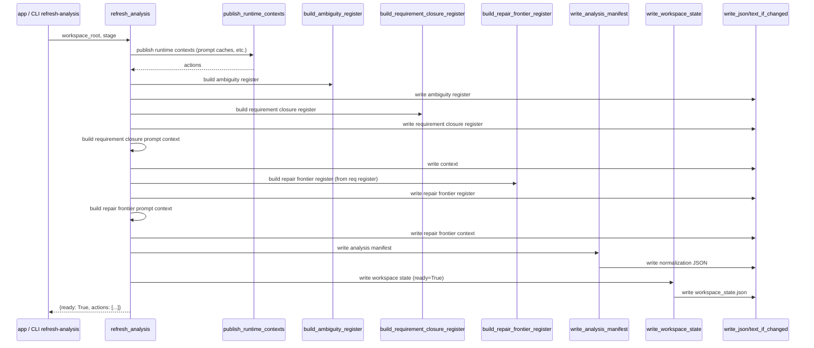
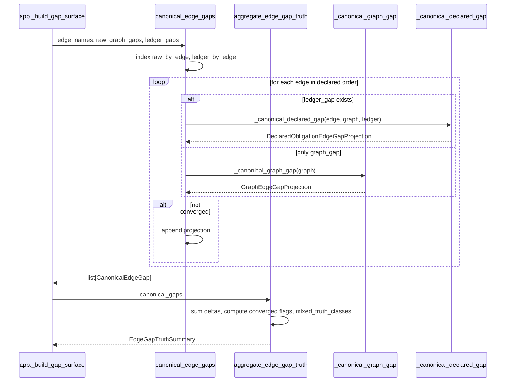
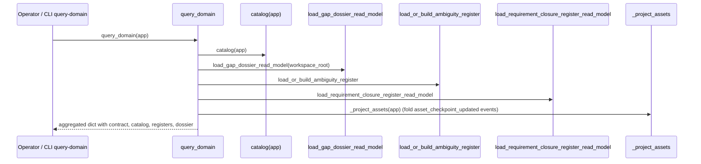

# REVIEW: S-037 Deliverable 2c — Analysis & Projection Cluster (analysis.py, span_analysis.py, query.py)

**Author**: claude
**Date**: 2026-04-23T00:03:00Z
**Addresses**: S-037 §Deliverables 2 and §Core Review Set (`analysis.py`, `span_analysis.py`, `query.py`); consumes post 01
**Status**: Open

## Summary

This cluster owns three distinct concerns: `analysis.py` produces and publishes the workspace-analysis fingerprint + readiness state that every other file trusts; `span_analysis.py` is the core carrier + aggregation kernel that canonicalizes gaps across two truth classes (graph + declared-obligation); `query.py` is a thin read-only projection over `app` state.

The cluster is the quietest in the review. `span_analysis.py` is the single cleanest carrier module in the repair set. `analysis.py` does one job — fingerprint + publish — and does it fail-closed. `query.py` is under-100 lines and compositional.

Fault lines are thin and mostly cosmetic:

1. **`refresh_analysis` is a publication transaction of 6 writes** with no atomicity or rollback. If a later step fails, the earlier artefacts are orphaned at the new fingerprint while workspace state may not get written.
2. **`span_gap_analysis` mixes two purposes** — it is both the `--from-edge/--to-edge` zoom operator and a rebuild of the core `_build_gap_surface` pipeline inline. It duplicates the raw → canonical → enrich path from `app._build_gap_surface` rather than composing it.
3. **`query.py` imports `app.OddSdlcApp`** — circular-adjacent coupling, tolerable today.

## Analysis

### `analysis.py` — role confirmed: Semantic kernel + Effect shell

File purpose: build the analysis manifest (fingerprinted input/output inventory), write it + workspace_state.json + 4 derived registers; expose `ensure_workspace_ready` as a fail-closed precondition for `start`.

Inventory:

| Function | Role | Notes |
|---|---|---|
| `build_analysis_manifest` | Kernel | composes the manifest from `current_workspace_inputs`, the 5 published artefact paths, and project profile |
| `write_analysis_manifest` | Effect shell | writes `.ai-workspace/runtime/odd_sdlc-workspace-normalization.json` |
| `write_workspace_state` | Effect shell | writes `.ai-workspace/runtime/workspace_state.json` |
| `refresh_analysis` | Effect shell (multi-write) | runs 6 publications in sequence: runtime contexts, ambiguity register, requirement closure register, requirement closure prompt context, repair frontier register + context, analysis manifest, workspace state |
| `load_workspace_state`, `load_analysis_manifest`, `workspace_state_ready` | Projection | read the published state |
| `ensure_workspace_ready` | Kernel (fail-closed guard) | raises on missing or stale analysis |
| `_artifact_kind_for_path`, `_input_kind_for_path`, `_publication_actions`, `_sha256_bytes` | Helpers | classification |

#### Sequence diagram — `refresh_analysis`

#### Fault lines in `analysis.py`

- **F-26 `refresh_analysis` is a 6-write publication transaction with no atomicity.** If any step between ambiguity publication and workspace-state write fails (raises), the workspace can be left with a stale `workspace_state.json` and a new fingerprint on partial artefacts. `workspace_state.ready = True` is set at the end, which helps — but the intermediate artefacts are already on disk with the new content. Category: **effect leakage / hidden mutation** + **incomplete migration** (the publication is a transaction shape but not implemented as one). Medium-priority: wrap in a tmp-dir staging + atomic-rename pattern, or write an explicit precondition check that `workspace_state.ready=False` is set at entry and only flipped to `True` after all writes succeed.
- **F-27 `ensure_workspace_ready` raises `RuntimeError` with operator-facing CLI instructions.** Lines 333–341. The exception messages tell the user "run `python -m odd_sdlc refresh-analysis --workspace .`". This conflates kernel fail-closed behavior with operator UX. The kernel should raise a typed error (`WorkspaceAnalysisUnpublishedError`, `WorkspaceAnalysisStaleError`) and the CLI should translate into the human-readable message. Category: **interface bleed** (CLI prose inside kernel). Low-priority refactor.
- **F-28 `_artifact_kind_for_path` and `_input_kind_for_path` are hard-coded string tables.** They decide what kind an artefact or input is by filename or path prefix. Adding a new published artefact requires editing this table in lock-step with adding the publish call. Category: **split carrier vs controller authority** (artefact kind meaning is co-authored with the path constant). Acceptable for now; if the artefact set grows beyond ~10, consider a registration API.

Otherwise `analysis.py` is clean: dataclasses for the payloads are in `project_profile.py`, the writes use `_if_changed` to avoid churn, and the manifest includes per-artefact fingerprints so downstream staleness detection is deterministic.

### `span_analysis.py` — role confirmed: Carrier + Semantic kernel

File purpose: define the typed gap family (`RawGraphGap`, `DeclaredObligationGap`, `CanonicalEdgeGap`, `GraphProjection`, `GraphEdgeGapProjection`, `DeclaredObligationEdgeGapProjection`, `EdgeGapTruthSummary`), aggregate gap truth across two classes, provide `span_gap_analysis` for bounded `--from-edge/--to-edge` zoom.

Inventory (carrier + kernel highlights):

| Function / Class | Role | Notes |
|---|---|---|
| `RawGraphGap`, `DeclaredObligationGap` | Carrier (input) | normalized projections of raw entries |
| `GraphProjection`, `GraphEdgeGapProjection`, `DeclaredObligationEdgeGapProjection`, `EdgeGapTruthSummary` | Carrier (output) | canonical and aggregate views |
| `CanonicalEdgeGap` (type alias over the two projections) | Carrier | polymorphic output row |
| `project_raw_graph_gap_rows`, `project_declared_obligation_gap_rows` | Kernel | dict → carrier |
| `_canonical_graph_gap`, `_canonical_declared_gap`, `canonical_edge_gaps` | Kernel | merges raw graph + declared obligation per edge |
| `aggregate_edge_gap_truth` | Kernel | sums deltas, convergence logic, mixed-truth-class flag |
| `capability_gap_entries` | Kernel | derives "missing capability" entries from the operational capability projection |
| `declared_obligation_specs` | Kernel | walks the module's graph functions for edges with obligation declarations |
| `parse_gap_scope_selector` | Binding | CLI scope string → `ScopeSelector` |
| `span_gap_analysis` | Semantic kernel + public entry | bounded `--from-edge/--to-edge` analysis |

#### Sequence diagram — `canonical_edge_gaps` + `aggregate_edge_gap_truth`

#### Fault lines in `span_analysis.py`

- **F-29 `span_gap_analysis` duplicates the raw-gap → canonical pipeline from `_build_gap_surface`.** Lines 651–734. It re-does `gen_gaps → capability_gap_entries → declared_obligation_specs → collect_declared_obligation_gaps → canonical_edge_gaps → enrich_gap_snapshot(publish=False) → aggregate_edge_gap_truth` — the same call chain as `_build_gap_surface` but scoped to a span. This is a case of **non-prime function** (per DESIGN_MODULE_METHOD §5): it replicates work instead of composing a single `build_gap_surface(scope, span=None)` kernel. Category: **split carrier vs controller authority** (the "core gap surface build" lives in two places). Refactor: extract the pipeline into one function that takes an optional span filter; let both `gaps` and `span_gap_analysis` use it. Medium priority; this is the kind of drift that causes feature parity bugs between `gaps` and `gaps --from-edge --to-edge`.
- **F-30 `capability_gap_entries` is in `span_analysis.py` but also used by `_augment_raw_gap_payload_with_capability_truth` in `app.py`.** Cross-module capability semantics — `span_analysis` imports project_profile; `app.py` also reads capability projection. This is a **split semantic center** for capability gaps. Recommendation: move `_augment_raw_gap_payload_with_capability_truth` alongside `capability_gap_entries`, or fold both into a small `capability_gap.py`. Follows from F-05 in the public-control-cluster post.
- **F-31 `aggregate_edge_gap_truth.convergence` has tri-valued booleans (`None` means "no truth class contributes").** Lines 589–603, 604–621. The `None` means "not applicable given the input set" which is semantically richer than `True/False`. Consumers must know to treat `None` as "indeterminate". This is lawful but easy to misuse downstream. Category: **lawful but under-specified**; consider a typed `ConvergenceTruth = Converged | NotConverged | Indeterminate` enum. Cosmetic.
- **F-32 `GraphEdgeGapProjection.to_dict` buries schema in a dict.** Downstream consumers (e.g. `gap_dossier._gap_truth_summary` at lines 174–191) re-extract these fields by string keys. A direct `summary = gap.gap_truth_summary()` method would be more carrier-honest. Cosmetic.

Otherwise **this file is exemplary for carrier shape.** All dataclasses are `frozen=True`, all transforms are pure, `aggregate_edge_gap_truth` returns a typed summary. The two-truth-class model (graph vs declared-obligation) is made explicit in `mixed_truth_classes`. **Lawful and prime.**

### `query.py` — role confirmed: Projection only

File purpose: read-only domain query surface for operator tooling. No writes, no events, no mutation.

Inventory:

| Function | Role |
|---|---|
| `_project_assets` | Projection (event folding) |
| `query_assets`, `query_asset_bindings`, `query_functions`, `query_jobs`, `query_bindings` | Projection |
| `query_ambiguity_register`, `query_requirement_closure_register` | Projection (delegation) |
| `query_domain` | Projection (aggregate) |

#### Sequence diagram — `query_domain`

#### Fault lines in `query.py`

- **F-33 `query.py` imports `OddSdlcApp` from `app.py`.** Line 11. This isn't a circular import today (app does not import query), but `query.py` consumes `app.stream.all_events()` to fold asset checkpoints inline. The check-point fold belongs either in `workspace_assets.py` (alongside `bootstrap_assets`) or in a dedicated `asset_projection.py`. Category: **hidden semantic center** (asset checkpoint event folding is domain projection but lives inside the query shell). Cosmetic today; would matter if more event-folded projections are added.
- **F-34 `query_domain` composes from both `catalog(app)` and parallel loaders.** `execution_contract_surface`, `start_target_catalog`, `asset_ownership_index`, `operational_capabilities` come from `catalog`; `ambiguity_register`, `requirement_closure_register`, `gap_dossier` come from direct loaders. Two paths into the same outer dict is fine, but if `catalog(app)` is re-shaped (see app.py), `query_domain` will drift. Category: **lawful but over-coupled**. Low priority.
- **F-35 S-037 §Explicit Review Question applied:** if `query.py` were removed, nothing authoritative disappears — every callable field can be had from its source module. This confirms `query.py` is a **projection convenience**, not an authority. That's the right shape, but it means the review question's "weak stop" applies; nothing needs changing today.

Otherwise `query.py` is clean. **Lawful and prime.**

## Recommended Action

1. **F-26 (refresh_analysis atomicity).** Consider wrapping the 6-write sequence in a staging pattern: compute all payloads, write to a staging directory, verify, then rename into place. Alternatively, write `workspace_state.ready = False` at entry and flip to `True` only after all writes complete. Without this, a partial failure produces a silent mixed-fingerprint state.
2. **F-29 (span_gap_analysis duplication).** Highest-value refactor in this cluster. Extract the pipeline in `_build_gap_surface` into `build_gap_surface_payload(app, *, selector, span=None, publish) -> GapSurfacePayload` and let both `gaps` and `span_gap_analysis` call it. Keeps feature parity; removes a drift surface.
3. **F-30 (capability gap split).** Fold `_augment_raw_gap_payload_with_capability_truth` from `app.py` into `span_analysis.py` (or a sibling `capability_gap.py`) so all capability-gap meaning lives in one place.
4. **F-27 (ensure_workspace_ready typed errors).** Introduce `WorkspaceAnalysisUnpublishedError` and `WorkspaceAnalysisStaleError`; push the CLI remediation prose into the CLI layer.
5. **F-28 / F-31 / F-32 / F-33 / F-34.** Cosmetic. Flag in synthesis but don't open tickets.

No new tickets are required from this cluster. F-26 and F-29 would fold into a follow-on refactor slice after S-037 synthesis is done; neither is part of the B-035/B-036 defect surface.
