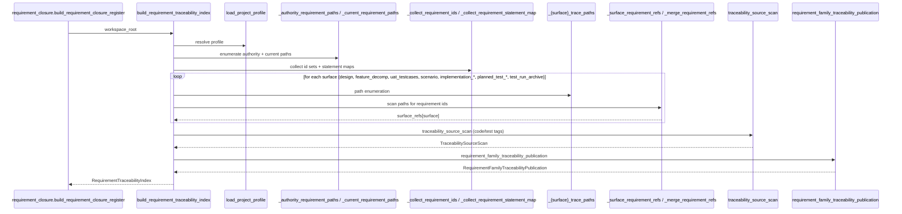
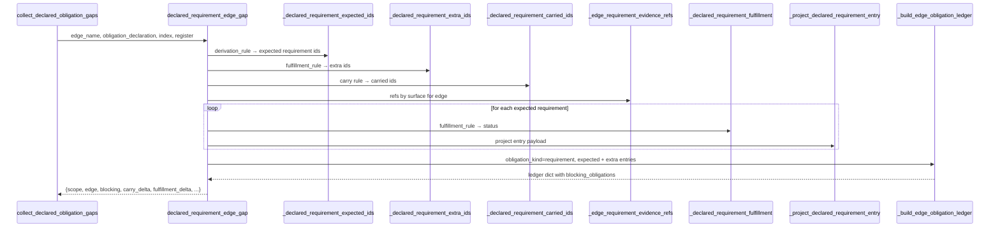
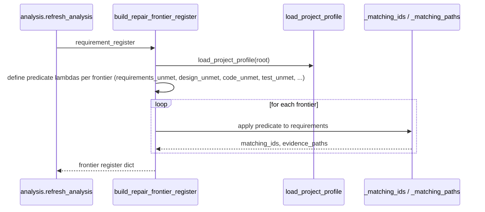

# REVIEW: S-037 Deliverable 2d — Closure / Proof-Surface Cluster (repair_frontier.py, requirement_closure.py, traceability_index.py)

**Author**: claude
**Date**: 2026-04-23T00:04:00Z
**Addresses**: S-037 §Deliverables 2 and §Core Review Set (`repair_frontier.py`, `requirement_closure.py`, `traceability_index.py`); consumes post 01
**Status**: Open

## Summary

This cluster owns **requirement obligation truth**: what requirements exist, what's carried vs missing, whether each has design/code/test trace, and what the derived repair frontier looks like. The cluster's call graph is:

```
traceability_index   →   requirement_closure   →   repair_frontier
                                      │
                                      └→ declared_obligation_edge_gap (per edge)
                                      └→ current_requirement_executability_gap
```

`traceability_index.py` builds a typed `RequirementTraceabilityIndex` carrier from filesystem scans. `requirement_closure.py` is the big one (1278 lines) — it builds the closure register (requirement entries with obligation status per family), derives edge-level declared-obligation gaps, and is authoritative for "what the gap carrier says about requirement truth". `repair_frontier.py` is a 288-line projection that reads the closure register and produces the repair register + prompt context.

The cluster is **domain-dense**. It is where the real requirement ontology lives. Fault lines are more about volume than shape:

1. **`requirement_closure.py` encodes a 15+ case `fulfillment_rule` enumeration as string dispatch across 3–4 functions**. This is the canonical ADT-in-strings pattern — the rules are the real domain enum and should be typed.
2. **`traceability_index.py` builds the index by walking the filesystem**, which makes the carrier immutable-but-I/O-bound. There is no declared fingerprint on the index itself, so stale reuse is only protected at the workspace-state layer.
3. **`repair_frontier.py` builds its register by 20+ `_matching_ids` / `_matching_paths` lambda predicates** over the closure register. This is declarative but encoded as lambdas, not as a data-driven spec — reorganizing rules requires editing the control flow.

## Analysis

### `traceability_index.py` — role confirmed: Semantic kernel + Carrier (read-only)

File purpose: build `RequirementTraceabilityIndex` — the typed map from requirement id → surface/code/test references. Scans the workspace filesystem, indexes by regex, packages into a frozen dataclass.

Inventory (top-level):

| Function | Role | Notes |
|---|---|---|
| `RequirementTraceabilityIndex`, `TraceabilitySourceScan`, `RequirementFamilyTraceabilityPublication` | Carrier | frozen dataclasses with many derived methods |
| `build_requirement_traceability_index` | Kernel | orchestrates the scan + packaging |
| `traceability_source_scan` | Kernel | scans `build_tenants/**` for code/test requirement tags |
| `requirement_family_traceability_publication` | Kernel | publishes family-level coverage |
| `_active_requirement_family_paths`, `_implementation_*_trace_paths`, `_scenario_trace_paths`, `_test_*_trace_paths`, `_feature_decomp_trace_paths`, `_uat_testcase_trace_paths`, `_design_surface_trace_paths` | Helper | authority path enumerations per surface |
| `_collect_requirement_ids`, `_collect_requirement_statement_map`, `_surface_requirement_refs`, `_merge_requirement_refs`, `_tagged_requirement_ids`, `_markdown_path_field_refs`, `_design_ref_backlinks_requirement_family` | Helper | scanning + merging primitives |
| `_normalize_requirement_id`, `_is_concrete_requirement_id`, `_collect_ids` | Helper | id parsing |
| `_is_source_file`, `_is_test_file`, `_iter_traceability_source_files`, `_meaningful_source_lines` | Helper | source-file classification |
| `_read_text`, `_relative`, `_markdown_header_fields` | IO helper | |

Exported methods on `RequirementTraceabilityIndex` return derived references — `implementation_refs`, `planned_validation_refs`, `traceability_scan`, `missing_requirement_ids_from_current_surface`, `expected_implementation_*_requirement_ids`, `missing_*_traceability_ids`, etc. These are pure projections.

#### Sequence diagram — `build_requirement_traceability_index`



#### Fault lines in `traceability_index.py`

- **F-36 No fingerprint on the index.** The index captures the filesystem state at the moment `build_*` runs. If the closure register is published against index fingerprint X and the filesystem changes, a later consumer calling `build_requirement_traceability_index` directly (without `refresh_analysis`) will get a different index. `analysis.py`'s workspace-state `ready` flag guards this at the workspace level, but **the index carrier itself has no identity**. Category: **unstable identity across refresh or reprojection**. Low-priority: either attach `analysis_fingerprint` to the dataclass at build time, or document that the index is ephemeral and must be rebuilt via `refresh_analysis`.
- **F-37 Per-surface `_trace_paths` helpers are a long enumeration with no shared spec.** Lines 553–605 — nine `_<surface>_trace_paths(workspace_root)` functions each returning a tuple. Adding a new surface requires editing three places (a new helper, a new `surface_refs[...]` entry in `build_requirement_traceability_index`, and potentially a new `refs_for` caller downstream). Category: **split carrier vs controller authority** (the surface enumeration is implicit). Consider a `TraceabilitySurfaceSpec` registry driven by `project_profile`. Cosmetic.
- **F-38 Scanning is bounded by `TRACEABILITY_SCAN_IGNORED_DIR_NAMES`, a hard-coded set.** Lines 36–49. Any build-tenant that lives elsewhere would need this set updated. Acceptable today.
- **F-39 `RequirementTraceabilityIndex` has 20+ methods.** Most are `@property` computed projections. This is fine for a carrier used as the input to one big consumer (`requirement_closure`) but it blurs the line between "dataclass carrier" and "semantic service object". Consider extracting the derived projections into a sibling `RequirementTraceabilityProjections` class, so the index carrier stays thin. Cosmetic.

Otherwise **lawful**: the carrier is frozen, the scan is pure, the helpers are small. The volume is the issue, not the shape.

### `requirement_closure.py` — role confirmed: Semantic kernel + Projection (1278 lines, domain-dense)

File purpose: build the requirement closure register — one entry per requirement with `present_in_authority`, `present_in_current_requirement_surface`, `carry_status`, `fulfillment_status`, design/code/test refs, blocking reasons. Also: derive edge-level declared-obligation gaps consumed by `span_analysis.canonical_edge_gaps`.

Inventory (semantic surface):

| Function | Role | Notes |
|---|---|---|
| `_read_text`, `_meaningful_source_lines`, `_is_structural_only_line`, `_has_behavioral_signal` | Helper | source-file behavioral-signal heuristics |
| `_merge_requirement_refs`, `_increment_count`, `_unique_sequence` | Helper | dict merging |
| `_carry_status_for_requirement`, `_fulfillment_status_for_requirement` | Kernel | status derivation for one requirement |
| `_requirement_statements`, `_requirement_statement`, `_requirement_source_refs`, `_requirement_evidence_refs` | Projection | getters from register entry |
| `_build_requirement_register_entry` | Kernel | constructs one register entry |
| `_build_requirement_obligation_view`, `_build_requirement_blocking_view` | Projection | views over register entry |
| `_build_edge_obligation_ledger` | Kernel | builds the declared-obligation ledger for one edge |
| `_expected_validation_*_requirement_ids`, `_expected_implementation_*_requirement_ids`, `_expected_realized_validation_requirement_ids` | Kernel | derivation rules (bound to `RequirementTraceabilityIndex` methods) |
| `_build_requirement_closure_register_from_index` | Kernel | full register from index |
| `build_requirement_closure_register`, `refresh_requirement_closure_register` | Kernel + binding | top-level |
| `current_requirement_executability_gap` | Kernel | edge-level gap for requirement-surface itself |
| `_declared_requirement_extra_ids`, `_declared_requirement_expected_ids`, `_declared_requirement_carried_ids`, `_edge_requirement_evidence_refs`, `_declared_requirement_fulfillment`, `_project_declared_requirement_entry` | Kernel | per-rule dispatch (the ADT-in-strings hotspot) |
| `declared_requirement_edge_gap` | Kernel | main per-edge gap builder |
| `obligation_gap_from_declaration`, `_coerce_obligation_declaration`, `collect_declared_obligation_gaps` | Kernel | entry point consumed by `span_analysis` |
| `build_requirement_closure_prompt_context` | Projection | delegates to `traceability_report` |
| `load_published_requirement_closure_register`, `load_requirement_closure_register_read_model`, `require_published_requirement_closure_register`, `_requirement_closure_unavailable_reason`, `unavailable_requirement_closure_register_projection` | Projection | fail-closed read model |

#### Sequence diagram — `declared_requirement_edge_gap`



#### Fault lines in `requirement_closure.py`

- **F-40 `fulfillment_rule` is an untyped string dispatched across 4 functions.** `_declared_requirement_extra_ids` (lines 712–752), `_declared_requirement_expected_ids`, `_declared_requirement_carried_ids`, `_declared_requirement_fulfillment` all dispatch on the same rule string. The 15+ rule values are the real domain enum: `feature_decomp_surface_coverage`, `uat_testcases_surface_coverage`, `design_surface_coverage`, `scenario_surface_coverage`, `implementation_design_surface_coverage`, `implementation_module_surface_coverage`, `behavioral_code_realization`, `test_design_surface_coverage`, `test_module_surface_coverage`, `realized_test_evidence`, `testcase_authority_coverage`, `release_readiness` etc. Adding a new rule requires touching every dispatcher. Category: **hidden semantic center** — the rule ADT lives as concordant string cases across multiple functions. This is the single most valuable refactor candidate in the cluster. Typed `FulfillmentRule` enum/ADT + one dispatcher per rule (`apply_rule(rule, index) -> RuleResult`).
- **F-41 `derivation_rule` has the same shape.** `_declared_requirement_expected_ids` dispatches on `derivation_rule` ("identity", "implementation_design_projection", etc.). Same pattern as F-40, smaller cardinality (~8 rules). Same refactor.
- **F-42 `_build_edge_obligation_ledger` has a 8-parameter signature including 5 callables.** Lines 382–… (signature) — `obligation_kind`, `obligation_source_ref`, `obligation_source_kind`, `obligation_source_admission_basis`, `derivation_rule`, `expected_entries`, `extra_entries`, `obligation_id_getter` (callable), `obligation_builder` (callable), `blocking_builder` (callable), `extra_blocking_builder` (callable). That's "builder pattern encoded in callables". It works but it's a higher-order shape that hides the real invariant. Category: **non-prime function** (Prime Law §5) — the function is a configurable template. Consider turning the 5 callables into a `LedgerSpec` dataclass and dispatching once. Medium priority.
- **F-43 `_carry_status_for_requirement` and `_fulfillment_status_for_requirement` encode status transitions as string returns.** Acceptable for small cases but given the status set is small (`carried`, `missing`, `extra`, `unassessed`, `fulfilled`, `partial`, `unfulfilled`, `blocked`), a proper enum would close an interface boundary. Cosmetic.
- **F-44 Large module = refactor pressure.** 1278 lines in one file, 40+ functions. It is self-contained (no circular imports), but splitting into `requirement_register.py` (lines 1–656, register builder) + `declared_requirement_edge_gap.py` (lines 712–1100) + `requirement_closure_projection.py` (lines 1220–1278) would make each part auditable at a glance. Cosmetic; not urgent.
- **F-45 `current_requirement_executability_gap` (lines 661–709) returns an ad-hoc dict, not a typed carrier.** Similar shape to the per-edge gap but with `"scope": "current_requirement_surface"`. Should share a carrier with `declared_requirement_edge_gap`. Cosmetic.

Otherwise **domain-lawful**: every decision traces back to `RequirementTraceabilityIndex` refs, nothing is invented from orchestration, and the fail-closed read model path is present.

### `repair_frontier.py` — role confirmed: Projection

File purpose: derive the repair frontier register (requirement ids and evidence paths grouped by "what part of the pipeline is unmet") and the prompt-context Markdown, from the requirement closure register.

Inventory (all top-level):

| Function | Role |
|---|---|
| `build_repair_frontier_register` | Projection |
| `build_repair_frontier_prompt_context` | Projection (prose) |
| `_matching_ids`, `_matching_paths` | Helper |
| `_format_id_lines`, `_format_path_lines` | Helper (prose) |

The file has no carriers of its own — it consumes `requirement_closure_register` (a dict) and produces another dict + a Markdown string.

#### Sequence diagram — `build_repair_frontier_register`



#### Fault lines in `repair_frontier.py`

- **F-46 The register's layout is a 20+ lambda-driven construction.** Lines 84–239 (not all shown) define lambdas `requirements_unmet`, `design_unmet`, `code_unmet`, `test_unmet`, `implementation_design_unmet`, `implementation_module_unmet`, `review_*_unmet`, `scenario_unmet`, etc., each paired with a `*_preserve` lambda. Each lambda inspects register-entry dict keys by string. If `requirement_closure` renames a key (e.g. `blocking_reasons`), these lambdas silently produce wrong data. Category: **interface bleed** (repair_frontier reaches into the closure register's internal dict shape) + **split carrier vs controller authority** (repair frontier semantics are co-authored across two files). Fix: introduce a typed `RequirementEntry` carrier in `requirement_closure.py` and have `repair_frontier.py` match on properties, not dict keys.
- **F-47 Prose assembly inline.** Similar to F-20 and F-9: 60+ lines of Markdown assembly inside the projection file. Cosmetic.
- **F-48 `repair_frontier` reuses `REQUIREMENT_CLOSURE_REGISTER_PATH` from `requirement_closure` but does not re-read it.** It relies on `build_requirement_closure_register` to be called first and the register to be passed in. That's correct shape for a projection — and it means if S-037 §Explicit Review Question is applied, removing `repair_frontier.py` would remove only the `repair-frontier.json` + `repair-frontier.md` artefacts; the closure register itself would still be authoritative. Confirmed **weak stop** per post 01 §8.

Otherwise **lawful projection**; no authority created here.

## Recommended Action

1. **F-40 (`fulfillment_rule` ADT).** Highest-value refactor. Introduce `FulfillmentRule` enum and one `apply_fulfillment_rule(rule, index, *, expected|extra|carried|fulfillment) -> <type>` dispatcher. Same for `derivation_rule` (F-41). Expected scope: ~300 lines of `requirement_closure.py` replaced with one typed dispatch table. Quality-of-life payoff: every future rule is typed-safe and cannot be half-added.
2. **F-42 (`_build_edge_obligation_ledger` 5 callables).** Collapse into a `LedgerSpec` dataclass. Medium priority.
3. **F-46 (repair_frontier lambdas over dict shape).** Typed `RequirementEntry` carrier. Once F-40/F-41 land, this follows naturally.
4. **F-44 (requirement_closure.py split).** Optional; do it when the ADT refactor (F-40) lands so the result is readable.
5. **F-36 (index fingerprint).** Attach `analysis_fingerprint` to `RequirementTraceabilityIndex` at build time. Helpful even without an atomicity guarantee on `refresh_analysis`.
6. **F-45 / F-47 / F-37 / F-38 / F-43.** Cosmetic; note in synthesis.

No new tickets from this cluster. All improvements are lawful cleanups that would attach to a "requirement-closure typed-rule" refactor slice, orthogonal to B-035/B-036. **The file set is clean in authority; the defects are about typing and splitting.**
