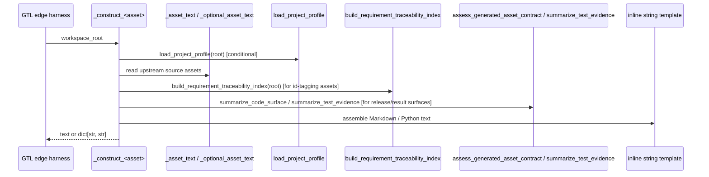

# REVIEW: S-037 Deliverable 2e — `constructor.py`

**Author**: claude
**Date**: 2026-04-23T00:05:00Z
**Addresses**: S-037 §Deliverables 2 and §Core Review Set (`constructor.py`); consumes post 01
**Status**: Open

## Summary

`constructor.py` is the largest file in the review set (2356 lines) and is the authoritative materialization surface for every generated workspace file: `specification/INTENT.md`, `…/PRODUCT.md`, `…/GOALS.md`, `specification/requirements/10-generated-bootstrap.md`, feature decomp, UAT test cases, design, scenarios, testcase authority, implementation design/stack/module/code, test design/module/run-archive, release, build execution surface, deployment surface, and their result surfaces.

The module is structurally clean: one `_construct_<asset>(workspace_root) → str | dict[str, str]` function per generated surface, all pure (read from workspace, compute, return text), with dispatch into these constructors living outside this file (in the GTL edge bindings, not reviewed here).

However, the file carries two kinds of load-bearing meaning that **should not be in a constructor file**:

1. **Release/deployment/operational-transition classification logic** — `_construct_release`, `_construct_build_execution_result_surface`, `_construct_deployment_result_surface`, etc. inspect test evidence and substrate bindings to decide `completion_state` / `release_status` / `saga_state` values. These are **governance decisions encoded in a materialization file**.
2. **Hard-coded "proving subset" application code** — `_construct_code_surface` emits a fixed hello-world Python package (Python-specific) as a fallback when `profile.realization_mode` is not `selected_output_tree` or `planned_output_tree`. This is a stub-materialization shortcut that treats the generated package as both "a demonstration artefact" and "something that must type-check".

## Analysis

### Role confirmed: Constructor / materialization module

Per DESIGN_MODULE_METHOD §6, a constructor module "writes generated or built artifacts from admitted carriers and explicit plans". `constructor.py` does this — the write itself happens outside via the GTL edge harness, but all file content is produced here.

Inventory (grouped by generated surface):

| Asset | Function |
|---|---|
| intent_surface | `_construct_intent` |
| product_surface | `_construct_product` |
| goal_surface | `_construct_goals` |
| requirement_surface | `_construct_requirements` |
| feature_decomp_surface | `_construct_feature_decomp` |
| uat_testcases_surface | `_construct_uat_testcases` |
| design_surface | `_construct_design` |
| review_assessment_surface | `_construct_review_assessment` |
| consensus_decision_surface | `_construct_consensus_decision` |
| reviewed_design_surface | `_construct_reviewed_design` |
| testcase_authority_surface | `_construct_testcase_authority` |
| scenario_surface | `_construct_scenarios` |
| implementation_design_surface | `_construct_implementation_design` |
| implementation_stack_profile | `_construct_implementation_stack_profile` |
| implementation_module_surface | `_construct_implementation_module_surface` |
| code_surface | `_construct_code_surface` (→ `_construct_planned_software_tree` for planned mode) |
| release_surface | `_construct_release` |
| build_execution_surface / build_execution_result_surface | `_construct_build_execution_surface`, `_construct_build_execution_result_surface` |
| test_execution_surface / test_execution_result_surface | `_construct_test_execution_surface`, `_construct_test_execution_result_surface` |
| deployment_surface / deployment_result_surface | `_construct_deployment_surface`, `_construct_deployment_result_surface` |

Plus helpers: `_read_json`, `_asset_text`, `_optional_asset_text`, `_workspace_asset_path`, `_code_surface_root`, `_proving_subset_requirement_ids`, `_tag_lines`, `_build_artifact_summary`, `_imported_authority_*_lines`, `_authority_requirement_lines`, `_file_heading`, `_project_title`, `_software_project_mode`, `_should_preserve_authoritative_surface`, `_package_segments_for_module`, `_package_name_for_module`, `_module_identifier`, `_governed_summary_lines`, `_module_boundary_lines`, `_proof_and_query_shape_lines`, `_selected_test_stack_defaults`, `_planned_test_requirement_ids`, `_distributed_requirement_ids`, `_generated_test_relpath`, `_quoted_requirement_list`, `_render_generated_test_source`, `_preserve_existing_test_code_files`, `_replace_generated_code_surface`, `_planned_generated_test_files`, `_intent_authority_lines`, `_construct_planned_software_tree`, `_work_act_for_target_asset`, `_operation_verb`, `_build_work_report`.

#### Sequence diagram — typical `_construct_<asset>` call

Each `_construct_*` is called by its corresponding edge harness during the GTL construction run — **not by this file.** The file is therefore structurally a library of constructor kernels.

### Fault lines in `constructor.py`

- **F-49 `_construct_release` decides `release_status` and `completion_state` from test evidence.** Lines 1475–1486. `if test_summary["parsed_report_count"] == 0: release_status = "pending_evidence"` etc. This is a **governance decision** — "is this release qualified, pending, or blocked?" is an ontology of release-stage truth, not a rendering detail. The same pattern repeats in `_construct_build_execution_result_surface`, `_construct_test_execution_result_surface`, `_construct_deployment_result_surface`. Category: **hidden semantic center** (release law lives in a materialization file). Fix: extract a typed `ReleaseAssessment` (`Pending | Qualified | Blocked`) + a kernel `assess_release(test_summary) -> ReleaseAssessment` in a new `release_assessment.py` or adjacent module; let `_construct_release` render the assessment, not compute it.
- **F-50 `_construct_code_surface` bakes a Python-specific hello-world into the stub path.** Lines 1340–1464. When `profile.realization_mode` is neither `selected_output_tree` nor `planned_output_tree`, it emits a fixed Python package (`hello_message`, `main`, a workflow summary dict with string literals, plus two test files). Category: **interface bleed** (realization-language decision embedded in a generic constructor) + **proxy compatibility authority** (the stub claims to prove the proving subset without being driven by the actual target stack). Fix: either delete the stub branch (require `profile.realization_mode` to be explicit and fail-closed otherwise), or move the Python stub into a `python_proving_stub.py` selected via the stack profile.
- **F-51 `_construct_deployment_surface` reads `project_profile.deployment_contract` and calls `classify_operational_binding`.** Line 1699. Local `from .operational_dispatch import classify_operational_binding`. The classifier is imported lazily — good for circular-import avoidance — but the fact that a constructor is making an operational-dispatch classification decision is the same pattern as F-49: governance logic inside a renderer. Category: **hidden semantic center**. Fix: compute the binding upstream and pass it as input to the constructor.
- **F-52 `_construct_*` functions read unpublished dependency surfaces.** Many constructors call `_asset_text(workspace_root, "<upstream_surface>")` which raises if the file doesn't exist. The edge harness presumably guarantees dependency ordering, but this creates an implicit contract between GTL edge topology and constructor logic that is not documented in-file. Category: **interface bleed** (topology contract lives outside; enforcement lives inside). Fix: accept a typed `ConstructorInput` carrier containing already-loaded upstream surface text, rather than re-reading in every constructor.
- **F-53 `_preserve_existing_test_code_files` and `_replace_generated_code_surface` mutate the workspace filesystem.** Lines 501–548 (approximate; `_preserve_existing_test_code_files` reads then re-writes test files; `_replace_generated_code_surface` deletes and writes a code tree). Effect-shell code living in a constructor file is acceptable given the file's purpose, but these two functions should be labelled as side-effecting and called out of a separate "code-surface materialization" path. Category: **effect leakage into kernel** (the rest of the file returns strings; these two mutate the filesystem mid-render).
- **F-54 Proving-subset hello-world tests assert a hard-coded message.** Line 1438: `assert hello_message() == "Hello from odd_sdlc proving subset."`. Plus line 1404: `'"hello_message": ' + repr(hello_message)` (which interpolates a Python literal into generated Python code). This is stable because both come from the same `hello_message = "Hello from odd_sdlc proving subset."` local variable — but the "stub must prove itself" pattern embeds test law into rendered text. Category: **proxy / test-in-prod** — the generated tests are a form of self-proof that the test file claims nothing substantive about the actual project. Acceptable as a traceability smoke test; problematic if ever mistaken for real proof.
- **F-55 The file is 2356 lines with 40+ functions and zero shared-type carriers.** Everything is plain strings and dicts. Per DESIGN_MODULE_METHOD §11 Coupling Rule ("`carriers → semantic kernels → effect shells → projections`"), the constructor sits at the right end of the chain and is allowed to be dense, but it mixes two different flavors: (a) pure string rendering from upstream files, which is lawful; and (b) decision-carrying rendering (F-49/F-51), which should not be here. Cosmetic if F-49/F-51 land; worth a split otherwise.
- **F-56 `_build_work_report` + `_work_act_for_target_asset` + `_operation_verb` encode a workflow enumeration.** Lines 674–751. `operation` is a string dispatched to "render the work act". This is another small ADT-in-strings — a `WorkAct` enum would help if this surface expands.
- **F-57 Hard-coded path constants and string tags.** `_CODE_SURFACE_PRESERVED_ROOTS`, `_GENERATED_TEST_CODE_MARKER`, `_GENERIC_TITLE_HEADINGS`, `_REQUIREMENT_ID_RE`, `IMPORTED_AUTHORITY_CANDIDATES`, `PRESERVED_AUTHORITY_ASSETS`. These are lawful module-level constants but, combined with the per-asset functions, they represent policy co-authored between this file and `workspace_assets.py`. Category: **split carrier vs controller authority**. Cosmetic.

### S-037 §Explicit Review Question

*If `constructor.py` were removed, what authoritative carrier or boundary would stop existing?*

- Every generated workspace surface (`specification/*`, `build_tenants/<profile>/**/*`) would stop being materialized. Edge runs would fail-closed at the construction step. This is **authoritative** — no projection or controller silently rebuilds this text.
- **Lawful stop.** The file is the correct place for these kernels.

### Design-choice justification summary

- Most `_construct_*` functions are **lawful and prime**: each owns one irreducible rendering boundary.
- `_construct_release` / `_construct_*_result_surface` / `_construct_deployment_surface` are **lawful but over-coupled**: they should import a typed assessment and render it, rather than compute the assessment inline.
- `_construct_code_surface` fallback stub is **lawful but questionable**: inline Python-specific code generation that will break for non-Python platforms. If platform-generic code synthesis is the target, this branch is a proxy; if Python is one of several supported "proving stacks", it should be selected via the stack profile.
- `_preserve_existing_test_code_files` / `_replace_generated_code_surface` are **lawful effect shells inside a kernel-heavy file**; documentation or a rename would help.

## Recommended Action

1. **F-49 + F-51 (release/operational governance out of constructor).** Extract typed assessment/classification carriers (`ReleaseAssessment`, `OperationalBinding`, `DeploymentSagaState`, `BuildExecutionSagaState`, `TestExecutionSagaState`) into a new `runtime_assessment.py` or adjacent module. Constructors receive the typed assessment and render it. This is the highest-value change in the file — it moves real law out of prose assembly.

2. **F-50 (Python hello-world stub).** Decide: either delete the `realization_mode not in {selected_output_tree, planned_output_tree}` branch and fail-closed (since `refresh_analysis` / `ensure_workspace_ready` should guarantee a valid realization mode), or split it into a stack-profile-selected proving stub module. Current shape is a silent fallback that hides meaningful configuration errors and ties a Python-specific artefact to an otherwise platform-agnostic file.

3. **F-52 (`ConstructorInput` carrier).** Introduce a typed input carrier holding the upstream surface texts that a constructor needs; pass it from the edge harness rather than re-reading per constructor. Reduces topology leakage and makes each constructor trivially testable. Medium priority.

4. **F-53 (label effect functions).** Move `_preserve_existing_test_code_files` and `_replace_generated_code_surface` to the bottom of the file under a `# --- effect shells ---` comment boundary, or to a sibling `code_surface_materialization.py`. Cosmetic but improves readability for reviewers.

5. **F-54 (proving-subset self-proof).** Flag in synthesis but don't act. If the stub is deleted (F-50), this goes away.

6. **F-55 / F-56 / F-57.** Cosmetic.

No new tickets from this file. The highest-value change (F-49 / F-51) is a small extract-refactor orthogonal to B-035/B-036; the second (F-50) is a judgment call about whether the proving stub is intentional policy.

### Relationship to B-035 / B-036

`constructor.py` does not appear in either ticket's affected-boundary list, and nothing in the review changes that. The file is downstream of the admission/gate logic — once `start` has admitted an execution contract and ABG has dispatched a construction turn, the F_P actor uses these constructors as the rendering substrate. The test36 forensic analysis confirms that: the `fp_result` payload for `derive_intent_surface` (reviewed earlier in this conversation) shows the F_P actor generated intent surface text that composed with `_construct_intent` output. The constructor layer did its job.

The fault lines in this file are the same shape as elsewhere in the cluster — **typed carriers wanted, string dispatch present, governance sneaking into rendering**. They are not urgent; they become tickets only if someone is already touching the file for another reason.
