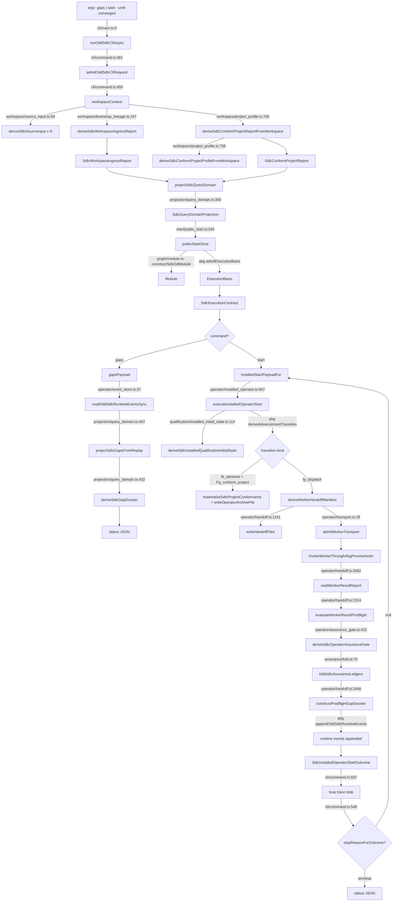

# REVIEW: TypeScript src — Simplification, Domain Model, DMM Conformance

**Author**: Claude
**Date**: 2026-04-30T14:38:54Z
**Lens**: `DESIGN_MODULE_METHOD.md` §1, §3, §3A, §3B (×2), §5–§5F, §6, §6A, §6B, §10, §11C, §12, §13, §14A
**Mass**: 82 `.ts` files, 18,558 LOC across 18 directories under `build_tenants/typescript/code/src`
**Posture**: Reviewer-only. No source modified. No tests/builds run.

## Correction (2026-05-01) — outer-loop ownership

This post originally treated `installedStartPayloadFor`'s `--until converged` loop as legitimate odd_sdlc product law mis-housed in the CLI. **That framing was wrong.** Operator pointed out, and T-102 confirms, that the outer loop is the actual defect: odd_sdlc calls `runEngineIterateAsync` through `oneTraversalBasis(basis)` (`installed_operator.ts:1287`) — narrowing ABG's whole-graph driver to one vector — and re-runs it externally up to `AUTONOMOUS_START_STEP_GUARD` times. T-102 (`/Users/jim/src/apps/odd_sdlc/.ai-workspace/tickets/active/T-102-define-typed-fp-function-stages-and-abg-owned-admission-flow.md:177`) names this in non_closure_conditions:

> "Claiming ABG ownership while odd_sdlc still owns the loop, actor lifecycle, or closure fold."

The DMM-correct fix is to **delete `installedStartPayloadFor`'s outer loop entirely**, pass the whole-graph basis to ABG, subscribe to its event sink from an effect-shell that writes per-attempt archives + appends events on each event, and return when ABG returns terminal. The "product law" I described in the original Tenant CLI section (stop-reason policy enum, autonomous-start trace carrier, retry advance heuristics) is not new product law — it's substrate iteration semantics that ABG already owns and that odd_sdlc duplicated by force-slicing.

Read **simplification-register #5** and the **Tenant CLI vs ABG** section below with this correction in mind. Both have been updated. The other 14 register entries stand.

## Executive Verdict

The codebase is **partially DMM-conformant**. Carrier discipline is strong: `operator/carriers.ts`, `workspace/carriers.ts`, `assurance/carriers.ts`, `triage/carriers.ts`, `hooks/carriers.ts`, `domain/carriers.ts`, `release/carriers.ts`, `operational/carriers.ts`, `package_binding/carriers.ts`, `install/carriers.ts` collectively form a clean Carrier-module layer with `Object.freeze` everywhere and no untyped semantic dicts. The graph-function library (`graph/library.ts`, `graph/catalog.ts`, `graph/module.ts`) declares the GTL surface explicitly and is the cleanest part of the codebase under DMM §6 taxonomy.

The defects are concentrated in one place: **`operator/`**, and especially `operator/handoff.ts` (2706 LOC, 25 top-level exports) and `operator/installed_operator.ts` (1398 LOC, the F_P dispatch loop). Five concrete DMM violations show up there:

1. **Helper recurrence at scale**: `uniqueSorted` defined in 7 files, `stableJson`/`stableOperatorJson` in 4, `sha256Text` in 3, `parseNonNegativeInteger`/`parseArray` in 2 (DMM §11C, rule of two/three).
2. **Authority-Seam Closure violation**: `deriveSdlcConformProjectProfileFromWorkspace(workspaceRoot)` is called from 5 sites, each re-walking the filesystem rather than consuming the already-admitted `SdlcConformProjectProfile` from the `SdlcPublicStartOutcome.executionContract` chain (DMM §3B.1).
3. **Boundary Inflation in `operator/`**: 2706 LOC and 25 exports inside `handoff.ts` mix manifest construction, prompt rendering, materialization snapshotting, postflight evaluation, gap-dossier construction, and result-report admission. At least 5 of these are independently prime carrier-constructor or effect-shell modules and should not co-habit (DMM §5C, §6).
4. **Effect-Edge Rule violation in `installed_operator.ts`**: the F_P dispatch closure (lines 894–1100+) decides semantic law (postflight verdicts, retry actions) and writes archive files in the same imperative scope (DMM §9).
5. **Outer iteration loop duplicates ABG's whole-graph driver** (governed by T-102): `installedStartPayloadFor` (`cli/command.ts:616-671`) re-runs ABG's `runEngineIterateAsync` externally after force-slicing it via `oneTraversalBasis(basis)` (`installed_operator.ts:1287`). ABG already iterates vectors, handles F_P retry budget, and evaluates the assurance gate. The DMM-correct fix is to delete the outer loop, not lift it. See Correction note above and register #5.

There is **no Proxy Interface** problem (§13) and no rival truth surfaces — the GTL module published via `constructSdlcGtlModule()` is the single graph-program authority. ODD alignment (§3A) is honored: the deterministic modules sit *under* GTL functions rather than replacing them.

## Domain Model — Irreducible Architectural Carrier Set

```mermaid
classDiagram
    %% Stereotypes: <<prime>> <<authoritative>> <<subordinate>> <<downstream>> <<effect-edge>> <<deferred>>

    class ExecutionBasis {
        <<prime>>
        <<authoritative>>
        +Module module
        +StartIntent startIntent
        +ResolvedRuntimeIdentity runtimeIdentity
        +ResolvedPolicyIdentity resolvedPolicy
    }
    note for ExecutionBasis "Owned by ABG (@abiogenesis/typescript-tenant). odd_sdlc admits, never reconstructs."

    class Module {
        <<prime>>
        <<authoritative>>
        +string name
        +GraphFunction[] graphFunctions
        +Job[] jobs
    }

    class GraphFunction {
        <<prime>>
        <<authoritative>>
        +string name
        +Node[] inputs
        +Node[] outputs
    }

    class SdlcReusableGraphFunctionCatalogEntry {
        <<prime>>
        +SdlcReusableGraphFunctionName name
        +string stableOuterContract
        +string[] computeOrder
    }

    class SdlcGraphFunctionCatalog {
        <<prime>>
        +SdlcReusableGraphFunctionCatalogEntry[] libraryFunctions
        +SdlcFunctionCatalogEntry[] functions
        +SdlcExecutiveProgramEntry[] executives
    }

    class SdlcSourceInput {
        <<prime>>
        +string uri
        +string relativePath
        +string fnv1aDigest
    }
    note for SdlcSourceInput "Ingress carrier — foreign filesystem -> typed truth"

    class SdlcProjectConstraints {
        <<prime>>
        +string projectSlug
        +string activeTenant
        +string selectedOutputRoot
    }

    class SdlcWorkspaceIngressReport {
        <<prime>>
        <<authoritative>>
        +string workspaceRootUri
        +SdlcProjectConstraints projectConstraints
        +SdlcSourceInput[] sourceInputs
        +SdlcAmbiguityRegister ambiguityRegister
    }

    class SdlcConformProjectProfile {
        <<prime>>
        <<authoritative>>
        +string projectSlug
        +string activeTenant
        +string[] declaredModuleNames
        +SdlcCapabilityContract[] capabilityContracts
    }

    class SdlcConformProjectReport {
        <<prime>>
        +string status
        +SdlcConformProjectProfile profile
        +string[] conformanceGaps
    }

    class SdlcQueryDomainProjection {
        <<prime>>
        <<downstream>>
        +SdlcGraphFunctionSurface[] graphFunctions
        +SdlcStartTargetSurface[] startTargets
        +SdlcConformProjectReport projectConformance
    }
    note for SdlcQueryDomainProjection "Read-model. Never decides traversal."

    class SdlcPublicStartRequest {
        <<prime>>
        +string workspaceRoot
        +SdlcPublicStartTargetKind kind
        +SdlcPublicStartUntil until
        +RuntimeRegime defaultRegime
    }

    class SdlcExecutionContract {
        <<prime>>
        <<authoritative>>
        +string targetGraphFunction
        +ExecutionBasis basis
        +SdlcWorkerAttachment workerAttachment
    }

    class SdlcPublicStartOutcome {
        <<prime>>
        +SdlcExecutionContract executionContract
        +AdvancementTransition transition
    }

    class SdlcWorkerHandoffManifest {
        <<prime>>
        <<authoritative>>
        +string graphFunctionName
        +string edgeName
        +string targetAssetType
        +SdlcConformProjectProfile conformedProject
        +SdlcProductMaterializationContract productMaterialization
        +SdlcTraversalIntentPackage traversalIntentPackage
        +SdlcWorkerRetryContext retryContext
    }

    class SdlcTraversalIntentPackage {
        <<subordinate>>
        +string[] obligationIds
        +string[] authorityRefs
        +string packageDigest
    }

    class SdlcTraversalObligationContext {
        <<subordinate>>
        +SdlcTraversalObligation[] obligations
        +SdlcAuthorityIndexEntry[] authorityIndex
    }

    class SdlcWorkerResultReport {
        <<prime>>
        <<authoritative>>
        +string outputFile
        +string digest
        +SdlcMaterializedProductFile[] materializedFiles
        +SdlcWorkerExecutionEvidence executionEvidence
        +SdlcWorkerObligationAssessment[] obligationAssessments
    }

    class SdlcPostflightResult {
        <<prime>>
        +string status
        +SdlcBlockingReason[] blockingReasonCarriers
        +string[] evidenceRefs
    }

    class SdlcPostflightGapDossier {
        <<prime>>
        +SdlcPostflightGapReason[] reasons
        +string[] nextLawfulActions
    }

    class SdlcAssuranceLedger {
        <<prime>>
        +SdlcAssuranceLedgerDimension dimension
        +SdlcAssuranceLedgerVerdict verdict
        +SdlcAssuranceLedgerReason[] reasons
    }

    class SdlcTraversalRequirementSatisfaction {
        <<prime>>
        <<authoritative>>
        +string status
        +SdlcTraversalRetryHandoff retryHandoff
    }

    class SdlcInstalledOperatorStartOutcome {
        <<prime>>
        +SdlcOperatorSummary summary
        +SdlcWorkerHandoffManifest manifest
        +SdlcWorkerResultReport workerReport
        +SdlcPostflightResult postflight
        +SdlcPostflightGapDossier gapDossier
    }

    class SdlcGapProjection {
        <<prime>>
        <<downstream>>
        +string graphFunctionName
        +SdlcGapStatus status
        +number[] closedVectorIndexes
    }

    class SdlcGapDossier {
        <<prime>>
        <<downstream>>
        +string[] nextLawfulActions
    }

    class SdlcRequirementClosureRegister {
        <<prime>>
        <<downstream>>
        +SdlcRequirementClosureEntry[] entries
        +string[] unresolvedRequirementIds
    }

    class SdlcGapObservation {
        <<prime>>
        +string analysisRef
        +string[] requirementPressureIds
    }

    class SdlcTriageClassification {
        <<prime>>
        +SdlcTriageFrameworkLayer frameworkLayer
        +SdlcTriageProcessOutcome processOutcome
    }

    class SdlcRouteBinding {
        <<prime>>
        +SdlcRouteKind kind
        +string handoffTarget
    }

    class SdlcOperationalTransitionPlan {
        <<prime>>
        +SdlcOperationalLane lane
    }

    class OddSdlcTypescriptInstallManifest {
        <<prime>>
        +OddSdlcTypescriptRuntimeIdentity runtimeIdentity
        +OddSdlcInstructionFileWrite[] writes
    }

    class OddSdlcTypescriptReleaseCutManifest {
        <<prime>>
        +string archiveRoot
    }

    class SdlcBlockingReason {
        <<prime>>
        +SdlcBlockingReasonCode code
        +SdlcBlockingReasonClass reasonClass
        +SdlcBlockingReasonLawfulReentryPoint lawfulReentryPoint
    }

    class RuntimeEvent {
        <<prime>>
        <<authoritative>>
    }
    note for RuntimeEvent "ABG-owned. odd_sdlc reads via event_store."

    class SdlcManagedTraversalLedger {
        <<deferred>>
    }
    note for SdlcManagedTraversalLedger "Conform-project induction; not yet generalized to other traversals."

    Module *-- GraphFunction
    SdlcGraphFunctionCatalog *-- SdlcReusableGraphFunctionCatalogEntry
    SdlcWorkspaceIngressReport *-- SdlcSourceInput
    SdlcWorkspaceIngressReport *-- SdlcProjectConstraints
    SdlcConformProjectReport *-- SdlcConformProjectProfile
    SdlcQueryDomainProjection ..> Module
    SdlcQueryDomainProjection ..> SdlcConformProjectReport
    SdlcExecutionContract *-- ExecutionBasis
    SdlcPublicStartOutcome *-- SdlcExecutionContract
    SdlcWorkerHandoffManifest *-- SdlcConformProjectProfile
    SdlcWorkerHandoffManifest *-- SdlcTraversalIntentPackage
    SdlcWorkerHandoffManifest *-- SdlcTraversalObligationContext
    SdlcInstalledOperatorStartOutcome *-- SdlcWorkerHandoffManifest
    SdlcInstalledOperatorStartOutcome *-- SdlcWorkerResultReport
    SdlcInstalledOperatorStartOutcome *-- SdlcPostflightResult
    SdlcInstalledOperatorStartOutcome *-- SdlcPostflightGapDossier
    SdlcPostflightResult *-- SdlcBlockingReason
    SdlcPostflightGapDossier *-- SdlcBlockingReason
    SdlcAssuranceLedger ..> SdlcWorkerHandoffManifest
    SdlcAssuranceLedger ..> SdlcWorkerResultReport
    SdlcTraversalRequirementSatisfaction ..> SdlcAssuranceLedger
    SdlcGapProjection ..> ExecutionBasis
    SdlcGapProjection ..> RuntimeEvent
    SdlcGapDossier ..> SdlcGapProjection
    SdlcGapObservation ..> SdlcGapDossier
    SdlcGapObservation ..> SdlcRequirementClosureRegister
    SdlcTriageClassification ..> SdlcGapObservation
    SdlcRouteBinding ..> SdlcTriageClassification
```

The IACS this diagram declares (not exhaustive but sufficient for §5A): `Module`, `GraphFunction`, `SdlcReusableGraphFunctionCatalogEntry`, `SdlcSourceInput`, `SdlcWorkspaceIngressReport`, `SdlcProjectConstraints`, `SdlcConformProjectProfile`, `SdlcConformProjectReport`, `ExecutionBasis`, `SdlcExecutionContract`, `SdlcPublicStartOutcome`, `SdlcWorkerHandoffManifest`, `SdlcWorkerResultReport`, `SdlcPostflightResult`, `SdlcPostflightGapDossier`, `SdlcAssuranceLedger`, `SdlcTraversalRequirementSatisfaction`, `SdlcInstalledOperatorStartOutcome`, `SdlcGapObservation`, `SdlcTriageClassification`, `SdlcRouteBinding`, `SdlcBlockingReason`, `OddSdlcTypescriptInstallManifest`, `OddSdlcTypescriptReleaseCutManifest`. Subordinate Payloads kept inside their owning carrier: `SdlcTraversalIntentPackage` (inside `SdlcWorkerHandoffManifest`), `SdlcTraversalObligationContext` (inside the same), `SdlcAuthorityIndexEntry`, `SdlcRetrievalHint`, `SdlcMaterializedProductFile`, `SdlcOperatorSummary`. The `SdlcManagedTraversalLedger` family is `<<deferred>>` — it currently exists only for the conform-project edge and is not generalized.

## Workflow — `gaps` and `start --until converged`

Module ownership for each step is annotated on the arrow. Note that the `--until converged` outer loop is **not** an ABG concern — ABG's iteration sufficiency is per-traversal. The outer loop lives in `cli/command.ts:616` (`installedStartPayloadFor`), calls `startOutcomeFor` and `executeInstalledOperatorStart` repeatedly, and advances by mutating workspace runtime-event state between calls. This is a tenant decision (see Tenant CLI section below).

## Per-Directory Findings

### `src/index.ts` (63 LOC)

- **Role**: Tenant identity + barrel re-export.
- **IACS**: `OddSdlcTypescriptTenantInfo` (single).
- **Exports** (`index.ts:30-44`): `ODD_SDLC_TYPESCRIPT_TENANT_KIND`, `ODD_SDLC_TYPESCRIPT_TENANT_STATUS`, `ODD_SDLC_TYPESCRIPT_TENANT_CAPABILITIES`, `OddSdlcTypescriptTenantInfo`, `describeOddSdlcTypescriptTenant`, plus `export *` from 17 sub-indexes.
- **Issue**: clean barrel. The 17-way `export *` (`index.ts:46-62`) means every sibling `index.ts` is part of the package public surface. Many of the helpers exposed via these barrels are not architecturally prime (e.g., the entire `parseClosedRecord` family from `shared/validation.ts`). DMM §5 Promotion Test — these should not all be top-level public.

### `src/cli/` (911 LOC, 3 files)

- **Role**: Effect shell + binding adapter.
- **IACS**: `OddSdlcCliRequest` variants (`cli/command.ts:65-96`), `OddSdlcCliResult` (`cli/command.ts:132-138`).
- **Exports**: `cli/command.ts:49-895` — ~30 top-level. `runOddSdlcCli`, `runOddSdlcCliAsync`, `admitOddSdlcCliRequest`, `serializeOddSdlcCliResult`, `ODD_SDLC_CLI_COMMAND_VALUES`.
- **Defects**:
  - **§9 Effect-Edge bleed**: `cli/command.ts:399-453` (`sourceFilePaths`, `readSourceInputs`) does filesystem ingress *and* is the entry point that constructs `SdlcSourceInput` carriers. This couples ingress to argv parsing and is the only path that builds source inputs — `workspace/` exposes constructors but no ingress walker. Either move the walker into `workspace/ingress.ts` (which currently only re-exports) or rename `cli/command.ts` honestly as the ingress shell.
  - **§10 Semantic Center risk**: `defaultRegimeFor` (`cli/command.ts:481-495`) decides `F_D` vs `F_P` based on whether the resolved target is `Fg_conform_project`. This is a runtime-policy decision in the CLI translation layer. It should live in `start/policy.ts` next to `publicStartTargetPolicyFor`.
  - **Loop control**: `installedStartPayloadFor` (`cli/command.ts:616-671`) owns the `until=converged` autonomous loop with `AUTONOMOUS_START_STEP_GUARD = 64`. This is the place the user's "isn't ABG the entry point?" question lands — see Tenant CLI section.

### `src/start/` (357 LOC, 3 files)

- **Role**: Semantic kernel (target resolution + execution-contract construction).
- **IACS**: `SdlcPublicStartRequest`, `SdlcExecutionContract`, `SdlcPublicStartOutcome`, `SdlcWorkerAttachment`.
- **Exports**: `start/public_start.ts:90` `admitSdlcPublicStartRequest`, `:124` `projectSdlcWorkerAttachment`, `:240` `publicStartOnce`. `start/policy.ts:35` `publicStartTargetPolicyFor`.
- **Notes**: cleanest semantic-kernel module in the codebase. `publicStartOnce` is total, returns a closed sum, has no I/O. Policy table at `start/policy.ts:17-33` is a 3-row table behind a thin lookup — borderline §5 Prime, but acceptable as a named admission boundary.
- **One concern**: the `until` parameter is admitted (`start/public_start.ts:115`) but `publicStartOnce` ignores it (`public_start.ts:188` overrides to `"converged"` for replay stability with a comment). The outer-loop semantics are split between admission here and execution in `cli/command.ts`. This is honest at the comment level but not at the type level — if `until` is never consumed by the kernel, it shouldn't be in `SdlcPublicStartRequest`'s shape; it belongs in the CLI loop request only.

### `src/runtime/` (220 LOC, 2 files)

- **Role**: Documented contract/binding adapter to ABG.
- **IACS**: `OddSdlcAbiogenesisSubstrateReport`, `OddSdlcAbiogenesisExecutionBasisInput`.
- **Exports**: `runtime/abiogenesis_substrate.ts:33` `ODD_SDLC_ABIOGENESIS_SUBSTRATE_CONTRACT` const, `:91`/`:121`/`:147`/`:196` constructors and a derive function for a substrate probe.
- **Notes**: mostly a self-test/probe boundary. The contract const at line 33 is the cleanest declarative statement of "ABG owns runtime truth, odd_sdlc consumes" anywhere in the codebase — it is direct evidence that this codebase is *governance over ABG*, which answers the user's prompt question literally. Keep this file.

### `src/graph/` (1342 LOC, 4 files)

- **Role**: Constructor-materialization + carrier (GTL surface declaration).
- **IACS**: `SdlcReusableGraphFunctionCatalogEntry`, `SdlcFunctionCatalogEntry`, `SdlcExecutiveProgramEntry`, `SdlcGraphFunctionCatalog`, `Module` (re-admitted from ABG).
- **Exports**: `graph/library.ts:8-50` 11 `FG_*` graph-function name consts, `graph/library.ts:257-504` `REUSABLE_GRAPH_FUNCTION_CATALOG`. `graph/catalog.ts:43-309` four catalog tables. `graph/module.ts` `constructSdlcGtlModule`, `constructSdlcGraphFunctionCatalog`.
- **Status**: **strongest** part of the codebase under DMM. The GTL surface is one prime carrier family (the catalog); each `Fg_*` is a public name; `constructSdlcGtlModule()` is the single materialization edge. No effect-edge bleed.
- **One small issue**: `graph/library.ts:111-141` introduces `IngressSourceLedgerEntry`, `IngressSourceSet`, `ProjectIngressContract` carriers that are not used anywhere downstream — `grep` confirms `ProjectIngressContract` only appears in this file plus a parallel structurally-similar derivation in `workspace/bootstrap_lineage.ts`. These are §5C Boundary Inflation candidates: speculative public types that the rest of the system has not yet adopted. Either consume them (replace the local re-derivation) or move them out of the public catalog entries.

### `src/domain/` (887 LOC, 5 files)

- **Role**: Carrier module + admission boundary + projection.
- **IACS**: `SdlcAssetType`, `SdlcAssetFamily`, `SdlcAsset`, `SdlcWorksite`, `SdlcWorkAct`, `SdlcCapability`, `SdlcOperationalTransitionCommand`, `SdlcOperationalResult`.
- **Exports**: `domain/admission.ts:42-336` 11 `admitSdlc*` functions (closed-record validators). `domain/carriers.ts:9-` value enums + 25 typed carriers. `domain/software_domain_catalog.ts:7,123,214` 3 large frozen catalogs. `domain/operational_projection.ts:20` projection function.
- **Notes**: clean. Admission functions are total over `unknown` and use `parseClosedRecord` from `shared/validation.ts` consistently. `domain/admission.ts:32-40` has a local `parseNullableNumber` — small duplication of the `parseNonNegativeInteger` pattern but constrained to one helper.
- **Concern**: `domain/software_domain_catalog.ts` is 268 LOC of frozen tables. `SOFTWARE_DOMAIN_ASSET_TYPES` is 91+ entries. This is fine, but the catalog vs `graph/catalog.ts` distinction needs clarity — `graph/catalog.ts` defines edges/programs over asset *names*; `domain/software_domain_catalog.ts` defines the asset types themselves. The naming "catalog" in two places is read-friction; consider renaming `domain/software_domain_catalog.ts` to `domain/asset_inventory.ts` to disambiguate.

### `src/workspace/` (2043 LOC, 7 files)

- **Role**: Ingress + admission + carrier + (heavy) effect shell for the conform-project edge.
- **IACS**: `SdlcSourceInput`, `SdlcProjectConstraints`, `SdlcWorkspaceIngressReport`, `SdlcConformProjectProfile`, `SdlcConformProjectReport`, `SdlcManagedTraversalManifest`, `SdlcManagedTraversalLedger`.
- **Exports** by file: `workspace/source_input.ts:89` `deriveSdlcSourceInput`, `:35` `uniqueSorted` (duplicate). `workspace/project_constraints.ts:17,57` `admitSdlcProjectConstraints`, `deriveSdlcProjectConstraintsFromWorkspace`. `workspace/bootstrap_lineage.ts:167` `deriveSdlcWorkspaceIngressReport`. `workspace/project_profile.ts:434` `declaredModuleNamesFromStructure`, `:738`/`:766`/`:839`/`:897`/`:1196`/`:1321` six derive/admit/materialize functions.
- **Defects**:
  - **§3B Ingress Collapse violation**: `workspace/project_profile.ts:738` `deriveSdlcConformProjectProfileFromWorkspace(workspaceRoot)` re-walks the filesystem each time it is called. It is called from 5 separate sites (`cli/command.ts:469`, `operator/handoff.ts:922`, `operator/installed_operator.ts:898`, `qualification/installed_initial_state.ts:171`, `workspace/project_profile.ts:769,1199,1287`). Each consumer admits the *same workspace input* afresh. This is the core authority-seam violation in the codebase: there is no admitted carrier that says "this is the conformed project for this run." Either thread `SdlcConformProjectProfile` through the `SdlcExecutionContract` (it already lives in `SdlcWorkerHandoffManifest`), or admit it once at CLI entry and pass it down.
  - **§5C Boundary Inflation**: `workspace/project_profile.ts` is 1418 LOC and exports 9 functions. Inside it, `SdlcManagedTraversalManifest`/`SdlcManagedTraversalLedger`/`SdlcManagedTraversalPhaseVerdict` are subordinate payloads specific to *one edge* (`Fg_conform_project`). The `<<deferred>>` stereotype in the diagram reflects this: until other edges grow phase-ledger semantics, these types are inflating the workspace public surface. Either generalize the carrier (and the derivation) into a `traversal_phase_ledger` module, or hide these inside the conform-project semantic kernel.
  - **§11C Recurrence**: `workspace/source_input.ts:35` defines `uniqueSorted`; `workspace/project_profile.ts:147` defines `sha256Text`. Both are duplicated elsewhere (see Cross-Cutting).

### `src/projection/` (907 LOC, 3 files)

- **Role**: Projection module.
- **IACS**: `SdlcQueryDomainProjection`, `SdlcGapProjection`, `SdlcGapDossier`, `SdlcSpanAnalysisProjection`, `SdlcRequirementClosureRegister`, `SdlcLineageLedger`, `SdlcRepairFrontier`.
- **Exports**: `projection/query_domain.ts:359/407/432/458` four projector entry points. `projection/requirement_closure.ts:189/337/385` three more.
- **Notes**: clean projections. `projectSdlcGapsFromReplay` (`query_domain.ts:407`) is total over `(basis, events)` and emits no events (`emittedRuntimeEventKinds: Object.freeze([])`). The §3B.1 source-coherence rule is satisfied: `assertModuleMatchesCatalog` (`query_domain.ts:267` area) checks structural identity of admitted module against the constructed catalog before publication.
- **Minor §11C**: `projection/requirement_closure.ts:133` defines another `uniqueSorted<T extends string>` (now generic — fourth flavor).

### `src/triage/` (523 LOC, 4 files)

- **Role**: Semantic kernel + policy table.
- **IACS**: `SdlcGapObservation`, `SdlcTriageClassification`, `SdlcRouteBinding`, `SdlcConstitutionalRepricingProposal`, `SdlcTicketWorkItemRoute`, `SdlcGapRetirement`.
- **Exports**: `triage/triage.ts:44/110/185/220/238/255` six pure projector/transform functions. `triage/policy.ts:41,77` two policy tables.
- **Notes**: textbook DMM-conformant. Policy tables at module load, transforms total, no I/O. `triage/triage.ts:32` defines yet another `uniqueSorted` — third instance.

### `src/projection/` and `src/triage/` interaction

`triage/triage.ts:44` `observeSdlcGapPressure` consumes `SdlcGapDossier` from `projection/`. The boundary is one-way. No interface bleed (§12).

### `src/assurance/` (1201 LOC, 11 files)

- **Role**: Carrier (`carriers.ts`), seven semantic-kernel evaluator modules (one per ledger dimension), one fold (`fold.ts`), one shared helper (`shared.ts`).
- **IACS**: `SdlcAssuranceLedger`, `SdlcAssuranceLedgerInput`, `SdlcTraversalRequirementSatisfaction`, `SdlcTraversalRetryHandoff`, plus seven dimension-specific input families.
- **Exports**: `assurance/fold.ts:75` `foldSdlcAssuranceLedgers`. Seven `derive*AssuranceLedger` functions (one per ledger).
- **Notes**: clean dimension factoring; one module per ledger preserves §5/§6 cleanly. `assurance/shared.ts` (`uniqueSorted`, `assuranceReason`, `assuranceLedger`, `verdictFromReasons`) is the kind of shared helper module DMM §11C wants. The bug is that `assurance/fold.ts:16` defines a *second* local `uniqueSorted` instead of importing from `shared.ts`.

### `src/operator/` (5176 LOC, 7 files) — the hot zone

- **Role**: Effect shell (transport, archive writes, event append) + semantic kernel (postflight, gap dossier construction) + carrier (`carriers.ts`) + binding adapter (`event_store.ts`, `transport.ts`) — all four DMM taxonomy roles, in **one directory**.
- **IACS**: `SdlcWorkerHandoffManifest`, `SdlcWorkerResultReport`, `SdlcPostflightResult`, `SdlcPostflightGapDossier`, `SdlcInstalledOperatorStartOutcome`, `SdlcOperatorAssuranceGateResult`, `SdlcWorkerTransportContract`, `SdlcWorkerRunResult`. Subordinate: `SdlcTraversalIntentPackage`, `SdlcTraversalObligationContext`, `SdlcAuthorityIndexEntry`, `SdlcRetrievalHint`, `SdlcMaterializedProductFile`, `SdlcWorkerExecutionEvidence`, `SdlcWorkerObligationAssessment`.
- **File-level breakdown**:
  - `carriers.ts` (343 LOC): clean carrier file. 32 typed carriers. **Keep as-is.**
  - `event_store.ts` (~85 LOC): I/O over runtime events. Thin and correct.
  - `transport.ts` (125 LOC): admit + arg/stdin shaping for the worker subprocess. Thin and correct.
  - `assurance_gate.ts` (523 LOC): semantic kernel; orchestrates the 5 assurance ledgers + retry-handoff projection. `:422` `deriveSdlcOperatorAssuranceGate` — total transform. **Acceptable.**
  - `handoff.ts` (2706 LOC, 25 exports): the elephant. See defects below.
  - `installed_operator.ts` (1398 LOC, 1 export): the F_P dispatch closure. See defects below.
  - `index.ts`: barrel.
- **Defects in `handoff.ts`**:
  - **§5/§5C Boundary Inflation**: 25 top-level exports across 8 distinct concerns: (a) hash/json helpers (`stableOperatorJson`, `sha256Text`, `sha256File` — should not be public; should not even be in `operator/`), (b) materialization snapshot/observation, (c) `deriveWorkerHandoffManifest` (carrier constructor), (d) `assertTraversalIntentPackagePressure` (validator), (e) `promptForHandoff`/`writeHandoffFiles` (effect shell), (f) `admitWorkerResultReport`/`buildPostTransformWorkerResultReport`/`readWorkerResultReport` (admission + reconstruction), (g) `evaluateWorkerResultPostflight` (semantic kernel), (h) `constructPostflightGapDossier`/`writePostflightGapDossier`/`readPostflightGapDossierRef`/`gapDossierPathForManifest`/`admitPostflightGapDossier` (gap-dossier carrier family), plus `constructorResultFromWorkerOutput`/`writeOperatorArchiveFile`/`writeProductMaterializationManifest`/`relativeToWorkspace` (mixed effect/projection helpers).
  - **§9 Effect-Edge bleed**: `evaluateWorkerResultPostflight` (`handoff.ts:2324`) is a semantic kernel that decides postflight verdicts. `constructPostflightGapDossier` (`:2448`) is a kernel that decides retry actions. Both live next to and are routinely composed with `writeProductMaterializationManifest` (`:2423`), `writePostflightGapDossier` (`:2506`), and `writeHandoffFiles` (`:1191`). The pattern in `installed_operator.ts:937-1100` is `evaluate -> writeArchiveFile -> evaluate -> writeArchiveFile -> ...` — kernels and effects interleaved at the call site.
  - **§11C Recurrence**: `handoff.ts:227` local `uniqueSorted`; `:1215` `parseNonNegativeInteger`; `:1222` `parseArray<T>` — all duplicated against `hooks/admission.ts:38,45`.
- **Defects in `installed_operator.ts`**:
  - **§10 Semantic Center**: the `executeInstalledOperatorStart` async function is 800+ LOC (line 607 to ~1400) of imperative dispatch flow. It owns: topology validation, F_D conform-project transition, F_P dispatch construction, worker subprocess invocation, result-report admission with `buildPostTransformWorkerResultReport` fallback, postflight evaluation, assurance-gate composition, gap-dossier writing, runtime-event appending, archive-file writing, and SdlcInstalledOperatorStartOutcome construction. This is the unlawful imperative center DMM §10 names directly. The transition algebra it implements (fd_advance/fp_dispatch/etc.) is already declared by ABG; the F_P interleaving with postflight is product-owned but should sit behind a clean `runEdgeOnce(handoff, transport): InstalledEdgeOutcome` carrier-returning function.
  - **Local `uniqueSorted` at `:189`**: another duplicate.

### `src/hooks/` (1237 LOC, 8 files)

- **Role**: Carrier (`carriers.ts`), policy table (`policy.ts`), admission (`admission.ts`), evaluators (`evaluators.ts`), semantic kernel (`hook_set.ts`, `work_report.ts`), catalog/fixtures.
- **IACS**: `SdlcHookContract`, `SdlcHookInvocation`, `SdlcConstructorResult`, `SdlcWorkReport`, plus 8 enum value families.
- **Exports**: `hooks/admission.ts:58-281` 8 `admitSdlc*` functions. `hooks/policy.ts:30,181,195` policy table + 2 lookups. `hooks/catalog.ts:77,89` `constructSdlcHookContractCatalog`, `hookContractByEdgeName`. `hooks/hook_set.ts:19` `runSdlcHookTurn`. `hooks/work_report.ts:110` `constructSdlcWorkReport`.
- **Notes**: clean carrier+policy+admission split; this is the model the rest of the codebase should look like. The policy table at `hooks/policy.ts:30-179` is large (24 entries) but legitimately one prime table — every SDLC asset type needs a hook contract.
- **§11C**: `hooks/admission.ts:38,45` defines `parseNonNegativeInteger`, `parseArray<T>` — duplicated in `operator/handoff.ts:1215,1222`.

### `src/install/` (668 LOC, 5 files)

- **Role**: Effect shell + binding adapter (npm pack/install flow) + carriers.
- **IACS**: `OddSdlcTypescriptInstallRequest`, `OddSdlcTypescriptInstallManifest`, `OddSdlcTypescriptInstalledOutcome`, `OddSdlcTypescriptRejectedInstallOutcome`, `OddSdlcInstructionFileWrite`, `OddSdlcBootstrapGovernance`.
- **Exports**: `install/admission.ts:25` `admitOddSdlcTypescriptInstallRequest`. `install/installer.ts:30,251` `oddSdlcTypescriptProductInstallRoot`, `installOddSdlcTypescript`. `install/instruction_files.ts:34,237` `oddSdlcBootstrapGovernance`, `writeOddSdlcInstructionFiles`.
- **Notes**: **clean and exemplary**. Effects are concentrated. The `install/installer.ts` `stableJson` (`:34`) is a private duplicate of `operator/handoff.ts:150`'s `stableOperatorJson` — same recurrence.

### `src/operational/` (219 LOC, 4 files)

- **Role**: Carrier + semantic kernel + policy.
- **IACS**: `SdlcOperationalTransitionPlan`, `SdlcOperationalAdvance`, `SdlcRuntimeReturnObservation`.
- **Exports**: `operational/operational.ts:27,62,89` three pure transforms. `operational/policy.ts:42` lane lookup.
- **Notes**: tiny, clean, total. Reads as a model of how a kernel module should be sized under DMM.

### `src/release/` (159 LOC, 3 files)

- **Role**: Effect shell (release-cut tarball) + carriers.
- **IACS**: `OddSdlcTypescriptReleaseCutRequest`, `OddSdlcTypescriptReleaseCutManifest`, `OddSdlcTypescriptReleaseCutOutcome`.
- **Exports**: `release/release_cut.ts:75` one async derive.
- **Notes**: clean. Has its own `stableJson` at `:15` — fourth duplicate.

### `src/qualification/` (1708 LOC, 6 files)

- **Role**: Mixed — `enterprise_core_iteration_sandbox.ts` (815 LOC) is a self-contained sandbox proof rig; `installed_initial_state.ts` (219 LOC) validates installed topology; `rc_qualification.ts` is a static report; `sandbox_proof.ts` (278 LOC) is a sandbox archive constructor.
- **IACS**: `SdlcInstalledQualificationInitialState`, `SdlcInstalledInitialStateArchive`, `OddSdlcTypescriptRcQualificationReport`, `EnterpriseCoreOutcomeIterationArchive`, `OddSdlcSandboxRunArchive`.
- **Notes**: mostly self-contained proof artifacts. `enterprise_core_iteration_sandbox.ts` is large but is a single semantic unit (the sandbox iteration loop) — borderline §5 but defensible. Has its own `stableJson` at `installed_initial_state.ts:56`.

### `src/package_binding/` (315 LOC, 3 files)

- **Role**: Binding adapter (npm pack/install).
- **IACS**: `NodePackageIdentity`, `PackedNodePackage`, `InstalledNodePackage`, `NodePackageBinaryBinding`.
- **Exports**: `package_binding/node_package.ts:209/225/254` three async helpers.
- **Notes**: clean. Adapter that translates filesystem/npm to typed local carriers.

### `src/shared/` (623 LOC, 2 files)

- **Role**: Shared validation + the unified blocking-reason carrier family.
- **IACS**: `SdlcBlockingReason`, plus closed enums for codes/classes/reentry-points.
- **Exports**: `shared/blocking_reason.ts:8/64/82,261/281/312/321/347/475` 9 entry points; `shared/validation.ts:8-` 8 parser primitives.
- **Notes**: `blocking_reason.ts` is 517 LOC and houses the canonical legacy/typed mapping. **Keep**. This is the model the codebase should follow for shared semantic vocabulary. The fact that `parseNonNegativeInteger` and `parseArray` are *not* here, but are duplicated in `hooks/admission.ts` and `operator/handoff.ts`, is the recurrence-extraction defect.

## Cross-Cutting Findings

### CC-1: Recurrence-Extraction violations (DMM §11C, rule of two/three)

| Pattern | Files | Severity |
| --- | --- | --- |
| `function uniqueSorted` | `assurance/shared.ts:15` (exported), `assurance/fold.ts:16`, `triage/triage.ts:32`, `operator/handoff.ts:227`, `operator/installed_operator.ts:189`, `workspace/source_input.ts:35`, `projection/requirement_closure.ts:133` (generic) | **High** — 7 instances. §11C "third local rebuild is not acceptable by default" is decisively violated. |
| `function stableJson`/`stableOperatorJson` (`JSON.stringify(x, null, 2) + "\n"`) | `operator/handoff.ts:150` (exported), `install/installer.ts:34`, `release/release_cut.ts:15`, `qualification/installed_initial_state.ts:56`, plus inline at `cli/command.ts:893` | **High** — 5 sites for one trivial helper. |
| `function sha256Text` | `operator/handoff.ts:155` (exported), `workspace/project_profile.ts:147`, `workspace/source_input.ts:32` (`sha256Digest`) | **Medium** — 3 instances of the same `createHash("sha256").update(content,"utf8").digest("hex")` pattern. |
| `function parseNonNegativeInteger` | `hooks/admission.ts:38`, `operator/handoff.ts:1215` | **Medium** — 2 instances; one more triggers §11C. |
| `function parseArray<T>` | `hooks/admission.ts:45`, `operator/handoff.ts:1222` | **Medium** — 2 instances. |
| Archive-path construction `join(workspaceRoot, ".ai-workspace", "runtime", "odd_sdlc", "operator-runs", operatorRunId())` | `operator/handoff.ts:909`, `operator/installed_operator.ts:738` | **Medium** — convention not yet a carrier. |

The right fix is a single `shared/util.ts` (or extension of `shared/validation.ts`) exporting the canonical helpers. `assurance/shared.ts` already establishes the pattern with `uniqueSorted`, `assuranceReason`, `assuranceLedger`, `verdictFromReasons` — the rest of the codebase has not adopted it.

### CC-2: Authority-Seam Closure violation around `SdlcConformProjectProfile` (DMM §3B.1)

`deriveSdlcConformProjectProfileFromWorkspace(workspaceRoot)` re-walks the workspace filesystem at 5 distinct call sites:

- `cli/command.ts:469` (`workspaceContext`) — once per CLI invocation
- `operator/handoff.ts:922` (`deriveWorkerHandoffManifest`) — once per dispatched edge
- `operator/installed_operator.ts:898` (inside the F_P dispatch closure) — **again** per dispatched edge
- `qualification/installed_initial_state.ts:171` — once per topology check
- `workspace/project_profile.ts:769,1199,1287` (`deriveSdlcConformProjectReportFromWorkspace`, `materializeSdlcProjectConformance`) — twice in materialization paths

In a `start --until converged` loop with 4 dispatched edges, this filesystem walk happens ~10+ times per run. Each walk admits the *same* unchanged truth. The right shape is: admit `SdlcConformProjectProfile` once at CLI ingress, embed it in the `SdlcExecutionContract` (or a sibling carrier on `SdlcPublicStartOutcome`), and have `deriveWorkerHandoffManifest` and downstream consumers consume the admitted carrier rather than re-deriving.

The fact that `SdlcWorkerHandoffManifest` already carries `conformedProject: SdlcConformProjectProfile` (`operator/carriers.ts:281` area) confirms the carrier exists — the seam is just not closed at the start boundary.

### CC-3: Boundary Inflation in `operator/` (DMM §5C)

- `operator/handoff.ts` 2706 LOC, 25 exports, at least 8 distinct concerns.
- `operator/installed_operator.ts` 1398 LOC, 1 export, ~800 LOC of imperative dispatch.

This is the single biggest cleanup opportunity in the codebase. The operator wave (T-097–T-099 on the ABG side, T-102 on this side per memory) tightened the ABG admission contract; the consumer migration has not done the corresponding split. The recommended split is in the simplification register below.

### CC-4: Effect-Edge violations in the F_P dispatch loop (DMM §9)

`installed_operator.ts:894-1100+` (`fpDispatch.dispatch` closure) interleaves:

1. `deriveWorkerHandoffManifest` (carrier construction)
2. `snapshotProductMaterializationRoot` (filesystem read)
3. `writeHandoffFiles` (filesystem write)
4. `invokeWorkerThroughAbgProcessActor` (subprocess + event sink mutation)
5. `readWorkerResultReport` (filesystem read)
6. `buildPostTransformWorkerResultReport` fallback (filesystem read)
7. `evaluateWorkerResultPostflight` (semantic kernel)
8. `deriveSdlcOperatorAssuranceGate` (semantic kernel)
9. `constructPostflightGapDossier` (carrier construction with branching law)
10. `writePostflightGapDossier`, `writeProductMaterializationManifest`, `writeOperatorArchiveFile` (filesystem writes)
11. mutation of `dispatchState.current` (orchestration mutable state)

Steps 7–9 decide law; steps 10–11 publish effects. Per §9 they should be separate functions composed at the edge, not inlined.

### CC-5: No Proxy Interface defects (DMM §13)

I checked: there is no "new-looking surface that forwards to old authority" in this codebase. The `SdlcBlockingReason` family at `shared/blocking_reason.ts` does keep a `legacyBlockingReasonCode` projection (`:281`) and `sdlcBlockingReasonFromLegacy` (`:347`), but this is honest two-way translation around an explicit migration boundary, not a proxy. **Clean here.**

### CC-6: ODD Alignment is preserved (DMM §3A)

Key positive: the deterministic modules in `triage/`, `assurance/`, `operational/` all consume admitted carriers (gap dossiers, ledgers, transition plans) and emit transforms; they do not own "what edge is next." The next-edge decision lives in ABG's `deriveAdvancementTransition` (consumed at `operator/installed_operator.ts:704`, `start/public_start.ts:302`). The `Fg_*` graph functions are real GTL surface, not abstracted-away service methods. **The architecture is ODD-aligned at the substrate boundary.** What is *not* aligned is the imperative dispatch closure in `installed_operator.ts` — that closure imitates a graph-function evaluation lifecycle rather than declaring it under GTL. It is the right place for the next §3A repricing pass.

## Concrete Simplification Register

1. **Extract `shared/util.ts` (or extend `shared/validation.ts`) with `uniqueSorted`, `stableJson`, `sha256Text`, `sha256File`, `parseNonNegativeInteger`, `parseArray<T>`**.
   - Why: DMM §11C rule of three is decisively violated.
   - Scope: boundary-local cleanup; no authority change.
   - Impact: removes ~40 LOC of duplicated definitions across 9 files.
   - Risk: low. Pure helpers; behavior-preserving.

2. **Admit `SdlcConformProjectProfile` once at CLI ingress; remove 4 of the 5 re-walks**.
   - Why: DMM §3B.1 Authority-Seam Closure; §3B Ingress Collapse.
   - Scope: cross-boundary (cli → start → operator → qualification). Per §11A, **file as separate ticket**, do not absorb into a §11B opportunistic cleanup.
   - Impact: probably 20–30 LOC reshuffled, but threading the carrier through `SdlcPublicStartRequest`/`SdlcPublicStartOutcome` may need 50+ LOC of plumbing.
   - Risk: medium. Touches a carrier on a contract surface (`SdlcPublicStartOutcome`); needs a small ADR.

3. **Split `operator/handoff.ts` (2706 LOC) into 5 modules**.
   - Proposed cut:
     - `operator/manifest.ts` — `deriveWorkerHandoffManifest`, `assertTraversalIntentPackagePressure`, the obligation/authority/retrieval-hint helpers (~900 LOC).
     - `operator/materialization.ts` — `snapshotProductMaterializationRoot`, `observeProductMaterializationDelta`, `buildPostTransformWorkerResultReport`, `writeProductMaterializationManifest` (~600 LOC).
     - `operator/postflight.ts` — `evaluateWorkerResultPostflight` and its private helpers (~500 LOC).
     - `operator/gap_dossier.ts` — `constructPostflightGapDossier`, `writePostflightGapDossier`, `admitPostflightGapDossier`, `readPostflightGapDossierRef`, `gapDossierPathForManifest` (~250 LOC).
     - `operator/handoff_io.ts` — `writeHandoffFiles`, `promptForHandoff`, `writeOperatorArchiveFile`, `readWorkerResultReport`, `admitWorkerResultReport`, `constructorResultFromWorkerOutput` (~450 LOC).
   - Why: DMM §5C Boundary Inflation; §6 module taxonomy.
   - Scope: boundary-local refactor under the operator boundary; behavior-preserving.
   - Impact: 25 exports → ~20 across 5 files; no LOC reduction (slight increase from imports).
   - Risk: low if guarded by behavior-preserving tests; the existing module-bounded test lane should pin behavior.

4. **Extract the F_P dispatch closure from `installed_operator.ts:894-1100` into a typed `runFpDispatchEdge(input): SdlcInstalledEdgeOutcome` function**.
   - Why: DMM §9 (effect-edge) and §10 (no semantic center).
   - Scope: boundary-local under operator/. Should produce a closed `SdlcInstalledEdgeOutcome` carrier (currently implicit in `dispatchState.current`).
   - Impact: turns 200+ LOC of imperative branching into a typed transform.
   - Risk: medium. Mutable `dispatchState` and `emitted` arrays cross the closure boundary; refactoring needs care.

5. **DELETE `installedStartPayloadFor`'s outer loop and hand iteration to ABG completely** (governed by T-102; the prior wording "lift loop into tenant engine API" was wrong).
   - Why: DMM §10 (No Semantic Center) and §3A (ODD Alignment). odd_sdlc currently force-slices ABG's whole-graph driver via `oneTraversalBasis(basis)` (`installed_operator.ts:1287`) so each ABG iterate call processes one vector, then re-runs it externally. ABG's `runEngineIterate` is already a `while(true)` over vectors with internal retry budget and assurance gate. odd_sdlc has no real product law in the outer loop — it has duplicated iteration semantics. T-102 (`active/T-102-…md:177`) explicitly forbids closing this migration while odd_sdlc still owns the loop.
   - Required shape:
     - pass the whole-graph `ExecutionBasis` to `runEngineIterateAsync` once
     - subscribe to ABG's `eventSink`; on each runtime event, an effect-shell writes the per-attempt archive directory and appends the event to the on-disk log
     - the F_P plugin spawns the `process://claude` worker per attempt as ABG already drives that via T-097's supervised process actor
     - the CLI returns when ABG returns terminal (converged / gap_stop), passing through the assurance verdict
     - delete: `installedStartPayloadFor`, `AUTONOMOUS_START_STEP_GUARD`, `stopReasonForOutcome`, `SdlcAutonomousStartLoopTrace`, `SdlcAutonomousStartLoopStep`, `loopStepForOutcome`, `withAutonomousLoopTrace`, `oneTraversalBasis`, the `start --until converged` re-entry plumbing in `executeInstalledOperatorStart`
   - Scope: cross-boundary (cli, operator/, start/, runtime/). Per §11A, file as the cleanup track of T-102 — do not absorb opportunistically.
   - Impact: ~250–400 LOC removed net. Largest single simplification in the codebase.
   - Risk: medium-high. Touches the live operator UX (per-attempt archive writing must happen at event-time not iterate-return-time, or the on-disk shape changes). Live two-hop Claude proof must pass before merge.
   - **Prereqs**: ABG T-097/T-098/T-099 already landed; T-102 prereqs met. The migration is unblocked on the ABG side.

6. **Move `defaultRegimeFor` from `cli/command.ts:481` into `start/policy.ts`**.
   - Why: §10 — runtime regime selection is start-policy law.
   - Scope: tiny.
   - Impact: ~15 LOC moved; no behavior change.
   - Risk: trivial.

7. **Move `cli/command.ts:399-453` filesystem walker (`sourceFilePaths`, `readSourceInputs`) into `workspace/ingress.ts`**.
   - Why: §6 module taxonomy — the CLI is a binding adapter, not the ingress shell.
   - Scope: boundary-local.
   - Impact: ~50 LOC relocated.
   - Risk: low.

8. **Hide `SdlcManagedTraversalManifest`/`SdlcManagedTraversalLedger`/`SdlcManagedTraversalPhaseVerdict` inside the conform-project edge, OR generalize to a `traversal_phase_ledger` module**.
   - Why: §5C — currently they are top-level carriers serving exactly one edge.
   - Scope: depends on direction. Hiding is boundary-local. Generalizing is a separate ticket.
   - Impact: removes 3 public types from `workspace/carriers.ts` *or* converts them into a reusable cross-edge surface.
   - Risk: low (hiding) / medium (generalizing).

9. **Drop or consume the unused-but-public `IngressSourceLedgerEntry`/`IngressSourceSet`/`ProjectIngressContract` from `graph/library.ts:111-141`**.
   - Why: §5 Prime — these are speculative public types not consumed downstream.
   - Scope: boundary-local.
   - Impact: removes 3 public types or wires them through the existing ingress derivation in `workspace/bootstrap_lineage.ts`.
   - Risk: low.

10. **Make `until` consumption honest: either remove `until` from `SdlcPublicStartRequest` or have `publicStartOnce` consume it**.
    - Why: §8 Totality — the kernel currently overrides admitted input (`start/public_start.ts:188`).
    - Scope: boundary-local.
    - Impact: 1 field removed or 1 override removed.
    - Risk: low. Comment makes the rationale clear; pick one explicit shape.

11. **Rename `domain/software_domain_catalog.ts` to `domain/asset_inventory.ts`**.
    - Why: cognitive friction with `graph/catalog.ts`. Different prime concerns.
    - Scope: trivial.
    - Risk: trivial.

12. **Standardize archive-path construction**: extract `oddSdlcOperatorArchiveRoot(workspaceRoot, runId)` and `oddSdlcOperatorTopologyRoot(workspaceRoot, runId)` into one place (probably `operator/event_store.ts` next to `oddSdlcRuntimeEventsPath`).
    - Why: §11C — convention duplicated across `handoff.ts:909` and `installed_operator.ts:738`.
    - Scope: boundary-local under operator/.
    - Risk: trivial.

13. **In `assurance/fold.ts:16`, replace local `uniqueSorted` with import from `assurance/shared.ts:15`**.
    - Why: §11C and the fact that the shared module already exports it.
    - Scope: 1-line change.
    - Risk: zero.

14. **Document the `SdlcManagedTraversalLedger` deferred-family decision** (per §5C "which Subordinate Payloads are intentionally deferred from promotion"). Record in `build_tenants/typescript/design/` whether the conform-project induction generalizes or stays edge-specific.
    - Why: §5C requires the deferral to be explicit.
    - Scope: documentation only.
    - Risk: zero.

15. **Add a module-bounded structural carrier diagram to each of `operator/`, `assurance/`, `triage/`, `workspace/` design surfaces** (per §5E). Today only the directory inventories exist.
    - Why: §5E mandate.
    - Scope: documentation.
    - Risk: zero.

## Tenant CLI vs ABG: How Thin Is `cli/command.ts`?

The user's question was, paraphrased: "isn't the entry point ABG? why do I need this?" Reading the spine end-to-end answers it precisely.

What `cli/command.ts` does that is **pure empty-map / argv translation**:

- `admitOddSdlcCliRequest` (`:361`): argv parser, returns one of three typed requests. Pure.
- `parseOptions`/`parseInstallOptions`/`parseReleaseCutOptions`/`parseTarget`/`parseUntil`: argv tokenization. ~150 LOC. Pure.
- `serializeOddSdlcCliResult` and the three `compact*Result` helpers (`:820-893`): output formatting (JSON vs compact text). ~80 LOC. Pure.
- `fail`/`ok`/`isCommand`/the `process.argv.slice(2)`/`process.stdout.write`/`process.exitCode` plumbing in `main.ts`: shell I/O.

What `cli/command.ts` does that **looks like product law but is actually duplicated ABG iteration**:

- `installedStartPayloadFor` (`:616-671`): the autonomous start loop. Original wording in this report called this "product law mis-housed in the CLI" and proposed lifting it into a tenant engine API. **That was wrong.** `installed_operator.ts:1287` calls `runEngineIterateAsync` through `oneTraversalBasis(basis)`, narrowing ABG's `while(true)` whole-graph driver to a single-vector dispatcher; the CLI loop then re-runs it up to `AUTONOMOUS_START_STEP_GUARD` times. The `stoppedBy` enum (`first_traversal | blocked | converged | worker_required | worker_failed | worker_report_rejected | iteration_guard`) is not product law — it is the operator's externalization of conditions ABG's iterate already detects internally (terminal kind, assurance gate, retry budget, transition kind). T-102 (`active/T-102-…md:177`) names this directly in non_closure_conditions: *"Claiming ABG ownership while odd_sdlc still owns the loop, actor lifecycle, or closure fold."*

What stays as legitimate odd_sdlc concerns (not CLI, not loop):

- `defaultRegimeFor` (`:481-495`): regime selection policy. Belongs in `start/policy.ts` (register entry #6).
- `sourceFilePaths`/`readSourceInputs`/`projectConstraints` (`:399-457`): filesystem ingress. Belongs in `workspace/ingress.ts` (register entry #7).
- The GTL graph program (`graph/library.ts`), per-edge hook contracts (`hooks/`), assurance fold (`assurance/`), postflight gap law (`operator/handoff.ts`), conform-project ingress (`workspace/`).

So the corrected answer to "is the CLI pure empty-map over ABG?": **yes for argv/output, and the outer loop is also pure empty-map but disguised as policy.** The 64-step loop, the `stoppedBy` enum, and the `oneTraversalBasis` slicing are duplicated iteration semantics, not novel product law. Once ABG drives the whole-graph basis end-to-end (T-102 cleanup track), `cli/command.ts` collapses to ~400 LOC of argv parsing + output formatting + a one-shot ABG invocation per command. The tenant package may still publish a thin typed entrypoint (e.g., `runOddSdlcStart`) for in-process consumers, but it is a thin call into ABG, not a re-iteration framework.

odd_sdlc's real value-add is constrained to: (a) the GTL graph program describing the SDLC, (b) the per-edge hook contracts, (c) the assurance fold, (d) postflight gap law, (e) the conform-project ingress. There is **no item (f)**. The autonomous-start outer loop was a phantom sixth concern — it should not exist after T-102 cleanup.

## Open Questions

- **Q1**: Is `SdlcManagedTraversalLedger` intended to generalize to other edges, or is it conform-project-specific by design? The recurring reference to "managed traversal" in commentary (per the tone-reference post's `ManagedTraversal<A,B>` discussion) implies the former; the code currently realizes only the latter.
- **Q2**: Why is `SdlcPublicStartRequest.until` admitted but ignored in `publicStartOnce`? The comment at `start/public_start.ts:188` says replay identity must stay stable, which is correct, but if the kernel ignores it the type should not pretend to consume it. Is this a transitional shape pending T-097/T-102 settlement?
- **Q3**: Is `cli/command.ts:399-453`'s filesystem walker the canonical source-input enumeration, or is `workspace/project_profile.ts:980-1007` (`importedSourceRelativePaths`) the canonical version? They have similar structure but slightly different ignore-list policies. If they're both canonical for different roles, that should be named.
- **Q4**: The `enterprise_core_iteration_sandbox.ts` (815 LOC) module appears to be a self-contained proof rig orthogonal to the operator runtime. Is it currently exercised by any active test lane, or is it pre-refactor sandbox infrastructure that can be retired? It is publicly exported via `qualification/index.ts`.

## Recommended Next Steps

In order of "warmest boundary right now" under §11D post-ticket review:

1. **Helper consolidation** (item 1, 13) — file as one `realization_refactor` ticket per memory `feedback_realization_choices_in_tenant_adrs.md`. Pure boundary-local cleanup; no carrier change. ~1 day.
2. **CLI / tenant-engine split** (items 5, 6, 7) — answers user's question; lifts the autonomous-start loop into the package public API. File as `realization_refactor` ticket with closure_law tied to behavior preservation under existing test lanes. ~2–3 days.
3. **`operator/handoff.ts` Prime split** (item 3) — the Step 7 module split the existing strategy doc already names (`feedback_realization_choices_in_tenant_adrs.md` cited it). Per the existing `20260429T010000Z_REVIEW_codex-managed-traversal-strategy-stdo-lens.md` T-3, file as per-file `realization_refactor` tickets with IACS tables. ~1 week.
4. **`installed_operator.ts` F_P closure extraction** (item 4) — depends on (3) so that the new `operator/postflight.ts` and `operator/gap_dossier.ts` exist as clean dependencies. ~3 days after (3).
5. **`SdlcConformProjectProfile` seam closure** (item 2) — file separately under §11A. Cross-boundary, needs an ADR. ~3–5 days.
6. **Documentation** (items 8, 9, 10, 11, 14, 15) — should accumulate alongside the above; each warm boundary that gets processed under §11D should record its post-ticket review outcome.

Items 1, 6, 13 are §11B opportunistic-cleanup candidates that any open ticket touching the affected files should absorb.

The largest single win is item 5 (CLI / tenant-engine split) because it answers the user's framing question, lowers the CLI to a true binding adapter, and exposes a tenant-engine API that test harnesses and future UIs can consume directly. Items 1, 3, 4 are the Prime/Recurrence cleanups DMM §11C and §5C demand and that the codebase is overdue for after the T-097–T-099 ABG admission tightening.
