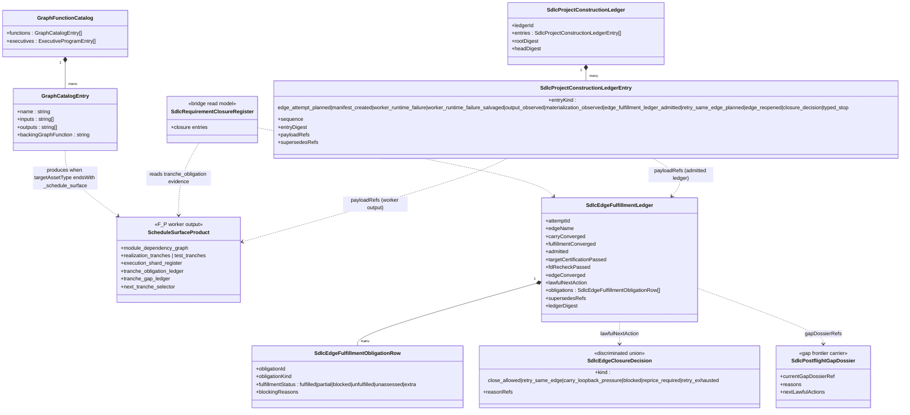
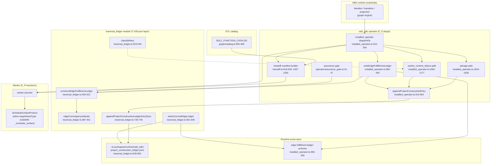
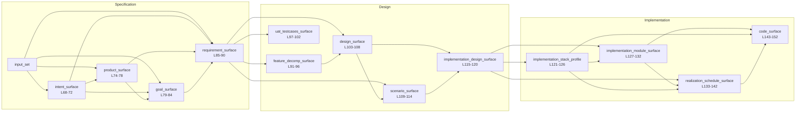
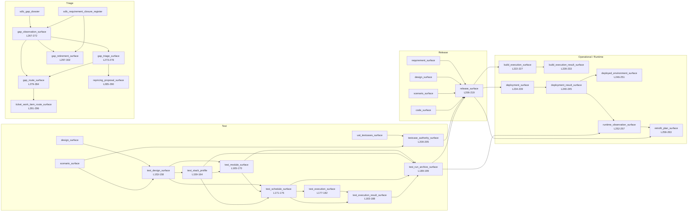
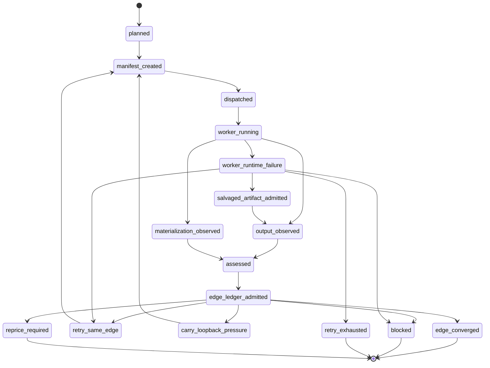
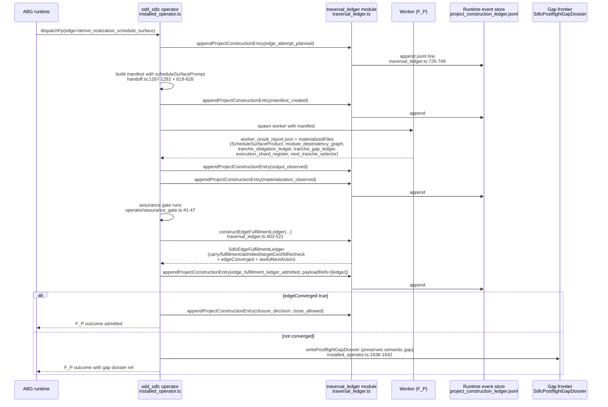
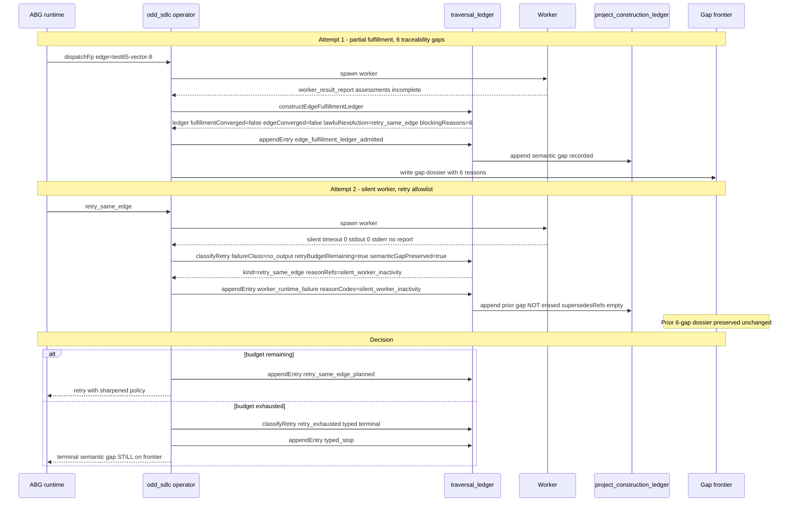

# Position

odd_sdlc carries two distinct ledger surfaces. They are not redundant and they
do not share a definition. The first is a graph-product layer: per-edge
schedule surfaces whose graph-owned outputs include their own dependency-graph
and tranche-obligation ledgers. The second is a runtime closure layer
introduced by T-109 (`traversal_ledger.ts`): an event-sourced project
construction ledger plus per-attempt edge fulfillment ledgers that hold
*closure authority over edges*. The SDLC graph DAG itself
(`graph/catalog.ts`) is the canonical dependency map across stages; both
ledger layers ride on top of it. A single traversal of one schedule-class edge
produces both kinds of artifact in one pass, with the runtime ledger admitting
the schedule surface as evidence and the runtime predicate gating closure.

# Layer 1 — Graph product layer

The SDLC catalog publishes one product-specialization entry per stage,
including six `_schedule_surface` outputs (realization, test, plus build/deploy
preparation surfaces). When the target asset type ends in `_schedule_surface`,
the operator instructs the worker to produce a structured graph-owned schedule
surface containing module-dependency-graph, tranche-obligation-ledger,
tranche-gap-ledger, execution-shard-register, and a next-tranche selector.
These are *outputs of the edge*. They live inside the F_P transform's product;
they are not closure authority over the edge.

Citations:

- `build_tenants/typescript/code/src/graph/catalog.ts:14-25` — `SdlcFunctionCatalogEntry` shape
- `build_tenants/typescript/code/src/graph/catalog.ts:36-41` — `SdlcGraphFunctionCatalog` aggregate
- `build_tenants/typescript/code/src/graph/catalog.ts:66-219` — `BOOTSTRAP_RELEASE_FUNCTION_CATALOG`
- `build_tenants/typescript/code/src/graph/catalog.ts:133-142` — `derive_realization_schedule_surface`
- `build_tenants/typescript/code/src/graph/catalog.ts:171-176` — `derive_test_schedule_surface`
- `build_tenants/typescript/code/src/operator/handoff.ts:1267-1282` — `scheduleSurfacePrompt` (required schedule-surface fields)
- `build_tenants/typescript/code/src/operator/handoff.ts:619-628` — schedule-tagged manifest tranche keys

# Layer 2 — Runtime closure layer

T-109 ratified an event-sourced ledger pair. The
`SdlcProjectConstructionLedger` is an append-only stream of typed entries
(`edge_attempt_planned`, `manifest_created`, `worker_runtime_failure`,
`worker_runtime_failure_salvaged`, `output_observed`, `materialization_observed`,
`edge_fulfillment_ledger_admitted`, `retry_same_edge_planned`, `edge_reopened`,
`closure_decision`, `typed_stop`). Per attempt, the operator constructs an
`SdlcEdgeFulfillmentLedger` from the manifest, worker report, postflight, and
assurance satisfaction; this ledger carries the five-term `edge_converged`
predicate and the lawful next action.

Citations:

- `build_tenants/typescript/code/src/operator/traversal_ledger.ts:40-51` — entry-kind union
- `build_tenants/typescript/code/src/operator/traversal_ledger.ts:80-107` — `SdlcProjectConstructionLedgerEntry` and `SdlcProjectConstructionLedger`
- `build_tenants/typescript/code/src/operator/traversal_ledger.ts:117-126` — `SdlcEdgeFulfillmentObligationRow`
- `build_tenants/typescript/code/src/operator/traversal_ledger.ts:128-152` — `SdlcEdgeClosureDecision` union
- `build_tenants/typescript/code/src/operator/traversal_ledger.ts:154-194` — `SdlcEdgeFulfillmentLedger`
- `build_tenants/typescript/code/src/operator/traversal_ledger.ts:387-401` — `edgeConverged` (five-term predicate)
- `build_tenants/typescript/code/src/operator/traversal_ledger.ts:403-521` — `constructEdgeFulfillmentLedger`
- `build_tenants/typescript/code/src/operator/traversal_ledger.ts:523-549` — `classifyRetry` (allowlist + budget)
- `build_tenants/typescript/code/src/operator/traversal_ledger.ts:591-646` — `selectCurrentEdgeLedger` (latest-per-slice projection with `edge_reopened` reset)
- `build_tenants/typescript/code/src/operator/traversal_ledger.ts:726-749` — `appendProjectConstructionLedgerEntrySync`
- `build_tenants/typescript/code/src/operator/installed_operator.ts:319-354` — operator wrapper `appendProjectConstructionEntry`
- `build_tenants/typescript/code/src/operator/installed_operator.ts:356-400` — `writeEdgeFulfillmentLedger`
- `build_tenants/typescript/code/src/operator/installed_operator.ts:1624-1636` — salvaged-artifact ledger entry
- `build_tenants/typescript/code/src/operator/assurance_gate.ts:41-47` — `SdlcOperatorAssuranceGateResult` (feeds satisfaction into ledger)
- `build_tenants/typescript/code/src/projection/requirement_closure.ts:103,337-340` — `SdlcRequirementClosureRegister` (bridge read model)
- `build_tenants/typescript/code/src/operator/carriers.ts:308-318` — `SdlcPostflightGapDossier` (gap frontier carrier)

Note on naming: the design surface uses names like
`SdlcRequirementResolutionProjection`, `SdlcGapFrontier`,
`SdlcWorkerRuntimeEvidence`, and `SdlcEdgeAttemptRecord`. The current
TypeScript implementation realizes the same roles under different
identifiers — `SdlcRequirementClosureRegister` for the bridge projection,
`SdlcPostflightGapDossier` for the gap frontier carrier, and an
event-sourced sequence of `SdlcProjectConstructionLedgerEntry` rows
(entry-kinds `worker_runtime_failure*`, `*_observed`, `edge_attempt_planned`,
`retry_same_edge_planned`) for what the design names worker-runtime-evidence
and edge-attempt-record. Diagrams below cite the implementation names and
flag design-only names where used.

# Distinction table

| Aspect | Graph-product ledger (Layer 1) | Runtime fulfillment ledger (Layer 2) |
|---|---|---|
| Definition site | Worker output schema (`scheduleSurfacePrompt`, handoff.ts:1267-1282) | Operator pure functions (traversal_ledger.ts:154-521) |
| Authoring agent | F_P worker | odd_sdlc operator |
| Lives inside | The graph product (an asset of asset-type `*_schedule_surface`) | `.ai-workspace/runtime/odd_sdlc/project_construction_ledger.jsonl` and `edge_fulfillment_ledger` archives |
| Models | Module dependencies, tranche obligations, gap ledger, next-tranche selector — *project plan structure* | Edge-attempt lifecycle, obligation fulfillment counts, closure decision — *edge closure authority* |
| Convergence | Graph-product convergence — was the schedule produced and admitted? | Five-term `edge_converged` predicate (traversal_ledger.ts:387-401) |
| Per | Edge output (one per traversal of a schedule-class edge) | Edge attempt (one per dispatch; superseded by latest assessed event) |
| Authority over closure | None directly; consumed as evidence | Yes — `lawfulNextAction` is computed here |
| Relationship | Output of edge | Closure authority over edge |

# Diagram 1 — Domain model: two ledger layers in odd_sdlc

Layer-1 vs Layer-2: `ScheduleSurfaceProduct` is an *output* of the edge,
authored by the worker. `SdlcEdgeFulfillmentLedger` is *closure authority over*
the edge, authored by the operator. The ledger admits the schedule surface as
evidence (via `outputRefs` / `materializedFileRefs`), not the other way
around.

Entity citations:

- `GraphCatalogEntry` — `graph/catalog.ts:14-25`
- `GraphFunctionCatalog` — `graph/catalog.ts:36-41`
- `ScheduleSurfaceProduct` — `operator/handoff.ts:1267-1282` (schema is design-named; admitted as the worker's `outputFile` in `traversal_ledger.ts:465`)
- `SdlcProjectConstructionLedger` — `traversal_ledger.ts:100-107`
- `SdlcProjectConstructionLedgerEntry` — `traversal_ledger.ts:80-98`
- `SdlcEdgeFulfillmentLedger` — `traversal_ledger.ts:154-194`
- `SdlcEdgeFulfillmentObligationRow` — `traversal_ledger.ts:117-126`
- `SdlcEdgeClosureDecision` — `traversal_ledger.ts:128-152`
- `SdlcPostflightGapDossier` — `operator/carriers.ts:308-318`
- `SdlcRequirementClosureRegister` — `projection/requirement_closure.ts:103,337-340`

# Diagram 2 — Component / UML deployment-style

# Diagram 3 — SDLC dependency DAG (catalog as dependency map)

The SDLC catalog *is* the dependency map across stages. Edges are inferred
from each entry's `inputs` and `outputs`. Citations to
`graph/catalog.ts` follow each box.

## Diagram 3a — Specification through code surface

## Diagram 3b — Test, release, runtime, triage

The triage subgraph closes the loop: `sdlc_requirement_closure_register`
(Layer-2-adjacent bridge projection) feeds `observe_gap_pressure` and
`retire_gap_after_loopback`, which is how runtime closure truth re-enters
the graph.

# Diagram 4 — Edge attempt state machine

Transition triggers and citations:

| From | To | Trigger | Source |
| --- | --- | --- | --- |
| `[*]` | `planned` | edge_attempt_planned entry kind | `traversal_ledger.ts:40-58` |
| `planned` | `manifest_created` | manifest_created entry | `traversal_ledger.ts:40-58` |
| `manifest_created` | `dispatched` | worker dispatched | `installed_operator.ts` dispatchFp |
| `worker_running` | `output_observed` | worker exit ok, report admitted | `traversal_ledger.ts:40-58` |
| `worker_running` | `materialization_observed` | product files materialized | `traversal_ledger.ts:40-58` |
| `worker_running` | `worker_runtime_failure` | silent / non-zero / signal | `installed_operator.ts:1094-1177` |
| `worker_runtime_failure` | `salvaged_artifact_admitted` | prior artifact valid for boundary | `installed_operator.ts:1624-1636` |
| `output_observed` / `materialization_observed` | `assessed` | assurance gate runs | `operator/assurance_gate.ts` |
| `assessed` | `edge_ledger_admitted` | constructEdgeFulfillmentLedger ok | `traversal_ledger.ts:403-521`, `installed_operator.ts:356-400` |
| `edge_ledger_admitted` | `edge_converged` | five-term predicate true | `traversal_ledger.ts:387-401` |
| `edge_ledger_admitted` | `retry_same_edge` | satisfaction.retry_same_edge | `traversal_ledger.ts:375-380` |
| `retry_same_edge` | `manifest_created` | retry_same_edge_planned entry | `traversal_ledger.ts:40-58` |
| `edge_ledger_admitted` | `carry_loopback_pressure` | closure decision kind | `traversal_ledger.ts:138-141` |
| `edge_ledger_admitted` | `blocked` | closure decision kind | `traversal_ledger.ts:382-385` |
| `edge_ledger_admitted` | `reprice_required` | satisfaction.reprice_required | `traversal_ledger.ts:369-374` |
| `worker_runtime_failure` | `retry_same_edge` | classifyRetry retryable, budget remaining, gap preserved | `traversal_ledger.ts:523-549` |
| `worker_runtime_failure` | `retry_exhausted` | retryable but budget exhausted | `traversal_ledger.ts:539-544` |
| `worker_runtime_failure` | `blocked` | non-retryable failure class | `traversal_ledger.ts:545-548` |
| `carry_loopback_pressure` | `manifest_created` | edge_reopened resets slice | `traversal_ledger.ts:600-605` |

The `edge_converged` predicate is the five-term conjunction: `carryConverged AND fulfillmentConverged AND admitted AND targetCertificationPassed AND fdRecheckPassed` (`traversal_ledger.ts:387-401`).

# Diagram 5 — Schedule-surface edge traversal sequence

The schedule surface (Layer 1) is the worker's product. The edge fulfillment
ledger (Layer 2) is the operator's authority. They coexist; the ledger
*admits* the schedule surface as evidence via `outputRefs`/`materializedFileRefs`
(`traversal_ledger.ts:462-472`).

# Diagram 6 — Silent-worker retry preserving semantic gap (design-correct)

Message sources and citations:

| Step | Source |
| --- | --- |
| Attempt 1 ledger construction | `traversal_ledger.ts:403-521`, `installed_operator.ts:356-400` |
| Gap dossier write | `installed_operator.ts:1638-1642` |
| Attempt 2 silent-worker classification | `installed_operator.ts:1099-1109` (current production path) |
| `classifyRetry` (design-correct) | `traversal_ledger.ts:523-549` |
| `worker_runtime_failure` entry | `traversal_ledger.ts:40-58` (entry kind) |
| Supersession rule (latest assessed{kind:fp} per slice; runtime failure does not supersede) | design law `ODD_SDLC_TYPESCRIPT_TRAVERSAL_LEDGER_SOLUTION.md:933-974` |
| `retry_exhausted` typed terminal | `traversal_ledger.ts:539-544` |

Caption: this diagram shows the design-correct flow per the T-109 ratified
solution. Per the STDO review findings F1 and F2 (see
`comments/claude/20260502T041530AEST_REVIEW_T-109-implementation-stdo.md`),
production code at `installed_operator.ts:1099-1109` and
`installed_operator.ts:1672-1683` does not yet route the silent-worker /
non-salvaged failure paths through `classifyRetry` and the new ledger module.
The diagram describes the lawful target, not the current production reality.

# Notes on production reality

T-109 is implemented as a pure module (`traversal_ledger.ts`), wired into the
positive-output path (`installed_operator.ts:356-400` and the salvage path at
`:1624-1636`), but legacy postflight branches still construct blocking
postflights directly without going through `classifyRetry` and without
appending the matching `worker_runtime_failure` entry kinds in all cases.
Specific findings are anchored in the STDO review:

- F1 — `constructWorkerProcessFailurePostflight`
  (`installed_operator.ts:1094-1177`) does not invoke `classifyRetry` and does
  not append a `worker_runtime_failure` entry tied to the allowlist
  classification.
- F2 — non-salvaged failure return at `installed_operator.ts:1672-1683`
  appends a `typed_stop` entry but does not interpose the
  `worker_runtime_failure` event kind, leaving the entry stream less
  diagnosable.
- F3 / F4 — see review post for retry-budget surface and digest-mismatch
  handling.

These do not invalidate the diagrams above; they identify the gap between the
ratified design (Diagram 4, Diagram 6) and current production wiring.

# Glossary

- **Graph product** — an output asset produced by an F_P transform under a
  catalog entry; e.g. a `realization_schedule_surface` with internal
  module-dependency-graph and tranche ledgers. Lives in worker output, not in
  operator runtime state.
- **Runtime ledger** — operator-authored event-sourced record of edge
  attempts; concretely, `project_construction_ledger.jsonl` plus per-attempt
  `SdlcEdgeFulfillmentLedger` archives.
- **Edge attempt** — one dispatch of a worker for one (edge, slice) pair;
  `slice = (edgeName, workKey, specHash, runId, callId)`
  (`traversal_ledger.ts:53-59`).
- **Fulfillment** — match between obligations declared in the manifest's
  traversal-obligation context and assessments returned by the worker
  (`traversal_ledger.ts:288-349`).
- **Closure authority** — the right to mark an edge converged or to choose
  the lawful next action; carried by `SdlcEdgeFulfillmentLedger.edgeConverged`
  and `lawfulNextAction` (`traversal_ledger.ts:387-401, 358-385`).
- **Gap frontier** — the persistent surface of unresolved semantic gaps;
  realized as `SdlcPostflightGapDossier` (`carriers.ts:308-318`); preserved
  across retries and not erased by transport-class failures.
- **Supersession** — replacement of a prior edge ledger by a later one in
  the same slice; expressed via `supersedesRefs` and validated in
  `selectCurrentEdgeLedger` (`traversal_ledger.ts:625-644`); the latest
  assessed event wins, not a union of all events.

# Status

This post is commentary, not ratified specification. It describes carriers
and flows already present in `traversal_ledger.ts`, the catalog, and the
operator wiring at the cited line ranges. Where a design name is not yet
realized in source under the same identifier, the implementation name is
used and the design name is flagged in prose.
