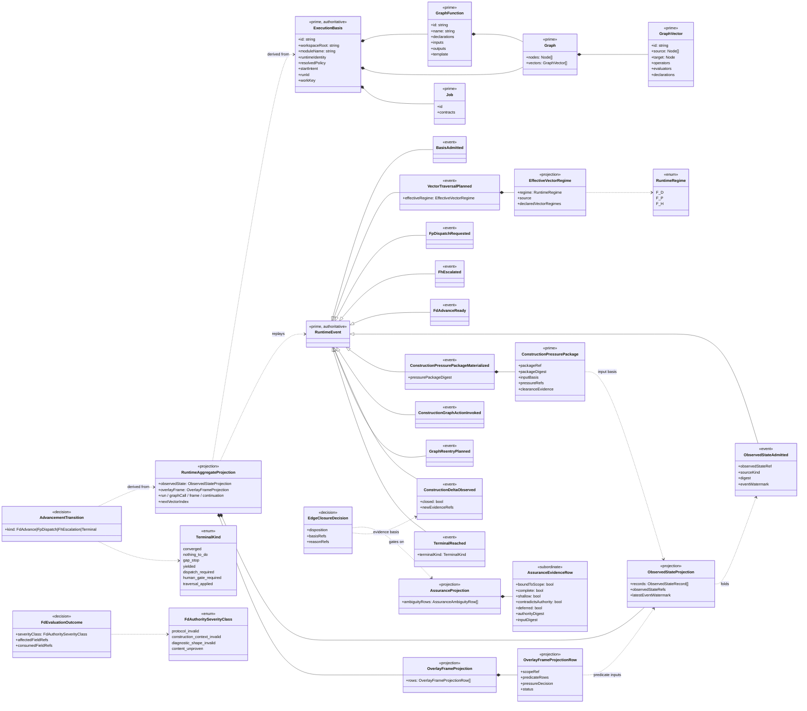
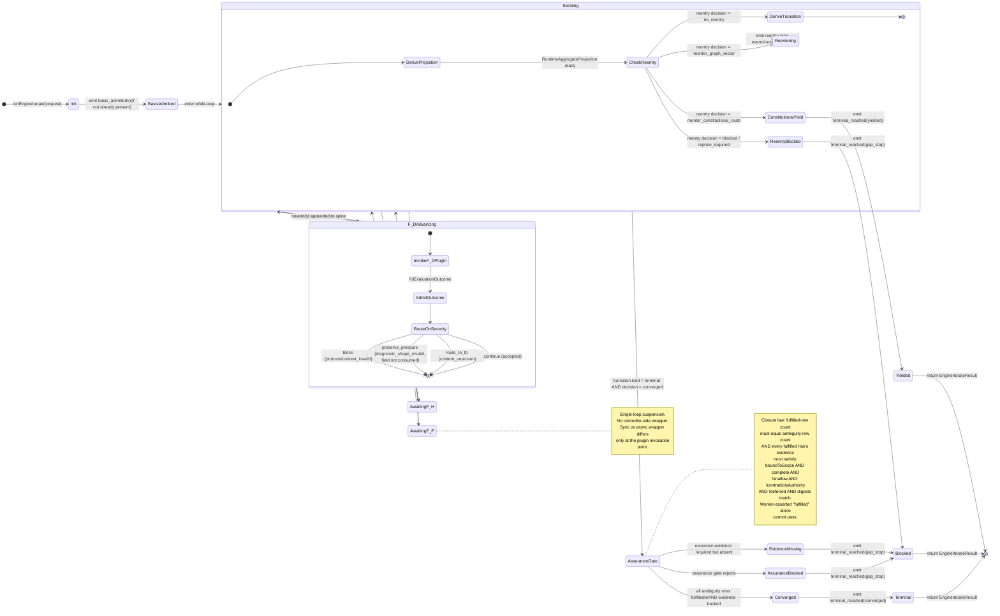

# Review: ABG Substrate Fulfills The test35 Strategy; The Consumer Boundary Is Where Parity Now Lives Or Dies

**Created**: 2026-05-16T08:00:00Z
**Author**: claude
**Scope**: Holistic code review of `abiogenesis/build_tenants/abiogenesis/typescript/code/src/abg/m03/` against the test35-parity diagnosis and strategy.
**References**:

- `MASTER_test35_attempts_failure_reference.md`
  (`.ai-workspace/comments/codex/20260516T021725Z_MASTER_test35_attempts_failure_reference.md`)
- `STRATEGY_fp_fd_eventual_consistency_steel_thread_execution.md`
  (`.ai-workspace/comments/codex/20260516T024852Z_STRATEGY_fp_fd_eventual_consistency_steel_thread_execution.md`)
- `DESIGN_MODULE_METHOD.md`
  (`/Users/jim/src/apps/specification_methodology/specification/standards/DESIGN_MODULE_METHOD.md`)

This is a review. It is commentary, not ratified specification.

## Position

The ABG M03 substrate, as it now stands after T-127 through T-140, **provides
every carrier the test35 10-step recovery chain requires**. It also
**structurally prevents** the F1 (closure predicate drift), F7 (non-close
pressure not surviving), and F10 (F_D overreach) failure modes at the
substrate layer.

But the substrate does not — and structurally cannot — prevent those failure
modes from re-appearing at the consumer layer.

The strategic conclusion is therefore:

```text
The substrate is no longer the constraint.
test35 parity is now a consumer-declaration problem.
T-170 is the right scope; its acceptance must be the consumer audits
that close the remaining trust boundary, not more substrate work.
```

## Background

The MASTER reference identified 12 failure classes (F1–F12) culminating in
the framing that "`F_D` is occupying the closure center," producing two
opposite symptoms across the prior waves:

- data_mapper T-164: too permissive on product behavior → null execution
  evidence, stubs, false `product_converged`
- current hello-world: too strict on internal register shape → 27 worker
  briefs on a one-file product

The STRATEGY paper resolved the framing by replacing "constrain F_D better"
with three architectural principles:

1. **Eventual consistency** — F_P will be wrong; quality is convergence rate
   across attempts, not single-attempt correctness
2. **Steel thread** — keep end-to-end progress; don't perfect any one edge
3. **Completeness through execution** — close on execution evidence, not
   static admission; static checks gate the *try*, not the close

This review asks whether the substrate now in place actually supports those
three principles, and which of the 12 failure classes are structurally
prevented vs. structurally possible-but-not-prevented.

## What The Substrate Structurally Enforces

The following findings are anchored to specific code locations in the
current substrate.

### S1. Closure requires admitted evidence rows, not worker assertion

```text
assurance.ts:771-780
  fulfilledRows = statusRows(projection, "fulfilled")
  if (fulfilledRows.length === projection.ambiguityRows.length)
    return decision({ decision: "close",
                      reason: "all_required_rows_are_fulfilled" })

assurance.ts:257-271
  isCurrentFulfillmentEvidence(snapshot, evidence) iff
    evidence.boundToScope
    && evidence.complete
    && !evidence.shallow
    && !evidence.contradictsAuthority
    && !evidence.deferred
    && evidence.authorityDigest matches snapshot
    && evidence.inputDigest matches snapshot
```

This addresses **F1 (closure predicate drift)** and **F4 (worker assertion as
closure authority)** at the structural level: a worker simply asserting
"fulfilled" does not produce a fulfilled row. The row must be an admitted
`AssuranceEvidenceRow` with the five flags set correctly and digests
matching the authority snapshot.

The qualifier: those flags are populated by the consumer. See the
"Residual Trust Boundary" section below.

### S2. Pressure clears only on admitted `closed: true` events

```text
construction_pressure_package.ts:439-448
  if (event.kind === "construction_delta_observed" && event.closed) {
    openPressureRefs.delete(pressureRef)
    clearedPressureRefs.add(pressureRef)
    for (evidenceRef of event.newEvidenceRefs)
      clearanceEvidenceRefs.add(evidenceRef)
  }
```

This addresses **F7 (non-close pressure not surviving)** and **F8 (overlay
overclaim)** at the structural level. Pressure refs cannot be cleared by
worker fulfillment status, by overlay completion alone, or by a "convergence
projection" — they require an emitted `construction_delta_observed` event
with `closed: true` and accompanying evidence refs.

The qualifier: the consumer emits this event. The substrate has no way to
verify that `closed: true` reflects real progress vs. false closure.

### S3. F_D severity routing: content_unproven goes to F_P, never blocks

```text
plugins.ts:438-467 derivePressureRoutingDecision(input)
  switch (input.severityClass) {
    case "protocol_invalid":            return "block"
    case "construction_context_invalid": return "block"
    case "diagnostic_shape_invalid":
      return fieldRefsIntersect(input.affectedFieldRefs,
                                 input.consumedFieldRefs)
        ? "block" : "preserve_pressure"
    case "content_unproven":            return "route_to_fp"
  }
```

This addresses **F10 (F_D overreach / register-shape domination)**
structurally. The four-class severity vocabulary is in place; `F_D` cannot
block content closure unilaterally. `diagnostic_shape_invalid` only blocks
when the affected field is actually consumed by downstream routing — the
downstream-read graph check is the decidability rule that prevents the
hello-world-style "27 briefs on register shape" failure.

The qualifier: F_D plugins must produce typed `FdAuthoritySeverityClass`
outcomes for this routing to fire. Legacy `accepted | blocked` plugins
bypass the new vocabulary.

### S4. Mixed-regime runner: one loop owns multi-attempt iteration

```text
engine_runner.ts:888-999 (the runner loop body)
engine_runner.ts:1444-1446 (the sync/async drive)
  let step = machine.next();
  while (!step.done) {
    step = machine.next(resolveSyncEnginePluginEffect(step.value, plugins));
  }
```

The runner is a tail-recursive machine over admitted runtime events. F_P
dispatch, F_D advance, F_H escalation, retry/repair, and reentry are all
states of the single loop. Sync and async wrappers differ only at the
plugin invocation point (after T-140 collapsed the previously-duplicated
sync/async bodies).

This addresses the strategy principle **"don't introduce a second
mechanical loop control."** Consumers do not need a controller-side
`while True` to drive multi-attempt iteration. The Python SDLC outer
loop's scheduling behavior is now substrate-native.

### S5. Overlay predicates consume admitted observed state, not ambient reads

```text
overlay_frame.ts:257-272 evaluatePredicate(predicate, observedState)
  const available = new Set(observedState.observedStateRefs);
  const missingObservedStateRefs =
    predicate.observedStateRefs.filter(
      ref => !available.has(ref)
    );
  return {
    satisfied: missingObservedStateRefs.length === 0,
    ...
  };
```

Overlay `fire_when` / `terminate_when` predicates resolve their inputs
against `ObservedStateProjection.observedStateRefs` from the aggregate
projection (`projection.ts:853-857`). They do not read the filesystem,
do not consult worker prose, do not invoke ambient configuration.

This makes overlay decisions **replay-deterministic** and supports the
steel-thread principle: an overlay declares which observed state it
watches, fires when those states show pressure, terminates when clearance
events arrive. No controller loop required.

## What The Substrate Cannot Enforce — The Residual Trust Boundary

The substrate's defense is structural. The consumer remains trusted to
populate semantic content honestly. Five places this matters.

### R1. Evidence row flags are consumer-set booleans

`assurance.ts:257-271` requires `boundToScope`, `complete`, `!shallow`,
`!contradictsAuthority`, `!deferred`. Those are booleans on
`AssuranceEvidenceRow`, set by whoever admits the row. The substrate
cannot tell whether the booleans reflect the underlying reality.

A consumer that admits an evidence row with `complete: true` based only on
worker-asserted fulfillment, with no executed test behind it, reproduces
**F4 (worker assertion as closure authority)** at the consumer layer. The
substrate's closure law passes the check structurally because the flag is
set.

The consumer-side fix is an **evidence policy** that requires admitted
execution events before `complete: true` can be set on an evidence row.
That policy is declared in the graph, not the substrate.

### R2. `construction_delta_observed.closed` is a free boolean

`construction_pressure_package.ts:445` gates pressure clearance on
`event.closed`. The substrate has no veto on the value the consumer emits.
A consumer emitting `closed: true` after worker-fulfillment without
admitted execution evidence clears pressure and reproduces **F1** plus
**F7** at the consumer layer.

A structural tightening worth considering: require
`event.closureBasisRef` to point at an admitted evidence-bundle, and
let `closed: true` only resolve to "true" when the basis ref is non-null
and present in the event stream. This converts the free bool into a typed
admission requirement. Optional; not a current blocker.

### R3. F_D plugins must produce the four severity classes

`plugins.ts:438-467` is dead code unless the F_D plugin output carries
`severityClass: FdAuthoritySeverityClass`. A consumer running an older
F_D plugin that produces only `accepted | blocked` bypasses the routing
entirely — the new vocabulary doesn't activate. F10 returns under the
old shape.

The fix is consumer-side: F_D plugins must be updated to classify
outcomes per the four-class vocabulary. This is an audit of plugin
contracts, not substrate work.

### R4. Overlays must be declared to take effect

The substrate provides the overlay-frame contract; it does not auto-apply
overlays. A consumer that does not declare a `thread` overlay for
hello-world gets full-lifecycle traversal regardless of how clean the
substrate is. The hello-world failure mode the MASTER reference described
(27 worker briefs on a one-file product) is consumer-side overlay-binding
policy, not substrate enforcement.

The fix is consumer-side: project profile or explicit operator selection
binds `overlay: thread | breadth | full_lifecycle` per the strategy's §5.
Without that binding, the steel-thread principle is unimplemented at the
consumer layer no matter what the substrate provides.

### R5. Execution contracts must be declared per edge

For the closure law to require execution evidence on an executable edge,
the consumer must declare `executionRequired` (or equivalent) on the
edge's gain function or assurance contract. Without that declaration, the
closure law passes when `fulfilled` rows exist, even if those rows are
not backed by execution.

This is the **F3 (execution evidence missing or null)** failure mode at
the consumer layer. The substrate's structural support for
"execution-required → execution-evidence-required" is conditional on the
consumer declaring the requirement on the edge.

## Test35 Step-By-Step Layer Assignment

Mapping the 10-step recovery chain from the MASTER reference to where each
step is enforced today:

| Test35 step | Substrate provides | Consumer must declare or emit |
| --- | --- | --- |
| 1. Product authority admitted | `ObservedStateProjection`, admission events | Which workspace/registers count as authority |
| 2. Edge declares F_P obligation | Vector-local regime resolution, ABG.Fn composition contract | Per-edge regime + obligation declarations |
| 3. Worker receives construction authority | `ConstructionPressurePackage` carrier | Pressure projector that fills the package |
| 4. F_P creates/repairs product assets | Runner invocation + materialization manifest carriers | Actual graph functions that emit assets |
| 5. F_P creates/repairs tests | Same as 4 | Tests-as-edges declarations |
| 6. F_P/content evaluation | Evidence admission carriers + F_D severity routing | Content-judgment evaluator per edge |
| 7. F_D admits returned facts | `AssuranceEvidenceRow` admission rules | F_D plugin producing typed severity outcomes |
| 8. Execution evidence required for executable | Closure law gates on `fulfilled` + evidence flags | Per-edge declaration that execution is required |
| 9. Closure records F_P judgment + evidence | `EdgeClosureDecision`, `ConstructionDeltaObservedEvent` | Honest event emission with admitted basis |
| 10. Next-action projection preserves pressure | `ConstructionPressureProjection`, overlay pressure carry/clear | Pressure refs populated honestly; no clearing on `productConverged` alone |

Of the 10 steps, **the substrate carries 100% of the structural carriers**.
Steps 1, 2, 3, 6, 7, 8, 10 are gated by consumer-declared policy on top of
those carriers. Steps 4, 5, 9 are entirely consumer-execution.

## Failure-Class Status

| Failure | Status | Where |
| --- | --- | --- |
| F1 closure predicate drift | structurally prevented at substrate; consumer responsibility for `complete` flag and `closed` flag | R1, R2 |
| F2 materialization mistaken for behavior | substrate provides evidence-dimension separation; consumer policy decides which dimension counts | consumer evidence policy |
| F3 execution evidence missing or null | substrate enforces conditional on declaration | R5 |
| F4 worker assertion as closure authority | substrate prevents direct path; consumer can reintroduce via flag setting | R1 |
| F5 requirement IDs without authority evaluation | substrate provides `authorityDigest` match; consumer must populate honestly | consumer evidence admission |
| F6 broad edges replacing planned work packages | substrate supports work-package decomposition; consumer must declare it | consumer graph design |
| F7 non-close pressure not surviving | structurally prevented | S2 |
| F8 overlay/product scope overclaim | substrate prevents via overlay pressure carry/clear; consumer must use overlays | R4 |
| F9 assurance ledgers exist but not decisive | substrate makes ledger decisive; consumer must wire to it | consumer wiring |
| F10 F_D overreach | structurally prevented when plugins output four classes | R3 |
| F11 product target authority missing or inferred | consumer-side concern entirely | consumer |
| F12 harness proof stronger than runtime proof | consumer testing methodology | consumer |

**Substrate-prevented**: F1 (with R1/R2 caveats), F7, F10 (with R3 caveat).
**Substrate-supported-consumer-must-use**: F2, F3, F4, F5, F6, F8, F9.
**Consumer-entirely**: F11, F12.

## Three-Principle Status

### Eventual consistency

Substrate-supported. The runner drives multi-attempt iteration in one loop;
pressure preservation prevents premature clearance; observed state admission
makes re-entry decisions replay-deterministic. The principle is achievable
when the consumer (a) declares retry/repair edges, (b) emits pressure
clearance only on admitted evidence, (c) consumes the pressure projection in
next-action decisions.

### Steel thread

Substrate-supported. Overlay frame contract allows `thread | breadth |
full_lifecycle` declaration; vector-local regime resolution allows F_D edges
to auto-advance and F_P edges to suspend; edge composition supports narrow
paths. The principle is achievable when the consumer binds the appropriate
overlay per profile.

### Completeness through execution

Substrate-supported. Closure law requires admitted evidence rows; F_D
severity routes content failures to F_P; execution-evidence-as-close-
predicate is enforceable when the edge declares it. The principle is
achievable when the consumer declares `executionRequired` on executable
edges and populates `AssuranceEvidenceRow.complete` only from admitted
execution events.

## Residual Substrate-Side Risks

Three optional tightenings, queued as opportunistic cleanup, not blockers
on consumer-side work:

### Sx1. `event.closed` should derive from a typed closure basis

`construction_delta_observed.closed` is a free bool today (R2). Stronger:
require `event.closureBasisRef` to point at an admitted evidence-bundle,
and let `closed` derive from non-null basis ref presence. Closes the R2
trust gap structurally.

### Sx2. `complete` / `boundToScope` flags should derive from typed admission proofs

`AssuranceEvidenceRow.complete` is a free bool today (R1). Stronger:
require typed `CompletenessAttestation` and `ScopeBindingProof` sub-carriers
with their own admission rules. Converts R1 from "trust the consumer" to
"prove via typed admission."

### Sx3. `fp_consciousness.ts` is now a 20-line barrel; add a transitional marker

Consumers importing from `fp_consciousness.ts` get the same surface as
importing from the prime modules. There is no signal that the barrel is
transitional. If T-140's intent was barrel-during-migration, the barrel
should carry a `// @deprecated: import from prime modules directly`
marker so consumer imports migrate over time.

None of Sx1–Sx3 block test35-parity work. They tighten the substrate's
defense against future consumer drift.

## The Gating Question

The substrate cannot tell you whether test35 parity is achieved. It can
tell you whether the consumer is **capable** of declaring it. The remaining
question lives at the consumer:

1. Does `odd_sdlc` declare `executionRequired` on every edge that has an
   execution command (sbt, node --test, pytest, etc.)?
2. Does `odd_sdlc`'s F_D plugin output the four severity classes, or still
   `accepted | blocked`?
3. Does `odd_sdlc` declare a `thread` overlay for hello_world and a
   `breadth | full_lifecycle` overlay for data_mapper?
4. Does `odd_sdlc` populate `AssuranceEvidenceRow.complete: true` only on
   actually-admitted execution-evidence events?
5. Does `odd_sdlc`'s pressure projector emit `construction_delta_observed`
   with `closed: true` only when the pressure is truly cleared by admitted
   evidence?

If those five things are true, **test35 parity is achievable on the current
substrate**. If any of them defaults to the convenient/wrong choice, the
substrate cannot prevent F1/F4 from reappearing at the consumer layer.

## Recommendation

The substrate work is done as far as substrate work can be done. The
STRATEGY paper's three principles are structurally expressible in the
substrate's vocabulary. The 12 failure classes either are prevented or
require explicit consumer-side declarations the substrate carriers exist to
support.

The active consumer work is **T-170**
(`odd_sdlc/.ai-workspace/tickets/active/T-170-implement-authority-placement-strategy-and-repair-fd-overreach.md`).
Its concrete scope, given this substrate, is:

1. **Audit `odd_sdlc` edge contracts** for `executionRequired` on every
   edge that declares an execution command. Closes R5.
2. **Audit `odd_sdlc` F_D plugin output** — confirm it produces
   `FdAuthoritySeverityClass`, not legacy binary. Closes R3.
3. **Audit `odd_sdlc` overlay declarations** — `hello_world` binds
   `thread`; `data_mapper` binds `breadth | full_lifecycle`. Closes R4.
4. **Audit `odd_sdlc` evidence-row construction** — every
   `AssuranceEvidenceRow.complete: true` traces to admitted
   execution-evidence events. Closes R1.
5. **Audit `odd_sdlc` pressure-clearance emission** — every
   `construction_delta_observed.closed: true` carries an admitted
   evidence-bundle ref. Closes R2.

Plus the existing T-139 closure gate: the named deletion of
`installed_operator.ts` projection auto-advance loop or equivalent
controller-side reconstruction of admitted substrate truth.

If T-170 lands those five audits cleanly and the deletion is honest,
test35-parity claim becomes a measurement question: re-run the
hello-world and data_mapper lanes against the new substrate-plus-audited-
consumer, and the analyzer (T-161) projects convergence rate, execution
coverage at close, and F_D failure mix to confirm.

If the audits surface that consumer-declared shapes don't match the
substrate's expectations (e.g., the F_D plugin still outputs binary, no
overlay is declared for hello_world, etc.), each finding is a small
consumer-side ticket — not substrate work.

## Closing Note On Discipline

The STRATEGY paper said:

> "F_P exists because F_D cannot handle ambiguity. The architectural
> response to probabilistic F_P is not more or better F_D gates. It is:
> eventual consistency, steel thread, completeness through execution."

The substrate now expresses that response in code. The next discipline
test is whether the consumer-side work follows the same logic. Three
patterns to refuse during T-170:

- "We'll just add one more F_D check to be safe." Refuse — that's how
  F10 returns.
- "Worker says fulfilled, we'll mark the evidence row complete." Refuse —
  that's how F4 returns at the consumer layer.
- "We'll let `productConverged` clear remaining pressure for now."
  Refuse — that's how F8 returns.

The substrate now structurally forbids these at its own layer. The
consumer must structurally forbid them at its layer. That's the
remaining work.

## Appendix A: ABG Core Domain Model

The diagram below shows the irreducible architectural carrier set for ABG
M03 as it stands today. Stereotypes follow `DESIGN_MODULE_METHOD §5E`:
`<<prime>>` for primary identity-bearing carriers, `<<event>>` for
admitted runtime events, `<<projection>>` for replay-derived projections,
`<<decision>>` for derived decision artifacts, `<<enum>>` for closed value
sets. Authoritative carriers are the event spine and the basis. Everything
else is derived.



**Reading guide**: the two authoritative carriers are `ExecutionBasis`
(static input identity) and `RuntimeEvent` (the append-only spine).
Everything labelled `<<projection>>` or `<<decision>>` is derived by
replay. `EdgeClosureDecision` is gated on `AssuranceProjection`, which in
turn requires `AssuranceEvidenceRow` flags backed by admitted events.
`ConstructionPressurePackage` is the test35-style construction manifest
carrier; it draws its input basis from `ObservedStateProjection` so the
admitted observation history is the package's source of truth, not
ambient filesystem reads.

## Appendix B: ABG Runner Core Route — State Diagram

The runner is a single tail-recursive machine over admitted events. The
state diagram below shows the core route: each state represents the
runner's position in the iteration loop; each transition is triggered by
a derived decision (`AdvancementTransition`, reentry decision, assurance
gate) or by an admitted event (plugin outcome, worker result, human
decision).

There is no second mechanical loop. Suspension states (`AwaitingF_P`,
`AwaitingF_H`) yield control to the plugin layer and resume on event
admission. F_D states advance synchronously through the same loop.



**Reading guide**: the **steel thread** is the path
`Init → BasisAdmitted → Iterating → (F_DAdvancing | AwaitingF_P) →
Iterating → AssuranceGate → Converged → Terminal`. The **eventual
consistency** property is the loop-back from `F_DAdvancing` /
`AwaitingF_P` / `Reentering` to `Iterating`, with each round admitting
new events and re-deriving projections. The **completeness through
execution** property is the `AssuranceGate` predicate at the terminal
transition — convergence is structurally distinct from "decision-says-
done" because the gate requires admitted evidence with the five flags
set. The three failure modes the substrate structurally prevents
(F1, F7, F10) are blocked at `AssuranceGate`, at the pressure-clearance
predicate within `Iterating`'s observation derivation, and at
`RouteOnSeverity` respectively.

The diagram intentionally does not show every event kind — the prime
states are what matter for the core route. Full event vocabulary is in
the `RuntimeEvent` hierarchy in Appendix A.

---

This is commentary, not law. The findings are provisional and based on
substrate state as of 2026-05-16. Ratification of any structural change
(particularly Sx1–Sx3) belongs in a separate spec/design re-entry under
`SPEC_METHOD.md`. T-170 scope adjustments belong in the ticket itself
under `TICKET_METHOD.md`.
