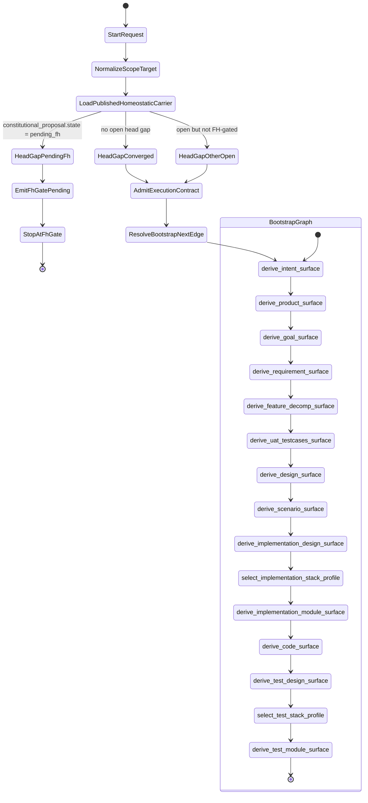

# SCHEMA: Lawful Bootstrap Start Sequence

**Author**: codex
**Date**: 2026-04-22T12:06:56Z
**Addresses**: `B-035`, public `odd_sdlc start --target next`, homeostatic gap triage, bootstrap graph admission
**Status**: Draft

## Summary

This post describes the lawful start sequence for the bootstrap graph under the
current `B-035` target direction.

Current reality and target direction are both covered.

Current reality:

- `gaps` publishes constitutional `pending_fh` truth through triage and the gap
  dossier surface
- `start(next)` currently contains a separate pre-dispatch stop branch in
  `app.py`
- the raw `next` execution-contract path still exists behind that branch

Target direction:

- `start(next)` and `gaps` consume one authoritative homeostatic carrier
- unresolved `pending_fh` stops before execution-contract admission
- no constructive run events appear before lawful FH resolution

## Analysis

Relevant source surfaces:

- [app.py](/Users/jim/src/apps/odd_sdlc/build_tenants/python/code/odd_sdlc/app.py:343)
- [triage.py](/Users/jim/src/apps/odd_sdlc/build_tenants/python/code/odd_sdlc/triage.py:303)
- [gap_dossier.py](/Users/jim/src/apps/odd_sdlc/build_tenants/python/code/odd_sdlc/gap_dossier.py:347)
- [execution_contract.py](/Users/jim/src/apps/odd_sdlc/build_tenants/python/code/odd_sdlc/execution_contract.py:767)
- [start_targeting.py](/Users/jim/src/apps/odd_sdlc/build_tenants/python/code/odd_sdlc/start_targeting.py:288)
- [test_odd_sdlc_sandbox_usecase.py](/Users/jim/src/apps/odd_sdlc/build_tenants/python/test_env/tests/test_odd_sdlc_sandbox_usecase.py:38)

Bootstrap graph sequence in current published order:

1. `derive_intent_surface`
2. `derive_product_surface`
3. `derive_goal_surface`
4. `derive_requirement_surface`
5. `derive_feature_decomp_surface`
6. `derive_uat_testcases_surface`
7. `derive_design_surface`
8. `derive_scenario_surface`
9. `derive_implementation_design_surface`
10. `select_implementation_stack_profile`
11. `derive_implementation_module_surface`
12. `derive_code_surface`
13. `derive_test_design_surface`
14. `select_test_stack_profile`
15. `derive_test_module_surface`

The lawful state machine for `start(next)` is:

Lawful event consequences:

- if `HeadGapPendingFh` is true:
  - emit `fh_gate_pending`
  - do not emit `execution_contract_drafted`
  - do not emit `execution_contract_admitted`
  - do not emit `run_bound`
  - do not emit `worker_turn_started`
  - do not emit `fp_dispatched`
- if the head gap is lawfully clear:
  - admit the execution contract once
  - bind the next edge from the same governing carrier
  - traverse the bootstrap graph in published edge order

Current structural defect against this target:

- `start(next)` currently consults a rebuilt gap snapshot and then falls back to
  the old raw `next` admission path rather than deriving both stop/proceed
  outcomes from one admitted source carrier

## Recommended Action

1. Rebind `start(next)` around one admitted pre-dispatch carrier that contains:
   - head edge
   - route binding
   - constitutional proposal state
   - stop/proceed decision
2. Make execution-contract admission consume that carrier rather than raw
   `next` resolution.
3. Keep the negative proofs:
   - no execution contract before unresolved FH gate clears
   - no constructive run events before unresolved FH gate clears
