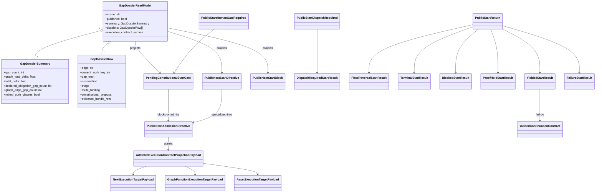

# SCHEMA: Typed Public Start Interface Touch Map

**Author**: codex
**Date**: 2026-04-22T17:14:45Z
**Addresses**: `odd_sdlc` public-start typing closure across `build_tenants/python/code/odd_sdlc/gap_dossier.py`, `public_start.py`, `app.py`, `execution_contract.py`, `query.py`, and the ABG continuation/result producer boundary; informed by `comments/claude/20260423T020000Z_STRATEGY_half-typed-carriers-and-port-question.md`
**Status**: Open
**Updated**: 2026-04-22T17:42:20Z

## Summary

This post describes both current reality and target direction.

Current reality: the public-start slice is typed at the envelope and still open at the payload. The branch families are named, but the semantic payloads are still carried through `dict[str, Any]`, `Mapping[str, Any]`, and `Any` at the load-bearing boundaries.

Target direction: one closed class model for the public-start chain, then one inside-out touch sequence over that class model. This post is decision-neutral between Python-native payload typing and a TypeScript port. It names the interface family that either path must touch.

The scope is intentionally bounded. This is not the whole `odd_sdlc` codebase. It is the full interface family for:

- published gap dossier read model
- public start admission
- admitted execution contract projection
- public start iteration/result projection
- yielded continuation consumer and producer boundary
- query-domain exposure of the same surfaces

## Analysis

## Class Model

### Python Carrier Definitions

These are the closed carriers the current slice needs. They are shown as Python class definitions because the current line is Python. If the repo later ports this slice, these definitions still describe the same semantic family.

```python
from __future__ import annotations

from dataclasses import dataclass
from typing import Literal, NotRequired, TypedDict, TypeAlias


RouteState: TypeAlias = Literal[
    "advance_dynamic_family",
    "advance_fixed_vector",
    "await_fh_resolution",
    "constitutional_reprice_approved",
    "suppressed_by_mode",
]
ProposalState: TypeAlias = Literal[
    "pending_fh",
    "approve_with_edits",
    "approved",
    "revoked",
    "defer",
    "suppressed",
]
ProposalKind: TypeAlias = Literal[
    "goal_reprice",
    "intent_reprice",
    "product_reprice",
    "requirement_reprice",
    "design_reframe",
    "realization_refactor",
]
FailureClass: TypeAlias = Literal[
    "transport_failure",
    "no_output",
    "contract_failure",
    "policy_config_defect",
    "runtime_defect",
    "proof_failure",
    "fd_findings",
]
StopPredicate: TypeAlias = Literal[
    "human_gate_required",
    "dispatch_required",
    "gap_stop",
    "yielded",
    "proof_hold",
    "converged",
    "traversal_applied",
    "publish_gap_dossier",
    "published_head_gap_required",
    "published_head_route_required",
    "head_route_not_start_authoritative",
    "no_open_gap",
]
BlockedReason: TypeAlias = Literal[
    "fh_gate",
    "published_gap_dossier_unavailable",
    "head_gap_unavailable",
    "route_binding_unavailable",
    "public_next_start_unavailable",
    "route_binding_not_start_authoritative",
    "converged",
]
StoppedBy: TypeAlias = Literal[
    "fh_gate",
    "fp_dispatch",
    "fd_gap",
    "yield",
    "proof_hold",
    "published_gap_dossier",
    "route_binding",
    "converged",
    "fp_runtime_failure",
]
ExecutionTargetKind: TypeAlias = Literal["next", "graph_function", "asset"]
RunStatus: TypeAlias = Literal[
    "pending",
    "yield",
    "converged",
    "nothing_to_do",
    "blocked",
    "error",
    "iterated",
    "in_progress",
    "queued",
    "needs_selection",
    "dispatched",
]


class GapDossierSummary(TypedDict):
    gap_count: int
    declared_obligation_gap_count: int
    graph_edge_gap_count: int
    mixed_truth_classes: bool
    graph_total_delta: float
    total_delta: float


class EvidenceBundleRefs(TypedDict, total=False):
    current_triage_artifact_path: str
    observation_event_id: str
    triage_event_id: str
    route_event_id: str
    constitutional_event_id: str


class RouteBindingProjection(TypedDict):
    state: RouteState
    selected_graphfunction: NotRequired[str]


class GapTruthProjection(TypedDict):
    gap_kind: str
    graph_delta: float | int | None
    carry_delta: float | int | None
    fulfillment_delta: float | int | None
    combined_delta: float | int | None
    total_delta: float | int | None
    graph_converged: bool
    carry_converged: bool
    fulfillment_converged: bool
    edge_converged: bool
    blocking_reasons: list[str]
    failing: list[str]
    graph_failing: list[str]
    signal_key: str


class ObservationProjection(TypedDict, total=False):
    event_id: str
    current_work_key: str
    work_key: str
    observation_basis: str


class TriageProjection(TypedDict, total=False):
    event_id: str
    resumption_trigger: str
    route_state: RouteState


class FhGatePayload(TypedDict):
    edge: str
    evaluators: list[Literal["constitutional_pending_fh"]]
    criteria: list[str]


class ProofHoldPayload(TypedDict, total=False):
    held: bool
    reason: str
    proof_hold_id: str


class ConstitutionalProposalProjection(TypedDict):
    proposal_id: str
    proposal_kind: ProposalKind
    state: ProposalState
    target_surface: str
    resumption_trigger: NotRequired[str]
    target_surface_digest: str


class GapDossierRow(TypedDict):
    edge: str
    analysis_current: bool
    analysis_fingerprint: str | None
    current_work_key: str | None
    gap_truth: GapTruthProjection
    observation: ObservationProjection
    triage: TriageProjection
    route_binding: RouteBindingProjection
    constitutional_proposal: ConstitutionalProposalProjection | None
    resumption_trigger: str | None
    evidence_bundle_refs: EvidenceBundleRefs


class GapDossierReadModel(TypedDict):
    scope: str
    published: bool
    gap_dossier_kind: str
    gap_dossier_register_path: str | None
    gap_dossier_context_path: str | None
    execution_contract_surface: "AdmittedExecutionContractProjectionPayload | None"
    analysis_current: bool
    analysis_fingerprint: str | None
    converged: bool
    graph_total_delta: float
    carry_delta: float
    fulfillment_delta: float
    combined_delta: float
    total_delta: float
    declared_obligation_gap_count: int
    graph_edge_gap_count: int
    mixed_truth_classes: bool
    summary: GapDossierSummary
    dossiers: list[GapDossierRow]


class PendingConstitutionalStartResult(TypedDict):
    status: Literal["pending"]
    target: str
    edge: str
    blocking_reason: Literal["fh_gate"]
    stop_predicate: Literal["human_gate_required"]
    stopped_by: Literal["fh_gate"]
    fh_gate: FhGatePayload
    constitutional_proposal: ConstitutionalProposalProjection
    route_binding: RouteBindingProjection
    gap_dossier_register_path: str | None
    gap_dossier_context_path: str | None
    resumption_trigger: str | None
    triage_artifact_path: str | None


class PublicNextStartBlockedResult(TypedDict):
    status: Literal["pending", "converged"]
    target: str
    blocking_reason: BlockedReason
    stop_predicate: StopPredicate
    stopped_by: StoppedBy
    edge: NotRequired[str]
    route_binding: NotRequired[RouteBindingProjection]
    gap_dossier_register_path: str | None
    gap_dossier_context_path: str | None
    triage_artifact_path: NotRequired[str]
    resumption_trigger: NotRequired[str]
    unavailable_reason: NotRequired[str]


@dataclass(frozen=True)
class PublicStartAdmissionDirective:
    raw_target: str
    carrier_basis: Literal["published_head_gap", "published_explicit_target"]
    edge_override: str | None = None
    route_state: str | None = None
    binding_source: str | None = None
    triage_artifact_path: str | None = None
    gap_dossier_register_path: str | None = None
    gap_dossier_context_path: str | None = None


class NextExecutionTargetPayload(TypedDict):
    normalized_scope: str
    public_target: str
    until: str
    kind: Literal["next"]
    edge_override: NotRequired[str]
    route_state: NotRequired[RouteState]
    binding_source: NotRequired[str]


class GraphFunctionExecutionTargetPayload(TypedDict):
    normalized_scope: str
    public_target: str
    until: str
    kind: Literal["graph_function"]
    handle: str
    target_id: str
    graph_function_name: str


class AssetExecutionTargetPayload(TypedDict):
    normalized_scope: str
    public_target: str
    until: str
    kind: Literal["asset"]
    handle: str
    target_id: str
    graph_function_name: str
    asset_id: str
    asset_uri: str
    asset_relative_path: str | None
    asset_path_kind: str | None
    asset_exists: bool | None
    binding_source: str
    ticket_id: NotRequired[str]
    ticket_relative_path: NotRequired[str]
    ticket_target_truth: NotRequired[str]


class AdmittedExecutionContractProjectionPayload(TypedDict):
    contract_id: str
    source_kind: Literal["operator_request", "ticket_work_item"]
    target_kind: ExecutionTargetKind
    target_truth: (
        NextExecutionTargetPayload
        | GraphFunctionExecutionTargetPayload
        | AssetExecutionTargetPayload
    )


class FirstTraversalStartResult(TypedDict):
    status: RunStatus
    target: str
    resolved_target: NotRequired[str]
    resolved_edge: NotRequired[str]
    edge: NotRequired[str]
    work_key: NotRequired[str]
    spec_hash: NotRequired[str]
    workflow_version: NotRequired[str]
    fh_mode: Literal["direct", "human-proxy"]
    root_mode: Literal["direct", "supervised"]


class TerminalStartResult(TypedDict):
    status: Literal["converged", "nothing_to_do"]
    target: str
    stop_predicate: Literal["converged", "no_open_gap", "gap_stop"]
    resolved_target: NotRequired[str]
    resolved_edge: NotRequired[str]
    stopped_by: NotRequired[str]
    fh_mode: Literal["direct", "human-proxy"]
    root_mode: Literal["direct", "supervised"]


class BlockedStartResult(TypedDict):
    status: Literal["pending", "blocked", "converged"]
    target: str
    blocking_reason: BlockedReason
    stop_predicate: StopPredicate
    stopped_by: StoppedBy
    resolved_target: NotRequired[str]
    resolved_edge: NotRequired[str]
    edge: NotRequired[str]
    fh_gate: NotRequired[FhGatePayload]
    route_binding: NotRequired[RouteBindingProjection]
    constitutional_proposal: NotRequired[ConstitutionalProposalProjection]
    resumption_trigger: NotRequired[str]
    gap_dossier_register_path: str | None
    gap_dossier_context_path: str | None
    triage_artifact_path: NotRequired[str]
    unavailable_reason: NotRequired[str]
    fh_mode: Literal["direct", "human-proxy"]
    root_mode: Literal["direct", "supervised"]


class ProofHoldStartResult(TypedDict):
    status: Literal["pending"]
    target: str
    edge: str
    work_key: NotRequired[str]
    spec_hash: NotRequired[str]
    workflow_version: NotRequired[str]
    stop_predicate: Literal["proof_hold"]
    stopped_by: Literal["proof_hold"]
    proof_hold: ProofHoldPayload
    proof_hold_active: Literal[True]
    fh_mode: Literal["direct", "human-proxy"]
    root_mode: Literal["direct", "supervised"]


class YieldedStartResult(TypedDict):
    status: Literal["yield"]
    target: str
    stopped_by: Literal["yield"]
    edge: str
    run_id: NotRequired[str]
    call_id: str
    continuation_id: str
    handoff_kind: Literal["retry", "repair", "fh_review"]
    handoff_reason: str
    failure_class: FailureClass
    resolved_target: NotRequired[str]
    resolved_edge: NotRequired[str]
    result_path: NotRequired[str]
    manifest_id: NotRequired[str]
    spec_hash: NotRequired[str]
    workflow_version: NotRequired[str]
    prompt_compactions: NotRequired[list[dict[str, object]]]
    published_ledger_ref: NotRequired[dict[str, object]]
    events_emitted: NotRequired[int]
    fulfillment_assessments: NotRequired[list[dict[str, object]]]
    fh_mode: Literal["direct", "human-proxy"]
    root_mode: Literal["direct", "supervised"]


class FailureStartResult(TypedDict):
    status: Literal["error"]
    target: str
    stopped_by: StoppedBy
    failure_class: FailureClass
    reason: str
    resolved_target: NotRequired[str]
    resolved_edge: NotRequired[str]
    edge: NotRequired[str]
    fh_mode: Literal["direct", "human-proxy"]
    root_mode: Literal["direct", "supervised"]


class DispatchRequiredStartResult(TypedDict):
    status: Literal["pending"]
    target: str
    edge: str
    blocking_reason: Literal["fp_dispatch"]
    stop_predicate: Literal["dispatch_required"]
    work_key: NotRequired[str]
    spec_hash: NotRequired[str]
    workflow_version: NotRequired[str]
    fp_manifest_path: NotRequired[str]
    manifest_id: NotRequired[str]
    resolved_policy: NotRequired[dict[str, object]]
    call_id: NotRequired[str]

@dataclass(frozen=True)
class PublicStartFirstTraversalReturn:
    result: FirstTraversalStartResult
    reason: Literal["first_traversal"] = "first_traversal"


@dataclass(frozen=True)
class PublicStartTerminalReturn:
    result: TerminalStartResult
    reason: Literal["terminal"] = "terminal"


@dataclass(frozen=True)
class PublicStartBlockedReturn:
    result: BlockedStartResult
    reason: Literal["blocked"] = "blocked"


@dataclass(frozen=True)
class PublicStartProofHoldReturn:
    result: ProofHoldStartResult
    reason: Literal["proof_hold"] = "proof_hold"


@dataclass(frozen=True)
class PublicStartYieldedReturn:
    result: YieldedStartResult
    reason: Literal["yielded"] = "yielded"


@dataclass(frozen=True)
class PublicStartFailureReturn:
    result: FailureStartResult
    reason: Literal["failure"] = "failure"


PublicStartReturn: TypeAlias = (
    PublicStartFirstTraversalReturn
    | PublicStartTerminalReturn
    | PublicStartBlockedReturn
    | PublicStartProofHoldReturn
    | PublicStartYieldedReturn
    | PublicStartFailureReturn
)


@dataclass(frozen=True)
class PublicStartDispatchRequired:
    result: DispatchRequiredStartResult
    reason: Literal["dispatch_required"] = "dispatch_required"


@dataclass(frozen=True)
class PublicStartHumanGateRequired:
    result: PendingConstitutionalStartResult
    reason: Literal["human_gate_required"] = "human_gate_required"
```

### Mermaid UML



## Grouping And Sequence Of Interfaces

The sequence is inside-out. Do not start at `app.py` and push types downward. Start at the carrier model, then the persisted read model, then the admission surface, then the execution contract, then the iteration/result loop, then query and proof surfaces.

### 1. Gap dossier source carriers and publication boundary

These are the deepest odd_sdlc-local interfaces in the public-start chain. They define the published source truth that `start(next)` is now consuming.

- [gap_dossier.py](/Users/jim/src/apps/odd_sdlc/build_tenants/python/code/odd_sdlc/gap_dossier.py:31)
  `GapDossierInputRow`
- [gap_dossier.py](/Users/jim/src/apps/odd_sdlc/build_tenants/python/code/odd_sdlc/gap_dossier.py:42)
  `GapDossierInput`
- [gap_dossier.py](/Users/jim/src/apps/odd_sdlc/build_tenants/python/code/odd_sdlc/gap_dossier.py:53)
  `PendingConstitutionalStartGate`
- [gap_dossier.py](/Users/jim/src/apps/odd_sdlc/build_tenants/python/code/odd_sdlc/gap_dossier.py:83)
  `PendingConstitutionalStartGate.to_start_result()`
- [gap_dossier.py](/Users/jim/src/apps/odd_sdlc/build_tenants/python/code/odd_sdlc/gap_dossier.py:109)
  `PublicNextStartDirective`
- [gap_dossier.py](/Users/jim/src/apps/odd_sdlc/build_tenants/python/code/odd_sdlc/gap_dossier.py:121)
  `PublicNextStartBlock`
- [gap_dossier.py](/Users/jim/src/apps/odd_sdlc/build_tenants/python/code/odd_sdlc/gap_dossier.py:135)
  `PublicNextStartBlock.to_start_result()`
- [gap_dossier.py](/Users/jim/src/apps/odd_sdlc/build_tenants/python/code/odd_sdlc/gap_dossier.py:156)
  `PublicNextStartResolution`
- [gap_dossier.py](/Users/jim/src/apps/odd_sdlc/build_tenants/python/code/odd_sdlc/gap_dossier.py:169)
  `normalize_gap_dossier_scope(...)`
- [gap_dossier.py](/Users/jim/src/apps/odd_sdlc/build_tenants/python/code/odd_sdlc/gap_dossier.py:204)
  `_gap_dossier_relative_paths(...)`
- [gap_dossier.py](/Users/jim/src/apps/odd_sdlc/build_tenants/python/code/odd_sdlc/gap_dossier.py:217)
  `_published_gap_dossier_paths(...)`
- [gap_dossier.py](/Users/jim/src/apps/odd_sdlc/build_tenants/python/code/odd_sdlc/gap_dossier.py:273)
  `project_gap_dossier_input(...)`
- [gap_dossier.py](/Users/jim/src/apps/odd_sdlc/build_tenants/python/code/odd_sdlc/gap_dossier.py:313)
  `build_gap_dossier_register(...)`
- [gap_dossier.py](/Users/jim/src/apps/odd_sdlc/build_tenants/python/code/odd_sdlc/gap_dossier.py:453)
  `publish_gap_dossier_surfaces(...)`
- [gap_dossier.py](/Users/jim/src/apps/odd_sdlc/build_tenants/python/code/odd_sdlc/gap_dossier.py:468)
  `load_published_gap_dossier_register(...)`
- [gap_dossier.py](/Users/jim/src/apps/odd_sdlc/build_tenants/python/code/odd_sdlc/gap_dossier.py:504)
  `unavailable_gap_dossier_projection(...)`
- [gap_dossier.py](/Users/jim/src/apps/odd_sdlc/build_tenants/python/code/odd_sdlc/gap_dossier.py:545)
  `load_gap_dossier_read_model(...)`
- [gap_dossier.py](/Users/jim/src/apps/odd_sdlc/build_tenants/python/code/odd_sdlc/gap_dossier.py:558)
  `require_published_gap_dossier_read_model(...)`
- [gap_dossier.py](/Users/jim/src/apps/odd_sdlc/build_tenants/python/code/odd_sdlc/gap_dossier.py:572)
  `head_gap_dossier(...)`
- [gap_dossier.py](/Users/jim/src/apps/odd_sdlc/build_tenants/python/code/odd_sdlc/gap_dossier.py:582)
  `project_pending_constitutional_start_gate(...)`
- [gap_dossier.py](/Users/jim/src/apps/odd_sdlc/build_tenants/python/code/odd_sdlc/gap_dossier.py:617)
  `project_unavailable_public_next_start_block(...)`
- [gap_dossier.py](/Users/jim/src/apps/odd_sdlc/build_tenants/python/code/odd_sdlc/gap_dossier.py:632)
  `project_public_next_start_directive(...)`
- [gap_dossier.py](/Users/jim/src/apps/odd_sdlc/build_tenants/python/code/odd_sdlc/gap_dossier.py:675)
  `project_blocked_public_next_start_block(...)`
- [gap_dossier.py](/Users/jim/src/apps/odd_sdlc/build_tenants/python/code/odd_sdlc/gap_dossier.py:740)
  `project_public_next_start_resolution(...)`
- [gap_dossier.py](/Users/jim/src/apps/odd_sdlc/build_tenants/python/code/odd_sdlc/gap_dossier.py:764)
  `project_gap_dossier_surface(...)`
- [gap_dossier.py](/Users/jim/src/apps/odd_sdlc/build_tenants/python/code/odd_sdlc/gap_dossier.py:800)
  `project_gap_dossier_read_model(...)`

Touch rule:
- close `to_start_result()` first
- then close `load_gap_dossier_read_model()` / `project_gap_dossier_read_model()`
- then only let later layers consume the closed read model
- `publish_gap_dossier_surfaces(...)` must be scope-aware: either write scope-specific persisted paths or refuse persisted publish for non-workspace scopes
- `GapDossierReadModel.scope` must stay a real discriminator rather than a cosmetic string field
- [operational_dispatch.py](/Users/jim/src/apps/odd_sdlc/build_tenants/python/code/odd_sdlc/operational_dispatch.py:282) still calls `gap_snapshot(app)` directly; that caller must either consume the same published carrier family or be explicitly classified as a lawful unpublished local projection

### 2. Public-start admission carriers

These are the admission-envelope types that currently exist, but still carry open payloads.

- [public_start.py](/Users/jim/src/apps/odd_sdlc/build_tenants/python/code/odd_sdlc/public_start.py:15)
  `PublicStartReturn`
- [public_start.py](/Users/jim/src/apps/odd_sdlc/build_tenants/python/code/odd_sdlc/public_start.py:28)
  `PublicStartRepublishAndContinue`
- [public_start.py](/Users/jim/src/apps/odd_sdlc/build_tenants/python/code/odd_sdlc/public_start.py:35)
  `PublicStartDispatchRequired`
- [public_start.py](/Users/jim/src/apps/odd_sdlc/build_tenants/python/code/odd_sdlc/public_start.py:41)
  `PublicStartHumanGateRequired`
- [public_start.py](/Users/jim/src/apps/odd_sdlc/build_tenants/python/code/odd_sdlc/public_start.py:47)
  `PublicStartAdmissionDirective`
- [public_start.py](/Users/jim/src/apps/odd_sdlc/build_tenants/python/code/odd_sdlc/public_start.py:58)
  `PublicStartIterationOutcome`
- [public_start.py](/Users/jim/src/apps/odd_sdlc/build_tenants/python/code/odd_sdlc/public_start.py:64)
  `PublicStartAdmissionResolution`
- [public_start.py](/Users/jim/src/apps/odd_sdlc/build_tenants/python/code/odd_sdlc/public_start.py:71)
  `project_public_start_admission_for_next(...)`
- [public_start.py](/Users/jim/src/apps/odd_sdlc/build_tenants/python/code/odd_sdlc/public_start.py:88)
  `project_public_start_admission_for_explicit(...)`

Touch rule:
- every existing `dict[str, Any]` under these envelopes is closed in this slice
- make the result payload closed here, not later in `app.py`
- finite domains such as `reason`, `blocking_reason`, `stop_predicate`, `stopped_by`, `route_state`, and `proposal_state` stay `Literal`-bounded

### 3. Execution contract target truth and admitted projection

This is the bridge between public-start admission and ABG runtime start.

- [execution_contract.py](/Users/jim/src/apps/odd_sdlc/build_tenants/python/code/odd_sdlc/execution_contract.py:35)
  `BoundExecutionStart`
- [execution_contract.py](/Users/jim/src/apps/odd_sdlc/build_tenants/python/code/odd_sdlc/execution_contract.py:42)
  `AdmittedExecutionContractProjection`
- [execution_contract.py](/Users/jim/src/apps/odd_sdlc/build_tenants/python/code/odd_sdlc/execution_contract.py:53)
  `NextExecutionTarget`
- [execution_contract.py](/Users/jim/src/apps/odd_sdlc/build_tenants/python/code/odd_sdlc/execution_contract.py:84)
  `GraphFunctionExecutionTarget`
- [execution_contract.py](/Users/jim/src/apps/odd_sdlc/build_tenants/python/code/odd_sdlc/execution_contract.py:115)
  `AssetExecutionTarget`
- [execution_contract.py](/Users/jim/src/apps/odd_sdlc/build_tenants/python/code/odd_sdlc/execution_contract.py:175)
  `ExecutionTarget`
- [execution_contract.py](/Users/jim/src/apps/odd_sdlc/build_tenants/python/code/odd_sdlc/execution_contract.py:178)
  `OperatorExecutionSource`
- [execution_contract.py](/Users/jim/src/apps/odd_sdlc/build_tenants/python/code/odd_sdlc/execution_contract.py:204)
  `TicketWorkItemExecutionSource`
- [execution_contract.py](/Users/jim/src/apps/odd_sdlc/build_tenants/python/code/odd_sdlc/execution_contract.py:252)
  `DraftExecutionContract`
- [execution_contract.py](/Users/jim/src/apps/odd_sdlc/build_tenants/python/code/odd_sdlc/execution_contract.py:274)
  `AdmittedExecutionContract`
- [execution_contract.py](/Users/jim/src/apps/odd_sdlc/build_tenants/python/code/odd_sdlc/execution_contract.py:306)
  `RejectedExecutionContract`
- [execution_contract.py](/Users/jim/src/apps/odd_sdlc/build_tenants/python/code/odd_sdlc/execution_contract.py:319)
  `SupersededExecutionContract`
- [execution_contract.py](/Users/jim/src/apps/odd_sdlc/build_tenants/python/code/odd_sdlc/execution_contract.py:332)
  `ExecutionContractCarrier`
- [execution_contract.py](/Users/jim/src/apps/odd_sdlc/build_tenants/python/code/odd_sdlc/execution_contract.py:347)
  `_admitted_execution_contract_projection_from_payload(...)`
- [execution_contract.py](/Users/jim/src/apps/odd_sdlc/build_tenants/python/code/odd_sdlc/execution_contract.py:397)
  `load_admitted_execution_contract_projection(...)`
- [execution_contract.py](/Users/jim/src/apps/odd_sdlc/build_tenants/python/code/odd_sdlc/execution_contract.py:794)
  `derive_execution_contract_surface(...)`
- [execution_contract.py](/Users/jim/src/apps/odd_sdlc/build_tenants/python/code/odd_sdlc/execution_contract.py:851)
  `admit_execution_contract_surface(...)`

Touch rule:
- `payload: Mapping[str, Any]` on `AdmittedExecutionContractProjection` is still open
- `NextExecutionTarget.to_dict()` / `load_admitted_execution_contract_projection(...)` should agree on one closed payload family
- the admitted execution-contract projection should not stay “typed around an open payload” after this slice lands

### 4. Public-start result classification and loop state

This is where the remaining open payloads are most expensive. The branch is typed. The semantic fields are still not.

- [public_start.py](/Users/jim/src/apps/odd_sdlc/build_tenants/python/code/odd_sdlc/public_start.py:101)
  `_project_public_start_stop_predicate(...)`
- [public_start.py](/Users/jim/src/apps/odd_sdlc/build_tenants/python/code/odd_sdlc/public_start.py:124)
  `_stopped_by_for_public_start_stop_predicate(...)`
- [public_start.py](/Users/jim/src/apps/odd_sdlc/build_tenants/python/code/odd_sdlc/public_start.py:137)
  `project_public_start_gen_start_outcome(...)`
- [public_start.py](/Users/jim/src/apps/odd_sdlc/build_tenants/python/code/odd_sdlc/public_start.py:184)
  `project_public_start_dispatch_outcome(...)`
- [public_start.py](/Users/jim/src/apps/odd_sdlc/build_tenants/python/code/odd_sdlc/public_start.py:200)
  `resolve_public_start_result_policy(...)`
- [public_start.py](/Users/jim/src/apps/odd_sdlc/build_tenants/python/code/odd_sdlc/public_start.py:231)
  `emit_public_start_human_proxy_approval(...)`
- [app.py](/Users/jim/src/apps/odd_sdlc/build_tenants/python/code/odd_sdlc/app.py:439)
  `_publish_pending_constitutional_start_gate(...)`
- [app.py](/Users/jim/src/apps/odd_sdlc/build_tenants/python/code/odd_sdlc/app.py:460)
  `_apply_pending_constitutional_human_proxy(...)`
- [app.py](/Users/jim/src/apps/odd_sdlc/build_tenants/python/code/odd_sdlc/app.py:476)
  `_attach_public_next_result_metadata(...)`
- [app.py](/Users/jim/src/apps/odd_sdlc/build_tenants/python/code/odd_sdlc/app.py:495)
  `publish_gap_surface(...)`
- [app.py](/Users/jim/src/apps/odd_sdlc/build_tenants/python/code/odd_sdlc/app.py:503)
  `republish_gap_surface(...)`
- [app.py](/Users/jim/src/apps/odd_sdlc/build_tenants/python/code/odd_sdlc/app.py:513)
  `_public_next_gap_surface(...)`
- [app.py](/Users/jim/src/apps/odd_sdlc/build_tenants/python/code/odd_sdlc/app.py:521)
  `_resolve_public_start_admission(...)`
- [app.py](/Users/jim/src/apps/odd_sdlc/build_tenants/python/code/odd_sdlc/app.py:587)
  `_resolve_public_next_iteration(...)`
- [app.py](/Users/jim/src/apps/odd_sdlc/build_tenants/python/code/odd_sdlc/app.py:621)
  `_run_public_next_start(...)`
- [app.py](/Users/jim/src/apps/odd_sdlc/build_tenants/python/code/odd_sdlc/app.py:801)
  `start(...)`

Touch rule:
- `_resolve_public_start_admission(...)` and `_resolve_public_next_iteration(...)` still expose `Any` and `dict[str, Any]`
- `_run_public_next_start(...)` still holds a mutable `result: dict[str, Any]`
- this group should be the last odd_sdlc-local semantic center to close, not the first
- closure order inside this group is:
  - payload carriers and `Literal` domains
  - `_project_public_start_stop_predicate(...)`
  - `project_public_start_gen_start_outcome(...)`
  - `_resolve_public_start_admission(...)`
  - `_resolve_public_next_iteration(...)`
  - `_run_public_next_start(...)` last as the effect shell only

### 5. ABG result and continuation producer boundary

If the slice stays in Python, odd_sdlc can narrow these producer payloads locally. If the goal is fully typed end-to-end, these upstream producers must also close their payload shapes.

- [continuation.py](/Users/jim/src/apps/abiogenesis/build_tenants/abiogenesis/python/code/genesis/continuation.py:37)
  `YieldedContinuationContract`
- [continuation.py](/Users/jim/src/apps/abiogenesis/build_tenants/abiogenesis/python/code/genesis/continuation.py:45)
  `YieldedContinuationContract.public_result(...)`
- [continuation.py](/Users/jim/src/apps/abiogenesis/build_tenants/abiogenesis/python/code/genesis/continuation.py:63)
  `YieldedContinuationContract.run_yielded_event_data(...)`
- [services.py](/Users/jim/src/apps/abiogenesis/build_tenants/abiogenesis/python/code/genesis/services.py:807)
  `gen_start(...)`
- [dispatch_runtime.py](/Users/jim/src/apps/abiogenesis/build_tenants/abiogenesis/python/code/genesis/dispatch_runtime.py:820)
  `auto_dispatch_from_result(...)`
- [dispatch_runtime.py](/Users/jim/src/apps/abiogenesis/build_tenants/abiogenesis/python/code/genesis/dispatch_runtime.py:753)
  yielded continuation return site
- [result_ingest.py](/Users/jim/src/apps/abiogenesis/build_tenants/abiogenesis/python/code/genesis/result_ingest.py:1338)
  `fh_review` yielded continuation return site
- [result_ingest.py](/Users/jim/src/apps/abiogenesis/build_tenants/abiogenesis/python/code/genesis/result_ingest.py:1431)
  `repair` yielded continuation return site

Touch rule:
- odd_sdlc should not keep adapting open ABG dicts forever
- either define a local typed ingress adapter once or close the upstream public result family
- if the local-adapter path is chosen, the adapter should live in one odd_sdlc-owned ingress module and all odd_sdlc consumers stop reading raw ABG result dicts directly
- if the close-upstream path is chosen, this becomes an explicit cross-repo migration with an ABG-side ticket and no silent dual authority

### 6. Query and projection surfaces

If payload shapes change, query-domain must publish the same law rather than reintroduce open bags later.

- [query.py](/Users/jim/src/apps/odd_sdlc/build_tenants/python/code/odd_sdlc/query.py:93)
  `query_domain(...)`
- [query_contract.py](/Users/jim/src/apps/odd_sdlc/build_tenants/python/code/odd_sdlc/query_contract.py:35)
  `query_domain_contract()`

Touch rule:
- if `gap_dossier` and `execution_contract_surface` become typed/closed, query-domain versioning must move with them

### 7. Proof and static typing lane

The proof lane has to move with the interfaces or the green bar becomes a false signal.

Minimum proof surfaces to touch:

- `odd_sdlc/build_tenants/python/test_env/tests/test_odd_sdlc_first_slice.py`
- `odd_sdlc/build_tenants/python/test_env/tests/test_odd_sdlc_installation.py`
- `odd_sdlc/build_tenants/python/test_env/tests/test_odd_sdlc_yield_usecase.py`
- one strict static typing lane over this slice

Static typing closure is not:

- flag flip only
- `mypy --strict` over envelopes while payloads stay `dict[str, Any]`

Static typing closure is:

- closed payload carriers
- no semantic `Any`
- no semantic `dict[str, Any]`
- one strict checker run over the bounded slice
- `assert_never` or equivalent exhaustiveness checks at the typed union decision points

## Boundaries Of This Slice

The outer public-start slice should not keep anonymous inner payloads, but it also should not widen accidentally into unrelated graph-kernel cleanup.

So the intended closure shape is:

- outer public-start carriers and public-start-facing gap dossier/read-model carriers are fully closed in this slice
- inner gap/observation/triage payload families should also be named, but they may land as narrower follow-on sub-carriers if their current producers are not yet stable enough for full expansion
- what is not lawful is leaving them as anonymous `dict[str, object]` forever

If a consuming ticket narrows scope further than this post, it must explicitly declare which inner payload families are deferred and where that follow-on closure will occur

## Findings

1. The deepest still-open interfaces are not the dataclass envelopes in `public_start.py`. They are the payload-bearing functions in `gap_dossier.py`, `public_start.py`, `app.py`, and the ABG yielded-result boundary.
2. The correct sequence is source read model -> admission -> execution contract -> iteration/result loop -> ABG ingress/egress -> query/proof. Any attempt to start at `_run_public_next_start(...)` alone will recreate another shell patch.
3. The half-typed boundary is already small enough to name exhaustively. It is no longer acceptable to treat it as “general cleanup later.”

## Recommended Action

1. Open one ticket for this exact interface family. Cite this post and the Claude strategy post together.
2. Choose explicitly:
   - Python-native payload typing for this bounded slice
   - or a port for this bounded slice
3. In either path, implement in this order:
   - gap dossier carrier/read-model
   - admission directive/result carriers
   - execution contract projection payload
   - public-start iteration/result carriers
   - ABG yielded result ingress boundary
   - query contract and proof lane
4. Do not claim strict typing on this slice until every interface named above is closed.
