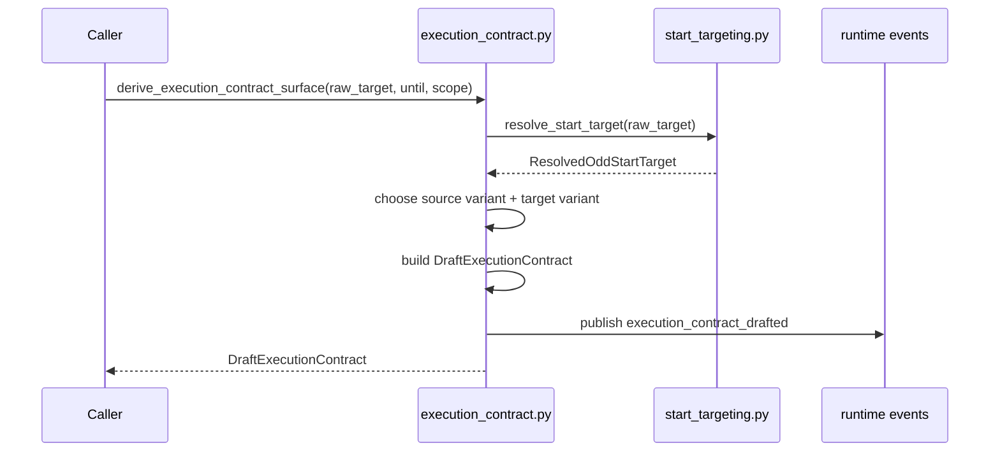
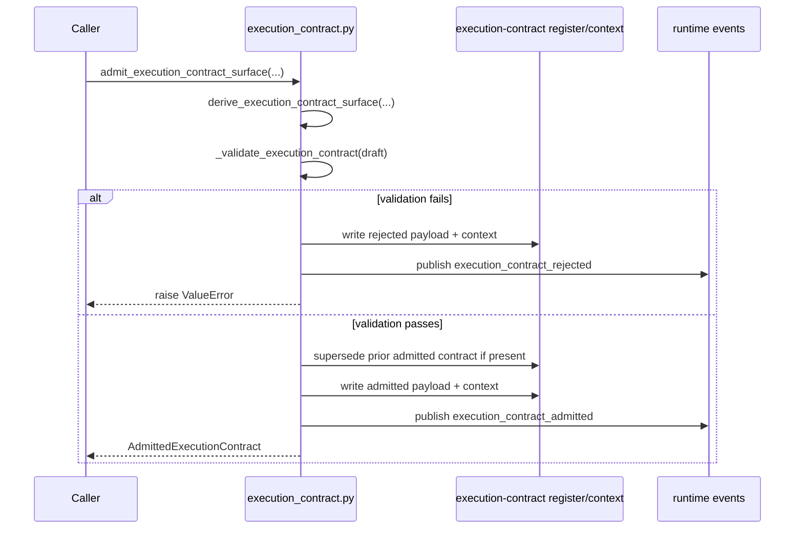
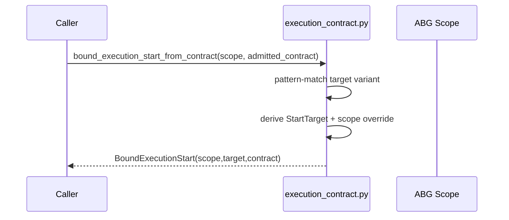
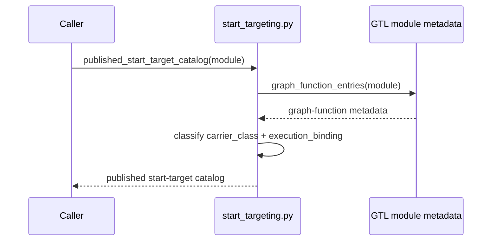
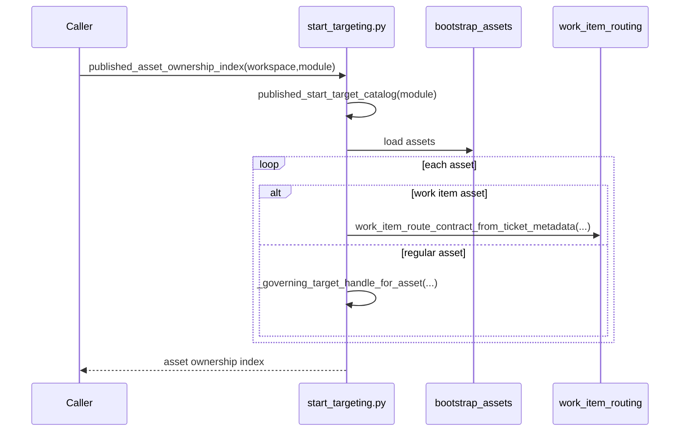
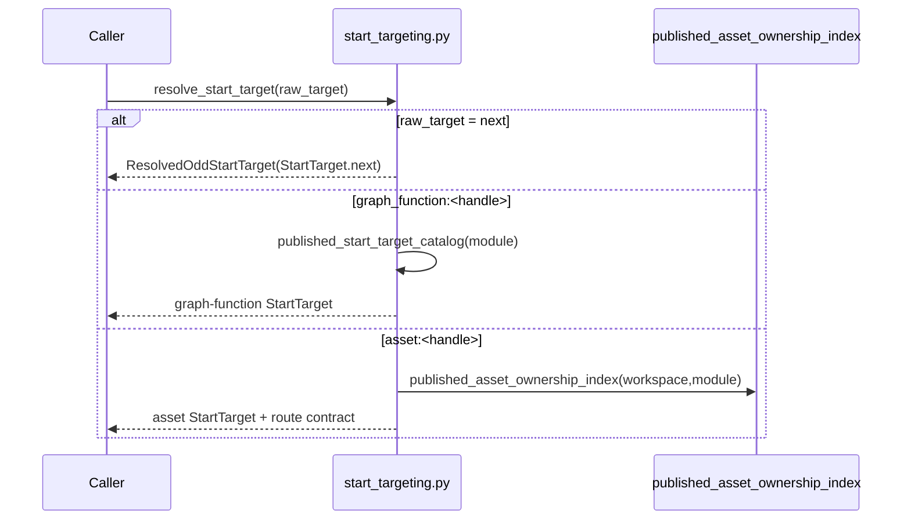
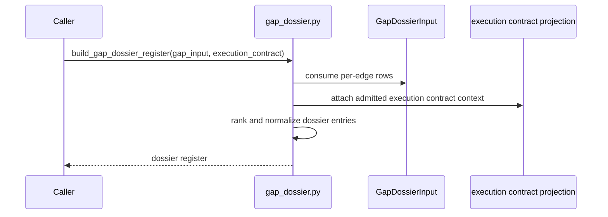
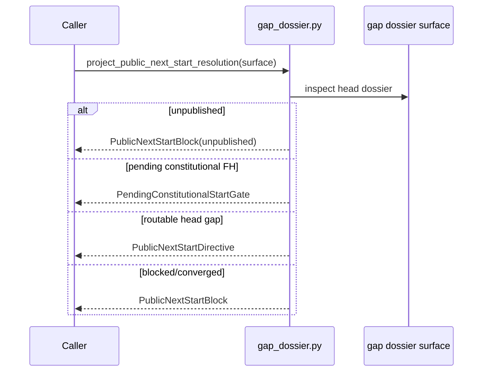
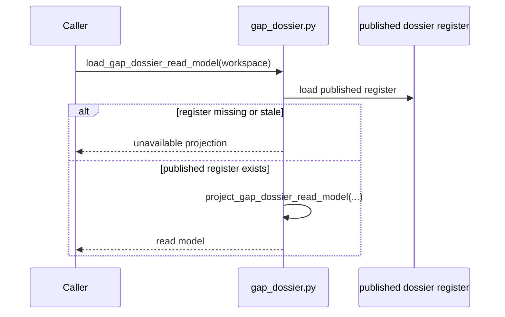

# REVIEW: S-037 Start Admission Family

**Author**: Codex
**Date**: 2026-04-23T00:42:27Z
**Addresses**: S-037 Deliverable 2 for `execution_contract.py`, `start_targeting.py`, and `gap_dossier.py`
**Status**: Open

## Summary

This review covers the start-admission family that turns published workspace
truth into an admitted start basis:

- [execution_contract.py](/Users/jim/src/apps/odd_sdlc/build_tenants/python/code/odd_sdlc/execution_contract.py:54)
- [start_targeting.py](/Users/jim/src/apps/odd_sdlc/build_tenants/python/code/odd_sdlc/start_targeting.py:50)
- [gap_dossier.py](/Users/jim/src/apps/odd_sdlc/build_tenants/python/code/odd_sdlc/gap_dossier.py:50)

The family is the best current example of odd_sdlc doing the right thing under
the design method: publish a carrier, resolve from that carrier, then admit a
typed contract. The remaining weakness is not proxy authority in the main path.
It is coupling pressure at the handoff between dossier projection and public
start control.

## Analysis

### File: `execution_contract.py`

Purpose: admit one typed execution contract for a public start request and bind
that contract to an ABG `Scope` plus `StartTarget`.

Role: carrier module plus semantic kernel plus persistence edge.

Top-level semantic inventory:

- `load_admitted_execution_contract_projection(...)` at [397](/Users/jim/src/apps/odd_sdlc/build_tenants/python/code/odd_sdlc/execution_contract.py:397)
- `derive_execution_contract_surface(...)` at [794](/Users/jim/src/apps/odd_sdlc/build_tenants/python/code/odd_sdlc/execution_contract.py:794)
- `admit_execution_contract_surface(...)` at [851](/Users/jim/src/apps/odd_sdlc/build_tenants/python/code/odd_sdlc/execution_contract.py:851)
- `bound_execution_start_from_contract(...)` at [988](/Users/jim/src/apps/odd_sdlc/build_tenants/python/code/odd_sdlc/execution_contract.py:988)
- `admit_bound_execution_start(...)` at [1057](/Users/jim/src/apps/odd_sdlc/build_tenants/python/code/odd_sdlc/execution_contract.py:1057)

Carrier inventory:

- `NextExecutionTarget` at [54](/Users/jim/src/apps/odd_sdlc/build_tenants/python/code/odd_sdlc/execution_contract.py:54)
- `GraphFunctionExecutionTarget` at [85](/Users/jim/src/apps/odd_sdlc/build_tenants/python/code/odd_sdlc/execution_contract.py:85)
- `AssetExecutionTarget` at [116](/Users/jim/src/apps/odd_sdlc/build_tenants/python/code/odd_sdlc/execution_contract.py:116)
- `OperatorExecutionSource` at [179](/Users/jim/src/apps/odd_sdlc/build_tenants/python/code/odd_sdlc/execution_contract.py:179)
- `TicketWorkItemExecutionSource` at [205](/Users/jim/src/apps/odd_sdlc/build_tenants/python/code/odd_sdlc/execution_contract.py:205)
- `DraftExecutionContract` at [253](/Users/jim/src/apps/odd_sdlc/build_tenants/python/code/odd_sdlc/execution_contract.py:253)
- `AdmittedExecutionContract` at [275](/Users/jim/src/apps/odd_sdlc/build_tenants/python/code/odd_sdlc/execution_contract.py:275)

Sequence: `derive_execution_contract_surface(...)`

Sequence: `admit_execution_contract_surface(...)`

Sequence: `bound_execution_start_from_contract(...)`

Fault-line categories:

- lawful and prime
- lawful but over-coupled

Design judgment:

This file is lawful to keep. It holds one irreducible boundary: odd_sdlc start
admission. The typed source/target carriers are strong. The only real pressure
is that the same file also owns persistence and markdown context rendering. That
is coupling, not duplicate truth.

Explicit review question:

If this file disappeared, odd_sdlc would lose admitted start-contract truth.
That stop is semantically lawful.

### File: `start_targeting.py`

Purpose: publish the start-addressable catalog and resolve a raw public target
into a typed odd_sdlc start target.

Role: binding/adapter module with a small semantic kernel.

Top-level semantic inventory:

- `graph_function_entries(...)` at [72](/Users/jim/src/apps/odd_sdlc/build_tenants/python/code/odd_sdlc/start_targeting.py:72)
- `published_start_target_catalog(...)` at [162](/Users/jim/src/apps/odd_sdlc/build_tenants/python/code/odd_sdlc/start_targeting.py:162)
- `published_asset_ownership_index(...)` at [223](/Users/jim/src/apps/odd_sdlc/build_tenants/python/code/odd_sdlc/start_targeting.py:223)
- `resolve_start_target(...)` at [288](/Users/jim/src/apps/odd_sdlc/build_tenants/python/code/odd_sdlc/start_targeting.py:288)

Sequence: `published_start_target_catalog(...)`

Sequence: `published_asset_ownership_index(...)`

Sequence: `resolve_start_target(...)`

Fault-line categories:

- lawful and prime

Design judgment:

This file is lawful to keep and close to prime. It publishes the public address
space and resolves only from that address space. The strongest design choice is
that plain raw `next` is intentionally weak here and only becomes start-lawful
when the dossier path later supplies an `edge_override`.

Explicit review question:

If this file disappeared, the published start-address space would disappear.
That stop is lawful.

### File: `gap_dossier.py`

Purpose: turn enriched gap truth into a published dossier register and then
project the head-gap decision used by public `start(next)`.

Role: carrier module plus projection module.

Top-level semantic inventory:

- `project_gap_dossier_input(...)` at [216](/Users/jim/src/apps/odd_sdlc/build_tenants/python/code/odd_sdlc/gap_dossier.py:216)
- `build_gap_dossier_register(...)` at [256](/Users/jim/src/apps/odd_sdlc/build_tenants/python/code/odd_sdlc/gap_dossier.py:256)
- `publish_gap_dossier_surfaces(...)` at [393](/Users/jim/src/apps/odd_sdlc/build_tenants/python/code/odd_sdlc/gap_dossier.py:393)
- `load_gap_dossier_read_model(...)` at [468](/Users/jim/src/apps/odd_sdlc/build_tenants/python/code/odd_sdlc/gap_dossier.py:468)
- `require_published_gap_dossier_read_model(...)` at [476](/Users/jim/src/apps/odd_sdlc/build_tenants/python/code/odd_sdlc/gap_dossier.py:476)
- `project_pending_constitutional_start_gate(...)` at [495](/Users/jim/src/apps/odd_sdlc/build_tenants/python/code/odd_sdlc/gap_dossier.py:495)
- `project_public_next_start_directive(...)` at [545](/Users/jim/src/apps/odd_sdlc/build_tenants/python/code/odd_sdlc/gap_dossier.py:545)
- `project_public_next_start_resolution(...)` at [653](/Users/jim/src/apps/odd_sdlc/build_tenants/python/code/odd_sdlc/gap_dossier.py:653)
- `project_gap_dossier_surface(...)` at [677](/Users/jim/src/apps/odd_sdlc/build_tenants/python/code/odd_sdlc/gap_dossier.py:677)
- `project_gap_dossier_read_model(...)` at [713](/Users/jim/src/apps/odd_sdlc/build_tenants/python/code/odd_sdlc/gap_dossier.py:713)

Sequence: `build_gap_dossier_register(...)`

Sequence: `project_public_next_start_resolution(...)`

Sequence: `load_gap_dossier_read_model(...)`

Fault-line categories:

- lawful but over-coupled
- unstable identity or refresh semantics

Design judgment:

This file is lawful to keep. The public-start decision lives here rather than
in `app.py`, which is correct. The live weakness is that the head-gap decision
is dossier-order sensitive. If ranking or grouping semantics drift, public
start behavior changes even when the underlying per-edge truth does not. That
is a real refresh-identity fault line, but it is still better than controller
re-derivation.

Explicit review question:

If this file disappeared, public `start(next)` would lose its lawful head-gap
decision carrier. That stop is lawful.

## Recommended Action

1. Keep `execution_contract.py` as the authoritative start-admission boundary.
2. Keep `start_targeting.py` as the only raw-target resolver.
3. Treat `gap_dossier.py` as the only lawful public-next decision source.
4. If this family is refactored later, split only along prime boundaries:
   typed carrier definitions vs persistence/projection helpers. Do not re-push
   public-next decision logic back into `app.py`.
