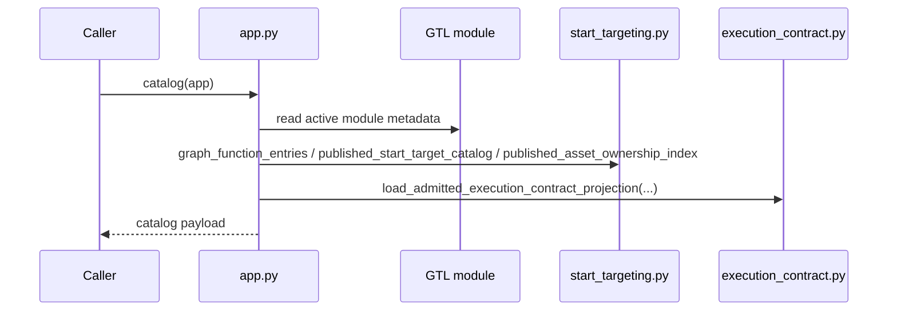
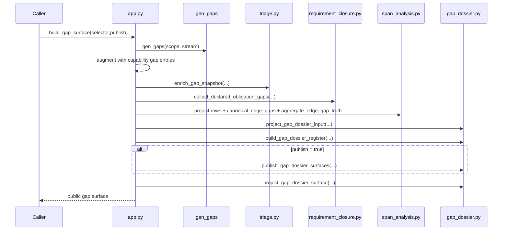
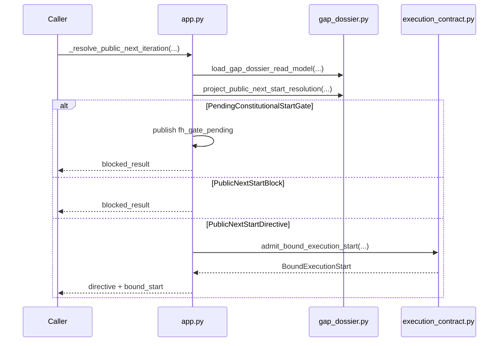
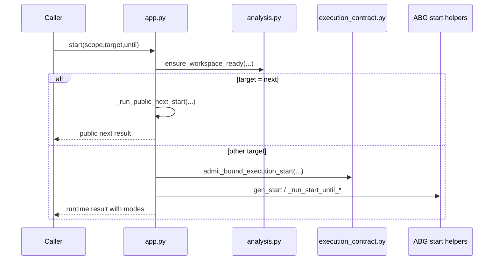
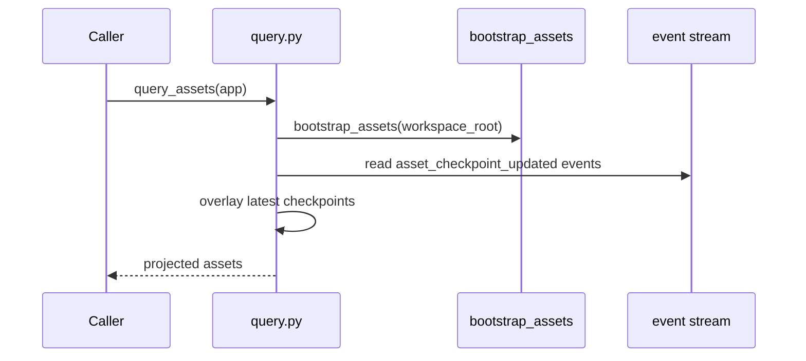
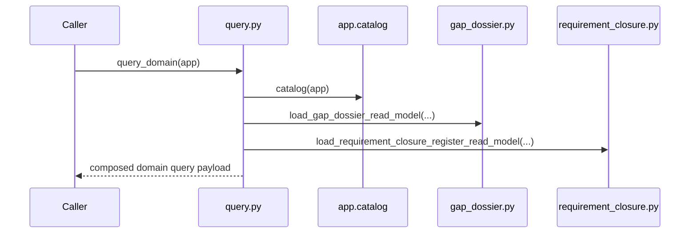

# REVIEW: S-037 Public Control And Query Family

**Author**: Codex
**Date**: 2026-04-23T00:42:28Z
**Addresses**: S-037 Deliverable 2 for `app.py` and `query.py`
**Status**: Open

## Summary

This review covers the public boundary modules:

- [app.py](/Users/jim/src/apps/odd_sdlc/build_tenants/python/code/odd_sdlc/app.py:201)
- [query.py](/Users/jim/src/apps/odd_sdlc/build_tenants/python/code/odd_sdlc/query.py:1)

`query.py` is clean. `app.py` is the core public control surface and the
highest-risk semantic concentration point in the repo. It is still lawful
because it consumes real carriers, but it is the main place where a future bug
can reintroduce controller-owned meaning.

## Analysis

### File: `app.py`

Purpose: bind the GTL module, ABG runtime, and odd_sdlc carriers into one
public surface for `catalog`, `gaps`, `iterate`, and `start`.

Role: binding/adapter module and public control surface.

Top-level semantic inventory:

- `catalog(...)` at [266](/Users/jim/src/apps/odd_sdlc/build_tenants/python/code/odd_sdlc/app.py:266)
- `gaps(...)` at [314](/Users/jim/src/apps/odd_sdlc/build_tenants/python/code/odd_sdlc/app.py:314)
- `gap_snapshot(...)` at [338](/Users/jim/src/apps/odd_sdlc/build_tenants/python/code/odd_sdlc/app.py:338)
- `_build_gap_surface(...)` at [350](/Users/jim/src/apps/odd_sdlc/build_tenants/python/code/odd_sdlc/app.py:350)
- `iterate(...)` at [425](/Users/jim/src/apps/odd_sdlc/build_tenants/python/code/odd_sdlc/app.py:425)
- `_resolve_public_next_iteration(...)` at [494](/Users/jim/src/apps/odd_sdlc/build_tenants/python/code/odd_sdlc/app.py:494)
- `_run_public_next_start(...)` at [544](/Users/jim/src/apps/odd_sdlc/build_tenants/python/code/odd_sdlc/app.py:544)
- `start(...)` at [711](/Users/jim/src/apps/odd_sdlc/build_tenants/python/code/odd_sdlc/app.py:711)

Sequence: `catalog(...)`



Sequence: `_build_gap_surface(...)`



Sequence: `_resolve_public_next_iteration(...)`



Sequence: `_run_public_next_start(...)`

```mermaid
sequenceDiagram
    participant Caller
    participant App as app.py
    participant ABG as gen_start / dispatch runtime
    participant Loop as homeostatic_loop.py
    Caller->>App: _run_public_next_start(target=next, until=converged)
    loop until stop condition
        App->>App: _resolve_public_next_iteration(...)
        alt blocked fh gate and human-proxy mode
            App->>Loop: apply_constitutional_proposal(...)
            App->>App: refresh + republish homeostatic surface
        else blocked or converged
            App-->>Caller: blocked/converged result
        else directive admitted
            App->>ABG: gen_start(intent, stream)
            ABG-->>App: runtime result
            App->>App: attach public-next metadata
            alt yielded continuation
                App-->>Caller: yield-shaped public result
            else stopped or converged
                App-->>Caller: public result
            end
        end
    end
```

Sequence: `start(...)`



Fault-line categories:

- lawful but over-coupled
- hidden semantic center
- interface bleed

Design judgment:

`app.py` is lawful to keep because it is the declared public surface. It is not
prime in the strict sense. `_build_gap_surface(...)` and `_run_public_next_start(...)`
are dense orchestration seams where binding, semantic consumption, and effect
control are all close together. That density is the recurring fault-line behind
`B-035` and `B-036`: the file can remain lawful only if it keeps consuming
already-published carriers instead of reinterpreting them.

Explicit review question:

If this file disappeared, the public odd_sdlc boundary would disappear. That
stop is lawful, but it also means this file must stay thin enough that loss of
the boundary does not imply loss of domain truth.

### File: `query.py`

Purpose: project odd_sdlc read surfaces for external callers.

Role: projection module.

Top-level semantic inventory:

- `query_assets(...)`
- `query_ambiguity_register(...)`
- `query_requirement_closure_register(...)`
- `query_domain(...)` at [88](/Users/jim/src/apps/odd_sdlc/build_tenants/python/code/odd_sdlc/query.py:88)

Omitted as pure selectors:

- `query_functions(...)`
- `query_jobs(...)`
- `query_bindings(...)`

Sequence: `query_assets(...)`



Sequence: `query_domain(...)`



Fault-line categories:

- lawful and prime

Design judgment:

`query.py` is clean. It reads published truth and composes projections. It is
exactly the sort of file that should disappear harmlessly if another query
boundary replaces it.

Explicit review question:

If this file disappeared, the packaged query shape would disappear, but the
authoritative carriers would remain. That weak stop is semantically lawful.

## Recommended Action

1. Keep `query.py` thin and read-only.
2. Treat `app.py` as the main no-semantic-center guardrail in the repo.
3. Any future fix in the `start(next)` lane should land by strengthening
   carrier consumption under `_resolve_public_next_iteration(...)`, not by
   adding new controller-local branches elsewhere in `app.py`.
