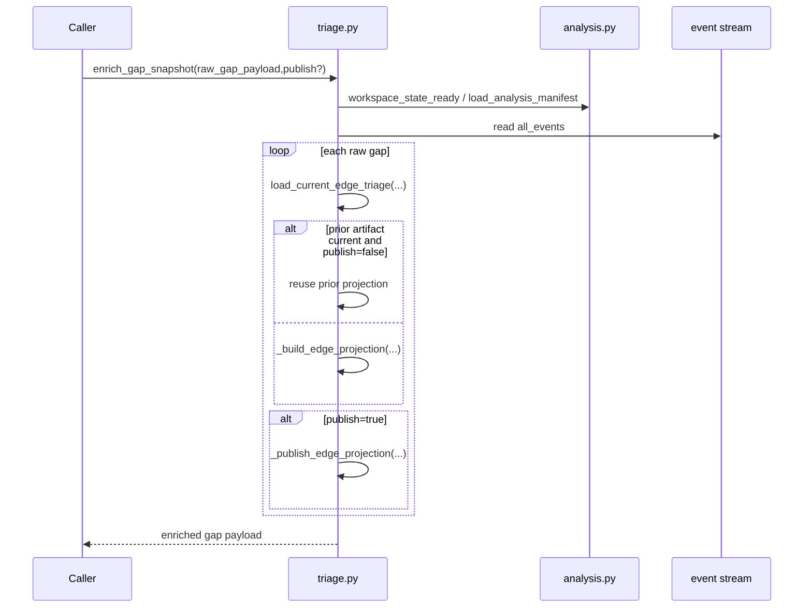
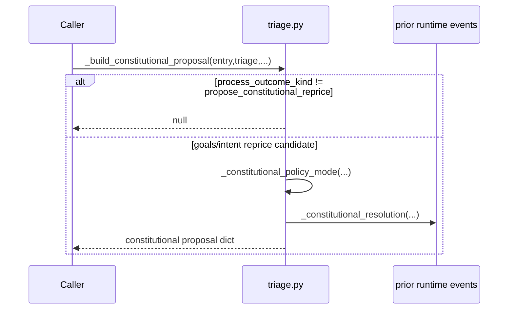
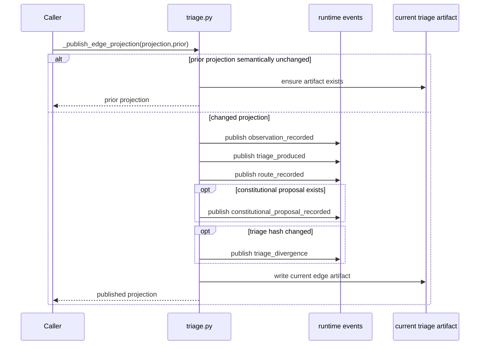
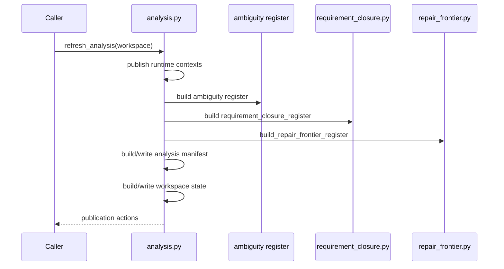
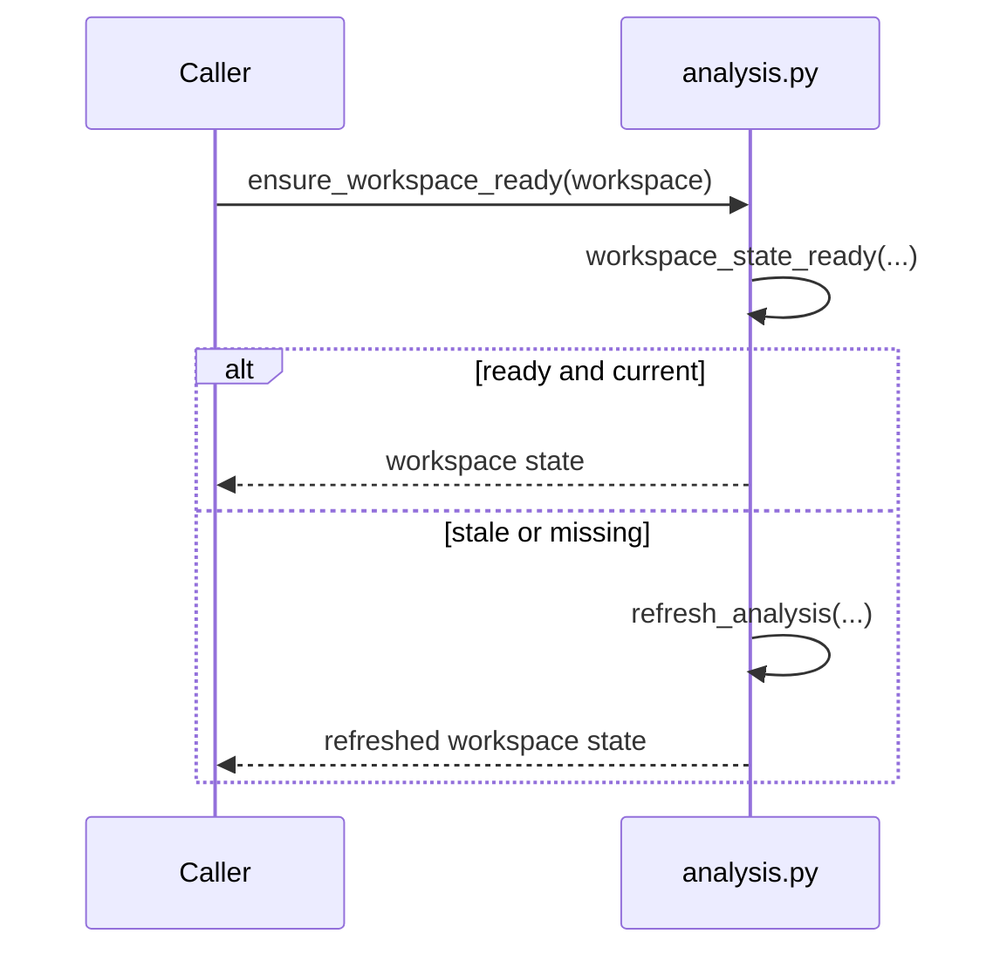
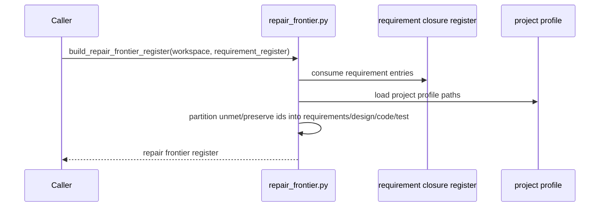

# REVIEW: S-037 Homeostatic And Publication Family

**Author**: Codex
**Date**: 2026-04-23T00:42:29Z
**Addresses**: S-037 Deliverable 2 for `triage.py`, `homeostatic_loop.py`, `analysis.py`, and `repair_frontier.py`
**Status**: Open

## Summary

This family owns the publication loop around gaps and repair pressure:

- [triage.py](/Users/jim/src/apps/odd_sdlc/build_tenants/python/code/odd_sdlc/triage.py:303)
- [homeostatic_loop.py](/Users/jim/src/apps/odd_sdlc/build_tenants/python/code/odd_sdlc/homeostatic_loop.py:42)
- [analysis.py](/Users/jim/src/apps/odd_sdlc/build_tenants/python/code/odd_sdlc/analysis.py:122)
- [repair_frontier.py](/Users/jim/src/apps/odd_sdlc/build_tenants/python/code/odd_sdlc/repair_frontier.py:65)

The core finding is simple: `triage.py` is the strongest remaining hidden
semantic center in odd_sdlc. The other three files are largely lawful effect or
projection shells over published truth.

## Analysis

### File: `triage.py`

Purpose: classify each raw gap into observation, triage, route binding, and
constitutional proposal, then optionally publish the current per-edge artifact
and runtime events.

Role: semantic kernel plus effect shell.

Top-level semantic inventory:

- `load_current_edge_triage(...)` at [97](/Users/jim/src/apps/odd_sdlc/build_tenants/python/code/odd_sdlc/triage.py:97)
- `enrich_gap_snapshot(...)` at [303](/Users/jim/src/apps/odd_sdlc/build_tenants/python/code/odd_sdlc/triage.py:303)
- `_build_constitutional_proposal(...)` at [957](/Users/jim/src/apps/odd_sdlc/build_tenants/python/code/odd_sdlc/triage.py:957)
- `_constitutional_resolution(...)` at [1019](/Users/jim/src/apps/odd_sdlc/build_tenants/python/code/odd_sdlc/triage.py:1019)
- `_publish_edge_projection(...)` at [1044](/Users/jim/src/apps/odd_sdlc/build_tenants/python/code/odd_sdlc/triage.py:1044)
- `_build_route_binding(...)` at [1199](/Users/jim/src/apps/odd_sdlc/build_tenants/python/code/odd_sdlc/triage.py:1199)

Sequence: `enrich_gap_snapshot(...)`



Sequence: `_build_constitutional_proposal(...)`



Sequence: `_publish_edge_projection(...)`



Fault-line categories:

- hidden semantic center
- lawful but over-coupled
- unstable identity or refresh semantics

Design judgment:

This file is not wrong. It is the densest semantic kernel in the repo. It
still works largely through open dict payloads and large condition ladders. The
Prime Law question is whether there is already a clear irreducible split inside
it. The answer today is "not yet". The current risk is not module size. It is
that route semantics, constitutional semantics, and publication semantics are
all adjacent enough that controller-like patches can land here.

### File: `homeostatic_loop.py`

Purpose: apply approved constitutional proposals, reopen derivation, and loop
the gap back through publication.

Role: effect shell.

Top-level semantic inventory:

- `apply_constitutional_proposal(...)` at [42](/Users/jim/src/apps/odd_sdlc/build_tenants/python/code/odd_sdlc/homeostatic_loop.py:42)
- `loopback_homeostatic_gap(...)` at [118](/Users/jim/src/apps/odd_sdlc/build_tenants/python/code/odd_sdlc/homeostatic_loop.py:118)
- `run_homeostatic_self_check(...)` at [212](/Users/jim/src/apps/odd_sdlc/build_tenants/python/code/odd_sdlc/homeostatic_loop.py:212)

Sequence: `apply_constitutional_proposal(...)`

```mermaid
sequenceDiagram
    participant Caller
    participant Loop as homeostatic_loop.py
    participant Triage as triage.py
    participant Disk as target surface file
    participant Events as workspace runtime events
    participant Analysis as analysis.py
    Caller->>Loop: apply_constitutional_proposal(edge,proposal_id)
    Loop->>Triage: load_current_edge_triage(edge)
    Loop->>Disk: append applied proposal block to target surface
    Loop->>Events: publish constitutional_proposal_approved_with_edits
    Loop->>Events: publish proposal_applied
    Loop->>Analysis: refresh_analysis(...)
    Loop-->>Caller: applied status
```

Sequence: `loopback_homeostatic_gap(...)`

```mermaid
sequenceDiagram
    participant Caller
    participant Loop as homeostatic_loop.py
    participant Events as workspace runtime events
    Caller->>Loop: loopback_homeostatic_gap(edge,post_gap_payload)
    Loop->>Events: publish derivation_reopened
    alt edge no longer open
        Loop->>Events: publish gap_retired
        Loop-->>Caller: retired status
    else edge still open
        Loop->>Events: publish gap_event
        Loop-->>Caller: still_open status
    end
```

Fault-line categories:

- effect leakage or hidden mutation

Design judgment:

This mutation is lawful because it is explicit, narrow, and downstream of a
published proposal carrier. The file should stay effectful. The requirement is
simply that it never reclassify proposal meaning for itself.

### File: `analysis.py`

Purpose: publish analysis manifest, workspace state, and derived currentness so
other odd_sdlc surfaces can fail closed when analysis is stale.

Role: effect shell plus publication kernel.

Top-level semantic inventory:

- `build_analysis_manifest(...)` at [122](/Users/jim/src/apps/odd_sdlc/build_tenants/python/code/odd_sdlc/analysis.py:122)
- `write_analysis_manifest(...)` at [173](/Users/jim/src/apps/odd_sdlc/build_tenants/python/code/odd_sdlc/analysis.py:173)
- `write_workspace_state(...)` at [193](/Users/jim/src/apps/odd_sdlc/build_tenants/python/code/odd_sdlc/analysis.py:193)
- `refresh_analysis(...)` at [232](/Users/jim/src/apps/odd_sdlc/build_tenants/python/code/odd_sdlc/analysis.py:232)
- `ensure_workspace_ready(...)` at [328](/Users/jim/src/apps/odd_sdlc/build_tenants/python/code/odd_sdlc/analysis.py:328)

Sequence: `refresh_analysis(...)`



Sequence: `ensure_workspace_ready(...)`



Fault-line categories:

- lawful but over-coupled
- unstable identity or refresh semantics

Design judgment:

This file is lawful. It is the explicit staleness gate. The only design risk is
that too many downstream carriers depend on the same fingerprint cycle. That is
acceptable because analysis currentness is supposed to be a single gate.

### File: `repair_frontier.py`

Purpose: project declared unmet obligation pressure into one repair frontier and
prompt context.

Role: projection module.

Top-level semantic inventory:

- `build_repair_frontier_register(...)` at [65](/Users/jim/src/apps/odd_sdlc/build_tenants/python/code/odd_sdlc/repair_frontier.py:65)
- `build_repair_frontier_prompt_context(...)` at [239](/Users/jim/src/apps/odd_sdlc/build_tenants/python/code/odd_sdlc/repair_frontier.py:239)

Sequence: `build_repair_frontier_register(...)`



Fault-line categories:

- lawful and prime

Design judgment:

This file is a good example of a lawful projection boundary. If removed, only a
derived repair register disappears; the authority remains in the requirement
closure register.

## Recommended Action

1. Do not split `triage.py` for aesthetic reasons alone. Split only if one new
   typed carrier family emerges cleanly from the current dict-heavy projection.
2. Keep `homeostatic_loop.py` explicitly effectful.
3. Keep `analysis.py` as the single staleness gate.
4. Keep `repair_frontier.py` derivative only; it must never start deciding
   requirement closure for itself.
