# REVIEW: S-037 Traceability, Closure, And Gap Kernels

**Author**: Codex
**Date**: 2026-04-23T00:42:30Z
**Addresses**: S-037 Deliverable 2 for `traceability_index.py`, `requirement_closure.py`, and `span_analysis.py`
**Status**: Open

## Summary

This family carries the cleanest semantic kernels in odd_sdlc:

- [traceability_index.py](/Users/jim/src/apps/odd_sdlc/build_tenants/python/code/odd_sdlc/traceability_index.py:53)
- [requirement_closure.py](/Users/jim/src/apps/odd_sdlc/build_tenants/python/code/odd_sdlc/requirement_closure.py:656)
- [span_analysis.py](/Users/jim/src/apps/odd_sdlc/build_tenants/python/code/odd_sdlc/span_analysis.py:14)

The strongest module in the set is `span_analysis.py`. The riskiest is
`requirement_closure.py`, not because it duplicates truth, but because it is a
large hard-coded rule engine.

## Analysis

### File: `traceability_index.py`

Purpose: build the requirement-to-surface and requirement-to-code/test index
that all closure work depends on.

Role: carrier module plus semantic kernel.

Top-level semantic inventory:

- `build_requirement_traceability_index(...)` at [197](/Users/jim/src/apps/odd_sdlc/build_tenants/python/code/odd_sdlc/traceability_index.py:197)
- `traceability_source_scan(...)` at [225](/Users/jim/src/apps/odd_sdlc/build_tenants/python/code/odd_sdlc/traceability_index.py:225)
- `requirement_family_traceability_publication(...)` at [279](/Users/jim/src/apps/odd_sdlc/build_tenants/python/code/odd_sdlc/traceability_index.py:279)

Sequence: `traceability_source_scan(...)`

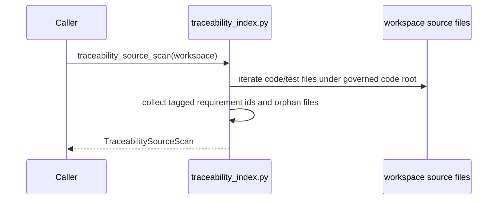

Sequence: `requirement_family_traceability_publication(...)`

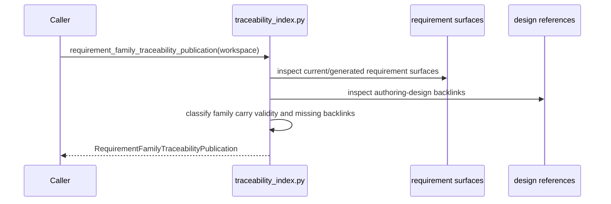

Sequence: `build_requirement_traceability_index(...)`

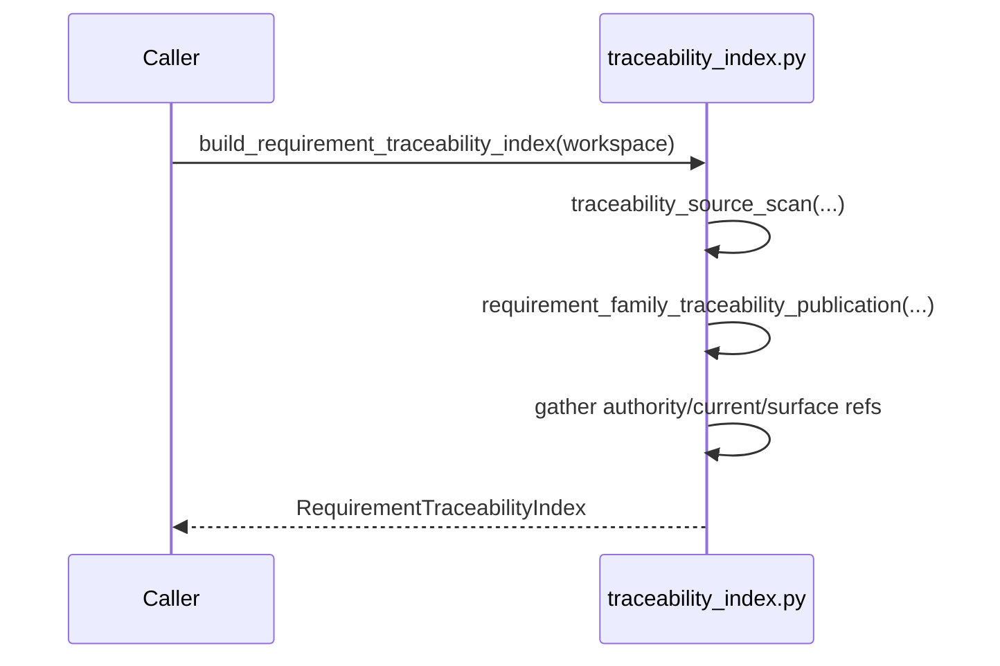

Fault-line categories:

- lawful and prime

Design judgment:

This file is strong. It exposes typed carriers and clear derived sets. It is a
good reference shape for the rest of odd_sdlc.

### File: `requirement_closure.py`

Purpose: turn the traceability index into requirement closure truth and declared
obligation gap truth.

Role: semantic kernel plus projection module.

Top-level semantic inventory:

- `build_requirement_closure_register(...)` at [656](/Users/jim/src/apps/odd_sdlc/build_tenants/python/code/odd_sdlc/requirement_closure.py:656)
- `current_requirement_executability_gap(...)` at [661](/Users/jim/src/apps/odd_sdlc/build_tenants/python/code/odd_sdlc/requirement_closure.py:661)
- `declared_requirement_edge_gap(...)` at [1037](/Users/jim/src/apps/odd_sdlc/build_tenants/python/code/odd_sdlc/requirement_closure.py:1037)
- `collect_declared_obligation_gaps(...)` at [1157](/Users/jim/src/apps/odd_sdlc/build_tenants/python/code/odd_sdlc/requirement_closure.py:1157)
- `build_requirement_closure_prompt_context(...)` at [1184](/Users/jim/src/apps/odd_sdlc/build_tenants/python/code/odd_sdlc/requirement_closure.py:1184)
- `load_requirement_closure_register_read_model(...)` at [1264](/Users/jim/src/apps/odd_sdlc/build_tenants/python/code/odd_sdlc/requirement_closure.py:1264)
- `require_published_requirement_closure_register(...)` at [1271](/Users/jim/src/apps/odd_sdlc/build_tenants/python/code/odd_sdlc/requirement_closure.py:1271)

Sequence: `build_requirement_closure_register(...)`

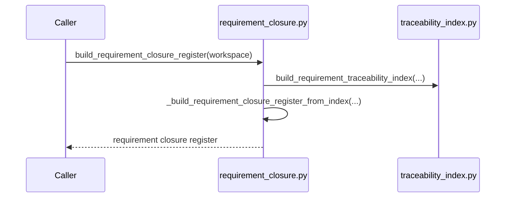

Sequence: `current_requirement_executability_gap(...)`

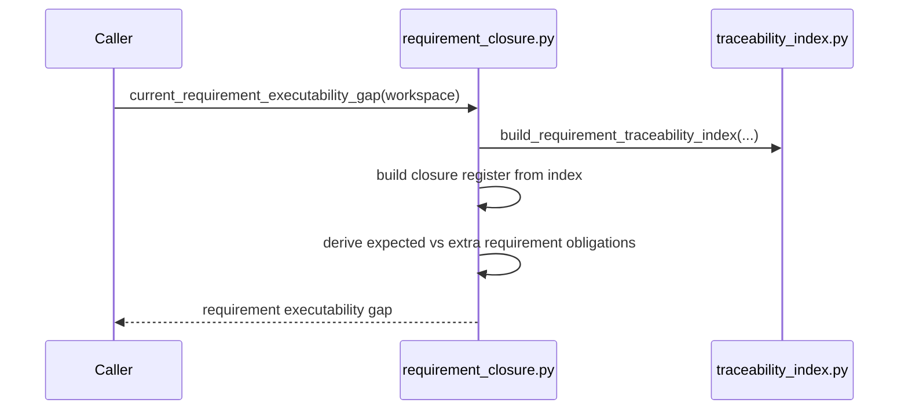

Sequence: `declared_requirement_edge_gap(...)`

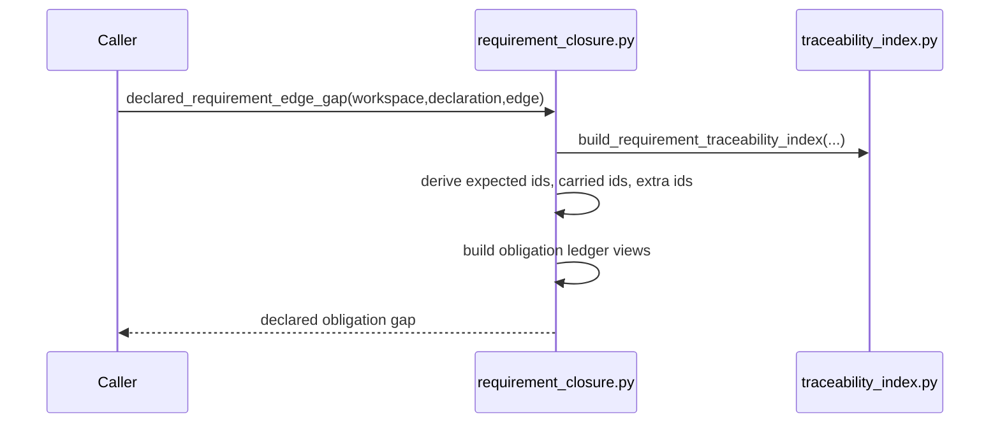

Sequence: `collect_declared_obligation_gaps(...)`

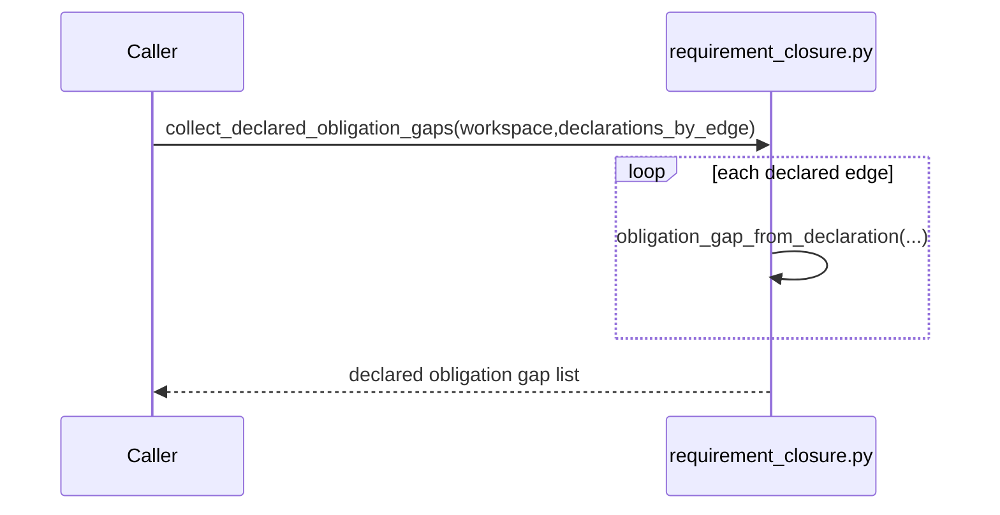

Sequence: `load_requirement_closure_register_read_model(...)`

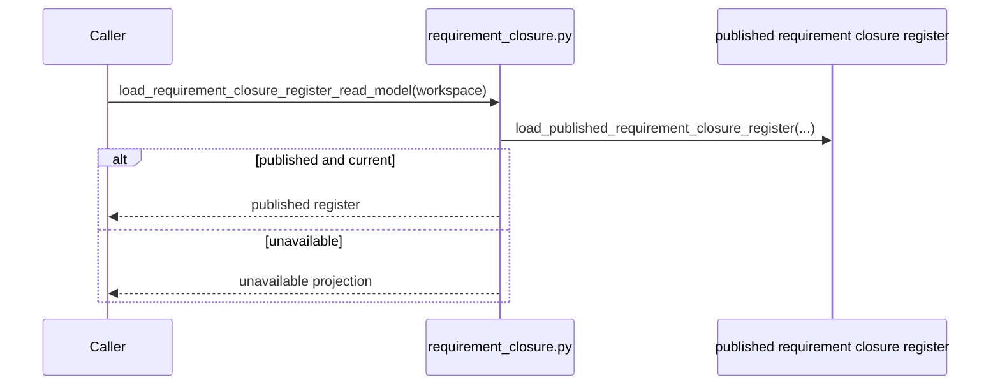

Fault-line categories:

- lawful but over-coupled
- hidden semantic center

Design judgment:

This file is lawful to keep because requirement closure is one real semantic
boundary. The design weakness is hard-coded branching by fulfillment rule,
derivation rule, and evidence policy. That makes it harder to extend safely.
This is a prime candidate for future ADT-style tightening, not because the file
is too large, but because the kernel is rule-dense.

### File: `span_analysis.py`

Purpose: normalize graph gaps plus declared obligation gaps into one canonical
edge-gap carrier and one aggregate truth summary.

Role: carrier module plus semantic kernel.

Top-level semantic inventory:

- `parse_gap_scope_selector(...)` at [14](/Users/jim/src/apps/odd_sdlc/build_tenants/python/code/odd_sdlc/span_analysis.py:14)
- `capability_gap_entries(...)` at [39](/Users/jim/src/apps/odd_sdlc/build_tenants/python/code/odd_sdlc/span_analysis.py:39)
- `declared_obligation_specs(...)` at [98](/Users/jim/src/apps/odd_sdlc/build_tenants/python/code/odd_sdlc/span_analysis.py:98)
- `canonical_edge_gaps(...)` at [546](/Users/jim/src/apps/odd_sdlc/build_tenants/python/code/odd_sdlc/span_analysis.py:546)
- `aggregate_edge_gap_truth(...)` at [571](/Users/jim/src/apps/odd_sdlc/build_tenants/python/code/odd_sdlc/span_analysis.py:571)
- `span_gap_analysis(...)` at [651](/Users/jim/src/apps/odd_sdlc/build_tenants/python/code/odd_sdlc/span_analysis.py:651)

Sequence: `capability_gap_entries(...)`

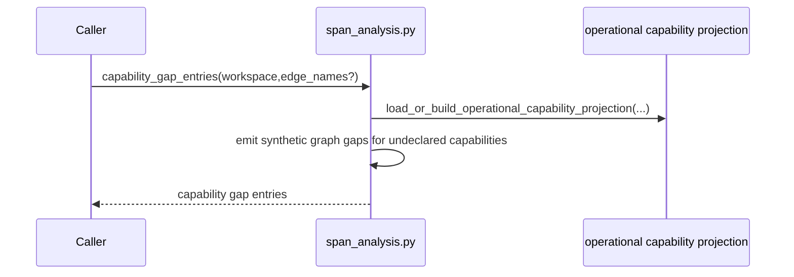

Sequence: `declared_obligation_specs(...)`

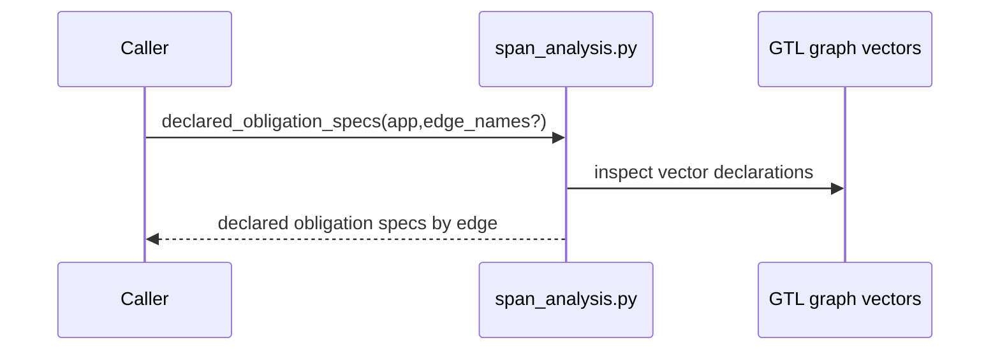

Sequence: `canonical_edge_gaps(...)`

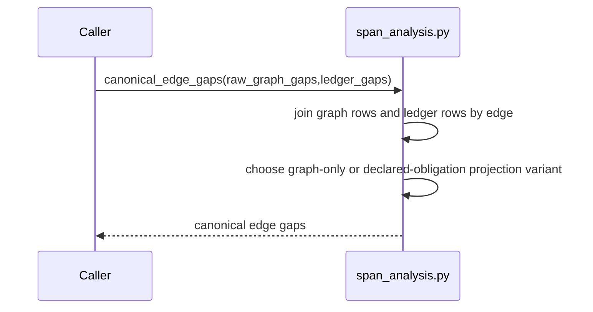

Sequence: `aggregate_edge_gap_truth(...)`

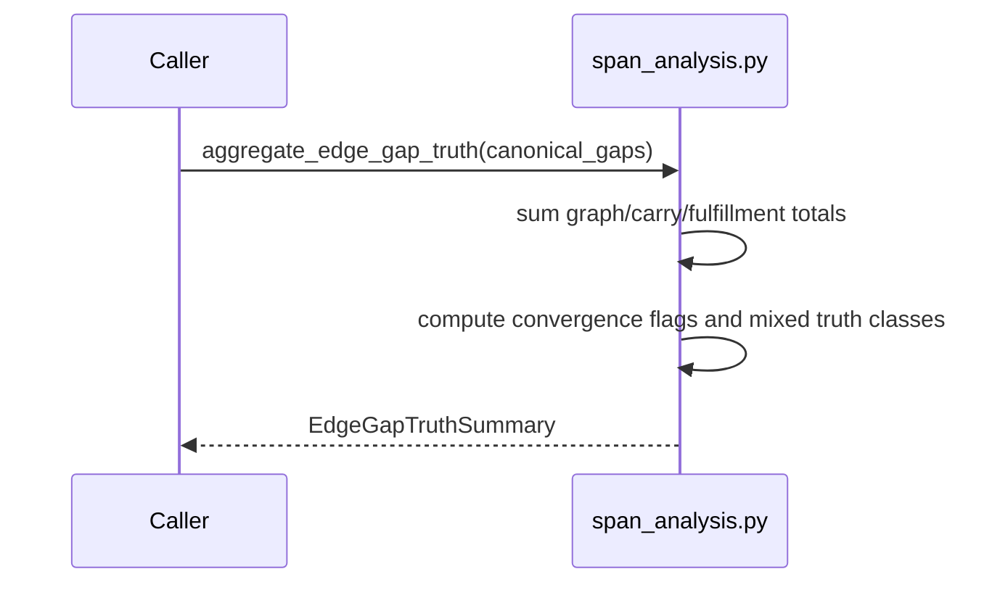

Sequence: `span_gap_analysis(...)`

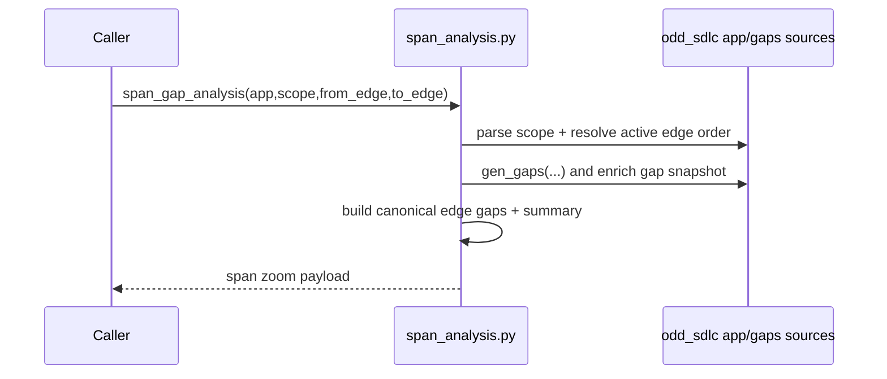

Fault-line categories:

- lawful and prime

Design judgment:

`span_analysis.py` is the strongest typed kernel in the review set. If removed,
canonical edge-gap truth disappears. That stop is lawful. This is the shape the
more dict-heavy kernels should move toward when they next need real refactoring.

## Recommended Action

1. Preserve `traceability_index.py` and `span_analysis.py` as reference shapes.
2. Treat `requirement_closure.py` as a valid but rule-dense kernel. Tighten it
   only when a real typed rule family can be pulled out without proxy layers.
