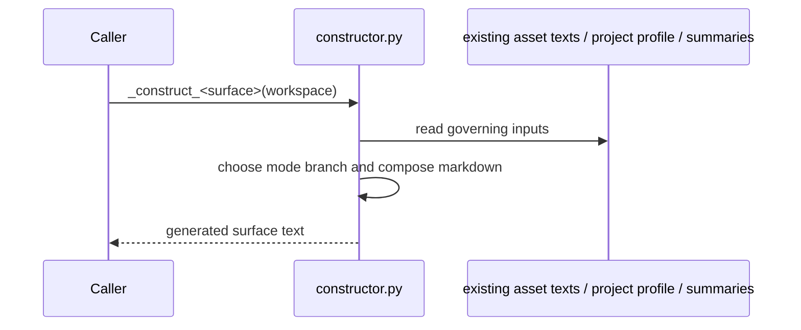
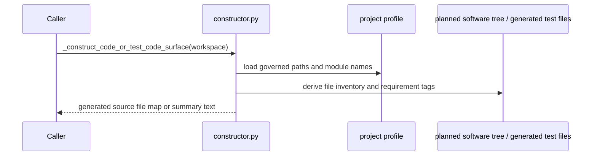
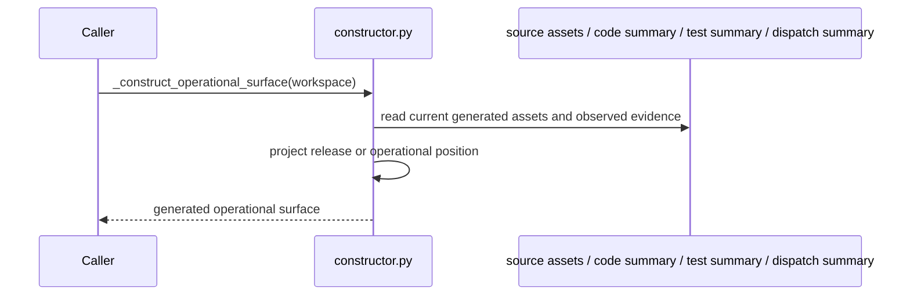
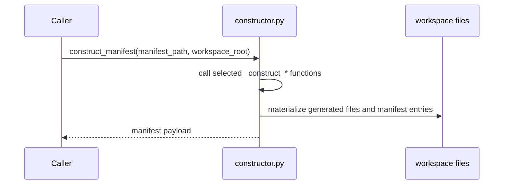

# REVIEW: S-037 Constructor And Materialization Boundary

**Author**: Codex
**Date**: 2026-04-23T00:42:31Z
**Addresses**: S-037 Deliverable 2 for `constructor.py`
**Status**: Open

## Summary

This review covers [constructor.py](/Users/jim/src/apps/odd_sdlc/build_tenants/python/code/odd_sdlc/constructor.py:584), the file that materializes generated workspace surfaces.

It is a god module. That is not the primary defect. Under the design method and
your stated preference, the real question is whether it is one lawful
materialization boundary or a pile of duplicate helper families pretending to be
one. On the current tree, it is mostly the former, with one real fault line:
it still carries historical dual-shape logic between governed software-project
mode and the older proving-subset branch.

## Analysis

### File: `constructor.py`

Purpose: generate the odd_sdlc materialized surfaces for intent, product,
requirements, design, implementation, release, operational execution, runtime
observation, retrofit, and test evidence.

Role: constructor/materialization module.

Top-level semantic inventory:

- surface constructors:
  - `_construct_intent(...)` at [752](/Users/jim/src/apps/odd_sdlc/build_tenants/python/code/odd_sdlc/constructor.py:752)
  - `_construct_product(...)` at [797](/Users/jim/src/apps/odd_sdlc/build_tenants/python/code/odd_sdlc/constructor.py:797)
  - `_construct_goals(...)` at [845](/Users/jim/src/apps/odd_sdlc/build_tenants/python/code/odd_sdlc/constructor.py:845)
  - `_construct_requirements(...)` at [889](/Users/jim/src/apps/odd_sdlc/build_tenants/python/code/odd_sdlc/constructor.py:889)
  - `_construct_feature_decomp(...)` at [945](/Users/jim/src/apps/odd_sdlc/build_tenants/python/code/odd_sdlc/constructor.py:945)
  - `_construct_uat_testcases(...)` at [994](/Users/jim/src/apps/odd_sdlc/build_tenants/python/code/odd_sdlc/constructor.py:994)
  - `_construct_design(...)` at [1045](/Users/jim/src/apps/odd_sdlc/build_tenants/python/code/odd_sdlc/constructor.py:1045)
  - `_construct_review_assessment(...)` at [1097](/Users/jim/src/apps/odd_sdlc/build_tenants/python/code/odd_sdlc/constructor.py:1097)
  - `_construct_consensus_decision(...)` at [1120](/Users/jim/src/apps/odd_sdlc/build_tenants/python/code/odd_sdlc/constructor.py:1120)
  - `_construct_reviewed_design(...)` at [1140](/Users/jim/src/apps/odd_sdlc/build_tenants/python/code/odd_sdlc/constructor.py:1140)
  - `_construct_testcase_authority(...)` at [1163](/Users/jim/src/apps/odd_sdlc/build_tenants/python/code/odd_sdlc/constructor.py:1163)
  - `_construct_scenarios(...)` at [1186](/Users/jim/src/apps/odd_sdlc/build_tenants/python/code/odd_sdlc/constructor.py:1186)
  - `_construct_implementation_design(...)` at [1236](/Users/jim/src/apps/odd_sdlc/build_tenants/python/code/odd_sdlc/constructor.py:1236)
  - `_construct_implementation_stack_profile(...)` at [1268](/Users/jim/src/apps/odd_sdlc/build_tenants/python/code/odd_sdlc/constructor.py:1268)
  - `_construct_implementation_module_surface(...)` at [1291](/Users/jim/src/apps/odd_sdlc/build_tenants/python/code/odd_sdlc/constructor.py:1291)
- code and release materializers:
  - `_construct_code_surface(...)` at [1329](/Users/jim/src/apps/odd_sdlc/build_tenants/python/code/odd_sdlc/constructor.py:1329)
  - `_construct_release(...)` at [1467](/Users/jim/src/apps/odd_sdlc/build_tenants/python/code/odd_sdlc/constructor.py:1467)
- operational surfaces:
  - `_construct_build_execution_surface(...)` at [1535](/Users/jim/src/apps/odd_sdlc/build_tenants/python/code/odd_sdlc/constructor.py:1535)
  - `_construct_build_execution_result_surface(...)` at [1572](/Users/jim/src/apps/odd_sdlc/build_tenants/python/code/odd_sdlc/constructor.py:1572)
  - `_construct_test_execution_surface(...)` at [1612](/Users/jim/src/apps/odd_sdlc/build_tenants/python/code/odd_sdlc/constructor.py:1612)
  - `_construct_test_execution_result_surface(...)` at [1643](/Users/jim/src/apps/odd_sdlc/build_tenants/python/code/odd_sdlc/constructor.py:1643)
  - `_construct_deployment_surface(...)` at [1693](/Users/jim/src/apps/odd_sdlc/build_tenants/python/code/odd_sdlc/constructor.py:1693)
  - `_construct_deployment_result_surface(...)` at [1728](/Users/jim/src/apps/odd_sdlc/build_tenants/python/code/odd_sdlc/constructor.py:1728)
  - `_construct_deployed_environment_surface(...)` at [1768](/Users/jim/src/apps/odd_sdlc/build_tenants/python/code/odd_sdlc/constructor.py:1768)
  - `_construct_runtime_observation_surface(...)` at [1797](/Users/jim/src/apps/odd_sdlc/build_tenants/python/code/odd_sdlc/constructor.py:1797)
  - `_construct_retrofit_plan_surface(...)` at [1853](/Users/jim/src/apps/odd_sdlc/build_tenants/python/code/odd_sdlc/constructor.py:1853)
- test materializers:
  - `_construct_test_design(...)` at [1896](/Users/jim/src/apps/odd_sdlc/build_tenants/python/code/odd_sdlc/constructor.py:1896)
  - `_construct_test_stack_profile(...)` at [1947](/Users/jim/src/apps/odd_sdlc/build_tenants/python/code/odd_sdlc/constructor.py:1947)
  - `_construct_test_module_surface(...)` at [1991](/Users/jim/src/apps/odd_sdlc/build_tenants/python/code/odd_sdlc/constructor.py:1991)
  - `_construct_test_code_surface(...)` at [2037](/Users/jim/src/apps/odd_sdlc/build_tenants/python/code/odd_sdlc/constructor.py:2037)
  - `_construct_test_run_archive(...)` at [2064](/Users/jim/src/apps/odd_sdlc/build_tenants/python/code/odd_sdlc/constructor.py:2064)
- manifest entry:
  - `construct_manifest(...)` at [2198](/Users/jim/src/apps/odd_sdlc/build_tenants/python/code/odd_sdlc/constructor.py:2198)

Sequence archetype A: simple surface materializer

Applies to:

- `_construct_intent`
- `_construct_product`
- `_construct_goals`
- `_construct_requirements`
- `_construct_feature_decomp`
- `_construct_uat_testcases`
- `_construct_design`
- `_construct_review_assessment`
- `_construct_consensus_decision`
- `_construct_reviewed_design`
- `_construct_testcase_authority`
- `_construct_scenarios`
- `_construct_implementation_design`
- `_construct_implementation_stack_profile`
- `_construct_implementation_module_surface`
- `_construct_test_design`
- `_construct_test_stack_profile`
- `_construct_test_module_surface`
- `_construct_test_run_archive`

Sequence archetype B: code/test source materializer

Applies to:

- `_construct_code_surface(...)`
- `_construct_test_code_surface(...)`

Sequence archetype C: release and operational surface materializer

Applies to:

- `_construct_release(...)`
- `_construct_build_execution_surface(...)`
- `_construct_build_execution_result_surface(...)`
- `_construct_test_execution_surface(...)`
- `_construct_test_execution_result_surface(...)`
- `_construct_deployment_surface(...)`
- `_construct_deployment_result_surface(...)`
- `_construct_deployed_environment_surface(...)`
- `_construct_runtime_observation_surface(...)`
- `_construct_retrofit_plan_surface(...)`

Sequence: `construct_manifest(...)`

Fault-line categories:

- lawful but over-coupled
- unstable identity or refresh semantics

Design judgment:

This file is lawful to keep as one constructor/materialization boundary. The
fact that it is large is not by itself a defect. Most of the `_construct_*`
functions are small variants of the same materialization operation and do not
justify decomposition just to make the file shorter.

The real fault line is the continued duality between:

- governed software-project mode
- retained proving-subset fallback branches

That split keeps historical product identity alive inside the constructor. It
does not yet look like duplicate helper authority, but it is a real identity
split and should keep being reduced.

Explicit review question:

If this file disappeared, odd_sdlc would lose generated workspace
materialization. That stop is lawful. The loss would not destroy the semantic
kernels, only the generated artifact layer.

## Recommended Action

1. Keep the constructor monolith unless a real prime sub-boundary appears.
2. Prefer deleting the proving-subset residual branches over chopping the file
   into many shallow helpers.
3. Treat any future duplicate helper family inside the constructor as a prime
   compression ticket, not as a generic “split the god module” exercise.
