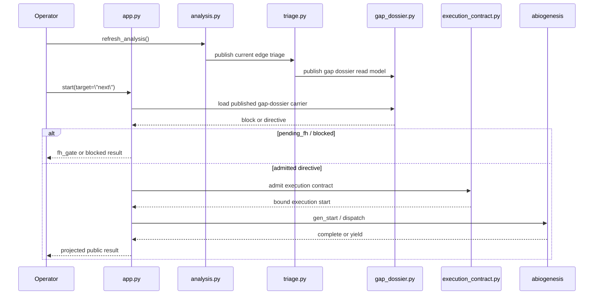

# S-037 Review 01: odd_sdlc Core Domain Model

## Purpose

This post defines the odd_sdlc core domain model before file-by-file review.

The intent is to stop debugging from starting at controller procedures and to
make boundary ownership explicit.

## Domain Statement

`odd_sdlc` is domain-owned governance and public control code over published
software-development carriers.

It is not:

- GTL publication identity
- generic ABG runtime identity
- a pure controller shell over substrate calls

Its job is to:

- publish deterministic workspace state
- classify open gap pressure into triage and route truth
- publish dossier/read-model surfaces
- bind public `start` / `gaps` to those published carriers
- apply domain-owned constitutional re-entry
- project repair and traceability truth for the builder

## Boundary Taxonomy

### GTL

GTL owns the constructive graph-function/module publication layer:

- graph functions
- jobs
- vectors
- environment contracts
- carrier declarations on graph functions

odd_sdlc may catalog or bind GTL publications, but it must not reinvent GTL
function identity procedurally.

### ABG

ABG owns generic runtime/process law:

- run lifecycle
- dispatch
- continuation
- yield/error projection
- transport
- event append
- proof ingestion

odd_sdlc may consume ABG runtime truth, but it must not outsource domain
meaning such as constitutional repricing or software-domain head-gap routing to
generic substrate helpers.

### odd_sdlc

odd_sdlc owns domain-governance meaning:

- workspace analysis identity
- requirement/traceability read models
- homeostatic observation and triage
- route binding and constitutional proposals
- public `next` resolution from published gap truth
- domain repair and qualification projections
- materialization of governed software-domain assets

## Core Carrier Chain

The intended authoritative chain is:

1. `analysis.py`
   publishes workspace-state and analysis identity
2. `traceability_index.py`
   builds the source traceability carrier
3. `requirement_closure.py`
   projects requirement closure truth from that index
4. `triage.py`
   classifies open edge pressure into observation, triage, route, and
   constitutional proposal truth
5. `gap_dossier.py`
   projects the published head-gap/public-next carrier
6. `app.py`
   binds public `gaps` and `start(next)` to that published carrier
7. `execution_contract.py`
   admits one execution basis from the published directive
8. ABG
   traverses, dispatches, yields, or completes

If any later layer reconstructs truth without the earlier published carrier,
that is a fault line.

## Module Taxonomy

The review uses `DESIGN_MODULE_METHOD.md` roles:

- Carrier modules:
  - `traceability_index.py`
  - `execution_contract.py`
- Semantic kernel modules:
  - `triage.py`
  - `requirement_closure.py`
  - `span_analysis.py`
- Projection modules:
  - `gap_dossier.py`
  - `query.py`
  - `repair_frontier.py`
- Effect shell modules:
  - `analysis.py`
  - `homeostatic_loop.py`
- Binding or adapter modules:
  - `start_targeting.py`
  - public-start portions of `app.py`
- Constructor or materialization modules:
  - `constructor.py`

`app.py` is deliberately mixed. It is a public control/binding boundary, not a
lawful place for domain truth to be invented.

That makes `app.py` the highest-risk hidden semantic-center surface in the repo.

## Fault-Line Categories Used In This Review

Every discovered issue is classified into one or more of these categories:

- incomplete migration
- incorrect boundary ownership
- hidden semantic center
- split carrier vs controller authority
- interface bleed
- proxy compatibility authority
- unstable identity across refresh or reprojection
- lawful but over-coupled
- helper sprawl inside a prime boundary
- effect leakage

## Expected Public `next` Law

The public `start --target next` path is only lawful if it consumes the same
published homeostatic carrier as `gaps`.

It must not:

- rebuild the head gap privately
- guess a raw edge from controller state
- admit `next` without a published directive
- use generic ABG FH helpers for odd_sdlc constitutional repricing

### Sequence

## Main Design Position

The existing design is directionally sound.

The repo already has the right major boundaries:

- source carriers
- projection modules
- admission boundary
- public control surface
- constructor/materializer

The recurring failures are not because the architecture is absent.

They come from migrations that stop one layer too early:

- the new carrier exists
- but one public wrapper still bypasses it
- or one effect module still owns domain meaning
- or one projection quietly becomes the semantic center

That makes the main stabilization task:

`finish the carrier-first migrations and sever the old controller-owned seams`

## Review Order

The remaining posts follow this order:

1. source carriers and closure projections
2. homeostatic triage, dossiers, and constitutional application
3. public start/admission/control surfaces
4. span/repair/materialization projections
5. synthesis and repair-order recommendation
