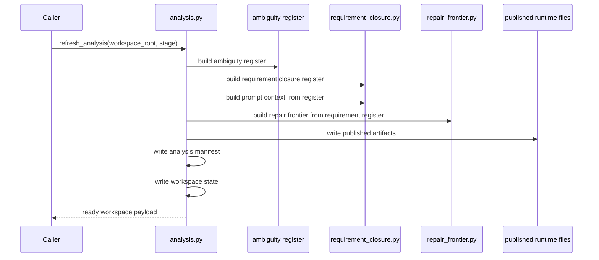
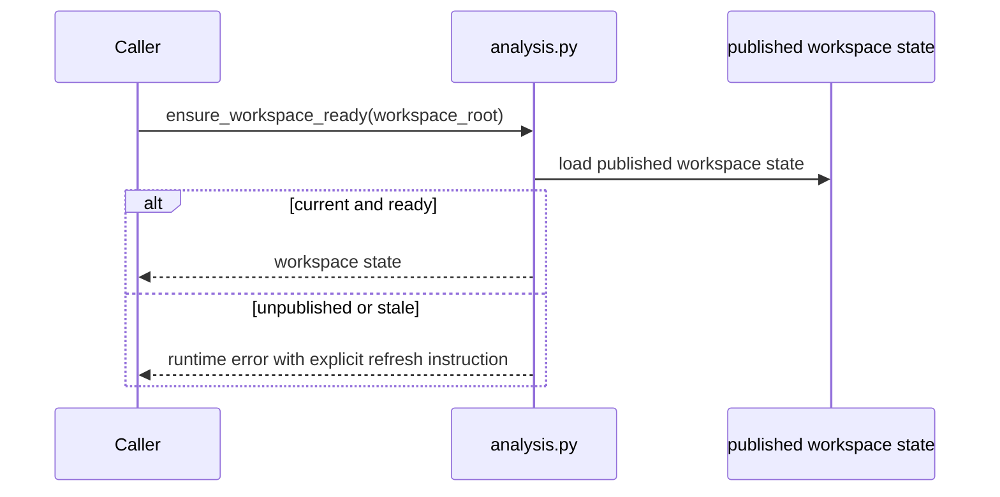
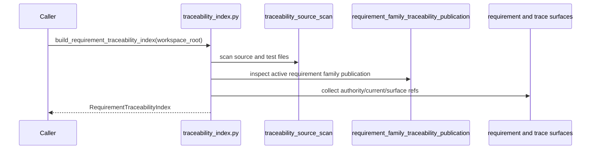
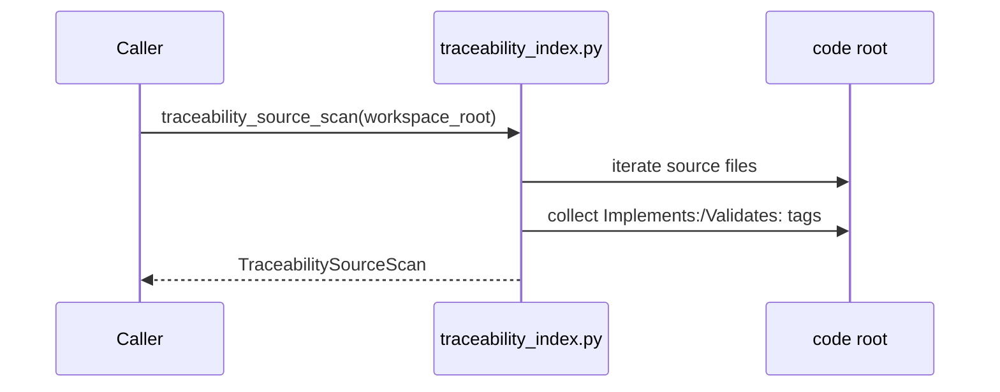
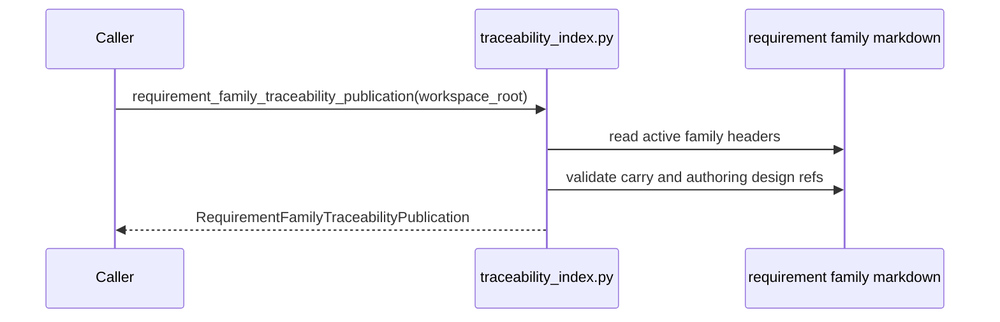
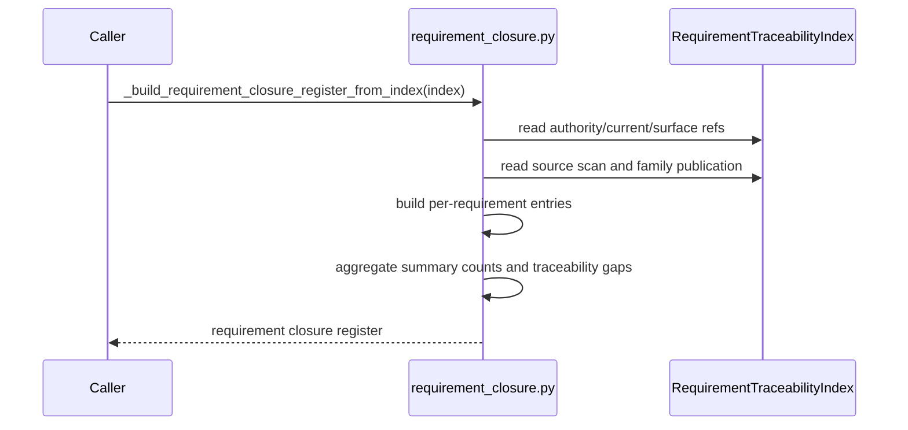
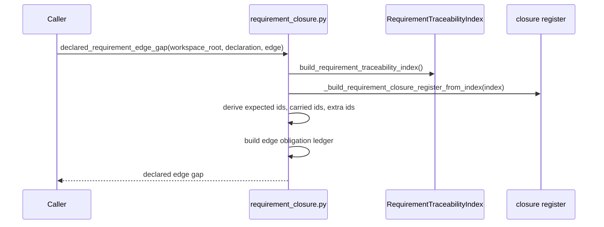
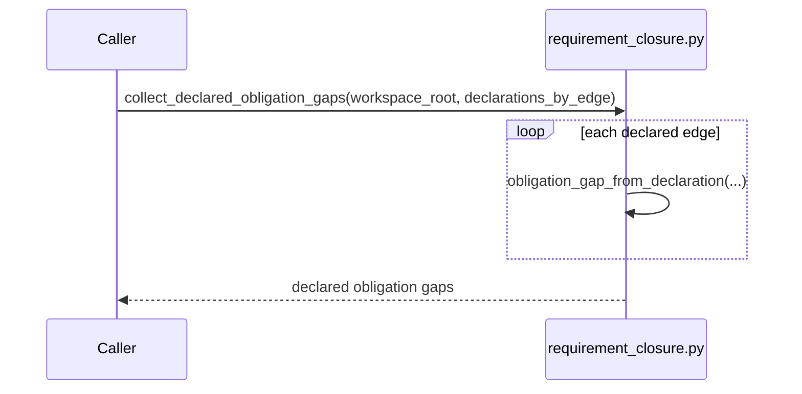
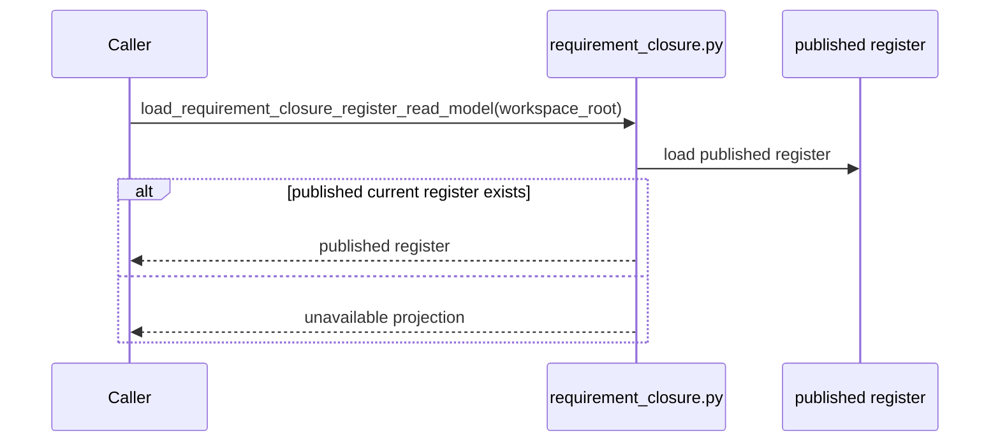

# S-037 Review 02: Source Carriers and Closure Family

Files reviewed:

- `analysis.py`
- `traceability_index.py`
- `requirement_closure.py`

## analysis.py

- purpose: publish the deterministic workspace-state and analysis identity that
  all later read models depend on
- role: effect shell module with a small projection aspect

### Prime entry points

- `build_analysis_manifest(...)`
- `write_analysis_manifest(...)`
- `write_workspace_state(...)`
- `refresh_analysis(...)`
- `ensure_workspace_ready(...)`

### Sequence: `refresh_analysis(...)`

### Sequence: `ensure_workspace_ready(...)`

### Fault lines

- lawful but over-coupled: `refresh_analysis(...)` is a large publication
  pipeline. It is acceptable because it is an effect shell, but it is a
  pressure point for hidden authority if later semantic decisions are moved into
  it.
- hidden semantic center risk: low at present. The file mostly writes published
  outputs and does not itself decide route or closure meaning.

### Design judgment

Keep the file. Its prime purpose is valid: one explicit publication boundary for
current analysis identity. Refactor only if semantic law drifts into it.

## traceability_index.py

- purpose: build the authoritative requirement-traceability source carrier from
  workspace surfaces
- role: carrier module plus semantic-kernel builder

### Prime entry points

- `build_requirement_traceability_index(...)`
- `traceability_source_scan(...)`
- `requirement_family_traceability_publication(...)`

### Sequence: `build_requirement_traceability_index(...)`

### Sequence: `traceability_source_scan(...)`

### Sequence: `requirement_family_traceability_publication(...)`

### Fault lines

- helper sprawl inside a prime boundary: many path and parsing helpers exist,
  but they still serve one coherent carrier-builder purpose.
- incomplete migration risk: if downstream modules read raw files again instead
  of consuming `RequirementTraceabilityIndex`, this file stops being
  authoritative.

### Design judgment

Keep the file as the source carrier boundary. The design is lawful. The main
discipline needed is downstream consumption, not another internal wrapper layer.

## requirement_closure.py

- purpose: project requirement closure and edge-obligation truth from the
  traceability index and publish fail-closed read models
- role: semantic kernel plus projection module

### Prime entry points

- `_build_requirement_closure_register_from_index(...)`
- `build_requirement_closure_register(...)`
- `declared_requirement_edge_gap(...)`
- `obligation_gap_from_declaration(...)`
- `collect_declared_obligation_gaps(...)`
- `load_requirement_closure_register_read_model(...)`

### Sequence: `_build_requirement_closure_register_from_index(...)`

### Sequence: `declared_requirement_edge_gap(...)`

### Sequence: `collect_declared_obligation_gaps(...)`

### Sequence: `load_requirement_closure_register_read_model(...)`

### Fault lines

- lawful but over-coupled: this file mixes register building, edge-ledger
  projection, prompt-context generation, and published read-model loading.
- hidden semantic center risk: medium. Requirement closure truth and edge
  obligation truth both accumulate here, so future controller bypasses tend to
  orbit this file.
- interface bleed risk: high whenever downstream code uses internal builder
  functions instead of the published read model.

### Design judgment

The core design is right: one traceability-derived closure family. The next
stabilization pressure is not “split this file because it is long” but “keep
public consumers on the published read model and keep edge-obligation truth as a
projection over the same source carrier.”
