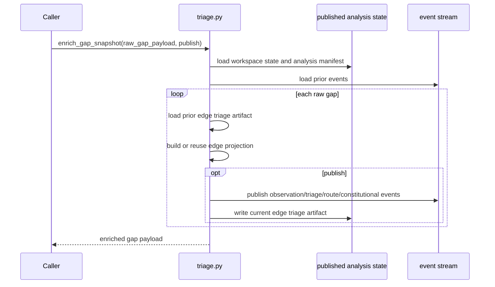
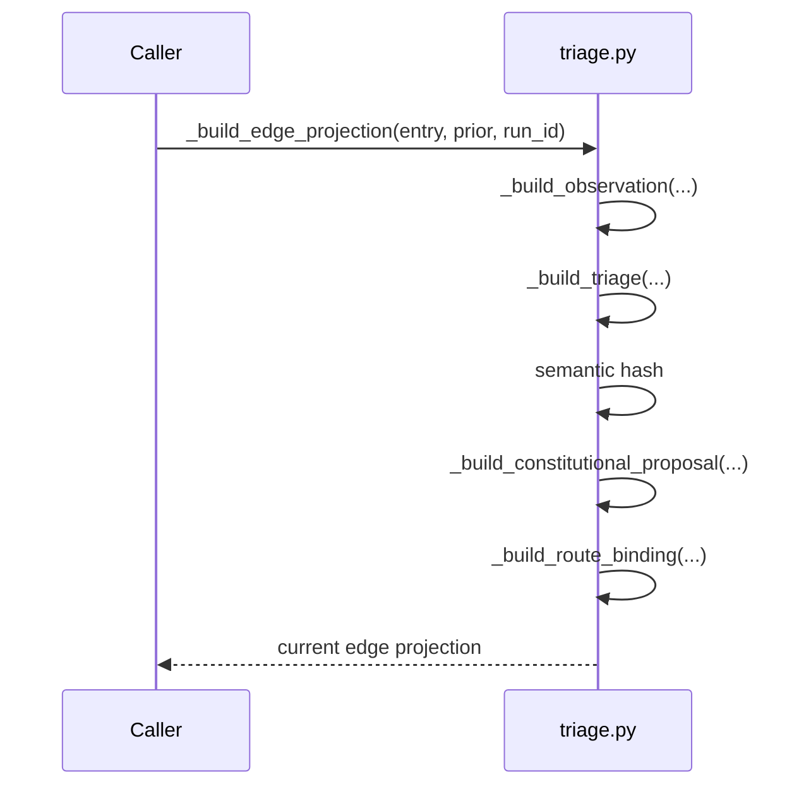
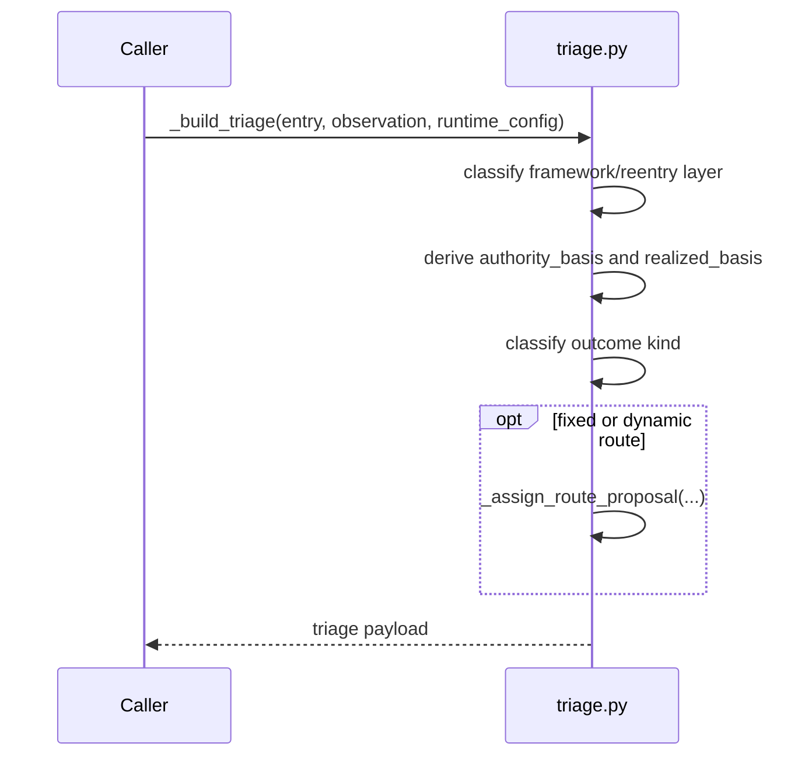
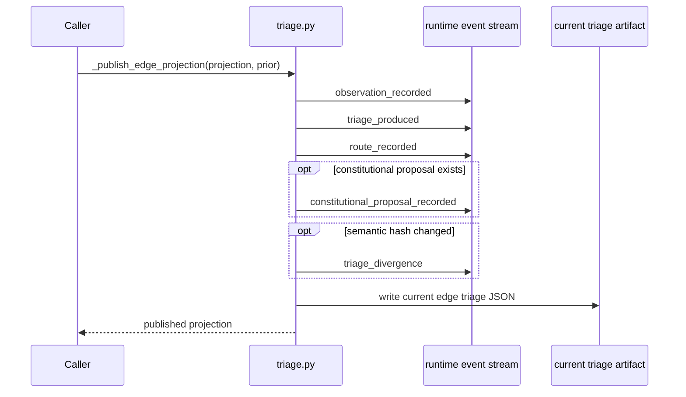
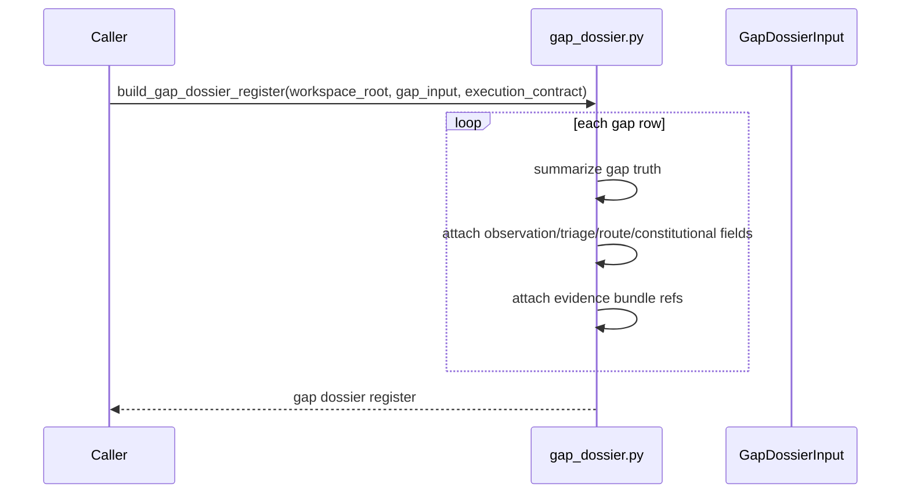
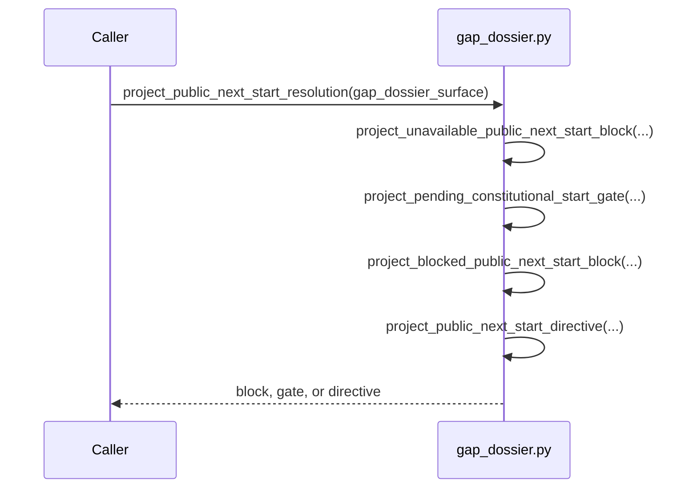
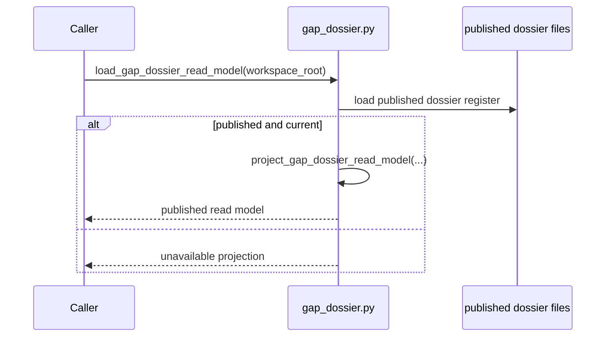

# S-037 Review 03: Homeostatic Triage, Dossiers, and Constitutional Re-entry

Files reviewed:

- `triage.py`
- `gap_dossier.py`
- `homeostatic_loop.py`

## triage.py

- purpose: classify enriched gap observations into route-binding and
  constitutional-proposal truth, then publish the edge-triage artifact
- role: semantic kernel with embedded effect shell

### Prime entry points

- `enrich_gap_snapshot(...)`
- `_build_edge_projection(...)`
- `_build_triage(...)`
- `_build_constitutional_proposal(...)`
- `_publish_edge_projection(...)`
- `_build_route_binding(...)`

### Sequence: `enrich_gap_snapshot(...)`



### Sequence: `_build_edge_projection(...)`



### Sequence: `_build_triage(...)`



### Sequence: `_publish_edge_projection(...)`



### Fault lines

- lawful but over-coupled: semantic classification and event publication live in
  one file.
- unstable identity across refresh or reprojection: proposal identity depends on
  what is included in the semantic hash. Small mistakes here cause repeated
  pending gates or false divergence.
- hidden semantic center risk: high. This file decides most of the domain’s
  “what is next?” meaning.

### Design judgment

Keep the file as the homeostatic semantic kernel. Do not move domain meaning up
into `app.py`. The right stabilization move is to keep this file authoritative
and keep publication deterministic.

## gap_dossier.py

- purpose: project canonical gap truth into a published dossier/read model and
  then classify the head dossier into public `next` resolution
- role: projection module plus binding adapter

### Prime entry points

- `project_gap_dossier_input(...)`
- `build_gap_dossier_register(...)`
- `load_gap_dossier_read_model(...)`
- `project_public_next_start_resolution(...)`
- `project_gap_dossier_surface(...)`

### Sequence: `build_gap_dossier_register(...)`



### Sequence: `project_public_next_start_resolution(...)`



### Sequence: `load_gap_dossier_read_model(...)`



### Fault lines

- split carrier vs controller authority: this file must remain projection-only.
  If `app.py` or tests rebuild head-gap truth without this read model, a second
  admission path appears.
- proxy compatibility authority risk: medium. The read-model fallbacks are safe
  only if they remain unavailable projections, not silent rebuilds.

### Design judgment

This is the right place for public `next` head-gap classification. The design is
lawful if public callers consume only the published read model.

## homeostatic_loop.py

- purpose: apply domain-owned constitutional proposals and loop the resulting
  surface change back into homeostatic gap truth
- role: effect shell module

### Prime entry points

- `apply_constitutional_proposal(...)`
- `loopback_homeostatic_gap(...)`

### Sequence: `apply_constitutional_proposal(...)`

```mermaid
sequenceDiagram
    participant Caller
    participant Loop as homeostatic_loop.py
    participant Files as target constitutional surface
    participant Events as workspace runtime events
    participant Analysis as analysis.py

    Caller->>Loop: apply_constitutional_proposal(workspace_root, edge, proposal_id)
    Loop->>Files: load current triage artifact and target surface
    Loop->>Files: append application block if missing
    Loop->>Events: constitutional_proposal_approved_with_edits
    Loop->>Events: proposal_applied
    Loop->>Analysis: refresh_analysis(stage=\"proposal_applied\")
    Loop-->>Caller: applied payload
```

### Sequence: `loopback_homeostatic_gap(...)`

```mermaid
sequenceDiagram
    participant Caller
    participant Loop as homeostatic_loop.py
    participant Events as workspace runtime events

    Caller->>Loop: loopback_homeostatic_gap(app, edge, proposal_id, post_gap_payload)
    Loop->>Events: derivation_reopened
    alt gap retired
        Loop->>Events: gap_retired
        Loop-->>Caller: retired result
    else still open
        Loop->>Events: gap_event
        Loop-->>Caller: still_open result
    end
```

### Fault lines

- incorrect boundary ownership: if this path is implemented through a generic
  ABG approval helper, odd_sdlc loses ownership of constitutional meaning.
- unstable identity across refresh: if proposal identity is not stable,
  application can republish a new pending gate instead of progressing lawfully.

### Design judgment

Keep this as an odd_sdlc-owned effect shell. The file exists for a real prime
boundary: constitutional application is domain law, not generic runtime law.
