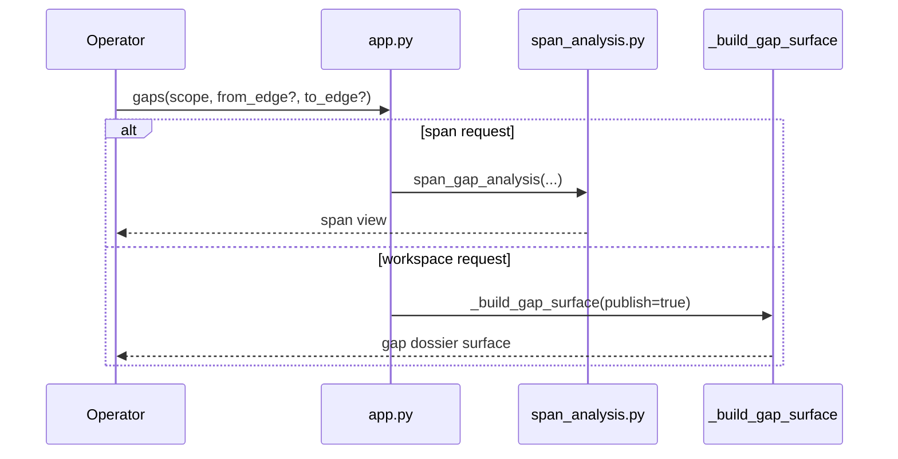
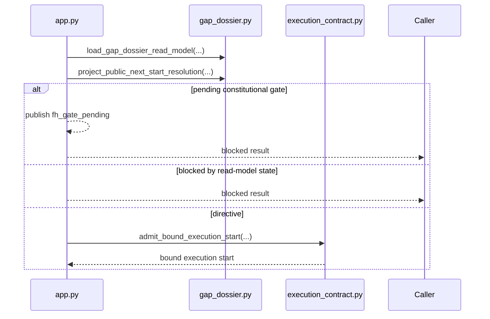
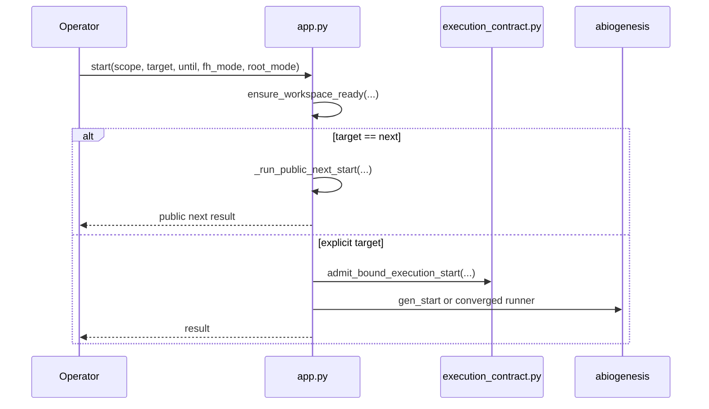
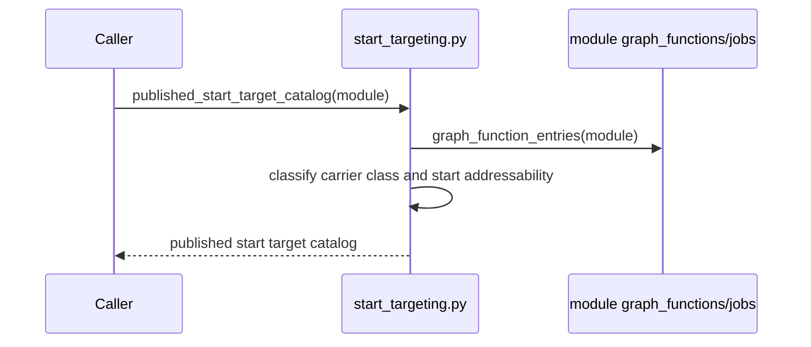
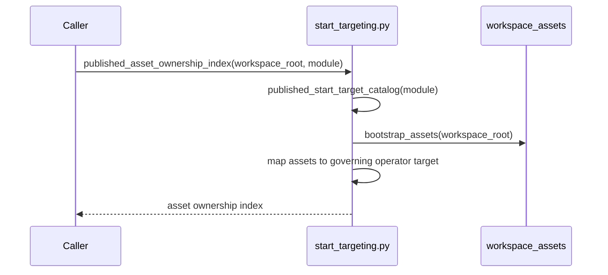
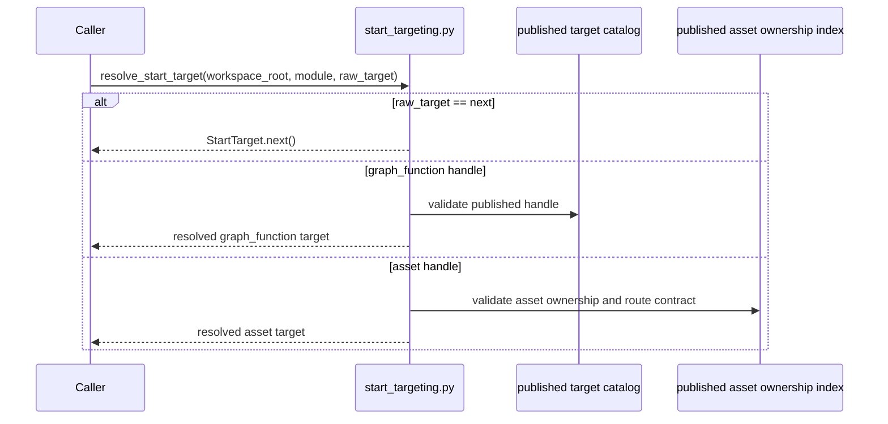
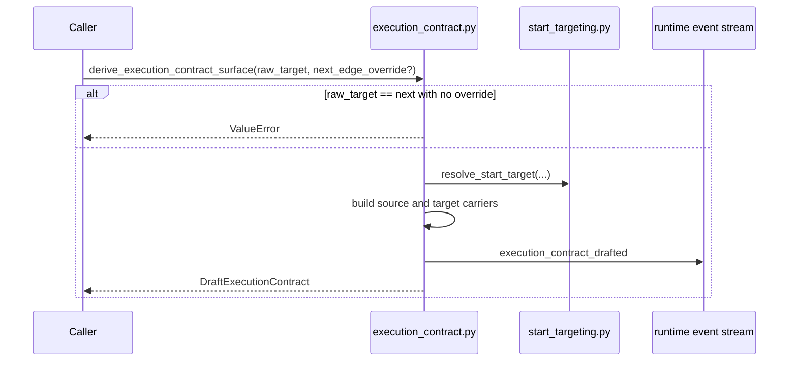
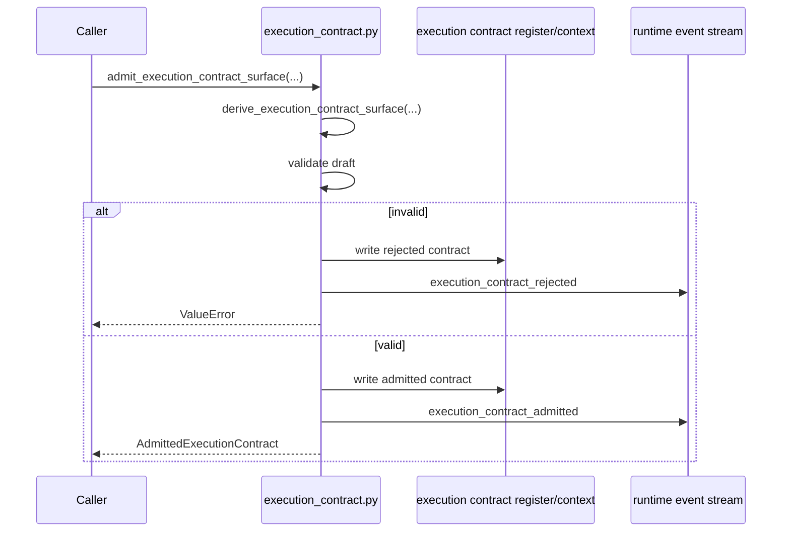
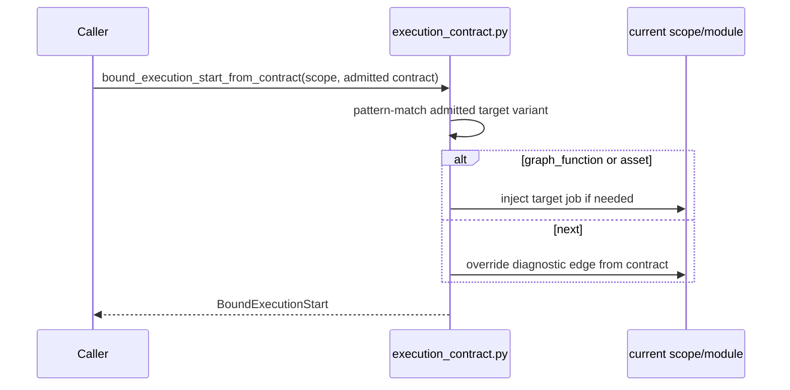
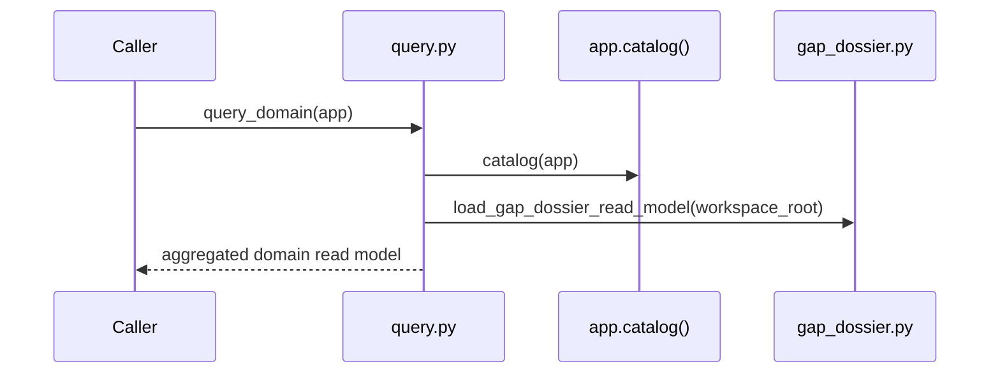

# S-037 Review 04: Public Control, Target Binding, and Admission

Files reviewed:

- `app.py`
- `start_targeting.py`
- `execution_contract.py`
- `query.py`

## app.py

- purpose: expose the public odd_sdlc control surface and bind public commands
  to published carriers and admitted execution
- role: binding/adapter module with public control logic

### Prime entry points

- `bootstrap(...)`
- `catalog(...)`
- `gaps(...)`
- `_resolve_public_next_iteration(...)`
- `_run_public_next_start(...)`
- `start(...)`

### Sequence: `gaps(...)`



### Sequence: `_resolve_public_next_iteration(...)`



### Sequence: `_run_public_next_start(...)`

```mermaid
sequenceDiagram
    participant Operator
    participant App as app.py
    participant Loop as homeostatic_loop.py
    participant Analysis as analysis.py
    participant ABG as abiogenesis

    Operator->>App: start(target=\"next\", until=\"converged\")
    loop each iteration
        App->>App: _resolve_public_next_iteration(...)
        alt blocked pending_fh and human-proxy
            App->>Loop: apply_constitutional_proposal(...)
            App->>Analysis: republish homeostatic surface
        else admitted directive
            App->>ABG: gen_start / auto dispatch
            alt traversal or dispatch changed workspace
                App->>Analysis: republish homeostatic surface
            else yield or stop
                App-->>Operator: public result
            end
        else blocked
            App-->>Operator: blocked result
        end
    end
```

### Sequence: `start(...)`



### Fault lines

- hidden semantic center: highest-risk file in the core. If domain meaning is
  invented here instead of consumed from `gap_dossier.py` and
  `execution_contract.py`, migrations regress immediately.
- incorrect boundary ownership: any use of generic ABG FH helpers for
  constitutional progression is wrong in this file.
- incomplete migration: historical bugs in this wave were exactly controller
  bypasses inside `app.py`.

### Design judgment

Keep `app.py` thin. Its lawful job is orchestration and binding, not domain
meaning. Every future bug fix here should start by asking whether the missing
truth belongs in a carrier/projection file instead.

## start_targeting.py

- purpose: publish the start-target catalog and bind published target handles to
  GTL start targets
- role: binding/adapter module

### Prime entry points

- `graph_function_entries(...)`
- `published_start_target_catalog(...)`
- `published_asset_ownership_index(...)`
- `resolve_start_target(...)`

### Sequence: `published_start_target_catalog(...)`



### Sequence: `published_asset_ownership_index(...)`



### Sequence: `resolve_start_target(...)`



### Fault lines

- proxy compatibility authority risk: low if this file only consumes published
  catalogs.
- hidden GTL reinvention risk: medium if raw controller code skips these
  published catalogs and rebuilds target identity by convention.

### Design judgment

This file is prime and lawful. It is the correct adapter boundary between GTL
publication and public odd_sdlc targeting.

## execution_contract.py

- purpose: admit a typed execution basis from a published target and bind it to
  an executable start scope
- role: carrier module plus admission boundary

### Prime entry points

- `derive_execution_contract_surface(...)`
- `admit_execution_contract_surface(...)`
- `bound_execution_start_from_contract(...)`
- `admit_bound_execution_start(...)`

### Sequence: `derive_execution_contract_surface(...)`



### Sequence: `admit_execution_contract_surface(...)`



### Sequence: `bound_execution_start_from_contract(...)`



### Fault lines

- incomplete migration risk: if any caller still admits raw `next` without a
  published override, this boundary is bypassed.
- lawful but over-coupled: carrier definitions and file publication live in one
  file, but this is acceptable because admission is one prime boundary.

### Design judgment

This is the right hard-break surface. The explicit rejection of raw
`target == next` without a published override is a stabilizing design choice and
should remain.

## query.py

- purpose: expose read-only domain projections to operator tooling and other
  consumers
- role: projection module

### Prime entry point

- `query_domain(...)`

### Sequence: `query_domain(...)`



### Fault lines

- interface bleed risk: if `query.py` begins rebuilding missing truth instead of
  loading published read models, it becomes a semantic center.

### Design judgment

Keep this file as a thin projection aggregator. It is lawful only while it
remains read-only and fail-closed.
