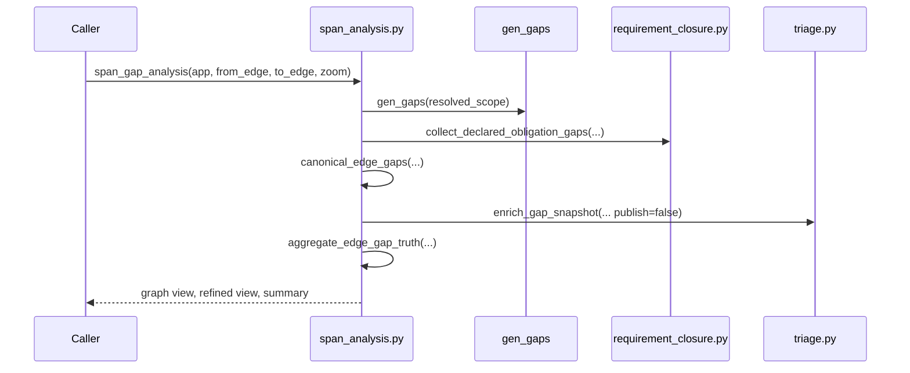
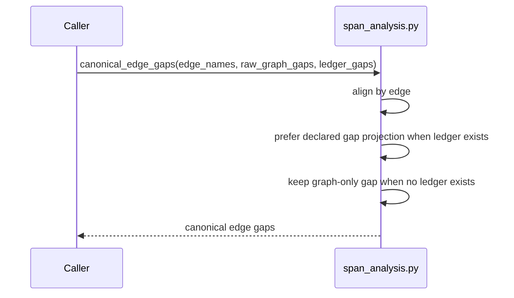
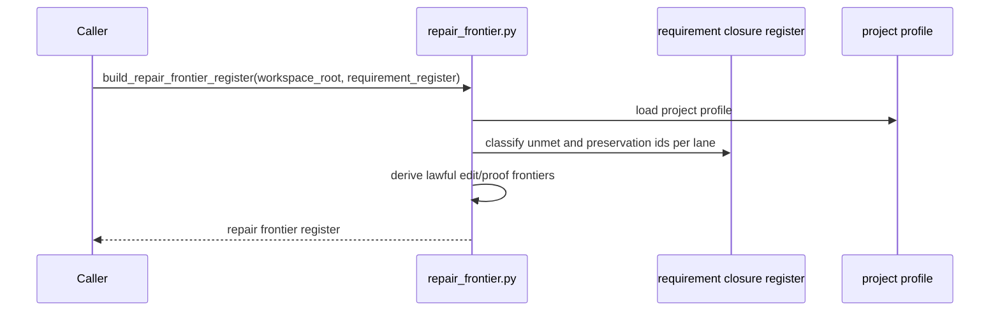
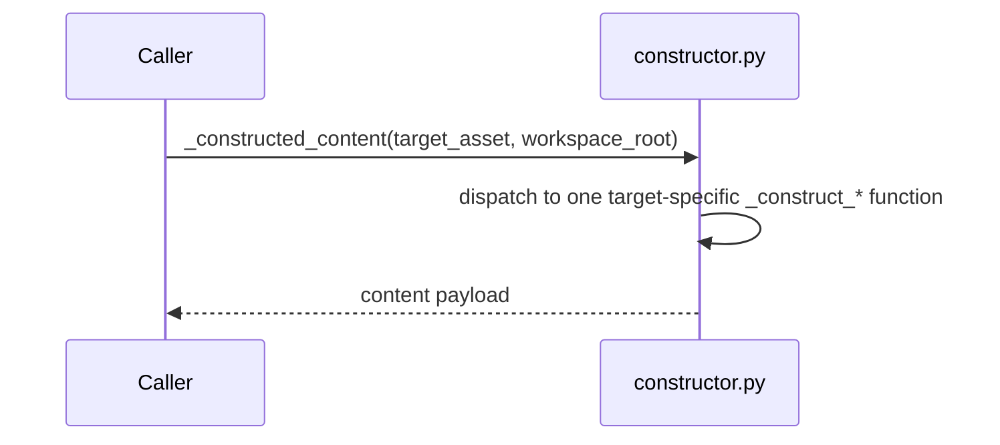
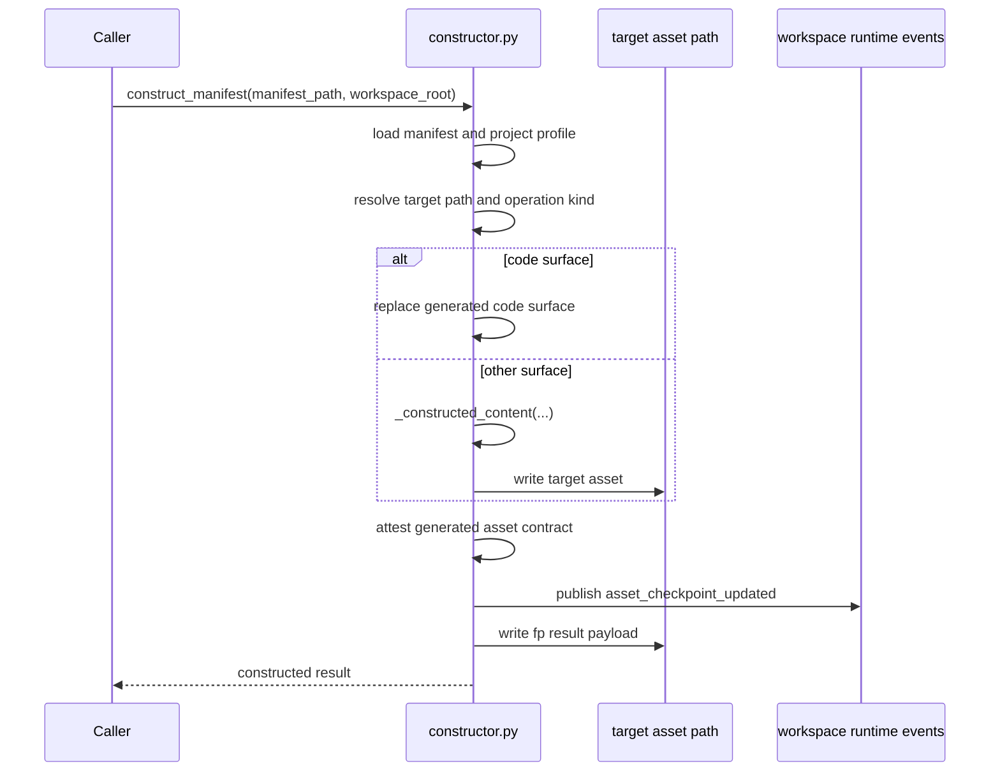
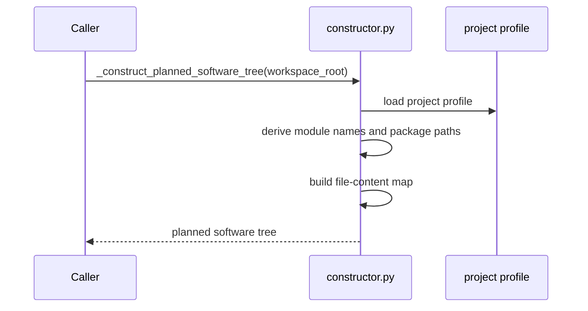

# S-037 Review 05: Projections, Frontier, and Materialization

Files reviewed:

- `span_analysis.py`
- `repair_frontier.py`
- `constructor.py`

## span_analysis.py

- purpose: combine raw graph gaps and declared obligation gaps into canonical
  edge-gap truth and span-level summaries
- role: semantic kernel plus projection module

### Prime entry points

- `canonical_edge_gaps(...)`
- `aggregate_edge_gap_truth(...)`
- `span_gap_analysis(...)`

### Sequence: `span_gap_analysis(...)`

### Sequence: `canonical_edge_gaps(...)`

### Fault lines

- interface bleed: this file must aggregate, not reinvent closure law.
- incomplete migration risk: if it drifts back to raw dict aggregation, it
  recreates a rival closure model beside `requirement_closure.py`.

### Design judgment

Keep the file. The move to typed canonical gap carriers is the right direction.
The stabilization rule is simple: no open-dict convergence logic should return.

## repair_frontier.py

- purpose: derive a deterministic builder-facing repair frontier from the
  published requirement register
- role: projection module

### Prime entry points

- `build_repair_frontier_register(...)`
- `build_repair_frontier_prompt_context(...)`

### Sequence: `build_repair_frontier_register(...)`

### Fault lines

- projection-becoming-policy risk: this file should advise builder focus, not
  become the source of requirement closure truth.

### Design judgment

Keep this file as a downstream projection. It is lawful because it reads the
published requirement register and does not recalculate requirement status.

## constructor.py

- purpose: materialize governed asset surfaces and return attested constructed
  results
- role: constructor/materialization module

### Prime entry points

- `_construct_planned_software_tree(...)`
- `_constructed_content(...)`
- `construct_manifest(...)`

Most other `_construct_*` functions are family-specialized content builders
under the same materialization boundary. They are not individually prime public
entry points, but they do contribute to helper sprawl inside this file.

### Sequence: `_constructed_content(...)`

### Sequence: `construct_manifest(...)`

### Sequence: `_construct_planned_software_tree(...)`

### Fault lines

- lawful but over-coupled: this file is very large and mixes profile lookup,
  content composition, file materialization, attestation, and event emission.
- helper sprawl inside a prime boundary: many `_construct_*` functions are
  legitimate specializations, but the router file is still doing a lot.
- hidden semantic center risk: medium. If future requirement or route meaning is
  added here, the file will become an unlawful semantic center very quickly.

### Design judgment

Keep `construct_manifest(...)` as the single public materialization boundary.
That is the right shape.

Do not split the file merely because it is long. Split only when a new module
can take one honest role:

- pure content family
- code-surface materialization
- asset attestation

The current main stabilization need is not “more wrappers,” it is “do not let
materialization own domain law.”
