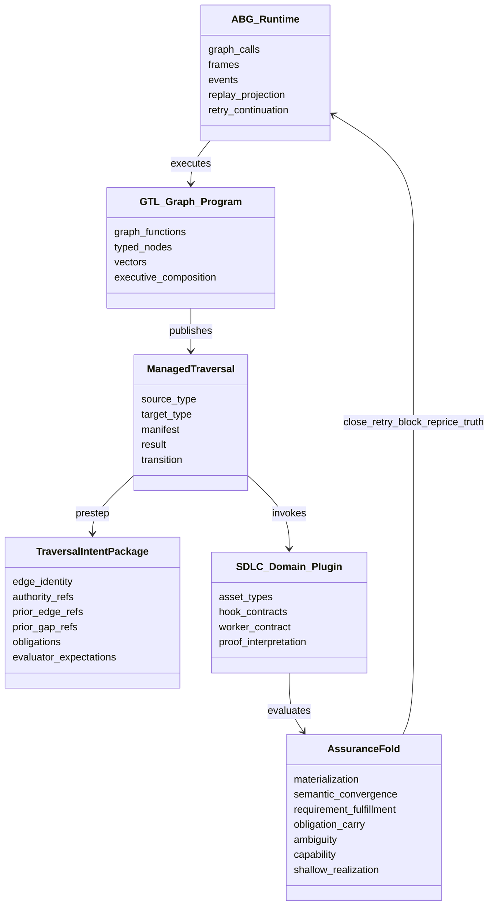
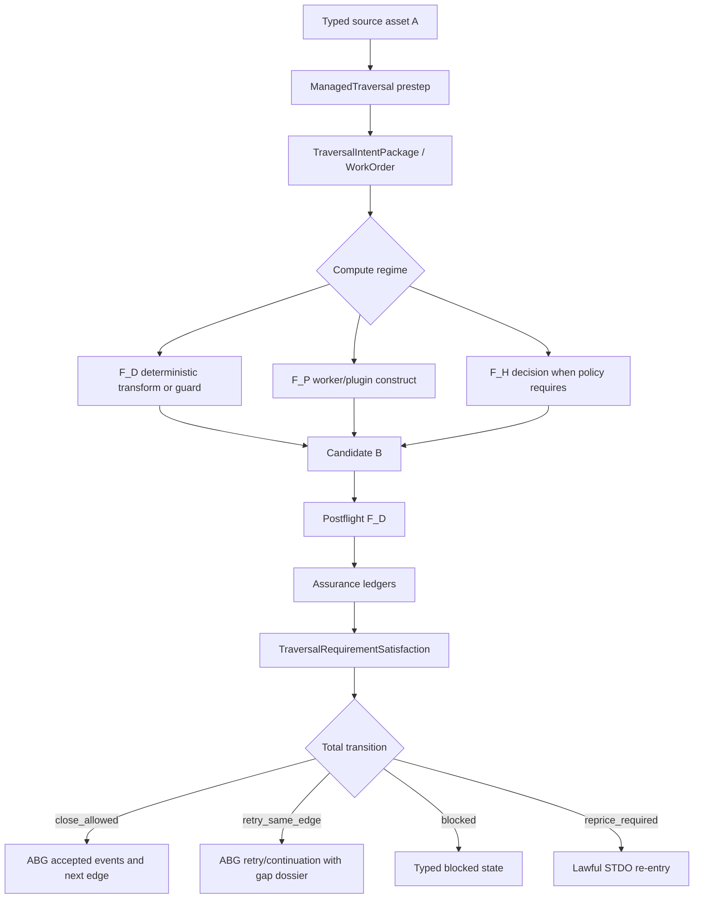
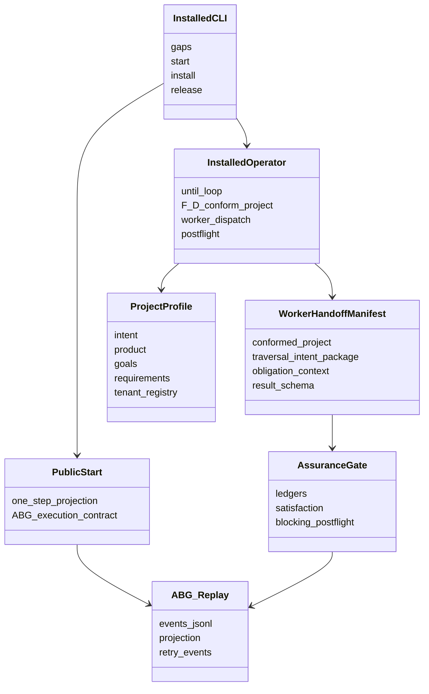
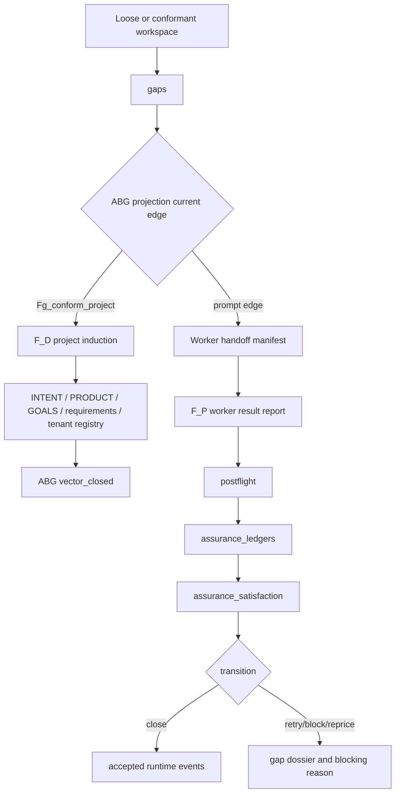
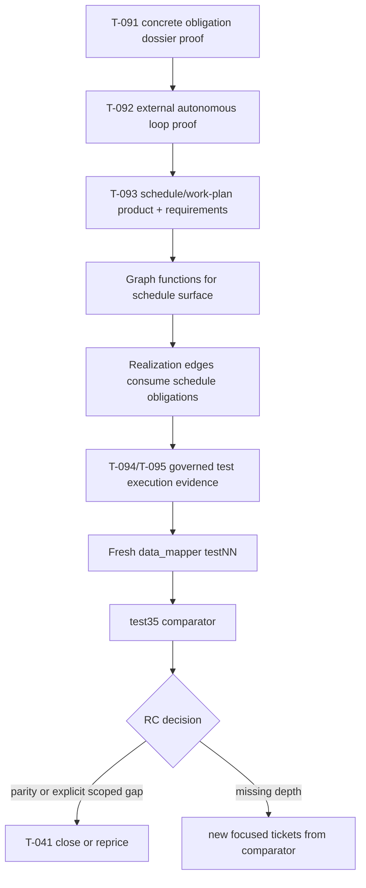
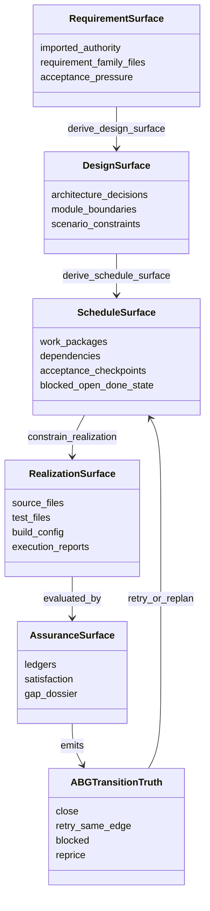
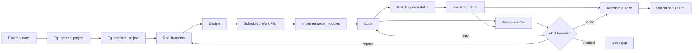

# Strategy: Managed Traversal Architecture, Current State, And Path

**Status**: commentary strategy  
**Date**: 2026-04-28  
**Scope**: `odd_sdlc.TS`, `data_mapper.test35` learning, and the
managed-traversal region of the ODD SDLC architecture.  
**Authority Note**: this is a comments post, not a ticket and not ratified
specification. It is written to stop the current loop of rediscovering the
same shape and to provide one planning surface for the next tickets.

## Executive Claim

The target architecture is not a new ledger family.

The target architecture is:

```text
ManagedTraversal<A, B>
  = graph-owned prestep manifest
  + ABG-owned traversal/runtime state
  + product-owned F_D/F_P/F_H execution plugin
  + product-owned assurance evaluation
  + ABG-visible close/retry/block/reprice transition
```

For deterministic bootstrap:

```text
{ unordered source set } -> Fg_conform_project -> constitutional project
postprocess = conform_project_report + bootstrap managed traversal ledger
```

For prompt-bearing traversals:

```text
requirements -> design
design -> modules
modules -> implementation
implementation -> tests
postprocess = postflight + assurance_ledgers + assurance_satisfaction
```

`T-085` already owns the assurance ledger family. The mistake in the last turn
was trying to create a second `managed_traversal_ledger` for
`requirements -> design`. `T-098` corrects that: prompt-bearing edges close
through existing assurance ledgers.

---

## 1. Ideal Destination Architecture

The destination architecture takes the productive mechanism from
`data_mapper.test35` and rebuilds it cleanly in TypeScript using GTL/ABG rather
than Python-local control flow.

`test35` demonstrates that solution delivery emerges when each edge keeps
current state, exact failures, manifests, ledgers, and prior context visible to
the next traversal. It does not win because of Python templates. It wins
because it preserves pressure and re-enters work until proof converges.

The ODD-native form is:

```text
A -> B is not "call worker once"

A -> B is ManagedTraversal<A, B>:
  1. define target gain and obligation surface
  2. execute F_D, F_P, and/or F_H under graph authority
  3. evaluate output against assurance dimensions
  4. emit close, retry, blocked, or reprice state
  5. preserve that state for later traversals
```

### 1A. Higher-Order Graph Functions And ABG Helper Surface

The higher-order graph function is a reusable traversal wrapper. It should not
own SDLC meaning, but it should remove repeated boilerplate around manifests,
state, archive shape, and transition mechanics.

Target higher-order form:

```text
Fg_managed_traversal<A, B>(
  source: TypedAssetRef<A>,
  target_type: TypeSurfaceRef<B>,
  transform: TraversalTransformContract<A, B>,
  evaluation: TraversalEvaluationContract<A, B>,
  history: TraversalHistoryRefs,
  policy: ClosureAndRetryPolicy
) -> TraversalTransition<B>
```

ABG helper functionality that makes this cleaner:

- standard graph-call/frame/vector runtime truth
- standard event append and replay projection
- standard retry/continuation event helpers
- standard archive frame for manifest, result, postflight, gap, and replay refs
- standard sandbox/install harness so downstream products do not reimplement
  runtime population
- replay helper that makes prior edge artifacts and gap dossiers available to
  the next handoff by reference
- no ABG ownership of SDLC domain meaning, requirement text, module policy, or
  design closure interpretation

`odd_sdlc` owns:

- source asset meaning
- target asset meaning
- requirement/design/module/capability obligations
- schedule/work-package meaning
- assurance dimensions
- F_P worker contract
- closure interpretation over SDLC evidence

### 1B. GTL Graph Capabilities Used

The destination uses these GTL capabilities as first-class architecture:

- typed nodes and typed asset refs
- graph functions as the constructive carrier
- executable graph-function composition
- reusable graph-function library entries
- specialized product leaf graph functions
- `F_D -> F_P -> F_H` compute order per traversal
- evaluators as graph-owned surfaces, not hidden code comments
- graph function catalogs and executive programs
- typed source and target contracts
- projection/query surfaces over ABG replay truth
- assurance graph functions folded into one traversal satisfaction surface

The reusable graph functions already named in the current design remain the
right direction:

```text
Fg_single_typed_traversal
Fg_ingress_project
Fg_conform_project
Fg_materialization_assurance_ledger
Fg_semantic_convergence_assurance_ledger
Fg_obligation_carry_assurance_ledger
Fg_requirement_fulfillment_assurance_ledger
Fg_ambiguity_assurance_ledger
Fg_capability_assurance_ledger
Fg_shallow_realization_assurance_ledger
Fg_traversal_assurance_fold
```

### Ideal Domain Model



### Ideal Flow



---

## 2. Current State

The TypeScript line is now much stronger than it was two days ago, but it is
not yet the ideal architecture.

Current strengths:

- graph catalog and reusable graph-function library exist
- installed CLI, installer, package binding, and release adapters exist
- `Fg_conform_project` can induct an understructured workspace
- `INTENT.md`, `PRODUCT.md`, `GOALS.md`, `requirements/*`, bootstrap context,
  constraints, and tenant registry are materialized from loose inputs
- worker handoff manifests carry conformed project truth
- traversal intent packages carry authority and obligation pressure
- obligation payloads now carry source refs, digests, snippets, and coverage
  expectations
- postflight rejects missing, extra, unassessed, and insufficient requirement
  coverage
- assurance ledgers exist and fold to close/retry/block/reprice
- postflight failures are promoted to ABG-compatible retry/gap truth
- installed `start --until blocked` has deterministic test proof for multiple
  edge attempts
- `requirements -> design` is now proven to close through existing assurance
  ledgers

Current gaps:

- full `data_mapper` test35-equivalent operational depth is not proven
- schedule/work-plan phase is missing between design/module and realization
- live governed test execution is not fully closed
- some active tickets remain open although unit slices exist
- the operator code is still large and effect-heavy
- the higher-order managed traversal wrapper is not yet a reusable GTL function
  across every edge
- current state and exact F_D failure payloads are still thinner than the
  strongest `test35` manifests

### Completed Ticket Scan

High-signal completed tickets from the last wave:

```text
Ticket   Current reading
------   ---------------------------------------------------------------
T-066    Product materialization and assurance integration exists.
T-067    Non-generate operation types are preserved.
T-068    Conform-project profile exists before materialization.
T-069    Installed initial-state proof exists.
T-070    Consolidation only; not a separate implementation claim.
T-071    Consolidation only; recursive deepening target is documented but
         full data_mapper parity is not proved by this ticket alone.
T-072    Consolidation only; capability inventory target remains important.
T-073    Consolidation only; behavioral test inventory target remains important.
T-074    Consolidation only; shallow realization evaluator target remains
         represented by later assurance work.
T-075    Comparator exists as RC decision surface, not proof by itself.
T-076    Total transition/state-machine reconciliation is implemented.
T-077-083 Assurance dimensions are implemented.
T-084    Assurance fold exists.
T-085    Assurance ledger validation is hardened; this is the postprocess
         authority for prompt-bearing traversals.
T-086    Typed blocking reason carriers exist.
T-087    Project induction as F_D graph function exists.
T-088    Cumulative traversal intent package exists.
T-089    Prompt-edge pressure enforcement exists.
T-096    Bootstrap managed traversal proof exists.
T-097    Bootstrap managed traversal manifest/ledger exists.
T-098    Requirements-to-design proof uses existing assurance ledgers.
```

Active tickets that still matter:

```text
Ticket   Current reading
------   ---------------------------------------------------------------
T-041    Full operational Python-replacement RC envelope remains open.
T-091    Closure law remains active until the external/data_mapper proof
         confirms no lossy obligation carrier remains.
T-092    Unit proof exists, but external autonomous run proof remains part
         of the RC story.
T-093    Scheduling/work-plan phase is genuinely missing.
T-094    Execution evidence status vocabulary needs final closure.
T-095    Governed live test execution for test archive remains open.
```

### Code Scan

Current TypeScript code surface by line count for the relevant region:

```text
operator/*.ts     3976 LOC
assurance/*.ts    1190 LOC
workspace/*.ts    2043 LOC
graph/*.ts        1316 LOC
hooks/*.ts        1228 LOC
start/*.ts         356 LOC
total            10109 LOC
```

The largest pressure points are:

- `operator/handoff.ts`: 1808 LOC
- `workspace/project_profile.ts`: 1418 LOC
- `operator/installed_operator.ts`: 1130 LOC
- `operator/assurance_gate.ts`: 489 LOC
- `graph/module.ts`: 526 LOC
- `graph/library.ts`: 504 LOC

This is not automatically wrong, but it shows where prime compression and
module-boundary cleanup should happen after behavior stabilizes.

### Current Domain Model



### Current Flow



### Current Missteps And Corrections

```text
Misstep                                                     Correction
----------------------------------------------------------  --------------------------------------------------
Assuming TS already had test35 depth                         T-041 stays open; data_mapper remains external bar.
Early bootstrap let downstream edges start too soon          T-087/T-096 require Fg_conform_project first.
Conform project initially missed INTENT.md                   T-096 adds INTENT as required bootstrap surface.
Prompt strengthening was treated as enough                   T-088/T-089/T-091 make typed pressure mandatory.
Obligations were thin IDs and refs                           T-091 adds payloads, snippets, digests, coverage expectations.
Postflight checked participation more than coverage          T-091 rejects fulfilled requirement without output coverage.
T-097 looked like a general ledger pattern                    T-098 corrects: only bootstrap gets deterministic conform ledger.
T-098 briefly duplicated assurance evaluation                 Correction: prompt-bearing edges use T-085 assurance fold.
External one-shot moved through edges but got shallow code     T-093 scheduling and deeper evaluator pressure remain required.
Test archive accepted or produced not-run/pending ambiguity   T-094/T-095 remain active until live test evidence is governed.
```

---

## 3. Sequence To Reach The Ideal

The next sequence should avoid adding new abstractions before each missing
behavior is pinned to the current graph edge.

### Step 1: Ratify The Managed Traversal Boundary

Write the design boundary explicitly:

```text
bootstrap deterministic edge:
  conform_project_report + managed_traversal_ledger

prompt-bearing edge:
  handoff_manifest + worker_result_report + postflight
  + assurance_ledgers + assurance_satisfaction
```

Do not create a second prompt-edge ledger.

### Step 2: Close T-091 Against External Proof

The code now carries richer obligation payloads, but `T-091` remains active by
its own closure law. It should close only after a fresh external run proves:

- `Fg_conform_project` preserves the admitted source set
- requirement-family files are useful, not marker-only
- prompt-bearing handoffs carry concrete obligation payloads
- fulfilled requirement assessments cite output coverage
- lossy carriers block before downstream false closure

### Step 3: Finish The Operator Loop Evidence For T-092

The deterministic semantic test proves multi-edge `start --until blocked`.
The external proof must show the same behavior on `data_mapper.testNN.ts`:

```text
one command
  -> repeated ABG-backed start projections
  -> multiple worker traversals
  -> real blocked/converged stop
```

`publicStartOnce` stays pure. The installed CLI effect shell owns repetition.

### Step 4: Add Scheduling As A Product/Requirement/Design Phase

This is the biggest structural gap between current TS and `test35`.

`test35` effectively had work-order pressure. TS currently jumps too quickly:

```text
design -> implementation modules -> code
```

Target:

```text
design/module surfaces
  -> schedule/work_plan surface
  -> planned work packages
  -> realization edges consume work packages
  -> assurance evaluates package coverage and residual gaps
```

This should be done under `T-093`, starting at product and requirements, not
by patching `derive_code_surface` locally.

### Step 5: Close T-094/T-095 Test Execution Contract

The test-run archive edge must not close with no executed tests when a test
contract exists.

Target:

```text
derive_test_run_archive_surface
  -> run or ingest conformedProject.testExecutionContract
  -> executionEvidence(status, counts, reportRefs)
  -> assurance/postflight close only on governed evidence
```

Pending/not-run is lawful as a blocked or pending state, not closure proof.

### Step 6: Extract ABG Helper Candidates Only After The SDLC Shape Is Stable

Do not push SDLC meaning into ABG.

Candidate ABG helpers after proof:

- archive frame helper for edge manifest/result/postflight/gap
- retry projection helper for prior gap dossiers
- standard event kind helpers for accepted/failed traversal outcomes
- common sandbox install/test harness
- generic `iterate until stop` utility over ABG replay truth

Non-candidates:

- requirement parsing
- scheduling semantics
- capability inventory
- behavioral test interpretation
- SDLC proof closure policy

### Step 7: Prime Refactor The Large TS Modules

After T-091/T-093/T-095 behavior is proven, split the heavy modules:

- `operator/handoff.ts`
  - manifest construction
  - obligation dossier construction
  - report admission
  - postflight evaluation
  - prompt projection
- `operator/installed_operator.ts`
  - F_D conformance transition
  - worker edge transition
  - failure-to-gap transition
  - accepted transition archive
  - until-loop shell
- `workspace/project_profile.ts`
  - profile derivation
  - source requirement projection
  - topology conformance report
  - materialization
  - bootstrap managed traversal manifest/ledger

Prime refactor should not change graph behavior.

### Step 8: Run A Fresh data_mapper TestNN As The RC Comparator Input

Each fresh external run should be treated as historical evidence, not a
workspace to rewrite. Capture:

- event count
- edge sequence
- manifest/result/report archive count
- source/test file inventory
- execution evidence
- assurance failures
- retry count
- stop reason
- comparison to `test35`

The goal is not identical file count. The goal is functional parity through
the cleaner ODD-native architecture.

### Target Transition Flow



### Target Domain Model After The Next Wave



### End-State Flow For The Region



## Bottom Line

The system is no longer missing the idea of managed traversal. It is missing
the clean completed architecture around it.

Current correct interpretation:

- bootstrap managed traversal has a deterministic conformance ledger
- prompt-bearing traversals already use assurance ledgers
- scheduling is the missing intermediate graph asset that should prevent
  shallow one-shot realization
- ABG should gain helpers for runtime/archive/retry plumbing, not SDLC domain
  meaning
- `data_mapper.test35` is the historical comparator for behavior, not a target
  codebase to copy

The next implementation work should stop introducing new proof lanes and
instead wire the existing graph, obligation, assurance, scheduling, and ABG
transition surfaces into one coherent ODD-native flow.
