# Test60 Bug Wave - Holistic Domain Solution

## Engine-First Correction

The primary consolidation for this bug wave now lives under ABG:

`/Users/jim/src/apps/abiogenesis/.ai-workspace/comments/codex/20260430T224308AEST_abg_engine_first_holistic_solution.md`

Read that post first. This `odd_sdlc` post is the downstream domain/plugin
view. The SDLC bugs are real, but they are symptoms of an ABG engine boundary
gap: staged F_P execution, payload admission, event projection, retry frontier,
and closure fold were not yet one engine-owned path.

## Purpose

This post consolidates the six bug tickets opened from the
`data_mapper.test60.TS.cl` forensic into one coherent solution wave.

It uses:

- `SPEC_METHOD.md`: authority flows from goals to intent, product,
  requirements, design, code, events, projection, delta, scenarios, gap
  analysis, and repricing.
- `ODD_METHOD.md`: `odd_sdlc` must be a graph-native domain product over GTL
  graph functions and ABG runtime truth.
- `DESIGN_MODULE_METHOD.md`: authority seam closure, prime carrier sets,
  totality, explicit effect edges, and no hidden semantic center.

The conclusion is direct: the bugs are not six independent incidents. They are
one domain-model consistency defect that starts in ABG engine ownership and
then appears in `odd_sdlc` as domain adapter, graph-shape, and prompt/postflight
bugs.

## Method Anchors

### SPEC_METHOD Anchor

The live bug is not "Claude failed to finish." The live bug is that the current
design allows closure-relevant truth to be split across prompt prose, markdown
artifacts, legacy worker reports, postflight checks, retry context, and ABG
projection. That violates the requirement that code and behavior remain
derivable from explicit requirement and design authority.

Lawful re-entry therefore starts with ABG and then moves downstream:

| Concern | First missing layer | Owner |
| --- | --- | --- |
| Process actor execution and streamed observation | design | ABG |
| F_P stage algebra | design | ABG |
| Retry frontier projection | design | ABG |
| Test execution vs archive graph shape | design | odd_sdlc |
| Pending execution semantics | design | odd_sdlc |
| Artifact execution-evidence extraction | code | odd_sdlc |
| Scala dependency coordinate generation | code, design if policy absent | odd_sdlc |

### ODD_METHOD Anchor

The graph is the process model. `derive_test_run_archive_surface` cannot be a
hidden imperative service method that also decides whether to run `sbt test`,
which files count as side effects, what pending means, and how closure folds.

The target ODD product shape is:

```text
typed SDLC assets + published graph functions + GTL module +
ABG runtime truth + odd_sdlc query/projection + proof surfaces
```

### DESIGN_MODULE_METHOD Anchor

The current design violates four design-module evaluators:

| Rule | Current violation | Target correction |
| --- | --- | --- |
| Authority seam closure | execution evidence exists in markdown but report truth says `null` | one admitted execution-evidence carrier |
| Prime law | worker report is acting as transform result, materialization ledger, evaluator, and closure witness | prime F_P stage carriers |
| Totality | `pending` is admitted as a status but not projected to a total lawful outcome | closed pending outcome algebra |
| Effect-edge rule | archive edge invokes `sbt test` and then judges its side effects | separate execution edge from archive edge |
| No semantic center | `handoff.ts` / operator postflight becomes hidden law for closure, retry, and execution | ABG/odd_sdlc carriers and graph contracts own meaning |

## Current Fault Topology

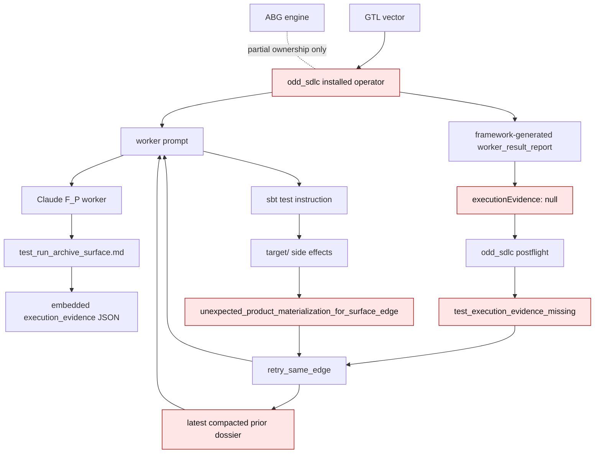

The current loop is structurally unstable:

- the worker can write lawful pending evidence
- the framework discards it
- retry context loses earlier blockers
- the prompt again invites an action that violates the edge contract

This is why `test60` oscillated at vec 17 instead of deepening like `test35`.

## Target Domain Topology

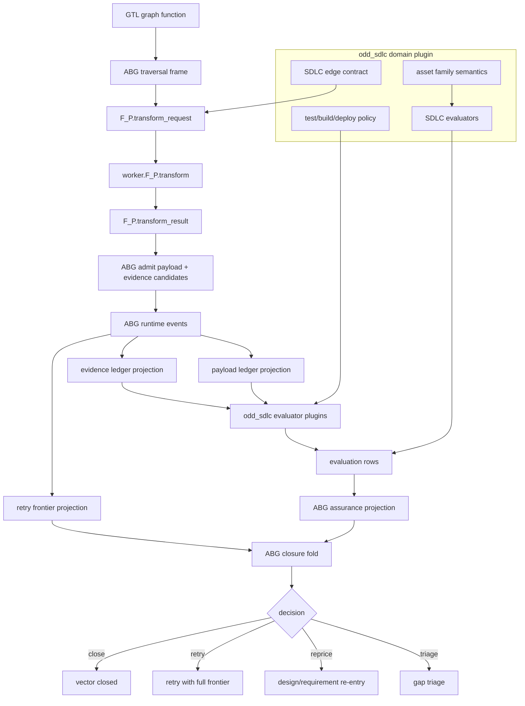

The target rule is:

```text
worker transforms; ABG admits/events/projects/folds; odd_sdlc supplies domain
mapping and evaluators.
```

## Irreducible Architectural Carrier Set

### ABG Carrier Set

| Carrier | Prime role | Notes |
| --- | --- | --- |
| `F_P.transform_request` | execution carrier | bounded work request over one graph vector |
| `F_P.transform_result` | admission candidate | artifact refs, file deltas, process refs, evidence candidates |
| `AdmittedPayload` | source truth carrier | canonical ABG ingress for payloads that can affect closure |
| `RuntimeEvent` | event truth carrier | append-only runtime facts |
| `RetryFrontierProjection` | public projection carrier | full classified repair frontier |
| `EvidenceProjection` | public projection carrier | admitted evidence rows and refs |
| `AssuranceProjection` | closure input carrier | total ambiguity / fulfillment / capability state |
| `ClosureDecision` | yielded or terminal carrier | close, retry, reprice, triage, hold |

### odd_sdlc Carrier Set

| Carrier | Prime role | Notes |
| --- | --- | --- |
| `SdlcGraphFunctionCatalog` | source truth carrier | software-domain graph function declarations |
| `SdlcEdgeContract` | source truth carrier | input assets, target asset, materialization and evidence policy |
| `SdlcAssetSurface` | domain output carrier | intent/product/requirements/design/code/test/release surfaces |
| `SdlcExecutionPolicy` | domain policy carrier | build/test/deploy/runtime command and side-effect law |
| `SdlcEvidenceAdapter` | admission adapter | maps domain artifacts into ABG evidence candidates |
| `SdlcEvaluationPlugin` | evaluator plugin | produces domain evaluation rows, not runtime truth |
| `SdlcProjectionQuery` | read model | `gaps`, `query-domain`, manager UI projections |

The legacy `worker_result_report.json` is not in the target prime carrier set.
It may remain as compatibility output during migration, but it cannot remain the
architecture.

## Ticket Solution Matrix

| Ticket | Solution | Owner boundary | Closure proof |
| --- | --- | --- | --- |
| T-097 | ABG supervised process actor execution and streamed observation | ABG runtime | live process/stream/timeout facts projected before final closure |
| B-071 | Consume ABG process actor truth into SDLC archives and postflight dossiers | odd_sdlc adapter | worker_process_started/process events/log refs are archived and cited |
| T-099 | Publish typed F_P stage carriers and admission/evaluation flow | ABG runtime design | worker report no longer owns closure truth |
| T-098 | Project full retry frontier from ABG events and payloads | ABG runtime projection | next dispatch sees all distinct prior blockers |
| B-072 | Extract typed execution evidence from transform artifacts and admit it into the report/evidence carrier | odd_sdlc adapter | final report has non-null evidence from artifact |
| B-073 | Make `pending` a typed non-closure state that routes to triage/reprice/repair by blocker class | odd_sdlc evaluator policy | pending no longer blind-retries |
| T-104 | Split side-effecting test execution from archive surface | odd_sdlc graph design | archive depends on admitted execution result |
| B-074 | Validate/generated Scala dependency coordinates before live qualification | odd_sdlc build-tenant generator/evaluator | no invalid `_2.13_2.13` coordinate |

## B-072 Solution - Transform Artifact Evidence Admission

### Current

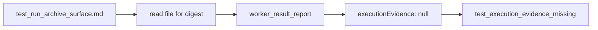

### Target

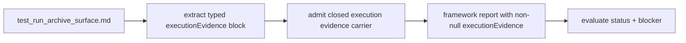

Solution detail:

- Add a deterministic artifact evidence extractor for
  `test_run_archive_surface`.
- Accept only one closed block shape, not arbitrary markdown claims.
- Seed `reportRefs` with the transform artifact when the artifact is the
  evidence source.
- Preserve pending blocker details.
- Return typed malformed-evidence blockers instead of null evidence.

## B-073 Solution - Pending Execution Routing

### Current

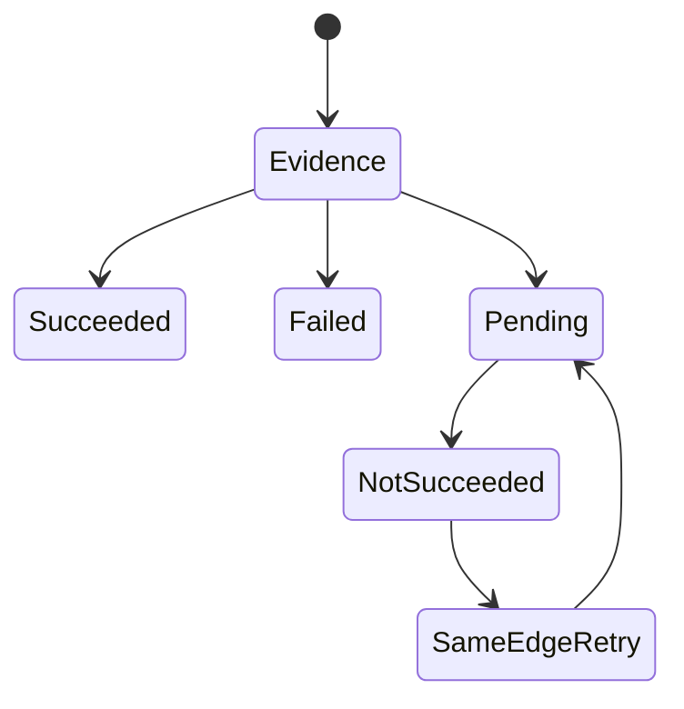

### Target

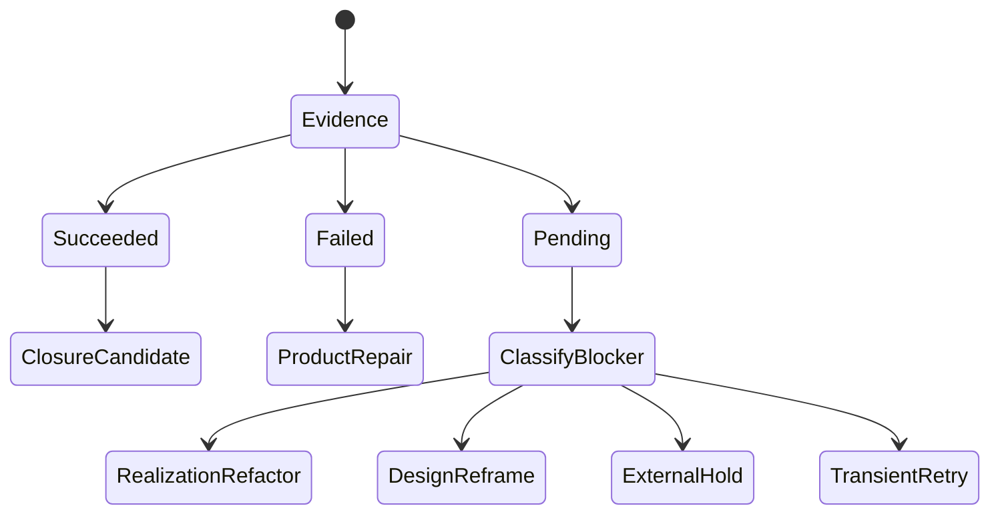

Solution detail:

- Preserve `pending` as admitted evidence.
- Make `pending` non-closing.
- Classify the blocker into a lawful re-entry point.
- Only allow same-edge retry when there is a transient condition or changed
  input.
- Project blocker detail into gap dossiers.

## T-104 Solution - Split Test Execution From Archive

### Current

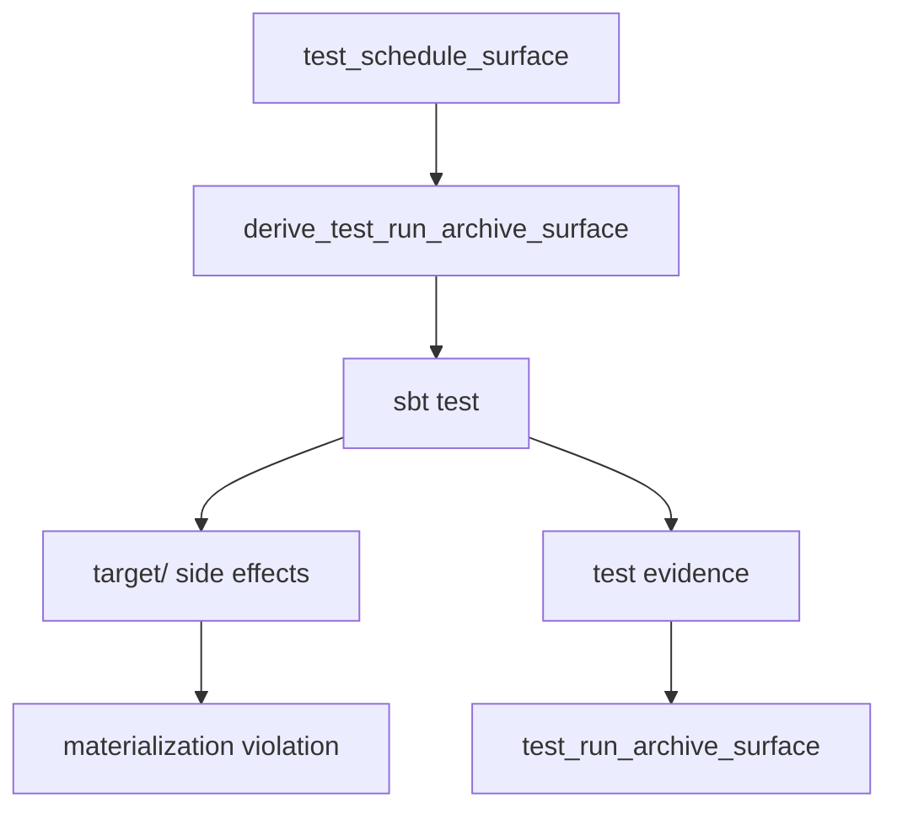

### Target

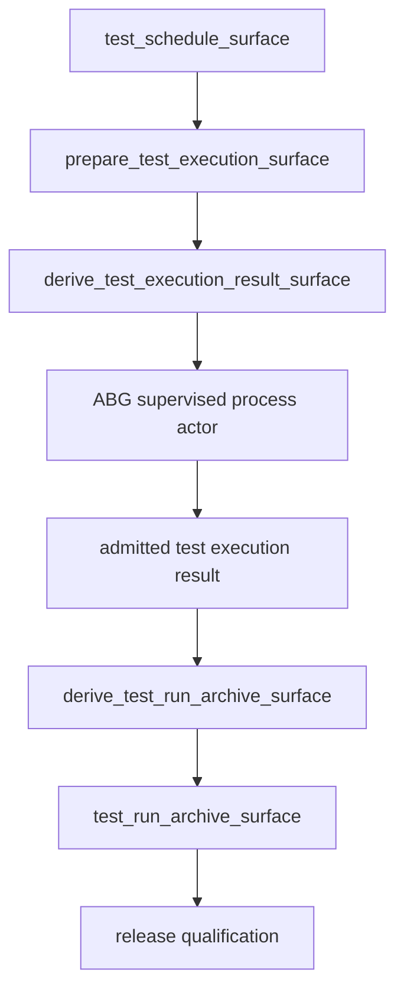

Solution detail:

- `derive_test_run_archive_surface` stops running `sbt test`.
- A side-effecting execution edge owns `sbt test`.
- Build-tool side effects are governed by the execution edge's materialization
  policy.
- Archive closure depends on admitted execution result truth.
- Release cannot bypass the execution result edge.

## B-074 Solution - Scala Dependency Coordinate Policy

### Current

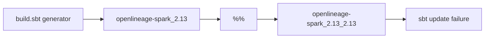

### Target

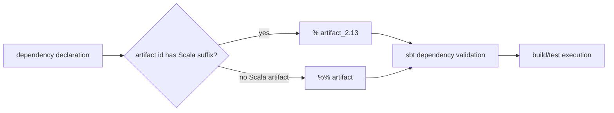

Solution detail:

- Introduce a coordinate policy in the generator/evaluator.
- Use `%` when artifact id already has `_2.13`.
- Use `%%` only for unsuffixed Scala artifacts.
- Add deterministic tests for the policy.
- Classify dependency-resolution failure as a product realization defect before
  test-run archive closure.

## T-098 Solution - Full Retry Frontier Projection

### Current

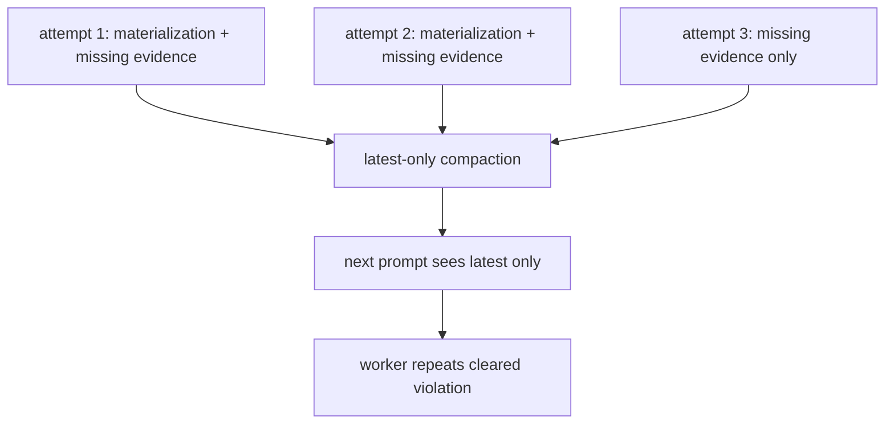

### Target

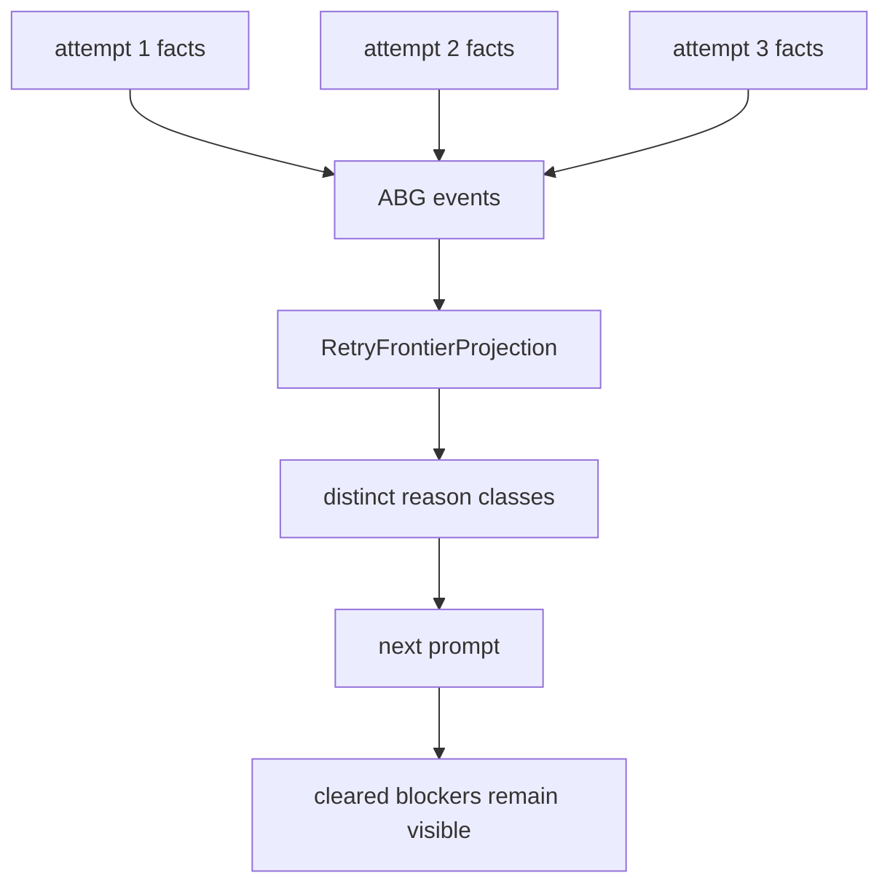

Solution detail:

- ABG owns retry frontier projection, not odd_sdlc.
- Preserve attempt identity, reason class, owner surface, materialization delta,
  evidence refs, and cleared/not-cleared status.
- Apply prompt-budget summarization only after preserving distinct classes.
- Make latest-only context an invalid full-frontier projection.

## T-099 Solution - Typed F_P Stage Carriers

### Current

```mermaid
flowchart TD
  Worker[worker] --> Report[worker_result_report.json]
  Report --> Materialization[materializedFiles]
  Report --> Obligations[obligationAssessments]
  Report --> Evidence[executionEvidence]
  Report --> Closure[unresolvedReasons: []]
  Closure --> Postflight[postflight approximates truth]
```

### Target

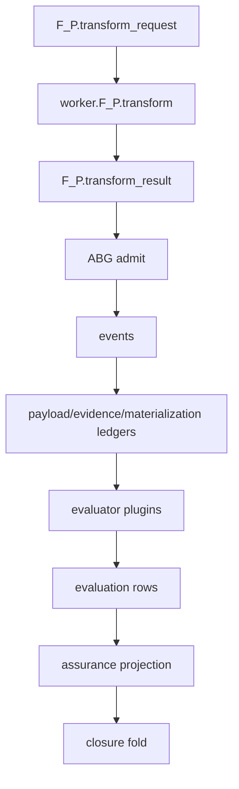

Solution detail:

- `worker_result_report.json` becomes a migration artifact, not architecture.
- Worker output cannot close the unit.
- ABG admits transform result and evidence candidates.
- Events and ledgers are replay-derived.
- odd_sdlc provides domain evaluators and edge contracts, not runtime truth.

## Work Order

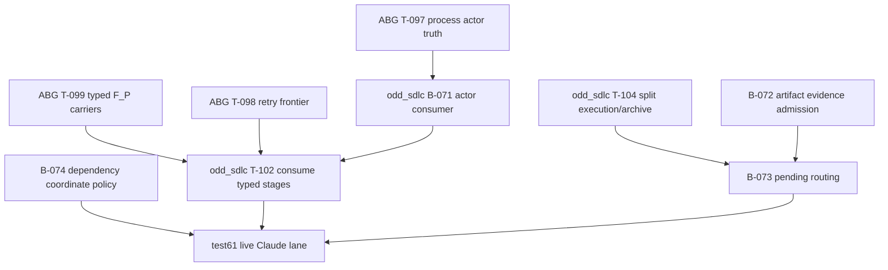

Practical sequencing:

1. Close or explicitly cite the live-evidence bar for ABG T-097, then keep
   B-071 as the SDLC consumer adapter.
2. Land ABG T-099 and T-098 so F_P stage and retry-frontier truth are
   engine-owned.
3. Update odd_sdlc T-102 to consume the accepted ABG carriers.
4. Implement B-072 and B-073 as SDLC adapter/evaluator repairs over the ABG
   carrier model.
5. Design T-104 and migrate the graph so execution and archive are no longer
   one edge.
6. Implement B-074 independently so the generated Scala tenant can resolve
   dependencies.
7. Run a fresh `test61.TS.cl` Claude lane.

## RC Gate

The next RC claim is not lawful until a fresh data_mapper lane proves:

- generated build tenant has valid dependency coordinates
- `F_P.transform` can return without owning closure
- transform evidence is admitted through ABG/odd_sdlc carriers
- pending execution routes to the correct re-entry point
- side-effecting test execution is separate from archive closure
- retry prompt sees full frontier context
- final closure depends on admitted test execution result truth

`test60` is therefore a successful bug-discovery run, not an RC run.
