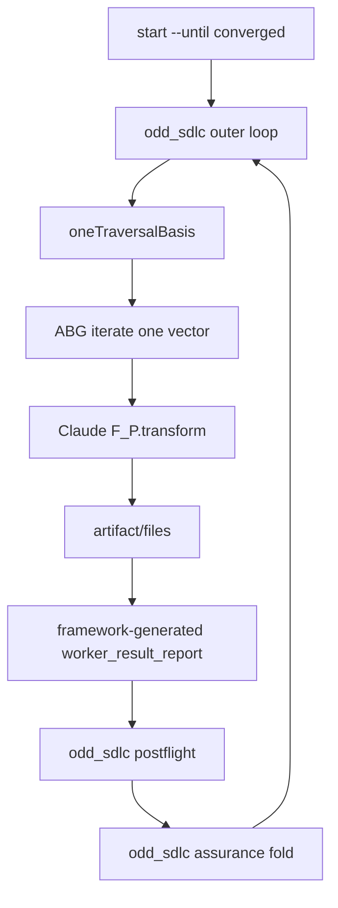
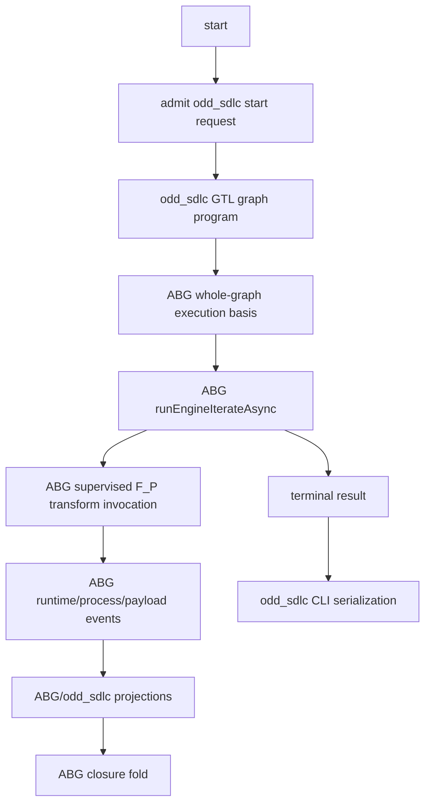

# odd_sdlc TypeScript Stabilisation Report - test62 and T-102

## Executive Summary

The fresh live Claude lane is not an RC pass. It is a good stabilisation run.

What it proved:

- The local odd_sdlc install and ABG rc.4 bootstrap path work.
- The graph now reaches beyond the previous test-module failure.
- `derive_test_module_surface` no longer fails on `target/` and `.bsp`
  byproducts.
- The code edge showed useful deepening: first code attempt passed postflight
  but assurance blocked, second attempt closed.
- The split test-execution graph shape is being exercised live.

What it exposed:

- `derive_test_execution_result_surface` still lacks a robust live contract.
- Contradictory execution evidence was being treated as retryable failure.
- A silent Claude worker can burn the full 30-minute wall-clock timeout while
  emitting only heartbeats.
- T-102 is still not closable because odd_sdlc still owns an outer
  `start --until converged` loop over one-vector ABG calls.

The deterministic suite is green after the fixes:

- focused T-066 suite: 15/15 passed
- `npm run lint:semantic`: passed
- `npm run test:semantic`: 153/153 passed

## Live Lane Summary

Command:

```sh
/bin/zsh -ic 'node_modules/.bin/odd-sdlc-ts start --workspace . --target next --until converged --worker process://claude'
```

Workspace:

`/Users/jim/src/apps/ai_sdlc_examples/local_projects/data_mapper/data_mapper.test62.TS.cl`

Installed substrate:

- odd_sdlc TypeScript package: `0.0.0-dev`
- ABG package: `3.4.0-rc.4`

Terminal result:

```text
status: worker_failed
graph_function: bootstrap_release_self_test
current_edge: derive_test_execution_result_surface
blocking_reason: worker_process_failed
loop_steps: 21
loop_stop: worker_failed
archive: .../operator-runs/20260430T193642659Z_pid22395
```

## Edge Progress Table

| Vector | Edge | Result | Notes |
| ---: | --- | --- | --- |
| 0 | `Fg_conform_project` | closed | foreground project conformance |
| 1 | `derive_intent_surface` | closed | early bootstrap surface |
| 2 | `derive_product_surface` | closed | early bootstrap surface |
| 3 | `derive_goal_surface` | closed | early bootstrap surface |
| 4 | `derive_requirement_surface` | closed | early bootstrap surface |
| 5 | `derive_feature_decomp_surface` | closed | early bootstrap surface |
| 6 | `derive_uat_testcases_surface` | closed | early bootstrap surface |
| 7 | `derive_design_surface` | closed | early bootstrap surface |
| 8 | `derive_scenario_surface` | closed | early bootstrap surface |
| 9 | `derive_implementation_design_surface` | closed | implementation planning |
| 10 | `select_implementation_stack_profile` | closed | implementation planning |
| 11 | `derive_implementation_module_surface` | closed | implementation planning |
| 12 | `derive_realization_schedule_surface` | closed | implementation planning |
| 13 | `derive_code_surface` | closed after retry | first attempt postflight passed but assurance blocked; second attempt `close_allowed` |
| 14 | `derive_test_design_surface` | closed | test planning |
| 15 | `select_test_stack_profile` | closed | test planning |
| 16 | `derive_test_module_surface` | closed | B-075 live proof; byproduct blocker cleared |
| 17 | `derive_test_schedule_surface` | closed | test planning |
| 18 | `prepare_test_execution_surface` | closed | T-104 split edge live proof |
| 19 | `derive_test_execution_result_surface` | blocked/failed | execution evidence and silent-worker defects |

Note: vector numbering in the runtime archive is zero-indexed from the ABG
graph. The table uses the observed runtime vector indexes from the test62
archives.

## Bugs Found

### B-075: test-module byproducts admitted as test module evidence

Evidence:

- test61 stopped at `derive_test_module_surface`.
- blockers were `trace_only_test_surface` rows over
  `build_tenants/scala_spark/**/target/**` and `.bsp`.
- These paths were build-tool byproducts, not authored test modules.

Fix applied:

- `operator/handoff.ts` now ignores execution/build byproducts for
  `test_module_surface`, `test_execution_result_surface`, and
  `test_run_archive_surface`.
- `isLikelyTestMaterialization(...)` rejects byproduct paths.
- Regression test:
  `T-102 post-transform observation ignores test-module build byproducts`.

Live result:

- test62 archive `20260430T184402727Z_pid22395`
- `derive_test_module_surface`
- postflight: `passed`
- assurance: `close_allowed`

Status:

- implemented
- deterministic proof passed
- live proof passed
- pending external review

### B-077: contradictory execution evidence retried as if it were a real test failure

Evidence:

test62 `derive_test_execution_result_surface` returned:

```json
{
  "status": "failed",
  "testsObserved": 63,
  "passedCount": 63,
  "failedCount": 0
}
```

The old postflight emitted `test_execution_not_succeeded` and same-edge retry.
That was wrong. The evidence was internally contradictory.

Fix applied:

- Added blocking reason `test_execution_evidence_contradiction`.
- Contradictions now classify to `triage_gap`, not same-edge retry.
- Regression test:
  `B-077 execution evidence contradiction stops for triage instead of retry`.

Status:

- implemented
- deterministic proof passed
- needs fresh live proof
- pending external review

### B-078: silent worker burns full actor timeout

Evidence:

test62 archive `20260430T193642659Z_pid22395`:

- Claude worker pid: `9570`
- timeout: `1800000ms`
- stdout: `0 bytes`
- stderr: `0 bytes`
- no `worker_result_report.json`
- no `postflight.json`
- ABG events:
  - heartbeats through `heartbeatIndex: 59`
  - `actor_process_timeout` at `1800002ms`
  - `actor_process_signal_sent` `SIGTERM`
  - `actor_process_exited` status `143`

The supervision evidence is good. The missing piece is policy: heartbeats prove
the actor wrapper is alive, not that the worker is making productive progress.
odd_sdlc needs an inactivity classifier over ABG process facts.

Status:

- ticket created
- not implemented
- design review required

### T-102: typed F_P stage split is only containment, not final architecture

Claude's review is correct on the serious point. T-102 cannot close while
odd_sdlc owns:

- the outer `start --until converged` loop
- one-vector ABG slicing
- local stop reason policy
- retry/closure control outside the ABG whole-graph driver

Current containment is useful:

- prompts now present F_P as transform-only
- framework can synthesize legacy reports from transform artifacts and deltas
- materialization is observed by the framework rather than trusted from worker
  prose

But T-102's own non-closure condition says:

> Claiming ABG ownership while odd_sdlc still owns the loop, actor lifecycle,
> or closure fold.

That condition is still true for the loop. T-105 is now the migration ticket.

## Potential Optimisations

1. Inactivity threshold for process workers

Do not wait 30 minutes for a silent worker. Use ABG process events:

- latest stream event
- latest heartbeat
- elapsed time
- stdout/stderr byte counts
- result report presence

Then classify silence before the wall-clock actor timeout or at least emit a
clearer typed dossier when timeout happens.

2. Shorter retry for non-product evidence contradictions

Evidence contradictions should not consume retry budget as if they were
materialization gaps. They should stop at triage with the contradiction detail.
B-077 implements the first case.

3. Push whole-graph iteration to ABG

The current outer loop costs clarity and extra state projection. ABG already
owns graph traversal. T-105 should remove:

- `AUTONOMOUS_START_STEP_GUARD`
- local `stopReasonForOutcome`
- one-vector slicing
- tenant-owned autonomous loop trace as traversal authority

4. Reduce repeated workspace ingress

`SdlcConformProjectProfile` is derived repeatedly from the filesystem. T-106
should admit it once and thread the carrier.

5. Split `operator/handoff.ts`

The file mixes manifest construction, prompt rendering, materialization
observation, report admission, postflight law, gap dossier construction, and
archive I/O. T-107 should split it into prime modules.

6. Consolidate helper recurrence

The DMM review found repeated `uniqueSorted`, stable JSON, hash, and parser
helpers. B-076 tracks a low-risk cleanup.

## Good

- ABG process supervision is real and useful. The timeout archive includes
  started, heartbeat, timeout, signal, and exit events.
- The code edge did not prematurely close. First code attempt passed postflight
  but assurance blocked; second attempt deepened and closed.
- The byproduct bug is now live-proven fixed.
- The test-execution split is visible in the live graph:
  `prepare_test_execution_surface` closed before
  `derive_test_execution_result_surface`.
- Deterministic coverage is expanding in the right place. T-066 now covers
  transform observation, byproduct filtering, pending execution evidence,
  contradictory execution evidence, invalid Scala coordinates, and discoverable
  test materialization.
- The Claude DMM review was actionable. It identified architectural defects
  that are now ticketed rather than blurred into ad hoc fixes.

## Bad

- This is not RC-ready. The live lane still ends in `worker_failed`.
- T-102 is not closable. The architecture still has a duplicate tenant loop.
- The execution-result edge is under-specified for live Claude. The worker can
  produce contradictory evidence or no output.
- Heartbeats can mask silence. The actor was alive for 30 minutes, but no
  product signal appeared.
- The parent CLI command does not stream useful worker output in real time to
  the operator terminal. The archive preserves evidence, but the human observer
  gets little live signal.
- The current retry path still depends on prompt correction for some evidence
  shape errors; B-077 reduces that for contradictions, but the execution result
  contract needs more hardening.

## Tickets Created Or Updated

Active:

- B-075: ignore build-tool byproducts during test-module materialization.
- B-077: classify contradictory test execution evidence as triage gap.
- B-078: add silent worker inactivity policy for live F_P processes.
- T-102: updated with Claude DMM review acceptance and follow-on links.
- T-104: updated with test62 live checkpoint and follow-on defects.

Backlog:

- T-105: migrate `start --until converged` to ABG-owned whole-graph iteration.
- T-106: close `SdlcConformProjectProfile` authority seam.
- T-107: split `operator/handoff.ts` into prime domain modules.
- B-076: consolidate recurring shared helpers.

## Current vs Target Flow

Current containment:



Target T-105 direction:



## Next Steps

1. Get external STDO review on B-075, B-077, B-078, T-102, and T-105.
2. Implement B-078 or decide its ABG/odd_sdlc boundary explicitly.
3. Reinstall a new data_mapper workspace after B-077 and B-078, then rerun the
   live Claude lane.
4. Do not cut an odd_sdlc RC until the live lane either converges or stops at a
   governed product/domain defect rather than worker failure.
5. Start T-105 after review: delete the tenant-owned outer loop and hand
   whole-graph iteration to ABG.

## Bottom Line

The run was successful as a forensic stabilisation pass and unsuccessful as an
RC candidate. It fixed and proved the test-module byproduct issue, confirmed
the code-edge assurance deepening behavior, and moved the live failure forward
to the execution-result edge. The remaining failures are sharper now:
contradictory execution evidence, silent worker policy, and the larger T-102
architecture gap where odd_sdlc still owns loop control that should belong to
ABG.
