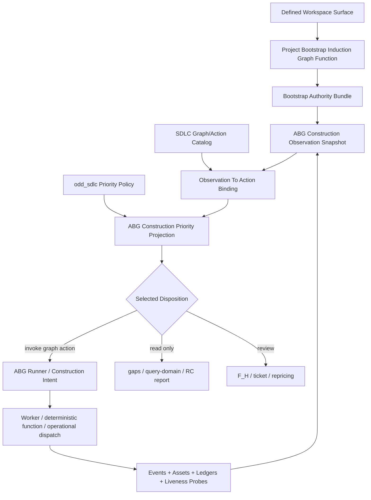

# Design Review Post: test35 Edge Walkthrough And ABG 3.7.1 Alignment

Date: 2026-05-09
Author: Codex
Status: commentary / design review / bug inventory

## Purpose

This post walks the old successful `data_mapper.test35` Python line edge by
edge, compares it to the current TypeScript `odd_sdlc` graph, and translates
the intended behavior into the ABG `3.7.1-rc.1` evaluator/liveness substrate.

This is not a request to copy the Python implementation. It is a review of the
successful traversal semantics we have not yet reproduced:

- bootstrap is induction/orientation over a defined workspace, not full product
  construction;
- graph functions are the constructive authority;
- current workspace state, event log, manifests, ledgers, and runtime assets
  are the observable truth;
- evaluator pressure chooses the next lawful action over a graph/action library;
- incomplete proof creates typed continuation, repair, or escalation pressure;
- transport/liveness failure is not the same as semantic edge failure.

## Executive Findings

1. The current TypeScript graph still uses `bootstrap_release_self_test` as the
   broad default start program. That is not the intended bootstrap edge.
   Test35 had bootstrap *read-model/normalization* behavior and separate leaf
   graph functions for intent/product/goals. It did not have a single correct
   first-edge GTL function for `{defined_workspace} -> {intent, product, goals}`.
   That is the T-134 design gap.

2. The current TypeScript graph is structurally richer than test35, but the
   default runner still behaves like a sequential broad lifecycle chain. ABG
   `3.7.1` gives odd_sdlc a construction evaluator projection and liveness
   observer, but installed runner-level evaluator dispatch is still explicitly
   out of T-129 and belongs to ABG T-128 / odd_sdlc follow-up wiring.

3. Test35's most important success property was not that it ran more edges. It
   was that every edge left evidence behind: event records, F_P manifests,
   fulfillment ledgers, F_P results, continuation records, and proof events.
   Later failure pressure did not erase earlier admitted edge truth.

4. TypeScript now has many analogous carriers, but they remain split across
   operator runs, handoff manifests, postflight, assurance ledgers, gap
   dossiers, product materialization manifests, runtime liveness projections,
   and ABG evaluator reports. The missing alignment is one public construction
   evaluation surface that decides action selection, plus one edge ledger that
   explains whether the selected action actually reduced the asset gap.

5. The hello-world lanes exposed the bug sharply. A request to build one Rust
   hello-world tenant should not enter the broad release self-test graph and
   spend an hour deriving SDLC documentation before materializing `Cargo.toml`.
   The evaluator should bind the observed missing product asset to the highest
   value lawful graph action, or fail closed with a typed "no lawful action"
   defect.

## Source Surfaces Reviewed

Python reference:

- `/Users/jim/src/apps/ai_sdlc_examples/local_projects/data_mapper/data_mapper.test35`
- `.genesis/odd_sdlc/python/code/odd_sdlc/gtl_module.py`
- `.genesis/odd_sdlc/python/code/odd_sdlc/normalization.py`
- `.genesis/odd_sdlc/python/code/odd_sdlc/software_domain_catalog.py`
- `.ai-workspace/context/project_bootstrap.md`
- `.ai-workspace/events/events.jsonl`
- `.ai-workspace/fp_manifests/`
- `.ai-workspace/fp_ledgers/`
- `.ai-workspace/fp_results/`

TypeScript current line:

- `build_tenants/typescript/code/src/graph/catalog.ts`
- `build_tenants/typescript/code/src/graph/module.ts`
- `build_tenants/typescript/code/src/runtime/abiogenesis_substrate.ts`
- `build_tenants/typescript/code/src/projection/query_domain.ts`
- `build_tenants/typescript/code/src/spec_method/entry.ts`
- `build_tenants/typescript/code/src/operator/installed_operator.ts`
- `build_tenants/typescript/code/src/operator/handoff.ts`
- `build_tenants/typescript/code/src/operator/transport.ts`
- `.ai-workspace/tickets/completed/T-129-migrate-typescript-to-abg-3-7-1-rc-1-evaluator-and-liveness-substrate.md`
- `.ai-workspace/tickets/active/T-134-define-bootstrap-sdlc-induction-graph-function.md`
- `.ai-workspace/comments/codex/20260509-t133-rust-vs-data-mapper35-traversal-report.md`

Shared method/template authority:

- `/Users/jim/src/apps/specification_methodology/specification/standards/`
- `/Users/jim/src/apps/specification_methodology/specification/standards/templates/`

## Test35 Graph Shape

The Python `bootstrap_release_self_test` executive materializes 18 vectors:

| # | test35 edge | source | target |
| ---: | --- | --- | --- |
| 0 | `derive_intent_surface` | `input_set` | `intent_surface` |
| 1 | `derive_product_surface` | `input_set`, `intent_surface` | `product_surface` |
| 2 | `derive_goal_surface` | `input_set`, `intent_surface`, `product_surface` | `goal_surface` |
| 3 | `derive_requirement_surface` | `input_set`, `intent_surface`, `product_surface`, `goal_surface` | `requirement_surface` |
| 4 | `derive_feature_decomp_surface` | `requirement_surface` | `feature_decomp_surface` |
| 5 | `derive_uat_testcases_surface` | `requirement_surface` | `uat_testcases_surface` |
| 6 | `derive_design_surface` | `requirement_surface`, `feature_decomp_surface` | `design_surface` |
| 7 | `derive_scenario_surface` | `requirement_surface`, `design_surface` | `scenario_surface` |
| 8 | `derive_implementation_design_surface` | `design_surface`, `scenario_surface` | `implementation_design_surface` |
| 9 | `select_implementation_stack_profile` | `implementation_design_surface` | `implementation_stack_profile` |
| 10 | `derive_implementation_module_surface` | `implementation_design_surface`, `implementation_stack_profile` | `implementation_module_surface` |
| 11 | `derive_code_surface` | `implementation_module_surface`, `implementation_stack_profile` | `code_surface` |
| 12 | `derive_test_design_surface` | `design_surface`, `scenario_surface` | `test_design_surface` |
| 13 | `select_test_stack_profile` | `test_design_surface` | `test_stack_profile` |
| 14 | `derive_test_module_surface` | `test_design_surface`, `test_stack_profile` | `test_module_surface` |
| 15 | `derive_test_run_archive_surface` | `test_module_surface`, `test_stack_profile` | `test_run_archive_surface` |
| 16 | `qualify_testcase_authority` | `uat_testcases_surface`, `scenario_surface` | `testcase_authority_surface` |
| 17 | `prepare_release_surface` | requirements/design/scenario/code/testcase/archive | `release_surface` |

This executive is a release/self-test construction program. It is not the
definition of bootstrap.

Test35 also had normalization behavior that wrote
`.ai-workspace/context/project_bootstrap.md` as a deterministic read model over
imported project authority. That file explicitly says it is not a replacement
for project-owned specification truth. This is the precedent for the missing
TypeScript bootstrap-induction edge.

## Current TypeScript Graph Shape

The TypeScript `BOOTSTRAP_RELEASE_FUNCTION_CATALOG` preserves the early test35
chain and expands the realization/test/release path to 33 constructive edges:

| # | TypeScript edge | status against test35 |
| ---: | --- | --- |
| 0 | `derive_intent_surface` | Same conceptual edge. |
| 1 | `derive_product_surface` | Same conceptual edge. |
| 2 | `derive_goal_surface` | Same conceptual edge. |
| 3 | `derive_requirement_surface` | Same conceptual edge. |
| 4 | `derive_feature_decomp_surface` | Same conceptual edge. |
| 5 | `derive_uat_testcases_surface` | Same conceptual edge. |
| 6 | `derive_design_surface` | Same conceptual edge. |
| 7 | `derive_scenario_surface` | Same conceptual edge. |
| 8 | `derive_implementation_design_surface` | Same conceptual edge. |
| 9 | `select_implementation_stack_profile` | Same conceptual edge. |
| 10 | `derive_implementation_module_surface` | Same conceptual edge. |
| 11 | `derive_aggregate_domain_model_surface` | New stricter component-depth edge. |
| 12 | `derive_implementation_component_topology_surface` | New stricter component-depth edge. |
| 13 | `derive_aggregate_sunny_day_sequence_surface` | New stricter component-depth edge. |
| 14 | `derive_component_realization_schedule_surface` | New stricter component-depth edge. |
| 15 | `derive_component_code_surface` | New component materialization edge. |
| 16 | `qualify_component_realization_surface` | New component qualification edge. |
| 17 | `derive_realization_schedule_surface` | New aggregate realization schedule edge. |
| 18 | `derive_code_surface` | Test35 code edge, now downstream of component proof. |
| 19 | `derive_test_design_surface` | Same conceptual edge. |
| 20 | `select_test_stack_profile` | Same conceptual edge. |
| 21 | `derive_test_module_surface` | Same conceptual edge. |
| 22 | `derive_test_component_topology_surface` | New test component-depth edge. |
| 23 | `derive_component_test_surface` | New component test materialization edge. |
| 24 | `derive_test_schedule_surface` | New governed test schedule edge. |
| 25 | `prepare_test_execution_surface` | Test35 had this as operational continuation, not in the 18-vector executive. |
| 26 | `derive_test_execution_result_surface` | Test35 had this as operational continuation. |
| 27 | `qualify_component_test_execution_surface` | New execution/component qualification edge. |
| 28 | `derive_component_repair_schedule_surface` | New repair schedule edge. |
| 29 | `derive_test_run_archive_surface` | Same conceptual archive edge, now evidence-rich. |
| 30 | `qualify_testcase_authority` | Same conceptual edge. |
| 31 | `derive_release_depth_parity_surface` | New release-depth parity edge. |
| 32 | `prepare_release_surface` | Same conceptual release edge, stricter inputs. |

The TypeScript expansion is not wrong. The bug is using this entire broad chain
as the default meaning of bootstrap for tiny or underdefined workspaces.

## Edge-By-Edge Translation To ABG 3.7.1 Evaluator Semantics

The ABG 3.7.1 model should treat every edge as an available action row, not as
a private CLI loop. The evaluator observes current assets and ledgers, binds
missing/blocked assets to lawful graph actions, applies odd_sdlc priority
policy, and selects the highest-value next action. If no policy override exists,
the default action is the next open graph edge in declared graph order.

| test35 edge | TypeScript equivalent | ABG 3.7.1 evaluator translation | Alignment note |
| --- | --- | --- | --- |
| `derive_intent_surface` | `derive_intent_surface` | Action creates/revises intent from defined workspace inputs. | For raw folders, this should be downstream of a defined/conformed workspace and project bootstrap read model. |
| `derive_product_surface` | `derive_product_surface` | Action creates/revises product definition from intent plus observed assets. | Product must not be inferred from repo name or template lineage. |
| `derive_goal_surface` | `derive_goal_surface` | Action creates current goals from intent/product and operator/work-wave pressure. | Goals are current-wave focus, not full release output. |
| `derive_requirement_surface` | `derive_requirement_surface` | Action derives requirements only after bootstrap truth supports it or evaluator selects it. | Not part of bootstrap closure by default. |
| `derive_feature_decomp_surface` | `derive_feature_decomp_surface` | Action decomposes accepted requirements into feature groupings. | Should not run before requirements are supportable. |
| `derive_uat_testcases_surface` | `derive_uat_testcases_surface` | Action derives operator-visible acceptance/testcase structure from requirements. | Useful after requirement authority exists. |
| `derive_design_surface` | `derive_design_surface` | Action derives design from requirements/features. | Should use shared design method and materialize tenant design surfaces when product requires them. |
| `derive_scenario_surface` | `derive_scenario_surface` | Action derives scenario bundle from requirements/design. | Scenario gaps should bind to this action, not generic same-edge prose. |
| `derive_implementation_design_surface` | `derive_implementation_design_surface` | Action maps design/scenarios into realization strategy. | Missing requirement coverage is repair pressure, not terminal runner failure. |
| `select_implementation_stack_profile` | `select_implementation_stack_profile` | Action selects stack when implementation design supports a target. | For hello-world Rust, this action may be high priority only after product/tenant profile is defined. |
| `derive_implementation_module_surface` | `derive_implementation_module_surface` | Action derives module boundaries and obligation allocation. | Test35 materialized tenant design files here; TS must preserve that product-shaped output expectation where applicable. |
| `derive_code_surface` | split across `derive_component_code_surface`, `qualify_component_realization_surface`, `derive_realization_schedule_surface`, `derive_code_surface` | Evaluator should choose the smallest lawful code-producing action matching the missing product asset. | For simple products, broad component-depth intermediates should be policy-driven, not automatic delay. |
| `derive_test_design_surface` | `derive_test_design_surface` | Action derives test strategy from design/scenarios. | Should not substitute for actual test source materialization. |
| `select_test_stack_profile` | `select_test_stack_profile` | Action selects test stack/profile. | Should be tenant-owned when enough product language/runtime is known. |
| `derive_test_module_surface` | `derive_test_module_surface` plus component test edges | Action derives test module allocation and later component test topology. | Test35 got real Scala tests; TS must keep actual test files in the proof surface. |
| `derive_test_run_archive_surface` | `prepare_test_execution_surface`, `derive_test_execution_result_surface`, qualification, repair schedule, archive | Evaluator should distinguish prepare/execute/admit/archive/repair. | B-085 remains the key repair-route pressure for Scala compile failures. |
| `qualify_testcase_authority` | `qualify_testcase_authority` | Action qualifies UAT/scenario authority as testcase basis. | Good retained edge. |
| `prepare_release_surface` | `derive_release_depth_parity_surface`, `prepare_release_surface` | Action prepares release only after release-depth parity and test archive truth. | Release parity must consume repair schedule truth, not same-edge retry collapse. |

## Missing First Edge: Project Bootstrap Induction

Current problem:

```text
raw/sparse workspace
  -> broad bootstrap_release_self_test
  -> intent
  -> product
  -> goals
  -> requirements
  -> design
  -> code ...
```

Target shape:

```text
raw folder
  -> workspace definition/conformance
  -> project bootstrap induction
  -> evaluator view of next lawful action
```

The missing first-class graph function should consume a defined/conformed
workspace surface, not perform raw discovery itself. Its target should be the
bootstrap authority bundle:

```text
defined_workspace_surface
  -> project_bootstrap_surface
  -> intent_surface when supported
  -> product_surface when supported
  -> goal_surface when supported
  -> build_tenant_profile when sufficiently defined
  -> evaluator projection of next action
```

The exact name should be corrected in T-134. `bootstrap_sdlc` was a placeholder
and is too vague. Better candidates:

- `derive_project_bootstrap_surface`
- `derive_project_foundation_surface`
- `derive_sdlc_induction_surface`

The name should state the target asset, not imply "do the whole SDLC".

## Successful test35 Behavior To Preserve

### 1. Ledger-Centered Edge Closure

Test35 edges were not closed by worker optimism. They closed through published
fulfillment ledgers. Each ledger carried expected obligations, assessments,
missing/extra counts, partial/blocked/unfulfilled counts, and an
`edge_converged` result.

TypeScript should continue moving toward one admitted edge ledger per
constructive action. The current spread of handoff manifest, worker report,
postflight, assurance postflight, gap dossier, and runtime liveness projection
is inspectable but too scattered for action selection.

### 2. Retry/Repair Is Typed Pressure

Test35 opened continuations when proof failed. A retry worker failure did not
turn the original semantic gap into an unrelated terminal state.

ABG 3.7.1 liveness improves process truth, but liveness is not semantic repair.
The evaluator should consume both:

```text
semantic gap truth
+ process/liveness truth
+ current asset state
-> retry same edge, repair target, choose another graph action, request F_H, or block
```

### 3. Product Artifacts Must Stay In The Product Tree

Test35 produced real tenant assets under `build_tenants/scala_spark` plus test
reports. The TypeScript runtime assets are useful, but they are not a
substitute for product materialization when the target is a product.

For hello-world lanes, the minimal proof must be product-shaped:

```text
build_tenants/<tenant>/...
tests prove output
runtime assets explain traversal
```

### 4. Bootstrap Is Read Model / Induction

Test35's `.ai-workspace/context/project_bootstrap.md` is a deterministic read
model over imported authority. It orients the builder. It does not replace
project-owned spec truth and does not imply code/test/release construction.

That is the behavior the new bootstrap edge should reproduce.

## Current Bug Inventory

### B1: Default Bootstrap Target Is Too Broad

Current behavior:

- T132/T133 live lanes invoke `graph_function:bootstrap_release_self_test`.
- The run follows broad lifecycle vectors before product files appear.
- Tiny products pay the overhead of a full release-proof path.

Required fix:

- introduce a first-class induction graph function;
- update live harnesses to target induction/evaluator truth first;
- leave `bootstrap_release_self_test` as a broad self-test/release executive.

### B2: No Single Runner Action-Decision Surface Yet

T-129 correctly closed ABG 3.7.1 substrate consumption, not ABG T-128
runner-level evaluator dispatch.

Current behavior:

- public gaps/query-domain can render ABG construction evaluator truth;
- installed traversal still primarily follows current/sequential edge behavior;
- repair/reentry routing still contains older operator-local decision logic.

Required fix:

- runner-level start must consume an admitted evaluator construction intent or
  explicitly remain a sequential compatibility mode;
- no second path should decide action selection for the same boundary.

### B3: Product Intent Does Not Bind Early Enough To Product Assets

The Rust hello-world lane knew the desired assets:

```text
build_tenants/hello_world_rust/Cargo.toml
build_tenants/hello_world_rust/src/main.rs
```

The broad graph still advanced documentation edges before product code
materialization. The evaluator should have selected a product-asset-producing
action or raised a typed no-action defect.

Required fix:

- convert requested product assets into observation pressure rows;
- bind those rows to lawful graph/action catalog rows;
- rank product asset gaps against generic documentation gaps using visible
  odd_sdlc priority policy.

### B4: Edge Ledger Truth Is Still Split

Current TypeScript evidence is scattered across per-run files. It is readable,
but not yet the same "one edge ledger" shape that made test35 easy to analyze.

Required fix:

- publish one admitted edge traversal ledger per attempted graph action;
- include action selection refs, source/target asset refs, materialized file
  refs, obligation counts, process/liveness refs, semantic gap refs, and
  selected continuation.

### B5: Component-Depth Rigor Can Become Unnecessary Overhead

The TS graph added valuable component-depth edges. For a large product like
data_mapper this is good. For a single-file hello-world product it can be
overhead unless the evaluator/policy chooses a minimal route.

Required fix:

- define priority policy by product scale and target asset;
- default to graph order only when no higher-value asset/action pressure is
  present;
- make steel-thread/minimal routes explicit graph/action rows, not harness
  hacks.

## Proposed GTL/ABG 3.7.1 Architecture



One surface rule:

- `gaps`, `query-domain`, RC reporting, installed start preview, repair-route
  display, and live-lane status all render the same evaluator projection.
- Runtime execution may be deferred until ABG T-128 runner support, but no
  odd_sdlc-local hidden decider should replace it.

Default total-function behavior:

```text
if terminal/review/interruption disposition exists:
  render or block according to typed disposition
else if priority policy selects an eligible action:
  select that action
else if graph has a next open declared edge:
  select the next open edge
else:
  project construction complete or no-lawful-action
```

This preserves the ordinary graph-following behavior without turning the graph
iterator into the only intelligence in the system.

## Edge Policy Recommendations

| Area | Policy |
| --- | --- |
| Bootstrap | Create bootstrap/read-model/authority surfaces only. Do not auto-run requirements/code/release. |
| Requirements | Run when bootstrap/product/goals support requirement authority or user priority selects it. |
| Design | Run after requirement authority exists. Missing design obligations become same-edge repair pressure. |
| Implementation | For large products, use component-depth graph. For tiny products, allow evaluator policy to select minimal product-asset materialization. |
| Tests | Test assets are product proof, not prose. If output requires tests, missing tests bind to test-producing graph actions. |
| Execution | Returned build/test evidence is operational truth. Worker claims do not substitute for command evidence. |
| Repair | Repair schedule rows must become action pressure, not archive inspection or same-edge collapse. |
| Liveness | ABG RuntimeLivenessObserverProjection governs activity/timeout/interruption. It does not decide semantic closure by itself. |

## Immediate Fix Plan

1. Rename/refine T-134 away from `bootstrap_sdlc` toward a target-asset graph
   function name.

2. Implement the induction graph function:

   ```text
   defined_workspace_surface -> project_bootstrap_surface / intent / product / goals
   ```

   Use shared method templates for document shape.

3. Update T132/T133 harnesses so first live proof targets induction plus
   evaluator preview, not `bootstrap_release_self_test`.

4. Add tests:

   - sparse defined workspace creates bootstrap bundle only;
   - imported document workspace creates intent/product/goals where supported;
   - hello-world Rust workspace does not derive requirements/code during
     bootstrap;
   - evaluator preview selects the next lawful action after bootstrap;
   - requested product asset pressure can outrank lexical/current graph order;
   - no eligible action fails closed with typed no-lawful-action pressure.

5. Define the edge traversal ledger shape for TypeScript:

   ```text
   selected_action
   basis/evaluator refs
   source/target asset refs
   materialized files
   obligation ledger counts
   process/liveness refs
   semantic gap refs
   continuation/reentry disposition
   ```

6. Do not reopen T-129 for this unless the ABG substrate contract is wrong.
   T-129 closed the ABG 3.7.1 substrate consumption. The remaining work is
   odd_sdlc alignment plus ABG T-128 runner-level consumption.

## Non-Goals

- Do not recreate Python's exact files or looseness.
- Do not make the CLI or harness a hidden traversal controller.
- Do not embed product-specific data_mapper or hello-world heuristics in core.
- Do not treat liveness heartbeats as product progress.
- Do not call broad release traversal "bootstrap".

## Review Questions

1. Should the missing induction function target be named
   `derive_project_bootstrap_surface`, `derive_project_foundation_surface`, or
   `derive_sdlc_induction_surface`?

2. Should the induction function produce one aggregate bootstrap bundle asset,
   or should it publish a small executive over intent/product/goals while
   stopping before requirements?

3. For minimal products, should odd_sdlc publish a reusable
   `materialize_declared_product_asset` graph action, or should minimal product
   construction still be expressed through existing implementation/component
   edges with priority policy?

4. Where should the one edge traversal ledger live in the TypeScript tree:
   `operator/`, `runtime/`, or a new graph/evaluator projection module?
