# Computational Breakdown: Why Current Gap Ledgers Still Do Not Reproduce test35

Date: 2026-05-09
Author: Codex
Status: commentary / code review / design breakdown

## 2026-05-10 Live Confirmation Update

This section updates the original 2026-05-09 analysis using the clean TypeScript
live runs from 2026-05-10. It should be read as the current implementation
review surface. Older sections below remain useful as design history, but any
line saying TypeScript has no edge ledger, no closure decision, or only local
gap-dossier action strings is stale after T-135/T139/T140/T141.

The current question is narrower and more useful:

```text
Has TypeScript restored the test35 computational loop, or only a controlled
single-target proof that resembles one slice of it?
```

Answer: TypeScript now works for controlled single-tenant live lanes. It has
real edge evidence, ledgers, closure decisions, next-action projections,
liveness observation, and product execution proof. It does not yet fully restore
the `data_mapper.test35` emergent loop because the live harness still supplies
the product target after bootstrap. The evaluator does not yet autonomously turn
closed bootstrap authority into the next declared product materialization
action.

### Live Proofs Run

Commands:

```text
npm run test:t132:hello-world-live
npm run test:t133:rust-live
```

Both passed.

Archives:

```text
build_tenants/typescript/test_env/test_runs/t132_hello_world_single_tenant_bootstrap_sandbox/20260510T031225509Z_pid13389
build_tenants/typescript/test_env/test_runs/t133_rust_hello_world_bootstrap_sandbox/20260510T031739737Z_pid81100
```

Summary:

| Lane | Result | Run summary elapsed | Product worker elapsed | Product proof |
| --- | --- | ---: | ---: | --- |
| T132 single-tenant JavaScript | passed | 150,745 ms | 150,075 ms | `Hello, world!` from `build_tenants/hello_world_javascript/src/hello.js` |
| T133 single-tenant Rust | passed | 142,104 ms | 141,412 ms | `Hello, world!` from `build_tenants/hello_world_rust/src/main.rs` |

Both product edges used:

```text
process://codex?model=gpt-5.5&effort=medium
```

Both product edge archives contain the expected consequence artifacts:

```text
sdlc_worksite_evidence.json
sdlc_edge_fulfillment_ledger.json
sdlc_edge_closure_decision.json
sdlc_next_action_projection.json
sdlc_construction_intent.json
product_materialization_manifest.json
runtime_liveness_observer_projection.json
worker_process_summary.json
```

Both product edge ledgers closed with:

```text
counts.expected = 15
counts.fulfilled = 15
counts.partial = 0
counts.blocked = 0
counts.unfulfilled = 0
counts.missing = 0
counts.extra = 0
admitted = true
targetCertificationPassed = true
fdRecheckPassed = true
edgeConverged = true
closure disposition = close
```

### Edge-By-Edge Walkthrough

Both clean lanes now have the same four-step shape.

| Step | Phase | T132 | T133 | Interpretation |
| ---: | --- | --- | --- | --- |
| -2 | `conform_project` | `Fg_conform_project`, converged | `Fg_conform_project`, converged | Deterministic project conformance/bootstrap of installed workspace state. |
| -1 | `bootstrap_authority` | `Fg_conform_project_authority`, worker invoked, postflight passed, assurance close allowed | same | The authority-conformance edge materializes the project bootstrap surface. |
| 0 | `gaps` | `currentEdge: null` | `currentEdge: null` | Public read model reports no current graph edge after bootstrap. This is the main remaining architecture gap. |
| 0 | `start asset:component_code_surface` | `derive_component_code_surface`, worker invoked, close allowed | same | The harness explicitly requests the product target. The runner invokes F_P, observes product files, folds evidence into the ledger, and closes. |

T132 materialized:

```text
build_tenants/hello_world_javascript/src/hello.js
```

T133 materialized:

```text
build_tenants/hello_world_rust/Cargo.toml
build_tenants/hello_world_rust/src/main.rs
```

The T132 pass is the more important behavioral confirmation. The prior failure
mode was generic-file drift: the worker could create a plausible JavaScript file
such as `index.js` while missing the declared product file. The current pass
depends on the handoff surfacing declared product file targets and instructing
the worker to materialize those exact workspace-relative paths.

Current implementation surface:

```text
build_tenants/typescript/code/src/operator/handoff.ts
  declaredProductFileTargets(...)
  worker prompt lines for declared product file targets
```

This is a useful generic fix for the live calibration lane, but it is not yet
the final carrier shape. The final shape should be a typed
ProductMaterializationContract / target-obligation carrier consumed by the
evaluator and rendered into the prompt. Context-file scanning is a bridge, not
the constitutional source.

### What The Clean Runs Prove

They prove the following current TypeScript claims:

1. The installed product can create a clean sandbox, install `odd_sdlc`, run
   project conformance, run authority conformance, invoke an F_P worker, and
   create executable product files.
2. F_P does not close the edge directly. The framework observes files after F_P
   returns and builds a post-transform report from observed artifacts.
3. Product materialization becomes replay-visible evidence through
   `product_materialization_manifest.json`, `sdlc_worksite_evidence.json`, and
   `sdlc_edge_fulfillment_ledger.json`.
4. The closure decision is now derived from a ledger-backed consequence surface,
   not from the old gap-dossier action strings.
5. The ABG 3.7.1 liveness observer is active in the worker process path:
   `runtimeLivenessLeaseState = active`,
   `runtimeLivenessDispositionAction = continue_waiting`,
   `runtimeLivenessDispositionReason = activity_recent`,
   `timedOut = false`.

This is real progress relative to the original diagnosis.

### What The Clean Runs Do Not Prove

They do not prove full `test35` parity.

The live harness still performs this control step after bootstrap:

```text
start --target asset:component_code_surface
```

That means the test proves product-target execution once explicitly requested.
It does not yet prove the installed runner can derive that request from:

```text
closed project authority
+ target obligation binding
+ requirement transformation set
+ current worksite observation
+ odd_sdlc policy
```

The decisive observation is:

```text
after Fg_conform_project_authority:
  gaps.currentEdge = null
```

If the TypeScript loop had fully restored the Python machine behavior, the next
read-only view would expose declared product materialization pressure and the
runner would select the product action from evaluator truth. Instead, the live
test currently supplies the product target as an external harness instruction.

### Comparison To data_mapper.test35

The installed Python `data_mapper.test35` workspace remains the reference model.
The relevant confirmation surfaces are:

```text
data_mapper.test35/.genesis/genesis/run.py
data_mapper.test35/.genesis/genesis/interpret.py
data_mapper.test35/.genesis/genesis/result_ingest.py
data_mapper.test35/.genesis/genesis/dispatch_runtime.py
data_mapper.test35/.genesis/genesis/fulfillment_ledger.py
data_mapper.test35/.genesis/odd_sdlc/python/code/odd_sdlc/traceability.py
```

The Python line has these properties:

| Property | test35 Python behavior | Current TypeScript state |
| --- | --- | --- |
| Run state | Event-derived run state includes `yielded` as active, not terminal. | Liveness/yield machinery exists, but the clean hello-world lanes only exercise close. |
| F_P closure | `result_ingest.py` builds a published fulfillment ledger and computes `edge_converged = carry_converged and fulfillment_converged and admitted`. | Product edge now has `sdlc_edge_fulfillment_ledger.json` with counts, admission, certification flags, and `edgeConverged: true`. |
| Failure continuation | Python emits `proof_failed`, `graph_call_failed`, and `continuation_opened` with causation refs. | Not exercised by the clean lanes. Needs a non-close live regression. |
| Requirement pressure | Python traceability builds requirement/declared-edge obligation ledgers and distinguishes carry convergence from fulfillment convergence. | Product edge requirements are counted as fulfilled; downstream carried transformation-set pressure is not yet fully proven. |
| Bootstrap-to-product transition | Python can project next graph state from event/ledger truth. | TypeScript still needs the harness to request `asset:component_code_surface` after bootstrap. |
| Target specificity | Python manifests/obligation ledgers bind target evidence. | TypeScript now guides exact target files, but through context scan and prompt rendering rather than final typed product target carrier. |

### Current Architecture Verdict

The current TypeScript implementation is working as a controlled single-tenant
calibration lane. It is not just producing logs; it is producing useful
deterministic observability:

```text
F_P transform
-> observed worksite evidence
-> product materialization manifest
-> edge fulfillment ledger
-> closure decision
-> next-action projection
-> execution proof
```

The architecture is not yet complete because the loop is still externally
steered at the point that matters most:

```text
bootstrap authority closed
-> harness asks for product asset
-> product edge closes
```

The target architecture is:

```text
bootstrap authority closed
-> evaluate_next sees declared product pressure
-> admitted construction intent selects materialization action
-> product edge closes
```

That distinction is the remaining functional gap.

### Immediate Gap Analysis

**Gap 1: post-bootstrap product pressure is not visible enough to drive the next action.**

After `Fg_conform_project_authority`, public `gaps` reports `currentEdge: null`.
The evaluator should be able to expose the declared product materialization
pressure as read-only truth and the runner should be able to consume it as
executable intent when running `start`.

**Gap 2: declared file targets are prompt-rendered, not carrier-owned.**

The current handoff scans `.ai-workspace/context/*.json` for `expectedFiles`
under the selected output root. That is generic enough to fix the immediate
hello-world miss, but the durable method shape should be:

```text
SdlcTargetObligationBinding / ProductMaterializationContract
-> exact expected files and evidence roles
-> prompt rendering
-> post-worker observation
-> ledger closure
```

**Gap 3: requirement rows are not yet a first-class downstream transformation set.**

The model we want is:

```text
A -> B(requirements, design, topology, schedules)
B.workspace -> traverse.F_P -> C(product files)
```

Some B assets, especially requirements, are not merely documents to close for
their own edge. They are the transformation set for C. TypeScript has started
to carry requirement obligation ids into the product prompt, but the clean live
runs do not yet prove the full typed carry-forward rule:

```text
edge-local fulfillment can close
while downstream product pressure remains visible and actionable
```

**Gap 4: non-close behavior is not proven in the live lane.**

The clean runs only prove `close`. They do not prove `yield`, `retry`, `repair`,
`re-enter`, `reprice`, or `block` from live worker evidence. Python `test35`
made continuation and yield part of the machine model; TypeScript needs live or
live-equivalent regressions for those dispositions.

**Gap 5: multi-tenant fanout is a separate capability and should stay out of this closure path.**

The five-hello-world lane exposed fanout/control problems. That should remain a
backlog feature. Single-tenant product materialization is the correct
calibration lane for restoring the core loop.

### Next Decision

There are two lawful next moves:

1. Further fix `odd_sdlc` so bootstrap closure autonomously exposes and selects
   the declared product materialization action.
2. Run internal data-mapper live tests only after that loop is tighter, because
   data-mapper will otherwise test a broad product surface while the simpler
   bootstrap-to-product transition still depends on harness steering.

The recommended next implementation target is:

```text
after Fg_conform_project_authority closes,
gaps must render declared product pressure,
start must select the product materialization action from evaluator truth
without the harness passing --target asset:component_code_surface.
```

That is the cleanest proof that the TypeScript line has restored the functional
spine from `test35`, rather than only proving a manually steered product edge.

## Claim

The current TypeScript gap analysis, assurance ledgers, product materialization
checks, ABG construction evaluator projection, and runtime liveness observer
are real progress. They still do not reproduce the successful `test35` Python
behavior because they do not yet form one closed computational loop:

```text
observe current workspace state
-> bind gap to exact target asset obligations
-> choose a lawful graph action
-> invoke that action
-> admit worker/process/product evidence
-> publish one edge ledger
-> project close/yield/retry/repair/re-enter/reprice/block
-> select next action only when the disposition calls for one
```

TypeScript has most of those parts, but not as one total function. The action
decision, closure ledger, product asset pressure, repair routing, and liveness
truth are still split across separate read models and operator code paths.

## Functional Spine At Module Level

The intended computation is one replayable function with explicit effect shells:

```text
Runtime events
+ current worksite snapshot
+ execution basis
+ SDLC domain policy
-> observation
-> target obligation binding
-> selected lawful graph action
-> invocation frame / worker handoff
-> admitted process + product evidence
-> SdlcEdgeFulfillmentLedger
-> SdlcEdgeClosureDecision
-> next evaluator input
```

The file system is not the authority by itself. It is an observed worksite.
Events, manifests, worker outputs, product files, process logs, and postflight
evidence become authority only after the owning admission/projection surface has
turned them into typed truth.

### Worksite Definition

For one installed traversal, the worksite is the current target workspace plus
the active edge archive:

| Worksite region | Current path / module | Current role |
| --- | --- | --- |
| Runtime event log | `.ai-workspace/events/events.jsonl`, via `operator/event_store.ts` | ABG runtime facts read by `gaps` and `start`; appended after engine iteration. |
| Operator run archive | `.ai-workspace/runtime/odd_sdlc/operator-runs/<runId>/`, via `operator/handoff.ts` | Manifest, prompt, invocation package, worker report, postflight, gap dossier, process command, and liveness artifacts. |
| Transform asset root | `.ai-workspace/runtime/odd_sdlc/assets/<runId>/`, via `deriveWorkerHandoffManifest()` | Edge output artifact location, usually `<targetAssetType>.md`. |
| Product tenant root | `build_tenants/<activeTenant>` or configured `selectedOutputRoot` | Downstream product files such as source, tests, build manifests, and execution fixtures. |
| Project conformance/profile | conformed project profile and `project_constraints.yml` inputs | Supplies active tenant, selected output root, declared modules, build/test contracts, and runtime layout. |

The worksite is assessed in two different moments:

1. Pre-invocation observation: "what is currently true and missing?"
2. Post-invocation assessment: "what changed, what evidence was admitted, and
   did the exact target obligations close?"

The current TypeScript line has both moments, but they do not yet join into one
closure/action surface.

### Seven-Step Breakdown

| Step | Intended one-surface role | Current TypeScript modules | Current reads | Current writes | Current gap |
| --- | --- | --- | --- | --- | --- |
| 1. Observe current workspace state | Build one observation over runtime truth plus worksite truth. | `spec_method/entry.ts`, `operator/event_store.ts`, `projection/query_domain.ts`, `runtime/abiogenesis_substrate.ts` | Reads `.ai-workspace/events/events.jsonl`; derives ABG runtime aggregate with `deriveRuntimeAggregateProjection`; `projectSdlcGapsFromReplay()` projects current edge and closed vectors. | None for `gaps`; `start` later appends events. | Public gaps observes event replay well, but product-file/worksite asset absence is not yet a first-class input to action selection. |
| 2. Bind gap to exact target asset obligations | Convert "gap" into obligations over exact target assets, required roles, evidence refs, and allowed write roots. | `operator/handoff.ts`, `operator/carriers.ts`, T-109 target ledger design | `deriveWorkerHandoffManifest()` reads graph function, edge, target asset type, conformed project, retry context, and project constraints; `productMaterializationContract()` derives tenant root, selected output root, required roles, execution shards. | Writes manifest/package files under operator run archive through `writeHandoffFiles()`. | Binding exists for the selected edge, but not yet as the pre-action evaluator's target-obligation truth. Missing `Cargo.toml` / `src/main.rs` can remain product pressure outside selected action binding. |
| 3. Choose a lawful graph action | Use ABG construction evaluator ranking over published graph/action rows and SDLC policy. Default is follow current graph when no stronger admitted policy exists. | `runtime/abiogenesis_substrate.ts`, `projection/query_domain.ts` | Reads execution basis, replay events, candidate vectors, priority scheme. | For `gaps`, none. It returns `SdlcGapDossier`. | `deriveSdlcGapDossier()` is explicitly read-only: `choosesNextTraversal: false`. The runner still does not consume `selectedPriorityRow` as execution authority. |
| 4. Invoke that action | Admit selected action as construction intent, enter ABG graph-call/frame authority, and invoke one bounded F_P worker/plugin. | `start/public_start.ts`, `spec_method/entry.ts`, `operator/installed_operator.ts`, ABG `runEngineIterateAsync` | Reads public start request, query-domain target resolution, execution contract, replay events, worker attachment, ABG plugin input. | Emits runtime events through ABG event sink, writes process/worker archive files, writes worker prompt/package artifacts. | Invocation still starts from public start / current transition, not from the construction evaluator's selected priority row. |
| 5. Admit worker/process/product evidence | Admit F_P transform output, process/liveness observations, materialized files, execution evidence, and obligation observations. | `operator/transport.ts`, `operator/handoff.ts`, ABG actor/liveness substrate | Reads worker output artifact, process command/logs, product tenant root before/after snapshots, execution evidence markers. | Writes worker result report, postflight JSON, F_P transform/evaluate carriers, materialization read models. | This layer is close to the desired shape: F_P does not decide closure or write ledgers. The framework observes files and builds typed evidence after F_P returns. |
| 6. Publish one edge ledger | Publish the admitted closure carrier for one edge attempt/version. It must expose obligation counts, carry convergence, fulfillment convergence, admission, target certification, and F_D recheck. | T-109 design; no current `operator/traversal_ledger.ts` in this branch | Should read manifest, worker result report, postflight, assurance satisfaction, liveness projection, materialization evidence, replay refs. | Should write one `SdlcEdgeFulfillmentLedger` plus associated `SdlcEdgeClosureDecision` / project construction row. | This is the missing parity surface. Current code has postflight, assurance, gap dossier, runtime events, and installed summary, but not one admitted ledger/decision/evaluator surface as the closure and next-action authority. |
| 7. Project close / yield / retry / repair / re-enter / reprice / block / next action | Derive the closure disposition from the admitted ledger, then let evaluator policy select a next graph action only when the disposition calls for one. | Target: T-109 plus ABG evaluator/continuation. Current: `operator/installed_operator.ts`, `constructPostflightGapDossier()` | Current code reads gap dossier actions, emitted events, ABG transition, assurance gate, and postflight state. | Current code writes summary outcome and appends runtime events; repair path may emit graph-span foldback events. | `installed_operator.ts` still maps local booleans to `retry_same_edge_with_gap_dossier`, `escalate_to_fp_with_gap_dossier`, `plan_repair_reentry_with_gap_dossier`, or `inspect_worker_archive`. That is the duplicate action-decision surface and has no lawful yield branch. |

### Current TS Data Flow

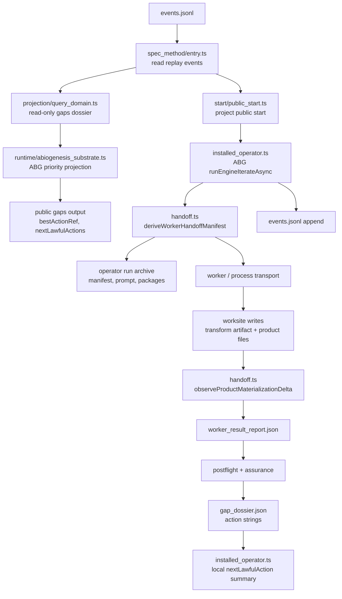

That flow has two useful but separate truth paths:

1. `gaps -> ABG construction evaluator -> read-only next action preview`
2. `start -> worker/postflight/assurance -> gap dossier strings -> local summary`

The target is one path:

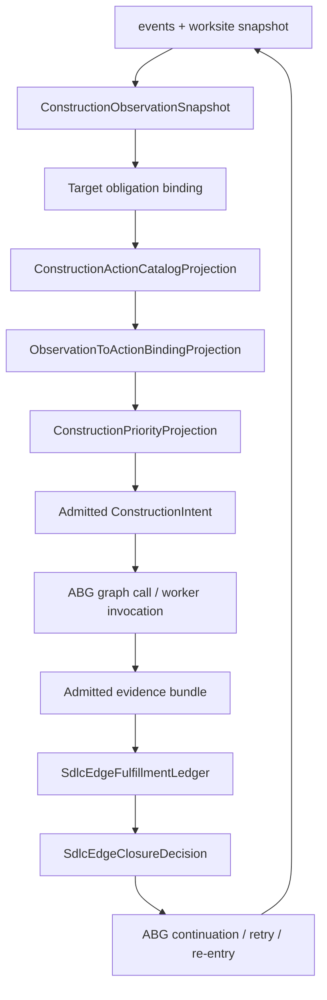

### Where Worksite Assessment Lives Today

Worksite assessment is mostly in `operator/handoff.ts`.

Pre-worker, `deriveWorkerHandoffManifest()` defines the writable and observable
parts of the worksite:

```text
workspaceRoot
archiveRoot
outputRoot
tenantRoot
selectedOutputRoot
targetAssetType
requiredRoles
allowedWriteRoots
executionShards
```

The product materialization contract is derived from target asset type and the
conformed project. When `requiredRoles.length > 0`, the worker is allowed to
write under:

```text
outputRoot
archiveRoot
tenantRoot
```

Post-worker, the framework assesses the worksite through:

```text
snapshotProductMaterializationRoot(before)
worker exits
snapshotProductMaterializationRoot(after)
observeProductMaterializationDelta(before, after)
buildPostTransformWorkerResultReport()
evaluateMaterializedProductFiles()
postflight / assurance
```

This is the correct direction: F_P performs a bounded transform; the framework
observes and evaluates. The defect is that the resulting assessment is not
folded into a single admitted edge ledger that becomes the only source of
closure and next-action truth.

### What Must Become The Single Surface

T-109 should own the reconciliation. It already names the right carrier family:

```text
SdlcEdgeAttemptRecord
SdlcEdgeFulfillmentLedger
SdlcEdgeFulfillmentObligationRow
SdlcEdgeClosureDecision
SdlcRequirementResolutionProjection
```

The ledger should not be a new `sdlc_edge_traversal_ledger` beside T-109. The
missing implementation is:

```text
manifest
+ worker_result_report
+ postflight_result
+ assurance_satisfaction
+ materialized_product_files
+ runtime_liveness_projection
+ replay/event refs
-> SdlcEdgeFulfillmentLedger
-> SdlcEdgeClosureDecision
```

The ledger must carry the inner fields, not only `edgeConverged`:

```text
expected_obligation_count
assessment_count
fulfilled_count
partial_count
blocked_count
unfulfilled_count
missing_count
extra_count
carry_converged
fulfillment_converged
admitted
target_certification_passed
fd_recheck_passed
edge_converged
```

`SdlcEdgeFulfillmentLedger` should record evidence and convergence. It should
not become a hidden action selector. The split should be:

```text
SdlcEdgeFulfillmentLedger
  -> evidence, counts, materialization, liveness, admission, convergence

SdlcEdgeClosureDecision
  -> close | yield | retry | repair | re-enter | reprice | block

ConstructionPriorityProjection / ConstructionIntent
  -> next lawful graph action selection from closure decision + current observed truth
```

`yield` is the pressure-release disposition. It means the edge has not closed,
but the current attempt remains lawful/open or has admitted progress that should
return control without being reclassified as failure. It prevents long-running,
externally waiting, or partially productive work from collapsing into false
retry, false block, or hidden CLI loop state.

Yield examples:

```text
process_active_under_liveness_observer
budget_exhausted_with_admitted_progress
awaiting_external_execution_evidence
awaiting_bounded_fh_input
partial_product_evidence_admitted_current_edge_should_resume
operator_requested_bounded_stop
```

Yield must be replay-visible. It should carry:

```text
yield_reason
yield_kind
resume_basis_ref
resume_policy_ref
current_edge_ref
admitted_progress_refs
liveness_projection_ref
```

`awaiting_bounded_fh_input` is yield only when the same edge remains lawful and
is waiting for bounded operator input. If the missing input means product,
requirement, design, or constitutional authority is absent, the disposition is
`reprice` or `block`, not `yield`.

This is parity with the Python discovery line, not a new behavior. In
`data_mapper.test35`, `yielded` is an active run state, `run_yielded` is a
runtime event, and `MachineAdvanceResult` carries `yielded` independently from
`progressed`. The TypeScript reason vocabulary can be stricter or extended, but
it must preserve that core property: yield is lawful iteration, not terminal
failure and not local waiting state.

Then `installed_operator.ts` should consume the returned decision/evaluator
truth rather than computing:

```text
retryVisibleGap -> retry_same_edge_with_gap_dossier
fpEscalationVisibleGap -> escalate_to_fp_with_gap_dossier
repairVisibleGap -> plan_repair_reentry_with_gap_dossier
else inspect_worker_archive
```

### Correctness Questions For The Next Implementation

These are the checks that decide whether the next step is right:

1. Does every action decision read from the same evaluator/ledger surface?
2. Does default behavior follow the current graph edge only when no higher
   priority admitted policy/action applies?
3. Does the evaluator see exact target asset obligations before selecting an
   action?
4. Does the worksite assessment happen after F_P returns, under framework
   admission, rather than from worker self-closure?
5. Does the edge ledger expose the full convergence vector, not just a boolean?
6. Does repair/retry/re-entry derive from `SdlcEdgeClosureDecision`, not from
   gap-dossier string folding?
7. Does yield exist as a replay-visible pressure release instead of being
   flattened into retry, block, or local waiting state?
8. Does public `gaps` remain read-only while rendering the same evaluator truth
   the runner will consume?

## High-Level Difference

### test35 Python

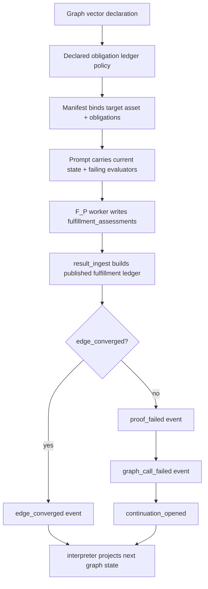

Core property:

```text
edge closure = function(published fulfillment ledger)
next pressure = function(events + ledger + current workspace)
```

The worker does not close the edge. The prompt does not close the edge. The CLI
does not close the edge. The published ledger is the closure authority.

### Current TypeScript

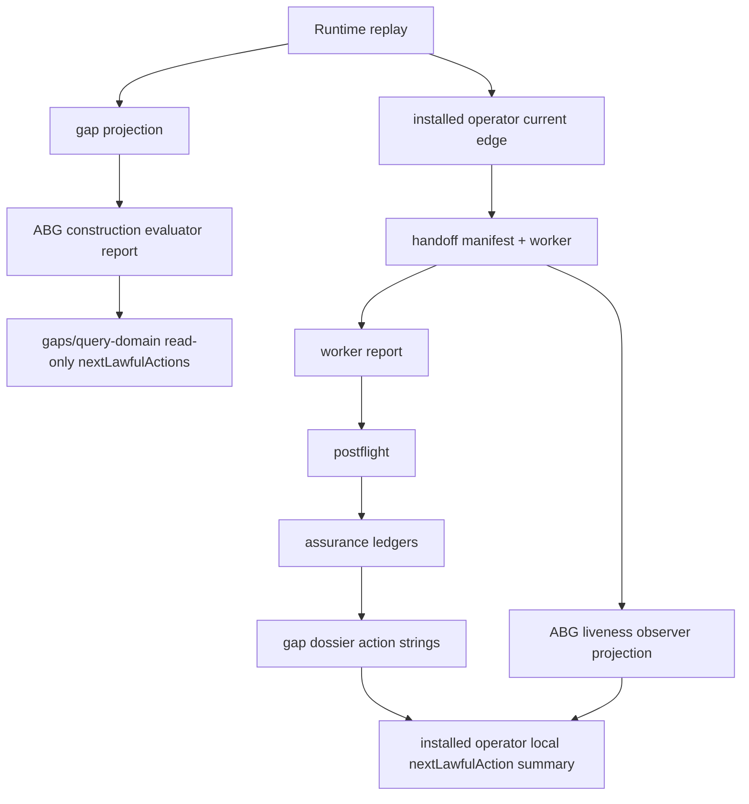

Core problem:

```text
public evaluator projection != runner action authority
gap dossier action strings != ABG construction intent
assurance ledger != one edge closure ledger
product asset pressure != evaluator action binding
```

This is why the new ledgers can be correct locally and still fail to reproduce
test35's self-repair behavior.

## ABG vs SDLC Ownership

The evaluator is not "just an ABG feature" and it is not "just odd_sdlc
domain code." It is a joint computational unit with a hard authority split.

The mistake is to ask:

```text
Does ABG own evaluation, or does odd_sdlc own evaluation?
```

The better question is:

```text
Which parts of the evaluator are generic runtime law, and which parts are
domain meaning?
```

### Ownership Table

| Evaluator part | Lawful owner | Reason |
| --- | --- | --- |
| Runtime event admission/replay | ABG | It is substrate truth. Product code must not mutate or reinterpret runtime history. |
| Actor/process/liveness observation | ABG | ABG owns actor invocation, process supervision, and liveness evidence. |
| Graph-call lifecycle | ABG | Traversal frames, graph calls, continuations, retry, and re-entry are runtime authority. |
| Generic observation carrier shape | ABG | The substrate needs a common shape for "current runtime truth + linked assets + pressure rows." |
| Generic action binding/ranking kernel | ABG | Binding pressures to action rows and producing an admitted intent is traversal-control law. |
| Construction intent admission | ABG | The selected action must become replayable runtime truth before execution. |
| Generic closure fold over runtime truth | ABG, with product inputs | The runtime unit closes through ABG, but product/domain evaluators contribute reasons and policy. |
| Domain asset vocabulary | odd_sdlc | `intent_surface`, `component_code_surface`, `release_depth_parity_surface`, etc. are SDLC meaning. |
| Graph function catalog | odd_sdlc through GTL | The product publishes its lawful graph functions and target assets. |
| Gap interpretation | odd_sdlc | "Missing Rust `Cargo.toml`" or "component repair row open" is domain evidence. |
| Priority policy | odd_sdlc | The product decides whether steel-thread, release blocker, repair, or bootstrap induction is higher value. |
| Worker prompt/handoff content | odd_sdlc as product adapter | The product knows what evidence a worker must emit for an SDLC edge. |
| Public gaps wording/reporting | odd_sdlc | Reports are product query projections over admitted evaluator truth. |

So the evaluator computational unit should be modeled as:

```text
EvaluationUnit<SDLCDomain>
  = ABG runtime/replay/admission kernel
  + GTL-published graph/action catalog
  + odd_sdlc observation and gap semantics
  + odd_sdlc priority/policy overlays
  + ABG-selected construction intent or terminal disposition
```

That is not "ABG replaces odd_sdlc." It is "odd_sdlc contributes domain
meaning to an ABG-owned traversal/evaluation kernel."

### What Belongs In ABG

ABG should provide the reusable evaluation substrate:

```text
RuntimeTruth
  -> ObservationSnapshot
  -> ObservationPressureRows
  -> ActionCatalogProjection
  -> ObservationToActionBindingProjection
  -> PriorityProjection
  -> ConstructionIntent | TerminalDisposition
  -> Runtime event / continuation / re-entry
```

ABG should not know what a Rust hello-world tenant means, what release-depth
parity requires, or whether `derive_component_test_surface` is more urgent than
`derive_requirement_surface` for odd_sdlc. It should know how to admit, replay,
rank, select, invoke, and record the evaluator decision.

### What Belongs In odd_sdlc

odd_sdlc should provide the domain plugin pieces:

```text
SDLC workspace/assets -> SDLC observation rows
SDLC graph functions -> action catalog rows
SDLC gap reasons -> pressure rows
SDLC policy -> priority rules
SDLC handoff contract -> worker/evidence expectations
SDLC postflight/assurance -> domain gap rows
```

odd_sdlc should not own a hidden runner loop that decides next traversal,
retry, or re-entry after publish boundaries. It can explain the SDLC meaning of
the gap; it should not become a second runtime authority.

### The Core Evaluator Unit

The evaluator is a first-class ODD computational unit:

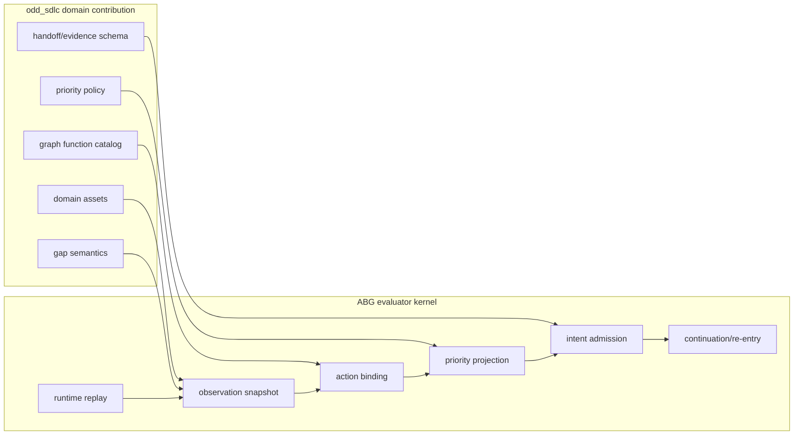

This is why it feels wrong to say "evaluation is an ABG enhancement." The
generic evaluator kernel belongs in ABG because ABG owns traversal authority,
but the evaluator is one of the core elements of the ODD product model. Every
ODD product should be able to provide domain observation, action, and policy
plugins into the same generic evaluator shape.

## Is Design Module Method Causing A Problem?

Short answer: not directly. The problem is an over-local interpretation of
Design Module Method.

`DESIGN_MODULE_METHOD.md` says it does not replace graph-native law from
`ODD_METHOD.md`. It governs realization modules after the project has decided
what it is building. It explicitly says that, in an ODD product, DMM does not
authorize replacing a graph function, edge traversal, or GTL module with
deterministic implementation modules. The load-bearing clauses are:

- `DESIGN_MODULE_METHOD.md` section 1: DMM does not replace graph-native law and
  does not authorize replacing graph functions, edge traversal, or GTL modules.
- `DESIGN_MODULE_METHOD.md` section 3: semantic steps should read as transforms
  over admitted truth, with effects explicit and pushed to the edge.
- `DESIGN_MODULE_METHOD.md` section 3A: DMM must not hide continuation,
  re-entry, target movement, or "what work is next" inside deterministic
  controllers.
- `ODD_METHOD.md` sections 11.5A/11.5B: ABG owns continuation, re-entry,
  graph-call lifecycle, step selection, retry/correction, event replay, and
  closure folds; the product supplies domain meaning and policy inputs.

The useful DMM rule is:

```text
semantic steps should read as transforms over admitted truth;
effects should be explicit and pushed to the edge
```

That supports the evaluator model. It says the evaluator should be an explicit
carrier/transform, not an emergent behavior hidden in `installed_operator.ts`,
`handoff.ts`, `query_domain.ts`, and harness code.

The harmful interpretation would be:

```text
Split the evaluator into many local modules and let each module own its slice of
the decision.
```

That creates exactly the failure we are seeing:

```text
query projection owns ranking preview
operator owns retry summary
handoff owns gap action strings
assurance owns local reentry mapping
materialization owns product-file checks
liveness owns timeout disposition
```

Each module is reasonable in isolation, but the system loses the single
computational unit that test35 effectively had through its published ledger and
event projection.

The correct DMM application is:

```text
one evaluator boundary
  -> carrier module for evaluator inputs/outputs
  -> semantic kernel for observation/action binding/ranking
  -> effect shell for invoking selected action and publishing events
  -> projection module for public gaps/report views
```

Not:

```text
many modules each infer a small piece of "what happens next"
```

### DMM Role In The Fix

Design Module Method should force clearer boundaries:

| Module role | Correct evaluator use |
| --- | --- |
| Carrier module | Defines SDLC observation rows, action rows, priority policy, edge ledger, construction intent. |
| Semantic kernel | Computes binding, ranking, closure, and next disposition from admitted carriers. |
| Effect shell | Invokes worker/deterministic/operational action and publishes events/assets. |
| Projection module | Renders gaps, status, RC report, and live report from admitted evaluator truth. |
| Binding adapter | Maps odd_sdlc domain surfaces into ABG evaluator carriers without inventing law. |

This means DMM is not blocking the design. It is telling us why the current
split is too diffuse.

## ABG Enhancement vs odd_sdlc Work

The current paper should separate the work into three buckets.

### A. ABG Enhancement

These belong in ABG because they are reusable traversal/runtime law:

1. Admit construction intent selected from an evaluator projection.
2. Make the runner consume admitted construction intent.
3. Publish generic evaluation episode events:
   `evaluation_observed`, `action_bound`, `priority_projected`,
   `construction_intent_admitted`, `construction_action_invoked`,
   `construction_delta_observed`, `continuation_selected`.
4. Own continuation/re-entry after the action publishes.
5. Fold liveness, interruption, and process activity into runtime disposition
   without letting timeout become semantic closure.
6. Provide the generic edge/evaluation ledger envelope if it is intended to be
   substrate-wide.

ABG should not encode odd_sdlc-specific meanings like `release_depth_parity` or
`component_repair_schedule_row`.

### B. odd_sdlc Work

These belong in odd_sdlc because they are domain-specific:

1. Define the missing bootstrap induction graph function.
2. Publish SDLC action rows for:
   - continue current graph edge;
   - derive project bootstrap/foundation;
   - derive requirements;
   - materialize declared product asset;
   - repair declared product asset;
   - component repair reentry;
   - clarify/reprice when authority is insufficient.
3. Convert SDLC gaps into observation pressure rows:
   - missing project identity;
   - unsupported intent/product/goals;
   - missing declared product files;
   - incomplete requirement fulfillment;
   - open component repair rows;
   - release-depth blocker;
   - missing build/test execution evidence.
4. Define SDLC priority schemes:
   - default follow graph;
   - bootstrap induction;
   - steel-thread;
   - product asset first;
   - repair first;
   - RC blocker first.
5. Define SDLC edge ledger extension rows, if the generic ABG ledger envelope is
   too abstract for domain proof.
6. Render gaps/query-domain/RC report/live report from the same evaluator
   projection.

### C. Shared Method Clarification

This may need a shared-method update, but only after the design is clear.

Candidate clarification:

```text
In ODD products, evaluation is a first-class computational unit. ABG owns the
runtime/admission/continuation kernel. The product owns domain observation,
action catalog meaning, policy overlays, and domain proof interpretation.
Design Module Method governs realization modules inside that evaluator boundary;
it must not fragment evaluator authority into separate module-local decisions.
```

That would prevent future agents from reading "ABG owns traversal" as "ABG
owns all domain evaluation meaning", or reading "product owns gap
interpretation" as "product may implement its own runner."

## Revised Target Boundary

The target should be represented as a joint boundary, not as an ABG-only or
odd_sdlc-only module:

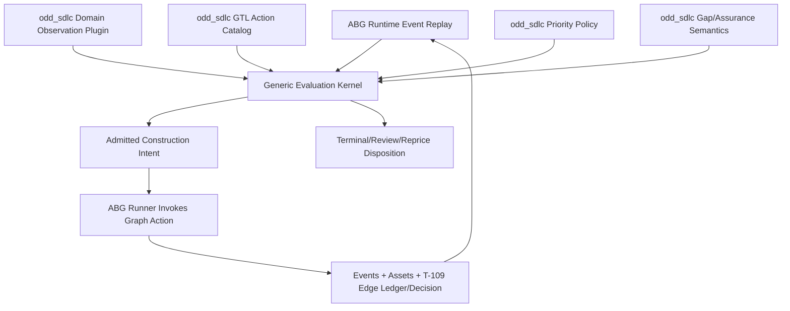

The computational unit is the evaluator boundary. ABG owns the kernel and
runtime authority. odd_sdlc owns domain meaning and policy inputs. DMM owns the
realization structure inside each side of that boundary.

## F_P Write Boundary And Directed Emergence

This paper's earlier test35 diagram says "F_P worker writes
`fulfillment_assessments`." That is descriptively true for the old Python line,
but it should not be confused with the immediate parity requirement.

Parity with `test35` requires the runner to consume one evaluator/ledger truth.
It does not require scratch/patch publication. Scratch/patch is a forward
hardening boundary: valuable, but not the first closure condition for
T-133/T-134/T-109 unless explicitly admitted into that wave.

The target rule should be stronger:

```text
F_P may discover, reason, draft, patch, and propose.
F_D/ABG-owned handoff/admission publishes durable files, ledgers, events, and
closure truth.
```

The distinction matters because we intentionally use coder agents as F_P. The
point of a coder agent is not to fill one small schema field. It is to explore a
large workspace, form a hypothesis, inspect surprising evidence, and propose a
bounded constructive change. The framework should constrain authority, not
strangle discovery.

### Current TypeScript Boundary

Current TypeScript is partly aligned and partly not.

Aligned:

- the prompt says the worker must not evaluate closure, assess obligations,
  list materialized files, write ledgers, or decide whether the edge closes;
- the framework writes the worker result report after observing the transform;
- post-transform code derives materialized files and obligation assessments
  from observed artifacts.

Not aligned enough:

- the Codex worker is launched with `--sandbox workspace-write` in the
  canonical workspace;
- the prompt still says "Write non-empty downstream product files under the
  tenant root";
- the prompt says "Write only the requested transform artifact and product
  files unless the manifest says otherwise";
- the framework observes changed files after the fact.

Computationally, that means:

```text
F_P edits canonical workspace
-> F_D observes diff/report
-> F_D may reject
```

But the write already happened. That is not the cleanest lawful boundary if we
want F_D handoff/admission to own durable writes.

### Better Boundary

The better target is:

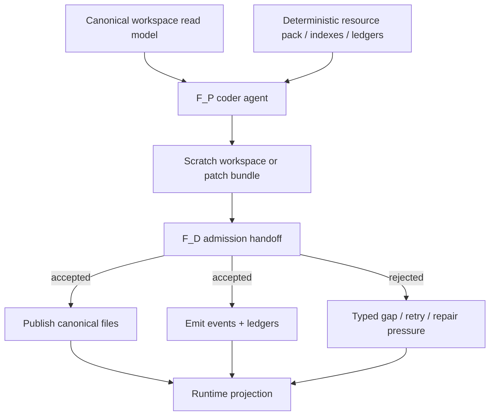

Under this model, F_P can still use normal coder-agent behavior, but its write
authority is scoped to one of:

1. an isolated scratch workspace;
2. a patch bundle;
3. a transform artifact that contains proposed file operations;
4. a temporary branch/worktree that F_D later promotes or discards.

The canonical workspace changes only after deterministic admission.

### Correct Constraint Level

The framework should constrain the following:

- target asset and graph action;
- allowed canonical read roots;
- allowed proposal/write roots;
- output contract for proposal/admission;
- deterministic evidence required for publication;
- forbidden authority claims: closure, event emission, ledger mutation,
  runtime truth, and re-entry decision.

The framework should not over-constrain:

- the search path the coder agent uses;
- the order in which it reads files;
- the internal implementation strategy;
- the exact module decomposition before discovery;
- the exact source edits before the agent has inspected the workspace;
- the shape of explanatory reasoning beyond the minimum evidence needed for
  F_D admission.

The useful F_P input is a deterministic resource environment, not a cage:

```text
goal / selected action / target asset
current asset refs
relevant ledgers
known gaps
artifact indexes
resource map
allowed read roots
allowed proposal roots
admission criteria
budget / bounded exit rule
```

### Directed Emergence Model

The desired loop is not:

```text
framework pre-decides exact output
-> F_P fills template
-> F_D checks template
```

That is too prescriptive and will fail on large workspaces.

The desired loop is:

```text
framework selects the lawful outcome
-> F_P explores a deterministic resource set
-> F_P proposes a bounded construction
-> F_D admits/rejects/publishes deterministically
-> evaluator observes whether the proposed construction reduced the gap
```

This gives directed emergence:

- "directed" because the target asset, graph action, authority refs, and
  admission criteria are fixed;
- "emergent" because the coder agent can discover the implementation path from
  workspace evidence that is too large to fit into the prompt.

### Revised F_P / F_D Contract

F_P output should be a proposal, not durable truth:

```text
fp_transform_proposal
  proposal_id
  selected_action_ref
  target_asset_refs
  files_to_create
  files_to_modify
  files_to_delete
  patch_refs or scratch_refs
  evidence_refs_read
  discovery_notes
  unresolved_questions
  self_reported_risks
```

F_D admission should own durable transition:

```text
fd_admission_result
  proposal_id
  syntactic_validity
  path_policy_result
  materialization_result
  deterministic test/proof result
  accepted_file_changes
  rejected_file_changes
  published_asset_refs
  emitted_event_refs
  edge_fulfillment_ledger_ref
  edge_closure_decision_ref
  next_pressure_refs
```

ABG/runtime then owns replay and continuation:

```text
admitted publication event
-> SdlcEdgeFulfillmentLedger
-> SdlcEdgeClosureDecision
-> evaluator projection
-> next construction intent or terminal disposition
```

### Review Finding

The current design is too prescriptive where it tells F_P how to satisfy the
edge, and not strict enough where it lets F_P write the canonical workspace.

The correction is not "less structure." It is better-placed structure:

- strong deterministic boundary around publication;
- strong graph/evaluator target selection;
- strong resource/index/proof surfaces;
- weak assumptions about the coder agent's internal discovery path.

That is the level of constraint needed for directed emergence.

## Applied To T133 Rust Hello World

The T133 lane is the concrete example of why the revised boundary matters.

### What Happened Before

The fixture clearly declares the desired product:

```text
selected output root: build_tenants/hello_world_rust
required files:
  build_tenants/hello_world_rust/Cargo.toml
  build_tenants/hello_world_rust/src/main.rs
expected output:
  Hello, world!
declared graph function:
  build_hello_world_rust_minimal
```

But the fixture command and live harness still invoke:

```text
graph_function:bootstrap_release_self_test
```

So the actual computation is:

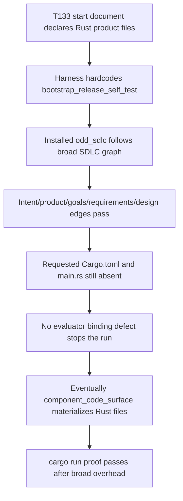

The run eventually worked because F_P was capable enough to create the files
when the graph finally reached a code-producing edge. It failed as a
minimum-overhead proof because the selected graph action was wrong and non-code
edge progress was allowed to count while the declared product files were still
missing.

The old loop's core bug:

```text
desired product asset missing
but current graph edge is broad documentation
and product file absence is not action-selection pressure
therefore broad documentation progress masks product-gap non-progress
```

### Revised Computation

The revised design should turn the T133 contract into evaluator input before
any broad release graph can run.

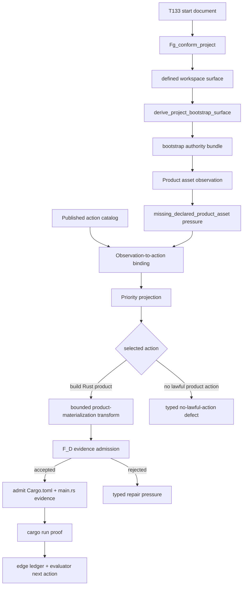

This changes the failure mode.

Old behavior:

```text
wrong graph target -> broad traversal -> product files eventually appear late
```

New behavior:

```text
missing product asset -> evaluator selects product-building action
or fails closed before broad traversal
```

### Concrete T133 Action Rows

T133 should project these action rows after bootstrap/conformance:

| Action | Target outcome | Eligible when | Effect |
| --- | --- | --- | --- |
| `derive_project_bootstrap_surface` | project bootstrap / intent / product / goals | workspace is conformed but bootstrap bundle missing/stale | Create induction surfaces only. |
| `build_hello_world_rust_minimal` or generic `materialize_declared_product_asset` | `Cargo.toml`, `src/main.rs` | T133 product files are declared and missing | Invoke one bounded product-materialization transform. |
| `execute_hello_world_rust_minimal` | process execution proof | product files exist and Rust/cargo are available | Run `cargo run --quiet` and admit stdout. |
| `clarify_product_or_tenant` | F_H / repricing / ticket | tenant/runtime/output root is missing or ambiguous | Stop and request authority instead of guessing. |

If `build_hello_world_rust_minimal` is not a published lawful graph action, the
run should not silently substitute `bootstrap_release_self_test`. It should
produce:

```text
status: blocked
reason: no_lawful_action_for_declared_product_asset
missing action: build_hello_world_rust_minimal
affected assets:
  build_tenants/hello_world_rust/Cargo.toml
  build_tenants/hello_world_rust/src/main.rs
```

That is a better result than a 74-minute accidental broad traversal because the
defect is exposed at the correct boundary.

### F_P Role In The New T133 Flow

For the immediate parity slice, F_P may use the current bounded transform
contract. It may materialize the declared Rust files, but it must not close the
edge, write ledgers, emit runtime events, or decide re-entry. The framework must
observe and admit the worksite evidence after F_P returns.

For the later hardening slice, F_P should propose file changes through
scratch/patch instead of directly publishing canonical files.

It should receive:

```text
selected action: build_hello_world_rust_minimal
target assets:
  Cargo.toml
  src/main.rs
read refs:
  bootstrap document
  conformed project profile
  tenant profile
  expected stdout contract
  current workspace file inventory
write/proposal root:
  current slice: governed transform/product roots from manifest
  later hardening: scratch/ or patch bundle
admission criteria:
  creates exactly the declared files
  uses selected output root
  cargo run --quiet exits 0
  stdout exactly Hello, world!
```

F_P is free to inspect the workspace, reason about Rust project shape, and
produce the bounded transform or later patch/proposal. It is not free to:

- emit runtime events;
- update ledgers;
- decide closure;
- write accepted canonical truth directly;
- substitute a broader SDLC route.

F_D/ABG admission then observes the transform output, admits product/process
evidence, and emits the durable ledger/event truth. In the later hardening
slice, that same admission boundary would also apply the accepted patch.

### Why This Will Work Where The Old Run Failed

It works for structural reasons, not because the worker becomes more reliable.

1. The selected action matches the requested outcome.

   Old:

   ```text
   target = bootstrap_release_self_test
   requested outcome = Rust product files
   ```

   New:

   ```text
   selected action target = Rust product files
   requested outcome = Rust product files
   ```

2. Product-file absence becomes first-class pressure.

   Old:

   ```text
   Cargo.toml missing, but intent/product/design edges can still pass
   ```

   New:

   ```text
   Cargo.toml missing -> missing_declared_product_asset -> product action ranked
   ```

3. Non-product documentation cannot masquerade as progress.

   Old:

   ```text
   edge closed because document surface was produced
   even though product files remained absent
   ```

   New:

   ```text
   edge ledger must show reduction of the selected product asset gap
   ```

4. Unsupported graph functions fail closed.

   Old:

   ```text
   declared build_hello_world_rust_minimal not used
   broad executive substituted
   ```

   New:

   ```text
   declared action missing -> typed no-lawful-action defect
   ```

5. F_P discovery remains available, but closure/publication is deterministic.

   Current parity slice:

   ```text
   F_P performs bounded transform
   F_D observes/adopts worksite evidence
   SdlcEdgeFulfillmentLedger + SdlcEdgeClosureDecision own closure
   ```

   Later hardening slice:

   ```text
   F_P proposes patch/scratch result
   F_D admits and publishes canonical files
   ```

6. The loop becomes measurable.

   Old T133 measures broad graph overhead.

   New T133 measures:

   ```text
   conformance time
   bootstrap induction time
   evaluator binding time
   one product proposal time
   deterministic admission time
   cargo proof time
   ```

### Expected T133 Closure Shape

A successful revised T133 run should look like:

```text
1. install odd_sdlc into fresh sandbox
2. conform workspace
3. run project bootstrap induction
4. evaluator projects missing Rust product files as highest-value action
5. F_P performs bounded transform for Cargo.toml and src/main.rs
6. F_D admits product-file evidence and publishes ledger/decision truth
7. operational execution runs cargo run --quiet
8. admitted proof records stdout == Hello, world!
9. `SdlcEdgeFulfillmentLedger` records product asset gap closed and
   `SdlcEdgeClosureDecision` records close/yield/retry/repair/re-enter/reprice/block disposition
```

It should not traverse:

```text
derive_requirement_surface
derive_feature_decomp_surface
derive_uat_testcases_surface
derive_design_surface
derive_scenario_surface
derive_implementation_design_surface
...
```

unless the evaluator selects one of those actions because the bootstrap/product
authority is insufficient for product materialization.

### Implementation Consequence

The immediate T133/T134 code changes should not be "make the prompt shorter" or
"make the worker try harder." They should be:

1. remove the hardcoded `graph_function:bootstrap_release_self_test` from the
   T133 harness and fixture command;
2. publish or explicitly fail closed on the scenario-declared product action;
3. project missing declared product files into evaluator pressure rows;
4. make product-file pressure outrank broad documentation under T133/minimal
   policy;
5. add a regression that broad documentation edge closure cannot satisfy T133
   while `Cargo.toml` and `src/main.rs` are absent.

## Feature-By-Feature Gap

| Capability | test35 Python behavior | Current TypeScript behavior | Missing computation |
| --- | --- | --- | --- |
| Bootstrap semantics | Normalization creates project bootstrap read model; leaf graph functions derive intent/product/goals; broad `bootstrap_release_self_test` is separate. | Broad `bootstrap_release_self_test` remains the default live start target in harnesses and module jobs. | First-class induction graph function from defined workspace to bootstrap/intent/product/goals, followed by evaluator preview. |
| Action decision | Traversal follows graph, but every edge has ledger/gap pressure and continuation events that can reopen or repair. | ABG evaluator report ranks actions for read-only gaps, but installed runner still follows current/sequential edge and local gap dossier strings. | One evaluator-owned action selection surface consumed by runner, not only rendered by gaps. |
| Product asset binding | Target asset binding is explicit in manifest/prompt; current workspace state is truth. | Product materialization is checked only for the current graph edge's target asset type. Desired product files are not first-class pressure until the graph reaches a materialization edge. | Convert declared/requested product assets into observation pressure rows and bind them to lawful graph actions. |
| Closure ledger | `result_ingest` builds a published fulfillment ledger and `edge_converged = carry && fulfillment && admitted`. | Assurance, postflight, gap dossier, materialization manifest, runtime liveness projection, and run summary are separate artifacts. | One admitted `SdlcEdgeFulfillmentLedger` plus `SdlcEdgeClosureDecision` that joins selected action refs, obligations, materialization, liveness, semantic status, and disposition. |
| Retry/repair | Proof failure emits `proof_failed -> graph_call_failed -> continuation_opened`. Transport failure can be salvaged if valid artifact exists. | Retry/repair is represented in postflight/gap dossier and some installed operator branches, but not as one evaluator-selected continuation over the graph/action library. | Continuation/reentry must be computed from the edge ledger and evaluator projection, not local strings. |
| Component-depth rigor | Python was broad but product-shaped; code/test edges could deepen repeatedly. | TS component-depth edges are stricter and useful, but can impose large overhead on tiny products. | Priority policy must select minimal lawful product-asset action when product scope is tiny, while preserving component-depth for larger products. |
| Liveness | Worker/process failure is distinct from semantic proof failure; valid artifact may still be ingested. | ABG 3.7.1 liveness is consumed, but harness and installed summary can still end the run for non-semantic reasons. | Liveness projection should reset/block/continue process supervision, but semantic action selection must remain evaluator/ledger-owned. |

## 1. Broad Bootstrap Target

### test35 behavior

The Python line has three separate things that must not be collapsed:

1. `normalization.py` creates `.ai-workspace/context/project_bootstrap.md` as a
   deterministic read model over imported authority.
2. `gtl_module.py` publishes leaf functions:
   `derive_intent_surface`, `derive_product_surface`, and
   `derive_goal_surface`.
3. `gtl_module.py` also publishes `bootstrap_release_self_test`, a broad
   release/self-test executive over many leaf functions.

Computationally:

```text
normalize_workspace(workspace)
  -> project_bootstrap read model

derive_intent_surface(input_set)
derive_product_surface(input_set, intent)
derive_goal_surface(input_set, intent, product)

bootstrap_release_self_test
  -> broad executive chain to release
```

Those are different functions.

### TypeScript behavior

`graph/module.ts` constructs jobs for:

```text
Fg_conform_project
bootstrap_release_self_test
release_operational_cycle
```

and `bootstrap_release_self_test` is built from the entire
`BOOTSTRAP_RELEASE_FUNCTION_CATALOG`. That catalog now has 33 edges, including
component code, component tests, repair schedule, release-depth parity, and
release preparation.

Computational consequence:

```text
hello world request
  -> graph_function:bootstrap_release_self_test
  -> derive_intent
  -> derive_product
  -> derive_goal
  -> derive_requirement
  -> ...
  -> derive_component_code
```

The system is doing what it was told, but it was told the wrong graph function.

### Missing capability

Publish a separate induction graph function:

```text
defined_workspace_surface
  -> project_bootstrap_surface
  -> intent_surface? product_surface? goal_surface?
  -> evaluator projection
```

It must stop before requirements unless the evaluator selects requirements as
the next action.

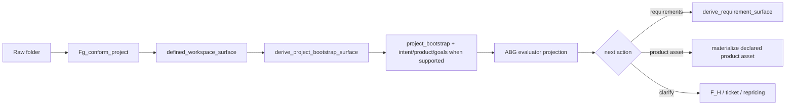

## 2. Missing Runner Action-Decision Surface

### What ABG 3.7.1 gives us

`runtime/abiogenesis_substrate.ts` defines
`OddSdlcConstructionEvaluatorReport` with:

```text
observation
actionCatalog
bindingProjection
priorityProjection
selectedPriorityRow
nextLawfulActionRefs
bestGraphFunctionRef
bestGraphVectorRef
```

and `deriveOddSdlcConstructionEvaluatorReport()` builds that by:

```text
pressures -> ObservationPressureRow
actions -> ConstructionActionRow
ObservationToActionBindingProjection
ConstructionPriorityProjection
selectedPriorityRow = priorityProjection.rows[0]
```

That is the right evaluator shape.

### Where it stops today

`projection/query_domain.ts` uses this evaluator in `deriveSdlcGapDossier()`,
but marks the dossier as:

```text
readOnly: true
choosesNextTraversal: false
rankingAuthority: abiogenesis_construction_priority_projection
```

So public gaps can show evaluator ranking, but the runner is not required to
consume it as the next action.

Meanwhile, `operator/installed_operator.ts` still computes installed summary
actions from local conditions:

```text
retryVisibleGap -> retry_same_edge_with_gap_dossier
fpEscalationVisibleGap -> escalate_to_fp_with_gap_dossier
repairVisibleGap -> plan_repair_reentry_with_gap_dossier
else -> inspect_worker_archive
```

Computational consequence:

```text
evaluator says best action = X
installed runner still follows current edge / local dossier branch
```

### test35 comparison

test35 did not have the ABG 3.7 evaluator abstraction, but it had a tighter
closed loop:

```text
published ledger + event stream -> interpreter projection -> next graph state
```

The runner and projection were coupled through events/ledgers.

### Missing capability

The runner needs one action-decision input:

```text
ConstructionPriorityProjection.selectedPriorityRow
  -> admitted ConstructionIntent
  -> runner invokes selected graph action
```

Not:

```text
gaps displays evaluator result
installed_operator separately decides retry/inspect/next edge
```

## 3. Product-Asset Binding Gap

### test35 behavior

The Python binding layer carries target asset state through the
`TargetAssetBinding`/manifest surface. The prompt consumes that binding, but the
authority is the manifest shape, not a literal prompt block:

```text
target_asset_binding.asset_id
target_asset_binding.uri
target_asset_binding.relative_path
target_asset_binding.path_kind
target_asset_binding.exists
```

It also tells the worker:

```text
Treat the current workspace state as truth.
Continue construction from the present state and reduce the unresolved gap.
```

The manifest and prompt bind the graph edge to a concrete workspace target.

### TypeScript behavior

TypeScript has a product materialization contract:

```text
activeTenant
selectedOutputRoot
tenantRoot
requiredRoles
executionShards
```

and `evaluateMaterializedProductFiles()` rejects missing product files when
materialization is required.

But materialization is required only when the current `targetAssetType` maps to
required product roles. For early broad edges like intent/product/goals/design,
materialization is not required. So a hello-world request can have missing
`Cargo.toml` and `src/main.rs`, while the current edge still passes because the
current target is a document surface.

Computational failure:

```text
operator desired product files missing
current graph edge = derive_intent_surface
targetAssetType = intent_surface
productMaterialization.required = false
no product-file gap blocks action selection
graph advances
```

This is why broad bootstrap can keep making "progress" while the requested
product asset is absent.

### Missing capability

Product asset requests must become evaluator pressure independent of current
edge:

```text
requested asset: build_tenants/hello_world_rust/Cargo.toml
requested asset: build_tenants/hello_world_rust/src/main.rs
observed state: missing
pressureKind: missing_declared_product_asset
targetOutcomeRefs: outcomes that can create those files
```

Then the evaluator can rank:

```text
missing product source > generic documentation edge
```

when policy says the product asset is the current highest-value outcome.

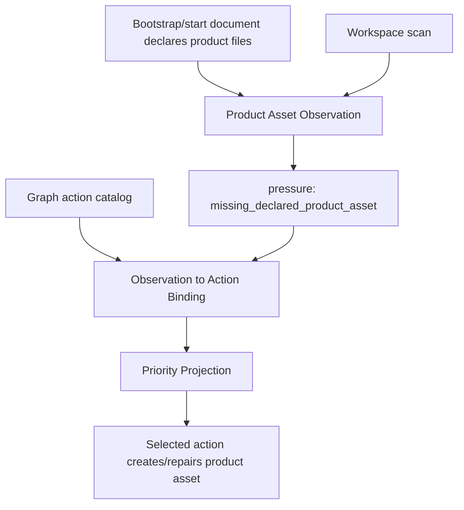

## 4. Split Edge Ledger Truth

### test35 behavior

`result_ingest.py` builds a published fulfillment ledger from:

```text
manifest fulfillment_obligations
worker fulfillment_assessments
declared obligation policy
admission state
```

It computes:

```text
missing_count
extra_count
fulfilled_count
partial_count
blocked_count
unfulfilled_count
carry_converged
fulfillment_converged
edge_converged = carry_converged && fulfillment_converged && admitted
```

`interpret.py` then projects `edge_converged` only if the published ledger says
the edge converged.

That is a total closure predicate.

### TypeScript behavior

TypeScript has multiple partial ledgers/reports:

```text
handoff_manifest.json
worker_result_report.json
postflight.json
assurance_ledgers.json
assurance_satisfaction.json
assurance_postflight.json
gap_dossier.json
product_materialization_manifest.json
runtime_liveness_observer_projection.json
run.json
```

Each artifact is useful, but no single one answers the whole test35 question:

```text
Which action was selected?
What target asset was supposed to be built?
What obligations were carried?
What product files changed?
What deterministic/semantic checks passed?
What liveness/process evidence existed?
Did the edge close?
If not, what exact continuation was admitted?
```

Instead, `handoff.ts` maps postflight blocking reason carriers into action
strings:

```text
same_edge_retry -> retry_same_edge
escalate_to_fp -> escalate_to_fp
repair_worker_output -> repair_worker_output
triage_gap -> triage_gap
```

and `installed_operator.ts` maps those strings into installed summary actions.

Computational consequence:

```text
closure truth = distributed across several files
action decision = local fold over reason strings
replay cannot use one ledger/decision/evaluator surface as authority
```

### Missing capability

Publish the T-109 carrier pair per attempted graph action:

```text
SdlcEdgeFulfillmentLedger
SdlcEdgeClosureDecision
```

The fulfillment ledger records evidence and convergence:

```text
ledgerRef
episodeId
attemptOrdinal
selectedActionRef
selectedPriorityRowRef
graphFunctionRef
graphVectorRef
sourceAssetRefs
targetAssetRefs
materializedFileRefs
obligationRows
carryCounts
fulfillmentCounts
productMaterializationVerdict
assuranceVerdict
livenessProjectionRef
processDisposition
semanticDisposition
edgeConverged
```

Then:

```text
edgeConverged = function(SdlcEdgeFulfillmentLedger)
SdlcEdgeClosureDecision = fold(SdlcEdgeFulfillmentLedger)
nextActionPressure = function(SdlcEdgeClosureDecision + current observed truth)
```

The closure decision vocabulary must include `yield`:

```text
close
yield
retry
repair
re-enter
reprice
block
```

The evaluator then selects the next lawful graph action from the closure
decision plus replayed runtime/worksite observation. The ledger does not select
the action by itself.

For `yield`, the evaluator normally does not select a new graph action. It
projects the same edge/attempt as lawfully open with a resume basis, admitted
progress refs, and the reason control returned to the operator or scheduler.

That is the test35 pattern in stricter TypeScript/ABG terms.

## 5. Retry/Repair Is Not Yet The Same As test35 Continuation

### test35 behavior

When proof fails:

```text
proof_failed
-> graph_call_failed
-> continuation_opened
```

When transport fails but a valid artifact exists:

```text
transport failure + valid result artifact
-> ingest preserved result
-> worker_turn_salvaged
```

This matters because a worker/process failure does not necessarily erase a
semantic result.

### TypeScript behavior

TypeScript now has ABG liveness observer projection and typed process failure
handling. That is good. But retry/repair remains partly local:

- `handoff.ts` creates gap dossiers from postflight blockers.
- `installed_operator.ts` recognizes retry/repair/escalation strings.
- component repair rows exist, but the runner-level selected repair action is
  not yet the same as an ABG construction intent over the graph/action library.

Computational gap:

```text
failure evidence -> gap dossier action strings
not yet:
failure evidence -> evaluator pressure -> selected construction intent -> runner action
```

### Missing capability

Repair should be an action row:

```text
actionKind: repair_graph_call
targetOutcomeRef: component_test_surface or component_code_surface
inputAssetRefs: repair row + failing artifact + current source/test files
requiredAuthorityRefs: component_repair_schedule_surface row refs
```

Then the evaluator can choose repair as the highest-value action.

## 6. Component-Depth Overhead

### Why the current TS graph is not simply wrong

The TypeScript graph added useful structure after test35:

```text
aggregate domain model
component topology
component realization schedule
component code
component realization qualification
test component topology
component tests
test execution result
component repair schedule
release depth parity
```

For a real product like data_mapper, those edges are valuable. They make repair
rows, component failures, test shards, and release-depth parity typed.

### Why it hurts hello-world

For a one-file Rust hello-world tenant, the graph can do too much before it
materializes the product:

```text
intent -> product -> goals -> requirements -> feature -> UAT -> design
-> scenario -> implementation design -> stack -> modules -> aggregate model
-> topology -> sequence -> schedule -> component code
```

If the evaluator is only previewing and the runner follows the broad graph, the
minimal product is delayed until a late materialization edge.

### Missing capability

The graph library needs multiple lawful actions, and policy needs to choose the
right scale:

```text
full component-depth route
minimal declared product asset route
repair existing product file route
clarify missing product authority route
```

This is not a tenant-specific hack. It is a graph/action catalog issue.

The minimal route must not be a vague "small product" heuristic. It is lawful
only when all of these are true:

```text
explicit product assets are declared
component topology / requirement-depth authority is absent or explicitly deferred
the requested proof is product execution, not release-depth qualification
the selected action can bind the exact declared product assets
```

For data_mapper-class products, published component topology, requirement
coverage, test shards, or release qualification pressure should make the
component-depth route eligible and higher priority under the declared policy.

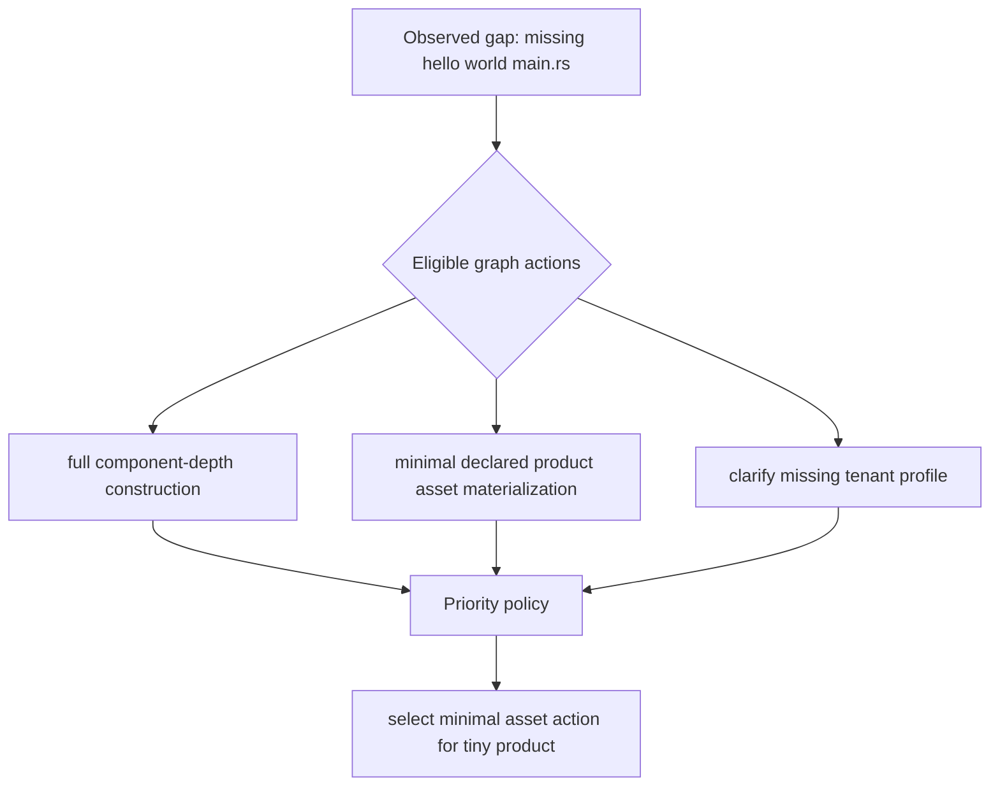

## 7. Why Existing Gap Analysis Is Insufficient

Current gap analysis can say:

```text
currentEdge
closedVectorIndexes
nextVectorIndex
nextLawfulActions
bestActionRef
bestGraphVectorRef
rankingReasonRefs
```

But for test35-level self-repair it must additionally answer:

```text
What exact asset is missing or insufficient?
Which obligations make that asset insufficient?
Which graph action can produce or repair it?
Was that graph action actually invoked?
What changed in the workspace?
Did the change reduce the gap?
If not, is the next move same-edge retry, targeted repair, broader graph action,
F_H review, or repricing?
```

The current TS gap analysis is a read-only evaluator view over the graph. It is
not yet the installed runner's closed-loop controller.

## 8. What To Build Next

### A. First-edge induction

Implement T-134 as:

```text
derive_project_bootstrap_surface
```

or equivalent target-asset name. It should consume a defined workspace and
produce project bootstrap/intent/product/goals when supportable.

### B. Product asset observation pressure

Add an observation function that converts declared/requested product assets into
ABG evaluator pressure rows:

```text
declared asset exists? no
-> missing_declared_product_asset pressure
```

### C. Action catalog expansion

Add lawful graph/action rows for:

```text
continue graph edge
minimal declared product asset materialization
repair declared product asset
derive requirements
clarify project/product/tenant authority
component repair reentry
```

### D. Runner consumes evaluator action

Replace local installed-operator action selection with:

```text
ConstructionPriorityProjection.selectedPriorityRow
-> admitted ConstructionIntent
-> runner invokes selected graph action
```

If ABG T-128 is not available yet, odd_sdlc should explicitly stop at
read-only/evaluator-preview mode and not pretend the runner is evaluator-driven.

### E. T-109 edge fulfillment and closure carriers

Create the T-109 carrier pair that joins:

```text
selected evaluator action
worker handoff
worker result
postflight
assurance
materialization
liveness
gap dossier
continuation
```

Make `edgeConverged` a function of `SdlcEdgeFulfillmentLedger`.
Make closure disposition a field of `SdlcEdgeClosureDecision`, including
`yield` as the pressure-release state.
Make next graph-action selection a function of evaluator projection over the
closure decision plus current observed truth.

## Target Computational Loop

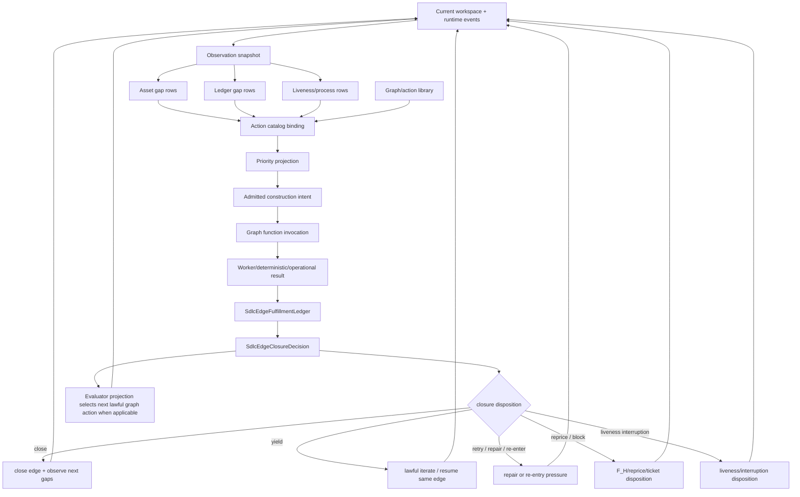

This is the feature we are missing: not more checks, but one replayable
function from observed truth to selected next constructive action.

## Final Axiomatic Ontology

This section states the target computational constitution for the loop. It is
commentary until absorbed into T-109/design, but it is written as axioms because
the implementation should be judged against these rules.

### Ontological Objects

| Object | Definition | Authority |
| --- | --- | --- |
| `Worksite` | The current workspace, runtime archive, transform assets, product tenant root, conformed project profile, and observed file state. | Observable substrate, not authority by itself. |
| `RuntimeEventLog` | Append-only admitted runtime facts under `.ai-workspace/events/events.jsonl`. | ABG runtime truth. |
| `RuntimeProjection` | Replay-derived current runtime state over the event log and execution basis. | ABG projection truth. |
| `ObservationSnapshot` | Read-only view of runtime truth plus worksite facts relevant to construction. | ABG evaluator carrier with odd_sdlc domain rows. |
| `GapPressureRow` | Typed pressure over missing, partial, blocked, waiting, or ambiguous assets/evidence. | odd_sdlc domain meaning over admitted observation. |
| `TargetObligationBinding` | Exact binding from gap pressure to target assets, required roles, evidence refs, and admissible graph outcomes. | odd_sdlc domain binding over GTL/ABG action authority. |
| `ActionCatalog` | Published lawful graph actions: graph functions, vectors, targets, inputs, and eligible outcomes. | GTL/odd_sdlc publication consumed by ABG. |
| `PriorityProjection` | Deterministic ranking over bound lawful actions under visible policy. | ABG evaluator kernel with odd_sdlc policy as visible input. |
| `ConstructionIntent` | Admitted selected action for one bounded graph invocation. | ABG admission and traversal authority. |
| `WorksiteEvidence` | Admitted worker, process, product-file, execution, materialization, liveness, and postflight evidence. | F_D/ABG/odd_sdlc admission, not worker self-closure. |
| `SdlcEdgeFulfillmentLedger` | Evidence and convergence carrier for one edge attempt/version. | T-109 closure evidence truth. |
| `SdlcEdgeClosureDecision` | Sum type over the ledger: close, yield, retry, repair, re-enter, reprice, block. | T-109 closure decision truth. |
| `EvaluatorProjection` | Read model that observes the closure decision plus current truth and selects a next graph action only when lawful. | ABG evaluator projection with odd_sdlc domain policy. |

### Axioms

**A0. One Surface**

There is one authoritative computational surface for traversal consequence:

```text
ObservationSnapshot
-> TargetObligationBinding
-> PriorityProjection
-> ConstructionIntent
-> WorksiteEvidence
-> SdlcEdgeFulfillmentLedger
-> SdlcEdgeClosureDecision
-> EvaluatorProjection
```

No CLI branch, prompt prose, postflight string, gap-dossier action list, or
local installed-operator summary may become a rival source of traversal truth.

**A1. Worksite Is Observed, Not Trusted**

The file system, process output, screen logs, worker artifacts, and product
tenant files are observations. They become authority only after being admitted
into typed evidence and then folded into ledger/decision truth.

**A2. Exact Target Binding**

Every constructive action must bind the current gap to exact target assets and
obligations before invocation:

```text
gap pressure + target assets + required roles + evidence refs
-> TargetObligationBinding
```

A broad documentation edge cannot satisfy a declared product-file gap unless the
binding proves that the edge is the lawful action for those exact assets.

**A3. Published Action Law**

The evaluator may rank only published lawful actions from the action catalog. If
the desired action is unpublished, the lawful result is a typed no-action
disposition, not fallback to a broad executive graph.

**A4. Default Totality**

The evaluator must be total.

```text
if active closure decision is yield:
  resume/yield the same edge from replay-visible resume basis
else if higher-priority lawful action exists:
  select it
else if current graph edge remains lawful:
  follow the graph
else if authority is missing:
  reprice or block
else:
  block with typed no-action disposition
```

Default graph following is the ordinary case, but it is still an evaluator
decision, not hidden sequential control. Yield is checked before fresh action
selection because it is the lawful iterate seam for an already-open edge or
attempt.

When a declared target asset or target action is in scope, A3 governs. The
current graph edge is not a lawful fallback unless binding proves that edge is
the published action for that declared target.

**A5. F_P Freedom, F_D Authority**

F_P may inspect, discover, reason, draft, transform, and propose within the
bounded action. F_P must not close the edge, emit runtime events, mutate ledgers,
or decide re-entry. F_D/ABG/odd_sdlc admission owns durable evidence and closure
truth.

**A6. Evidence Before Closure**

No edge closes from raw artifact presence, raw worker report, raw process
success, or CLI summary. Closure is a fold over admitted evidence:

```text
WorksiteEvidence
-> SdlcEdgeFulfillmentLedger
-> SdlcEdgeClosureDecision
```

**A7. Ledger Is Evidence, Not Action Selector**

`SdlcEdgeFulfillmentLedger` records evidence and convergence:

```text
counts
obligation rows
materialization refs
liveness refs
admission refs
edge_converged
```

It does not select the next action. Action selection belongs to the evaluator
over `SdlcEdgeClosureDecision` plus current observed truth.

**A8. Closure Decision Is A Sum Type**

The closure decision vocabulary is:

```text
close
yield
retry
repair
re-enter
reprice
block
```

Each disposition is replay-visible and must carry basis/reason refs sufficient
to reproduce the decision.

**A9. Yield Is Lawful Iterate**

`yield` is the lawful iteration boundary.

```text
same edge/attempt remains lawful
progress or waiting state is admitted
resume basis is replay-visible
control returns without failure classification
```

Yield is not retry. Yield is not block. Yield is not timeout. Yield is not a CLI
loop. It is the pressure-release state that lets long-running, bounded, or
partially productive work return control without losing the current edge.

**A10. Liveness Does Not Close Semantic Truth**

Liveness observes activity, inactivity, process state, and interruption. It can
support yield or liveness interruption. It cannot by itself declare semantic
failure, semantic closure, or requirement non-satisfaction.

**A11. Re-Entry Is Graph Law**

Repair and re-entry are graph actions selected from admitted closure truth and
published action authority. They are not local retry branches over strings.

**A12. Public Gaps Is A Read-Only Evaluator View**

`gaps` renders the same evaluator truth the runner consumes, but it does not
append events, invoke workers, admit intent, or choose traversal by itself.

**A13. Replayability**

Every closure decision and next-action selection must be reproducible from:

```text
RuntimeEventLog
+ execution basis
+ admitted worksite evidence
+ SdlcEdgeFulfillmentLedger
+ SdlcEdgeClosureDecision
+ visible policy refs
```

If replay cannot reproduce the decision, the implementation has created hidden
state.

**A14. Causal Chain Integrity**

Each admitted carrier must reference its causal predecessor refs:

```text
ConstructionIntent
-> WorksiteEvidence
-> SdlcEdgeFulfillmentLedger
-> SdlcEdgeClosureDecision
-> EvaluatorProjection
```

Replay reconstructs the loop by following those refs. A broken predecessor
chain is non-replayable and therefore fails A13.

**A15. Method Ownership**

ABG owns runtime truth, event replay, graph-call lifecycle, actor/process
supervision, continuation, and re-entry mechanics. `odd_sdlc` owns SDLC domain
asset meaning, graph-function catalog meaning, gap interpretation, and priority
policy. DMM governs realization modules inside that split; it must not fragment
the evaluator into module-local decision authorities.

**A16. Constitutional Override**

For any ticket that touches traversal, gap evaluation, action selection,
construction intent, worker invocation, evidence admission, fulfillment,
liveness, closure, re-entry, public gaps, or live proof, this axiom set and the
Constitutional Equation are the controlling acceptance target.

Ticket-local closure wording, test names, source-grep checks, compact CLI
summaries, or implementation notes cannot weaken the constitutional loop. If a
ticket appears complete by its local checklist but leaves a rival traversal
consequence path, the ticket is not constitutionally complete. The lawful result
is to reprice the ticket, add a follow-up with an explicit constitutional
deferral, or mark the gap as a remaining closure blocker.

The following artifacts may provide evidence, diagnostics, or read-model
context only. They must not independently close an edge, select a next action,
or route retry/repair/re-entry:

```text
gap dossier
postflight report
assurance report
materialization manifest
runtime liveness projection
run summary
worker prose
screen/PTY transcript
prompt package
harness target argument
source-grep test
CLI branch or compact output
```

If any of those artifacts conflict with the admitted
`SdlcEdgeFulfillmentLedger`, `SdlcEdgeClosureDecision`, or
`EvaluatorProjection`, the ledger/decision/evaluator chain wins. If that chain
is absent, the edge has not constitutionally closed and the next action has not
been constitutionally selected.

### Constitutional Equation

The target loop is:

```text
let O = observe(RuntimeEventLog, Worksite)
let B = bind(O.gaps, ActionCatalog, target obligations)
let P = rank(B, Policy)
let I = admit_intent(P.selected)
let E = admit_evidence(invoke(I))
let L = ledger(E, B.obligations)
let D = closure_decision(L)
let N = evaluate_next(D, observe(RuntimeEventLog, Worksite))

return N
```

Where:

```text
D.disposition in {close, yield, retry, repair, re-enter, reprice, block}
```

The implementation is correct only when `N` is derived from that equation and no
other path can decide what work happens next.

The second `observe(...)` is intentional. Next-action evaluation must use
post-evidence runtime/worksite truth, not the stale observation that produced
the just-executed intent.

## Final Uplift Table: test35 Python To TS Line

This table is the constitutional parity map. The axioms are not a new process;
they name the computation the successful `test35` Python line already achieved
and translate it into the TS/ABG carrier vocabulary.

| Computational step | Axiom target | `test35.py` implementation | Current TS/TL implementation | Existing TS ledgers/counters disposition | Constitutional gap | Work to uplift TS/TL |
| --- | --- | --- | --- | --- | --- | --- |
| Observe current worksite | A0, A1, A13. Worksite facts are observed, not trusted. | `.genesis/genesis/run.py` projects run state from events; `RUN_STATES` includes `yielded` as active. `.genesis/genesis/result_ingest.py` reads manifest/result/workspace facts before ledger fold. | ABG observation exists through `deriveOddSdlcEvaluateNextReport` and `ConstructionObservationSnapshot`; public start and post-action paths build observations before `SdlcNextActionProjection`. | Keep observation/read-model counters only as inputs. Requirement closure registers, liveness projections, run summaries, and gap dossiers are not retired if they remain evidence sources, but they must be demoted wherever they imply closure or next-action authority. | Observation is present, but the live proof can still be helped by harness targets. We have not fully proven bootstrap -> observe -> product pressure without an explicit product target argument. | Make the no-target post-bootstrap observation a required proof: after authority conformance, TS must observe declared product pressure from workspace/requirements truth and produce the next action from that observation. |
| Bind missing or required work to edge obligations | A2, A3. Every constructive action must bind gap pressure to exact target assets and obligations. | `result_ingest.py` folds the manifest fulfillment obligation set, computes missing/extra, and applies target materialization checks before edge convergence. | `SdlcTargetObligationBinding` in `query_domain.ts` binds target asset type to published graph functions; `SdlcEdgeFulfillmentLedger` carries `targetBindingRefs`; T-141 added `downstream_transformation_set` for requirements carried to product materialization. | Repurpose existing requirement/gap registers as source rows for `SdlcTargetObligationBinding` and fulfillment assessments. Retire any parallel "current gap means next action" interpretation from gap dossier rows. | Binding exists, but product pressure still needs to be generated from GTL/configured transform-set truth rather than harness intent. Requirements must be treated as the transformation set for the product, not as the product itself. | Publish an explicit transform-set binding: `requirement_surface -> component_code_surface` obligations partition into `edge_local` and `downstream_transformation_set`, with no broad fallback and no harness target needed. |
| Rank lawful actions | A3, A4, A15. Only published catalog actions can be ranked; default graph following is evaluator law. | Python dispatch did not fall back from a declared target to a broad unrelated graph. Continuation/yield was represented as event/replay state, not hidden loop control. | `public_start.ts` and `installed_operator.ts` call `deriveOddSdlcEvaluateNextReport`; `SdlcNextActionProjection` records selected action refs and `choosesNextTraversal`. | Keep ABG priority/evaluator projections and `SdlcNextActionProjection`. Retire local action lists, string-fold retry paths, and compact CLI next-action summaries as authority. They may remain only as rendered views over the projection. | Candidate generation still has domain-specific construction inside `installed_operator.ts`, including post-action product-materialization candidates. That is acceptable as an interim domain adapter, but not yet a fully published GTL/catalog policy surface. | Move candidate declaration for product materialization into the graph/catalog/policy surface, and keep `installed_operator.ts` as consumer of evaluator output, not author of special continuation law. |
| Admit construction intent | A0, A3, A14. Selected evaluator action becomes admitted intent with predecessor refs. | Python run/dispatch events carry run/call/manifest identity; fail-closed paths chain causation refs from graph call failure into continuation events. | `constructSdlcConstructionIntent` records selected priority row, next-action projection, selected action, basis refs, and predecessor refs; public start threads it into execution contract. | Keep `SdlcConstructionIntent` as the intent lineage carrier. Retire any "intent ledger" idea as a separate prime ledger; intent belongs in event/admission truth with lineage projections over refs. | Initial intent admission works when a target is requested. The missing proof is autonomous intent admission from post-bootstrap product pressure. | Add live/function proof where `conform_project_authority` closes, `evaluate_next` selects product materialization from carried requirements, and that selected row becomes the construction intent. |
| Invoke bounded worker/action | A5. F_P may transform, but must not publish closure truth. | Python dispatched bounded worker work through manifest/result channels; the worker result became input to `result_ingest`, not direct closure authority. | `installed_operator.ts`, `handoff.ts`, and `transport.ts` invoke the worker and archive worker outputs, process traces, prompt/package files, postflight, and materialization reports. | Keep worker/process archives, PTY logs, prompt packages, and materialization manifests as evidence/debug ledgers. Retire duplicated prompt-embedded package state and any worker self-closure fields. | The authority boundary is now mostly right, but the prompt/package path still carries too much duplicated context. That is token waste and can obscure the exact obligation being transformed. It is not itself closure authority unless a downstream consumer treats it as such. | Slim worker input to exact target binding, obligation set, worksite refs, and product proof contract. Logs can remain verbose on disk; prompts should be deterministic work orders, not replayed system state. |
| Admit worker/process/product evidence | A1, A5, A6, A14. Raw output becomes typed evidence before closure. | `result_ingest.py` records assessment rows, evidence refs, target materialization result, and admission fields before computing convergence. | `constructSdlcWorksiteEvidence` records process refs, product evidence refs, admitted progress refs, liveness refs, and predecessor refs; installed operator feeds those into the ledger. | Repurpose postflight, assurance, materialization, and liveness counters as evidence rows or evidence refs consumed by `SdlcWorksiteEvidence`. They are not retired, but their status fields must not independently close an edge. | Evidence admission exists, but postflight, assurance, materialization, and liveness artifacts still need to stay subordinated under the ledger in every consumer. | Add conflict tests: if postflight passes but ledger does not converge, the edge must not close; if files exist but evidence is not admitted, the edge must not close. |
| Publish fulfillment ledger | A6, A7, A16. Ledger is the closure evidence surface, not a side artifact. | `result_ingest.py` publishes the fulfillment ledger fields: expected, fulfilled, partial, blocked, unfulfilled, missing, extra, carry, fulfillment, admitted, and edge convergence. | `SdlcEdgeFulfillmentLedger` now carries counts, `assessmentCount`, `carryConverged`, `fulfillmentConverged`, `admitted`, `targetCertificationPassed`, `fdRecheckPassed`, and `edgeConverged`; installed operator archives it. | Keep and promote `SdlcEdgeFulfillmentLedger` as the canonical edge fulfillment ledger. Retire older `SdlcManagedTraversalLedger` or ingress/source ledger uses wherever they claim closure; keep them only as source lineage/registers feeding assessments. | The carrier exists, but sovereignty is still the key acceptance issue. A ticket can still appear green if it only proves helper construction or source-grep shape, not that this ledger is the only closure path. | Make every traversal ticket cite A16 and include one negative proof that no alternate artifact can close or route when the ledger/decision/evaluator chain disagrees. |
| Compute `edge_converged = carry && fulfillment && admitted` | A6, A7. Closure is a fold over admitted evidence and declared carry. | `result_ingest.py` computes `carry_converged = missing_count == 0 and extra_count == 0`, `fulfillment_converged = fulfilled_count == len(obligation_rows) ...`, and `edge_converged = carry_converged and fulfillment_converged and admitted`. | `traversal_consequence.ts` computes carry from `missing === 0 && extra === 0`, fulfillment from fulfilled/partial/blocked/unfulfilled counts, then gates `edgeConverged` by admitted, target certification, and F_D recheck. | Keep these counters only on `SdlcEdgeFulfillmentLedger` or as direct projections from it. Retire duplicated closure counters in run summaries, gap dossiers, or assurance reports unless they explicitly cite the ledger version ref. | Formula parity is now close. The delicate part is T-141: downstream transformation-set obligations must not falsely block the requirement edge, but must create downstream product pressure. | Preserve the partition: `edge_local` obligations gate this edge; `downstream_transformation_set` obligations carry pressure into product materialization. Add regression where requirement edge closes only when local obligations converge and downstream pressure is emitted. |
| Decide close/yield/retry/repair/re-enter/reprice/block | A8, A9, A10, A11. Closure disposition is a replay-visible sum type. | Python represents `run_yielded` as active state and `MachineAdvanceResult(progressed=..., yielded=True)` as separate from failure/timeout. | `SdlcEdgeClosureDecision` has the seven-disposition sum type; yield requires current edge lawful and admitted progress beyond liveness-only refs; closure policy is explicit. | Keep `SdlcEdgeClosureDecision` as the sole closure disposition ledger/projection. Retire local retry/repair/re-entry counters or branch names as authority; preserve them only as reason refs under the decision. | Closure vocabulary is materially aligned. Remaining risk is policy/candidate drift: retries and continuation must never be selected by string branches or gap dossier rows. | Keep retry/repair/re-entry as graph/evaluator actions. Add functional non-close continuation tests that execute the loop and assert next action derives from `SdlcEdgeClosureDecision -> SdlcNextActionProjection`. |
| Continue from replay-visible state | A12, A13, A14, A16. Next action is selected from closure decision plus fresh observation. | Python replay derives run state from event stream; continuation/failure chains carry causation refs, so the next machine advance can be reconstructed. | `replaySdlcTraversalConsequence` reconstructs `ConstructionIntent -> WorksiteEvidence -> Ledger -> ClosureDecision -> NextActionProjection`; public gaps rehydrates consequence archives for read-only view. | Keep replay archives and public gaps as read models over the consequence chain. Retire any public gaps, run summary, or compact output path that can route work without a `SdlcNextActionProjection` ref. | Replay machinery exists, but the live lanes have not yet proven full autonomous continuation from bootstrap through product materialization without an explicit target. Multi-tenant lanes still exposed loop/circuit-breaker weaknesses. | Add the controlling live proof: run from a source/specification-only workspace, conform authority, derive requirements as transformation set, emit product pressure, select materialization, close product ledger, and prove replay reconstructs every decision. |

The current TS/TL line is therefore not missing the names of the carriers. It is
missing full constitutional proof that those carriers are the only route from
transform output to next action. The next uplift should avoid adding another
artifact. It should make this chain sovereign in the live runner and make the
negative cases fail closed.
