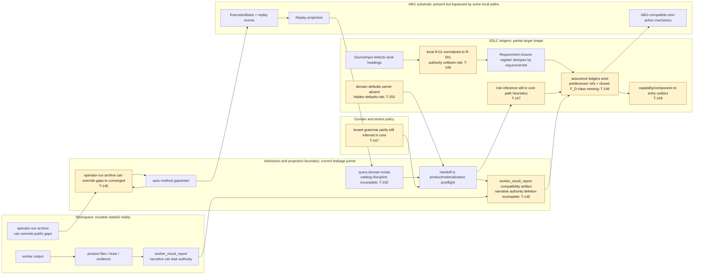

# T-144 Follow-On Strategy: F_D Overreach, Worker Truth, And Tenant Grammar

- author: codex
- status: commentary, not law
- created_at: 2026-05-11T01:20:31Z
- primary_ticket: `.ai-workspace/tickets/completed/T-144-reclassify-repairable-assurance-and-tenant-grammar-boundaries.md`
- inputs:
  - `.ai-workspace/comments/codex/20260509_test35_capability_gap_computational_breakdown.md`
  - `.ai-workspace/comments/claude/20260511T120000Z_ANALYSIS_recurring-themes-in-closed-tickets.md`
  - Claude T-144 follow-on review supplied by operator
  - Codex source review of current `odd_sdlc` TypeScript code
  - `specification/PRODUCT.md`
  - `/Users/jim/src/apps/specification_methodology/specification/standards/ODD_METHOD.md`

## Position

T-144 correctly repaired the immediate F_D-overreach slice: repairable assurance
findings no longer default to `operator_blocked`, semantic contradiction now
re-enters through reprice, ADR/SBT postflight grammar moved out of closure
authority, and local requirement headings such as `R-01` are no longer discarded
outright.

That does not close the broader defect class.

Claude's six additions are valid as next-wave pressure, but they should not be
hidden inside the completed T-144. The codebase now needs a follow-on wave with
one controlling rule:

> F_D may certify mechanics and replay reachability. It may not become the
> semantic judge of F_P output, and it may not recover closure from local
> controller or archive state that replay cannot reproduce.

The next work should be driven by a design principle, then packaged into focused
corrections. Some corrections are direct T-144 residuals; others are adjacent
recurring-theme traps that need their own closure law and tests.

## Historical Constraint Source

The controlling historical source for this strategy is Claude's recurring-theme
analysis:

`/Users/jim/src/apps/odd_sdlc/.ai-workspace/comments/claude/20260511T120000Z_ANALYSIS_recurring-themes-in-closed-tickets.md`

That post is commentary, not law, but it is the current historical evidence base
for why the T-144 follow-on work must be constrained tightly. It sampled 369
closed tickets across `abiogenesis` and `odd_sdlc`, preserved the local ticket
vocabulary, and derived its themes from ticket frontmatter plus targeted full
body reads ([Claude analysis](/Users/jim/src/apps/odd_sdlc/.ai-workspace/comments/claude/20260511T120000Z_ANALYSIS_recurring-themes-in-closed-tickets.md:3),
[method](/Users/jim/src/apps/odd_sdlc/.ai-workspace/comments/claude/20260511T120000Z_ANALYSIS_recurring-themes-in-closed-tickets.md:25)).

Audit note: the Claude analysis received a same-day correction in git commit
`626ac9a` (`Correct stale placement claims in recurring-themes analysis`). This
strategy cites the corrected file as it exists after that review correction, not
the first published version.

The historical constraints it imposes on this strategy are:

- do not allow F_P/F_D authority to leak through second closure paths or
  worker-narrated `unresolvedReasons`
  ([executive summary](/Users/jim/src/apps/odd_sdlc/.ai-workspace/comments/claude/20260511T120000Z_ANALYSIS_recurring-themes-in-closed-tickets.md:13));
- do not bypass replay-visible runtime truth with local controller state,
  caller-supplied arguments, prompt prose, or operator archives
  ([executive summary](/Users/jim/src/apps/odd_sdlc/.ai-workspace/comments/claude/20260511T120000Z_ANALYSIS_recurring-themes-in-closed-tickets.md:15));
- do not make closure decisions from lossy strings, IDs, marker files, summary
  fields, or carriers without causal predecessor refs
  ([executive summary](/Users/jim/src/apps/odd_sdlc/.ai-workspace/comments/claude/20260511T120000Z_ANALYSIS_recurring-themes-in-closed-tickets.md:17));
- do not let substrate/core code absorb domain or tenant ecosystem grammar
  ([executive summary](/Users/jim/src/apps/odd_sdlc/.ai-workspace/comments/claude/20260511T120000Z_ANALYSIS_recurring-themes-in-closed-tickets.md:19));
- do not introduce local rival iteration authority through CLI loops, prompt
  action strings, fallback heuristics, or harness-directed loops
  ([executive summary](/Users/jim/src/apps/odd_sdlc/.ai-workspace/comments/claude/20260511T120000Z_ANALYSIS_recurring-themes-in-closed-tickets.md:21)).

The themes table gives the weighting that should drive priority. Worker
transport lossiness, replay-visible state, normalization/ingress lossiness,
F_P/F_D inversion, ecosystem grammar leakage, hidden defaults, requirement
traceability, and catalog lookup are all recurring patterns in the observed
month, not isolated mistakes
([themes table](/Users/jim/src/apps/odd_sdlc/.ai-workspace/comments/claude/20260511T120000Z_ANALYSIS_recurring-themes-in-closed-tickets.md:46)).

The deep sections also constrain the acceptance tests:

- worker prompts and result reports are transport/read-model surfaces; typed
  admitted carriers own closure
  ([worker envelope](/Users/jim/src/apps/odd_sdlc/.ai-workspace/comments/claude/20260511T120000Z_ANALYSIS_recurring-themes-in-closed-tickets.md:84));
- replay-derived truth must be reproducible from admitted events, not controller
  state
  ([replay-visible state](/Users/jim/src/apps/odd_sdlc/.ai-workspace/comments/claude/20260511T120000Z_ANALYSIS_recurring-themes-in-closed-tickets.md:98));
- per-obligation semantic judgment remains F_P; F_D owns mechanics
  ([F_P/F_D boundary](/Users/jim/src/apps/odd_sdlc/.ai-workspace/comments/claude/20260511T120000Z_ANALYSIS_recurring-themes-in-closed-tickets.md:126));
- ecosystem knowledge belongs behind tenant/domain contracts, not in substrate
  runtime
  ([ecosystem grammar](/Users/jim/src/apps/odd_sdlc/.ai-workspace/comments/claude/20260511T120000Z_ANALYSIS_recurring-themes-in-closed-tickets.md:142));
- defaults that affect decisions must be visible, versioned, and
  replay-traceable
  ([hidden defaults](/Users/jim/src/apps/odd_sdlc/.ai-workspace/comments/claude/20260511T120000Z_ANALYSIS_recurring-themes-in-closed-tickets.md:184));
- graph-function and asset handles resolve through published catalogs, not
  lexical search
  ([published registers](/Users/jim/src/apps/odd_sdlc/.ai-workspace/comments/claude/20260511T120000Z_ANALYSIS_recurring-themes-in-closed-tickets.md:238)).

Any follow-on correction from this post should cite the Claude analysis as its
historical recurrence evidence and should include negative tests that prove the
old recurring pattern cannot re-enter through a neighboring code path. Each
negative regression should cite the originating ticket or code-review finding
and the recurring-theme number in the test name or a nearby test comment, so
future cleanup waves can see why the test exists.

## Source Inspiration And Iteration Boundary

This strategy is the next iteration from Codex's test35 computational breakdown:

`/Users/jim/src/apps/odd_sdlc/.ai-workspace/comments/codex/20260509_test35_capability_gap_computational_breakdown.md`

That source note remains the operational inspiration document for this wave. It
showed that the TypeScript line had restored important single-tenant
consequence-loop pieces, but still needed to prove the successful `test35`
machine as one closed computational loop rather than a set of adjacent reports
and helper paths ([source claim](/Users/jim/src/apps/odd_sdlc/.ai-workspace/comments/codex/20260509_test35_capability_gap_computational_breakdown.md:334)).

The prior document contributes four principles that this strategy turns into
specific tickets:

- the durable loop is `observe -> bind exact target obligations -> select
  lawful action -> admit intent -> invoke F_P -> admit evidence -> ledger ->
  closure decision -> next action`
  ([closed loop](/Users/jim/src/apps/odd_sdlc/.ai-workspace/comments/codex/20260509_test35_capability_gap_computational_breakdown.md:341));
- product materialization must be driven by
  `SdlcTargetObligationBinding / ProductMaterializationContract`, not context
  scanning or ecosystem heuristics
  ([target binding](/Users/jim/src/apps/odd_sdlc/.ai-workspace/comments/codex/20260509_test35_capability_gap_computational_breakdown.md:258));
- requirements and similar B assets can close locally while remaining downstream
  transformation pressure for product files
  ([transformation set](/Users/jim/src/apps/odd_sdlc/.ai-workspace/comments/codex/20260509_test35_capability_gap_computational_breakdown.md:272));
- close-only proof is not parity; `yield`, `retry`, `repair`, `re-enter`,
  `reprice`, and `block` need replay-visible proof from live or live-equivalent
  worker evidence
  ([non-close proof](/Users/jim/src/apps/odd_sdlc/.ai-workspace/comments/codex/20260509_test35_capability_gap_computational_breakdown.md:294)).

The strategy adds the T-144-specific F_D-overreach repairs as the immediate next
slice, then adds backlog tickets for the residual test35 parity items. The
source note remains commentary, not law; the constitutional lift now enters
shared method through `ODD_METHOD.md` A1a/A1b and enters local work tracking
through tickets T-145 through T-154.

## Architecture Target

This strategy is moving toward an explicit split between mutable workspace
reality, immutable system truth, deterministic SDLC ledgers, evaluator reasoning,
and read-model projection.

The workspace is the stateful reality. It is where F_P acts: files are created,
tests are written, builds run, partial outputs accumulate, and errors appear.
The workspace is real, but it is not replay-stable and it is not self-validating.

System truth is the immutable event log and admitted predecessor chain. ABG owns
that substrate truth: execution basis, runtime identity, event emission, replay,
and traversal consequence mechanics. `odd_sdlc` does not replace that spine.

The SDLC ledgers are deterministic, category-focused preservation of F_P work.
They are the bridge from probabilistic construction into facts that evaluators
can reason over. A ledger row does not make F_P deterministic; it admits,
normalizes, references, and preserves a slice of F_P work so F_D can evaluate it
without reading worker prose, operator archives, path heuristics, or local
controller memory.

The design rule is:

```text
F_P changes the workspace.
Admission preserves and validates observed F_P work.
System truth records admitted facts in an immutable replay chain.
SDLC ledgers classify those facts by category.
Evaluators reason over ledger facts.
ABG owns traversal consequence.
Read models render the result without becoming authority.
```

### Axiom: Governed Work Pair

The workspace and ledger form the governed work pair:

```text
W = mutable workspace under construction
L = immutable governed ledger of work over W
E = immutable event log / replay spine
Ev = evaluator work over L
```

This applies `ODD_METHOD.md` A1a, which promotes the same algebraic refinement
into shared constitutional method. It is not a competing local strategy rule; it
names the consistency relation among the existing ODD terms: observed worksite,
admitted evidence, fulfillment ledger, closure fold, read-only public query, and
causal predecessor refs.

It also applies `ODD_METHOD.md` A1b: the ledger is governed attention over
construction history. Lineage is not only provenance bookkeeping; it is the
attention graph that determines which admitted work an evaluator may lawfully
see, what must be ignored, and which predecessor chain makes the judgment
reproducible.

The relation is not one-way. `W` is where construction happens. `L` is the
governed account of closure-relevant work over `W`. The ledger is not a copy of
the workspace; it is the admitted trace of callout basis, observed deltas, file
refs, digests, execution evidence, obligations touched, claims made, evaluator
inputs, evaluator outputs, and admission status.

The loop is:

```text
F_P acts in W.
Admission records governed facts in L.
E orders and anchors L entries with predecessor refs.
Ev evaluates a declared L snapshot, not ambient W.
Ev output is itself F_P work and is admitted back into L/E.
L/E constrain the next lawful F_P action in W.
```

The consistency rule is:

```text
W can change without being true.
L can be true without being the whole W.
Closure can only use W through L.
Eval can only judge W through L.
Eval only affects traversal after its own L/E admission.
```

Therefore every closure-relevant F_P callout that does work needs a ledger row.
An evaluator is not outside F_P merely because it reads ledgers. Evaluator work
is F_P work over governed ledger state, and its result must be admitted into the
immutable ledger/event spine before it can affect closure, routing, or traversal.
Corrections append or supersede ledger/event facts; they do not rewrite the
governed history of work.

The current state is evolved whack-a-mole: each local repair handled a real
failure, but the repairs accumulated around symptoms instead of collapsing into
the few functional modules that make the system work. The end state is a
functional consolidation around the system-truth and ledger spine:

| Principle | Current failure mode | Consolidated owner in the end state |
|---|---|---|
| Workspace is stateful reality | raw files, tests, archives, and reports are treated as if they explain closure by themselves | workspace observation plus typed admission boundaries |
| Workspace-ledger pair governs work | workspace mutation, ledger admission, and evaluator output can be treated as separate local truths | immutable ledgers over W, immutable event ordering, evaluator output admitted back into L/E |
| System truth is immutable | operator archives, caller state, and public gaps can override replay | ABG event log, replay projection, execution basis, and predecessor refs |
| F_P work is preserved before evaluation | worker narrative and `unresolvedReasons` can look authoritative | typed result admission, materialized evidence carriers, obligation assessments |
| Ledgers make F_P work reason-able | assurance and closure recover meaning from ambient joins or lossy IDs | requirement, materialization, evidence, schedule/tranche, assurance, and edge-fulfillment ledgers |
| F_D evaluates ledger facts | deterministic checks slide into semantic judgment over F_P | closed F_D mechanics and evaluators over admitted ledger rows |
| Domain policy is visible | tenant grammar and defaults hide in core helpers | product/tenant policy carriers, capability policy, visible `odd_sdlc` defaults |
| Projections are read models | public gaps, summaries, and archives act like closure authority | read-only query and operator projections over admitted truth |

The architectural value of the follow-on corrections is that each replacement
ticket deletes a scattered authority path and strengthens one consolidated
owner. If a change only patches another local branch without moving authority
into the system-truth or ledger spine, it has not advanced the end-state
architecture.

### End State Architecture

```mermaid
flowchart LR
  subgraph Workspace["Workspace: mutable stateful reality"]
    Worker["F_P worker / agentic coder"]
    ProductFiles["Product files"]
    Tests["Tests, builds, runtime evidence"]
    WorkerReport["worker_result_report<br/>observability only"]
    Archive["operator archive<br/>diagnostic only"]
  end

  subgraph Boundary["Admission boundary: preserve and validate F_P work"]
    CLI["Agentic CLI / spec-method command"]
    Query["query-domain catalogs<br/>start_target_catalog<br/>asset_ownership_index<br/>function_catalog"]
    Handoff["Worker handoff"]
    ResultAdmission["typed result admission"]
    EventAdapter["ABG-compatible event admission"]
    Observation["workspace observation<br/>files, digests, execution results"]
  end

  subgraph SystemTruth["ABG system truth: immutable replay spine"]
    ABG_Basis["ExecutionBasis + graph-call frame"]
    ABG_Events["Immutable runtime event log<br/>emit() / admission"]
    ABG_Replay["Replay projection"]
    ABG_Action["evaluate_action<br/>fold admitted evidence into closure decision"]
    ABG_Next["evaluate_next<br/>repair / re-entry / next-action basis"]
    ABG_Defaults["abg_defaults<br/>substrate-owned defaults only"]
  end

  subgraph Ledgers["odd_sdlc ledgers: deterministic preservation of F_P work"]
    Ingress["SourceInput + ingress ledger<br/>source refs, digests, display IDs"]
    Lineage["Bootstrap lineage + requirement transform authority<br/>authority refs distinct from display IDs"]
    ReqClosure["Requirement closure register"]
    ProductAuthority["Product materialization authority<br/>target contracts + declared role policy"]
    Schedule["Schedule / tranche ledgers<br/>dependency graph, work plan, gap ledger"]
    Evidence["Admitted evidence ledger<br/>materialized files, digests, execution evidence"]
    Assurance["Assurance ledger set<br/>materialization, semantic, obligation carry,<br/>requirement, ambiguity, capability,<br/>shallow realization, component/design depth"]
    EdgeLedger["SdlcEdgeFulfillmentLedger"]
    Defaults["odd_sdlc domain defaults carrier<br/>versioned, digested, replay-visible"]
  end

  subgraph Policy["Domain and tenant policy"]
    TenantPolicy["Tenant + capability policy<br/>ecosystem grammar lives here"]
    RolePolicy["product role policy"]
    CapabilityPolicy["technology capability contracts"]
  end

  subgraph Evaluators["Evaluators: deterministic reasoning over ledgers"]
    Mechanics["closed F_D mechanics<br/>shape, refs, path, file, digest, replay, evidence"]
    SemanticAdmission["admitted F_P semantic assessments<br/>recorded, not rejudged by F_D"]
    AssuranceEval["assurance evaluation<br/>predecessor refs required"]
    ClosureInput["closure input<br/>ledger-backed only"]
  end

  subgraph ReadModels["Read models: operator visibility only"]
    PublicProjection["operator summary / gaps projection"]
    AuditView["audit view<br/>authority refs + predecessor chain"]
    ArchiveView["archives<br/>diagnostic, not closure"]
  end

  CLI --> Query
  Query --> ABG_Basis
  ABG_Basis --> Handoff
  Handoff --> Worker
  TenantPolicy --> Worker
  RolePolicy --> ProductAuthority
  CapabilityPolicy --> Handoff
  Worker --> ProductFiles
  Worker --> Tests
  Worker --> WorkerReport
  ProductFiles --> Observation
  Tests --> Observation
  WorkerReport --> ResultAdmission
  Observation --> ResultAdmission
  ResultAdmission --> Evidence
  Ingress --> Lineage --> ReqClosure
  ProductAuthority --> Handoff
  Schedule --> Handoff
  Evidence --> Assurance
  ReqClosure --> Assurance
  ProductAuthority --> Assurance
  Defaults --> Assurance
  Evidence --> EdgeLedger
  Assurance --> EdgeLedger
  EdgeLedger --> Mechanics
  Assurance --> AssuranceEval
  SemanticAdmission --> AssuranceEval
  Mechanics --> ClosureInput
  AssuranceEval --> ClosureInput
  EdgeLedger --> EventAdapter
  ClosureInput --> EventAdapter
  EventAdapter --> ABG_Events --> ABG_Replay --> ABG_Action --> ABG_Next
  ABG_Next --> PublicProjection
  ABG_Replay --> PublicProjection
  ABG_Replay --> AuditView
  Archive --> ArchiveView
  ArchiveView --> PublicProjection
  ABG_Defaults --> ABG_Next
```



End-state rule: every closure-relevant SDLC fact is either an admitted carrier,
a ledger row over admitted carriers, or a deterministic projection over those
rows. ABG owns the immutable event/replay spine and traversal consequence. It
does not own SDLC product meaning, tenant grammar, requirement semantics, or
domain defaults. `odd_sdlc` owns the domain ledger families and interpretation,
but it does not select the next graph action outside ABG.

### Current State Architecture



Current-state rule: the main pieces exist, but several authority paths still
bypass the spine. Archive state can stand in for replay, worker report narrative
still has authority consumers, product-role assignment can still be inferred by
core ecosystem grammar, local requirement identity can collapse, assurance lacks
causal predecessor refs, and visible domain defaults are not yet a carrier.

### Migration Bridge To End State

The correction packages below are delivery packaging. The design movement is the
important part: each correction removes a bypass around workspace admission,
system truth, ledgers, or evaluator boundaries.

| Correction package | Bypass removed | End-state owner strengthened | Acceptance invariant |
|---|---|---|---|
| `T-145` | Archive-derived convergence and worker-report narrative can act like closure truth. | ABG replay spine, typed result admission, operator projections as read models. | `gaps` stays open when only archive state says closed; changing `summary` or `unresolvedReasons` cannot alter closure, blocking, or routing. |
| `T-146` | Assurance ledgers lack predecessor refs, and F_D mechanics are not a closed class. | Assurance ledger set, edge-fulfillment ledger, ABG-compatible closure input. | Every governing assurance ledger carries predecessor refs; F_D checks cite a closed mechanics class; per-obligation semantic judgment remains admitted F_P fact. |
| `T-147` | Product role satisfaction can still come from core hard-coded ecosystem/path grammar. | Product materialization authority, declared target role policy, tenant/capability policy. | Unknown ecosystem files can satisfy roles only when declared by policy; known ecosystem files do not satisfy roles by name alone. |
| `T-148` | Local requirement display IDs can collapse into one authority key. | SourceInput, bootstrap lineage, requirement transform authority, requirement closure register. | Two `R-01` headings in different source files remain distinct authority refs; CLI shows display IDs while audit/replay surfaces show authority refs. |
| `T-149` | Repairable vs no-basis assurance re-entry is still uneven. | Capability assurance, component/design-depth assurance, lawful re-entry classification over ledger facts. | Repairable evidence gaps retry/repair through ABG consequence; true no-lawful-action cases remain hard stops. |
| `T-150` | Domain defaults and handle lookup can still hide in helpers, literals, or lexical search. | `odd_sdlc` domain defaults carrier and published-catalog lookup discipline. | Domain defaults are versioned/digested/replay-visible; domain policy does not move into `abg_defaults`; touched handles resolve through published catalogs. |
| `T-151` | Runner action can still be recovered through local action strings or branch names. | One closed computational loop over ledger, closure decision, and evaluator projection. | No runner path selects retry, repair, re-entry, block, or next action outside `SdlcEdgeClosureDecision -> SdlcNextActionProjection`. |
| `T-152` | Requirement/design outputs can either falsely block their own edge or lose downstream product pressure. | Transformation-set partition between `edge_local` closure and `downstream_transformation_set` pressure. | Local edge closure and downstream product pressure coexist at data_mapper scale. |
| `T-153` | Close-only lanes do not prove lawful non-close behavior. | Replay-visible closure disposition set, liveness evidence, resume basis, and evaluator continuation. | Yield/retry/repair/re-enter/reprice/block are proven from live or live-equivalent evidence, not local loops or prose. |
| `T-154` | Harness targets can make parity look stronger than autonomous observation/evaluator truth. | No-target data_mapper parity lane over observation, binding, intent, ledger, decision, projection, and replay. | A source/specification-only data_mapper-scale workspace reaches the next lawful action without a product-materialization harness target. |

## What T-144 Closed

T-144's completed ticket body records the landed slices:

- `operator/assurance_gate.ts` routes missing, extra, and blocked obligation
  assessments through retry or repair instead of default `operator_blocked`.
- `assurance/semantic_convergence.ts` returns `reprice_required` for
  `design_reframe` contradiction.
- `assurance/component_depth.ts` routes failed-test attribution and repair
  schedule gaps as repair pressure.
- `operator/handoff.ts` no longer treats ADR field strings or SBT
  discoverability grammar as core postflight blockers.
- `workspace/source_input.ts` and `workspace/bootstrap_lineage.ts` import local
  requirement headings.
- unqualified traversal defaults to full breadth until steel-thread proof exists.

Those are useful repairs. They should remain credited to T-144.

The remaining problems are not "T-144 failed." They are "T-144 revealed the next
authority boundary that must be made explicit."

## Correction 1: Remove Archive-Derived Closure Overrides

Priority: P0.

Current code in `build_tenants/typescript/code/src/spec_method/entry.ts` can
read operator-run archive files and override replay-derived `gaps` state to
`converged`:

- `terminalClosedGraphFunctionFromArchive(...)` scans newest operator archives.
- `withTerminalClosedProjection(...)` changes projection status to `converged`.
- `withTerminalClosedDossier(...)` changes dossier status and next action.
- `gapsPayload(...)` derives projection from replay and then applies the archive
  override when replay still has a current edge.

This is the strongest code-proven remaining overreach. Claude's analysis named
the abstract theme; source review found this specific implementation. It
violates the same rule named in Claude theme 3: replay-visible runtime truth is
required. An archive can be diagnostic evidence; it cannot repair runtime truth
after the fact.

Required correction:

- remove archive-to-converged projection override from `spec_method/entry.ts`;
- if a terminal closure exists only in archive files, expose it as diagnostic
  evidence or an import candidate, not as projection truth;
- if the closure is intended to count, admit it into the runtime event/replay
  basis through the normal carrier path;
- add a negative regression where a synthetic terminal operator archive exists
  but replay still has an open current edge, and `gaps` must stay open.

Suggested ticket: `T-145-replay-visible-closure-and-worker-report-authority-deletion.md`.

## Correction 2: Demote Worker Narrative To Read-Model Everywhere

Priority: P0.

Claude's top addition is right. `worker_result_report.json` is a compatibility
and observability artifact. Its `summary`, `unresolvedReasons`, freeform prose,
and PTY transcript-derived text are not closure authority.

Current `operator/handoff.ts` now contains the correct local comment:

```text
worker_result_report.json is a compatibility/read-model artifact. Its
unresolvedReasons field is advisory; typed postflight checks below own
closure/blocking authority.
```

That statement needs to become code law across the repo, not only a comment near
postflight.

Required correction:

- audit every production read of `SdlcWorkerResultReport.summary` and
  `unresolvedReasons`;
- closure, blocking, and routing must derive from typed admitted carriers:
  materialized file rows, digests, execution evidence, obligation assessments,
  assurance ledgers, and runtime events;
- qualification/test sandboxes may still model unresolved reasons, but must not
  teach production code that worker narrative is authority;
- add a regression proving that changing only `unresolvedReasons` cannot change
  closure state when the typed admitted carriers are identical.

Suggested ticket: fold into `T-145`, because archive-derived closure and worker
narrative authority are the same defect family: read-model state is standing in
for replay/admission truth.

## Correction 3: Add Causal Predecessor Refs To Assurance Carriers

Priority: P0/P1.

Claude's A13a point is grounded in current shared method. `ODD_METHOD.md` says
each governing admitted or replay-derived carrier and projection must carry the
predecessor refs that make reproduction reachable without external joins.

`build_tenants/typescript/code/src/assurance/carriers.ts` currently defines
`SdlcAssuranceLedger` with:

- `dimension`
- `verdict`
- `required`
- `reasons`
- `evidenceRefs`
- `carryForwardObligationRefs`

It does not require predecessor refs to the obligation rows, fulfillment ledger,
admitted evidence, or replay basis it judges. That makes assurance verdicts
harder to replay independently and encourages later code to recover meaning
through ambient joins.

Required correction:

- add `predecessorRefs` to assurance ledger carriers and, where necessary, to
  individual assurance reasons;
- populate predecessor refs from obligation rows, worker assessments,
  materialized-file admissions, execution evidence, fulfillment ledgers, and
  semantic/component-depth evidence being judged;
- fail closed at carrier admission for a governing assurance verdict that lacks
  predecessor refs;
- add tests for `assurance_gate.ts`, `component_depth.ts`, and
  `semantic_convergence.ts` showing predecessor refs are present and stable.

Suggested ticket: `T-146-assurance-carrier-predecessor-refs-and-closed-fd-class.md`.

## Correction 4: Make The F_D Mechanics Class Closed

Priority: P1.

T-144 lists what F_D may affirm and when it may block. Claude's correction is to
make that list closed.

This matters because the recurring bug is not "the code forgot a check." The
recurring bug is that a deterministic check looks safe and then becomes a new
F_D gate over F_P semantics.

Required correction:

- encode a local design rule that F_D-class gates must cite one of the admitted
  mechanics classes:
  - carrier shape;
  - ref resolution;
  - path containment;
  - file existence;
  - digest or byte-count validation;
  - replay/predecessor completeness;
  - declared deterministic validator result;
  - required evidence presence.
- deterministic checks outside that list are not automatically F_D; they must
  remain F_P, tenant/capability validation, advisory hygiene, or explicit
  method-ratified F_D extension;
- T-146 closure law should state that approving an F_D-class check that does not
  cite one of the closed mechanics classes is itself a process defect;
- add review/test coverage around representative assurance dimensions so
  behavioral F_D cannot be reintroduced by "obvious" post-F_P checks.

Suggested ticket: fold into `T-146`, because predecessor refs and closed F_D
mechanics are both assurance-carrier law.

## Correction 5: Separate Per-Obligation F_P Judgment From Aggregate F_D Accounting

Priority: P1.

Claude's per-obligation point should be adopted. Subdivision by obligation is a
structural convenience; it does not turn semantic fulfillment into F_D authority.

F_D may count and record:

- an obligation row is present or missing;
- an assessment row is present or missing;
- a referenced file exists;
- digest and path checks pass;
- all required rows have typed evidence.

F_D may not decide:

- the worker's semantic output satisfies the requirement;
- a requirement was deeply fulfilled because a string matched;
- a per-obligation semantic claim is true outside admitted F_P judgment.

Required correction:

- update assurance naming and code comments where needed so per-obligation
  semantic outcomes are recorded as F_P/admitted-assessment facts, not as F_D
  conclusions;
- keep F_D aggregation over counts, missing rows, broken refs, and evidence
  presence;
- add a test where an F_P assessment row with a semantic status is admitted and
  F_D records it without rejudging the semantic content.

Suggested ticket: fold into `T-146`.

## Correction 6: Move Product-Role Grammar Into Declared Policy

Priority: P1.

T-144 reduced some ecosystem grammar, but product materialization still has
closure-relevant role inference in core code.

Current examples in `operator/handoff.ts`:

- `declaredBuildConfigRoleForObservedFile(...)` recognizes SBT, Cargo/Rust,
  Maven, and Gradle build files.
- `declaredProductAuthorityRoleForObservedFile(...)` assigns roles from paths
  like `build.sbt`, `src`, and `design`.
- `isLikelySourceMaterialization(...)` recognizes source roles by `src/...` and
  extension list.
- `observedFileSatisfiesRequiredRole(...)` can use those inferred roles to
  satisfy required product roles.
- `evaluateMaterializedProductFiles(...)` emits `materialized_product_role_missing`
  when required roles are not reported.

That is still a partial ecosystem grammar gate. The correct shape is:

- core SDLC owns the role taxonomy and deterministic mechanics;
- product authority, tenant policy, or technology capability assets assign
  roles to paths and file families;
- `SdlcTargetObligationBinding` / `ProductMaterializationContract` carries the
  exact expected files and evidence roles before prompt rendering and
  post-worker observation;
- worker-reported roles can be admitted when they are inside the declared
  product materialization contract;
- fallback heuristics may exist only for compatibility observation and must not
  be closure authority.

Required correction:

- extend `SdlcProductMaterializationAuthorityTarget` or a sibling target contract
  with explicit `expectedRole`, `rolePolicyRef`, or capability-policy binding;
- derive `requiredRoles` from declared target contracts when available;
- make hard-coded extension/build-tool/path heuristics non-authoritative;
- add paired tests:
  - unknown ecosystem file satisfies a role when declared by policy;
  - known ecosystem file does not satisfy a role when not declared by policy.

Suggested ticket: `T-147-tenant-role-policy-for-product-materialization.md`.

## Correction 7: Make Local Requirement Identity Collision-Safe

Priority: P1.

T-144 now detects local requirement headings. The remaining issue is identity
lossiness.

Current flow:

- `source_input.ts` mints `requirement-local://odd-sdlc/<R-id>/<slug>`.
- `bootstrap_lineage.ts` extracts only the encoded requirement id and normalizes
  it, e.g. `R-01` becomes `R-001`.
- `requirement_closure.ts` dedupes live requirements by `requirementId`.

Two different imported requirement surfaces can both contain `R-01`. The slug,
source path, and digest exist near the boundary, but the closure identity still
collapses to `R-001`.

Required correction:

- separate display ID from authority identity;
- mint a stable authority ref from source URI + heading + content digest or
  source digest;
- key closure and transform lineage by that authority ref where local IDs are
  not globally canonical;
- operator-facing surfaces should show the display ID used in the source
  requirement, while audit/replay surfaces should show the authority ref; the
  two must be linked by the requirement carrier, not by string equality;
- keep noncanonical ID style as hygiene, not dispatch or closure failure;
- add a regression with two requirement files that each contain `R-01` and must
  remain distinct closure rows.

Suggested ticket: `T-148-collision-safe-local-requirement-authority-refs.md`.

## Correction 8: Repair The Remaining Assurance Re-Entry Outliers

Priority: P2 unless they block a live lane.

Two code paths still need review against the T-144 boundary:

- `assurance/capability.ts` classifies `capability_evidence_missing` as
  `operator_blocked`. If a capability is observed but lacks evidence refs, that
  is usually repairable evidence admission, not a dispatcher hard stop.
- `assurance/component_depth.ts` now routes every non-`design_reframe` reason
  into open gaps. That fixes the prior mixed `open_gap`/`operator_blocked`
  state, but it may overcorrect if a component-depth condition truly has no
  constructive basis.

Required correction:

- reclassify capability evidence missing to retry or repair when a constructive
  basis exists;
- preserve a true no-basis hard-stop path for component depth instead of making
  every non-design reason repairable;
- add tests that distinguish repairable evidence gaps from no-lawful-action
  hard stops. If this work is folded into T-146, the asymmetric proof must be
  part of T-146 acceptance rather than deferred to a later cleanup.

Suggested ticket: either a small follow-up under `T-146` or a narrow
`T-149-assurance-reentry-outlier-cleanup.md`.

## Correction 9: Catalog Lookup And Visible Defaults

Priority: P2/P3 for this wave; P1 if touched by the above tickets.

Claude's catalog/default additions are valid recurring-theme pressure:

- handle resolution should go through published catalogs such as
  `query_domain.start_target_catalog`, `asset_ownership_index`, and
  `function_catalog`;
- semantic defaults that affect assurance, routing, or closure should be visible,
  versioned, and replay-traceable rather than hidden in `??` fallbacks, optional
  parameters, or helper constants.

These should not block the P0/P1 repairs above unless a touched code path already
depends on local string matching or hidden defaults.

Required correction:

- for surfaces modified by T-145 through T-148, refuse new string/glob helper
  lookup when a published catalog exists;
- ratify the `odd_sdlc` domain defaults carrier before migrating domain-policy
  defaults into it. That carrier needs a typed config schema, version/ref,
  digest, and replay-visible default-participation evidence;
- bind to substrate `abg_defaults` only when the default is substrate-owned.
  Do not reuse `abg_defaults` for `odd_sdlc` domain policy decisions, because
  that would regenerate substrate/domain blur;
- record default participation in replay-visible evidence whenever it changes a
  decision.

Suggested ticket:
`T-150-visible-defaults-and-published-catalog-lookup-discipline.md`.

## Test35 Parity Continuation Tickets

T-145 through T-150 are the immediate T-144 follow-on corrections. T-151 through
T-154 carry the residual parity items from the May 9 test35 breakdown into
durable work items.

### Continuation 1: One Closed Computational Loop

Priority: P0.

The May 9 source document states the loop explicitly:

```text
observe current workspace state
-> bind gap to exact target asset obligations
-> choose a lawful graph action
-> invoke that action
-> admit worker/process/product evidence
-> publish one edge ledger
-> project close/yield/retry/repair/re-enter/reprice/block
-> select next action only when the disposition calls for one
```

The remaining risk is runner sovereignty. If `installed_operator.ts` can still
recover retry, repair, re-entry, block, or next action from gap dossier strings,
compact CLI summaries, run summaries, or local branch names, the system still
has two computational loops.

Backlog ticket:
[T-151-one-closed-computational-loop-and-runner-evaluator-sovereignty.md](/Users/jim/src/apps/odd_sdlc/.ai-workspace/tickets/backlog/T-151-one-closed-computational-loop-and-runner-evaluator-sovereignty.md).

### Continuation 2: Transformation-Set Partition

Priority: P1.

The prior document separates edge-local closure from downstream product
pressure. Requirements, design, topology, and schedules can be valid outputs of
one edge and still be the transformation set for product materialization.

The single-tenant T-141/T-142 slice proved the core rule. The follow-on is to
prove the partition at data_mapper scale, where many requirement and product
asset families coexist.

Backlog ticket:
[T-152-data-mapper-scale-transformation-set-partition-proof.md](/Users/jim/src/apps/odd_sdlc/.ai-workspace/tickets/backlog/T-152-data-mapper-scale-transformation-set-partition-proof.md).

### Continuation 3: Live Non-Close Proof

Priority: P1.

Close-only success is not test35 parity. The Python discovery line made
`yielded` an active machine state rather than a failure, timeout, or hidden
local wait. The TypeScript line now has the closure vocabulary, but it still
needs live or live-equivalent proof for non-close dispositions.

Backlog ticket:
[T-153-live-non-close-disposition-parity-proof.md](/Users/jim/src/apps/odd_sdlc/.ai-workspace/tickets/backlog/T-153-live-non-close-disposition-parity-proof.md).

### Continuation 4: No-Harness-Target Data Mapper Proof

Priority: P0.

The controlling parity proof is not another targeted hello-world materializer.
It is a data_mapper-scale workspace where authority conformance produces
transformation-set pressure, `evaluate_next` selects the next action without a
product-materialization harness target, F_P acts, and replay reconstructs the
whole decision chain.

Backlog ticket:
[T-154-no-harness-target-data-mapper-parity-proof.md](/Users/jim/src/apps/odd_sdlc/.ai-workspace/tickets/backlog/T-154-no-harness-target-data-mapper-parity-proof.md).

## Recommended Ticket Split And Execution Order

Do not expand the completed T-144. Axiomatic-setting tickets execute first.
Proof tickets execute only after the truth surfaces they prove are lawful.

1. `T-145-replay-visible-closure-and-worker-report-authority-deletion`
   - phase: `axiomatic_setting`;
   - delete `spec_method/entry.ts` archive-derived convergence authority;
   - delete worker-report prose authority consumers;
   - delete gap-dossier action-string authority;
   - add negative archive-only closure and worker-prose invariance proofs.

2. `T-151-one-closed-computational-loop-and-runner-evaluator-sovereignty`
   - phase: `axiomatic_setting`;
   - make the May 9 test35 loop the runner acceptance target;
   - consume `SdlcEdgeClosureDecision -> SdlcNextActionProjection` as the only
     route from work output to next action;
   - delete gap dossier action strings, compact CLI summaries, run summaries,
     and local branch names as action-selection authority.

3. `T-150-visible-defaults-and-published-catalog-lookup-discipline`
   - phase: `axiomatic_setting`;
   - ratify an `odd_sdlc` domain defaults carrier before migrating domain
     defaults;
   - migrate touched semantic defaults to visible/default-carrier policy;
   - delete hidden fallback/default/lexical lookup authority where a published
     carrier exists.

4. `T-148-collision-safe-local-requirement-authority-refs`
   - phase: `axiomatic_setting`;
   - preserve source path + heading/content digest identity for local requirement
     refs;
   - keep display ID separate from authority key;
   - update CLI/operator display surfaces so display IDs and authority refs are
     shown in their proper roles and linked through the carrier;
   - add duplicate `R-01` regression.

5. `T-147-tenant-role-policy-for-product-materialization`
   - phase: `axiomatic_setting`;
   - add declared product role policy / target role contract;
   - delete closure authority from hard-coded ecosystem role inference and
     context expected-file scanning;
   - keep deterministic file/path/digest mechanics as mechanics, not authority.

6. `T-146-assurance-carrier-predecessor-refs-and-closed-fd-class`
   - phase: `axiomatic_setting`;
   - add assurance predecessor refs;
   - make F_D mechanics class closed;
   - separate per-obligation F_P judgment from aggregate F_D accounting;
   - add carrier admission and assurance regression tests.
   - If implementation scope becomes too large, split into `T-146a` for carrier
     schema/predecessor refs and `T-146b` for closed F_D class plus
     per-obligation F_P framing.

7. `T-149-assurance-reentry-outlier-cleanup`
   - phase: `classifier_cleanup`;
   - repair capability evidence missing classification;
   - preserve true no-basis component-depth hard stops.

8. `T-152-data-mapper-scale-transformation-set-partition-proof`
   - phase: `scale_proof`;
   - prove `edge_local` obligations can close while
     `downstream_transformation_set` pressure remains visible and actionable;
   - extend the T-141/T-142 single-tenant rule to data_mapper-scale requirement,
     design, topology, schedule, and product asset families.

9. `T-153-live-non-close-disposition-parity-proof`
   - phase: `non_close_proof`;
   - prove `yield`, `retry`, `repair`, `re-enter`, `reprice`, and `block` from
     live or live-equivalent worker evidence;
   - prove liveness supports yield/interruption without becoming semantic
     closure or semantic failure.

10. `T-154-no-harness-target-data-mapper-parity-proof`
    - phase: `final_integration_proof`;
    - run the controlling data_mapper-scale proof without an explicit product
      materialization harness target;
    - prove replay reconstructs the whole decision chain from observation,
      target binding, construction intent, admitted evidence, ledger, closure
      decision, and next-action projection.

## Execution Order

The order is axiomatic first, proof second:

```text
T-145 one truth surface / delete rival closure authority
-> T-151 runner sovereignty over consequence truth
-> T-150 visible defaults and catalog attention
-> T-148 requirement authority identity
-> T-147 exact target/materialization authority
-> T-146 assurance predecessor attention and closed F_D law
-> T-149 classifier cleanup
-> T-152 data_mapper-scale transformation-set proof
-> T-153 live non-close proof
-> T-154 final no-harness parity proof
```

## Acceptance Bar For The Wave

The acceptance bar below is not just local T-144 acceptance. It is constrained by
the recurring-theme evidence above and by the test35 computational breakdown. A
fix that passes the local happy path but regenerates worker-report authority,
archive/controller closure, lossy requirement identity, tenant grammar in core,
hidden defaults, lexical catalog lookup, local runner action authority, or
harness-target parity does not satisfy this strategy.

The wave is not complete until these properties are true:

- `gaps` cannot report convergence from operator archive files unless the same
  closure is present in replay-visible runtime truth.
- changing only worker report narrative fields does not change closure,
  blocking, or routing.
- every closure-relevant F_P callout that does work admits a ledger row, and
  evaluator output is admitted back into L/E before it can affect closure,
  routing, or traversal.
- every governing assurance ledger carries predecessor refs sufficient to reach
  what it judged.
- F_D gates cite an admitted mechanics class; new deterministic semantic checks
  do not become F_D by default. Code review that approves an uncited F_D-class
  check is a process defect.
- product materialization role satisfaction is declared by product/tenant policy
  or admitted worker evidence, not inferred by stack-specific core grammar.
- two local requirement headings with the same display ID in different authority
  surfaces remain distinct downstream obligations, while operator-facing display
  IDs remain distinct from audit/replay authority refs.
- repairable evidence gaps re-enter via retry/repair; true hard stops remain
  reserved for no lawful constructive basis.
- runner action selection consumes `SdlcEdgeClosureDecision` and
  `SdlcNextActionProjection`; gap dossier strings, compact CLI output, run
  summaries, and local branch names cannot route work.
- exact product materialization targets and roles come from
  `SdlcTargetObligationBinding` / `ProductMaterializationContract` or declared
  capability policy, not context scanning or ecosystem heuristics.
- requirement/design/topology/schedule assets can close local obligations while
  carrying downstream transformation-set pressure into product materialization.
- `yield`, `retry`, `repair`, `re-enter`, `reprice`, and `block` have live or
  live-equivalent proof from replay-visible worker evidence.
- the final data_mapper-scale parity proof does not require an explicit product
  materialization harness target, and replay reconstructs the decision chain.
- negative regression tests added under T-145 through T-154 cite the originating
  ticket or code-review finding and recurring-theme number in the test name or a
  nearby test comment. Test35-parity regressions should also cite the May 9
  source section they preserve.
- domain-policy defaults do not migrate into ABG substrate defaults; an
  `odd_sdlc` defaults carrier exists before T-150 migrates domain defaults.

## Out Of Scope For This Wave

Do not fold these into the T-144 follow-on wave unless a concrete code path
already touches them:

- full typed path-carrier ontology for source/install/sandbox/dev-product;
- broad spec/design modularization cleanup;
- full ABG defaults propagation into all downstream products;
- broad replacement of every string helper in the repo.

Those are real themes. They are not the immediate blocker before the next
T-144-adjacent code correction wave.
