# Node State Model: data_mapper T-164 live workspace

This post separates two meanings of "node" that are easy to collapse in this workspace.

1. CDME domain nodes are product/domain concepts: logical entities, modules, morphisms, requirements, tenant artifacts, and proof artifacts.
2. GTL/ABG/odd_sdlc nodes are asset nodes in the traversal graph: `intent_surface`, `product_surface`, `goal_surface`, `requirement_surface`, `uat_testcases_surface`, etc.

The runtime state model below is for an odd_sdlc target asset node as it is produced by one GTL graph function edge. The target node itself is not a mutable object with one `state` field. Its state is reconstructed from admitted runtime facts in the operator-run archive.

## 1. Domain Model

```mermaid
classDiagram
direction LR

class CDME_Project {
  title: Categorical Data Mapping and Computation Engine
  version: 7.2
  activeTenant: scala_spark
}

class CDME_Module {
  moduleName
  role
  primaryDesignComponents
}

class Requirement {
  id
  authorityRef
  module
  status
}

class BuildTenant {
  selectedOutputRoot
  buildContract
  testContract
  runnerContract
}

class AssetNode {
  name
  schemaRef
  targetAssetType
  outputContractRefs
}

class GraphFunctionEdge {
  edgeRef
  sourceAssetTypes
  targetAssetType
  graphVectorRef
}

class SdlcEdgePolicy {
  closeClassification
  workerDispatchPolicy
  targetCarrierBindingPolicy
  requiredArtifactRefs
  proofLaneRefs
}

class SelectedComposition {
  compositionRef
  compositionDigest
  compositionSelectionRef
  selectedRegimeBindingRef
}

class StageBinding {
  stageRole
  regime
  authority
  order
}

class TransformResult {
  status
  artifactRef
  evidenceCandidates
}

class TargetCarrierAdmission {
  status
  statusDomain: admitted_rejected_missing_not_required
  contractRef
  contractDigest
  validationRef
}

class EvaluateResult {
  status
  statusDomain: passed_blocked_admitted_with_open_obligations
  postflightStatus
  obligationAssessmentCounts
}

class EdgeFulfillmentLedger {
  counts
  targetCarrierAdmissionStatus
  carryConverged
  fulfillmentConverged
  edgeConverged
}

class ClosureDecision {
  disposition
  dispositionDomain: close_yield_retry_repair_reenter_reprice_block
  reasonRefs
  yieldResumeBasis
}

class ConsequenceProjection {
  consequenceRef
  domainReadModelRefs
  traversalTransitionRef
}

class NextActionProjection {
  nextActionBasisKind
  selectedActionRef
  nextGraphFunctionRef
  nextGraphVectorRef
  choosesNextTraversal
}

CDME_Project "1" --> "*" CDME_Module : defines
CDME_Project "1" --> "*" Requirement : owns
CDME_Project "1" --> "1" BuildTenant : realized_by

Requirement "*" --> "*" AssetNode : pressures
GraphFunctionEdge "*" --> "*" AssetNode : reads
GraphFunctionEdge "1" --> "1" AssetNode : provides
GraphFunctionEdge "1" --> "1" SdlcEdgePolicy : governed_by

SdlcEdgePolicy "1" --> "1" SelectedComposition : selects C
SelectedComposition "1" --> "*" StageBinding : binds stages
StageBinding --> TransformResult : transform_F_P plugin.transform.C
TransformResult --> TargetCarrierAdmission : system admission/write
StageBinding --> EvaluateResult : evaluate_F_P_or_F_D plugin.evaluate.C
EvaluateResult --> EdgeFulfillmentLedger : system admission/write
EdgeFulfillmentLedger --> ClosureDecision : fold to closure
ClosureDecision --> ConsequenceProjection : plugin.consequence.C
ConsequenceProjection --> NextActionProjection : traversal transition
```

## 2. State Model For A Target Asset Node

Read this as the state of the target asset node for one edge attempt. Example: `derive_goal_surface` targets `node:odd_sdlc:goal_surface`; `derive_uat_testcases_surface` targets `node:odd_sdlc:uat_testcases_surface`.

```mermaid
stateDiagram-v2
direction LR

[*] --> NodePlanned

NodePlanned: graph catalog declares source and target asset nodes
NodePlanned --> EdgeSelected: overlay selects graph function edge

EdgeSelected: selectedGraphFunctionRef and selectedGraphVectorRef exist
EdgeSelected --> EdgePolicyBound: SDLC edge policy and target-carrier contract loaded

EdgePolicyBound: close policy, worker dispatch policy, target carrier binding
EdgePolicyBound --> CompositionSelected: abg.fn_composition selected

CompositionSelected: compositionRef, digest, selectionRef, selectedRegimeBindingRef
CompositionSelected --> TransformRequested: fp_transform_request.json

TransformRequested: plugin.transform.C request persisted
TransformRequested --> WorkerActive: actor process started or heartbeat observed
TransformRequested --> TransformNotAttached: no worker transport

WorkerActive: worker process events exist
WorkerActive --> TransformReturned: fp_transform_result.status = returned
WorkerActive --> TransformIncomplete: no fp_transform_result/evaluate/closure artifact
WorkerActive --> TransformFailed: worker process failed or report rejected

TransformReturned: candidate artifactRef and evidence candidates exist
TransformReturned --> TargetCarrierAdmission

state TargetCarrierAdmission <<choice>>
TargetCarrierAdmission --> TargetCarrierAdmitted: status = admitted
TargetCarrierAdmission --> TargetCarrierRejected: status = rejected
TargetCarrierAdmission --> TargetCarrierMissing: status = missing
TargetCarrierAdmission --> TargetCarrierNotRequired: status = not_required

TargetCarrierAdmitted: target-carrier candidate accepted
TargetCarrierRejected: candidate exists but violates carrier contract
TargetCarrierMissing: expected carrier payload missing
TargetCarrierNotRequired: edge does not require target carrier admission

TargetCarrierAdmitted --> EvaluateC
TargetCarrierRejected --> EvaluateC
TargetCarrierMissing --> EvaluateC
TargetCarrierNotRequired --> EvaluateC

EvaluateC: plugin.evaluate.C produces fp_evaluate_result.json
EvaluateC --> EvalPassed: status = passed
EvaluateC --> EvalOpenObligations: status = admitted_with_open_obligations
EvaluateC --> EvalBlocked: status = blocked

EvalPassed --> EdgeLedgerFold
EvalOpenObligations --> EdgeLedgerFold: open items may be downstream carry
EvalBlocked --> EdgeLedgerFold

EdgeLedgerFold: sdlc_edge_fulfillment_ledger.json
EdgeLedgerFold --> EdgeConverged: admitted && edgeConverged = true
EdgeLedgerFold --> EdgeResidualPressure: edgeConverged = false or reasonRefs exist

EdgeConverged --> CloseDecision
EdgeResidualPressure --> CloseDecision

state CloseDecision <<choice>>
CloseDecision --> Closed: disposition = close
CloseDecision --> Yielded: disposition = yield
CloseDecision --> Retry: disposition = retry
CloseDecision --> Repair: disposition = repair
CloseDecision --> Reenter: disposition = re-enter
CloseDecision --> Reprice: disposition = reprice
CloseDecision --> Blocked: disposition = block

Closed: edge may advance traversal
Yielded: admitted progress exists but current edge should resume later
Retry: same edge should be retried
Repair: realization repair required
Reenter: higher method layer re-entry required
Reprice: product/requirement/intent/goal repricing required
Blocked: no lawful progress without external input or state change

Closed --> ConsequenceProjected
Yielded --> ConsequenceProjected
Retry --> ConsequenceProjected
Repair --> ConsequenceProjected
Reenter --> ConsequenceProjected
Reprice --> ConsequenceProjected
Blocked --> ConsequenceProjected

ConsequenceProjected: gtl_consequence_projection_ref.json
ConsequenceProjected --> TraversalTransition

TraversalTransition: sdlc_next_action_projection.json
TraversalTransition --> PostCloseContinuation: nextActionBasisKind = post_close_graph_continuation
TraversalTransition --> PostYieldResume: nextActionBasisKind = post_yield_resume
TraversalTransition --> PostRetry: nextActionBasisKind = post_retry
TraversalTransition --> PostRepair: nextActionBasisKind = post_repair
TraversalTransition --> PostReenter: nextActionBasisKind = post_reenter
TraversalTransition --> PostReprice: nextActionBasisKind = post_reprice
TraversalTransition --> PostBlock: nextActionBasisKind = post_block

PostCloseContinuation --> [*]
PostYieldResume --> [*]
PostRetry --> [*]
PostRepair --> [*]
PostReenter --> [*]
PostReprice --> [*]
PostBlock --> [*]
TransformIncomplete --> [*]
TransformFailed --> [*]
TransformNotAttached --> [*]
```

## What Counts As The "State"

The state is the fold of these files, in this order:

| State fact | Main file |
| - | - |
| edge selected | `run.json`, `run_compact.json`, `traversal_intent_package.json` |
| selected composition C | `handoff_manifest.json`, `sdlc_edge_closure_decision.json` |
| transform requested | `fp_transform_request.json` |
| transform result | `fp_transform_result.json` |
| target-carrier admission | `sdlc_edge_gain.json`, `sdlc_edge_fulfillment_ledger.json`, `sdlc_edge_closure_decision.json` |
| evaluator result | `fp_evaluate_result.json` |
| edge-local closure truth | `sdlc_edge_fulfillment_ledger.json` |
| closure disposition | `sdlc_edge_closure_decision.json` |
| admitted runtime refs | `gtl_admitted_state_ref.json` |
| consequence/traversal transition | `gtl_consequence_projection_ref.json`, `sdlc_next_action_projection.json` |

The evaluator status is not the same as edge closure. `admitted_with_open_obligations` means the worker/evaluator saw open obligations in the whole assessment set. The edge can still close when the edge-local fulfillment ledger converges and the remaining open obligations are carried downstream.

## Observed State In This Workspace

Complete closure attempts found under `.ai-workspace/runtime/odd_sdlc/operator-runs`:

| run | edge composition | target admission | closure | reason refs | residual pressure |
| - | - | - | - | -: | -: |
| `20260526T110148931Z_pid39637` | `derive_intent_surface` | admitted | close | 0 | 0 |
| `20260526T110919339Z_pid39637` | `derive_product_surface` | admitted | retry | 1 | 0 |
| `20260526T111742786Z_pid39637` | `derive_product_surface` | admitted | close | 0 | 0 |
| `20260526T112644831Z_pid39637` | `derive_goal_surface` | admitted | retry | 1 | 0 |
| `20260526T144943239Z_pid68370` | `derive_goal_surface` | admitted | retry | 1 | 0 |
| `20260526T150415322Z_pid68370` | `derive_goal_surface` | admitted | close | 0 | 0 |
| `20260526T151431469Z_pid68370` | `derive_requirement_surface` | admitted | retry | 12 | 6 |
| `20260526T152454928Z_pid68370` | `derive_requirement_surface` | admitted | close | 0 | 0 |
| `20260526T153208990Z_pid68370` | `derive_uat_testcases_surface` | admitted | retry | 1 | 0 |

Evaluator counts for notable attempts:

| run | edge | evaluator status | total | fulfilled | partial | blocked | edge closure |
| - | - | - | -: | -: | -: | -: | - |
| `20260526T150415322Z_pid68370` | `derive_goal_surface` | passed | 292 | 292 | 0 | 0 | close |
| `20260526T151431469Z_pid68370` | `derive_requirement_surface` | admitted_with_open_obligations | 292 | 1 | 286 | 5 | retry |
| `20260526T152454928Z_pid68370` | `derive_requirement_surface` | admitted_with_open_obligations | 374 | 1 | 373 | 0 | close |
| `20260526T153208990Z_pid68370` | `derive_uat_testcases_surface` | admitted_with_open_obligations | 374 | 355 | 19 | 0 | retry |

Why `20260526T152454928Z_pid68370` can close despite evaluator open obligations:

- `fp_evaluate_result.json` reports `admitted_with_open_obligations` because many obligations are carried as downstream transformation-set pressure.
- `sdlc_edge_fulfillment_ledger.json` reports edge-local `counts.expected = 1`, `counts.fulfilled = 1`, `carryConverged = true`, `fulfillmentConverged = true`, and `edgeConverged = true`.
- Therefore `sdlc_edge_closure_decision.json` lawfully records `disposition = close`.

Latest incomplete attempt:

- `20260526T154244040Z_pid68370` is `derive_uat_testcases_surface`.
- It has `fp_transform_request.json`, worker prompt/brief files, and worker process events.
- It does not have `fp_transform_result.json`, `fp_evaluate_result.json`, `sdlc_edge_closure_decision.json`, `gtl_admitted_state_ref.json`, `gtl_consequence_projection_ref.json`, or `sdlc_next_action_projection.json`.
- No live process was found for its Claude session when checked. Its effective state is `TransformIncomplete`, not retry/close/block. It has not reached system admission/write after transform.

## Short Reading Rule

For one edge attempt, read state from the end backward:

1. If `sdlc_next_action_projection.json` exists, the attempt reached traversal transition.
2. Else if `sdlc_edge_closure_decision.json` exists, the attempt reached closure but not projected transition.
3. Else if `fp_evaluate_result.json` exists, the attempt reached evaluate.C but not closure.
4. Else if `fp_transform_result.json` exists, the attempt returned a transform candidate but was not evaluated.
5. Else if worker events exist, the attempt is or was transform-active.
6. Else if only `fp_transform_request.json` exists, the attempt was requested but not meaningfully run.
