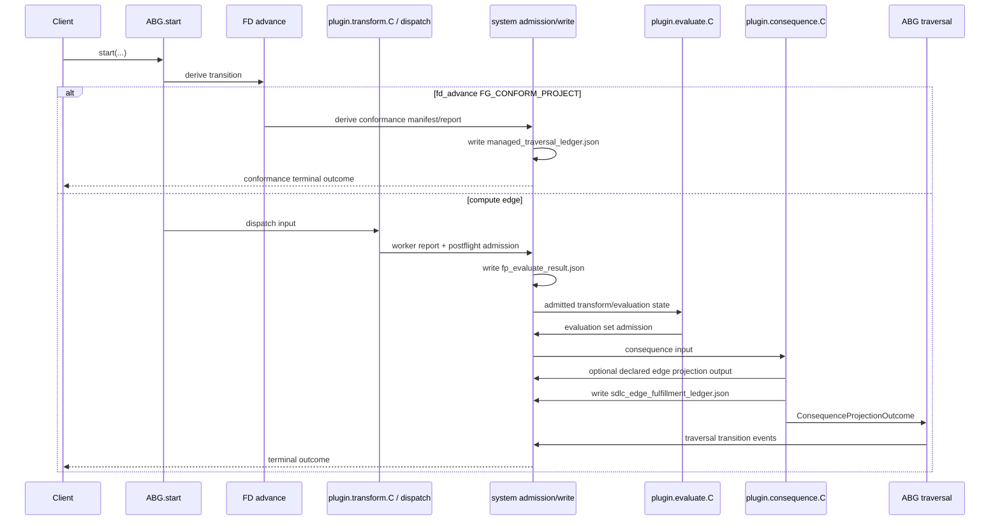
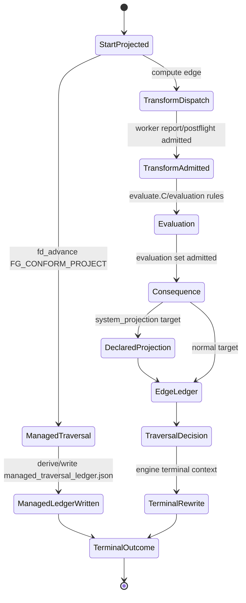

# T-184 Ledger Lifecycle Through ABG Core Loop

Status: review post, current-state analysis. This is not ratified design.

Purpose: describe where the current ledger artifacts sit in the installed
operator lifecycle, from ABG start through transform, evaluate, consequence, and
traversal transition.

## Current Producers And Call Sites

- `managed_traversal_ledger.json`
  - Produced by `deriveConformProjectManagedTraversalLedger(...)`.
  - Source: `build_tenants/typescript/code/src/workspace/project_profile.ts:990`.
  - Called from installed operator FD advance handling:
    `build_tenants/typescript/code/src/operator/installed_operator.ts:7653`.
  - Written as a system artifact:
    `build_tenants/typescript/code/src/operator/installed_operator.ts:7665`.
  - Current role: front-door deterministic conformance advance for
    `FG_CONFORM_PROJECT`, before the compute-edge plugin loop.

- `sdlc_edge_fulfillment_ledger.json`
  - Produced by `constructSdlcEdgeFulfillmentLedger(...)`.
  - Source:
    `build_tenants/typescript/code/src/operator/traversal_consequence.ts:716`.
  - Called during installed traversal consequence derivation:
    `build_tenants/typescript/code/src/operator/installed_operator.ts:6710`.
  - Written through `writeTraversalConsequenceArchive(...)`:
    `build_tenants/typescript/code/src/operator/installed_operator.ts:6971`,
    `build_tenants/typescript/code/src/operator/installed_operator.ts:7011`.
  - Current role: per-edge fulfillment/consequence read model over admitted
    transform/evaluation/consequence state.

Core installed-operator plugin wiring:

- `dispatchThroughInstalledOperator(...)`:
  `build_tenants/typescript/code/src/operator/installed_operator.ts:7839`.
- `evaluateFpForInstalledOperatorState(...)`:
  `build_tenants/typescript/code/src/operator/installed_operator.ts:8316`.
- `projectConsequenceForInstalledOperatorState(...)`:
  `build_tenants/typescript/code/src/operator/installed_operator.ts:8346`.
- Plugin binding:
  `build_tenants/typescript/code/src/operator/installed_operator.ts:8612`.
- Final terminal consequence archive write:
  `build_tenants/typescript/code/src/operator/installed_operator.ts:8700`.

## Ledger Position

There are currently two different lifecycle positions:

1. `managed_traversal_ledger.json` belongs to the front-door managed traversal
   path. It is derived before the ABG compute-edge plugin loop and is not
   produced by the transform/evaluate/consequence chain.

2. `sdlc_edge_fulfillment_ledger.json` belongs to the compute-edge consequence
   path. It is derived from admitted traversal state and archived as part of
   consequence/terminal closure.

Current caveat: the edge fulfillment ledger can be written by the early dispatch
helper path for non-deferred or blocking dispatch states, by the consequence
callback, and by the final terminal rewrite. If T-184 requires strict
consequence ownership, that is the main behavior to review.

## Requirement-Grounded Value

The product and requirements do not treat ledgers as arbitrary archives. They
treat ledgers as deterministic record surfaces that preserve admitted
probabilistic work so later compute can pick it up, replay it, fold it, or route
from it without re-deriving semantic truth from prose, filenames, logs, or worker
self-certification.

Controlling product claims:

- `specification/PRODUCT.md:79` says generic SDLC gates expect configured `F_P`,
  with `F_D` used for deterministic optimization, admission, validation, folding,
  and routing support around that constructive work.
- `specification/PRODUCT.md:113` says ABG owns runtime events, payload
  admission, payload ledgers, assurance projection, closure fold, traversal
  transition, and replay projection.
- `specification/PRODUCT.md:131` gives the stable flow:
  `transform.C -> evaluate.C -> ABG admission -> ABG events/payload ledgers /
  assurance projection / closure fold / traversal transition / replay projection
  -> consequence.C -> odd_sdlc pressure/query/read-model interpretation`.
- `specification/PRODUCT.md:159` says ABG admission is where candidate and
  evaluation payloads become runtime facts.
- `specification/PRODUCT.md:271` says `F_D` may admit returned facts, fold
  ledger rows, compute deterministic closure diagnostics, and route next action
  from admitted truth, but may not replace open-ended `F_P` construction.
- `specification/PRODUCT.md:628` says traversal obligation context is the
  product-level carrier for cumulative realization pressure, and intermediate
  ledgers distribute probabilistic compute across bounded traversals while the
  full chain remains obligation truth.

Controlling requirement claims:

- `REQ-F-ODDSDLC-064` requires close-capable vectors to declare ledger inputs and
  says gain consumes admitted evidence and ledger rows, not worker prose,
  manifest shape, route completion, or postflight success alone.
- `REQ-F-ODDSDLC-066` requires installed execution to carry the selected edge
  assurance contract through handoff, evidence admission, ledgers, closure
  decisions, projections, archives, and replay.
- `REQ-F-ODDSDLC-074` requires typed separation between construction, admission,
  evaluation, projection, closure, and continuation. Its acceptance criteria say
  `evaluate.C/F_P` reads admitted evidence refs and lineage-reachable ledger
  snapshots, fulfillment ledgers carry the installed-operator-published
  `F_P.evaluate` result, and `F_P.transform` must not stand in for the evaluation
  ledger fact.
- `REQ-F-ODDSDLC-084` says ledger rows, events, projections, closure decisions,
  continuation, and replay truth are produced only at or after ABG admission or
  ABG-compatible runtime ingestion, never by plugin prose or worker
  self-certification.

Design support:

- `ODD_SDLC_TYPESCRIPT_FP_EVALUATION_LEDGER_PURPOSE.md:10` states the ledger
  purpose directly: preserve consequential `F_P` evaluation as deterministic,
  replay-visible system truth.
- `ODD_SDLC_TYPESCRIPT_FP_EVALUATION_LEDGER_PURPOSE.md:23` distinguishes event
  log value from ledger value: the event log records that calls/findings/
  admissions happened; the ledger records what the admitted SDLC evaluation
  concluded about the current target and worksite.
- `ODD_SDLC_TYPESCRIPT_FP_EVALUATION_LEDGER_PURPOSE.md:87` says the event log is
  prime runtime fact authority, but is not enough by itself to answer whether the
  current workspace satisfies an SDLC target.
- `ODD_SDLC_TYPESCRIPT_TRAVERSAL_ASSURANCE_INTEGRATION.md:16` says a
  product-realization edge must not close only because a worker wrote files that
  pass path and digest checks; the deterministic sequence is worker result,
  postflight, traversal assurance ledgers, ledger fold, then edge closure or
  replayable gap pressure.

## Ledger Value Classification

| Artifact | Value | Requirement fit | Boundary |
| --- | --- | --- | --- |
| `sdlc_edge_fulfillment_ledger.json` | Deterministic record of admitted edge fulfillment/evaluation truth. This is the surface later closure, replay, gap, and next-action evaluators can consume without trusting worker prose or re-reading raw archives. | Strong. It fulfills `REQ-F-ODDSDLC-064`, `REQ-F-ODDSDLC-066`, `REQ-F-ODDSDLC-074`, and `REQ-F-ODDSDLC-084` when it carries the installed-operator-published `F_P.evaluate` result, selected contract identity, admitted evidence refs, residual pressure, and predecessor facts. | It must be produced only at or after ABG admission / ABG-compatible ingestion. It must not contain independent next-action authority and must not be written by `F_P.transform` prose or worker self-certification. |
| `managed_traversal_ledger.json` | Deterministic conformance record for the bootstrap `Fg_conform_project` managed traversal. Its value is folding the conformance report into a managed traversal shape where there is no prompt-bearing `F_P` worker handoff. | Narrow. `ODD_SDLC_TYPESCRIPT_MANAGED_TRAVERSAL_BOOTSTRAP.md:85` explicitly justifies the bootstrap ledger as a deterministic conformance ledger because the edge has no `F_P` worker handoff and no worker assurance gate. | It is not the generic compute-edge fulfillment ledger. For prompt-bearing edges, the same design says the postprocess ledger fold already exists as postflight plus assurance ledgers plus assurance satisfaction, and those edges must not introduce a second managed-traversal ledger. |

The answer to the value question is therefore:

1. Keep `sdlc_edge_fulfillment_ledger.json` as a real ledger if, and only if, it
   is the deterministic admitted record that probabilistic/evaluator stages use
   as their lineage-reachable edge fact.

2. Keep `managed_traversal_ledger.json` only as the deterministic
   `Fg_conform_project` bootstrap/conformance ledger. It should not generalize
   into a second traversal ledger for prompt-bearing compute edges.

3. Do not purge ledger surfaces just because ABG has events. ABG event truth
   records ordered runtime fact occurrence. The SDLC ledger records admitted
   domain evaluation conclusions over a declared basis. Both are needed, but the
   ledger must be visibly downstream of ABG admission/event identity and not a
   hidden independent runtime.

## Graph Pressure Chain

The SDLC graph sequence is a pressure-preserving construction chain, not a
document checklist.

The product states that schedule/work-plan surfaces sit between design/module
outputs and realization execution so code and test materialization are
constrained by a graph-owned work order, not a hidden operator checklist
(`specification/PRODUCT.md:74`). The graph overlay binds intermediate SDLC
surfaces and typed vector traversals, and each typed vector traversal owns
edge-local gain, evidence, metric, close, residual-pressure, and continuation
computation (`specification/PRODUCT.md:316`, `specification/PRODUCT.md:347`).

The typed construction algebra makes the pressure rule executable:

```text
node(A, B):
  basis = admitted(A)
    + declared_lineage_reachable_ledger_snapshot(A)
    + admitted_dependencies(A)
  candidate = selected transform.C over basis
  authority_output = selected evaluate.C authority rule over basis + candidate
  admitted_pressure = ABG/system F_D admits authority_output
  B = admitted target carrier plus admitted pressure ledgers
  next = consequence.C over admitted ABG state
```

For a chain `A -> B -> C -> D`, the semantic obligations for `D` are the carried
pressure of `(A, B, C)`. Each intermediate surface is both an admitted product
surface for its edge and a dependency-pressure source for the next edge
(`specification/requirements/18-typed-construction-algebra.md:93`).

The current graph catalog expresses the same intended sequence:

```text
input/intent/product/goals
  -> requirement_surface
  -> uat_testcases_surface
  -> testcase_authority_surface
  -> feature_decomp_surface
  -> design_surface
  -> scenario_surface
  -> implementation_design_surface
  -> component_code_surface
  -> component_realization_qualification_surface
  -> code_surface
  -> test_design_surface
  -> tests / execution / release surfaces
```

Key catalog edges:

- `derive_requirement_surface` produces `requirement_surface`.
- `derive_uat_testcases_surface` derives UAT pressure directly from
  requirements before solution design so tests constrain design.
- `derive_testcase_authority_surface` binds UAT rows to requirement pressure
  before design and implementation planning.
- `derive_design_surface` consumes requirement, UAT, testcase-authority, and
  feature-decomposition surfaces.
- `derive_implementation_design_surface` derives the composite implementation
  plan from design and scenarios.
- `derive_component_code_surface` materializes or repairs component-shaped code
  from the implementation plan carrier.

Source:
`build_tenants/typescript/code/src/graph/catalog.ts:166`,
`build_tenants/typescript/code/src/graph/catalog.ts:173`,
`build_tenants/typescript/code/src/graph/catalog.ts:180`,
`build_tenants/typescript/code/src/graph/catalog.ts:194`,
`build_tenants/typescript/code/src/graph/catalog.ts:218`,
`build_tenants/typescript/code/src/graph/catalog.ts:225`.

The RC5/RC3 compute-stage boundary says the same thing in design terms:
design surfaces are not passive assets and not closure tokens; they are the
pressure chain that keeps intent, requirement, design, test, code, execution,
and release obligations alive across the graph. A downstream register is
produced by selected `F_P` evaluation over the incoming design surface plus its
dependency pressure, then admitted by `F_D` into ABG/system ledger truth. A
design surface that is generated and ignored by the downstream register path is
a broken pressure chain
(`build_tenants/typescript/design/ODD_SDLC_TYPESCRIPT_ABG_3_9_RC3_COMPUTE_STAGE_BOUNDARY.md:161`).

That is the direct answer to where ledgers fit: the ledger is the admitted
pressure carrier between vector traversals. It is how requirement pressure
becomes design pressure, how design pressure constrains implementation planning,
and how implementation evidence can later be measured without pretending the
current file artifact is the whole closure basis.

## Pseudocode

```ts
function installedOperatorStart(request) {
  const startFrame = ABG.start({
    graphFunction,
    selectedComposition,
    initialState,
    edgePolicy,
  });

  const transition = selectTraversalTransition(startFrame);

  if (
    transition.kind === "fd_advance" &&
    transition.edge === "FG_CONFORM_PROJECT"
  ) {
    const manifest = deriveConformProjectManagedTraversalManifest({
      startFrame,
      selectedComposition,
      projectProfile,
    });

    const conformanceReport = materializeSdlcProjectConformance({
      manifest,
      projectFiles,
      workspaceFacts,
    });

    const managedTraversalLedger =
      deriveConformProjectManagedTraversalLedger({
        manifest,
        conformanceReport,
        transition,
      });

    system.writeArtifact(
      "managed_traversal_ledger.json",
      managedTraversalLedger,
    );

    system.appendRuntimeEvents({
      kind: "fd_conformance_terminal",
      transition,
      conformanceReport,
    });

    return terminalOutcome({
      status: "complete",
      ledger: managedTraversalLedger,
    });
  }

  const engineResult = ABG.runEngineIterateAsync({
    startFrame,
    plugins: {
      dispatch: plugin.transform.C,
      evaluateFp: plugin.evaluate.C,
      projectConsequence: plugin.consequence.C,
    },
  });

  function plugin.transform.C(dispatchInput) {
    const workerRun = invokeWorkerThroughAbgProcessActor({
      composition: dispatchInput.selectedComposition,
      edge: dispatchInput.edge,
      payload: dispatchInput.payload,
    });

    const workerReport = system.admitWorkerResultReport(workerRun);

    const postflight = system.admitTransformAndEvaluateComputeStage({
      dispatchInput,
      workerReport,
    });

    system.writeArtifact("fp_evaluate_result.json", postflight.fpResult);

    dispatchState.current = {
      dispatchInput,
      workerReport,
      postflight,
      admittedAt: now(),
    };

    if (postflight.isBlocking || postflight.isTerminal) {
      publishDispatchState(dispatchState.current);
      // Current caveat: this may write sdlc_edge_fulfillment_ledger.json
      // before the consequence callback owns the edge projection.
    }

    return FpDispatchOutcome.from(postflight);
  }

  function plugin.evaluate.C(evaluateInput) {
    const state = refreshFromFpEvaluatorRegisterIfNeeded({
      evaluateInput,
      dispatchState: dispatchState.current,
    });

    const evaluation = evaluateEdgePolicy({
      edgePolicy,
      admittedTransformState: state,
    });

    system.admitEvaluationSet(evaluation);

    return FpEvaluationOutcome.from(evaluation);
  }

  function plugin.consequence.C(consequenceInput) {
    const admittedState = dispatchState.current;

    if (consequenceInput.target.kind === "system_projection") {
      system.writeDeclaredEdgeProjectionOutput({
        target: consequenceInput.target,
        admittedState,
      });
    }

    const consequence = deriveInstalledTraversalConsequence({
      consequenceInput,
      admittedState,
      engineContext: consequenceInput.engineContext,
    });

    const edgeFulfillmentLedger = constructSdlcEdgeFulfillmentLedger({
      admittedState,
      consequence,
      edgePolicy,
      selectedComposition: consequenceInput.selectedComposition,
    });

    const closureDecision = deriveSdlcEdgeClosureDecision({
      edgeFulfillmentLedger,
      consequence,
    });

    const nextActionProjection = constructSdlcNextActionProjection({
      closureDecision,
      consequence,
    });

    system.writeTraversalConsequenceArchive({
      "sdlc_edge_fulfillment_ledger.json": edgeFulfillmentLedger,
      "sdlc_edge_closure_decision.json": closureDecision,
      "sdlc_next_action_projection.json": nextActionProjection,
    });

    return ConsequenceProjectionOutcome.from({
      consequence,
      closureDecision,
      nextActionProjection,
    });
  }

  const terminalConsequence = deriveInstalledTraversalConsequence({
    admittedState: dispatchState.current,
    engineContext: engineResult.terminalContext,
  });

  system.writeTraversalConsequenceArchive(terminalConsequence.archive);

  system.appendRuntimeEvents({
    kind: "traversal_transition_terminal",
    engineResult,
    terminalConsequence,
  });

  return terminalOutcome({
    status: engineResult.status,
    consequence: terminalConsequence,
  });
}
```

## Sequence Diagram



## State Diagram



## Remaining Review Points

1. The early dispatch helper path still needs review. If it writes
   `sdlc_edge_fulfillment_ledger.json` before ABG admission/consequence
   ownership is established, it violates the requirement-grounded value above.
   If it is only serializing already admitted consequence truth for crash-safe
   return, that should be made explicit in code and catalog metadata.

2. The artifact catalog should classify `sdlc_edge_fulfillment_ledger.json` by
   its requirement role: admitted edge evaluation/fulfillment record over ABG
   truth. It should not appear as installed-operator local authority or worker
   report compatibility output.

3. `managed_traversal_ledger.json` should stay explicitly scoped to
   `FG_CONFORM_PROJECT` / `Fg_conform_project`. Any use on prompt-bearing
   transform/evaluate/consequence edges should be deleted or collapsed into the
   existing assurance/fulfillment ledger path.

4. Runtime event append must cite ABG event identity and millisecond event-time
   truth for any event that selects, admits, supersedes, or replays a ledger. The
   ledger depends on event-source ordering; it is not a replacement for event
   truth.
