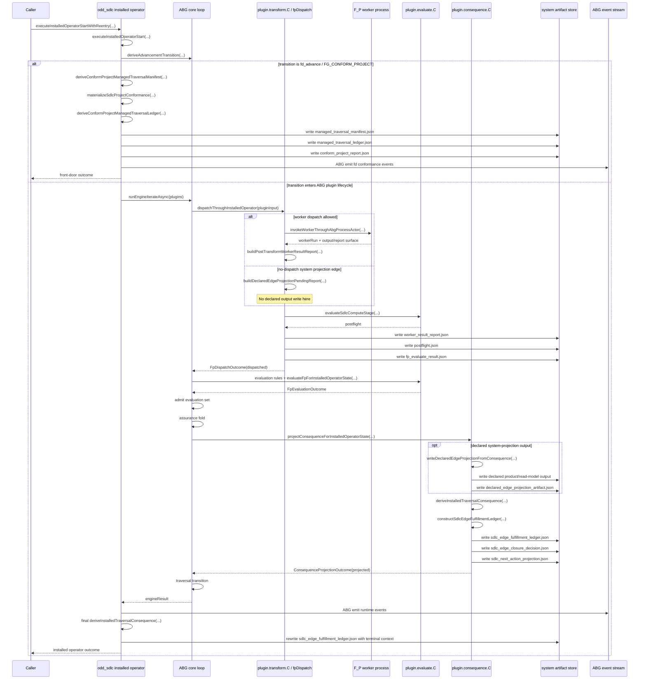
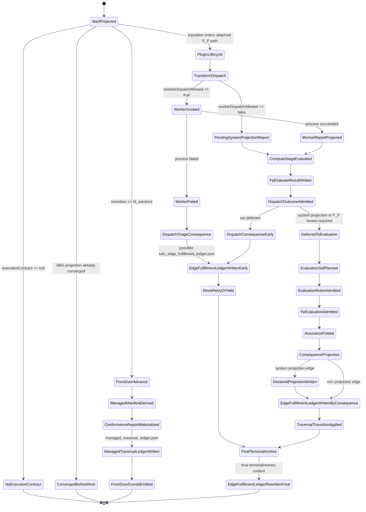

# T-184 Ledger Lifecycle Review

Status: current-state review post, not ratified design.
Scope: the two remaining installed-operator ledger artifacts:

- `managed_traversal_ledger.json`
- `sdlc_edge_fulfillment_ledger.json`

Source anchors:

- `managed_traversal_ledger.json` is derived by
  `deriveConformProjectManagedTraversalLedger(...)` in
  `build_tenants/typescript/code/src/workspace/project_profile.ts`.
- `managed_traversal_ledger.json` is written in the `fd_advance` /
  `FG_CONFORM_PROJECT` branch of `executeInstalledOperatorStart(...)` in
  `build_tenants/typescript/code/src/operator/installed_operator.ts`.
- `sdlc_edge_fulfillment_ledger.json` is constructed by
  `constructSdlcEdgeFulfillmentLedger(...)` through
  `deriveInstalledTraversalConsequence(...)`.
- `sdlc_edge_fulfillment_ledger.json` is written by
  `writeTraversalConsequenceArchive(...)`.

## 1. Pseudocode

```ts
function ABG_start_over_odd_sdlc(input) {
  start = odd_sdlc.projectStart(input)

  if (start.executionContract == null) {
    return blocked_or_converged_without_plugin_lifecycle()
  }

  basis = start.executionContract.basis
  replayEvents = read_ABG_runtime_events()
  transition = ABG.deriveAdvancementTransition(basis, replayEvents)

  // Ledger 1: managed_traversal_ledger.json
  // This is outside the normal transform/evaluate/consequence plugin chain.
  // It is front-door project conformance bookkeeping for the deterministic
  // FG_CONFORM_PROJECT transition.
  if (transition.kind == "fd_advance") {
    assert(transition.edge == FG_CONFORM_PROJECT)

    managedManifest =
      deriveConformProjectManagedTraversalManifest(workspaceRoot)

    conformReport =
      materializeSdlcProjectConformance(workspaceRoot)

    managedTraversalLedger =
      deriveConformProjectManagedTraversalLedger({
        workspaceRoot,
        manifest: managedManifest,
        report: conformReport
      })

    writeSdlcSystemArtifact("managed_traversal_manifest.json", managedManifest)
    writeSdlcSystemArtifact("managed_traversal_ledger.json", managedTraversalLedger)
    writeSdlcSystemArtifact("conform_project_report.json", conformReport)

    ABG.emit(fd_conformance_events)
    return front_door_transition_outcome()
  }

  selectedComposition = ABG.selectedComposition(basis, transition)

  plugins = createSdlcAbgPluginSet({
    dispatch: dispatchThroughInstalledOperator,
    evaluateFp: evaluateFpForInstalledOperatorState,
    projectConsequence: projectConsequenceForInstalledOperatorState,
    evaluateDesignDepth,
    evaluateReviewGradeEdgeFulfillment
  })

  engineResult = ABG.runEngineIterateAsync({
    basis,
    runtimeEvents: replayEvents,
    plugins
  })

  // ABG core loop shape, simplified:
  //
  // 1. ABG calls plugin.transform.C through fpDispatch.
  // 2. ABG admits transform outcome.
  // 3. ABG plans and runs evaluation set.
  // 4. ABG admits evaluation results.
  // 5. ABG folds assurance.
  // 6. ABG calls plugin.consequence.C.
  // 7. ABG admits consequence projection.
  // 8. ABG applies traversal transition.
}

async function dispatchThroughInstalledOperator(pluginInput) {
  manifest = deriveWorkerHandoffManifest(pluginInput)
  selectedComposition = selectedCompositionFrom(pluginInput)

  if (edgePolicy.workerDispatchAllowed == false) {
    // Projection-only edge:
    // Dispatch does not write declared edge output now.
    // It creates a pending system-projection report so evaluate.C can admit the
    // edge state before consequence.C materializes the declared projection.
    workerReport =
      buildDeclaredEdgeProjectionPendingReport(manifest)

    postflight =
      evaluateSdlcComputeStage(manifest, workerReport)

    fpEvaluateResult =
      writeSdlcFpEvaluateResult(manifest, selectedComposition, workerReport, postflight)

    dispatchState.current = {
      status: "worker_invoked",
      manifest,
      selectedComposition,
      workerRun: null,
      workerReport,
      postflight,
      assuranceSatisfaction,
      currentEdge: null
    }

    return ABG.FpDispatchOutcome("dispatched", workerReportRef)
  }

  workerRun =
    invokeWorkerThroughAbgProcessActor(manifest, pluginInput)

  if (workerRun.failed) {
    postflight = constructWorkerProcessFailurePostflight(manifest, workerRun)

    // Current code may publish a dispatch-time consequence for failure triage.
    // That path can write sdlc_edge_fulfillment_ledger.json through
    // publishDispatchState(...) -> writeTraversalConsequenceArchive(...).
    consequence = publishDispatchState(worker_failed_state)

    return blocked_or_retry_outcome(consequence)
  }

  workerReport =
    buildPostTransformWorkerResultReport(manifest)

  postflight =
    evaluateSdlcComputeStage(manifest, workerReport)

  fpEvaluateResult =
    writeSdlcFpEvaluateResult(manifest, selectedComposition, workerReport, postflight)

  dispatchState.current = {
    status: "worker_invoked",
    manifest,
    selectedComposition,
    workerRun,
    workerReport,
    postflight,
    assuranceSatisfaction,
    currentEdge: null
  }

  if (shouldDeferDispatchConsequenceToFpEvaluator(dispatchState.current)) {
    // Normal path for system-projection and deeper F_P review cases:
    // do not write edge fulfillment ledger yet.
    return ABG.FpDispatchOutcome("dispatched", workerReportRef)
  }

  // Non-deferred path:
  // Current code can derive/write consequence during dispatch.
  consequence = publishDispatchState(dispatchState.current)
  return dispatch_outcome_using(consequence)
}

async function evaluateFpForInstalledOperatorState(pluginInput) {
  state = dispatchState.current

  state =
    refreshDesignDepthStateFromFpEvaluatorRegister(state)

  return fpEvaluationOutcomeForDispatchState({
    pluginInput,
    state
  })
}

function projectConsequenceForInstalledOperatorState(pluginInput) {
  state = dispatchState.current
  assertSelectedCompositionMatches(pluginInput, state.selectedComposition)

  // Consequence-stage product/read-model projection.
  // For declared system-projection edges, this is where the target output is
  // materialized.
  declaredEdgeProjectionRefs =
    writeDeclaredEdgeProjectionFromConsequence(state.manifest)

  consequence =
    deriveInstalledTraversalConsequence({
      basis,
      start,
      state,
      replayEvents,
      emittedEvents,
      nextVectorIndex
    })

  // Ledger 2: sdlc_edge_fulfillment_ledger.json
  //
  // deriveInstalledTraversalConsequence(...) constructs:
  // - worksite evidence
  // - edge gain
  // - residual pressure
  // - closure decision
  // - next-action projection
  // - edge fulfillment ledger
  //
  // writeTraversalConsequenceArchive(...) writes the ledger artifact.
  writeTraversalConsequenceArchive({
    manifest: state.manifest,
    consequence
  })

  return ABG.ConsequenceProjectionOutcome({
    status: "projected",
    consequenceRef: consequence.consequenceProjection.consequenceRef,
    domainReadModelRefs: [
      ...consequence.consequenceProjection.domainReadModelRefs,
      ...declaredEdgeProjectionRefs
    ]
  })
}

function deriveInstalledTraversalConsequence(input) {
  edgeGain =
    measureSdlcEdgeGain({
      admittedEvidence,
      ledgerInputs: [
        "sdlc_edge_fulfillment_ledger",
        "sdlc_edge_closure_decision",
        "sdlc_next_action_projection"
      ],
      targetCarrierAdmission
    })

  edgeResidualPressure =
    deriveSdlcEdgeResidualPressure(edgeGain)

  edgeClosureDecision =
    deriveSdlcEdgeClosureDecision(edgeGain, edgeResidualPressure)

  edgeFulfillmentLedger =
    constructSdlcEdgeFulfillmentLedger({
      selectedComposition,
      ledgerRef,
      ledgerVersionRef,
      edgeRef,
      attemptRef,
      targetBindingRefs,
      evidenceBundleRefs,
      materializationRefs,
      admissionRefs,
      downstreamPressureRefs,
      counts,
      targetCertificationPassed,
      fdRecheckPassed,
      predecessorRefs
    })

  nextActionProjection =
    constructSdlcNextActionProjection(edgeClosureDecision)

  return {
    edgeFulfillmentLedger,
    edgeClosureDecision,
    nextActionProjection,
    consequenceProjection
  }
}

function final_terminal_archive_rewrite(engineResult, completedDispatchState) {
  terminal = engineResult.transition.kind == "terminal"
    ? engineResult.transition
    : null

  // Current code derives the traversal consequence again after the engine
  // returns so the archive includes terminal/reentry facts.
  traversalConsequence =
    deriveInstalledTraversalConsequence({
      basis,
      start,
      state: completedDispatchState,
      replayEvents,
      emittedEvents,
      engineTerminal: terminal,
      nextVectorIndex: engineResult.projection.nextVectorIndex
    })

  ABG.emit(post_action_reentry_events)

  // This can rewrite sdlc_edge_fulfillment_ledger.json for the same run with
  // the final terminal context.
  writeTraversalConsequenceArchive({
    manifest: completedDispatchState.manifest,
    consequence: traversalConsequence
  })
}
```

## 2. Sequence Diagram



## 3. State Diagram



## Review Notes

- `managed_traversal_ledger.json` is not part of the transform/evaluate/
  consequence plugin lifecycle. It is deterministic front-door conformance
  bookkeeping for `FG_CONFORM_PROJECT`.
- `sdlc_edge_fulfillment_ledger.json` is part of consequence construction, but
  current code can still write it from multiple places:
  - dispatch-time consequence for non-deferred or failure triage paths
  - `plugin.consequence.C` callback
  - final terminal archive rewrite after ABG returns
- If the target law is that only ABG/system owns ledgers, then the remaining
  review question is whether `sdlc_edge_fulfillment_ledger.json` should remain
  an odd_sdlc domain ledger artifact, become an ABG payload ledger view, or be
  renamed/reclassified as a consequence read model.
