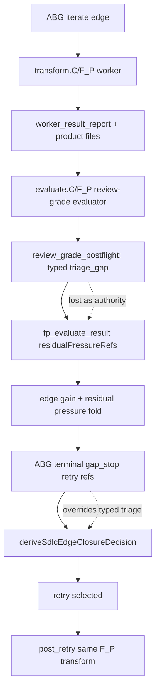
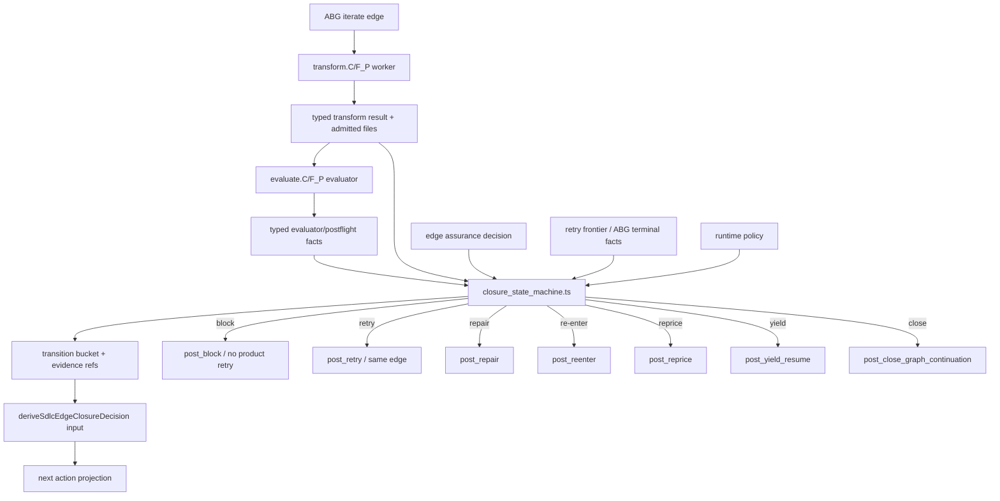
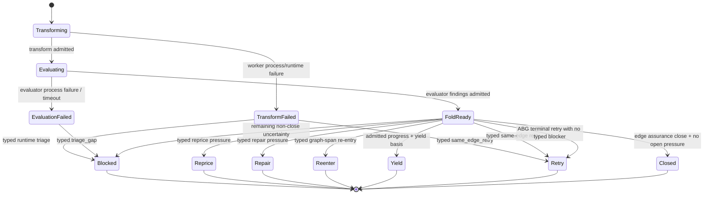

# T-188 Typed Continuation State Machine Design

Date: 2026-06-04T02:03:21+10:00
Author: Codex
Status: design post / commentary, attached to active T-188
Ticket: `.ai-workspace/tickets/active/T-188-force-fp-depth-through-iteration-and-prompt-control.md`
Requirement: `specification/requirements/18-typed-construction-algebra.md`
`REQ-F-ODDSDLC-086`

## Claim

The current hello-world Sonnet-high failure is a state-machine bug.

The runtime admitted a typed review-grade evaluator process failure:

```text
review_grade_evaluator_process_failed
reasonClass: assurance
lawfulReentryPoint: triage_gap
```

The later closure/consequence path still selected:

```text
disposition: retry
next action: post_retry/derive_lite_component_code_surface
```

That means typed event-calculus facts were collapsed into pressure strings and
then reinterpreted by fallback heuristics. The deterministic state machine is
not coherent enough.

## Observed Run

Run root:

```text
build_tenants/typescript/test_env/test_runs/scenario_t132_hello_world_js_live/20260603T153222191Z_pid19186
```

Good state before the bug:

- design edge closed;
- code edge dispatched;
- `src/hello.js` materialized;
- `test/hello.test.js` materialized;
- manual sandbox proof passed:
  - `node src/hello.js`
  - `node --test test/hello.test.js`

Failure state:

- code-edge review-grade evaluator stopped by ABG inactivity brake;
- `review_grade_postflight.json` carried typed `triage_gap`;
- `sdlc_edge_closure_decision.json` still selected `retry`;
- runtime started a second `component_code_surface` transform attempt.

## Current Broken Flow



The bad transition is not the evaluator failure. The evaluator failure is a
valid typed runtime fact. The bad transition is converting that fact into a
same-edge product transform retry.

## Target Flow



The state machine chooses the transition class. Pressure refs and terminal refs
are evidence attached to that transition, not transition authority.

## Module Boundary

Create one module:

```text
build_tenants/typescript/code/src/operator/closure_state_machine.ts
```

Boundary:

The generic event-calculus invariant is ABG-shaped: admitted runtime facts
should replay to one total continuation transition, and terminal strings should
remain evidence rather than transition authority.

This T-188 module is the SDLC-owned policy adapter for that invariant. It does
not implement a generic ABG kernel. It maps SDLC-specific admitted facts
(`SdlcBlockingReasonLawfulReentryPoint`, SDLC residual pressure refs, SDLC yield
basis, and ABG terminal retry refs) into one SDLC closure disposition and hands
that transition to the existing closure-decision carrier.

When ABG exposes the generic transition primitive, this module should shrink to
the SDLC policy table plus input projection.

This module owns all SDLC transition classification logic for installed edge
continuation.

Allowed outside the module:

- gathering typed inputs from archives/runtime state;
- measuring edge gain;
- writing artifacts;
- projecting next action after the module returns the transition bucket.

Not allowed outside the module:

- mapping `SdlcBlockingReasonLawfulReentryPoint` to closure disposition;
- deciding whether ABG terminal retry pressure outranks typed triage;
- deriving retry/repair/reprice/block from residual-pressure string contents;
- synthesizing a gap dossier with a different lawful re-entry class than the
  state-machine transition.

Not owned by this module:

- generic ABG replay/state-machine kernel derivation;
- runtime event admission or event ordering;
- model-specific lease budgets.

## State Inputs

```ts
type ContinuationInput = {
  edgeAttempt: {
    status:
      | "transform_not_started"
      | "transform_failed"
      | "transform_admitted"
      | "evaluate_failed"
      | "evaluate_admitted"
      | "consequence_projected";
    currentEdgeRef: string;
    vectorIndex: number;
  };
  typedBlockingReasons: readonly SdlcBlockingReason[];
  postflight: SdlcPostflightResult | null;
  edgeAssuranceDecision: SdlcEdgeAssuranceCloseDecision | null;
  edgeResidualPressureRefs: readonly string[];
  abgTerminalRetryRefs: readonly string[];
  repairPressureRefs: readonly string[];
  repricePressureRefs: readonly string[];
  yieldResumeBasis: SdlcYieldResumeBasis | null;
  targetCarrierAdmissionStatus: "admitted" | "missing" | "rejected";
  runtimePolicy: SdlcOperatorRuntimePolicy;
};
```

The caller may include pressure refs, but pressure refs enter as evidence.
They do not decide the bucket when typed reasons are present.

## Transition Output

```ts
type ContinuationTransition = {
  disposition:
    | "close"
    | "yield"
    | "reprice"
    | "repair"
    | "re-enter"
    | "retry"
    | "block";
  retryReasonRefs: readonly string[];
  repairReasonRefs: readonly string[];
  reenterReasonRefs: readonly string[];
  repriceReasonRefs: readonly string[];
  blockReasonRefs: readonly string[];
  yieldResumeBasis: SdlcYieldResumeBasis | null;
  evidenceRefs: readonly string[];
  explanationCode:
    | "closed"
    | "yield_progress"
    | "typed_reprice"
    | "typed_repair"
    | "typed_reenter"
    | "typed_retry"
    | "typed_block_or_triage"
    | "abg_terminal_retry"
    | "edge_assurance_block"
    | "unsupported_state_block";
};
```

## Transition Priority

The transition is deterministic and total.

| Priority | Condition | Disposition |
| ---: | --- | --- |
| 1 | typed `triage_gap`, `operator_blocked`, unsupported re-entry, evaluator process failure, runtime process triage | `block` |
| 2 | typed `reprice_requirement_or_design` or runtime-policy reprice | `reprice` |
| 3 | typed `repair_worker_output` | `repair` |
| 4 | typed `escalate_to_fp` or graph-span re-entry basis | `re-enter` |
| 5 | valid yield basis and no higher-priority blocker | `yield` |
| 6 | typed `same_edge_retry` and no higher-priority blocker | `retry` |
| 7 | ABG terminal retry refs and no typed blocker/reprice/repair/re-enter/yield/retry | `retry` |
| 8 | edge assurance close with no open pressure | `close` |
| 9 | any remaining non-close uncertainty | `block` |

The important rule is priority 1: typed triage cannot become product retry.

## Pseudocode

```ts
function deriveContinuationTransition(input: ContinuationInput): ContinuationTransition {
  const typed = normalizeTypedReasons(input.typedBlockingReasons, input.postflight);

  const buckets = bucketReasonsByLawfulReentry(typed);

  if (buckets.block.length > 0) {
    return block("typed_block_or_triage", buckets.block, input);
  }

  if (buckets.reprice.length > 0) {
    return reprice("typed_reprice", buckets.reprice, input);
  }

  if (buckets.repair.length > 0) {
    return repair("typed_repair", buckets.repair, input);
  }

  if (buckets.reenter.length > 0) {
    return reenter("typed_reenter", buckets.reenter, input);
  }

  if (input.yieldResumeBasis !== null && noHigherPriorityPressure(input)) {
    return yieldTransition("yield_progress", input.yieldResumeBasis, input);
  }

  if (buckets.retry.length > 0) {
    return retry("typed_retry", buckets.retry, input);
  }

  if (input.abgTerminalRetryRefs.length > 0 && typed.length === 0) {
    return retry("abg_terminal_retry", input.abgTerminalRetryRefs, input);
  }

  if (edgeCanClose(input)) {
    return close("closed", input);
  }

  return block("unsupported_state_block", allEvidenceRefs(input), input);
}
```

```ts
function bucketReasonsByLawfulReentry(reasons: readonly SdlcBlockingReason[]) {
  return {
    retry: reasonsFor("same_edge_retry"),
    repair: reasonsFor("repair_worker_output"),
    reenter: reasonsFor("escalate_to_fp"),
    reprice: reasonsFor("reprice_requirement_or_design"),
    block: reasons.filter((reason) =>
      reason.lawfulReentryPoint === "triage_gap" ||
      reason.lawfulReentryPoint === "operator_blocked" ||
      !explicitlyTransitionable(reason.lawfulReentryPoint)
    )
  };
}
```

## State Diagram



## Flow Through Plugins

```ts
async function ABG_plugin_loop(pluginInput) {
  transformOutcome = await plugin.transform.C(pluginInput);
  admittedTransform = system.admitTransform(transformOutcome);

  evaluateOutcome = await plugin.evaluate.C(admittedTransform);
  admittedEvaluation = system.admitEvaluation(evaluateOutcome);

  edgeAssurance = system.measureEdgeAssurance({
    admittedTransform,
    admittedEvaluation
  });

  transition = closureStateMachine.deriveContinuationTransition({
    edgeAttempt: currentAttempt(admittedTransform, admittedEvaluation),
    typedBlockingReasons: typedReasonsFrom(admittedEvaluation, postflight),
    postflight,
    edgeAssuranceDecision: edgeAssurance.closeDecision,
    edgeResidualPressureRefs: edgeAssurance.residualPressureRefs,
    abgTerminalRetryRefs: terminalRetryRefs,
    repairPressureRefs,
    repricePressureRefs,
    yieldResumeBasis,
    targetCarrierAdmissionStatus,
    runtimePolicy
  });

  closureDecision = system.deriveClosureDecisionFromTransition(transition);
  nextAction = plugin.consequence.C({ closureDecision, transition });
  system.admitConsequence(nextAction);
  system.advanceOrStop(nextAction);
}
```

The plugin loop remains staged, but the transition law is one function.

## Required Tests

1. State-machine table test:
   every `SdlcBlockingReasonLawfulReentryPoint` maps to one transition bucket.

2. Evaluator-process-failure regression:
   typed `review_grade_evaluator_process_failed + triage_gap` plus ABG terminal
   retry refs returns `block`, not `retry`.

3. ABG fallback regression:
   ABG terminal retry refs return `retry` only when no typed higher-priority
   state exists.

4. Repair/re-enter/reprice/yield regression:
   each typed state maps to the expected disposition and reason ref bucket.

5. Installed-operator integration regression:
   code-edge product files plus failed review-grade evaluator produce
   `post_block`/triage and do not select
   `post_retry/derive_lite_component_code_surface`.

6. Consolidation guard:
   no file outside `closure_state_machine.ts` may map
   `SdlcBlockingReasonLawfulReentryPoint` to closure disposition or derive
   retry/repair/block from pressure-string contents.

7. Fallback guard:
   ABG terminal retry refs plus any typed reason bucket never use the ABG
   terminal fallback path. Terminal retry is available only when no typed
   transition fact exists.

## Review Conditions Accepted

### 1. Migrate And Remove

The module is not an adapter on top of existing scattered deciders. It must
replace them.

Required migration:

- move lawful-reentry-point to disposition mapping into
  `closure_state_machine.ts`;
- move pressure-ref fallback classification into `closure_state_machine.ts`;
- make `installed_operator.ts` gather state and call the module;
- keep `traversal_consequence.ts` as the closure-decision carrier builder,
  not the place that discovers transition class from mixed runtime facts;
- add a guard test that fails when transition mapping appears outside the
  module.

### 2. Evaluator Process Failure Decision

For this T-188 slice, evaluator process failure is fail-closed `block`.

Reason:

- the observed bug was product transform retry after evaluator failure;
- a bounded evaluate.C-only retry is a different transition kind and requires
  explicit typed policy, retry budget, and proof;
- model-specific lease tuning belongs in runtime policy, not in the transition
  state machine.

Future extension:

```text
evaluate.C process failure
-> typed evaluator_retry_allowed by runtime policy
-> evaluate.C-only retry
```

That extension must not dispatch `transform.C` and must not be inferred from
ABG terminal fallback pressure.

### 3. Demoted ABG Terminal Fallback

ABG terminal retry is a fallback only.

It can select `retry` only when the state-machine input contains no typed
blocking reason in any bucket. It is not a competing authority against typed
`block`, `reprice`, `repair`, `re-enter`, `yield`, or typed `retry`.

The shipped retry brake limits blast radius. It does not correct this state
transition bug. The correctness fix is this state machine.

## Non-Goals

- Do not change generated hello-world or data_mapper product code.
- Do not make F_D evaluate product depth.
- Do not add stack-specific retry defaults.
- Do not distribute transition rules across multiple files.
- Do not rely on pressure-ref string contents as transition authority.
