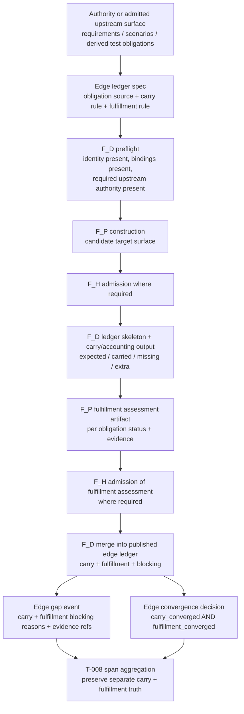
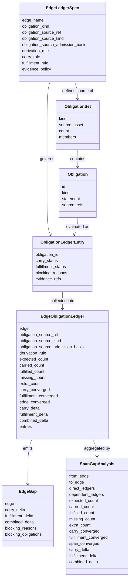
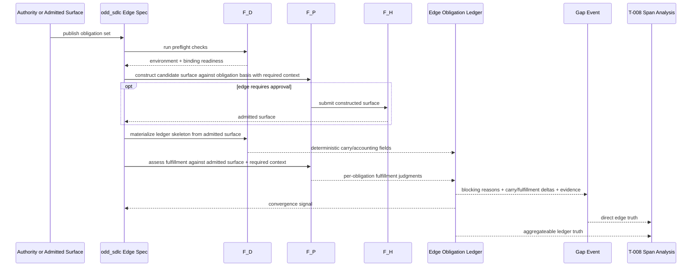

# B-019 F_P Gap Analysis Conflates Traceability With Implementation Completeness

- id: B-019
- title: Replace blended semantic convergence with per-edge obligation ledgers that separate traceability carry from fulfillment completeness
- type: bug
- severity: sev-1
- status: active
- goal: requirement-realization-fidelity
- priority: critical
- created_at: 2026-04-17
- updated_at: 2026-04-18
- dependencies: abiogenesis B-014 completed; `odd_sdlc` must now migrate fully onto that published fulfillment-truth ABI

## Triage

- intake: pipeline evaluation correctness / false convergence signal / silent feature failure
- change_intent: restore truthful gap analysis by making each constructive edge preserve an explicit obligation set and score each obligation for both carry and fulfillment
- change_class: requirement_reprice
- re_entry_point: requirements_and_evaluator_design
- triaged_at: 2026-04-18
- lawful_change_class: requirement_reprice
- affected_boundary: odd_sdlc evaluator contracts, edge-level gap analysis, deterministic closure ledgers, span aggregation, and downstream proving
- lawful_re_entry: requirements and evaluator design surfaces first; then GTL edge configuration, deterministic ledger publication, evaluator prompt/operator implementation, and re-proving on a fresh workspace
- downstream_proof_span: a workspace where shallow stubs are present must not converge with `edge_converged = true`; re-run must surface behavioral gaps with named per-edge obligations and blocking reasons

## Bug Statement

The current `*_semantically_converged` F_P evaluators collapse two distinct
questions into one pass/fail signal:

1. **Traceability carry** — the current surface still carries the named
   obligations from the prior authoritative set.
2. **Fulfillment completeness** — the current surface actually fulfills those
   obligations.

The current pipeline treats concern `1` as if it were concern `2`.

A file tagged `// Implements: REQ-LDM-001` may still be behaviorally empty.
Today, structural carry plus tag coverage is frequently enough to satisfy
`semantically_converged`, so the system emits a closed edge for work that is
still incomplete.

This is not merely a weak prompt problem. It is a missing domain model:

- the pipeline does not preserve an explicit obligation set per edge
- it does not score each obligation for carry and fulfillment separately
- gap events are therefore derived from whole-surface impressions instead of
  from an obligation ledger

This does **not** justify inventing a second parallel tracking system.
`odd_sdlc` already has an existing traceability and requirement-closure lineage:

- `traceability.py`
- `build_requirement_closure_register(...)`
- the current requirement-closure register published for the active workspace

The lawful fix extends that existing register family. It does not replace it
with a new shadow tracker.

## Why This Matters

`odd_sdlc` is intentionally built around gap analysis. If gap analysis is wrong,
the whole convergence story is wrong:

- shallow scaffolds can look complete
- reruns have no pressure surface
- release can close honestly at the stack level but dishonestly at the
  realization level
- `T-008` can zoom over a span, but it will only aggregate the truth it is
  given; if per-edge truth is wrong, span truth is wrong

This ticket fixes the semantics of gap analysis itself, including the semantic
refactor needed to keep `T-008` truthful.

## Carried Requirement

The lawful bounded span-gap capability is already carried in `odd_sdlc`
authority and remains in force. This ticket must preserve and deepen that
published requirement rather than treating it as open ticket-only history.

Current authority already carries it here:

- [10-odd-sdlc-software-domain-buildout.md](/Users/jim/src/apps/odd_sdlc/specification/requirements/10-odd-sdlc-software-domain-buildout.md:167)
  `REQ-F-ODDSDLC-020 / AC-4` requires operator-facing gap analysis to lawfully
  zoom over a bounded span between graph points and their dependent realizing
  structure
- [PRODUCT.md](/Users/jim/src/apps/odd_sdlc/specification/PRODUCT.md:462)
  publishes bounded operator-invoked span gap analysis as active product
  behavior
- [PRODUCT.md](/Users/jim/src/apps/odd_sdlc/specification/PRODUCT.md:522)
  publishes the current `odd_sdlc gaps --from-edge ... --to-edge ... --zoom ...`
  surface

So `B-019` is a semantic refactor of an already-published capability:

- `T-008` remains closed
- the span-gap requirement remains active
- `B-019` must correct the truth model consumed by that active capability

## Disambiguated Boundary

The fix belongs in `odd_sdlc`, not ABG.

### ABG owns

- dispatch
- bindings
- prompt assembly mechanism
- certification and event carriage
- convergence orchestration

### odd_sdlc owns

- what obligations exist on an edge
- what counts as carry
- what counts as fulfillment
- what evidence is sufficient
- what a blocking reason means

### Architectural Decision

No separate ABG tracking lane is needed or wanted.

Feature/obligation tracking remains a **domain evaluator concern**. ABG carries
the resulting facts, but it does not define domain-semantic fulfillment.

The governing operational sequence is:

1. `F_D` preflight confirms the current authority/input state is present and
   admissible.
2. `F_P` performs bounded construction of the next semantic surface.
3. `F_H` may ratify that surface where the edge requires approval.
4. The admitted surface becomes the deterministic basis for downstream `F_D`
   carry/accounting checks.

So `F_P` is not constitutional truth by itself, but an admitted `F_P` result can
become the current authoritative work basis for the next edge.

## The Missing Model

The intended model is:

1. authority or an already-admitted upstream surface publishes the current
   obligation set.
   Example: input documents become `n` requirements through an admitted
   `requirements` surface.
2. Every downstream edge preserves that same named set, or a declared derived
   subset of it.
3. For each obligation on that edge, the system must answer two questions:
   - was it still carried?
   - was it actually fulfilled?
4. The edge publishes a ledger and gap events are derived from that ledger.

What was lost is **obligation accounting**.

The system drifted from:

- `n` named things in, `n` named things tracked, `n` named things evaluated

to:

- a coarse whole-surface judgment that structural similarity implies completion

## Required Enduring Fix

The enduring fix is a **per-edge obligation ledger**.

Not:

- a global ABG tracking lane
- a one-off prompt tweak at `code_surface`
- a LOC threshold disguised as law

But:

- edge-local declared obligation source
- edge-local carry rules
- edge-local fulfillment rules
- `F_D`-materialized per-obligation ledger skeleton and carry/accounting output
- `F_P` fulfillment evaluation against that admitted ledger basis
- span analysis aggregating those ledgers

These per-edge ledgers are an extension/projection of the existing
traceability/closure register family. They should share the same lineage and
published truth rather than becoming a rival mechanism.

The generic reusable `F_D` layer here is **obligation accounting**:

- obligation present
- obligation id stable
- source-set lineage declared
- no silent drop
- no unexplained extra
- evidence artifact present where deterministically checkable

That is the most generic deterministic layer available. `F_D` materializes the
ledger skeleton and may close carry/accounting only at that superficial level.
It must not close semantic fulfillment except in trivial deterministic cases.
Fulfillment remains an `F_P` judgment written against the admitted surface and
the `F_D` ledger basis.

## SDLC Domain Model

### Core Rule

Every constructive edge must define:

- the obligation set it starts from
- how obligations are carried into the target surface
- how fulfillment is assessed at that target surface

### Ledger Shape

Each edge publishes an `edge_obligation_ledger` with at least:

- `edge`
- `obligation_kind`
- `obligation_source_ref`
- `obligation_source_kind`
- `obligation_source_admission_basis`
- `derivation_rule`
- `expected_count`
- `carried_count`
- `fulfilled_count`
- `partial_count`
- `missing_count`
- `extra_count`
- `carry_converged`
- `fulfillment_converged`
- `edge_converged`
- `carry_delta`
- `fulfillment_delta`
- `combined_delta`
- `blocking_reasons`
- `obligations`

`combined_delta` is optional and derived. It is a projection convenience, not
the law. Closure is determined by `carry_converged` and
`fulfillment_converged`, not by a bare scalar.

Each obligation entry publishes at least:

- `id`
- `kind`
- `statement`
- `source_refs`
- `carry_status`
- `fulfillment_status`
- `blocking_reasons`
- `evidence_refs`

### Ledger Lifecycle

The ledger lifecycle is single-model and explicit:

1. authority or an admitted upstream surface publishes the obligation set
2. `F_D` performs preflight checks on environment, bindings, and required
   upstream authority surfaces
3. `F_P` constructs the candidate target surface from that obligation basis and
   the required edge context
4. `F_H` admits the candidate surface where that edge requires approval
5. `F_D` materializes the edge ledger skeleton from the obligation set and the
   admitted target surface
6. `F_D` fills deterministic carry/accounting facts:
   - expected membership
   - carried membership
   - missing members
   - extra members
   - source-set lineage
   - deterministically checkable evidence presence
7. `F_P` evaluates fulfillment against that admitted ledger basis and emits a
   typed fulfillment assessment artifact keyed by obligation id
8. `F_H` admits that fulfillment assessment artifact where the edge requires
   admitted semantic judgment
9. `F_D` merges the admitted fulfillment assessment into the published edge
   ledger
10. edge closure is computed from the resulting ledger:
   - `carry_converged`
   - `fulfillment_converged`
   - `edge_converged`

So the ledger is not created twice and it is not authored by `F_P`. `F_D`
publishes the accounting skeleton and final ledger, while `F_P` supplies the
semantic fulfillment assessment that is merged into that ledger.

### Fulfillment Assessment Carrier

The missing implementer for the final model is an explicit fulfillment carrier.
The final architecture therefore requires:

- a typed `edge_fulfillment_assessment_surface` or equivalent persisted
  evaluator payload keyed by obligation id
- one entry per declared carried obligation only
- no authority for `F_P` to invent, delete, or silently narrow obligation ids
- admission of the fulfillment assessment wherever the edge requires semantic
  approval
- merge of the admitted fulfillment assessment into the published
  `edge_obligation_ledger`

Each fulfillment assessment entry must publish at least:

- `id`
- `fulfillment_status`
- `fulfillment_detail`
- `blocking_reasons`
- `evidence_refs`

Failure law:

- if a carried obligation has no admitted fulfillment assessment, it remains
  `not_fulfilled`
- missing fulfillment assessment therefore keeps `fulfillment_converged = false`
- runtime and reporting consume only the merged ledger, never ephemeral
  evaluator-only truth

### Span Aggregation

`T-008` must preserve the same separation at span level that the edge ledger
preserves locally. A span view therefore aggregates and publishes at least:

- `expected_count`
- `carried_count`
- `fulfilled_count`
- `missing_count`
- `extra_count`
- `carry_converged`
- `fulfillment_converged`
- `span_converged`
- `carry_delta`
- `fulfillment_delta`
- optional derived `combined_delta`

Span closure must not collapse back to a single blended scalar. If a convenience
`combined_delta` is published, it remains derivative only.

### Example Interpretations

- `requirement_surface -> implementation_design_surface`
  - obligation set: live requirements
  - carry: each requirement is still represented in the implementation design
  - fulfillment: the design declares how each requirement is behaviorally realized

- `implementation_design_surface -> code_surface`
  - obligation set: carried live requirements or edge-declared module subset
  - carry: each requirement remains claimed in code/materialization
  - fulfillment: behavior is actually implemented, not merely tagged

- `design_surface -> test_design_surface`
  - obligation set: test obligations derived from requirements/scenarios/design
  - carry: each planned validation remains present
  - fulfillment: the test design actually specifies how the requirement is proven

- `test_module_surface -> test_run_archive_surface`
  - obligation set: realized validation obligations
  - carry: required test evidence is still in scope
  - fulfillment: the archive proves that validation was materially executed

## New Flow

## SDLC Domain Model Diagram

## Traversal Sequence

## What The GTL Configuration Must Do

The ledger model does not remove the need for better context. It sharpens it.

The current late pipeline drops requirement-level behavioral context too early:

- `implementation_design_surface` currently sees `design_surface` +
  `scenario_surface`, but not `requirement_surface`
- `code_surface` currently sees `implementation_module_surface` +
  `implementation_stack_profile`, but not `requirement_surface`
- `test_design_surface` currently sees `design_surface` + `scenario_surface`,
  but not `requirement_surface`
- `test_run_archive_surface` currently sees `test_module_surface` +
  `test_stack_profile`, but not `requirement_surface`

So the concrete GTL code-as-config fixes are still needed:

1. deepen `required_contexts` at the first drop points where semantic context
   is currently lost
2. reword `*_semantically_converged` evaluators so they demand behavioral
   fulfillment, not only structural conformance
3. bind those evaluator judgments to the edge ledger, rather than allowing them
   to remain whole-surface impressions
4. publish explicit edge-local contexts where the worker needs more than the
   generic runtime prompt skeleton provides

The important boundary is that ABG keeps the generic prompt engine, while GTL
code in `odd_sdlc` configures the semantics, contexts, and ledger rules per
edge.

## What The Deterministic Layer Must Do

The deterministic layer must publish the edge ledger and its evidence.

This is why the current draft implementation in `traceability.py` is moving in
the right direction:

- explicit `carry_converged` / `fulfillment_converged`
- explicit `blocking_reasons`
- `expected_count`, `fulfilled_count`, `blocking_count`
- per-obligation evidence and fulfillment diagnostics

But that draft is still only the beginning. It must become edge-shaped, not
only global over the current requirement surface.

The intended evolution is:

1. keep the current workspace-level requirement closure register
2. deepen it so carry and fulfillment are distinct
3. derive edge-local obligation ledgers from that same register family
4. let span analysis aggregate those edge-local ledgers

So there remains one traceability/closure lineage, not a global register plus a
separate edge-tracking subsystem.

## Relationship To T-008

`T-008` remains correct and valuable as a capability, but `B-019` now carries
the semantic refactor required to keep that capability truthful.

`T-008` is the lawful zoom and aggregation feature.
`B-019` is the correction of the truth that gets aggregated and therefore the
refactor of `T-008`'s semantic input model.

The order is:

1. `T-008` provides the span-selection and zoom machinery
2. `B-019` refactors the edge and span truth model that `T-008` consumes
3. `T-008` remains the operator surface, but now over corrected ledgers

Without `B-019`, `T-008` provides a better lens over the wrong signal.
With `B-019`, `T-008` becomes the operator-visible comprehension of
incompleteness.

## What Not To Do

Do not:

- add a generic ABG feature-tracking lane
- encode domain fulfillment semantics into ABG runtime
- use LOC thresholds as the governing law
- rely on prompt text alone without publishing deterministic ledger outputs
- solve only `code_surface` and ignore the upstream design and downstream test
  lanes

LOC and file-depth metrics are useful diagnostics, but they are evidence, not
the law.

## Implementation Scope

### Phase 1 — Requirement / design reprice

- reprice the evaluator contract so `semantically_converged` means behavioral
  fulfillment, not structural resemblance
- declare that constructive edges carry explicit obligation sets and publish
  gap truth from those ledgers

### Phase 2 — GTL configuration

- update `required_contexts` at the first meaningful drop points
- update late-lane evaluator descriptions for implementation and test depth

### Phase 3 — Deterministic ledger publication

- build edge-local obligation ledger helpers
- separate carry from fulfillment
- emit blocking reasons and evidence refs per obligation

### Phase 4 — Proving

- a shallow stub workspace must not close with `edge_converged = true`
- rerun must surface the same named obligations as still incomplete
- `T-008` span analysis must reflect those incompletions across:
  - `requirements -> implementation`
  - `design -> tests`
  - `requirements -> tests`

## Execution Plan

This ticket must be executed as a **single migration wave**, not as incremental
bug fixes. Partial refactor adoption recreates ambiguity and turns the work into
whack-a-mole.

### Wave Rule

- freeze the target architecture first
- migrate every participating layer to the new truth
- remove the old truth surfaces
- only then run the proving wave

### Ordered Execution

1. **Lock the target contract in this ticket**
   - keep one end-state only
   - state explicitly that:
     - `F_D` owns dependency and obligation accounting only
     - `F_P` owns fulfillment judgments
     - register, edge ledger, span analysis, and root `gaps()` are one lineage
     - bridge evaluators and compatibility aliases are transitional and must be
       removed in this wave

2. **Audit every bridge and compatibility surface**
   - enumerate all remaining non-canonical surfaces:
     - alias evaluator names
     - alias payload fields
     - parallel register vs edge-ledger truth
     - hidden narrowing logic
     - tests asserting pre-migration semantics
   - classify each one as:
     - remove
     - migrate caller
     - rewrite to canonical form

3. **Normalize authority and GTL declarations first**
   - every converted edge must declare:
     - `obligation_ledger`
     - `obligation_source_ref`
     - `obligation_source_kind`
     - `obligation_source_admission_basis`
     - `derivation_rule`
     - `carry_rule`
     - `fulfillment_rule`
     - `evidence_policy`
   - remove hidden runtime narrowing that is not declared in GTL
   - ensure archive-governed realized validation is the only carried realized
     evidence truth

4. **Make the ledger family the only published truth**
   - workspace closure register becomes a projection of the canonical ledger
     family
   - edge ledgers become the canonical edge truth
   - span aggregation becomes a projection over those ledgers
   - root `gaps()` becomes a projection over those ledgers
   - no parallel realized-test or branch-scope model remains in any published
     surface

5. **Migrate fulfillment ownership to the final model**
   - target runtime lifecycle:
     1. `F_D` preflight
     2. `F_P` constructs target surface
     3. `F_H` admits where required
     4. `F_D` materializes ledger skeleton and carry/accounting facts
     5. `F_P` emits a typed fulfillment assessment artifact keyed by obligation
        id
     6. `F_H` admits that fulfillment assessment where required
     7. `F_D` merges the admitted fulfillment assessment into the published
        ledger
     8. closure reads `carry_converged && fulfillment_converged`
   - remove reliance on deterministic heuristics as the final owner of
     fulfillment truth

6. **Remove transitional `F_D` fulfillment gates**
   - once `F_P`-written fulfillment exists, remove bridge evaluators that act as
     final fulfillment authority
   - retain only truly deterministic insufficiency checks where they are
     explicitly named as support, not as closure truth

7. **Align all runtime and reporting consumers**
   - update:
     - constructor/runtime helpers
     - self-test
     - continuation and homeostatic loop consumers
     - app/root `gaps()`
     - span analysis
     - sandbox/live harness assertions
   - rule:
     - one semantic fact
     - one field
     - one source

8. **Rewrite proof to the final model**
   - deterministic tests must assert only canonical fields and canonical
     obligation basis
   - first-slice and installation tests must seed lawful archive evidence and
     lawful branch projections
   - sandbox and live tests must assert converged state through canonical
     `gaps()` semantics rather than legacy zero-delta listed-gap behavior

9. **Run proving only after the migration wave is complete**
   - order:
     1. deterministic unit files
     2. `test_odd_sdlc_first_slice.py`
     3. `test_odd_sdlc_installation.py`
     4. `test_odd_sdlc_sandbox_usecase.py`
     5. live Codex qualification outside the sandbox
   - do not treat intermediate green subsets as ticket completion

10. **Close the ticket only when the bridge is gone**
    - no compatibility aliases remain
    - no parallel truth surfaces remain
    - `start()` and `gaps()` consume the same canonical truth
    - fulfillment is not owned by deterministic `F_D` bridge logic
    - deterministic, installation, sandbox, and live proof are green on the
      migrated model

## Current Migration Assessment

The implementation is now in a **bridge state** between the old blended
convergence model and the target per-edge obligation-ledger model.

That bridge state is no longer acceptable as a completion point. It must be
treated as temporary migration scaffolding and removed.

### Migration Classification Rule

Every remaining divergence from the target model must be classified as exactly
one of:

- `remove`
- `replace`
- `re-authorize`
- `keep as non-authoritative temporary scaffolding`

Anything in the final category is migration scaffolding only. It may exist
during the wave, but it must be removed before proof and cannot participate in
acceptance.

### Already Migrated

- per-edge `obligation_ledger` declarations exist on the converted
  implementation, test, archive, testcase-authority, and release edges
- `carry_converged`, `fulfillment_converged`, and `edge_converged` are now
  separate fields in the published edge ledger
- implementation and validation branch projection are explicit in GTL through
  stage-specific derivation rules rather than hidden merged branch helpers
- archive-governed realized validation is now the intended carried truth for
  realized test evidence
- root `gaps()` and span analysis exclude converted-edge raw graph gaps from
  canonical convergence and consume canonical edge-ledger truth for those edges
- `abiogenesis` `B-014` is complete and provides the typed fulfillment carrier,
  published fulfillment-truth surface, and runtime certification path this
  migration depends on

### Remaining Divergences From The Target

1. **`replace` — Fulfillment ownership is still bridge-state**
   - current code still uses deterministic `F_D` fulfillment evaluators as
     runtime closure gates for converted edges
   - this is stronger than the old model, but it is not the final model
   - final target:
     - `F_D` materializes and validates ledger skeleton/accounting
     - `F_P` emits a typed fulfillment assessment artifact keyed by obligation
       id
     - `F_H` admits that fulfillment assessment where required
     - `F_D` merges the admitted fulfillment assessment into the published
       ledger
     - runtime closure consumes that merged ledger

2. **`re-authorize` satisfied — Substrate fulfillment carrier dependency**
   - [abiogenesis B-014](/Users/jim/src/apps/abiogenesis/.ai-workspace/tickets/completed/B-014-persist-and-promote-typed-fp-fulfillment-assessments-into-admitted-ledger-truth.md)
     is now complete
   - `odd_sdlc` must treat that fulfilled ABI as fixed substrate:
     - manifest-declared `fulfillment_obligations`
     - typed `fulfillment_assessments`
     - published fulfillment-truth discovery pointer
     - runtime certification from the published fulfillment-truth surface
   - no remaining `odd_sdlc` migration step may depend on legacy
     evaluator-shaped `F_P` result payloads or reintroduce substrate-local
     fulfillment truth

3. **`replace` — Workspace-level requirement executability remains a transitional surface**
   - the workspace-level `current_requirement_executability_gap(...)` is still
     present and still used by tests and some reporting flows
   - this must either:
     - become an explicitly retained canonical workspace-level projection over
       the ledger family
     - or be removed in favor of ledger-derived edge/span/root projections
   - it must not remain an unexamined parallel truth surface

4. **`replace` — Diagnostic taxonomy is still mixed into closure publication**
   - `fulfillment_detail` values such as `planned`, `traceable_stub`,
     `implemented_without_realized_tests`, and `specified` remain published
     alongside canonical fulfillment truth
   - these are useful diagnostics, but they must not become a second implicit
     closure vocabulary
   - canonical closure truth remains:
     - `carry_status`
     - `fulfillment_status`
     - convergence booleans and counts

5. **`replace` — Runtime and reporting still need final alignment proof**
   - migration is not complete until:
     - `start()` and `gaps()` open and close converted edges from the same
       canonical truth surface
     - sandbox execution proves that canonical truth under installed runtime
     - live execution proves the same truth under transport
     - self-test and operator `gaps()` emit no legacy closure assumptions

6. **`remove` — Proof harnesses still contain bridge assumptions**
   - no harness may assume:
     - alias evaluator names
     - zero-delta closed gaps still listed in converged payloads
     - source-test truth for realized validation
     - evaluator-shaped `F_P` result payloads in place of
       `fulfillment_assessments`

7. **`replace` — Declared subset law vs implicit runtime narrowing still needs a final audit**
   - every projected subset must be declared in GTL through an explicit
     derivation rule
   - no runtime helper may silently narrow obligation scope in a way that is
     not already declared and authorized
   - this is a critical bridge seam because hidden narrowing can recreate false
     closure even when the ledger structure itself is correct

### Migration Target

The final state for `B-019` is:

- one obligation-ledger lineage from workspace register through edge ledgers,
  span aggregation, and root `gaps()`
- no compatibility aliases for superseded evaluator names or payload fields
- no hidden branch narrowing outside GTL-declared derivation rules
- no runtime closure decision that relies on a different truth than reporting
- no deterministic `F_D` bridge logic acting as the final owner of fulfillment
- proof green only after deterministic, installation, sandbox, and live lanes
  all validate the migrated model

### Dependency Order

The migration wave must proceed in this order:

1. **Authority and GTL law**
   - define final obligation-source law
   - define final derivation rules
   - declare which edges are identity vs lawful projected subsets

2. **Domain truth model**
   - unify register and edge-ledger semantics
   - remove source-test fallbacks and any other split realized-validation truth
   - make realized validation mean one thing everywhere

3. **Runtime ownership**
   - align `F_D` / `F_P` / `F_H` with the final fulfillment model
   - make `start()` enforce the same truth model that reporting publishes

4. **Reporting and operator surfaces**
   - make `gaps()`, span analysis, query-domain, and catalog surfaces publish
     only the migrated model

5. **Harness and proof**
   - rewrite fixtures and assertions to the final model
   - only then run proof
   - stale tests are migration work, not evidence

## Acceptance

- each constructive edge in scope declares a lawful obligation source and
  publishes an edge ledger rather than relying only on whole-surface
  `semantically_converged`
- the ledger distinguishes carry and fulfillment per obligation
- the ledger publishes source-set lineage explicitly so a declared subset can be
  distinguished from an accidental drop
- `F_D` closes only carry/accounting and does not by itself close semantic
  fulfillment
- a workspace containing only sealed traits and case class stubs cannot reach
  `edge_converged = true` on the relevant realization edges
- a rerun against a shallow workspace opens named behavioral gaps rather than
  returning immediate zero gaps
- `T-008` aggregates those ledgers across bounded spans without redefining
  runtime truth
- any `combined_delta` that remains is explicitly derivative of separate
  carry/fulfillment measures and is not the primary closure signal
- no ABG runtime feature-tracking lane is introduced

## Open Questions

1. **Scoped obligation subsets**
   Full `requirement_surface` injection is acceptable now, but larger projects
   may require per-module or per-subgraph subsets later.

2. **Non-requirement obligation kinds**
   The same ledger pattern must later generalize beyond requirements to design
   obligations, test obligations, release obligations, and returned-runtime
   obligations.

3. **Edge coverage order**
   The first implementation should cover the edges where false completeness is
   most harmful:
   - `implementation_design_surface`
   - `code_surface`
   - `test_design_surface`
   - `test_run_archive_surface`

## Notes

This bug is distinct from other runtime or transport defects already fixed in
ABG and `odd_sdlc`. It is the semantic correctness bug in the current gap model.

The key correction is not "make the model less lazy" in the abstract. It is:

- preserve the named obligations
- score their carry honestly
- score their fulfillment honestly
- emit gaps from that ledger

That is the enduring fix.
