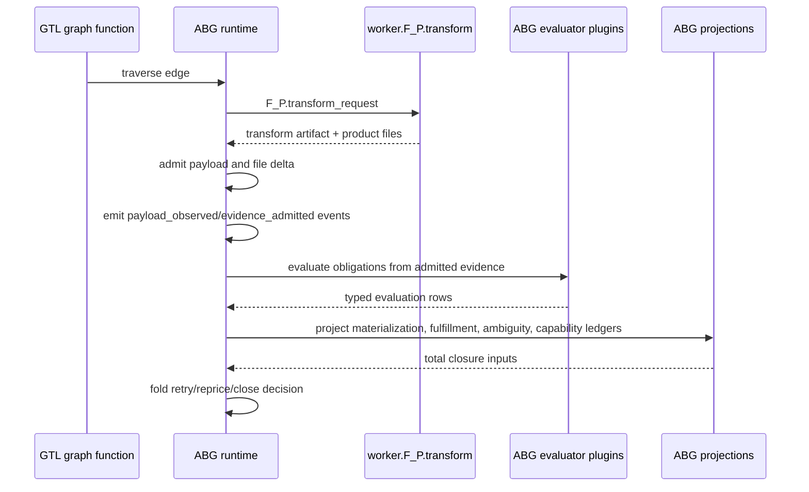
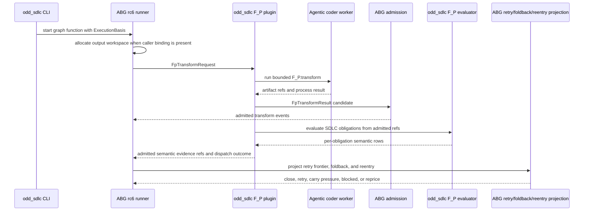

# T-102 Define Typed F_P Function Stages And ABG-Owned Admission Flow

- id: T-102
- type: bug
- ticket_category: ordinary
- status: active
- goal: typescript-rc-fp-worker-coverage
- change_intent: define and realize a typed `F_P.fn` process model so constructive worker calls, evaluation, event emission, ledger projection, and closure are no longer collapsed into one worker-report contract
- change_class: design_reframe
- re_entry_point: design
- triaged_at: 2026-04-30
- created_at: 2026-04-30
- updated_at: 2026-05-02
- priority: high
- build_tenant: typescript
- owner: unassigned
- review_status: active_abg_rc6_consumer_migration_required
- intake_source: `data_mapper.test59.fp.cl` live Claude lane timed out after materializing product files but writing no `worker_result_report.json`; operator review identified that TypeScript collapsed `F_P.transform`, evaluation, materialization ledger construction, obligation assessment, and closure into one worker responsibility.
- affected_boundary: `build_tenants/typescript/code/src/operator/handoff.ts`, `build_tenants/typescript/code/src/operator/installed_operator.ts`, odd_sdlc F_P plugin adapter, ABG event/admission/projection seams
- links:
  - B-071 (`.ai-workspace/tickets/completed/B-071-consume-abg-streamed-process-actor-supervision-for-live-claude-lanes.md`)
  - ABG release cut `v3.4.0-rc.6` (`@abiogenesis/typescript-tenant@3.4.0-rc.6`)
  - ABG T-097 (`/Users/jim/src/apps/abiogenesis/.ai-workspace/tickets/completed/T-097-design-abg-supervised-process-actor-execution-and-streamed-observation.md`)
  - ABG T-098 (`/Users/jim/src/apps/abiogenesis/.ai-workspace/tickets/completed/T-098-design-abg-full-retry-frontier-projection.md`)
  - ABG T-099 (`/Users/jim/src/apps/abiogenesis/.ai-workspace/tickets/completed/T-099-design-abg-typed-fp-stage-carriers-and-admission-flow.md`)
  - ABG T-100/T-101/T-102/T-103/T-104 completed RC6 substrate surfaces for workspace zoom/foldback, mini data-mapper semantic sandbox, eval-suite projections, graph-span reentry, and cross-workspace output allocation
  - ABG engine-first holistic solution (`/Users/jim/src/apps/abiogenesis/.ai-workspace/comments/codex/20260430T224308AEST_abg_engine_first_holistic_solution.md`)
  - downstream SDLC symptom solution (`/Users/jim/src/apps/odd_sdlc/.ai-workspace/comments/codex/20260430T223828AEST_test60_bug_wave_domain_solution.md`)
  - Claude DMM review (`/Users/jim/src/apps/odd_sdlc/.ai-workspace/comments/claude/20260430T143854Z_REVIEW_typescript-src-simplify-and-domain-models.md`)
  - T-105 (`.ai-workspace/tickets/completed/T-105-migrate-start-until-converged-to-abg-owned-whole-graph-iteration.md`)
  - T-106 (`.ai-workspace/tickets/completed/T-106-close-conformed-project-profile-authority-seam.md`)
  - T-107 (`.ai-workspace/tickets/backlog/T-107-split-operator-handoff-into-prime-domain-modules.md`)
  - B-075 (`.ai-workspace/tickets/completed/B-075-ignore-build-tool-byproducts-during-test-module-materialization.md`)
  - semantic regression: `test_env/tests/test_t064_installed_operator_ux.test.mjs`
  - live scenario: `/Users/jim/src/apps/ai_sdlc_examples/local_projects/data_mapper/data_mapper.test59.fp.cl`

## STDO Triage

### First Missing Layer

Design, with likely upstream ABG requirement/design follow-on.

The product and ODD boundary already say ABG owns traversal, runtime facts,
frames, continuations, lineage, provenance, correction, projection mechanics,
and closure folds. The TypeScript realization did not carry that into a typed
F_P process model. It asked one spawned worker to:

- write product files;
- write the output artifact;
- write `worker_result_report.json`;
- list materialized files;
- assess every obligation;
- decide unresolved reasons;
- exit.

That is a collapsed contract. It turns an LLM transform into the evaluator,
ledger author, and closure witness. It also explains why live runs can create
assets while the runtime still sees only `worker_report_rejected`.

### Correct Boundary

`F_P.fn` must be typed by stage.

- `worker.F_P.transform`: bounded constructive function. It writes declared
  transform artifacts and product files, then returns control.
- `ABG.admit`: admits the transform payload, file deltas, process facts, and
  evidence refs.
- `ABG.events`: emits deterministic runtime events from admitted facts.
- `ABG.project`: projects ledgers from the event log and admitted payloads.
- `F_P.evaluate` or deterministic evaluator plugins: evaluate obligations from
  admitted evidence without giving the transformer closure authority.
- `ABG.fold`: folds ledger status into retry, reprice, continuation, or closure.

odd_sdlc owns SDLC domain mapping: authority surfaces, requirement/test/design
meaning, hook contracts, and plugin policy. It does not own a second execution
framework.

## Problem Statement

Python preserved a multi-stage shape, even though some stages lived in
odd_sdlc instead of ABG. TypeScript lost that distinction and encoded the whole
post-transform lifecycle into the worker prompt/report contract.

The live Claude lane showed the failure clearly:

- Claude materialized test files under the selected tenant root.
- The process produced no `worker_result_report.json`.
- The runtime rejected the worker report rather than admitting the transform
  result and evaluating observed artifacts.

This is not primarily a Claude behavior issue. It is a missing typed
process-flow design in the TS/ABG boundary.

## Target Design

Define an explicit `F_P.fn` carrier family and map each stage to ABG-owned
admission/event/projection functions.

Minimum carrier shape:

- `F_P.transform_request`
- `F_P.transform_result`
- `F_P.evaluate_request`
- `F_P.evaluate_result`
- `ABG.admitted_payload`
- `ABG.evidence_observed`
- `ABG.ledger_projection_row`
- `ABG.closure_decision`

Minimum event/projection flow:

## Containment Implemented

The current TS patch is containment, not full closure.

- Worker prompts now state that the invocation is `F_P.transform` only.
- Prompts no longer ask the worker to write `worker_result_report.json`.
- Prompts no longer ask the worker to list materialized files or decide closure.
- The installed operator snapshots the tenant root before worker invocation.
- If a worker exits 0 without a report, the operator observes changed product
  files, creates a framework-generated legacy report, and continues through the
  existing postflight/assurance path.
- `post_transform_observation.json` records that the legacy report was
  generated by framework observation.
- A deterministic regression proves transform-only workers are admitted.

This is a bridge over the old report shape. It does not yet replace the legacy
report with first-class ABG `F_P.fn` carriers.

## Acceptance Criteria

- AC-1: prompts and handoff manifests distinguish `F_P.transform` from
  evaluation, event emission, ledger projection, and closure.
- AC-2: a process worker that writes only the transform artifact/product files
  and exits 0 is not rejected merely because it did not write
  `worker_result_report.json`.
- AC-3: materialized file ledgers are generated from observed filesystem
  deltas, not from worker self-report alone.
- AC-4: obligation status is derived from admitted evidence and evaluator
  plugins, not accepted solely from worker self-assessment.
- AC-5: ABG runtime events are emitted by ABG admission/evaluation functions,
  not by ad hoc worker-side event writes.
- AC-6: closure decisions are projected from ledgers and event truth, not from
  `unresolvedReasons: []`.
- AC-7: test execution result evidence is admitted as execution evidence and
  remains non-closing when execution is pending or unavailable; the test-run
  archive consumes that admitted result and does not emit fresh execution
  evidence.
- AC-8: a live Claude lane proves that files produced by `F_P.transform` are
  observed into framework evidence even when the worker does not write a legacy
  report.
- AC-9: an external STDO review confirms the design does not recreate a second
  execution framework inside odd_sdlc.

## Non-Closure Conditions

- Closing because semantic tests pass while live Claude lanes still depend on
  worker-authored closure reports.
- Treating the framework-generated legacy `worker_result_report.json` as the
  final architecture.
- Allowing workers to append authoritative runtime events directly.
- Allowing workers to close obligations by self-report without admitted
  evidence rows.
- Leaving `F_P.transform`, `F_P.evaluate`, ledger projection, and closure as an
  implicit prompt convention rather than typed carriers.
- Claiming ABG ownership while odd_sdlc still owns the loop, actor lifecycle, or
  closure fold.

## Required Follow-On Work

- Consume ABG RC6 first-class `F_P.fn` carriers and event-sourced
  admission/projection flow.
- Consume ABG RC6 retry-frontier, zoom/foldback, graph-span reentry, eval-suite,
  and cross-workspace output allocation projections so retries preserve all
  distinct prior failure modes and traversal consequences remain ABG-owned.
- Replace the legacy `worker_result_report.json` bridge with admitted
  `F_P.transform_result` and `F_P.evaluate_result` carriers.
- Extend odd_sdlc plugin mapping to provide SDLC-specific evaluators without
  owning ABG runtime mechanics.
- Add a live two-hop data_mapper Claude-lane proof showing transform evidence
  deepens the next hop and prevents premature convergence.

## Verification To Date

- `npm run test:t064` passed.
- `npm run test:semantic` passed, 148 tests.
- `npm run lint:semantic` passed.
- `git diff --check` passed.

The ticket remains active until external review and live Claude-lane evidence
confirm the containment fix and validate the target architecture.

## Review Checkpoint - 2026-05-01

Claude's DMM review is accepted as materially correct on the architectural
point: T-102 cannot close while odd_sdlc still owns a tenant-side
`start --until converged` loop over one-vector ABG calls. The containment work
improved F_P transform admission, but it did not finish the ABG-owned
whole-graph iteration migration.

Additional tickets created from the review:

- T-105: delete the odd_sdlc outer loop and invoke ABG whole-graph iteration.
  This is not optional backlog; it is the active implementation child for the
  T-102 non-closure condition that odd_sdlc must not own loop control.
- T-106: admit `SdlcConformProjectProfile` once and thread the carrier.
- T-107: split `operator/handoff.ts` into prime domain modules.
- B-076: consolidate recurring shared helpers.

Live `data_mapper.test61.TS.cl` evidence added a new containment bug:
`derive_test_module_surface` admitted build-tool byproducts under `target/` as
test module evidence. That is tracked as B-075 and implemented as a narrow
filter in `operator/handoff.ts`.

Verification after B-075:

- focused `test_t066_product_materialization_contract.test.mjs` passed 14/14.
- `npm run lint:semantic` passed.
- `npm run test:semantic` passed 152/152.

## ABG-Owned Iteration Checkpoint - 2026-05-01

T-105 has implemented the active loop-control containment child:

- odd_sdlc no longer carries `AUTONOMOUS_START_STEP_GUARD`,
  `stopReasonForOutcome(...)`, `SdlcAutonomousStartLoopTrace`, or
  `oneTraversalBasis(...)`.
- `start --until converged` delegates one selected graph function to one
  ABG `runEngineIterateAsync(...)` call.
- Bounded single-edge tests now use ABG runner `iterationUntil:
  "first_traversal"` rather than an odd_sdlc one-vector basis rewrite.

Verification after T-105:

- ABG `npm run test:semantic` passed 305/305.
- odd_sdlc `npm run test:semantic` passed 153/153.
- ABG and odd_sdlc `npm run lint:semantic` both passed.

T-102 remains active because the live Claude data_mapper proof and external
STDO review are still required before closure.

Remaining before T-102 closure:

- final outcome from the current live Claude data_mapper lane.
- external STDO review confirming that T-105, B-071, B-072, B-073, B-077,
  B-078, B-079, and B-080 satisfy the typed F_P stage/admission boundary.

## Prompt Contract Cleanup - 2026-05-01

B-073's pending-evidence wording is now reflected in the worker prompt. The
execution evidence prompt no longer pairs "record pending" with an ambiguous
"not closure evidence" statement. It now states that pending evidence is a
lawful non-closure carrier for triage or repricing, and that a not-run document
must not be presented as release closure evidence.

Verification:

- focused `test_t066_product_materialization_contract.test.mjs`,
  `test_t093_scheduling_phase.test.mjs`, and
  `test_t101_retry_report_rejection_loop.test.mjs` passed 21/21.
- `npm run test:semantic` passed 158/158.
- `npm run lint:semantic` passed.
- `git diff --check` passed.
- external STDO review over the containment plus the created follow-on tickets.

## Post-Review Tightening - 2026-05-01

The first external review found that several child tickets were directionally
correct but under-proven. The active tranche now tightens those children:

- B-072: malformed transform-artifact execution evidence enters typed
  `test_execution_evidence_invalid` instead of generic report admission
  failure; missing evidence carries field-level detail.
- B-079: retry-frontier legacy keys preserve shard identity for same-code
  shard failures.
- B-080: first silent-worker retry is conditional on a smaller/sharper unit
  being present; no-shard silence triages immediately.
- T-106: deterministic drift fixture proves the installed operator uses the
  admitted conformed project profile after `project_constraints.yml` changes.
- B-074: prompt prevention and postflight detection now jointly cover the sbt
  suffixed-artifact coordinate defect.

Verification after tightening:

- `npm run build:semantic` passed.
- focused
  `node --test test_env/tests/test_t064_installed_operator_ux.test.mjs test_env/tests/test_t066_product_materialization_contract.test.mjs test_env/tests/test_t086_blocking_reason_carriers.test.mjs`
  passed 29/29.
- `npm run lint:semantic` passed.
- `npm run test:semantic` passed 160/160.
- `git diff --check` passed.

The tranche has been sent for external review again. T-102 remains active
until the live Claude lane is usable as final evidence. External review
accepted the deterministic/source tranche on 2026-05-01.

## Post-Review T-104 Correction - 2026-05-01

The second external review found that T-104 still let
`derive_test_run_archive_surface` admit fresh execution evidence. The current
patch moves that authority fully to `derive_test_execution_result_surface`:

- `targetAdmitsTestExecutionEvidence(...)` now admits only
  `test_execution_result_surface`.
- the archive prompt explicitly forbids running test commands or emitting fresh
  `sdlc_worker_execution_evidence`.
- deterministic worker fixtures now emit execution evidence only on the
  execution-result edge.
- B-073's acceptance criteria were narrowed to the deterministic evidence it
  actually owns.

Verification after correction:

- `npm run build:semantic` passed.
- focused
  `node --test test_env/tests/test_t066_product_materialization_contract.test.mjs test_env/tests/test_t093_scheduling_phase.test.mjs test_env/tests/test_t101_retry_report_rejection_loop.test.mjs`
  passed 23/23.
- `npm run lint:semantic` passed.
- `npm run test:semantic` passed 161/161.
- `git diff --check` passed.

## Archive Source-Dependency Enforcement - 2026-05-01

The follow-up review found that archive-side execution admission was removed,
but archive closure was not yet source-enforced against prior execution-result
truth. The current correction adds that enforcement:

- `derive_test_run_archive_surface` gets source-asset obligations even though
  it is surface-only.
- archive postflight emits `source_asset_dependency_missing:<assetType>` when
  the archive output does not cite its source assets.
- report admission rejects fresh `executionEvidence` on targets that do not
  admit execution evidence.

Verification:

- `npm run build:semantic` passed.
- focused
  `node --test test_env/tests/test_t066_product_materialization_contract.test.mjs test_env/tests/test_t093_scheduling_phase.test.mjs test_env/tests/test_t101_retry_report_rejection_loop.test.mjs test_env/tests/test_t086_blocking_reason_carriers.test.mjs`
  passed 30/30.
- `npm run lint:semantic` passed.
- `npm run test:semantic` passed 163/163.
- `git diff --check` passed.

## Test64 Reassessment - 2026-05-01

`data_mapper.test64.TS.cl` strengthens the T-102 child evidence but does not
close T-102.

What it proves:

- T-105's ABG-owned whole-graph iteration path advanced through twelve F_P
  hops under one `start --until converged` parent process.
- B-071 process supervision remained archive-backed across the lane.
- B-078/B-080 typed the terminal no-output worker timeout as
  `silent_worker_inactivity` with `retryEligible: false` and
  `nextLawfulActions: ["triage_gap"]`.

What it does not prove:

- first-class typed `F_P.transform_result` / `F_P.evaluate_result` carriers
  replace the framework-generated legacy report bridge.
- code materialization completed.
- test execution, shard evidence, archive closure, or release qualification
  completed.

The terminal blocker was `derive_code_surface` archive
`20260501T083037157Z_pid63915`, with no stdout, no stderr, no transform result
payload, and lawful re-entry `triage_gap`. T-102 therefore remains active for
the broader typed F_P stage/admission boundary and external review.

## ABG RC6 Consumer Architecture - 2026-05-02

T-102 is now fully dependent on ABG TypeScript `v3.4.0-rc.6`. The upstream
substrate blocker has moved from "ABG must define the stage/admission machinery"
to "odd_sdlc must consume the RC6 machinery without rebuilding it locally."

Required substrate version:

- package surface: `@abiogenesis/typescript-tenant@3.4.0-rc.6`
- release tag: `/Users/jim/src/apps/abiogenesis` `v3.4.0-rc.6`
- current local dependency: `build_tenants/typescript/package.json` uses the
  sibling ABG file dependency

Required ABG RC6 surfaces:

| ABG RC6 surface | odd_sdlc use |
| --- | --- |
| `constructFpTransformRequest` | ABG-owned construction of the transform call contract |
| `constructFpTransformResult` | typed worker transform result carrier |
| `admitFpTransformResultForRequest` | ABG-owned admission of worker transform output |
| `runtimeEventsForFpTransformResult` | ABG-owned runtime events derived from admitted transform truth |
| `deriveRetryFrontierProjection` | retry-frontier projection without odd_sdlc owning retry mechanics |
| `constructEvalTask`, `constructEvalTrial`, `constructEvalOutcome`, `constructEvalGradeVector`, `deriveEvalAggregateProjection` | repeatable semantic-eval surfaces for F_P evaluation proof |
| `deriveZoomFoldbackEvaluationFromEvents` | foldback from scheduled workspace obligations |
| `deriveGraphReentryFrontierProjection`, `deriveGraphReentryPlan` | graph-span reentry after semantic gaps across A->...->D spans |
| `admitOutputWorkspaceBinding`, `deriveOutputInstanceAllocation` | explicit input-workspace to output-workspace allocation for graph starts |

### Ownership Law

ABG owns the execution and information substrate:

- graph traversal
- frame/run/work identity
- worker process supervision facts
- F_P transform request/result admission
- runtime event construction and admission
- retry-frontier projection
- zoom/foldback projection
- graph-span reentry projection and application
- output workspace binding and allocation

odd_sdlc owns the SDLC semantic layer:

- requirement, design, test, release, and ticket obligation meaning
- F_P semantic evaluator plugins that judge `A.requirement -> B.result`
- SDLC-specific obligation row construction from admitted evidence
- product-specific proof interpretation and operator explanation

F_P owns semantic judgment. F_D owns mechanical checks. F_D checks may reject
malformed or impossible evidence, but they must not replace requirement-by-
requirement F_P semantic evaluation.

### Target Flow

### Local Rebase Gates Before Implementation Closure

The current odd_sdlc TypeScript tree must be rebased to RC6 before this ticket
can move toward closure:

- refresh `build_tenants/typescript/package-lock.json`; it still records the
  sibling ABG package as `3.4.0-rc.2` even though `node_modules` resolves
  `3.4.0-rc.6`
- remove the old `inactivityTimeoutMs` argument to ABG
  `SupervisedProcessActorRequest`; RC6 process actors expose timeout,
  heartbeat, and termination-grace policy, not that legacy field
- remove the old `iterationUntil` argument to `runEngineIterateAsync`; RC6 reads
  iteration policy from `basis.startIntent.until`
- replace the legacy framework-generated `worker_result_report.json` bridge as
  closure input with admitted `FpTransformResult` plus odd_sdlc F_P semantic
  evaluation rows

### Acceptance Criteria Addendum

- AC-10: `npm run build:semantic` passes against
  `@abiogenesis/typescript-tenant@3.4.0-rc.6`.
- AC-11: odd_sdlc creates no private substitute for ABG F_P transform admission,
  retry frontier, foldback, graph-span reentry, or output allocation.
- AC-12: every worker-backed transform path produces or consumes an ABG
  `FpTransformRequest` / `FpTransformResult` admission path.
- AC-13: semantic requirement evaluation remains F_P-owned and is represented as
  SDLC-domain rows over admitted evidence refs, not as F_D closure.
- AC-14: closure and next traversal action are derived from ABG-admitted events,
  ABG projections, and SDLC semantic rows, not from worker self-report or
  installed-operator branch-local booleans.
- AC-15: the focused RC6 sandbox and live test lanes exercise an `odd_sdlc`
  lifecycle graph over bootstrap, requirement-ledger, requirement-schedule,
  design, implementation, and qualification surfaces. A generic transform demo
  is insufficient closure evidence for this ticket.

### Focused Proof Added - 2026-05-02

T-102 now has a focused RC6 proof lane over the `odd_sdlc` lifecycle domain:

- deterministic sandbox: `npm run test:t102-t109:rc6-sandbox`
- live Codex worker: `ODD_SDLC_TS_T109_LIVE=1 ODD_SDLC_TS_LIVE_WORKER_COMMAND=codex ODD_SDLC_TS_LIVE_CODEX_MODEL=gpt-5.3-codex npm run test:t102-t109:rc6-live`

Both lanes use the same bootstrap input, requirement authorities, expected
requirements ledger, requirements schedule, implementation surface, and
qualification report. The live lane is pinned to `gpt-5.3-codex` and the
archive is
`build_tenants/typescript/test_env/test_runs/t109_live_abg_rc6_sdlc_lifecycle/20260502T134430587Z_pid46797/run_summary.json`.
