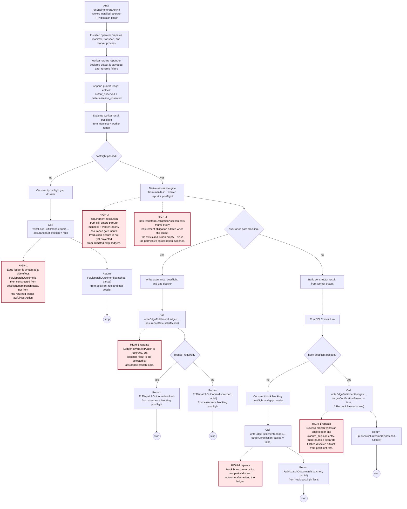
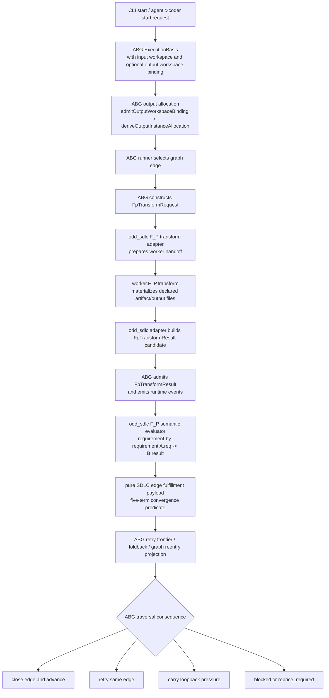
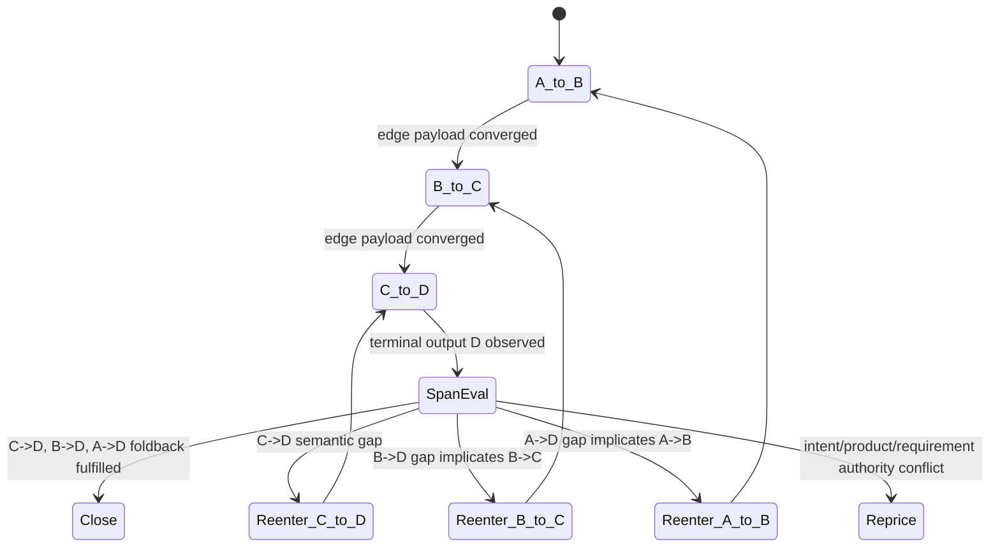

## STDO Triage

### Reopened First-Traversal Blocker - 2026-05-03

T-109 must not progress to downstream traversal-ledger closure until the first
SDLC traversal packet is repaired:

- T-087: mandatory `{ unknown state } -> inducted spec_method Project`
  traversal
- T-096: managed traversal proof from unordered/unknown source set
- T-091: concrete requirement authority, not lossy marker-only REQ pressure

This is not a deferral of ledger work. It is the prerequisite authority input
for it. The edge-ledger framework cannot evaluate requirement fulfillment if
the initial REQ set was never lawfully inducted.

For the current tranche, T-109 remains active but blocked. No data_mapper
parity or downstream lifecycle closure claim is valid until induction either
converges or remains on typed induction gaps.

### First Missing Layer

Design.

The TypeScript line already has assurance ledgers, blocking reason carriers,
gap dossiers, and ABG-owned iteration. Those surfaces were produced across
several repair waves and currently read like multiple attempts to capture the
Python design. That is no longer acceptable as a closure target.

The required design result is one cohesive TypeScript solution:

- one canonical design document for traversal ledger semantics
- one carrier vocabulary
- one closure fold
- one retry/loopback law
- one relationship between project lineage, edge closure, and requirement
  resolution
- one implementation plan that consumes or retires older partial design
  language

The active design pack does not yet define a single authoritative audit model
that explains how those records compose into:

- one append-only project construction lineage chain for the run
- admitted per-edge fulfillment ledgers for closure
- requirement-resolution projections derived from those edge ledgers
- retry and loopback semantics that preserve semantic gaps across worker
  runtime failures

The implementation currently has enough pieces to detect a failure, but not
enough governing design to guarantee that a repairable incomplete requirement
state continues as same-edge iteration or typed loopback pressure. Closure must
not be attempted by adding another design fragment beside the existing ones.

### Lawful Re-Entry

`design_reframe`.

The intended product truth remains stable: `odd_sdlc.TS` must rebuild the
software-domain package around graph functions, typed assets, ABG replay truth,
and bounded SDLC hooks. The missing layer is the realization design for closure
authority and audit lineage, followed by scoped implementation.

## Problem Statement

The test65 TypeScript run stopped at vector 8,
`derive_implementation_design_surface`, after a correct semantic assurance
finding and an incorrect algorithmic collapse.

The first vector-8 attempt produced an implementation-design artifact and base
postflight passed. Assurance then blocked six missing observed requirement
traces:

- `REQ-INT-002`
- `REQ-INT-004`
- `REQ-INT-005`
- `REQ-INT-006`
- `REQ-LDM-005`
- `REQ-PDM-004`

The gap dossier correctly selected `retry_same_edge`. The second attempt then
timed out silently with zero stdout, zero stderr, no worker report, PID 99735,
and `SIGTERM` after the inactivity timeout. The installed operator emitted
`silent_worker_inactivity` and moved to `triage_gap`.

The bad interpretation is not that missing requirements were detected. That is
correct. The bad interpretation is letting a silent retry become the semantic
answer for the edge. Incomplete requirement evidence must remain typed
edge-pressure. It should either:

- keep the edge open and iterate again under bounded retry law
- carry forward as loopback pressure if the graph lawfully advances
- stop as a typed exhaustion state that preserves both the semantic gap and the
  worker-runtime failure

It must not disappear into an untyped global stop.

## Test35 Discovery Evidence

The Python test35 line is discovery evidence, not TypeScript architecture
authority. The parts to translate are algorithmic.

The TypeScript target is not a copy of Python. It must improve the design from
a functional-programming perspective:

- represent carrier state as closed algebraic data types
- express projection as pure total functions over typed event inputs
- express closure as pure predicates over admitted ledger values
- express retry, loopback, blocked, and reprice outcomes as explicit sum types
- isolate filesystem, process, and clock effects at the boundary
- make invalid or contradictory states unrepresentable where practical and
  fail-closed where runtime data is malformed
- use digestable immutable values rather than hidden mutable state
- keep event calculus in the information plane and ledger predicates in the
  closure plane

### Python Obligation Declaration

`data_mapper.test35/.genesis/odd_sdlc/python/code/odd_sdlc/gtl_module.py`
declares per-edge requirement obligation ledgers through
`_requirement_edge_obligation_ledger`.

Relevant behavior:

- obligation source is `requirement_surface`
- admission basis is `authority_or_current_surface`
- carry rule is `deterministic_requirement_membership`
- adapter is `odd_sdlc.traceability:declared_requirement_edge_gap`

The same module defines implementation-design closure as material
representation of every carried requirement obligation, and code closure as
behavioral realization rather than trace tags or stubs.

### Python Published Fulfillment Ledger

`data_mapper.test35/.genesis/genesis/result_ingest.py` builds a published
fulfillment ledger from the manifest and worker result:

- expected obligations come from the manifest
- `fulfillment_assessments` are required
- missing assessments become unfulfilled rows
- fulfilled, partial, blocked, and unfulfilled rows are counted
- `carry_converged` requires no missing or extra obligations
- `fulfillment_converged` requires every carried obligation fulfilled
- `edge_converged` is derived from carry convergence, fulfillment convergence,
  and admission

Current ABG Python refines the edge predicate to the five-term target that TS
must preserve:

```python
def published_fulfillment_edge_converged(ledger_data: Mapping[str, Any]) -> bool:
    target_certification_passed = ledger_data.get("target_certification_passed", True)
    fd_recheck_passed = ledger_data.get("fd_recheck_passed", True)
    return (
        bool(ledger_data.get("carry_converged"))
        and bool(ledger_data.get("fulfillment_converged"))
        and bool(ledger_data.get("admitted"))
        and bool(target_certification_passed)
        and bool(fd_recheck_passed)
    )
```

`data_mapper.test35/.genesis/genesis/interpret.py` projects edge convergence
from the published fulfillment ledger. This makes the ledger the closure fact,
not the raw event chronology.

`data_mapper.test35/.genesis/genesis/dispatch_runtime.py` can ingest a valid
preserved result artifact even after timeout or nonzero return. That preserves
the distinction between worker transport failure and semantic edge evidence.

### Test35 Ledger Fixtures

The TypeScript implementation must be tested against these Python ledger
fixtures:

- `derive_implementation_design_surface_20260419T103335367453Z.json`
  - `expected_count: 77`
  - `fulfilled_count: 77`
  - `edge_converged: true`
  - evidence points into
    `build_tenants/scala_spark/design/40-generated-implementation-design.md`
- `derive_implementation_design_surface_20260419T180828511506Z.json`
  - `expected_count: 81`
  - `fulfilled_count: 80`
  - `blocking_reasons: ["dbt_build_artifacts_not_present"]`
  - `edge_converged: false`
  - demonstrates later proof pressure without erasing the earlier admitted
    converged ledger
- `derive_code_surface_20260419T121644750776Z.json`
  - demonstrates downstream code-edge convergence with broad materialization
- `derive_test_run_archive_surface_20260419T130433671620Z.json`
  - demonstrates test archive edge closure over test evidence
- `prepare_release_surface_20260418T223618220160Z.json`
  - demonstrates release-surface edge closure over admitted downstream evidence

The post
`.ai-workspace/comments/codex/20260502T022427AEST_test35_test65_edge_parity_gap_analysis.md`
is the controlling analysis artifact for this ticket.

## Target Design

### Single Design Solution Rule

The TypeScript delivery must not close by layering one more design note over the
existing design pack.

The required design artifact is:

`build_tenants/typescript/design/ODD_SDLC_TYPESCRIPT_TRAVERSAL_LEDGER_SOLUTION.md`

That document becomes the canonical TypeScript solution for traversal ledger
semantics. It must absorb the valid parts of:

- traversal assurance integration
- traceability requirement closure
- recursive realization deepening
- blocking reason carriers
- installed operator UX
- retry and continuation behavior

After the canonical design is published, the older design docs must be edited
so they either:

- point to the canonical solution for the shared traversal-ledger law, or
- retain only their local narrow concern without restating ledger, retry, or
  closure authority

No implementation may claim ticket closure while two design surfaces state
different closure authority, retry semantics, or carrier ownership.

### Audit-Chain Model

The word "blockchain" in this ticket means an append-only, parent-linked,
digestable audit chain. It does not mean decentralized consensus.

The model is ABG-driven. It has four layers:

```text
ABG raw events and lineage facts
  -> ABG-governed project construction ledger/projections
  -> selected/admitted SDLC per-edge fulfillment payloads
  -> closure predicate over the selected SDLC edge payload
  -> requirement-resolution projection
```

The raw event log records observations under ABG admission and ordering law.

The project construction ledger/projection is ABG-owned information-plane
lineage for the run. It records attempts, parent refs, manifests, worker
processes, output refs, materialized files, postflight refs, gap refs, retry
decisions, and supersession refs. It is append-only and replayable. It is not
sufficient by itself to close an SDLC edge.

The per-edge fulfillment surface is an SDLC semantic payload admitted over ABG
truth. It is closure authority for one SDLC edge attempt or edge version because
it states what obligations were expected, what was assessed, what evidence was
admitted, what remained missing/partial/blocked, and whether the edge
converged. It is not a second runtime ledger substrate.

The requirement-resolution projection is a derived view across admitted edge
ledgers. It may be materialized for operators, but it does not outrank the
admitted edge ledgers or the constitutional requirement authority.

### Carrier Set

Minimum new or reconciled odd_sdlc domain payloads over ABG RC6 carriers:

| Carrier | Role |
| --- | --- |
| `SdlcProjectConstructionLedger` | product-domain view over ABG project/run lineage |
| `SdlcProjectConstructionLedgerEntry` | one typed SDLC lineage interpretation row over ABG event refs |
| `SdlcEdgeAttemptRecord` | attempt identity, edge identity, parent attempt refs, manifest refs, process refs, output refs, and digest refs |
| `SdlcEdgeFulfillmentLedger` | admitted closure carrier for one edge attempt/version |
| `SdlcEdgeFulfillmentObligationRow` | one obligation, status, evidence refs, source refs, and blocking reasons |
| `SdlcEdgeClosureDecision` | fold output: close, retry_same_edge, carry_loopback_pressure, blocked, reprice_required |
| `SdlcRequirementResolutionProjection` | derived current-state view across admitted edge ledgers |

### Edge Fulfillment Ledger Fields

Every requirement-bearing edge ledger must include:

- stable ledger id
- edge name
- vector index
- graph function name
- target asset type
- attempt id
- parent attempt refs
- prior admitted edge ledger refs
- manifest ref and digest
- traversal obligation context ref and digest
- output refs and digests
- materialized file refs and digests
- process summary refs when a process worker was used
- gap dossier refs consumed by this attempt
- requirement authority refs
- expected obligation count
- assessment count
- fulfilled count
- partial count
- blocked count
- unfulfilled count
- missing count
- extra count
- carry convergence boolean
- fulfillment convergence boolean
- admitted boolean
- target certification passed boolean
- F_D recheck passed boolean
- per-obligation rows with status, source refs, evidence refs, and blocking
  reasons
- admission basis
- edge convergence boolean
- lawful next action
- supersedes refs when applicable

### Project Construction Ledger Fields

Every project construction ledger entry must include:

- stable entry id
- entry kind
- timestamp
- graph function name when applicable
- edge/vector identity when applicable
- actor identity or process identity when applicable
- parent entry refs
- basis refs and digests
- payload refs and digests
- supersedes refs when applicable
- admission status
- reason codes

The project ledger must be append-only. Corrections are represented by
supersession, not mutation.

### Closure Authority Rule

No edge closes from raw event chronology, raw worker report, artifact presence,
or CLI summary alone.

An edge closes only when an admitted `SdlcEdgeFulfillmentLedger` says:

- all carried obligations have an assessment
- no extra obligations are smuggled in as closure basis
- all required obligations are fulfilled
- no partial, blocked, or unfulfilled obligations remain
- materialization and process evidence required for the edge are admitted
- target certification passed
- deterministic F_D recheck passed
- the closure fold returns `close_allowed`

The edge convergence predicate is:

```text
edge_converged =
  carry_converged
  AND fulfillment_converged
  AND admitted
  AND target_certification_passed
  AND fd_recheck_passed
```

The closure fold may compute these fields, but it must expose them as named
ledger terms. A generic `close_allowed` boolean is not enough.

### Retry And Loopback Rule

For missing, partial, blocked, or unfulfilled requirement evidence:

```text
semantic gap
  -> admitted edge fulfillment ledger with edge_converged = false
  -> gap dossier or retry frontier entry
  -> retry_same_edge when repairable
  -> carry_loopback_pressure when graph law allows advance with unresolved pressure
  -> typed blocked/exhausted state when retry budget or policy is exhausted
```

For silent worker inactivity:

```text
worker-runtime failure
  -> process summary and failure postflight
  -> project construction ledger entry
  -> prior semantic gap preserved
  -> retry policy evaluated without overwriting the semantic edge ledger
```

A silent retry is not the semantic answer for the edge.

Retry eligibility is allowlisted, not inferred from missing closure.

Legacy Python retryable failure classes:

```text
transport_failure
no_output
contract_failure
```

TypeScript must publish an equivalent typed allowlist. `silent_worker_inactivity`
may be retryable only through the `transport_failure` or `no_output`
equivalence path and only while retry policy and budget allow it. Policy/config
defects, proof failures, F_D findings, and requirement repricing findings are
not made retryable by this rule.

Valid preserved artifacts survive transport failure. If a worker times out,
exits nonzero, or is signaled and the declared output artifact is present and
valid for the edge boundary, TypeScript must admit that artifact into the
semantic edge-ledger path while also recording the worker-runtime failure in the
project construction ledger.

### Information Plane And Prior Ledger Projection Rule

Event calculus is legitimate only in the information plane. It selects,
orders, and projects ledger surfaces. It is not the closure criterion.

The closure criterion is the admitted edge fulfillment ledger surface and its
named predicate fields.

Python uses event-sourced projection. For a slice identified by edge, work key,
spec hash, run id, and call id, the current ledger is the ledger referenced by
the latest `assessed` event whose data has `kind: fp` after the latest reset for
that slice. Re-certification of an already certified edge requires explicit
`edge_reopened` event pressure; otherwise the certified edge key remains
certified.

TypeScript must preserve that projection law without confusing it with closure
law.

If an earlier ledger for the same edge version is admitted as converged, a later
failed retry or expanded proof attempt does not erase it unless the information
plane selects a later admitted assessment for the same slice or a governed
reset/reopen/reprice changes the slice.

The later attempt may:

- become the latest current ledger for the slice through event-stream order
- explicitly supersede prior ledgers as a TS rigor add when the refs agree with
  event-stream order
- create new gap pressure if requirement/design authority changed
- block a release claim that depends on the newer authority

It must not silently retroactively invalidate downstream traversal facts.

`supersedesRefs` are allowed as TypeScript audit rigor. They are not the primary
projection selector. If explicit supersession refs contradict event-stream
latest-assessed projection, projection fails closed with
`ledger_supersession_conflict`.

## Implementation Plan

1. Publish the canonical TypeScript solution design.

Create
`build_tenants/typescript/design/ODD_SDLC_TYPESCRIPT_TRAVERSAL_LEDGER_SOLUTION.md`
as the single design authority for functional traversal ledger semantics. It
must define the carrier algebra, pure projection functions, pure edge closure
predicate, retry law, loopback law, supersession law, effect boundary, and
ABG/odd_sdlc ownership split in one place.

2. Reconcile or retire overlapping design language.

Update the TypeScript design pack so traversal assurance, traceability closure,
recursive deepening, blocking carriers, and installed operator UX all refer to
the canonical solution instead of restating competing local versions of the
same law. Keep local docs only for local concerns.

3. Run the guaranteed design review gate.

Before implementation closure work proceeds, publish a design review comment
under `.ai-workspace/comments/<agent>/` that evaluates the canonical design
against:

- STDO source authority and re-entry discipline
- ODD_SDLC ownership split across GTL, ABG, and odd_sdlc
- Python discovery domain model and sequence
- current TypeScript domain model and flow
- final TypeScript solution domain model and flow
- test35 selected ledger fixtures
- test65 vector-8 failure artifacts
- absence of competing TypeScript design authority

The review must list blocking findings first. Any high or medium finding blocks
this ticket until resolved or explicitly repriced.

4. Define typed domain payload interfaces and pure functions over ABG truth.

Add TypeScript domain types for SDLC lineage views, edge attempt records, edge
fulfillment payloads, obligation rows, closure decisions, and
requirement-resolution projections. Add pure functions for SDLC payload
construction, closure, retry classification, and requirement-resolution
derivation over ABG-admitted event/projection truth.

5. Consume ABG project construction lineage and publish SDLC lineage views.

Every installed operator edge attempt must consume ABG-admitted lineage facts
for manifest creation, process start, output observation, materialization
observation, postflight, assurance, gap dossier, retry, block, reprice, and
closure. odd_sdlc may materialize SDLC lineage views as read/evidence payloads,
but it must not create a private runtime ledger authority beside ABG.

6. Publish SDLC edge fulfillment payloads over ABG-admitted evidence.

Every requirement-bearing edge must publish an admitted SDLC edge fulfillment
payload from manifest obligations, observed materialization, worker/process
evidence, F_P semantic rows, and requirement authority refs. The payload is the
SDLC edge closure surface; the admission/projection mechanics remain ABG-owned.

7. Fold closure from SDLC edge payloads through ABG projection/reentry.

The installed operator and ABG plugin boundary must derive retry/advance/block
from ABG projections plus admitted SDLC edge payload state, not from raw worker
report status or installed-operator branch-local booleans.

8. Preserve semantic gaps across worker-runtime failures.

When a retry worker is silent, the process failure must attach to the attempt
and ABG lineage while the prior SDLC semantic gap remains the active repair
frontier.

9. Add test35 fixture characterization tests.

Add fixture tests that load the selected test35 ledgers and verify that the TS
carrier model can represent:

- a converged implementation-design edge
- a later failed implementation-design attempt without retroactive erasure
- a code-surface edge with broad materialization
- a test-run-archive edge with test evidence
- a release edge consuming downstream evidence

10. Prove live data_mapper continuation.

Run a fresh TypeScript data_mapper reproduction from the test65/test35 basis.
The run must not stop at the vector-8 missing-requirement plus silent-retry
failure mode. It must either:

- iterate the implementation-design edge to admitted convergence, or
- stop with a typed retry-budget/exhaustion carrier that preserves the six
  semantic requirement gaps separately from worker-runtime failure

For closure of this ticket, the preferred proof is productive continuation past
implementation design into stack/module/schedule/code materialization.

## Acceptance Criteria

- AC-1: one canonical design document,
  `ODD_SDLC_TYPESCRIPT_TRAVERSAL_LEDGER_SOLUTION.md`, defines the cohesive
  functional TypeScript traversal-ledger solution.
- AC-2: overlapping active design docs are reconciled to reference the
  canonical solution and no longer restate competing ledger, retry, or closure
  laws.
- AC-3: a recorded STDO/ODD_SDLC design review exists under
  `.ai-workspace/comments/<agent>/`, covers the required review checklist, and
  has no unresolved high or medium findings.
- AC-4: active design docs remove any stale language that treats raw worker
  report, raw event chronology, or CLI summary as edge closure authority.
- AC-5: TypeScript exposes typed SDLC domain payloads for project construction
  lineage views, edge attempt records, edge fulfillment payloads, edge
  obligation rows, closure decisions, and requirement-resolution projections
  over ABG-admitted truth.
- AC-6: TypeScript exposes pure total functions for SDLC payload construction,
  closure predicate evaluation, retry classification, and
  requirement-resolution derivation over ABG event/projection inputs.
- AC-7: effectful filesystem/process/clock operations are isolated from the
  pure projection and closure functions.
- AC-8: invalid or contradictory carrier states are rejected through closed
  result types or fail-closed validation, not by partial exceptions in closure
  logic.
- AC-9: the ABG-governed project construction lineage consumed by odd_sdlc is
  append-only, parent-linked, and digestable; corrections use supersession refs
  rather than mutation.
- AC-10: every worker-backed edge attempt consumes or records ABG-admitted
  manifest, process, output, postflight, and gap/closure refs before SDLC
  lineage views are materialized.
- AC-11: every requirement-bearing edge writes an admitted SDLC edge fulfillment
  payload with expected, fulfilled, partial, blocked, unfulfilled, missing, and
  extra counts.
- AC-12: edge closure is computed only from admitted SDLC edge fulfillment
  payloads, ABG projections, and required assurance dimensions.
- AC-13: missing requirement traces create an SDLC semantic edge payload with
  `edge_converged: false` and a lawful retry or loopback decision.
- AC-14: silent worker inactivity on a retry creates a worker-runtime failure
  entry without overwriting the prior semantic edge gap.
- AC-15: prior admitted converged SDLC edge payloads remain available until
  explicitly superseded by admitted authority change or reprice.
- AC-16: requirement-resolution output is derived from admitted SDLC edge
  payloads and does not become a competing authority surface.
- AC-17: test35 fixture tests prove the TS carrier model can represent the
  selected Python ledger states and their supersession/pressure semantics.
- AC-18: a regression reproduces the test65 vector-8 failure and proves the
  repaired algorithm preserves the six semantic requirement gaps after silent
  retry failure.
- AC-19: a live TS data_mapper run proves productive continuation beyond the
  vector-8 stop or emits a typed retry-exhaustion state with full semantic and
  worker-runtime separation.
- AC-20: `npm run lint:semantic` and `npm run test:semantic` pass.
- AC-21: final STDO review confirms the feature does not recreate a product-local
  runtime, does not copy Python service structure, and keeps ABG traversal
  ownership explicit.

## Non-Closure Conditions

- Closing because unit tests pass while live data_mapper still stops at the
  vector-8 missing-requirement plus silent-worker failure shape.
- Closing with several partially overlapping TS design docs instead of one
  canonical solution and reconciled local docs.
- Starting implementation closure without the recorded design review gate.
- Treating a design review with unresolved high or medium findings as advisory.
- Treating ABG project construction lineage as SDLC edge closure authority.
- Treating raw events as closure authority without admitted SDLC edge
  fulfillment payloads.
- Allowing `silent_worker_inactivity` to erase or replace a prior semantic gap.
- Allowing worker self-assessment alone to close obligations without admitted
  evidence rows.
- Closing with runtime markdown assets only while the selected product edge
  requires materialized tenant/product surfaces.
- Claiming Python equivalence from file counts without SDLC edge-payload
  characterization.
- Updating code without reconciling the active design pack.

## Proof Surface

Required proof artifacts:

- updated TypeScript design docs listed in `source_design_inputs_to_reconcile`
- canonical solution design:
  `build_tenants/typescript/design/ODD_SDLC_TYPESCRIPT_TRAVERSAL_LEDGER_SOLUTION.md`
- recorded STDO/ODD_SDLC design review comment with no unresolved high or
  medium findings
- TypeScript SDLC domain payload definitions and validators over ABG RC6
  carriers/projections
- semantic tests for payload validation, ABG projection consumption, closure
  fold, retry preservation, and supersession
- fixture tests over selected test35 `fp_ledgers`
- reproduction test or live archive for the test65 vector-8 failure shape
- fresh live data_mapper archive proving continuation or typed exhaustion
- STDO review post confirming design, implementation, and proof alignment

Minimum commands:

```bash
npm run lint:semantic
npm run test:semantic
node --test <focused SDLC edge-payload fixture tests>
node_modules/.bin/odd-sdlc-ts gaps --workspace <fresh data_mapper workspace>
node_modules/.bin/odd-sdlc-ts start --workspace <fresh data_mapper workspace> --target next --until converged --worker process://claude
```

## Historical Implementation Checkpoint 2026-05-02 - Parked, Not Current Main

This checkpoint records the parked T-109 implementation branch. It is not
current `main` closure evidence. After the ABG RC6 release cut and rollback, the
current implementation path must be rebuilt against ABG `v3.4.0-rc.6` and the
ABG-owned ledger/admission/projection boundary defined later in this ticket.

On the parked checkpoint branch, core TypeScript implementation was present in
`build_tenants/typescript/code/src/operator/traversal_ledger.ts` and consumed
by the installed operator.

Implemented surfaces:

- closed traversal-ledger carrier algebra for project construction entries,
  edge fulfillment ledgers, obligation rows, closure decisions, projection
  results, and retry classification
- pure five-term edge convergence predicate:
  `carry_converged AND fulfillment_converged AND admitted AND target_certification_passed AND fd_recheck_passed`
- event-sourced current-ledger projection over `(edge, work_key, spec_hash,
  run_id, call_id)` with explicit supersession conflict failing closed
- typed retry allowlist covering legacy Python classes and TS runtime
  equivalents without admitting proof failures or F_D findings as retryable
- parent-linked append-only project construction ledger writes
- installed operator publication of project construction ledger entries for
  manifest creation, worker runtime failure, artifact salvage, output
  observation, materialization observation, edge ledger admission, closure
  decision, and typed stop
- edge fulfillment ledger publication from manifest obligations, worker result
  report, postflight, assurance satisfaction, process refs, and gap refs
- artifact salvage after nonzero/signaled worker exit when a valid declared
  output artifact can be admitted
- behavioral/material post-transform requirement observation, replacing
  lexical requirement-id matching for generated report assessments

Regression proof:

- `node --test test_env/tests/test_t109_traversal_ledger_solution.test.mjs`
  passed, including five-term predicate, retry allowlist, material
  observation, edge-ledger closure, supersession conflict, parent-linked
  construction append, and selected test35 fixture characterization.
- `npm run lint:semantic` passed.
- `npm run test:semantic` passed, 170/170.
- `git diff --check` passed.

Parked-branch closure status at that time:

On that branch, the core implementation and semantic regression proof were
complete. That proof does not count as current `main` closure evidence after
the rollback and ABG RC6 rebase. Ticket movement now requires the RC6
architecture above, live data_mapper proof or typed exhaustion archive named by
AC-19, plus final STDO review against the current implementation and proof
surface.

## STDO Review Checkpoint 2026-05-02: Ledger Writer Ownership

Source review:
`.ai-workspace/comments/codex/20260502T040658AEST_t109_stdo_self_review.md`.

Question recorded by the operator:

```text
F_P writes ledgers or calls a function that writes ledgers?
```

Current literal code shape:

- `F_P` calls `writeEdgeFulfillmentLedger(...)`; it does not inline the JSON
  writes directly.
- `writeEdgeFulfillmentLedger(...)` constructs the edge fulfillment ledger,
  writes `edge_fulfillment_ledger.json`, and appends project construction
  ledger entries.
- `appendProjectConstructionLedgerEntrySync(...)` performs the actual JSONL
  append.

Current architectural truth:

Because `writeEdgeFulfillmentLedger(...)` is effectful, local to the installed
operator path, and returns `void`, the `F_P`/installed-operator dispatch path is
currently the effective ledger writer. The helper call shape does not by itself
establish the intended STDO/FP boundary.

Evidence:

- `build_tenants/typescript/code/src/operator/installed_operator.ts:356`
  defines `writeEdgeFulfillmentLedger(...)`.
- `build_tenants/typescript/code/src/operator/installed_operator.ts:370`
  calls `constructEdgeFulfillmentLedger(...)`.
- `build_tenants/typescript/code/src/operator/installed_operator.ts:400`
  writes `edge_fulfillment_ledger.json`.
- `build_tenants/typescript/code/src/operator/installed_operator.ts:405`
  appends `edge_fulfillment_ledger_admitted`.
- `build_tenants/typescript/code/src/operator/installed_operator.ts:416`
  appends `closure_decision`.
- `build_tenants/typescript/code/src/operator/installed_operator.ts:1811`,
  `1885`, `2000`, and `2045` call the helper from dispatch branches.
- `build_tenants/typescript/code/src/operator/traversal_ledger.ts:726`
  defines `appendProjectConstructionLedgerEntrySync(...)`.
- `build_tenants/typescript/code/src/operator/traversal_ledger.ts:745`
  creates the ledger directory and appends the JSONL entry.

Ownership finding:

RC6 supersession note: this finding is retained as historical review evidence,
but the current architecture tightens the boundary. ABG owns admission and
projection mechanics. odd_sdlc owns SDLC semantic payload content over those
mechanics.

- Correct ownership target: `odd_sdlc` owns SDLC semantic meaning, obligation
  mapping, F_P evaluator rows, requirement-resolution interpretation, and proof
  explanation.
- ABG owns traversal, frames, process/runtime facts, event ordering, event
  admission, continuation, retry mechanics, replay, ledger mechanics, and
  projection mechanics.
- The worker does not write SDLC closure payloads.
- The parked implementation kept ABG from writing SDLC semantic payloads, which
  is correct at the semantic-content layer, but it still placed the effectful
  payload write inside the installed operator dispatch path instead of behind an
  explicit pure SDLC payload core and ABG-facing effect adapter.

Required correction before ticket closure:

`F_P` must call a product-owned semantic payload function or port whose pure
core returns:

- `SdlcEdgeFulfillmentPayload` or equivalent SDLC edge fulfillment value
- SDLC lineage view rows over ABG event refs
- `SdlcEdgeClosureDecision`
- digest-bearing evidence refs

An ABG-facing effect adapter may persist those returned values and admit the
corresponding event/carrier refs through ABG-owned mechanics. The ABG-facing
`FpDispatchOutcome` must then be derived from the returned SDLC closure decision
and ABG projection result, not from parallel postflight, assurance, hook, or
gap-dossier branch logic. This is required for AC-6, AC-7, AC-12, AC-16, and
AC-21.

### Current Implemented Flow Mermaid

This diagram records the current implementation shape, not the target design.
The high STDO review findings are shown at the points where the current flow
diverges from the T-109 closure law.



Current-flow evidence:

- Dispatch branches call `writeEdgeFulfillmentLedger(...)` at
  `build_tenants/typescript/code/src/operator/installed_operator.ts:1811`,
  `1885`, `2000`, and `2045`.
- Those branches return separate `constructFpDispatchOutcome(...)` values at
  `build_tenants/typescript/code/src/operator/installed_operator.ts:1841`,
  `1916`, `1924`, `2027`, and `2070`.
- `postTransformObligationAssessments(...)` marks requirement obligations
  fulfilled from non-empty output at
  `build_tenants/typescript/code/src/operator/handoff.ts:2278`.
- `deriveSdlcOperatorAssuranceGate(...)` is fed by manifest, worker report, and
  postflight at
  `build_tenants/typescript/code/src/operator/installed_operator.ts:1859`.

## Design Notes

This ticket does not make runtime ledgers constitutional authority.

Authority still flows:

```text
Goals -> Intent -> Product Definition -> Requirements -> Design -> Code
  -> Events -> Projection -> Delta -> Scenarios -> Gap Analysis -> Repricing
```

The construction ledger and edge ledgers live in the runtime/projection/evidence
part of that chain. They prove what happened and what closed. They do not
rewrite what the product means.

The ODD_SDLC split remains:

- ABG owns traversal, frames, process facts, continuation, retry, lineage,
  provenance, replay, and runtime projection mechanics.
- GTL owns the graph-function carrier.
- odd_sdlc owns SDLC domain meaning, requirement/test/design obligation
  mapping, evaluator plugins, and proof interpretation.

The feature is complete only when that split is visible in both design and
code.

## ABG RC6 Architecture Rebase - 2026-05-02

This section is the current controlling architecture for reimplementation on
`main`. It supersedes the parked implementation checkpoint for current closure
purposes.

### STDO Classification

- First missing layer: design reframe over the odd_sdlc consumer architecture,
  then realization.
- Change class remains `design_reframe`.
- The ABG substrate dependency is now concrete and versioned:
  `@abiogenesis/typescript-tenant@3.4.0-rc.6`.
- The ticket must not close by copying Python's service layout, resurrecting the
  parked T-109 branch as-is, or adding a product-local runtime ledger beside
  ABG.
- Implementation may begin only after the local RC6 compatibility gates are
  green enough for the focused T-109 test to run against current source.

### Current Reality

- ABG source is cut at `v3.4.0-rc.6`.
- odd_sdlc `package.json` points at the sibling ABG TypeScript package.
- odd_sdlc `package-lock.json` still records the sibling ABG package as
  `3.4.0-rc.2`; that lock metadata must be refreshed.
- current odd_sdlc `main` does not carry
  `build_tenants/typescript/code/src/operator/traversal_ledger.ts`.
- current odd_sdlc `main` still has two known RC6 API drift points before the
  T-109 implementation can be built:
  - removed `SupervisedProcessActorRequest.inactivityTimeoutMs`
  - removed `EngineIterateRequest.iterationUntil`, replaced by
    `basis.startIntent.until`

### Ownership Rule

ABG owns ledger mechanics. odd_sdlc owns SDLC semantic content.

| Concern | Owner | Rule |
| --- | --- | --- |
| runtime event admission and ordering | ABG | odd_sdlc never writes authoritative ABG events directly |
| graph traversal, retry, foldback, and reentry | ABG | odd_sdlc supplies semantic evidence; ABG decides traversal consequence |
| output workspace binding/allocation | ABG | odd_sdlc consumes allocation; it does not invent parallel workspace routing |
| F_P transform request/result admission | ABG | odd_sdlc adapts worker transport to ABG `FpTransform*` carriers |
| requirement/design/test obligation meaning | odd_sdlc | domain semantics stay in the product layer |
| requirement-by-requirement quality judgment | F_P through odd_sdlc evaluator plugin | F_D cannot replace semantic evaluation |
| SDLC edge fulfillment payload | odd_sdlc payload over ABG truth | closure payload may be called a ledger, but it is not a second runtime ledger substrate |
| operator explanation, proof rendering, ticket closure interpretation | odd_sdlc | read model over ABG truth and SDLC semantic rows |

### RC6 Dependency Map

| ABG RC6 capability | T-109 architectural use |
| --- | --- |
| F_P stage carriers and admission (`constructFpTransformRequest`, `constructFpTransformResult`, `admitFpTransformResultForRequest`, `runtimeEventsForFpTransformResult`) | replace legacy worker-report bridge as the transform admission path |
| retry frontier (`deriveRetryFrontierProjection`) | preserve semantic gaps and runtime failures as distinct retry pressure |
| workspace zoom/foldback (`deriveZoomFoldbackEvaluationFromEvents`) | evaluate scheduled workspace-obligation spans without SDLC owning an outer loop |
| eval-suite projections | produce repeatable semantic-eval proof artifacts for data-mapper-lite and data_mapper parity lanes |
| graph-span reentry (`deriveGraphReentryFrontierProjection`, `deriveGraphReentryPlan`) | allow A->B->C->D evaluations to push reentry back to A->B, B->C, or C->D |
| output allocation (`admitOutputWorkspaceBinding`, `deriveOutputInstanceAllocation`) | support input workspace and distinct output workspace for reviewable parallel streams |

### Target Module Architecture

The exact filenames may be adjusted during implementation, but these ownership
boundaries are not optional.

| Module responsibility | Owner | Target shape |
| --- | --- | --- |
| RC6 compatibility adapter | odd_sdlc over ABG | thin imports and local type mapping for ABG RC6 public contracts |
| F_P transform adapter | odd_sdlc plugin boundary | constructs worker handoff from ABG `FpTransformRequest`; returns ABG-admissible `FpTransformResult` candidate |
| SDLC semantic evaluator | odd_sdlc F_P evaluator | evaluates each carried requirement/design/test obligation against admitted transform evidence |
| SDLC edge fulfillment payload core | pure odd_sdlc domain function | builds immutable edge fulfillment payload and five-term convergence fields from admitted evidence plus F_P rows |
| SDLC requirement-resolution projection | pure odd_sdlc domain function | derives current requirement-resolution read model from selected admitted edge payloads |
| ABG effect adapter | ABG-facing boundary | persists/adopts ABG events, projections, refs, digests, output allocation, and reentry facts |
| installed operator integration | orchestration adapter only | invokes ABG runner and product plugins; does not own closure fold, loop, or private ledger writes |

### Pure Core Contract

The T-109 pure core must be deterministic and side-effect free.

Minimum pure functions:

- derive carried SDLC obligations for an edge from admitted authority refs
- construct SDLC edge fulfillment payload from manifest obligations, admitted
  transform evidence, process refs, output refs, and F_P semantic rows
- compute the five-term edge convergence predicate:
  `carry_converged AND fulfillment_converged AND admitted AND target_certification_passed AND fd_recheck_passed`
- classify SDLC semantic gap state into close, retry_same_edge,
  carry_loopback_pressure, blocked, or reprice_required payload terms
- derive requirement-resolution projection from selected admitted edge payloads
- validate replay selection and fail closed on supersession/order conflict

The pure core must return values. It must not write files, append events, read
the clock, spawn workers, or choose traversal by installed-operator branch
logic.

### Effect Adapter Contract

Only the adapter boundary may perform effects:

- read and write archive files
- compute digests
- observe filesystem deltas
- invoke process actors
- call ABG admission constructors
- append or persist ABG-compatible event/carrier files
- persist SDLC semantic payloads as evidence refs

The adapter must derive the ABG-facing dispatch result from the returned pure
closure payload and ABG projection result. It must not construct an independent
answer after writing a ledger/payload.

### Target Flow



### Graph-Span Reentry Flow



### Non-Closure Addendum

T-109 does not close if any of these are true:

- odd_sdlc writes a runtime ledger substrate parallel to ABG
- installed operator branches write an edge payload and then separately choose
  `FpDispatchOutcome` from local branch facts
- F_D or lexical trace checks stand in for requirement-by-requirement F_P
  semantic evaluation
- graph-span reentry exists only in unit algebra and is not consumed by the
  ABG runner path used by odd_sdlc
- output workspace allocation is handled by ad hoc path rewriting instead of
  ABG RC6 output allocation/binding
- package lock or TypeScript build still resolves against stale pre-RC6
  substrate metadata

### Acceptance Criteria Addendum

- AC-22: odd_sdlc dependency metadata and `node_modules` both resolve
  `@abiogenesis/typescript-tenant@3.4.0-rc.6`.
- AC-23: `npm run build:semantic` passes against ABG RC6 before T-109 code
  closure proof is considered.
- AC-24: implementation consumes ABG RC6 F_P stage admission and does not use
  `worker_result_report.json` as closure authority.
- AC-25: implementation consumes ABG RC6 retry frontier, workspace foldback,
  graph-span reentry, and output allocation where those capabilities are in
  scope.
- AC-26: SDLC edge fulfillment payloads are returned by pure functions and
  persisted by an effect adapter; installed-operator branch logic does not own
  ledger closure.
- AC-27: live and deterministic mini-SDLC lifecycle tests prove the actual
  `odd_sdlc` domain shape: `Workspace.system` bootstrap input produces a
  requirements ledger, requirements schedule, design surface, implementation
  surface, and qualification report, with semantic deviation evaluated
  requirement-by-requirement by F_P, not by F_D mechanical checks.
- AC-28: the canonical design document is amended to reflect this ABG RC6
  architecture before implementation closure is claimed.
- AC-29: the deterministic sandbox lane and live worker lane use the same
  lifecycle input, requirement IDs, expected lifecycle bundle, semantic
  evaluator, and edge-fulfillment payload expectations. They do not prove
  different domains.

### Focused Proof Added - 2026-05-02

The focused RC6 lifecycle proof is now an `odd_sdlc` domain proof, not a
data-mapper stand-in.

Added surfaces:

- `build_tenants/typescript/test_env/fixtures/t102_t109_rc6_mini_sdlc_lifecycle.mjs`
- `build_tenants/typescript/test_env/sandbox/test_t102_t109_abg_rc6_semantic_ledger_sandbox.test.mjs`
- `build_tenants/typescript/test_env/live/test_t102_t109_abg_rc6_live_semantic_ledger.test.mjs`

The shared fixture models `Workspace.system` bootstrap input through
`Workspace.A.requirements.ledger`, `Workspace.A.requirements.schedule`, design,
implementation, and qualification surfaces. Both deterministic and live lanes
assert the same expected lifecycle bundle and the same five F_P semantic rows.

Verification recorded in the working tree:

- `npm run test:t102-t109:rc6-sandbox` passed 5/5.
- `ODD_SDLC_TS_T109_LIVE=1 ODD_SDLC_TS_LIVE_WORKER_COMMAND=codex ODD_SDLC_TS_LIVE_CODEX_MODEL=gpt-5.3-codex npm run test:t102-t109:rc6-live` passed 1/1.
- live archive: `build_tenants/typescript/test_env/test_runs/t109_live_abg_rc6_sdlc_lifecycle/20260502T134430587Z_pid46797/run_summary.json`.
