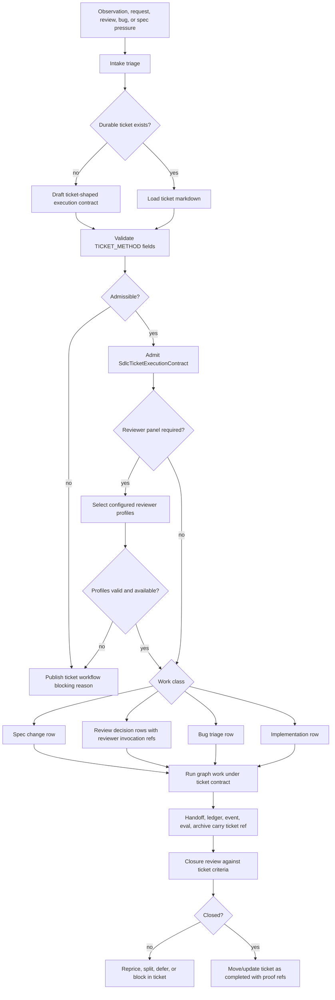
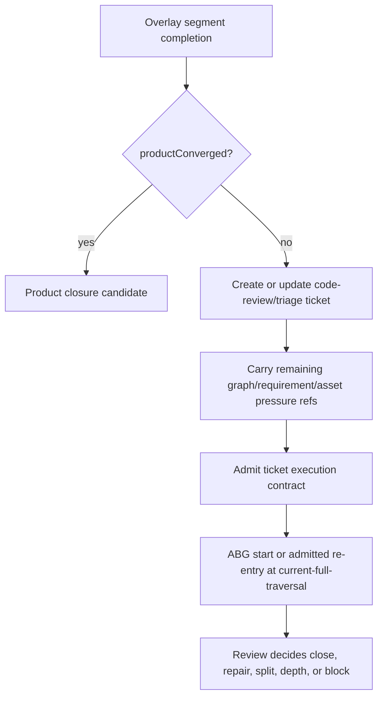

# T-162: First-Class Ticket Workflow For Governed Change

## STDO Triage

First missing layer: design.

The shared method already says tickets are enduring work records and that
execution contracts are run-scoped admitted work surfaces derived from tickets.
`odd_sdlc` product law already names homeostatic triage, lawful re-entry,
ticket/work-item routing, and the installed operator loop.

The current gap is that the TypeScript tenant does not yet make tickets a
complete operator workflow. A cold agent can inspect markdown files and comments,
but the installed product does not yet provide one controlled path for:

- enhancing specifications under declared lawful re-entry;
- turning code review findings into accepted, rejected, deferred, or split work;
- selectively implementing only the accepted review results;
- fixing bugs with first-missing-layer triage and proof;
- admitting the resulting work as a ticket-derived execution contract.

The design re-entry is therefore local to `odd_sdlc.TS`. This ticket must use
`TICKET_METHOD.md`; it must not invent a rival work-tracking law.

## Problem Statement

The project already uses tickets and comments heavily, but the workflow is still
too manual at the operator boundary.

Comments, review notes, forensic posts, and chat transcripts are useful intake
and evidence. They are not status authority. The system needs a durable way to
turn those inputs into governed work without losing the decisions made along the
way.

The main failure modes are:

- a specification enhancement can be applied without a ticket naming the target
  spec surface, target truth, source documents, and lawful re-entry point;
- a code review can produce findings, but implementation can silently apply
  some findings and ignore others without an explicit ruling table;
- a bug can be fixed at the symptom layer even when the first missing layer is
  requirement or design;
- a cold session cannot reliably tell whether a ticket is executable, blocked,
  malformed, stale, awaiting review decision, or closed by proof;
- `asset:ticket/<id>` exists as an operator concept, but ticket validation,
  admission, review selection, execution-contract derivation, and closure proof
  are not yet one first-class workflow.
- reviewer choice can still be carried in prompt text such as "ask Claude" or
  "ask Codex" without a durable reviewer profile, capability declaration,
  output schema, invocation record, or evidence contract.

## Current Code Structure Pass

The current source line already has useful pieces:

- `build_tenants/typescript/code/src/graph/catalog.ts` publishes
  `route_ticket_work_item`, whose declared intent is to project ticket/work-item
  routing under `TICKET_METHOD` authority.
- `build_tenants/typescript/code/src/spec_method/entry.ts` exposes the installed
  commands `catalog`, `query-domain`, `gaps`, `start`, `install`,
  `release-cut`, and `rc-report`. There is no dedicated ticket workflow command
  or ticket validation/admission command yet.
- `entry.ts` already parses `asset:<handle>` start targets and current in-flight
  work has added `overlay:<handle>` parsing. Ticket workflow must fit this
  start-target model instead of creating a second command truth.
- `build_tenants/typescript/code/src/projection/query_domain.ts` publishes
  graph functions, start targets, asset ownership, target bindings, requirement
  fulfillment, and conformance state. It does not yet publish a complete ticket
  workflow projection derived from `.ai-workspace/tickets/`.
- `build_tenants/typescript/code/src/start/public_start.ts` and start policy are
  the right boundary for rejecting backlog, malformed, missing, or unadmitted
  ticket handles before traversal.
- `build_tenants/typescript/code/src/operator/handoff.ts`,
  `installed_operator.ts`, and `traversal_consequence.ts` already carry
  execution contracts, handoff manifests, ledgers, closure decisions, and next
  action projections. Ticket workflow identity must be threaded through those
  existing carriers rather than being carried only in prompt prose.

## Required Design

The ticket file remains the authoritative durable work surface. The product may
publish projections and execution contracts over tickets, but those projections
must be read models or admitted run-scoped contracts. They do not replace the
markdown ticket.

Prime surfaces:

```text
Ticket markdown file
  durable work authority under .ai-workspace/tickets/

SdlcTicketWorkflowProjection
  read-only operator projection over backlog/active/completed ticket files

SdlcTicketExecutionContract
  run-scoped admitted execution basis derived from one ticket or one admitted
  draft ticket-shaped contract
```

Implementation shape:

```text
overlay://odd-sdlc/ticket-workflow
  product overlay that exposes the governed ticket lane

route_ticket_work_item
  graph function used as the sole constructive ticket-workflow entry path

custom F_D ticket workflow plugin rule
  deterministic ticket projection/admission/reviewer/continuation validation

custom F_P ticket route hook
  constructive route of the admitted ticket work item
```

This is the lawful place for custom `F_D` plugins composed with `F_P`: `F_D`
admits and validates ticket authority, reviewer rulings, and continuation
pressure before and after the route; `F_P` constructs the ticket work-item route
surface. Neither plugin family selects vectors, emits runtime events, closes
the run, retries, re-enters, or becomes a second controller. The overlay and
graph function are the typed constructive path; CLI commands and query-domain
output are read/admission clients over that path.

Subordinate rows on the ticket/workflow projection:

```text
SdlcSpecChangeRow
  target spec surface, current truth, target truth, source documents,
  change_class, re_entry_point, proof expectation

SdlcReviewFindingDecisionRow
  finding ref, severity, ruling, rationale, accepted change scope,
  proof required, split-ticket ref when applicable

SdlcBugTriageRow
  symptom, expected behavior, actual behavior, reproduction/evidence refs,
  first missing layer, change_class, re_entry_point

SdlcSelectiveImplementationRow
  accepted decision refs, excluded decision refs, implementation boundary,
  proof surface, non-closure conditions

SdlcOverlaySegmentContinuationRow
  source overlay segment completion ref, completed overlay ref,
  terminal graph function refs, terminal asset refs, remaining graph pressure
  refs, remaining requirement pressure refs, remaining asset pressure refs,
  next eligible overlay refs, selected ticket intake kind, selected start or
  re-entry target, and proof expectation
```

These subordinate rows should not become peer carriers unless implementation
review proves independent identity. The identity-bearing unit is still the
ticket and its admitted execution contract.

Latest capability reload:

- ABG `4.0.0-rc.19` supplies admitted runtime re-entry, construction-intent
  consumption for consequence-selected traversal actions, graph-function zoom
  planning/application, same-edge assurance retry, and current GTL program
  conformance gates consumed by this ticket workflow lane.
- `odd_sdlc` can now distinguish edge closure, overlay segment completion, and
  product convergence. A lite overlay may close every edge and still emit
  `productConverged: false` with remaining graph/requirement/asset pressure.
- Ticket workflow must treat that state as governed continuation pressure. The
  simple lawful path is to create or update a code-review/triage ticket whose
  first action is an admitted start at `overlay://odd-sdlc/current-full-traversal`.
- This is intentionally a brute-force bridge. It does not replace the future
  depth traversal graph function from T-165; it provides the governed entrypoint
  that lets review/triage decide whether to close, repair, split, or escalate to
  depth traversal.

Reviewer selection is part of the ticket workflow, not a separate authority
surface. Concrete reviewers such as Claude and Codex are configured profiles
that may be selected for a ticket, review, or consensus round. Their output is
evidence and work-routing input until the ticket workflow admits the resulting
decision rows.

Reviewer configuration carriers:

```text
SdlcReviewerProfile
  stable reviewer_id, display label, reviewer kind, supported roles, capability
  tags, transport contract ref, prompt/policy ref, output schema, evidence
  contract, scope limits, exclusion rules, availability state

SdlcReviewPanelBinding
  ticket id, subject refs, reviewer profile ids, role assignments,
  required/optional flags, reduction or quorum policy, conflict policy,
  fallback policy, proof expectation

SdlcReviewerInvocationRef
  reviewer profile id, profile config digest, transport binding, run/evidence
  refs, output digest, exit status, projection timestamp
```

Example profile ids are allowed to be short in operator UX:

```text
codex  -> reviewer://odd-sdlc/codex
claude -> reviewer://odd-sdlc/claude
```

The profile registry defines what those names mean. The ticket workflow must not
special-case Claude or Codex in control flow, infer the reviewer from the
current chat agent, or accept unregistered reviewer output as governed review.

## Workflow Axioms

1. A substantive change must enter through a ticket or through a drafted
   ticket-shaped execution contract that is admitted before execution.
2. Comments, code review notes, forensic posts, and chat transcripts are intake
   evidence. They are not task status authority.
3. A code review finding is not executable until it has a ruling:
   `accepted`, `rejected`, `deferred`, or `split_ticket`.
4. Selective implementation means implementing only accepted decision rows and
   preserving rejected/deferred/split rows as visible non-implemented rulings.
5. Bug repair begins with first-missing-layer triage. `realization_refactor` is
   lawful only when requirement and design authority already exist.
6. Specification edits must name the target specification surface, current
   truth, target truth, source documents, `change_class`, and `re_entry_point`.
7. Ticket status comes from the ticket file plus admitted closure proof. It does
   not come from a comment, green test alone, branch state, or event presence.
8. Query-domain and dashboard views are projections. They must fail closed when
   ticket authority is malformed or stale.
9. Reviewer selection is explicit ticket workflow configuration. It does not
   come from the current operator, the current chat, or ambient environment
   defaults.
10. Reviewer output is evidence until reduced into decision rows and admitted by
   the ticket workflow.
11. Overlay segment completion is not product convergence when any remaining
   pressure ref or next eligible overlay ref is present.
12. Segment-completion remaining pressure enters the next work cycle through a
   ticket workflow row or successor ticket, not through a local retry loop.
13. A code-review/triage final node may be the brute-force continuation carrier
   when it preserves source segment refs, remaining pressure refs, and the ABG
   start/re-entry target.

## Operator UX

The exact command names may be refined during implementation, but the installed
workflow must support these operator acts:

```bash
odd-sdlc-ts tickets --workspace .
odd-sdlc-ts ticket-intake --workspace . --from-comment <path> --kind review
odd-sdlc-ts ticket-intake --workspace . --kind bug --evidence <path>
odd-sdlc-ts ticket-admit --workspace . --ticket T-162
odd-sdlc-ts reviewers --workspace .
odd-sdlc-ts ticket-review --workspace . --ticket T-162 --reviewers codex,claude
odd-sdlc-ts ticket-intake --workspace . --from-overlay-segment <path> --kind code_review_triage
odd-sdlc-ts start --workspace . --target asset:ticket/T-162 --until blocked
```

Minimum UX contract:

- `tickets` or the equivalent `query-domain` projection lists ticket state by
  id, status, required-field validity, admissibility, blocking reason, and next
  lawful action.
- backlog tickets are visible but not executable.
- active tickets are executable only after deterministic validation and
  execution-contract admission.
- malformed tickets produce typed blocking reasons instead of being silently
  skipped.
- review findings display their rulings before work begins.
- review-capable tickets display configured reviewer profiles, selected review
  panel, unavailable reviewers, and profile/config digest before review begins.
- unknown or unavailable reviewers block the review act, not the ticket status
  projection as a whole.
- bugs display first-missing-layer triage before work begins.
- spec enhancements display their target specification surfaces before edits.
- overlay-segment continuation tickets display the source segment completion,
  remaining pressure refs, next eligible overlay refs, and selected ABG
  start/re-entry target before work begins.

## End-State Flow Capability



Segment-completion continuation path:



## Design Module Method Constraints

This ticket is governed by `DESIGN_MODULE_METHOD.md`.

- IACS must stay small. The ticket file, workflow projection, and admitted
  execution contract are the prime surfaces. Review, bug, spec-change, and
  selective-implementation rows are subordinate payloads unless a later review
  proves independent carrier identity.
- The workflow must preserve one truth surface for ticket status:
  `.ai-workspace/tickets/`. Generated boards, query-domain output, and comments
  are projections or evidence.
- The implementation must extend the existing graph/catalog, public start,
  query-domain, and operator execution seams. It must not create a separate
  controller loop or backlog database.
- ABG remains authoritative for events, frames, continuations, replay, and
  projection truth. `odd_sdlc` owns ticket semantics and stamps the admitted
  ticket execution basis into its domain ledgers and handoff carriers.
- Ticket workflow must distinguish `F_D` deterministic validation,
  `F_H` human ruling, and `F_P` productive work. Review rulings and
  specification approvals are not silently downgraded to productive worker
  discretion.
- Overlay continuation must stay a ticket workflow concern. ABG owns the start,
  continuation, re-entry, event, and replay mechanics; the ticket owns the
  SDLC meaning of the remaining pressure and the review/triage ruling.
- T-162 realization, 2026-06-14: durable ticket markdown projects into
  `SdlcTicketWorkflowProjection`; active valid tickets admit into
  `SdlcTicketExecutionContract`; `asset:ticket/<id>` selects the
  `overlay://odd-sdlc/ticket-workflow` overlay and the `route_ticket_work_item`
  graph function; the hook profile composes deterministic `F_D` ticket
  authority checks, reviewer-ruling checks, and continuation-pressure checks
  with the constructive `F_P` ticket-route step; the ABG plugin set exposes a
  required `fd_evaluator` rule at
  `evaluation-rule://odd-sdlc/ticket-workflow/fd`.
- The graph function and overlay are the sole implementation path for governed
  ticket starts. Ticket commands in `spec_method/entry.ts` expose projection and
  admission views only; they do not route work outside graph function
  traversal, ABG public start, or admitted runtime re-entry.

## Implementation Checklist

Inside-out sequencing is required.

- [x] define ticket workflow validation over `.ai-workspace/tickets/{backlog,active,completed}` with TICKET_METHOD-required fields
- [x] define `SdlcTicketWorkflowProjection` as a read-only query-domain surface
- [x] define `SdlcTicketExecutionContract` as the admitted run-scoped contract derived from a ticket or drafted ticket-shaped contract
- [x] define a reviewer profile registry/projection for configured reviewers such as `codex` and `claude`
- [x] define `SdlcReviewPanelBinding` so each review-capable ticket can select required and optional reviewers, roles, reduction policy, and fallback policy
- [x] validate reviewer profiles before review or consensus execution; unknown, unavailable, or schema-incompatible reviewers must block the review act with typed reasons
- [x] extend graph catalog with explicit ticket workflow functions only where graph publication is needed; do not hide constructive carriers inside CLI code
- [x] publish ticket workflow state through `query-domain` or a dedicated command that uses the same projection authority
- [x] reject missing, malformed, backlog, stale, or unadmitted `asset:ticket/<id>` handles at public start
- [x] admit active valid tickets into execution contracts before traversal
- [x] carry ticket id, ticket digest, execution contract ref, and ruling refs into handoff manifests
- [x] carry reviewer profile ids, profile config digests, panel binding refs, and reviewer invocation refs into handoff manifests
- [x] carry ticket/execution-contract refs into `SdlcEdgeFulfillmentLedger`, closure decision, eval output, archive, and next-action projection
- [x] carry reviewer invocation refs into review decision rows, ledgers, archives, and next-action projection
- [x] add review decision rows with `accepted`, `rejected`, `deferred`, and `split_ticket` rulings
- [x] make selective implementation consume only accepted review decision rows
- [x] add bug triage rows with expected/actual/reproduction/evidence and first-missing-layer fields
- [x] enforce `realization_refactor` bug admission only when requirement and design authority are present
- [x] add spec-change rows with target spec surface, current truth, target truth, source docs, change class, re-entry point, and proof surface
- [x] add overlay segment continuation rows that bind `productConverged: false`
  segment completion to code-review/triage ticket intake
- [x] carry remaining graph, requirement, asset, and next-overlay pressure refs
  from `sdlc_overlay_segment_completion` into the ticket projection and admitted
  execution contract
- [ ] route final-node code-review/triage tickets through admitted ABG public
  start or runtime re-entry at `overlay://odd-sdlc/current-full-traversal`
  without an SDLC-local loop
- [x] require review/triage rulings for whether the continuation closes, repairs,
  splits, creates a depth traversal ticket, or blocks
- [x] ensure comments/forensics/review posts can be referenced as evidence but cannot set ticket status
- [x] update compact CLI output so blocked ticket workflow states are visible to a cold session
- [x] add fixtures for valid active ticket, malformed ticket, backlog ticket, review-resolution ticket, spec-change ticket, and bug-repair ticket
- [x] add deterministic tests for projection, admission, start rejection, review selection, bug triage, and spec-change authority
- [ ] add deterministic tests for configured `codex` and `claude` reviewer selection, unknown-reviewer rejection, unavailable-reviewer blocking, and reviewer output schema rejection
- [x] add deterministic tests for overlay-segment continuation ticket intake,
  remaining-pressure preservation, and current-full-traversal start admission
- [ ] add one scenario proof that starts from a review comment, records rulings in a ticket, implements only accepted findings, and leaves deferred findings visible
- [ ] add one scenario proof that starts from a completed lite overlay segment
  with `productConverged: false`, emits a code-review/triage ticket, starts the
  ticket at current-full-traversal, and preserves the source segment refs in
  handoff, ledger, next-action, and archive truth

## Migration Checklist

- [x] old truth path is named explicitly
- [x] new truth path is named explicitly
- [x] producer set for the new truth is listed
- [x] consumer set for the new truth is listed
- [x] projection/read-model surfaces are listed
- [x] old truth path is removed or explicitly demoted from authority
- [x] mixed-state behavior is no longer accepted as closure evidence
- [x] tests proving mixed old/new behavior are removed or repriced
- [x] recurring realization patterns are checked against existing library/commonization surfaces
- [x] ticket declares library usage and names the governing library or rationale
- [x] if the work exists in more than one build tenant, this backlog/active ticket carries only one tenant lifecycle and any sibling tenant work lives on its own suffixed ticket
- [ ] ticket wording, product wording, and proof claims are reconciled before closure

Old truth path:

- prompt-only work classification;
- comment-only review resolution;
- raw `asset:ticket/<id>` routing without deterministic ticket validation and
  admitted execution-contract derivation;
- manual inspection of `.ai-workspace/tickets/` as the only workflow surface.
- treating `overlay_segment_complete` as product closure when the segment still
  advertises remaining pressure or next eligible overlay refs.

New truth path:

- ticket markdown remains durable authority;
- ticket workflow projection renders current ticket state;
- ticket execution contract admits the run basis;
- review panel binding selects configured reviewers and records reviewer
  invocation provenance;
- start/handoff/ledger/eval/archive/closure all carry the admitted ticket basis.
- overlay segment completion with remaining pressure emits or references a
  ticket workflow continuation row before any full-traversal closure claim.

Producer set:

- `.ai-workspace/tickets/{backlog,active,completed}` markdown files;
- `projectSdlcTicketWorkflow(...)`;
- `admitSdlcTicketExecutionContract(...)`;
- `asset:ticket/<id>` public-start admission;
- `overlay://odd-sdlc/ticket-workflow` plus `route_ticket_work_item`;
- the required ticket workflow `F_D` plugin rule and ticket route `F_P` hook.

Consumer set:

- query-domain ticket workflow projection;
- `tickets`, `reviewers`, and `ticket-admit` operator commands;
- public-start execution contract resolution;
- worker handoff manifests and traversal intent packages;
- installed operator ledger, closure, consequence, next-action, and archive
  derivations.

Projection/read-model surfaces:

- `SdlcTicketWorkflowProjection`;
- `SdlcTicketWorkflowRow`;
- `SdlcTicketExecutionContract`;
- `SdlcReviewPanelBinding`;
- `SdlcReviewFindingDecisionRow`;
- `SdlcBugTriageRow`;
- `SdlcSpecChangeRow`;
- `SdlcOverlaySegmentContinuationRow`.

## Acceptance Criteria

- AC-1: `query-domain` or an installed ticket command projects backlog, active,
  completed, malformed, blocked, and stale ticket states from
  `.ai-workspace/tickets/` without creating a second ticket truth store.
- AC-2: the projection validates TICKET_METHOD-required fields and reports typed
  blocking reasons for missing `id`, `title`, `type`, `ticket_category`,
  `status`, `goal`, `change_intent`, `change_class`, `re_entry_point`,
  `triaged_at`, `created_at`, or `updated_at`.
- AC-3: `start --target asset:ticket/<id>` rejects missing, malformed, backlog,
  completed-without-reopen, stale, and unadmitted tickets before traversal.
- AC-4: a valid active ticket can be admitted into an execution contract whose
  basis includes ticket id, ticket path, ticket digest, target truth,
  superseded truth when present, closure law, evaluation criteria,
  non-closure conditions, and source documents.
- AC-5: code review tickets require decision rows for findings. Accepted rows
  are executable; rejected, deferred, and split-ticket rows remain visible and
  are not silently implemented.
- AC-6: bug tickets require expected behavior, actual behavior, reproduction or
  evidence refs, first missing layer, change class, and re-entry point before
  implementation.
- AC-7: bug tickets declaring `realization_refactor` are rejected when the
  governing requirement or design surface is absent.
- AC-8: specification-change tickets require target specification surface,
  current truth, target truth, source documents, change class, re-entry point,
  proof surface, and closure law before edits are treated as governed work.
- AC-9: comments, code review notes, and forensic posts can be cited as intake
  evidence but cannot change ticket status or satisfy closure by themselves.
- AC-10: handoff manifests, ledgers, closure decisions, eval outputs, archives,
  and next-action projections preserve ticket/execution-contract refs for each
  ticket-driven run.
- AC-11: a cold session can inspect the ticket workflow projection and determine
  the next lawful action for each active ticket without prior chat memory.
- AC-12: completed-ticket closure proof cites the admitted ticket execution
  contract, governing requirement/design/source surfaces, and durable proof
  artifacts rather than a summary comment alone.
- AC-13: review-capable tickets can select configured reviewer profiles such as
  `codex` and `claude`; unknown, unavailable, or schema-incompatible reviewer
  selections produce typed blocking reasons before review execution.
- AC-14: review decision rows preserve reviewer profile id, profile config
  digest, panel binding ref, invocation ref, output digest, and evidence refs.
- AC-15: Claude, Codex, human, or service reviewer output cannot change ticket
  status, authorize implementation, or satisfy closure until admitted by the
  ticket workflow.
- AC-16: `sdlc_overlay_segment_completion` with `productConverged: false`
  projects as continuation pressure, not as closure, and creates or references
  a code-review/triage ticket workflow row.
- AC-17: the continuation row carries source segment completion ref, terminal
  graph function refs, terminal asset refs, remaining graph/requirement/asset
  pressure refs, next eligible overlay refs, selected start/re-entry target, and
  proof expectation.
- AC-18: a final-node code-review/triage ticket starts only through admitted
  ticket authority and ABG public start or admitted runtime re-entry at
  `overlay://odd-sdlc/current-full-traversal`; local cursor moves and prompt-only
  loops are rejected.
- AC-19: the continuation review must rule `close`, `repair`, `split_ticket`,
  `depth_traversal`, `defer`, or `block` before implementation or closure can
  proceed.
- AC-20: product convergence cannot be claimed while a segment-derived
  continuation ticket has unruled findings, unclosed child/depth rows, or
  unconsumed remaining pressure refs.

## Required Proof

Add deterministic tests or live-equivalent scenario tests with these assertion
shapes:

- `test_t162_ticket_workflow_projection.test.mjs`
  - valid tickets project as valid;
  - malformed tickets project with typed field failures;
  - comments do not become status authority.
- `test_t162_ticket_execution_contract_admission.test.mjs`
  - active valid ticket admits to execution contract;
  - backlog/malformed/completed ticket handles are rejected by public start;
  - execution contract carries ticket path, digest, source docs, closure law,
    evaluation criteria, and non-closure conditions.
- `test_t162_review_decision_selective_implementation.test.mjs`
  - accepted review findings are executable;
  - rejected/deferred findings remain visible and are not implemented;
  - split findings create or reference durable follow-up tickets.
- `test_t162_reviewer_profile_selection.test.mjs`
  - configured `codex` and `claude` reviewer profiles can be selected by short
    operator names and resolved to stable profile ids;
  - unknown and unavailable reviewer profiles block review execution with typed
    reasons;
  - reviewer output without a matching profile digest, invocation ref, and output
    schema is rejected as governed review evidence.
- `test_t162_bug_and_spec_reentry.test.mjs`
  - bug repair rejects illegal `realization_refactor` when requirement/design
    authority is missing;
  - spec-change work rejects missing target truth or source documents.
- `test_t162_overlay_segment_ticket_continuation.test.mjs`
  - overlay segment completion with `productConverged: false` creates or
    references a code-review/triage ticket workflow row;
  - remaining pressure refs and next eligible overlay refs are preserved in the
    ticket projection and admitted execution contract;
  - current-full-traversal starts only through admitted ABG start/re-entry
    authority;
  - product convergence is rejected until the continuation ticket is ruled and
    closed or split.
- scenario fixture `t162_ticket_workflow_review_resolution`
  - starts from a review comment;
  - creates or updates a ticket with finding rulings;
  - admits the ticket execution contract;
  - runs only accepted work;
  - preserves deferred/rejected rulings in the ticket projection.

## Product Validation

This design matches `specification/PRODUCT.md`.

- The installed operator loop already treats the agentic coder CLI as the user
  interface over installed product truth. Ticket workflow becomes part of that
  installed operator surface.
- Product text already says triaged ticket/work-item intake is live through the
  `asset:` family as `asset:ticket/<ticket_id>` when `query-domain` publishes
  that handle. This ticket makes the validation, admission, and closure
  semantics real.
- The homeostatic loop already separates observation, triage, route binding,
  constitutional repricing, and renewed derivation. Ticket workflow uses those
  boundaries instead of collapsing all defects into code repair.
- The reusable review/consensus host-binding pattern already exists in product
  law. Review findings under this ticket become governed decision rows before
  implementation, not free-form agent discretion.
- Reviewer configuration composes with that pattern: Claude, Codex, humans, or
  services are selectable profiles bound into Review or Consensus rounds, not
  hardcoded sovereign evaluators.

This design does not require a new ABG capability beyond the current rc19
substrate. ABG remains the runtime substrate and owns start, continuation,
re-entry, zoom, event, and replay truth. `odd_sdlc` binds ticket authority and
segment-continuation pressure into its domain overlays, graph-function route,
plugin contracts, execution contracts, ledgers, projections, and operator UX.

## Current Proof, 2026-06-14

Implemented and verified surfaces:

- `build_tenants/typescript/code/src/tickets/workflow.ts` projects
  `.ai-workspace/tickets/{backlog,active,completed}` into read-only workflow
  rows, admits active ticket execution contracts, preserves reviewer/decision
  rows, bug/spec rows, and overlay continuation rows, and fails closed for
  malformed, stale, inactive, unruled, or authority-incomplete tickets.
- `overlay://odd-sdlc/ticket-workflow` publishes `route_ticket_work_item` as
  the graph-function entry path for ticket work.
- `hookContractByEdgeName("route_ticket_work_item")` composes deterministic
  ticket-workflow `F_D` checks with the constructive ticket-route `F_P` hook.
- `createSdlcAbgPluginSet(...)` includes required
  `evaluation-rule://odd-sdlc/ticket-workflow/fd`; installed operator
  evaluation accepts non-ticket edges as not applicable and blocks ticket-route
  edges missing an admitted ticket execution contract.
- public start rejects missing, malformed, backlog, completed, stale, and
  unadmitted `asset:ticket/<id>` handles before traversal; valid active tickets
  select the ticket workflow overlay and graph function.
- query-domain, `tickets`, `reviewers`, and `ticket-admit` expose ticket
  workflow projection/admission without creating runtime authority.
- worker handoff, traversal intent package, ledgers, closure/consequence basis,
  and next-action projection carry admitted ticket execution refs.

Verification:

- `npm run test:t162` passed 10/10.
- `npm run lint:semantic` passed.
- `npm run test:t033` passed 8/8.
- `npm run test:t058` passed 17/17.
- `npm run test:semantic` passed 1023/1023.

Remaining before ticket closure:

- deterministic unavailable-reviewer and schema-incompatible reviewer output
  rejection cases;
- scenario proof that starts from a review comment, records ticket rulings,
  implements only accepted findings, and leaves deferred findings visible;
- scenario proof that starts from a completed lite overlay segment with
  `productConverged: false`, emits or references a code-review/triage ticket,
  starts the continuation through admitted ABG public start or runtime re-entry
  at `overlay://odd-sdlc/current-full-traversal`, and preserves source segment
  refs in handoff, ledger, next-action, and archive truth.
