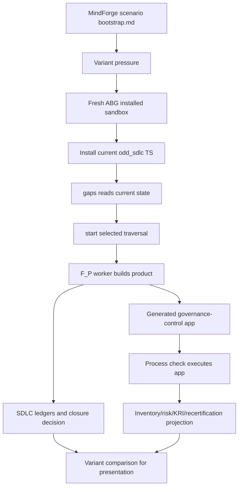

# T-163: MindForge AI Assistant Sandbox Scenario Family

## STDO Triage

First missing layer: design.

The presentation needs more than a conceptual claim. It needs a concrete
scenario that can be run inside `odd_sdlc` sandbox infrastructure:

```text
specification variant
  -> fresh ABG installed sandbox
  -> install current odd_sdlc TypeScript product
  -> run governed start/gaps path
  -> build minimal software
  -> execute generated software
  -> preserve ledgers/events/eval/archive evidence
  -> compare governance output across variants
```

This is not an ABG feature request and not a full `odd_mindforge` product build.
It is a presentation-grade proof scenario under the existing `odd_sdlc`
scenario harness. MindForge-specific semantics remain downstream domain policy
for the fixture and generated product surface.

The lawful re-entry point is design because the product already supports
installed sandboxes, scenario fixtures, graph-function traversal, ledgers,
archives, and proof surfaces. The missing design is the scenario family and its
acceptance shape.

## STDO Method Rulings

This ticket is executable only under these rulings.

### Ruling 1 - Change Class

The change class remains `design_reframe`.

Reason: the requested work changes how an existing realization capability is
used and demonstrated. It does not change `odd_sdlc` intent, product
definition, requirements, ABG runtime law, GTL language, or shared method.

Escalation rule:

- if implementation discovers that `runScenarioSandbox` cannot support this
  scenario without changing its fixture/descriptor contract, re-enter as a
  dependent realization ticket against the harness;
- if implementation discovers that `odd_sdlc` product law lacks the claimed
  scenario capability, stop and open a requirement or product repricing ticket;
- if implementation discovers a missing shared-law concept, stop and route that
  to `specification_methodology`; do not patch shared law through this ticket.

### Ruling 2 - Authority Order

For this ticket, authority resolves in this order:

1. T-163 ticket body and frontmatter.
2. `specification/PRODUCT.md` and the cited odd_sdlc requirements.
3. T-156 scenario harness contract and current code.
4. T-160 overlay behavior when overlays are used.
5. MindForge source material and analysis as scenario-domain input.
6. Presentation deck as consumer evidence only.

The presentation deck is not implementation authority. It may be updated only
after the scenario evidence exists or when it explicitly labels a future target.

### Ruling 3 - Ticket Category Discipline

`ticket_category: scenario_proof` means:

- the primary deliverable is a replayable proof scenario;
- the authoritative work units are fixture files, a descriptor, deterministic
  tests, optional live proof, and archived evidence;
- the scenario must use existing installed-product and sandbox mechanisms;
- changes to core runtime, shared method, or product law are non-closure unless
  split into a separate ticket.

This local category does not supersede shared `TICKET_METHOD`. It applies the
ticket-as-execution rule to a scenario proof.

### Ruling 4 - Workspace, Ledger, Event, Eval Roles

The scenario must preserve the W/L/E/Ev relation:

```text
W  = sandbox workspace under construction
L  = odd_sdlc ledgers, handoffs, closure decisions, and scenario comparison evidence
E  = immutable runtime/operator events emitted during each traversal
Ev = deterministic assertions, process checks, and optional live-review evidence over W/L/E
```

The generated app and its inventory/risk/KRI outputs are projections from W/L/E.
They are not new mutable authority surfaces. Any F_P callout that performs
construction must leave ledger evidence sufficient for Ev to evaluate the work.

### Ruling 5 - MindForge Boundary

MindForge terms are admitted as downstream scenario-domain policy:

- AI inventory;
- use-case risk tier;
- third-party model or vendor evidence;
- control path;
- approval gate;
- monitoring/KRI selection;
- recertification trigger.

They are not admitted as ABG core carrier additions in this ticket.

### Ruling 6 - Live Worker Boundary

Deterministic tests prove descriptor and harness law. They do not prove that
the software can be built from the specification.

Full T-163 closure requires an opt-in worker run that builds and executes the
generated product. Deterministic-only work may close Phase 2, but it cannot
close this ticket unless the ticket is explicitly repriced or split into a
smaller deterministic-setup ticket.

## Current Code Structure Pass

The action path is constrained by existing code:

- `build_tenants/typescript/test_env/sandbox/scenario_sandbox.mjs` owns the
  generic six-step run: mint run root, provision ABG installed sandbox, assert
  sandbox evidence, copy fixture, install odd_sdlc TS, loop `gaps -> start`.
- `build_tenants/typescript/test_env/sandbox/scenarios/README.md` declares the
  descriptor contract. New scenarios should be fixture directory plus
  `*.scenario.mjs` descriptor plus one driver test entry.
- `build_tenants/typescript/test_env/sandbox/test_scenario_sandbox.test.mjs`
  is the deterministic and live opt-in test driver.
- Existing descriptors such as T-131 and T-160 are precedent for fixture source
  files, live factories, env-var gating, overlay start targets, max advances,
  process checks, and archive-artifact assertions.
- `scenario_sandbox.mjs` already supports `workspaceFiles`,
  `handoffEdgeSequencePrefix`, `processChecks`, `latestArchiveArtifacts`, and
  overlay expectations. This ticket should use those before adding harness
  behavior.

The first implementation pass must not edit `scenario_sandbox.mjs` unless a
missing generic assertion is proven. If a harness edit is needed, document the
new assertion as generic scenario infrastructure, not as MindForge-specific
logic.

## Required Design

The design module for this ticket is the scenario family. Its identity-bearing
surfaces are:

```text
MindForge scenario fixture family
  source-of-truth synthetic project inputs and variants

MindForge scenario descriptor
  data contract binding fixture files, traversal target, live worker settings,
  expected outputs, archive evidence, and process checks

MindForge generated governance-control product
  software produced inside the sandbox workspace by odd_sdlc traversal

MindForge scenario comparison evidence
  read model comparing baseline and variant generated outputs plus relevant
  ledger/archive evidence
```

No additional peer carrier should be introduced unless implementation proves
independent identity. Variant pressure belongs in fixture data. Execution logic
belongs in `odd_sdlc`. Test assertions belong in the scenario descriptor or
generic harness.

### Design Module Constraints

- The fixture is declaration data. It may include specifications, constraints,
  synthetic evidence, and source documents. It may not include prebuilt
  generated implementation output.
- The descriptor is data. It may declare expected files, process checks, worker
  URI, start target, and archive expectations. It may not perform install,
  copy, command execution, or fixture mutation.
- The generated product is tenant output inside the sandbox workspace. It may
  be tested and compared. It must not be copied back into the fixture as source
  truth.
- MindForge governance outputs are projections over admitted scenario facts.
  They must be reproducible from the generated product and archived evidence.
- A variant is lawful only when it changes declared input pressure, not when it
  hardcodes a different expected result in the test.

## Use Case

Use case:

```text
MindForge-governed internal GenAI assistant for regulated financial work
```

The assistant is intentionally internal. That keeps the first proof focused on
governed AI adoption without needing customer data, production integration, or
external model execution.

The generated software should be a minimal governance-control product, not a
full chatbot:

```text
mindforge-ai-assistant-governance
```

It should accept a use-case record and produce a governance state projection:

```json
{
  "useCaseId": "MF-AI-001",
  "inventoryStatus": "registered",
  "riskTier": "moderate",
  "controlPath": "enhanced_review",
  "preDeploymentGate": "pending_committee_approval",
  "monitoring": ["unsupported_answer_rate", "third_party_model_change"],
  "recertification": "annual_or_material_change"
}
```

The exact output shape may evolve, but it must stay small, executable, and
visibly tied to the specification variant.

## Scenario Family

Create a fixture family under:

```text
build_tenants/typescript/test_env/fixtures/mindforge_ai_assistant/
```

Required variants:

```text
baseline_internal_assistant/
  bootstrap.md
  .ai-workspace/context/project_constraints.yml

third_party_model_variant/
  bootstrap.md
  .ai-workspace/context/project_constraints.yml
  evidence/third_party_ai_card.md

high_risk_customer_impact_variant/
  bootstrap.md
  .ai-workspace/context/project_constraints.yml

material_change_recertification_variant/
  bootstrap.md
  .ai-workspace/context/project_constraints.yml
```

Minimum closure requires the baseline plus at least one variant to run. The full
presentation target is all four variants.

### Fixture Authority Contract

Each variant fixture must be cold-session readable. At minimum it must explain:

- project intent;
- intended generated product;
- synthetic use-case facts;
- MindForge governance pressure being represented;
- expected output differences from the baseline;
- forbidden implementation shortcuts.

`project_constraints.yml` must bind the construction target:

```text
build_tenants/mindforge_ai_assistant/
```

and must be clear enough that the worker does not write product code into
`odd_sdlc` source or into the fixture directory as an authority surface.

## Variant Semantics

### Baseline Internal Assistant

Purpose:

- internal staff productivity assistant
- no customer-facing autonomy
- no customer-impacting decisioning
- moderate or low/moderate risk

Expected governance output:

- AI inventory entry registered
- baseline or enhanced review depending on declared data sensitivity
- pre-deployment review required
- monitoring configured
- annual or policy-defined recertification

### Third-Party Model Variant

Purpose:

- same assistant, now using an external foundation model or provider

Expected changed pressure:

- third-party disclosure required
- provider/model change KRI added
- vendor disclosure evidence linked
- procurement or third-party risk review appears in control path

### High-Risk Customer Impact Variant

Purpose:

- assistant output can influence regulated customer or advice workflows

Expected changed pressure:

- higher inherent risk tier
- stronger control path
- committee or senior approval gate
- stronger monitoring and human-over-the-loop requirements
- residual risk assessment becomes blocking before deployment

### Material Change Recertification Variant

Purpose:

- already governed assistant receives a material model, provider, data, or use
  scope change

Expected changed pressure:

- recertification re-entry
- prior approval is not enough
- change reason and evidence become visible
- review graph reopens at the proper layer rather than patching runtime output

## Scenario Descriptor

Create:

```text
build_tenants/typescript/test_env/sandbox/scenarios/mindforge_ai_assistant.scenario.mjs
```

The descriptor should expose:

```text
mindforgeAiAssistantBaselineScenario
mindforgeAiAssistantVariantScenarios
mindforgeAiAssistantLiveScenario(...)
```

The deterministic scenarios should prove induction and admissible start shape.
The live scenario should be opt-in with env vars, following the existing T-131,
T-132, T-133, and T-160 patterns.

## Traversal Strategy

Preferred path when T-160 overlays are available:

```text
overlay:bootstrap-requirements
  -> overlay:solution-architecture
  -> overlay:lite-design-module-implementation
```

Fallback path if overlay support is not stable enough for this ticket:

```text
start --target next --until first_traversal
```

The ticket must declare which path it uses. It may not silently switch between
overlay and non-overlay traversal.

### Traversal Admission Ruling

The preferred action path is the overlay path because it demonstrates guided
graph traversal. The fallback path is allowed only when the ticket records:

- the exact overlay blocker;
- why the blocker is outside T-163 scope;
- the non-overlay start target and stop rule used instead;
- whether the presentation claim is reduced from "overlay-guided" to
  "sandbox-guided" for that proof run.

If overlays are used, the descriptor must assert `firstStartOverlayRef` or an
equivalent overlay evidence artifact. If overlays are not used, the descriptor
must not imply that overlay proof exists.

## Generated Product Expectations

Target tenant root:

```text
build_tenants/mindforge_ai_assistant/
```

Minimum generated files:

```text
build_tenants/mindforge_ai_assistant/package.json
build_tenants/mindforge_ai_assistant/src/index.js
build_tenants/mindforge_ai_assistant/examples/use_case.json
```

Minimum process check:

```bash
node build_tenants/mindforge_ai_assistant/src/index.js \
  build_tenants/mindforge_ai_assistant/examples/use_case.json
```

The check must assert deterministic output fields for the active variant.

### Generated Output Contract

The output does not need to be a complete financial AI governance system. It
must be sufficient to prove controlled specification variation:

```text
useCaseId
inventoryStatus
riskTier
controlPath
preDeploymentGate
monitoring
thirdPartyDisclosureRequired
recertification
sourceVariant
```

The process check should compare the emitted JSON or stdout against fields
declared by the active scenario descriptor. A string-only "Hello, world" style
check is not enough for this ticket because the proof point is governed
variation.

## End-State Flow



## Design Constraints

- Use the existing parameterised scenario sandbox from T-156.
- Use fresh workspaces; do not mutate the source repo as the product under
  construction.
- Install `odd_sdlc` from the current local TypeScript package source, the same
  way existing scenario descriptors do.
- Keep MindForge-specific risk, inventory, KRI, disclosure, escalation, and
  recertification concepts in the fixture/generated downstream product surface.
- Do not add financial-services carriers to ABG core for this ticket.
- Treat inventory, risk register, KRI view, and audit pack as projections over
  admitted evidence.
- Use only synthetic demonstration data.
- Keep the generated product small enough for a presentation proof and repeated
  sandbox iteration.

## Execution Sequencing

Implement in this order. Do not move to the next phase until the prior phase
has a reviewable proof surface.

### Phase 1 - Authority And Fixture Design

Deliver:

- baseline fixture;
- at least one variant fixture;
- fixture README or bootstrap passages explaining variant pressure;
- project constraints binding `build_tenants/mindforge_ai_assistant/`.

Exit gate:

- a cold reader can identify the intended product, the MindForge pressure, and
  why no prebuilt implementation output is present.

### Phase 2 - Descriptor And Deterministic Harness Proof

Deliver:

- `mindforge_ai_assistant.scenario.mjs`;
- deterministic test registration;
- source file assertions for baseline and variant fixtures;
- install evidence assertion through the existing harness.

Exit gate:

- `npm run test:scenario-sandbox` passes or fails for a ticket-relevant reason
  documented in the ticket or follow-up comment.

### Phase 3 - Live Build Proof

Deliver:

- opt-in live scenario factory;
- env-var gated test;
- worker, start target, max advances, stop rule, workspace file expectations,
  handoff edge sequence, process checks, and archive artifact assertions.

Exit gate:

- live run builds `build_tenants/mindforge_ai_assistant/` in the sandbox
  workspace and executes the generated app.

### Phase 4 - Variant Comparison And Presentation Evidence

Deliver:

- baseline and variant output comparison;
- archive path recorded for the proof run;
- deck updated with exact command, scenario id, archive path, and observed
  governance differences.

Exit gate:

- a presentation reader can inspect the archive and see the same difference the
  deck claims.

## Implementation Checklist

- [x] Phase 1: create baseline fixture under `fixtures/mindforge_ai_assistant/baseline_internal_assistant/`
- [x] Phase 1: create at least one variant fixture with changed governance pressure
- [x] Phase 1: ensure every fixture declares project constraints for `build_tenants/mindforge_ai_assistant/`
- [x] Phase 1: ensure fixture source files contain no prebuilt implementation output
- [x] Phase 1: document variant pressure and forbidden shortcuts in fixture source text
- [x] Phase 2: add `mindforge_ai_assistant.scenario.mjs`
- [x] Phase 2: register deterministic scenario tests in `test_scenario_sandbox.test.mjs`
- [x] Phase 2: assert baseline and variant source-file presence before copy
- [x] Phase 2: assert deterministic install evidence from the existing harness
- [x] Phase 2: assert selected traversal target and overlay evidence when overlay traversal is used
- [x] Phase 3: add opt-in live scenario function with worker URI and max-advance controls
- [x] Phase 3: assert generated workspace files under `build_tenants/mindforge_ai_assistant/`
- [x] Phase 3: ensure generated product has an executable process check
- [x] Phase 3: assert variant-specific governance output fields
- [x] Phase 3: assert required archive artifacts exist for the live proof path
- [x] Phase 4: capture baseline-versus-variant comparison evidence
- [x] Phase 4: update the presentation deck with the exact scenario command and observed proof archive
- [x] Phase 4: add a short presentation note explaining baseline versus variant differences

## Implementation Evidence - 2026-05-12

Implemented proof surfaces:

- fixture family:
  `build_tenants/typescript/test_env/fixtures/mindforge_ai_assistant/`
- scenario descriptor:
  `build_tenants/typescript/test_env/sandbox/scenarios/mindforge_ai_assistant.scenario.mjs`
- deterministic/live test registration:
  `build_tenants/typescript/test_env/sandbox/test_scenario_sandbox.test.mjs`
- generic JSON process-check support:
  `build_tenants/typescript/test_env/sandbox/scenario_sandbox.mjs`
- generic materialization-evidence assertion over operator-run ledger history:
  `build_tenants/typescript/test_env/sandbox/scenario_sandbox.mjs`
- presentation proof slides:
  `docs/presentations/mindforge-gtl-abg-odd-governance-executive-deck.md`

Deterministic proof:

```bash
npm run test:scenario-sandbox
```

Observed result:

```text
tests 26
pass 20
skipped 6
fail 0
```

Live proof commands:

```bash
npm run build:semantic && \
ODD_SDLC_TS_MINDFORGE_AI_ASSISTANT_SCENARIO_LIVE=1 \
ODD_SDLC_TS_MINDFORGE_AI_ASSISTANT_SCENARIO_WORKER=process://claude \
ODD_SDLC_TS_MINDFORGE_AI_ASSISTANT_SCENARIO_VARIANT=baseline_internal_assistant \
ODD_SDLC_TS_MINDFORGE_AI_ASSISTANT_SCENARIO_MAX_ADVANCES=3 \
node --test --test-name-pattern "T-163 MindForge AI assistant live" \
  test_env/sandbox/test_scenario_sandbox.test.mjs

npm run build:semantic && \
ODD_SDLC_TS_MINDFORGE_AI_ASSISTANT_SCENARIO_LIVE=1 \
ODD_SDLC_TS_MINDFORGE_AI_ASSISTANT_SCENARIO_WORKER=process://claude \
ODD_SDLC_TS_MINDFORGE_AI_ASSISTANT_SCENARIO_VARIANT=third_party_model_variant \
ODD_SDLC_TS_MINDFORGE_AI_ASSISTANT_SCENARIO_MAX_ADVANCES=3 \
node --test --test-name-pattern "T-163 MindForge AI assistant live" \
  test_env/sandbox/test_scenario_sandbox.test.mjs
```

Observed live result:

```text
baseline_internal_assistant: pass 1, fail 0
third_party_model_variant: pass 1, fail 0
```

Proof archives:

```text
build_tenants/typescript/test_env/test_runs/scenario_t163_mindforge_ai_assistant_baseline_internal_assistant_live/20260512T144139800Z_pid21353
build_tenants/typescript/test_env/test_runs/scenario_t163_mindforge_ai_assistant_third_party_model_variant_live/20260512T143352700Z_pid11475
```

Latest clean operator archives:

```text
build_tenants/typescript/test_env/test_runs/scenario_t163_mindforge_ai_assistant_baseline_internal_assistant_live/20260512T144139800Z_pid21353/workspace/.ai-workspace/runtime/odd_sdlc/operator-runs/20260512T144548390Z_pid21353
build_tenants/typescript/test_env/test_runs/scenario_t163_mindforge_ai_assistant_third_party_model_variant_live/20260512T143352700Z_pid11475/workspace/.ai-workspace/runtime/odd_sdlc/operator-runs/20260512T143818742Z_pid11475
```

Observed generated output comparison:

| Field | Baseline | Third-party model variant |
| --- | --- | --- |
| `controlPath` | `enhanced_review` | `third_party_enhanced_review` |
| `preDeploymentGate` | `pending_ai_risk_review` | `pending_vendor_ai_risk_review` |
| `monitoring` | `unsupported_answer_rate`, `policy_content_staleness` | plus `third_party_model_change` |
| `thirdPartyDisclosureRequired` | `false` | `true` |
| `sourceVariant` | `baseline_internal_assistant` | `third_party_model_variant` |

Closure note:

The implementation is a closure candidate pending review. The ticket now lives
under `.ai-workspace/tickets/active/` so its `status: active` frontmatter and
ticket lane agree.

## Review Repair - 2026-05-13

The code-review repair keeps the Product.md F_P/F_D boundary intact:

- exact generated-output checks are descriptor-declared process checks over the
  emitted JSON projection, not MindForge semantics hardcoded into the harness;
- `recertification` is now compared as a declared governed field;
- `monitoring` now uses exact order-insensitive array membership for this
  scenario because the fixture declares the selected monitoring controls but
  does not make serialization order a governance fact;
- expected generated workspace files must have materialization evidence in the
  operator-run ledger history, but they are not required to be re-materialized in
  the final clean retry archive;
- the proof-surface glob now matches the actual
  `scenario_t163_mindforge_ai_assistant_*` archive prefix;
- the scenario descriptor README now documents the added generic expectation
  fields.

## Clean Default-Overlay Rerun - 2026-05-13

The first post-review live run exposed a real scenario-spec defect: the fixture
declared generated product files and output values, but did not make the
product-file lineage contract explicit enough for a cold F_P worker. The
runtime correctly rejected the first materialization attempt, then admitted a
repair after `examples/use_case.json`, `package.json`, and `src/index.js`
carried parseable requirement lineage.

The repair was made at the scenario specification layer, not in ABG core and
not by hardcoding MindForge semantics into the harness:

- each MindForge variant `specification/PRODUCT.md` now declares a
  `Product File Lineage Contract`;
- generated JSON product files must carry `requirementTraceObligationIds`;
- generated source must carry native `// requirement:<canonical-id>` comments;
- stdout remains a governance-state projection and must not copy lineage fields.

Rerun command:

```bash
ODD_SDLC_TS_MINDFORGE_AI_ASSISTANT_SCENARIO_LIVE=1 \
node --test --test-name-pattern "T-163 MindForge AI assistant live" \
  test_env/sandbox/test_scenario_sandbox.test.mjs
```

Observed result:

```text
pass 1
fail 0
duration_ms 256452.637667
```

Clean proof archive:

```text
build_tenants/typescript/test_env/test_runs/scenario_t163_mindforge_ai_assistant_third_party_model_variant_live/20260512T163411242Z_pid80736
```

Closure/eval sequence:

```text
derive_lite_design_adr_surface: close / passed
derive_lite_module_surface: close / passed
derive_lite_component_code_surface: close / passed
```

No retry disposition occurred in this rerun.

## Acceptance Criteria

- AC-1: the baseline MindForge AI assistant fixture is self-contained and can be
  copied into a fresh sandbox by `runScenarioSandbox`.
- AC-2: at least one specification variant fixture is present and differs by a
  clear MindForge governance pressure such as third-party model disclosure,
  high-risk customer impact, or material-change recertification.
- AC-3: deterministic sandbox tests prove the scenarios install the current
  local odd_sdlc TypeScript product into a fresh workspace.
- AC-4: live opt-in scenario can build the minimal
  `mindforge-ai-assistant-governance` product from the specification without
  prebuilt implementation source in the fixture.
- AC-5: the harness executes the generated product with a process check and
  validates deterministic output.
- AC-6: baseline and variant outputs differ in at least one governed field:
  risk tier, control path, approval gate, monitoring list, disclosure status, or
  recertification state.
- AC-7: archive evidence includes handoff manifest, worksite evidence, edge
  fulfillment ledger, closure decision, next-action projection, and any overlay
  segment evidence when overlay traversal is used.
- AC-7a: every generated workspace file named by the live descriptor has
  materialization evidence in the operator-run ledger history. This may span
  repair attempts; the harness must not require every generated file to be
  re-ledgered by the final clean retry archive when earlier governed F_P work
  produced it and the run history preserves the evidence.
- AC-8: the scenario does not add or require MindForge carriers in ABG core.
- AC-9: generated inventory, KRI, risk, and audit views are presented as
  projections, not as writable authority surfaces.
- AC-10: the presentation deck names the scenario, command, and proof archive
  path so the executive demo can be replayed or inspected from a cold session.
- AC-11: a cold session can execute the ticket phases in order without needing
  chat history or private context.
- AC-12: any use of traversal overlays is asserted by descriptor evidence; any
  non-overlay fallback is explicitly recorded with the reduced proof claim.
- AC-13: the scenario comparison demonstrates input pressure flowing through
  W/L/E/Ev: changed fixture facts, changed generated output, and archived
  ledger/eval evidence.
- AC-14: if a harness change is made, it is generic scenario infrastructure
  covered by a deterministic regression and not MindForge-specific logic.
- AC-15: closure notes include deterministic scenario setup plus live build
  proof. Deterministic-only completion remains an open phase result or requires
  a split/repriced ticket before closure.

## Required Proof

Add or extend deterministic tests:

```text
build_tenants/typescript/test_env/sandbox/test_scenario_sandbox.test.mjs
```

Expected assertion classes:

- baseline descriptor source files exist;
- variant descriptor source files exist;
- fixture contains no generated `build_tenants/mindforge_ai_assistant/src`
  implementation before the run;
- installed workspace exists and carries odd_sdlc install evidence;
- first deterministic start state is lawful;
- live opt-in descriptor declares worker, start target, max advances, process
  checks, and expected workspace files.
- overlay assertions are present when overlay traversal is selected;
- no generated implementation source exists in the fixture before the run.

Add opt-in live proof:

```bash
ODD_SDLC_TS_MINDFORGE_AI_ASSISTANT_SCENARIO_LIVE=1 \
ODD_SDLC_TS_MINDFORGE_AI_ASSISTANT_SCENARIO_WORKER=process://claude \
npm run test:scenario-sandbox
```

The exact env var names may be refined, but they must be visible in the test.

Required live assertions:

- generated workspace file exists under
  `build_tenants/mindforge_ai_assistant/src/`;
- generated `package.json`, executable source, and example input have
  materialization evidence in the operator-run ledger history;
- latest clean archive includes handoff, closure decision, eval result, and
  overlay segment evidence when applicable;
- process check runs the generated app against the variant input;
- process output includes the expected governed fields and descriptor-declared
  values for the active variant;
- baseline and variant outputs differ for the declared governance pressure.

Do not claim presentation proof from deterministic descriptor tests alone.

## Presentation Tie-In

The deck should be able to show:

1. The same governance method starts from a specification.
2. The latest installed `odd_sdlc` builds the software in a fresh sandbox.
3. A baseline use case and a changed-risk variant produce different governance
   outputs.
4. The difference is not a slide claim; it is visible in generated product
   output and in archived SDLC evidence.
5. The architecture split holds:

```text
ABG = generic runtime truth
odd_sdlc = software delivery governance
MindForge scenario = downstream AI governance policy and projection
```

That is the proof point for the executive audience: MindForge principles can be
made operational without turning the platform into a financial-services-only
runtime.
