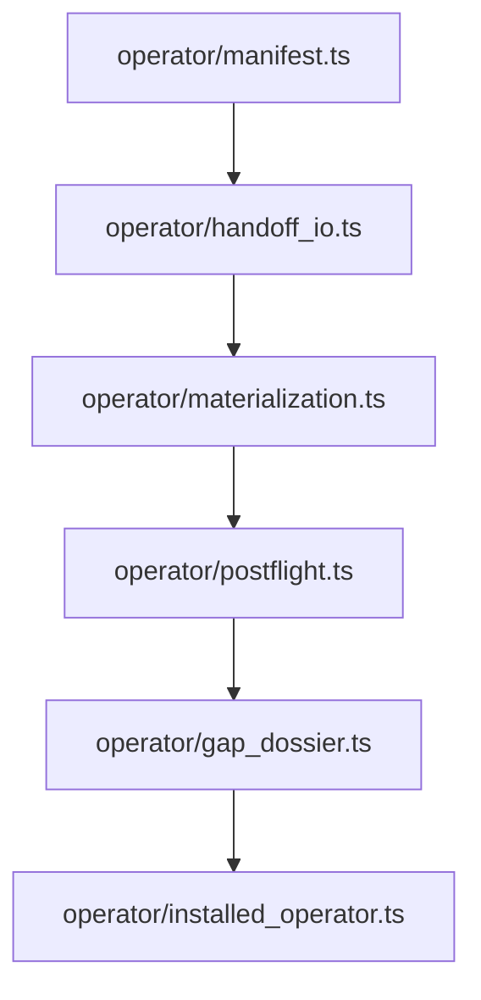

# T-107 Split Operator Handoff Into Prime Domain Modules

- id: T-107
- type: chore
- ticket_category: ordinary
- status: backlog
- goal: typescript-rc-maintainability
- change_intent: split the oversized operator handoff module into prime modules for manifest construction, materialization observation, postflight evaluation, gap dossier handling, and handoff I/O
- change_class: realization_refactor
- re_entry_point: code
- triaged_at: 2026-05-01
- created_at: 2026-05-01
- updated_at: 2026-05-01
- priority: medium
- build_tenant: typescript
- owner: unassigned
- review_status: awaiting_design_review
- intake_source: Claude DMM review operator boundary inflation finding.
- affected_boundary: `build_tenants/typescript/code/src/operator/handoff.ts`, `build_tenants/typescript/code/src/operator/index.ts`, operator tests

## STDO Triage

### First Missing Layer

Code.

`operator/handoff.ts` is carrying too many module roles: manifest construction,
prompt rendering, materialization snapshots, report admission, postflight law,
gap dossier construction, and archive I/O. The behavior may be valid, but the
module boundary is not.

## Target Module Split

## Acceptance Criteria

- AC-1: no semantic behavior changes.
- AC-2: each new module has one prime responsibility and a short IACS comment
  or design note.
- AC-3: public exports are narrowed to the module role.
- AC-4: existing semantic tests pass unchanged except import paths.
- AC-5: focused live data_mapper archive shape remains unchanged.

## Non-Closure Conditions

- Moving code mechanically while preserving an oversized semantic center.
- Mixing effectful archive writes with postflight verdict functions in the same
  module.
- Changing runtime behavior without a separate design ticket.
