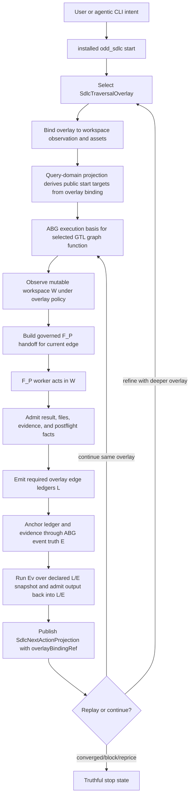

# T-160: First-Class Traversal Overlays For Guided Graph Passes Over Workspace

## STDO Triage

First missing layer: design.

The current TypeScript line can publish more named executive graph functions,
but it does not yet have a first-class carrier for the design concept now needed:
a traversal graph is a governed overlay over the current mutable workspace.

The workspace is not disposable scratch state. It retains operational truth
persistently: source files, generated assets, local specifications, execution
artifacts, repair state, build/test outputs, and operator-visible worksite
condition all persist in `W`.

The overlay does not create that truth. The overlay is the reusable
function-like traversal definition. An overlay binding applies that reusable
overlay to a concrete workspace observation, concrete asset bindings, admitted
prior ledger/event history, and a selected graph-function target.

This is not an ABG enhancement request. ABG remains authoritative for graph
calls, frames, continuations, events, projections, and traversal truth. The
`odd_sdlc` product-level gap is selection, binding, and interpretation: the
domain needs to declare which guided graph pass exists, how that pass is bound
to the actual worksite reality, what ledger/eval obligations that binding
carries, and how a later binding refines the history admitted by an earlier
binding.

The lawful re-entry point is design. Product law already supports graph
functions, active worksite lifecycle, policy over evaluation/closure, ledgers,
ABG replay truth, and read-only projections. This ticket defines the TypeScript
realization shape needed to make that product law executable without adding a
rival truth surface.

## Problem Statement

The current code has multiple graph-function programs, but graph depth is still
expressed mostly through named graph functions and hardcoded public start target
selection.

That is not enough for guided worksite passes.

A light hello-world pass and a heavy bootstrap pass need to be selectable as
different overlays over the same workspace. Each selected pass must then be
bound to the concrete workspace observation before traversal starts. The
resulting binding must carry identity into start, execution, handoff, ledger,
eval, event, projection, archive replay, and next-action routing.

There is a second use case that is just as important: overlays must support
bounded segment deepening. An operator may want to apply a requirements-deepening
overlay and stop at requirement authority, apply a design-depth overlay and stop
at design/topology/schedule authority, apply a testing overlay and stop at test
qualification, or apply a build/review overlay and stop at code build or code
review evidence. The overlay therefore needs a declared termination policy, not
only a start-target policy.

Without overlay binding identity:

- a light run and heavy run can be confused as the same graph track;
- a later overlay cannot lawfully refine prior admitted work;
- a segment-deepening pass cannot prove why it stopped at requirements, design,
  testing, build, or review rather than silently drifting into the next segment;
- public start target selection stays hardcoded instead of governed by policy;
- replay cannot prove that the ledger/eval artifacts belong to the selected
  guided pass;
- future hello-world, requirements-depth, design-depth, testing, build/review,
  repair-only, eval-only, and heavy-planning passes will keep accreting ad hoc
  target selection logic.

## Current Code Structure Pass

The current code already contains the lower-level mechanisms needed for a
first slice.

- `build_tenants/typescript/code/src/graph/catalog.ts` defines product-specific
  graph-function catalog entries and combines bootstrap, operational, and
  triage function catalogs into `SDLC_FUNCTION_CATALOG`.
- `build_tenants/typescript/code/src/graph/module.ts` defines
  `constructExecutive()`, which flattens leaf graph functions into named
  executive graph functions. The current executives are
  `bootstrap_release_self_test` and `release_operational_cycle`.
- `build_tenants/typescript/code/src/projection/query_domain.ts` projects the
  graph catalog and start targets, but `startTargets()` currently has a
  hardcoded public target set.
- `query_domain.ts` also has `assertModuleMatchesCatalog()`, which reconstructs
  the canonical module and rejects unexpected graph functions. Any overlay
  implementation must keep this fail-closed behavior while making the canonical
  comparison overlay-aware.
- `build_tenants/typescript/code/src/start/public_start.ts` already supports
  target kinds `next`, `graph_function`, and `asset`. It can run a named graph
  function directly, but `next` still resolves through the query-domain start
  target projection.
- `build_tenants/typescript/code/src/spec_method/entry.ts` constructs the
  canonical module directly in query/start/replay paths. Overlay selection must
  be admitted at this entry boundary and threaded into those paths.
- `build_tenants/typescript/code/src/hooks/catalog.ts` derives hook contracts
  from `SDLC_FUNCTION_CATALOG` plus selected reusable dispatch functions. Any
  new overlay leaf edge must be hook-visible; an overlay that only composes
  existing edges should not duplicate hook truth.
- `build_tenants/typescript/code/src/operator/traversal_consequence.ts` carries
  `SdlcNextActionProjection` and already separates `selectedActionRef` from
  `nextGraphFunctionRef` and `nextGraphVectorRef`. It needs overlay binding
  identity in the same causal carrier family.
- `build_tenants/typescript/code/src/operator/installed_operator.ts` consumes
  execution contracts, emits `SdlcEdgeFulfillmentLedger`, derives closure, and
  constructs the next action projection. It currently reconstructs the canonical
  module in consequence evaluation and does not carry overlay binding identity
  through ledger/eval output.
- `build_tenants/typescript/code/src/shared/traversal_strategy_plan.ts` carries
  edge strategy defaults by edge name. Overlay-level strategy must not become a
  hidden global default.
- `build_tenants/typescript/test_env/tests/test_t030_graph_catalog_module.test.mjs`
  asserts exact executive names and vector counts. Overlay support must update
  these assertions to prove the new catalog shape intentionally.

## Required Design

Introduce a first-class traversal overlay catalog above graph-function catalog
publication, then introduce an overlay binding carrier for each concrete
application of an overlay to workspace reality.

The lifecycle invariant is part of the carrier design: the binding must
distinguish material assets that already exist in `W` from planned assets that
are explicitly declared by the selected overlay template. Absent assets may
autobind only from the selected overlay template. They must not be inferred from
ad hoc filesystem search.

The design distinction is:

```text
SdlcTraversalOverlay = reusable traversal function / policy
SdlcOverlayBinding   = invocation binding of that overlay to observed W
SdlcExecutionContract = admitted run contract for the binding
```

Candidate carrier family:

```ts
type SdlcOverlayPolicyRef = `policy://odd-sdlc/overlay/${string}`;
type SdlcOverlayComputeRegime = "f_p" | "f_d" | "f_h";

export interface SdlcTraversalOverlay {
  readonly kind: "sdlc_traversal_overlay";
  readonly overlayRef: string;
  readonly name: string;
  readonly intent: string;
  readonly graphFunctionNames: readonly string[];
  readonly publicStartTargets: readonly string[];
  readonly defaultStartTarget: string;
  readonly policies: {
    readonly workspaceObservationPolicyRef: SdlcOverlayPolicyRef;
    readonly evalPolicyRef: SdlcOverlayPolicyRef;
    readonly refinementPolicyRef: SdlcOverlayPolicyRef;
    readonly traversalStrategyPlanRef: SdlcOverlayPolicyRef | null;
  };
  readonly termination: {
    readonly policyRef: SdlcOverlayPolicyRef;
    readonly terminalAssetTypes: readonly string[];
    readonly terminalGraphFunctionNames: readonly string[];
    readonly lawfulStopDispositions: readonly string[];
    readonly requiresEvalAdmission: boolean;
  };
  readonly requiredLedgersByEdge: readonly SdlcOverlayLedgerRequirement[];
  readonly predecessorOverlayRefs: readonly string[];
}

export interface SdlcOverlayBinding {
  readonly kind: "sdlc_overlay_binding";
  readonly bindingRef: string;
  readonly overlayRef: string;
  readonly workspaceBasis: {
    readonly workspaceRootUri: string;
    readonly workspaceIdentityRef: string;
    readonly workspaceObservationRef: string;
    readonly workspaceFingerprintRef: string;
  };
  readonly selection: {
    readonly selectedGraphFunctionRef: string;
    readonly selectedStartTarget: string;
    readonly requestedBy: "public_start" | "archive_replay" | "operator_resume";
  };
  readonly assetBindings: readonly SdlcOverlayAssetBindingPayload[];
  readonly priorLedgerRefs: readonly string[];
  readonly priorEventRefs: readonly string[];
  readonly freshnessPolicyRef: SdlcOverlayPolicyRef;
  readonly predecessorRefs: readonly string[];
}

export interface SdlcOverlayAssetBindingPayload {
  readonly kind: "sdlc_overlay_asset_binding_payload";
  readonly bindingRef: string;
  readonly overlayBindingRef: string;
  readonly assetType: string;
  readonly assetRef: string;
  readonly workspacePath: string;
  readonly bindingMode: "material" | "planned_from_template";
  readonly templateRef: string | null;
  readonly producerGraphFunctionRef: string | null;
  readonly requiredAtStart: boolean;
  readonly predecessorRefs: readonly string[];
}

export interface SdlcOverlayLedgerRequirement {
  readonly edgeName: string;
  readonly computeRegime: SdlcOverlayComputeRegime;
  readonly requiredLedgerKinds: readonly string[];
  readonly closureRequiresLedger: boolean;
}
```

The policy refs above are not open strings. They are typed registered policy
refs admitted against the overlay catalog or a named policy registry before the
binding may execute. A raw unregistered policy ref must fail admission.

`workspaceBasis` intentionally carries four fields over one worksite locus:

- `workspaceRootUri` is the effect boundary and path root;
- `workspaceIdentityRef` is the logical project/workspace identity;
- `workspaceObservationRef` is the concrete observation carrier used for this
  binding;
- `workspaceFingerprintRef` is the freshness/digest check over the material
  observation basis.

They are grouped under one binding payload so they do not become peer carriers.
Replay may reject any one of them independently when that semantic check fails.

`SdlcOverlayAssetBindingPayload`, overlay selection, and termination details are
Subordinate Payloads unless a later implementation review proves they need
independent admission, publication, or public pattern-match semantics.

Every execution under an overlay binding must stamp:

```text
overlayRef
overlayBindingRef
workspaceObservationRef
graphFunctionRef
edgeRef
ledgerRef
eventRef
evalRef
refinesOverlayRef?
```

Workspace persistence rule:

```text
W retains persistent operational truth.
O defines a reusable traversal function over workspace truth.
B binds O to a concrete observation of W and admitted prior L/E.
F_P may mutate W under B.
L admits closure-relevant evidence about that mutation under B.
E anchors admitted facts for replay.
Ev evaluates declared L/E snapshots under B and writes its own admitted result back.
```

Persistent workspace truth can be observed and acted upon by later overlays,
but it is not enough for closure by itself. Closure still requires admitted
ledger/event/eval truth for the selected overlay binding.

ABG event-truth boundary:

```text
ABG events remain the authoritative event log.
overlayBindingRef is odd_sdlc domain correlation on ledgers, eval inputs,
execution contracts, projections, and optional event metadata.
If ABG does not natively type overlayBindingRef, event membership is proven by
odd_sdlc ledger/admission/predecessor refs anchored to ABG events.
```

ABG does not decide overlay meaning. `odd_sdlc` must not turn repeated event
snapshot copies or overlay metadata into a second event store.

Function-binding form:

```text
B = bind(O, W_observed, asset_bindings, prior_L/E, terminal_policy)
run(B) -> F_P work in W -> L -> E -> Ev -> next B or stop
```

## Bootstrap And Template Binding Lifecycle

The minimum lifecycle starts with a single source document:

```text
bootstrap.md
```

The first run may select an induction-to-requirements overlay:

```text
odd_sdlc start --workspace . --graph-overlay requirements-depth --until overlay-stop
```

For that first binding, `bootstrap.md` is a material asset binding because the
file exists and is the original source reality. Downstream assets such as
`specification/INTENT.md`, `specification/PRODUCT.md`, `specification/GOALS.md`,
and `specification/requirements/` may not exist yet. They are still explicit
bindings, but their binding mode is `planned_from_template`: the overlay's graph
template declares the asset type, default workspace path, producer graph
function, and terminal expectation.

That is not inferred binding.

It is explicit template binding:

```text
material binding:
  bootstrap.md exists in W
  bind it as input source truth

planned template binding:
  INTENT.md does not exist yet
  overlay template declares it as an expected produced asset
  binding records asset type, planned path, and producer graph function
```

The graph therefore acts as an asset-creation template. It names which assets
must exist now, which assets are expected to be created by this traversal, and
which future assets remain outside the selected overlay's terminal boundary.

The next run can select a focused design overlay. At that point `INTENT.md`,
`PRODUCT.md`, `GOALS.md`, and `specification/requirements/` should be material
asset bindings if the induction overlay produced them. Future design assets may
again be planned template bindings, for example:

```text
build_tenants/typescript/design/...
implementation_design_surface
implementation_module_surface
implementation_component_topology_surface
component_realization_schedule_surface
```

This gives the lifecycle a stable rule:

```text
If the asset exists, bind the material asset explicitly.
If the asset does not exist but the selected overlay template declares it, bind
the planned asset explicitly from the template.
If the asset does not exist and no selected overlay template declares it, fail
closed or leave it outside the binding.
```

The default binding behavior is therefore template-governed, not filesystem
inference. The operator names the workspace and overlay. The overlay template
provides the default asset slots and paths. The binding records whether each
slot is material or planned.

The overlay catalog should initially publish at least:

- `overlay://odd-sdlc/bootstrap-heavy`, selecting the existing
  `bootstrap_release_self_test` path;
- `overlay://odd-sdlc/operational-cycle`, selecting the existing
  `release_operational_cycle` path;
- `overlay://odd-sdlc/hello-world-light`, selecting a small lawful pass for
  hello-world product materialization.

The catalog should also be shaped so later overlays can target bounded segments
without changing the mechanism:

- `overlay://odd-sdlc/requirements-depth`, terminating at
  `requirement_surface` or admitted requirement-closure/eval truth;
- `overlay://odd-sdlc/design-depth`, terminating at design, implementation
  design, module, topology, or schedule authority according to policy;
- `overlay://odd-sdlc/testing-depth`, terminating at test design, test
  materialization, execution, qualification, or archive authority;
- `overlay://odd-sdlc/code-build-review`, terminating at code materialization,
  build evidence, code-review evidence, or a typed non-close disposition.

The first implementation may realize `hello-world-light` as a named lightweight
executive graph function if the selected steps are already lawful. If a true
two-step path needs a narrower materialization edge, add that edge explicitly
to the product-specific graph-function catalog and hook catalog rather than
overloading `derive_component_code_surface` with missing upstream inputs.

Segment overlays may be realized as named executive graph functions, as long as
their terminal boundary is explicit and replay-visible. A segment overlay must
not close by simply stopping early in a controller loop; it closes only when the
declared terminal asset/eval condition has been admitted into L/E.

## End-State Flow Capability



Expected capability:

- the same workspace can be passed through a light overlay and then a heavy
  overlay;
- the same workspace can be passed through requirements, design, testing,
  build, or review overlays that deepen one segment and terminate at a declared
  boundary;
- every traversal pass is tethered to persistent workspace reality by a
  concrete overlay binding;
- both passes remain visible through one event spine and ledger/eval
  consistency relation;
- the heavy overlay can refine or reject the light overlay by emitting new
  ledger/eval/event facts, not by deleting the light pass;
- `gaps`, `query-domain`, and `start` expose overlay and binding identity
  without requiring operators to inspect the full GTL module.

## Design Module Method Constraints

This ticket is governed by `DESIGN_MODULE_METHOD.md`.

### Authority Seam Closure

- Define one overlay catalog carrier as the authority for reusable overlay
  identity, public start targets, graph membership, ledger obligations, eval
  policy, termination policy, and refinement policy.
- Define one overlay binding carrier as the authority for applying a reusable
  overlay to concrete workspace reality, including observation, fingerprint,
  asset bindings, prior ledger/event refs, and selected graph function.
- Treat selection, termination details, and asset-binding rows as subordinate
  payloads unless a later implementation review proves independent authority.
  Do not let early return, exhausted candidates, or CLI controller state become
  termination authority.
- Do not let `query_domain.ts`, `public_start.ts`, `entry.ts`, or
  `installed_operator.ts` independently reconstruct overlay meaning from graph
  names.
- Preserve fail-closed structural comparison between published catalog truth
  and admitted module truth.
- Replay must reject mismatched overlay binding identity, missing overlay
  binding identity, stale workspace observation, or mismatched graph membership
  when overlay binding identity is required.

### Essential Carrier Consolidation

The irreducible carrier set is:

- `SdlcTraversalOverlay`
- `SdlcOverlayBinding`
- `SdlcExecutionContract` with overlay binding identity
- `SdlcEdgeFulfillmentLedger` with overlay binding identity
- `SdlcNextActionProjection` with overlay binding identity

Subordinate payloads:

- overlay selection payload inside `SdlcOverlayBinding`
- overlay termination payload inside `SdlcTraversalOverlay`
- `SdlcOverlayAssetBindingPayload` rows inside `SdlcOverlayBinding`
- policy refs resolved through the overlay policy registry

Do not add peer carriers that mirror these fields for only one module. Derived
query-domain, gaps, stdout, archive summaries, and sandbox descriptors are read
models or proof surfaces over this carrier set.

### Enforcement After Proof

- Add parsing/admission for overlay catalog, overlay binding, and overlay
  selection before threading overlay/binding refs into execution paths.
- Add structural tests for catalog/module/query-domain drift before adding live
  sandbox proof.
- Add replay rejection tests before accepting archive replay behavior.
- Only after deterministic carrier tests pass should scenario/live proof claim
  overlay closure.

### ODD Alignment

- A traversal overlay selects graph functions; it is not itself a new executor.
- ABG remains the runtime authority for graph-call, frame, continuation, event,
  projection, and traversal truth.
- `odd_sdlc` owns domain overlay meaning, selection policy, ledger obligations,
  eval policy, refinement policy, query projection, and proof interpretation.
- `F_P` worker internals remain bounded by handoff/result/admission contracts.
  The overlay may constrain the work boundary; it must not absorb worker
  solution strategy into core runtime law.

## Adjacent Defect Boundaries

The 2026-05-12 hello-world forensic note flags two nearby defect classes:

- `fp_evaluate_result.status` can be mistaken for closure when the governing
  closure truth is `SdlcEdgeClosureDecision.disposition`;
- workers can attempt to read framework source, historical sandboxes, or other
  paths outside the active workspace.

Those defects are carried by T-158/T-159 review and repair work. T-160 does not
take ownership of their implementation fixes, but it must not codify either
defect into overlay-stamped carriers. Overlay binding must constrain F_P reads
to the active bound workspace, and overlay-stamped read models must consume
closure from `SdlcEdgeClosureDecision` / admitted consequence truth rather than
from report-admission status fields.

## Implementation Sequencing

This is one backlog ticket, but implementation must proceed inside-out.

1. Publish and admit the source carriers first: `SdlcTraversalOverlay`,
   `SdlcOverlayBinding`, subordinate asset-binding payloads, policy-ref
   validation, and deterministic catalog/query tests.
2. Thread the admitted binding outward to `SdlcExecutionContract`, public
   start, spec-method replay, handoff manifests, and worker result admission.
3. Thread the binding into ledgers, closure decisions, eval inputs/outputs,
   next-action projection, query-domain/gaps read models, and scenario proof.

Stages 2 and 3 must not land as closure evidence before Stage 1 has a
fail-closed source carrier and structural drift tests.

## Implementation Checklist

- [ ] Add an overlay catalog module under the TypeScript graph/domain surface,
      preferably near `graph/catalog.ts` or as `graph/overlays.ts`, exporting
      `SdlcTraversalOverlay`, `SdlcOverlayBinding`,
      `SdlcOverlayLedgerRequirement`, subordinate asset-binding payloads, and a
      machine-readable overlay catalog.
- [ ] Add an overlay binding admission path that binds overlay definition to
      workspace root, workspace observation, workspace fingerprint, concrete
      asset bindings, prior ledger/event refs, selected graph function, and
      termination policy.
- [ ] Add overlay policy-ref admission so workspace observation, eval,
      refinement, traversal strategy, termination, and freshness policy refs
      must resolve through the overlay catalog or named policy registry.
- [ ] Add explicit template-governed asset binding modes:
      `material` for existing workspace assets and `planned_from_template` for
      absent assets declared by the selected overlay graph/template.
- [ ] Ensure missing assets are never inferred from ad hoc filesystem search:
      absent assets may autobind only when the selected overlay template
      declares their asset type, default path, producer graph function, and
      terminal role.
- [ ] Publish overlay catalog rows for bootstrap-heavy, operational-cycle, and
      hello-world-light.
- [ ] Add segment-termination policy payloads on overlays that name terminal
      asset types, terminal graph functions, eval expectations, and lawful stop
      dispositions.
- [ ] Shape the overlay catalog so future requirements-depth, design-depth,
      testing-depth, and code-build-review overlays can use the same mechanism
      without adding new start/replay/controller paths.
- [ ] Add or compose a lawful lightweight hello-world executive graph function.
      Reuse existing leaf edges only where their input contracts are satisfied;
      otherwise define a narrower product-specific edge with explicit inputs,
      outputs, transform contract, evaluation contract, and hook contract.
- [ ] Extend `constructSdlcGraphFunctionCatalog()` so executive programs can be
      associated with overlay refs without losing the current graph-function
      catalog contract.
- [ ] Extend `constructSdlcGtlModule()` so the canonical module includes any
      new lightweight executive and module metadata publishes overlay refs.
- [ ] Replace hardcoded `publicTargetNames` in `query_domain.ts` with
      overlay-derived public start targets.
- [ ] Extend `SdlcQueryDomainProjection` to publish overlay catalog/read-model
      rows, selected/default overlay where known, and overlay-governed start
      targets.
- [ ] Make `assertModuleMatchesCatalog()` overlay-aware while preserving
      fail-closed checks for missing, unexpected, or structurally drifted graph
      functions and start targets.
- [ ] Extend public start request parsing in `spec_method/entry.ts` with an
      admitted overlay selector, without breaking existing `next`,
      `graph_function:<handle>`, or `asset:<handle>` target kinds.
- [ ] Extend `SdlcPublicStartRequest`, `SdlcExecutionContract`, and
      `constructExecutionContract()` to carry `overlayRef`,
      `overlayBindingRef`, and binding predecessor refs.
- [ ] Thread `overlayRef` and `overlayBindingRef` through `public_start.ts`, `entry.ts`,
      `installed_operator.ts`, `handoff.ts`, `traversal_consequence.ts`, and
      archive serialization.
- [ ] Add `overlayRef` and `overlayBindingRef` to worker handoff manifests and result admission
      validation where the manifest/result pair must prove they belong to the
      same guided pass.
- [ ] Add `overlayRef`, `overlayBindingRef`, or equivalent predecessor refs to
      `SdlcEdgeFulfillmentLedger`, closure decision predecessor refs, and
      `SdlcNextActionProjection`.
- [ ] Require every edge with `computeRegime: "f_p"` in an overlay to declare at
      least one ledger obligation; fail closed if closure is attempted without
      the required ledger.
- [ ] Ensure eval output under an overlay is admitted back into L/E and carries
      the same overlay binding identity or an explicit refinement relation.
- [ ] Make overlay-level traversal strategy visible through a carrier or policy
      ref; do not hide light-vs-heavy behavior as a global edge-name default.
- [ ] Make overlay termination visible through the overlay termination payload
      and registered policy ref; do not hide segment termination as an
      exhausted-vector or local-loop condition.
- [ ] Update hook catalog tests so new overlay-specific leaves are hook-visible
      and overlay executives do not duplicate hook authority.
- [ ] Update query-domain, public-start, and spec-method tests to prove overlay
      target selection, direct graph-function targeting, and stale overlay
      rejection.
- [ ] Add replay tests proving mismatched, absent, or stale overlay binding
      identity fails closed.
- [ ] Add scenario sandbox proof that hello-world-light can run without invoking
      the heavy bootstrap planning sequence.
- [ ] Add scenario or live-equivalent proof that a heavy overlay can consume a
      prior light overlay's admitted ledger/event history as refinement input.

## Acceptance Criteria

- AC-1: A machine-readable traversal overlay catalog is published by the
  TypeScript tenant and includes bootstrap-heavy, operational-cycle, and
  hello-world-light overlays.
- AC-1a: The overlay model supports bounded segment-deepening overlays for
  requirements, design, testing, and code/build/review without introducing a
  second mechanism or controller path.
- AC-2: Query-domain projection publishes overlay-governed start targets and no
  longer relies on a hardcoded public graph-function name set for ordinary
  `next` target selection.
- AC-3: Existing public target kinds remain valid: `next`,
  `graph_function:<handle>`, and `asset:<handle>`.
- AC-4: Public start admits overlay selection, creates or resumes an
  `SdlcOverlayBinding` before any traversal advances, stamps that binding into
  the execution contract, and archive replay preserves or rejects the same
  binding deterministically.
- AC-4a: The admitted binding tethers the overlay to workspace observation,
  fingerprint, asset bindings, selected graph function, prior L/E refs, and
  termination policy in one end-to-end contract.
- AC-4b: Overlay binding distinguishes material asset bindings from planned
  template bindings. Existing assets bind to observed workspace reality; absent
  assets bind only when the selected overlay template explicitly declares their
  asset type, default path, producer graph function, and terminal role.
- AC-5: Execution contract, handoff manifest, worker result admission,
  fulfillment ledger, closure decision predecessor refs, eval output, and next
  action projection all carry overlay binding identity or an explicit
  refinement predecessor.
- AC-6: Every overlay edge with `computeRegime: "f_p"` declares required ledger
  kinds, and closure fails closed when the required ledger is absent.
- AC-7: The hello-world-light overlay executes a lawful small pass over the
  same workspace without invoking the heavy bootstrap design/topology/schedule
  sequence.
- AC-7a: A segment overlay can terminate at its declared boundary, such as
  requirement authority, design-depth authority, test qualification, build
  evidence, or code-review evidence, and replay can prove the stop was governed
  by overlay termination policy.
- AC-8: The bootstrap-heavy overlay can refine a prior hello-world-light pass by
  consuming admitted light-pass ledger/event history and emitting new
  ledger/eval/event facts.
- AC-9: A heavy overlay finding never deletes, overwrites, or silently replaces
  a prior light overlay finding; it publishes refinement, rejection, retry,
  re-entry, or repricing evidence.
- AC-10: Replay fails closed when overlay binding identity, workspace
  observation/fingerprint, graph-function membership, graph vector identity,
  ledger refs, or eval refs do not match the selected overlay's declared policy.
- AC-11: `gaps`, `query-domain`, and `start` expose overlay and binding
  identity in their machine-readable output, while concise operator output
  remains readable.
- AC-12: The implementation does not add a second runtime, event store,
  controller loop, or product-local traversal authority beside ABG.

## Required Proof

Deterministic proof:

- graph catalog/module tests cover overlay catalog publication, executive
  membership, and expected vector counts;
- query-domain tests cover overlay-derived start targets and structural drift;
- public-start/spec-method tests cover overlay selector parsing, overlay
  binding admission, execution contract stamping, and existing target-kind
  compatibility;
- template-binding tests cover `bootstrap.md` material input plus planned
  `INTENT.md` / `PRODUCT.md` / `GOALS.md` / requirements outputs, and reject
  absent assets that are not declared by the selected overlay template;
- termination-policy tests cover requirements/design/testing/build-review
  segment stops and reject controller-only early termination;
- archive replay tests cover overlay binding mismatch, missing binding, stale
  workspace observation, and valid overlay continuation/refinement;
- `test_t160_overlay_refinement_pipeline.test.mjs` proves the closure-law
  algebra: `requirements-depth` binds `bootstrap.md` as material input and
  planned specification outputs, emits light-pass ledger/event/eval refs, then
  `design-depth` or `bootstrap-heavy` binds those prior refs as admitted
  history; the test must also prove stale or mismatched binding refs fail
  replay;
- hook tests cover any new product-specific leaf edges;
- ledger/eval tests prove required-ledger enforcement for `computeRegime:
  "f_p"` edges.

Scenario proof:

- a hello-world-light sandbox run reaches the materialization/eval boundary
  without traversing the heavy bootstrap planning sequence;
- a heavy overlay run over the same workspace can see prior light-pass admitted
  ledger/event truth and publish refinement rather than replacement.

Suggested TypeScript verification commands, adjusted if package scripts change:

```bash
npm run build:semantic
npm run test:t030
npm run test:t032
npm run test:t034
npm run test:t058
npm run test:semantic
npm run test:scenario-sandbox
```

## Product.md Validation

This design is consistent with `specification/PRODUCT.md`.

- Product says `odd_sdlc.TS` is built around graph functions, typed assets, ABG
  replay truth, and bounded SDLC hooks. Traversal overlays select graph
  functions and policy over those carriers; they do not add a rival executor.
- Product says the installed product must expose a coherent operator loop over
  `gaps`, `start`, worker execution, result ingestion, runtime projection, and
  archive proof. Overlay and binding identity make that loop more explicit for
  light, heavy, repair, and eval-guided passes.
- Product says ABG owns substrate truth, events, projections, manifests, and
  runtime identity. This ticket keeps overlay selection as `odd_sdlc` domain
  policy and preserves ABG event/projection authority.
- Product says current materialized assets are projections over constructive
  history, and intermediate ledgers distribute probabilistic compute across
  bounded traversals. Overlay ledgers make that bounded traversal history
  explicit.
- Product says policy surfaces constrain evaluation, escalation, worker/backend
  selection, or closure expectations without redefining graph law. Traversal
  overlays are such policy/selection carriers over published graph functions.

The design is therefore a Product.md-aligned refinement of existing product
law, not a product-definition replacement.

## Current Code Validation

The final design is implementable against the current code structure because:

- named executive graph functions already exist through `constructExecutive()`;
- `public_start.ts` already distinguishes `next`, `graph_function`, and `asset`
  target kinds;
- `SdlcNextActionProjection` already separates selected action from next graph
  function/vector, giving a natural place to add overlay binding identity;
- `installed_operator.ts` already emits fulfillment ledgers, closure decisions,
  and next-action projections after worker admission;
- query-domain already fails closed on catalog/module drift and can be extended
  to compare overlay-aware catalog structure;
- hook contracts are catalog-derived and can remain edge-owned rather than
  overlay-owned.

The design requires change because:

- public start targets are currently hardcoded in `query_domain.ts`;
- canonical module construction is called directly from several spec-method
  paths without overlay selection;
- `SdlcExecutionContract`, handoff manifests, ledgers, eval outputs, and
  next-action projections do not yet carry overlay binding identity;
- test coverage currently asserts only the two existing executive names and
  their vector counts;
- traversal strategy defaults are edge-name global rather than overlay-visible.

## Closure Law

This ticket can close only when the TypeScript tenant can prove selectable
traversal overlays as a governed design/module feature:

```text
W = mutable workspace
O = selected traversal overlay
L = required ledgers emitted under O
E = ABG event/projection truth anchoring admitted transitions
Ev = evaluator work over declared L/E snapshots under O
```

The close state must demonstrate:

```text
O_light(W) -> L_light, E, Ev_light
O_heavy(W, L_light, E) -> L_heavy, E, Ev_heavy
```

with no second runtime, no shadow event truth, no hidden start-target heuristic,
and no closure from ambient workspace state alone.
