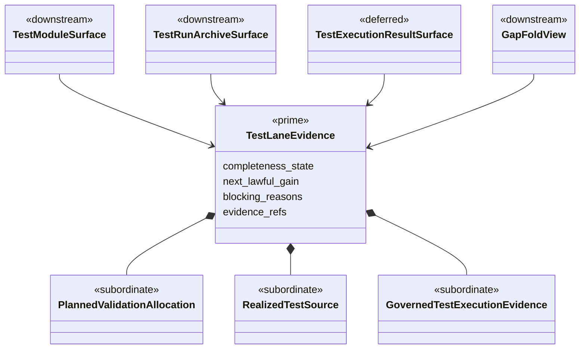

## Migration Declaration

- old_truth_path: derive_test_module_surface converges on a planned markdown test allocation surface, while derive_test_run_archive_surface immediately demands realized *Spec.scala source files and governed sbt test execution evidence, so the handoff between the two edges is semantically split and the next edge can only fail or yield on truth the prior edge never carried
- new_truth_path: the odd_sdlc test lane carries one explicit planned-vs-realized evidence law across derive_test_module_surface, derive_test_run_archive_surface, and the operational execution tail, so the next edge demands only what the prior edge is responsible for carrying and any requirement for realized test source or execution evidence appears at the correct edge with the correct proof surface
- new_truth_path: the odd_sdlc test lane also publishes the current completeness state and the next lawful completeness gain explicitly enough that zoom-out/zoom-in fold can inspect the lane honestly, gap can publish the next gain, and iteration can advance through that gain without silently widening or repeating a semantically broken stop
- producers_old:
  - `odd_sdlc.constructor` generation of `40-generated-test-modules.md`
  - `odd_sdlc.constructor` generation of `50-generated-run-archive.md`
  - test-lane evaluators and declared-obligation projection
  - downstream result-ingest / continuation projection after archive proof failure
- producers_new:
  - one typed or otherwise authoritative test-lane carrier defining planned allocation vs realized source vs execution evidence
  - derive_test_module_surface and derive_test_run_archive_surface consuming that same carrier definition
  - proofs that validate the handoff explicitly on installed workspaces
- consumers_old:
  - public `start --target next --until converged`
  - generated run archive surface
  - testcase-authority and release-preparation edges
  - operator interpretation of whether the lane has lawfully progressed or hit a bug
- consumers_new:
  - public `start --target next --until converged`
  - test archive and testcase-authority edges
  - installed RC review over data_mapper-style workspaces
  - operator interpretation of planned vs realized test evidence
- derived_surfaces:
  - `build_tenants/scala_spark/test_env/tests/40-generated-test-modules.md`
  - `build_tenants/scala_spark/test_env/50-generated-run-archive.md`
  - `.ai-workspace/events/events.jsonl`
  - `.ai-workspace/fp_manifests/*derive_test_run_archive_surface*.json`
  - `.ai-workspace/fp_results/*derive_test_run_archive_surface*.json`
  - gap dossier surface

## Migration Checklist

- [x] old truth path is named explicitly
- [x] new truth path is named explicitly
- [x] producer set for the new truth is listed
- [x] consumer set for the new truth is listed
- [x] projection and read-model surfaces are listed
- [x] old truth path is removed or explicitly demoted from authority
- [x] mixed-state behavior is no longer accepted as closure evidence
- [x] tests proving mixed old and new behavior are removed or repriced
- [x] ticket wording, design wording, and proof claims are reconciled before closure

## In Scope / Out Of Scope

In scope:

- one admitted test-lane carrier boundary for:
  - `planned_validation_allocation`
  - `realized_test_source`
  - `governed_test_execution_evidence`
- graph-order repair across:
  - `derive_test_module_surface`
  - `derive_test_run_archive_surface`
  - `prepare_release_surface`
  - `prepare_test_execution_surface`
  - `derive_test_execution_result_surface`
- retirement or neutralization of `REALIZED_TEST_SOURCE_OBLIGATION.md` as a
  runtime-published imperative strategy surface
- repriced gap / iteration / zoom-fold publication for the test lane

Out of scope:

- broad ABG transport-salvage behavior unless it directly changes this lane's
  admitted evidence law
- unrelated testcase-authority redesign outside the archive/release handoff
- unrelated operational dispatch work already closed in `B-043`

## Trace Boundary

This ticket reads current repo-law truth from:

- `specification/GOALS.md`
- `specification/INTENT.md`
- `specification/PRODUCT.md`
- `specification/requirements/04-verification.md`
- `specification/requirements/08-odd-sdlc-first-slice.md`
- `specification/requirements/10-odd-sdlc-software-domain-buildout.md`
- `specification/requirements/12-declarative-operational-state-transitions.md`
- `specification/scenarios/06-first-odd-sdlc-asset-function-call.md`
- `specification/scenarios/07-canonical-sandbox-repeatability.md`

This ticket reads current design truth from:

- `build_tenants/python/design/SOFTWARE_DOMAIN_BUILDOUT.md`
- `build_tenants/python/design/REQUIREMENT_CLOSURE_CARRIER_AND_PROJECTION_BOUNDARY.md`
- `build_tenants/python/design/fp/REALIZED_TEST_SOURCE_OBLIGATION.md`
- `build_tenants/python/design/adrs/ADR-002-abg-continuation-authority-and-cooperative-operational-dispatch.md`

This ticket reads current method-law truth from:

- `/Users/jim/src/apps/specification_methodology/specification/standards/SPEC_METHOD.md`
- `/Users/jim/src/apps/specification_methodology/specification/standards/ODD_METHOD.md`
- `/Users/jim/src/apps/specification_methodology/specification/standards/TICKET_METHOD.md`
- `/Users/jim/src/apps/specification_methodology/specification/standards/DESIGN_MODULE_METHOD.md`

## Evaluator Gate

### 1. Authority Seam Closure

- [x] one admitted carrier owns the distinction between planned allocation,
      realized source, and governed execution evidence
- [x] obligation-ledger law, runtime prompt law, deterministic closure, and
      operator-facing archive text consume that admitted carrier instead of
      competing to define the lane independently
- [x] removing the admitted carrier causes fail-closed behavior instead of
      ambient archive convergence
- [x] the resulting lane obeys `ODD_METHOD.md §11.5A`: each bounded edge
      publishes one gain and returns control to ABG for re-entry

### 2. Essential Carrier Consolidation

- [x] `planned_validation_allocation`, `realized_test_source`, and
      `governed_test_execution_evidence` are variants of one lane family, not
      rival peer carriers owned by different modules
- [x] no wrapper surface is introduced solely to mask the contradiction between
      archive, release, and operational execution
- [x] zoom-out-fold / zoom-in-fold / gap publication reuse the same admitted
      lane family instead of reconstructing parallel status surfaces

### 3. Typed Enforcement After Proof

- [x] the test-lane carrier is named before typing/schema enforcement is used to
      lock it in
- [x] malformed or mixed-state evidence is rejected once at the admitted
      boundary instead of re-parsed in multiple consumers
- [x] downstream surfaces do not use `Mapping[str, object]` or open payload
      scans as semantic substitutes for the admitted test-lane carrier

## Structural Carrier Diagram

## Existing Live Reproduction

Installed workspace:

- `/Users/jim/src/apps/ai_sdlc_examples/local_projects/data_mapper/data_mapper.test38`

Observed sequence on the post-fix line:

1. public `start --scope workspace --target next --until converged --fh-mode human-proxy` lawfully clears the initial constitutional gate and advances through:
   - intent
   - product
   - goals
   - requirements
   - feature decomp
   - UAT
   - design
   - scenario
   - implementation design
   - implementation modules
   - code
   - test design
   - test stack
   - test modules
2. `derive_test_run_archive_surface` then emits `proof_failed`
3. ABG opens `continuation_opened(kind=repair)` and the run yields rather than hard-failing
4. the current generated run archive states:
   - zero realized `*Spec.scala` files
   - zero governed `sbt test` evidence
   - archive kind `construction_complete_pending_execution`
5. the current generated test-module surface still states `Converged — derive_test_module_surface`

This is the reproducing symptom:

- the upstream edge says the test-module surface is converged
- the immediate downstream edge blocks only because realized test source and realized execution evidence are absent
- the seam between the two edges therefore appears semantically misaligned

## Design Diagnosis

Current best diagnosis from the installed workspace walk and source-repo review:

- `derive_test_module_surface` is explicitly configured for planned validation allocation:
  - graph function obligation ledger uses `derivation_rule="validation_module_projection"`
  - `fulfillment_rule="test_module_surface_coverage"`
  - `evidence_policy="planned_test_module_coverage"`
- `derive_test_run_archive_surface` is explicitly configured for realized validation:
  - graph function obligation ledger uses `derivation_rule="realized_validation_projection"`
  - `fulfillment_rule="realized_test_evidence"`
  - `evidence_policy="realized_test_execution_evidence"`
  - runtime prompt contexts switch from `_realization_builder_contexts` to `_realized_test_builder_contexts`, which includes `REALIZED_TEST_SOURCE_OBLIGATION.md`
- the graph then places `prepare_release_surface` after `derive_test_run_archive_surface`, and the operational lane only appears later:
  - `prepare_release_surface` requires `test_run_archive_surface`
  - `prepare_test_execution_surface` depends on `release_surface`
  - `derive_test_execution_result_surface` depends on `test_execution_surface`
- requirement/design law already says honest bounded states such as `construction_complete_pending_execution` and `pending_evidence` are lawful before operational execution evidence exists
- the generated archive in `data_mapper.test38` truthfully reports planned-only carry plus zero realized source / zero execution evidence, but the archive edge is still being evaluated against the stricter realized-evidence law

This means the current bug is not just "test module and archive disagree." The stronger root cause is:

1. **graph-order contradiction**
   - `derive_test_run_archive_surface` currently asks for realized execution evidence before the graph has even admitted the operational execution lane that could produce it
2. **missing constructive boundary for realized test source**
   - there is no dedicated graph edge whose admitted job is "materialize realized test source under the governed code root" between planned test-module allocation and archive/evidence projection
   - upstream owner review under completed `B-047` confirms this is not because test design or test module silently claim realized source; those edges remain explicit planned-only carriers
3. **split carrier semantics**
   - runtime prompt law says the archive edge is not satisfied by archive prose alone and demands real test files on disk
   - deterministic traceability / closure code still uses archive refs as the carrier for `realized_test_evidence`
   - operator-facing generated archive text already models `construction_complete_pending_execution` honestly

So there are still two broad fix directions, but the source review now strongly favors one over the other:

1. **Deepen test-module realization**
   - `derive_test_module_surface` must materialize realized `src/test/scala/**/*.scala` files, not only planned markdown allocation
   - and the graph must then add or name that constructive boundary explicitly before the archive edge
   - even under this direction, governed execution evidence still belongs later to `derive_test_execution_result_surface`, not to the archive edge itself
2. **Demote archive evidence demands** (currently the more likely lawful target under existing requirement/design law)
   - `derive_test_run_archive_surface` archives planned allocation plus current realized-source / execution status honestly, including `construction_complete_pending_execution`
   - realized execution evidence is first demanded only in `derive_test_execution_result_surface`
   - release may remain a bounded `pending_evidence` projection until the operational test-execution lane runs

This ticket exists to determine which target is correct under current requirement and design law, then implement it cleanly.

## Fix Direction

The intended fix direction is not "archive fails, retry until it works."

The intended direction is:

- publish the lane's current completeness state explicitly
- publish the next lawful completeness gain explicitly
- let iteration consume that gain one step at a time

For this ticket, the relevant completeness states are:

1. `planned_validation_allocation`
2. `realized_test_source`
3. `governed_test_execution_evidence`

Under that model:

- `zoom_out_fold` is the query/projection tool that compresses the current lane into one truthful completeness view
- `zoom_in_fold` is the query/projection tool that refines one edge or requirement set into the exact missing truth
- `gap` is the published carrier of the next lawful completeness delta
- `iteration` is the admitted execution of one lawful gain step, followed by republished truth

So this ticket is not only a graph-order repair. It is also a repair of the lane's gain function:

- the current lane jumps from `planned_validation_allocation` to demanding `governed_test_execution_evidence`
- it therefore skips or mislabels the intermediate `realized_test_source` gain
- lawful self-healing requires that skipped gain to become explicit in published gap truth and lawful iteration behavior

The preferred end state is:

- archive remains an honest projection over current completeness
- the next lawful gain is published clearly
- iteration heals through that gain
- operational execution evidence is only demanded once the operational lane is actually admitted

## Root Cause Slice

The current installed reproduction and source review support this root-cause statement:

- the test lane was repriced edge-locally instead of as one end-to-end handoff
- `derive_test_module_surface` certifies planned validation allocation
- `derive_test_run_archive_surface` was later upgraded to a realized-evidence edge by obligation-ledger and runtime-context law
- but the graph order and release semantics were not repriced with it

So the algebra allowed the mismatch because it still composes the lane as:

1. planned allocation edge closes
2. archive edge requires realized source / execution evidence
3. release depends on archive
4. operational test execution only appears after release

That composition is internally contradictory. The archive edge is currently carrying truth that belongs partly to a missing source-realization boundary and partly to the later operational result boundary.

## Functional Review Criteria

Review this ticket as a test-lane boundary migration, not as a generic runtime retry issue.

Every implementation and review pass must ask:

1. Does the lane have one carrier-owned statement of planned allocation vs realized test source vs governed execution evidence?
2. Is the edge that first demands realized `*Spec.scala` source also the edge responsible for materializing it?
3. Is the edge that first demands governed `sbt test` evidence also the edge that lawfully follows admitted test-execution preparation?
4. Are proof failures on `derive_test_run_archive_surface` distinguishing semantic misalignment from normal missing downstream execution evidence?
5. Under `DESIGN_MODULE_METHOD.md`, is the boundary expressed as one source-carrier law rather than controller-local explanation, runtime-context folklore, or post hoc operator reasoning?
6. Do proofs show both the positive lawful path and the negative mismatched path?
7. Does the review keep ABG transport-salvage separate unless it directly changes the archive-boundary truth?
8. Does the chosen fix remove the current graph-order contradiction where `derive_test_run_archive_surface` can require evidence that is only produced after `prepare_release_surface` and `derive_test_execution_result_surface`?
9. Does the chosen fix make gap and iteration truthful about the next completeness gain instead of treating the archive boundary as one blended failure state?
10. Does the resulting lane obey `ODD_METHOD.md §11.5A`, with ABG owning continuation and each bounded edge returning after one admitted gain?
11. Has `REALIZED_TEST_SOURCE_OBLIGATION.md` been retired or rewritten so it no longer publishes imperative builder strategy into runtime contexts?

## Impacted Interface Review Checklist

- [x] `odd_sdlc.constructor` test-module generation
- [x] `odd_sdlc.constructor` test-run-archive generation
- [x] declared-obligation projection used by test run archive
- [x] requirement closure / traceability carrier for `realized_test_evidence`
- [x] runtime prompt context `REALIZED_TEST_SOURCE_OBLIGATION.md`
- [x] test-lane evaluators for test-module and run-archive convergence
- [x] testcase-authority qualification dependence on run-archive truth
- [x] release dependence on run-archive truth
- [x] operational test-execution lane (`prepare_test_execution_surface` / `derive_test_execution_result_surface`)
- [x] admitted module-boundary asset for the test-lane carrier
- [x] gap publication over planned allocation / realized source / execution evidence
- [x] iteration behavior over the next lawful completeness gain
- [x] zoom-in / zoom-out fold projections over the same lane truth
- [x] installation proof over scala_spark inherited workspaces
- [x] sandbox or source proof that isolates the boundary

## Required Break Order

1. reproduce the boundary explicitly in source or installed proof over a data_mapper-style workspace
2. classify the current seam: planned-only handoff, realized-source handoff, or operational-evidence handoff
3. declare the module-boundary asset for the admitted test-lane carrier before implementation
4. retire or neutralize `REALIZED_TEST_SOURCE_OBLIGATION.md` as a runtime-published imperative strategy surface
5. resolve the graph-order contradiction between run archive, release, and operational test execution
6. choose and ratify the lawful target boundary
7. publish the corresponding completeness-gap law and next-gain law for the lane
8. rebind the upstream and downstream edges to that single boundary
9. reprice proofs so the old mismatched seam is impossible
10. confirm installed progression no longer stops on a semantically split archive boundary

## Mixed-State Negative Proof

Closure requires proof that the following mixed state is impossible:

1. `derive_test_module_surface` reports converged
2. the immediate next edge `derive_test_run_archive_surface` blocks only because no realized `*Spec.scala` files exist or because governed `sbt test` evidence is absent before the operational execution lane
3. no explicit carrier law says that this missing truth belongs to a later edge

If that mixed state still exists, this ticket remains open.

## Closure Note

Landed on the current tree:

- admitted test-lane carrier in `odd_sdlc.test_lane_evidence`
- runtime publication moved from imperative `REALIZED_TEST_SOURCE_OBLIGATION.md`
  to descriptive `odd_sdlc-test-lane-completeness.md`
- `derive_test_run_archive_surface` rebound to
  `realized_test_source_projection` / `realized_test_source` /
  `realized_test_source_evidence`
- constructor archive and release surfaces now publish test-lane completeness
  state and next lawful gain
- requirement-closure and release-readiness no longer use the legacy
  `realized_test_evidence` / `realized_validation_projection` branches as
  authority
- retired runtime prompt note remains only as design history

Current harnessed proof state:

- `python -m mypy --config-file mypy.ini -p odd_sdlc`
  - `Success: no issues found in 51 source files`
- source selector
  - `3 passed, 104 deselected`
- install selector
  - `1 passed, 38 deselected`
- retirement probe over live code/design/spec for
  `realized_validation_projection|realized_test_evidence|REALIZED_TEST_SOURCE_OBLIGATION`
  returns only the retired design-note mention in `build_tenants/python/design/fp/README.md`

Closure basis:

- upstream `derive_test_design_surface` / `derive_test_module_surface` remain
  planned-only carriers under the completed `B-047` owner review
- the admitted `TestLaneEvidence` carrier now owns planned allocation,
  realized test source, and governed execution evidence as one lawful family
- `derive_test_run_archive_surface` now carries `realized_test_source` rather
  than counterfeit operational execution evidence
- archive/release/gap publication now expose the current completeness state and
  next lawful gain explicitly
- the installed proof over a data_mapper.test38-style scala_spark workspace now
  shows `realized_test_source` at the archive boundary with
  `record_governed_test_execution_evidence` published as the next lawful gain

Per the current work-wave rule, live tests and the broader from-bootstrap
data_mapper.test39 wave are deferred until the active-ticket set is cleared.
Those deferred validations are not being used as closure evidence for this
ticket.

## Historical Context

The requirements were already correct before the tactical implementation drift:

- `REQ-F-ODDSDLC-039` already assigns continuation authority to ABG
- later tactical convergence pressure repriced `derive_test_run_archive_surface`
  into a realized-evidence edge without repricing graph order, release
  semantics, or the canonical zoom-fold mechanism

So this ticket is not discovering a new rule. It is restoring the already
authored rule with the now-ratified shared vocabulary:

- zoom-out-fold for truthful lane compression
- zoom-in-fold for exact missing truth
- gap as next lawful gain
- iteration as one admitted bounded step followed by ABG re-entry
