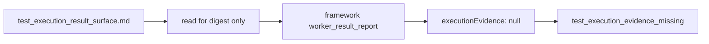
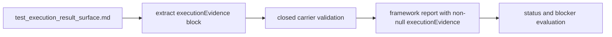

# B-072 Admit Test Execution Result Evidence From Transform Artifacts

- id: B-072
- type: bug
- ticket_category: ordinary
- status: completed
- goal: typescript-rc-data-mapper-qualification
- change_intent: make `derive_test_execution_result_surface` admit execution evidence carried in the transform artifact instead of synthesizing a legacy worker report with `executionEvidence: null`
- change_class: realization_refactor
- re_entry_point: code
- triaged_at: 2026-04-30
- created_at: 2026-04-30
- updated_at: 2026-05-01
- priority: high
- build_tenant: typescript
- owner: unassigned
- review_status: closed_fixed_2026-05-01
- links:
  - test60 forensic: `/Users/jim/src/apps/ai_sdlc_examples/local_projects/data_mapper/data_mapper.test60.TS.cl/.ai-workspace/comments/codex/20260430T214104AEST_test60_claude_lane_forensic.md`
  - final blocked archive: `/Users/jim/src/apps/ai_sdlc_examples/local_projects/data_mapper/data_mapper.test60.TS.cl/.ai-workspace/runtime/odd_sdlc/operator-runs/20260430T111419518Z_pid62579`
  - final transform artifact: `/Users/jim/src/apps/ai_sdlc_examples/local_projects/data_mapper/data_mapper.test60.TS.cl/.ai-workspace/runtime/odd_sdlc/assets/20260430T111419518Z_pid62579/test_run_archive_surface.md`
  - framework-generated report: `/Users/jim/src/apps/ai_sdlc_examples/local_projects/data_mapper/data_mapper.test60.TS.cl/.ai-workspace/runtime/odd_sdlc/operator-runs/20260430T111419518Z_pid62579/worker_result_report.json`
  - source path: `build_tenants/typescript/code/src/operator/handoff.ts`

## STDO Triage

### First Missing Layer

Code.

The test execution result contract states that a
`test_execution_result_surface` transform artifact may carry execution evidence
for framework admission. The TypeScript realization contradicted that contract
by reading the artifact, hashing it, and then hardcoding `executionEvidence:
null` in the framework generated worker report.

This is a realization defect unless implementation proves the artifact evidence
format itself is unauthorized. If that happens, re-enter at design and update
the execution evidence carrier contract first.

## Evidence

In `test60.TS.cl`, the final worker wrote a typed pending execution evidence
block inside `test_run_archive_surface.md`.

The framework-generated report then contained:

```json
"executionEvidence": null
```

The postflight rejected the hop as `test_execution_evidence_missing`.

The current source fault is:

- `buildPostTransformWorkerResultReport(...)` in
  `build_tenants/typescript/code/src/operator/handoff.ts`
- the report builder reads `manifest.outputFile`
- it returns a report with `executionEvidence: null`

## Target Truth

For `test_execution_result_surface`, odd_sdlc must extract typed execution
evidence from the transform artifact when the worker is in transform-only mode.

T-104 moved fresh execution-evidence admission out of
`test_run_archive_surface`. The archive edge now consumes admitted
`test_execution_result_surface` truth and does not emit fresh execution
evidence.

The admitted worker result must preserve:

- `lane`
- `command`
- `status`
- observed counts
- blocker details when status is `pending`
- evidence/report references
- provenance of the source artifact from which the execution evidence was
  extracted

If no valid execution evidence block is present, the failure must say which
shape is missing or invalid. It must not collapse into unparameterized
`test_execution_evidence_missing`.

## Solution Design

Upstream engine-first solution reference:

`/Users/jim/src/apps/abiogenesis/.ai-workspace/comments/codex/20260430T224308AEST_abg_engine_first_holistic_solution.md`

Downstream SDLC solution reference:

`/Users/jim/src/apps/odd_sdlc/.ai-workspace/comments/codex/20260430T223828AEST_test60_bug_wave_domain_solution.md`

This ticket closes the odd_sdlc adapter gap between a transform artifact and
the admitted execution evidence carrier.

Current broken shape:



Target shape:



Design-module checks:

- Authority seam closure: the execution evidence in the artifact becomes the
  admitted execution evidence carrier; it is not reconstructed later from prose.
- Prime law: do not create multiple execution-evidence peer records. Reuse the
  existing admitted carrier shape.
- Totality: malformed, missing, or unsupported evidence returns typed blocking
  reasons.
- Effect-edge rule: extraction is parsing/admission only; it does not execute
  tests or decide release closure.

## Acceptance Criteria

- AC-1: `buildPostTransformWorkerResultReport` extracts execution evidence
  from a `test_execution_result_surface` transform artifact.
- AC-2: extracted evidence is admitted through the same closed carrier as
  worker-authored `executionEvidence` in a legacy report.
- AC-3: invalid or missing artifact evidence produces a typed blocking reason
  that names the missing or malformed field.
- AC-4: `reportRefs` are never left empty when the artifact itself is the
  evidence source; the transform artifact ref is admitted as evidence.
- AC-5: deterministic tests cover succeeded, failed, pending, malformed, and
  absent execution evidence blocks.
- AC-6: a live Claude data_mapper rerun no longer blocks on
  `executionEvidence: null` when the transform artifact carries a valid
  execution evidence block.

## Non-Closure Conditions

- Closing by changing only the prompt.
- Treating markdown prose as evidence without a typed extracted carrier.
- Allowing arbitrary JSON bags outside the admitted execution evidence schema.
- Losing the pending blocker detail when generating the framework report.
- Claiming this closes vec 17 while pending execution still lacks a lawful
  test-execution edge.

## Proof Surface

- TypeScript unit/regression tests for extraction and admission.
- `npm run test:semantic`.
- `npm run lint:semantic`.
- Fresh Claude lane archive proving the final report has non-null
  `executionEvidence`.
- External STDO review before closure.

## Implementation Checkpoint - 2026-05-01

Implemented in `build_tenants/typescript/code/src/operator/handoff.ts`.

- `buildPostTransformWorkerResultReport(...)` now extracts
  `sdlc_worker_execution_evidence` from JSON transform-artifact blocks for
  `test_execution_result_surface`.
- Empty `reportRefs` are normalized to include the transform artifact ref.
- The same closed execution-evidence admission path is used for extracted
  evidence and legacy worker reports.
- malformed transform-artifact evidence no longer escapes as generic
  `worker_report_admission_failed`; it is preserved in
  `executionEvidenceErrors` and postflight emits typed
  `test_execution_evidence_invalid` with field-level detail.
- missing execution evidence now carries a detail string naming the missing
  admitted carrier shape instead of an unparameterized blocker.
- Regression coverage:
  `B-072 post-transform test execution result admits embedded execution evidence`.
- Regression coverage:
  `B-072 malformed transform execution result evidence becomes typed invalid blocker`.

Post-review T-104 correction:

- Fresh execution evidence is no longer admitted on
  `test_run_archive_surface`; the archive edge remains surface-only and
  consumes the admitted execution-result surface.

Verification:

- `npm run lint:semantic` passed on 2026-05-01.
- `npm run test:semantic` passed 153/153 on 2026-05-01.
- Re-verified in the current stabilization tranche on 2026-05-01:
  `npm run lint:semantic` passed and `npm run test:semantic` passed 158/158.
- Post-review tightening on 2026-05-01:
  `npm run build:semantic` passed and focused
  `node --test test_env/tests/test_t064_installed_operator_ux.test.mjs test_env/tests/test_t066_product_materialization_contract.test.mjs test_env/tests/test_t086_blocking_reason_carriers.test.mjs`
  passed 29/29.
- Full tranche verification on 2026-05-01:
  `npm run lint:semantic` passed, `npm run test:semantic` passed 160/160,
  and `git diff --check` passed.
- Post-review T-104 focused verification on 2026-05-01:
  `npm run build:semantic` passed and focused
  `node --test test_env/tests/test_t066_product_materialization_contract.test.mjs test_env/tests/test_t093_scheduling_phase.test.mjs test_env/tests/test_t101_retry_report_rejection_loop.test.mjs`
  passed 23/23.
- Post-review full verification on 2026-05-01:
  `npm run lint:semantic` passed, `npm run test:semantic` passed 161/161,
  and `git diff --check` passed.

Remaining before closure:

- fresh Claude data_mapper lane evidence
- external STDO review accepted for deterministic/source tranche on
  2026-05-01; live evidence remains.

## Test64 Live Evidence Boundary - 2026-05-01

`data_mapper.test64.TS.cl` stopped at `derive_code_surface` before any
`test_execution_result_surface` transform artifact existed. The terminal
archive is `20260501T083037157Z_pid63915` with typed
`silent_worker_inactivity`.

This does not satisfy B-072's fresh live evidence requirement. The ticket
remains active until a live lane reaches execution-result evidence admission.

## Closure - 2026-05-01

Closed as fixed in the active-ticket cleanup pass. This closure supersedes older checkpoint wording in this file that said the ticket remained active for review, live-lane, or proof-envelope gates. The implementation and review notes above record the accepted fix/proof surface; broader release or live-lane envelope work remains with the still-active envelope tickets rather than keeping this fixed work item open.
