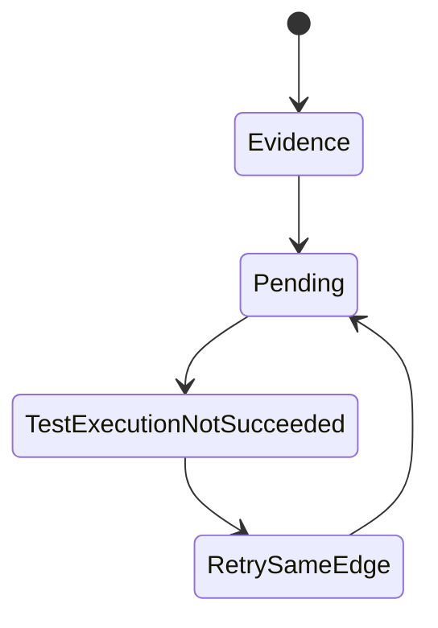
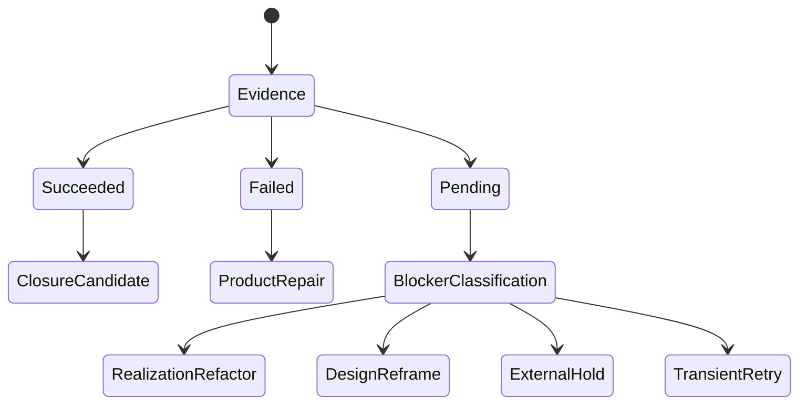

# B-073 Route Pending Test Execution Evidence To Triage, Not Retry Or Closure

- id: B-073
- type: bug
- ticket_category: ordinary
- status: completed
- goal: typescript-rc-data-mapper-qualification
- change_intent: make `pending` test execution evidence a truthful non-closure state that routes to triage or repricing instead of repeating same-edge retry or pretending closure is possible
- change_class: design_reframe
- re_entry_point: design
- triaged_at: 2026-04-30
- created_at: 2026-04-30
- updated_at: 2026-05-01
- priority: high
- build_tenant: typescript
- owner: unassigned
- review_status: closed_fixed_2026-05-01
- links:
  - prior related closure: `.ai-workspace/tickets/completed/T-094-normalize-test-run-archive-execution-evidence-status-contract.md`
  - test60 final archive: `/Users/jim/src/apps/ai_sdlc_examples/local_projects/data_mapper/data_mapper.test60.TS.cl/.ai-workspace/runtime/odd_sdlc/operator-runs/20260430T111419518Z_pid62579`
  - source path: `build_tenants/typescript/code/src/operator/handoff.ts`

## STDO Triage

### First Missing Layer

Design.

T-094 normalized the closed status vocabulary to:

```text
succeeded | failed | pending
```

That solved schema admission but not closure semantics. The current prompt says
`pending` is lawful when tests cannot run. The current postflight then treats
anything other than `succeeded` as a test-execution failure and projects
same-edge retry. That makes a lawful pending state indistinguishable from a
repairable malformed worker output.

## Problem Statement

`pending` means "the required execution did not produce governed evidence yet."
It is not success. It is also not necessarily a same-edge retry condition.

In `test60`, the worker correctly reported that it could not run `sbt test`
without either:

- editing a build defect outside the surface edge; or
- invoking `sbt` and violating `productMaterialization.required = false`.

The framework still returned `retry_same_edge` as a lawful action. That retry
loop cannot converge while the contract remains unchanged.

## Target Truth

`pending` execution evidence must project a non-closing typed state with a
lawful next action selected from the blocker:

- `realization_refactor` when the product tenant build is broken
- `design_reframe` when the graph edge contract is unsatisfiable
- `triage_gap` when the owner layer is not yet known
- same-edge retry only when the pending reason is explicitly transient and the
  next attempt has new information or changed inputs

## Solution Design

Upstream engine-first solution reference:

`/Users/jim/src/apps/abiogenesis/.ai-workspace/comments/codex/20260430T224308AEST_abg_engine_first_holistic_solution.md`

Downstream SDLC solution reference:

`/Users/jim/src/apps/odd_sdlc/.ai-workspace/comments/codex/20260430T223828AEST_test60_bug_wave_domain_solution.md`

This ticket makes the execution evidence status algebra total. `pending` is not
success, not schema failure, and not automatically retry. It is an admitted
non-closure state that must be classified.

Current broken shape:



Target shape:



Design-module checks:

- Authority seam closure: pending blocker detail is carried by the admitted
  evidence and gap dossier, not inferred from terminal logs.
- Totality: every admitted status maps to a closed outcome.
- No semantic center: postflight does not hide re-entry policy in one
  `status !== succeeded` branch.
- Governance/strategy separation: the system names the owner layer and lawful
  re-entry, not an imperative repair recipe.

## Acceptance Criteria

- AC-1: `evaluateExecutionEvidence` distinguishes `pending` from `failed` and
  `succeeded`.
- AC-2: `pending` with a typed blocker produces a blocking reason carrying the
  blocker category, owner surface, and lawful re-entry point.
- AC-3: `pending` caused by unavailable execution does not advertise blind
  `retry_same_edge` unless a retry reason names changed inputs or a transient
  condition.
- AC-4: gap dossiers expose the selected re-entry point with evidence refs.
- AC-5: prompts state that `pending` is lawful non-closure, not closure
  evidence.
- AC-6: deterministic tests cover pending/unavailable execution evidence,
  succeeded execution evidence, failed/contradictory execution evidence, and
  prompt/status normalization. Product-build-defect and graph-contract
  contradiction cases are covered by T-104/B-077 live/design evidence rather
  than claimed as B-073-only deterministic proof.

## Non-Closure Conditions

- Closing by accepting `pending` as release evidence.
- Keeping `test_execution_not_succeeded` as the only projected reason for
  pending evidence.
- Leaving gap dossiers with no detail for pending blockers.
- Retrying the same edge after a structural blocker without changed input,
  reprice, or repair.

## Proof Surface

- TypeScript semantic tests for pending routing.
- Updated prompt snapshot tests.
- Fresh data_mapper Claude lane showing pending routes to triage/design or
  realization repair rather than blind same-edge retry.
- External STDO review before closure.

## Implementation Checkpoint - 2026-05-01

Implemented in `build_tenants/typescript/code/src/operator/handoff.ts` and
`build_tenants/typescript/code/src/shared/blocking_reason.ts`.

- `pending` execution evidence now emits a non-closing
  `test_execution_not_succeeded` reason with lawful re-entry `triage_gap`.
- Pending execution no longer cascades into
  `test_execution_zero_tests_observed`.
- gap dossiers now derive `retryEligible` and `nextLawfulActions` from typed
  blocking-reason re-entry points instead of always advertising
  `retry_same_edge`.
- Regression coverage:
  `T-094/T-095 test execution result normalizes not-run evidence to pending blocker`.

Post-review scope correction:

- B-073 owns the pending-status algebra on the execution-result evidence
  carrier. It does not claim full deterministic coverage for every possible
  owner-layer diagnosis; T-104 owns the graph-contract split and B-077 owns
  contradictory execution evidence triage.

Verification:

- `npm run lint:semantic` passed on 2026-05-01.
- `npm run test:semantic` passed 151/151 on 2026-05-01.
- Re-verified in the current stabilization tranche on 2026-05-01:
  `npm run lint:semantic` passed and `npm run test:semantic` passed 158/158.
- Full tranche verification on 2026-05-01:
  `npm run lint:semantic` passed, `npm run test:semantic` passed 160/160,
  and `git diff --check` passed.
- Post-review T-104 focused verification on 2026-05-01:
  `npm run build:semantic` passed and focused
  `node --test test_env/tests/test_t066_product_materialization_contract.test.mjs test_env/tests/test_t093_scheduling_phase.test.mjs test_env/tests/test_t101_retry_report_rejection_loop.test.mjs`
  passed 23/23.
- Post-review full verification on 2026-05-01:
  `npm run lint:semantic` passed, `npm run test:semantic` passed 161/161,
  and `git diff --check` passed.

Remaining before closure:

- fresh Claude data_mapper lane evidence
- external STDO review

## Test64 Live Evidence Boundary - 2026-05-01

`data_mapper.test64.TS.cl` stopped at `derive_code_surface`, before pending
test execution evidence could be produced or routed. The terminal archive is
`20260501T083037157Z_pid63915` with typed `silent_worker_inactivity`.

This does not satisfy B-073's live evidence requirement. The ticket remains
active for a lane that reaches execution-result evidence and proves pending
truth routes to non-closure rather than retry or release evidence.

## Closure - 2026-05-01

Closed as fixed in the active-ticket cleanup pass. This closure supersedes older checkpoint wording in this file that said the ticket remained active for review, live-lane, or proof-envelope gates. The implementation and review notes above record the accepted fix/proof surface; broader release or live-lane envelope work remains with the still-active envelope tickets rather than keeping this fixed work item open.
