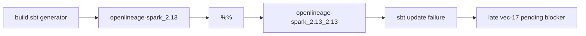
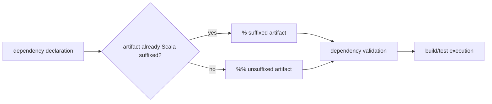

# B-074 Prevent Invalid Scala Cross-Suffixed Dependency Coordinates

- id: B-074
- type: bug
- ticket_category: ordinary
- status: completed
- goal: typescript-rc-data-mapper-qualification
- change_intent: prevent generated Scala build tenants from emitting invalid Maven coordinates such as `openlineage-spark_2.13_2.13` and catch dependency-resolution failures before release qualification
- change_class: realization_refactor
- re_entry_point: code
- triaged_at: 2026-04-30
- created_at: 2026-04-30
- updated_at: 2026-05-01
- priority: high
- build_tenant: typescript
- owner: unassigned
- review_status: closed_repriced_to_agentic_iteration_2026-05-01
- links:
  - test60 workspace: `/Users/jim/src/apps/ai_sdlc_examples/local_projects/data_mapper/data_mapper.test60.TS.cl`
  - failing generated coordinate: `/Users/jim/src/apps/ai_sdlc_examples/local_projects/data_mapper/data_mapper.test60.TS.cl/build_tenants/scala_spark/build.sbt:102`
  - test60 forensic: `/Users/jim/src/apps/ai_sdlc_examples/local_projects/data_mapper/data_mapper.test60.TS.cl/.ai-workspace/comments/codex/20260430T214104AEST_test60_claude_lane_forensic.md`

## STDO Triage

### First Missing Layer

Code, with design escalation if the coordinate policy is not currently
declared.

The generated data_mapper build tenant emitted:

```scala
"io.openlineage" %% "openlineage-spark_2.13" % openLineageVersion
```

The artifact id already includes the Scala suffix. Using `%%` asks sbt to add
the Scala suffix again, resolving:

```text
io.openlineage:openlineage-spark_2.13_2.13:1.13.1
```

That artifact does not exist, so `sbt test` cannot reach the test phase.

## Target Truth

odd_sdlc must either:

- generate a correct single-percent coordinate when the artifact id already
  includes a Scala suffix; or
- generate an unsuffixed artifact id when using `%%`.

The framework should also catch dependency-resolution failures as build
qualification defects with a typed owner surface, not let them appear only as
late vec-17 pending evidence.

## Solution Design

Upstream engine-first solution reference:

`/Users/jim/src/apps/abiogenesis/.ai-workspace/comments/codex/20260430T224308AEST_abg_engine_first_holistic_solution.md`

Downstream SDLC solution reference:

`/Users/jim/src/apps/odd_sdlc/.ai-workspace/comments/codex/20260430T223828AEST_test60_bug_wave_domain_solution.md`

This ticket is the generated-product defect in the same wave. It is not an ABG
runtime issue. The SDLC domain owns build-tenant generation and qualification
interpretation.

Current broken shape:



Target shape:



Design-module checks:

- Totality: dependency coordinate generation maps every known dependency class
  to a valid or rejected outcome.
- Effect-edge rule: dependency resolution failure is observed at build/test
  execution, not laundered through archive closure.
- Authority seam closure: generated build configuration is the owner surface
  for the coordinate defect.
- Governance/strategy separation: the framework reports the coordinate owner;
  it does not invent a workaround inside the archive edge.

## Acceptance Criteria

- AC-1: generated `build.sbt` for data_mapper no longer uses `%%` with an
  artifact id that already contains `_2.13` or another Scala binary suffix.
- AC-2: dependency coordinate generation has a deterministic test covering
  Scala-cross and Java-style artifacts.
- AC-3: a build/dependency validation step can classify dependency-resolution
  failure as a product realization defect with a concrete file/line owner.
- AC-4: data_mapper live lane does not block on
  `openlineage-spark_2.13_2.13`.
- AC-5: the fix does not special-case only OpenLineage if a general coordinate
  classifier can be applied safely.

## Non-Closure Conditions

- Fixing only the generated `test60` workspace without changing odd_sdlc
  generation/evaluation behavior.
- Suppressing the dependency rather than declaring a correct coordinate.
- Treating dependency-resolution failure as an archive-edge problem.
- Closing without deterministic proof over the generated `build.sbt` shape.

## Proof Surface

- TypeScript test for generated Scala dependency coordinate policy.
- Fresh generated data_mapper build tenant with correct coordinate.
- `sbt update` or `sbt test` evidence from the generated tenant, subject to
  current live-test policy.
- External STDO review before closure.

## Backout Checkpoint - 2026-05-01

The prior core fix was backed out because it put Scala/sbt dependency-coordinate
law inside `odd_sdlc`'s generic builder runtime. That violates the design-method
boundary: `odd_sdlc` may govern handoff, execution, evidence, retry, and closure,
but it must not accumulate tenant-specific build-system rules in core.

Backed out surfaces:

- the sbt-specific materialization prompt rule for `_2.13` artifact ids and
  `%%`;
- the hardcoded `invalidScalaCrossSuffixedCoordinate` detector in core
  postflight;
- the `invalid_dependency_coordinate` blocking reason introduced for that
  detector;
- the deterministic regression that made Scala/sbt coordinate law a core
  semantic expectation.

Current target direction:

- the live agentic builder should repair generated build-tenant errors in the
  active lane using the tenant's own build feedback;
- `odd_sdlc` should admit the resulting runtime evidence and route unresolved
  build failures through generic execution/gap surfaces;
- if reusable validation is needed, it must enter as declared tenant/project
  validation policy or a tenant-owned design surface, not as hardcoded
  `odd_sdlc` core behavior.

Remaining before closure:

- prove a live generated lane can encounter and repair this class of
  build-tenant defect without encoding Scala/sbt law in `odd_sdlc` core;
- external STDO review of the repaired boundary.

## Test64 Live Evidence Boundary - 2026-05-01

`data_mapper.test64.TS.cl` stopped at `derive_code_surface` before a generated
Scala build tenant could be used for dependency-resolution proof. The terminal
archive is `20260501T083037157Z_pid63915` with typed
`silent_worker_inactivity`.

This does not satisfy B-074's fresh live lane requirement. The targeted
negative proof remains valid, but live closure still requires a lane that
materializes the generated build surface far enough to avoid the
`openlineage-spark_2.13_2.13` class of blocker.

## Closure - 2026-05-01

Closed as repriced out of core bug tracking. The invalid generated Scala coordinate is a real implementation defect, but it is ordinary worksite repair pressure for the agentic coder during declared build/test iteration, not generic `odd_sdlc` product law. `odd_sdlc` must admit returned build/test evidence, block closure, preserve the gap/archive, and re-enter constructive iteration. The concrete language, dependency, spelling, configuration, or runtime defect is repaired by the agentic coder or by tenant-local declared validation policy.

The governing product-law clarification is in `specification/PRODUCT.md` under `Technology Capability Asset`: implementation defects discovered by declared build, test, lint, typecheck, validation, or runtime-return evidence block closure and re-enter the constructive iteration loop; core SDLC does not encode those defect grammars as product law.
