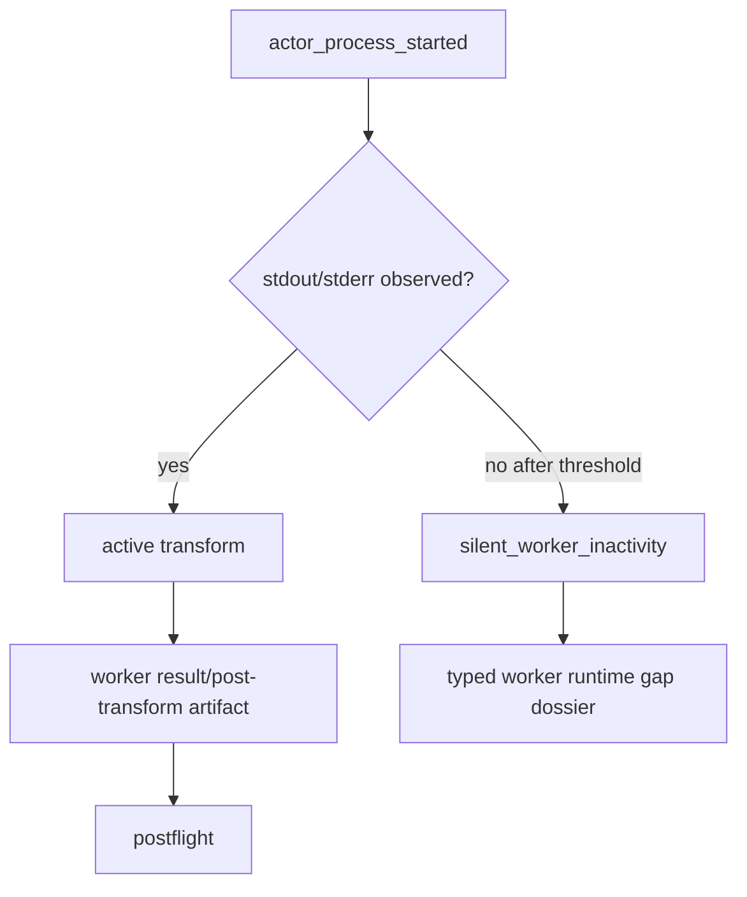

# B-078 Add Silent Worker Inactivity Policy For Live F_P Processes

- id: B-078
- type: bug
- ticket_category: ordinary
- status: completed
- goal: typescript-rc-data-mapper-qualification
- change_intent: classify live worker silence as a typed runtime condition before the full wall-clock actor timeout burns 30 minutes
- change_class: design_reframe
- re_entry_point: design
- triaged_at: 2026-05-01
- created_at: 2026-05-01
- updated_at: 2026-05-01
- priority: high
- build_tenant: typescript
- owner: unassigned
- review_status: closed_fixed_2026-05-01
- intake_source: `data_mapper.test62.TS.cl` live Claude lane, archive `20260430T193642659Z_pid22395`.
- affected_boundary: odd_sdlc worker transport policy, ABG process actor liveness projection, odd_sdlc worker failure postflight/gap dossier
- upstream_links:
  - ABG T-097 supervised process actor
  - odd_sdlc B-071 process supervision consumption

## STDO Triage

### First Missing Layer

Design.

ABG emits process heartbeats and a wall-clock timeout. The live lane showed a
worker process that produced no stdout, no stderr, and no result report for the
full 30-minute timeout. The runtime eventually emitted:

- `actor_process_timeout` at `1800002ms`
- `actor_process_signal_sent` with `SIGTERM`
- `actor_process_exited` with status `143`

That evidence is preserved, but odd_sdlc has no domain policy distinguishing a
silent worker from a merely long-running worker until the full timeout expires.

## Target Truth

odd_sdlc should declare a worker inactivity policy over ABG process facts:

The policy must not live as ad hoc CLI polling. It should consume ABG process
events/projections and emit a typed odd_sdlc blocking reason or runtime policy
decision.

## Acceptance Criteria

- AC-1: odd_sdlc has a declared inactivity threshold for process workers.
- AC-2: silence is based on ABG process events/projection, not terminal stdout
  scraping alone.
- AC-3: a silent worker produces typed evidence before or at timeout:
  no stdout/stderr, no result report, elapsed time, last heartbeat, signal
  sequence.
- AC-4: failure dossiers include the ABG process evidence refs.
- AC-5: deterministic test simulates a silent worker and proves the typed
  blocker.
- AC-6: live Claude lane either produces stream/result before threshold or
  stops with the typed silent-worker blocker.

## Non-Closure Conditions

- Lowering only the global timeout without a typed inactivity policy.
- Treating heartbeats as proof of productive work.
- Hiding process evidence outside the gap dossier.

## Implementation Checkpoint - 2026-05-01

Status: implemented pending live Claude proof and external review.

Changes made:

- odd_sdlc now declares a worker inactivity timeout via
  `ODD_SDLC_WORKER_INACTIVITY_TIMEOUT_MS`, defaulting to 10 minutes. This is
  distinct from ABG's previous 30-minute process timeout default.
- worker runs now archive `timedOut`, `stdoutByteCount`, and
  `stderrByteCount` in `worker_run.json`.
- timed-out workers with zero stdout, zero stderr, and no report file are
  classified as `silent_worker_inactivity` rather than generic
  `worker_process_failed`.
- the typed blocker carries elapsed time, byte counts, signal, and the normal
  ABG process evidence refs: `worker_process_started.json`,
  `worker_process_events.jsonl`, stdout, stderr, worker run, and handoff
  manifest.
- deterministic regression coverage added:
  `B-078 silent worker inactivity is typed before the full process timeout`.
- no-shard silent workers now stop at `triage_gap` immediately instead of
  creating a blind same-edge retry; B-080 owns shard-backed recovery when a
  smaller work unit exists.

Verification:

- `npm run build:semantic` passed.
- focused `node --test test_env/tests/test_t064_installed_operator_ux.test.mjs`
  passed 5/5.
- Post-review tightening on 2026-05-01:
  `npm run build:semantic` passed and focused
  `node --test test_env/tests/test_t064_installed_operator_ux.test.mjs test_env/tests/test_t066_product_materialization_contract.test.mjs test_env/tests/test_t086_blocking_reason_carriers.test.mjs`
  passed 29/29.
- Full tranche verification on 2026-05-01:
  `npm run lint:semantic` passed, `npm run test:semantic` passed 160/160,
  and `git diff --check` passed.

Remaining before closure:

- external STDO review of the final live evidence remains.
- B-080 recovery remains separate work; B-078 only names and evidences the
  condition.

## ABG Progress-Lease Correction - 2026-05-01

During the live `data_mapper.test63.TS.cl` probe, implementation review found
that odd_sdlc's inactivity policy was being passed to ABG as the hard process
`timeoutMs`. That would kill a productive long-running worker after the
silence budget even if stdout/stderr activity had occurred.

Corrected split:

- ABG owns the progress lease through
  `/Users/jim/src/apps/abiogenesis/.ai-workspace/tickets/active/B-032-restore-typescript-process-actor-progress-lease-timeout.md`.
- odd_sdlc passes `ODD_SDLC_WORKER_TIMEOUT_MS` as the hard lifetime timeout.
- odd_sdlc passes `ODD_SDLC_WORKER_INACTIVITY_TIMEOUT_MS` as ABG
  `inactivityTimeoutMs`.

Verification after the split:

- ABG `npm run lint:semantic` passed.
- ABG `npm run test:semantic` passed 306/306.
- odd_sdlc `npm run lint:semantic` passed.
- odd_sdlc `npm run test:semantic` passed 155/155.

## Live Checkpoint - 2026-05-01

`data_mapper.test63.TS.cl` has not hit `silent_worker_inactivity` so far. The
first completed Claude workers produced stdout before the configured 10-minute
silence threshold and exited 0:

- vector 0, `derive_intent_surface`: first stdout chunk at ~268s,
  `timedOut: false`.
- vector 1, `derive_product_surface`: first stdout chunk at ~245s,
  `timedOut: false`.
- vector 2, `derive_goal_surface`: first stdout chunk at ~238s,
  `timedOut: false`.
- vector 7, `derive_scenario_surface`: first stdout chunk at ~278s,
  `timedOut: false`.

This satisfies the non-failure half of AC-6 for the live lane: active workers
produce stream/result progress before the inactivity threshold. Typed silent
failure remains covered by deterministic regression and will be live-proven if
the lane encounters a silent child.

## Final Test63 Live Evidence - 2026-05-01

`data_mapper.test63.TS.cl` later hit the typed silent-worker path at
`derive_test_module_surface`.

Final archive:

`/Users/jim/src/apps/ai_sdlc_examples/local_projects/data_mapper/data_mapper.test63.TS.cl/.ai-workspace/runtime/odd_sdlc/operator-runs/20260501T060923716Z_pid95556`

The final gap dossier reports:

- `reason: silent_worker_inactivity`
- `lawfulReentryPoint: triage_gap`
- `detail:
  elapsedMs=1074909;stdoutBytes=0;stderrBytes=0;signal=none;priorSilentAttempts=1;executionShards=0`
- `retryEligible: false`
- `nextLawfulActions: ["triage_gap"]`

The evidence refs include `worker_run.json`, stdout, stderr,
`worker_process_started.json`, `worker_process_events.jsonl`, and
`handoff_manifest.json`.

This satisfies AC-6's failure side: the live Claude lane produced a typed
silent-worker blocker rather than an opaque hang. External review remains
required before closure.

## Test64 Successor Evidence - 2026-05-01

`data_mapper.test64.TS.cl` produced another live typed silent-worker outcome,
this time at `derive_code_surface`.

Final archive:

`/Users/jim/src/apps/ai_sdlc_examples/local_projects/data_mapper/data_mapper.test64.TS.cl/.ai-workspace/runtime/odd_sdlc/operator-runs/20260501T083037157Z_pid63915`

The final gap dossier reports:

- `reason: silent_worker_inactivity`
- `lawfulReentryPoint: triage_gap`
- `elapsedMs=600516`
- `stdoutBytes=0`
- `stderrBytes=0`
- `priorSilentAttempts=0`
- `executionShards=0`
- `retryEligible: false`
- `nextLawfulActions: ["triage_gap"]`

The evidence refs include `worker_run.json`, stdout, stderr,
`worker_process_started.json`, `worker_process_events.jsonl`, and
`handoff_manifest.json`. This reinforces AC-6. External review remains required
before closure.

## External Review Reconciliation - 2026-05-01

The external design-method review found that the silent-worker blocking carrier
classified inactivity correctly but did not itself expose the full typed
evidence required by AC-3, especially PID, policy, last heartbeat, and signal
sequence.

Correction applied:

- odd_sdlc now writes `worker_process_summary.json` for worker runs;
- silent-worker postflight evidence refs include that summary;
- `silent_worker_inactivity` detail now carries PID, hard timeout,
  inactivity timeout, heartbeat interval, last heartbeat elapsed time, signal
  sequence, shard facts, and `processSummaryRef`;
- focused B-078 regression coverage proves the summary fields and enriched
  detail are present.

B-078 remains active pending fresh external STDO review.

## Second External Review Reconciliation - 2026-05-01

The second design-method review found that summary admission degraded silently:
missing or malformed `worker_process_summary.json` could still yield a
`silent_worker_inactivity` carrier with `unknown` fields.

Correction applied:

- missing summary truth now emits typed `worker_process_summary_missing`;
- malformed or non-admitted summary truth now emits typed
  `worker_process_summary_invalid`;
- silent-worker postflight does not emit complete `silent_worker_inactivity`
  evidence unless the summary carrier is admitted;
- focused regression coverage proves both missing and malformed summary states
  fail closed as typed evidence defects.

B-078 remains active pending fresh external STDO review.

## Closure - 2026-05-01

Closed as fixed in the active-ticket cleanup pass. This closure supersedes older checkpoint wording in this file that said the ticket remained active for review, live-lane, or proof-envelope gates. The implementation and review notes above record the accepted fix/proof surface; broader release or live-lane envelope work remains with the still-active envelope tickets rather than keeping this fixed work item open.
