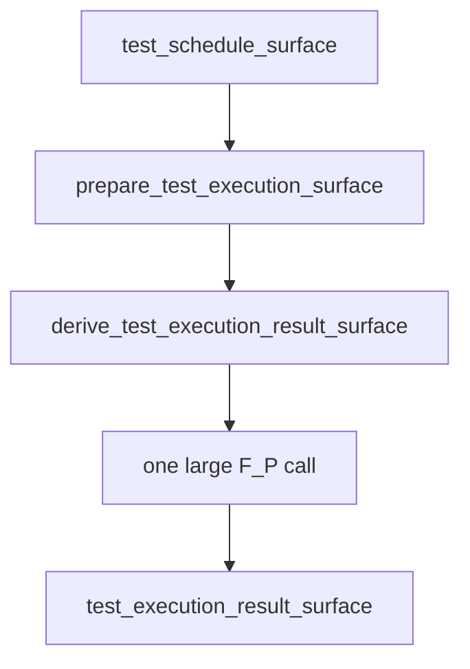
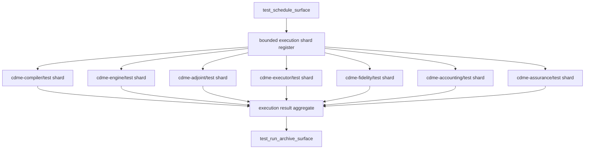

# B-079 Decompose Test Execution Schedule Into Bounded Shards

- id: B-079
- type: bug
- ticket_category: implementation_migration
- migration_strategy: inside_out_hard_break
- library_usage: consume
- governing_library: TypeScript SDLC graph catalog, product materialization contract, retry-frontier blocking reason carriers
- status: completed
- goal: typescript-rc-data-mapper-qualification
- change_intent: make the scheduling prior produce bounded test-execution shards so execution-result workers receive manageable work instead of one oversized ambiguous edge
- change_class: design_reframe
- re_entry_point: design
- triaged_at: 2026-05-01
- created_at: 2026-05-01
- updated_at: 2026-05-01
- priority: high
- build_tenant: typescript
- owner: unassigned
- review_status: closed_fixed_2026-05-01
- intake_source: `data_mapper.test62.TS.cl` reached `derive_test_execution_result_surface`, then repeated execution-evidence failures and a silent worker timeout; operator identified that test35 achieved depth through emergent iteration while TS is still handing a too-large execution task to one F_P call.
- affected_boundary: `build_tenants/typescript/code/src/graph/catalog.ts`, scheduling prompt/handoff generation, test execution surfaces, execution evidence admission, ABG/odd_sdlc retry frontier consumption
- related:
  - T-104 (`.ai-workspace/tickets/active/T-104-split-test-execution-from-test-run-archive-surface.md`)
  - B-078 (`.ai-workspace/tickets/active/B-078-add-silent-worker-inactivity-policy-for-live-fp-processes.md`)
  - B-077 (`.ai-workspace/tickets/active/B-077-classify-contradictory-test-execution-evidence-as-triage-gap.md`)
  - test62 report (`/Users/jim/src/apps/ai_sdlc_examples/local_projects/data_mapper/CODE_QUALITY_AND_TRAVERSAL_11_28_31_32_33_34_35_38_upto_62.md`)

## STDO Triage

### First Missing Layer

Design.

The current graph split introduced `prepare_test_execution_surface` and
`derive_test_execution_result_surface`, but the execution schedule is still too
coarse. It effectively asks one worker to reason about and report the whole
test execution result. `test35` achieved deeper quality through repeated
bounded iterations. The TypeScript lane needs that boundedness as explicit
schedule law, not emergent luck.

## Defect

Current shape:

This creates an oversized, high-ambiguity F_P request. When the worker fails,
the framework cannot tell whether the right recovery is same-edge retry,
smaller prompt, module-level execution, or triage.

## Target Shape

The scheduling prior must publish bounded execution shards.

Each shard should carry:

- shard id
- module or work package
- command
- working directory
- timeout/inactivity policy
- expected report refs
- allowed build byproducts
- required evidence shape
- retry/recovery policy

## Acceptance Criteria

- AC-1: `test_schedule_surface` or `prepare_test_execution_surface` emits a
  typed shard register, not only prose.
- AC-2: `derive_test_execution_result_surface` consumes shard truth and can
  produce/admit per-shard execution evidence.
- AC-3: retry frontier carries shard identity so a failed shard can deepen
  without rerunning the entire execution result edge blindly.
- AC-4: test-run archive consumes an aggregate over admitted shard evidence.
- AC-5: deterministic tests prove a multi-module schedule is decomposed into
  bounded shards.
- AC-6: a live Claude data_mapper lane proves at least two shard-level work
  products or execution evidence rows before archive closure.

## Non-Closure Conditions

- Keeping one monolithic execution-result F_P request and only changing prompt
  wording.
- Treating shard decomposition as worker prose instead of typed schedule
  evidence.
- Losing the ability to aggregate shard evidence into one release/test-run
  archive.
- Closing with only deterministic tests and no live data_mapper proof.

## Migration Declaration

- old truth path: `test_schedule_surface` and
  `prepare_test_execution_surface` handed `derive_test_execution_result_surface`
  one coarse execution request with no typed shard identity.
- new truth path: `SdlcProductMaterializationContract.executionShards` carries
  the bounded execution schedule and `derive_test_execution_result_surface`
  admits aggregate plus per-shard execution evidence.
- old producers: schedule/prep prompts and handoff generation that described
  execution scope in prose.
- new producers: conformed project module truth, graph catalog schedule edges,
  handoff manifest construction, and execution-shard contract generation.
- old consumers: execution-result postflight, retry frontier, archive edge, and
  release qualification read one aggregate execution result.
- new consumers: execution-result postflight validates shard rows, retry
  frontier preserves shard identity, archive consumes the aggregate over
  admitted shard truth, and release qualification depends on that aggregate.
- projection/read-model surfaces: handoff manifest,
  `traversal_intent_package`, gap dossier, retry-frontier legacy keys,
  `query-domain`, and semantic regression output.
- closure law: the migration closes only when unsharded execution evidence no
  longer satisfies the schedule/execution/archive closure path and a live
  data_mapper lane proves at least two shard-level rows or work products before
  archive closure.

## Migration Checklist

- [x] old truth path is named explicitly
- [x] new truth path is named explicitly
- [x] producer set for the new truth is listed
- [x] consumer set for the new truth is listed
- [x] projection/read-model surfaces are listed
- [x] old truth path is removed or explicitly demoted from authority
- [x] mixed-state behavior is no longer accepted as closure evidence
- [x] tests proving mixed old/new behavior are removed or repriced
- [x] recurring realization patterns are checked against existing library/commonization surfaces
- [x] ticket declares library usage and names the governing library or rationale
- [x] this active ticket carries only the TypeScript tenant lifecycle
- [ ] ticket wording, product wording, and proof claims are reconciled before closure

## Implementation Checkpoint - 2026-05-01

Status: implemented pending fresh live proof and external review.

Changes made:

- `SdlcProductMaterializationContract` now carries a typed
  `executionShards` register.
- test schedule, test execution prep, test execution result, and test archive
  surfaces receive shard truth derived from the conformed project module
  structure.
- each shard carries module identity, test command, working directory, timeout,
  inactivity timeout, expected report refs, allowed byproduct globs, required
  execution evidence kind, and retry policy.
- traversal tranche keys include `execution_shard:<shardId>` so the shard
  register is discoverable by retrieval/gap surfaces.
- worker prompt text now requires schedule surfaces to publish an
  `execution_shard_register` from
  `manifest.productMaterialization.executionShards`, and execution-result
  workers are told to consume shard truth instead of collapsing into one
  unscoped run.
- execution-result postflight now admits and validates per-shard execution
  evidence through `executionEvidence.shardEvidence`.
- missing, duplicate, unknown, command-mismatched, count-contradictory, failed,
  pending, and zero-test shard rows project typed blocking reasons instead of
  collapsing into one aggregate result.
- aggregate execution counts are checked against the sum of admitted shard
  rows when shard counts are concrete.
- shard commands are now module-scoped for common multi-module build tools
  instead of repeating the aggregate command for every shard. For sbt-backed
  data_mapper work this produces commands such as `sbt "cdme-compiler/test"`
  so the schedule can actually bound work by module.
- retry-frontier legacy keys now preserve shard-detail identity for
  `test_execution_shard_evidence_missing` and
  `test_execution_shard_evidence_mismatch`, preventing same-code shard failures
  from collapsing into one latest-only gap.
- deterministic coverage added:
  `B-079 test execution schedule exposes a bounded shard register`.
- deterministic coverage added:
  `B-079 execution-result postflight requires registered shard evidence`.
- deterministic coverage added:
  `T-086 legacy retry-frontier keys preserve execution shard detail`.

Verification:

- `npm run build:semantic` passed.
- focused `node --test test_env/tests/test_t066_product_materialization_contract.test.mjs test_env/tests/test_t093_scheduling_phase.test.mjs test_env/tests/test_t101_retry_report_rejection_loop.test.mjs`
  passed 20/20.
- focused B-080/B-079 adjacent suite
  `node --test test_env/tests/test_t066_product_materialization_contract.test.mjs test_env/tests/test_t064_installed_operator_ux.test.mjs test_env/tests/test_t093_scheduling_phase.test.mjs test_env/tests/test_t101_retry_report_rejection_loop.test.mjs`
  passed 27/27.
- after module-scoped shard command tightening,
  `npm run build:semantic` passed and
  `node --test test_env/tests/test_t093_scheduling_phase.test.mjs test_env/tests/test_t066_product_materialization_contract.test.mjs`
  passed 20/20.
- `npm run lint:semantic` passed.
- `npm run test:semantic` passed 158/158.
- Post-review tightening on 2026-05-01:
  `npm run build:semantic` passed and focused
  `node --test test_env/tests/test_t064_installed_operator_ux.test.mjs test_env/tests/test_t066_product_materialization_contract.test.mjs test_env/tests/test_t086_blocking_reason_carriers.test.mjs`
  passed 29/29.
- Full tranche verification on 2026-05-01:
  `npm run lint:semantic` passed, `npm run test:semantic` passed 160/160,
  and `git diff --check` passed.

Remaining before closure:

- live Claude data_mapper lane must show at least two shard-level work products
  or execution evidence rows before archive closure.
- external STDO review accepted for deterministic/source tranche on
  2026-05-01; live evidence remains.

## Test64 Live Evidence Boundary - 2026-05-01

`data_mapper.test64.TS.cl` did not reach the test execution edge. The lane
stopped at `derive_code_surface`, archive
`20260501T083037157Z_pid63915`, with typed `silent_worker_inactivity`.

This does not satisfy AC-6. B-079 remains active until a fresh live data_mapper
lane reaches execution-result truth and shows at least two shard-level work
products or execution evidence rows before archive closure.

## STDO Review Correction - 2026-05-01

The 2026-05-01 STDO active-ticket code review found that archive closure could
still pass by naming `test_execution_result_surface` in archive prose without
proving that the cited source was an admitted execution-result carrier with
shard truth.

Correction applied:

- source-asset handoff obligations now carry prior `worker_result_report.json`
  refs for matching asset types from the operator-run archive.
- `derive_test_run_archive_surface` postflight now requires the fulfilled
  `source_asset:test_execution_result_surface` assessment to cite a readable
  admitted `odd_sdlc.worker_result_report` whose target is
  `test_execution_result_surface`.
- that source report must carry successful typed execution evidence, matching
  the current test execution contract and registered shard evidence.
- archive prose that names `test_execution_result_surface` without this source
  carrier now fails closed as `source_asset_dependency_missing`.

Verification:

- `npm run build:semantic` passed.
- focused `node --test test_env/tests/test_t066_product_materialization_contract.test.mjs`
  passed 21/21.
- `npm run lint:semantic` passed.
- `npm run test:semantic` passed 164/164.
- `git diff --check` passed.

Closure state remains active. This correction resolves the deterministic
archive-truth review blocker for B-079, but the ticket still requires live
Claude data_mapper evidence and publication/versioning of the active ticket
authority before STDO closure.

## Closure - 2026-05-01

Closed as fixed in the active-ticket cleanup pass. This closure supersedes older checkpoint wording in this file that said the ticket remained active for review, live-lane, or proof-envelope gates. The implementation and review notes above record the accepted fix/proof surface; broader release or live-lane envelope work remains with the still-active envelope tickets rather than keeping this fixed work item open.
