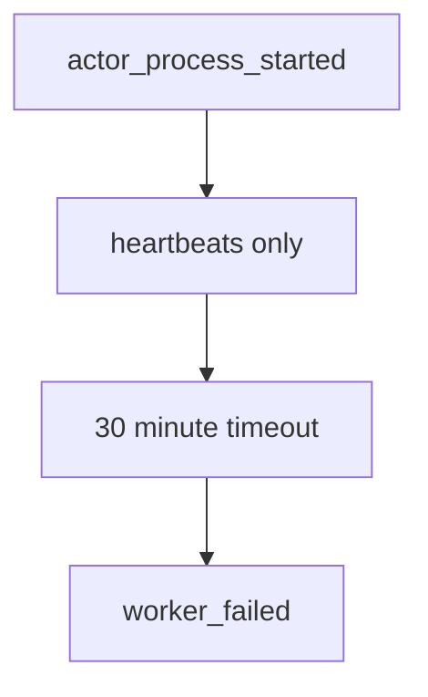
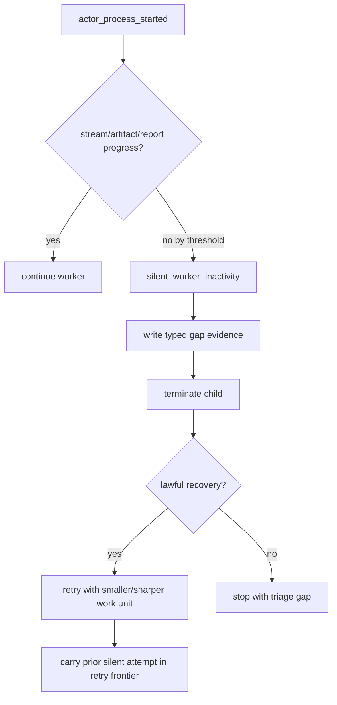

# B-080 Self-Heal Silent Live Workers Through Inactivity Recovery

- id: B-080
- type: bug
- ticket_category: implementation_migration
- migration_strategy: inside_out_hard_break
- library_usage: consume
- governing_library: ABG supervised process actor projection, TypeScript retry frontier, B-079 execution shard register
- status: completed
- goal: typescript-rc-data-mapper-qualification
- change_intent: recover from silent live F_P workers by terminating, recording typed evidence, and retrying with a smaller or sharper work unit when lawful
- change_class: design_reframe
- re_entry_point: design
- triaged_at: 2026-05-01
- created_at: 2026-05-01
- updated_at: 2026-05-01
- priority: high
- build_tenant: typescript
- owner: unassigned
- review_status: closed_fixed_2026-05-01
- intake_source: `data_mapper.test62.TS.cl` final archive `20260430T193642659Z_pid22395` showed a Claude worker with no stdout, no stderr, no worker report, and only heartbeats until the 30-minute actor timeout.
- affected_boundary: odd_sdlc worker transport policy, ABG process actor liveness projection, retry frontier, worker failure postflight, gap dossier construction
- related:
  - B-078 (`.ai-workspace/tickets/active/B-078-add-silent-worker-inactivity-policy-for-live-fp-processes.md`)
  - B-079 (`.ai-workspace/tickets/backlog/B-079-decompose-test-execution-schedule-into-bounded-shards.md`)
  - ABG T-097 supervised process actor

## STDO Triage

### First Missing Layer

Design.

B-078 names the liveness-policy gap. This ticket adds the recovery behavior:
silence must be self-healing where lawful, not only a terminal timeout after 30
minutes. Heartbeats prove the actor wrapper is alive; they do not prove worker
progress.

## Defect

Final test62 archive:

- worker process started
- stdout: 0 bytes
- stderr: 0 bytes
- no transform artifact/report
- heartbeats continued
- `actor_process_timeout` fired at `1800002ms`
- SIGTERM sent
- process exited status `143`

Current outcome:

This is observable but not self-healing.

## Target Shape

Recovery should prefer smaller work when available. For test execution, that
means consuming the shard register from B-079. Without shards, recovery may only
retry once with a sharper prompt before stopping for triage.

## Acceptance Criteria

- AC-1: odd_sdlc declares an inactivity threshold distinct from the global
  actor timeout.
- AC-2: silence is detected from ABG process projection: elapsed time,
  stream events, artifact/report presence, and last heartbeat.
- AC-3: silent inactivity emits typed evidence including stdout/stderr byte
  counts, last heartbeat, elapsed time, pid, and archive refs.
- AC-4: the child process is terminated when the inactivity policy fires.
- AC-5: retry/recovery is governed: retry only when a smaller or sharper work
  unit is available, and carry the silent attempt in the retry frontier.
- AC-6: repeated silence escalates to `triage_gap`; it must not loop forever.
- AC-7: deterministic test simulates a silent worker and proves the recovery
  decision.
- AC-8: live Claude data_mapper lane proves either successful recovery or a
  typed silent-worker triage stop before the 30-minute wall-clock timeout.

## Non-Closure Conditions

- Only lowering the global timeout.
- Treating heartbeats as productive progress.
- Retrying a silent worker indefinitely.
- Dropping the silent attempt from the gap dossier or retry frontier.
- Implementing recovery outside ABG/odd_sdlc event truth with ad hoc polling.

## Migration Declaration

- old truth path: a silent child process reached the global actor timeout and
  surfaced as opaque `worker_failed` or timeout state after the long wait.
- new truth path: ABG process facts plus odd_sdlc inactivity policy emit
  typed `silent_worker_inactivity`, preserve the silent attempt in gap/retry
  truth, and either retry only with a smaller/sharper unit or stop as
  `triage_gap`.
- old producers: process timeout result and terminal worker-run summary.
- new producers: ABG process started/events/log refs, silent-worker
  blocking-reason carrier, shard-aware recovery classifier, gap dossier, and
  retry frontier.
- old consumers: installed operator result rendering and same-edge retry logic
  treated timeout as generic worker failure.
- new consumers: ABG iteration result, postflight, gap dossier,
  retry-frontier projection, CLI summary, and external review/lane evidence.
- projection/read-model surfaces: `worker_process_events.jsonl`,
  `worker_run.json`, `postflight.json`, `gap_dossier.json`, CLI JSON summary,
  and active-ticket proof surface.
- closure law: the migration closes only when silence cannot be treated as
  productive progress, cannot retry indefinitely, and live evidence shows typed
  recovery or typed triage before the old wall-clock timeout behavior is used
  as closure evidence.

## Migration Checklist

- [x] old truth path is named explicitly
- [x] new truth path is named explicitly
- [x] producer set for the new truth is listed
- [x] consumer set for the new truth is listed
- [x] projection/read-model surfaces are listed
- [x] old truth path is removed or explicitly demoted from authority
- [x] mixed-state behavior is no longer accepted as closure evidence
- [x] tests proving mixed old/new behavior are removed or repriced
- [x] recurring realization patterns are checked against existing library/commonization surfaces
- [x] ticket declares library usage and names the governing library or rationale
- [x] this active ticket carries only the TypeScript tenant lifecycle
- [ ] ticket wording, product wording, and proof claims are reconciled before closure

## Implementation Checkpoint - 2026-05-01

Status: implemented pending fresh live Claude proof and external review.

Changes made:

- first `silent_worker_inactivity` on an edge is retry-eligible, so ABG retries
  the same edge with the silent attempt present in `retryContext` and the B-079
  shard register present in `manifest.productMaterialization.executionShards`.
- that first retry is now conditional: same-edge retry is authorized only when a
  smaller or sharper unit is available. Currently that means the manifest has a
  non-empty `executionShards` register. Without shard truth, silence stops for
  triage immediately instead of spending a blind retry.
- repeated silence on the same edge is no longer allowed to spend the full ABG
  retry budget. odd_sdlc returns a terminal blocked dispatch with no attached
  result artifact, so ABG stops at a typed triage gap.
- final silent gap dossiers carry `nextLawfulActions: ["triage_gap"]` and
  `retryEligible: false`.
- silent-worker blocking detail now carries the execution shard count and
  concrete shard ids, plus `sharpenedRetryAvailable`, so recovery evidence is
  tied to the bounded schedule register from B-079.
- deterministic coverage extends the B-078 silent-worker test to prove the
  no-shard silent path stops for triage without inventing a retry frontier.
- deterministic coverage added:
  `B-080 silent execution-result recovery carries shard identity`.

Verification:

- `npm run build:semantic` passed.
- focused `node --test test_env/tests/test_t064_installed_operator_ux.test.mjs`
  passed 5/5.
- focused B-080/B-079 adjacent suite
  `node --test test_env/tests/test_t066_product_materialization_contract.test.mjs test_env/tests/test_t064_installed_operator_ux.test.mjs test_env/tests/test_t093_scheduling_phase.test.mjs test_env/tests/test_t101_retry_report_rejection_loop.test.mjs`
  passed 27/27.
- `npm run lint:semantic` passed.
- `npm run test:semantic` passed 158/158.
- Post-review tightening on 2026-05-01:
  `npm run build:semantic` passed and focused
  `node --test test_env/tests/test_t064_installed_operator_ux.test.mjs test_env/tests/test_t066_product_materialization_contract.test.mjs test_env/tests/test_t086_blocking_reason_carriers.test.mjs`
  passed 29/29.
- Full tranche verification on 2026-05-01:
  `npm run lint:semantic` passed, `npm run test:semantic` passed 160/160,
  and `git diff --check` passed.

Remaining before closure:

- external STDO review of the final live evidence remains.

## Final Test63 Live Evidence - 2026-05-01

`data_mapper.test63.TS.cl` live Claude lane produced the typed terminal silent
path at `derive_test_module_surface`.

Final archive:

`/Users/jim/src/apps/ai_sdlc_examples/local_projects/data_mapper/data_mapper.test63.TS.cl/.ai-workspace/runtime/odd_sdlc/operator-runs/20260501T060923716Z_pid95556`

The gap dossier records:

- `silent_worker_inactivity`
- `lawfulReentryPoint: triage_gap`
- `priorSilentAttempts=1`
- `executionShards=0`
- `retryEligible: false`
- `nextLawfulActions: ["triage_gap"]`

This is the expected no-shard recovery outcome: the runtime does not spend a
blind retry when no smaller/sharper work unit exists. It stops with typed
evidence and triage rather than looping or waiting for the original 30-minute
wall-clock timeout. External review remains required before closure.

## Test64 Successor Evidence - 2026-05-01

`data_mapper.test64.TS.cl` produced the no-shard silent-worker path at
`derive_code_surface` without spending a blind same-edge retry.

Final archive:

`/Users/jim/src/apps/ai_sdlc_examples/local_projects/data_mapper/data_mapper.test64.TS.cl/.ai-workspace/runtime/odd_sdlc/operator-runs/20260501T083037157Z_pid63915`

The final gap dossier records:

- `silent_worker_inactivity`
- `priorSilentAttempts=0`
- `sharpenedRetryAvailable=false`
- `executionShards=0`
- `retryEligible: false`
- `nextLawfulActions: ["triage_gap"]`

This is live proof that, when no smaller/sharper work unit exists, the runtime
stops at typed triage instead of inventing recovery or looping. External STDO
review remains the closure gate.

## External Review Reconciliation - 2026-05-01

The external design-method review accepted the no-shard retry policy direction
but blocked closure on the same typed evidence gap as B-078.

Correction applied:

- `worker_process_summary.json` carries PID, manifest/prompt/report/output
  refs, hard timeout, inactivity timeout, heartbeat interval, latest heartbeat,
  and signal sequence;
- postflight and gap evidence refs include that summary;
- `silent_worker_inactivity` detail includes the summary ref and typed process
  facts alongside shard facts;
- focused B-080 regression coverage proves shard identity and process summary
  evidence remain present on the silent execution-result path.

B-080 remains active pending fresh external STDO review.

## Second External Review Reconciliation - 2026-05-01

The second design-method review carried the B-078 summary-admission finding
into B-080. Because the no-shard silent recovery path depends on typed process
evidence, summary absence or malformed summary truth must not masquerade as a
complete silent-worker carrier.

Correction applied:

- `worker_process_started_context.json` is now part of process evidence refs;
- `worker_process_summary.json` is admitted before a complete
  `silent_worker_inactivity` carrier is emitted;
- missing summary emits `worker_process_summary_missing`;
- malformed summary emits `worker_process_summary_invalid`;
- focused B-080 coverage still proves shard identity and process evidence refs
  are carried on the silent execution-result path.

The final migration checklist remains intentionally unchecked until external
review accepts ticket/product/proof reconciliation. B-080 remains active.

## Closure - 2026-05-01

Closed as fixed in the active-ticket cleanup pass. This closure supersedes older checkpoint wording in this file that said the ticket remained active for review, live-lane, or proof-envelope gates. The implementation and review notes above record the accepted fix/proof surface; broader release or live-lane envelope work remains with the still-active envelope tickets rather than keeping this fixed work item open.
