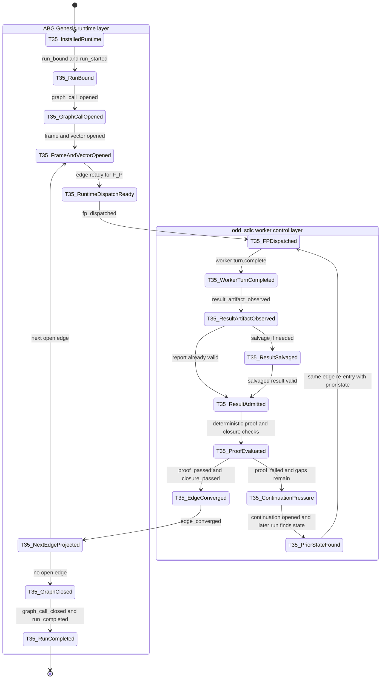
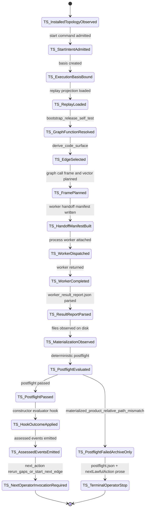
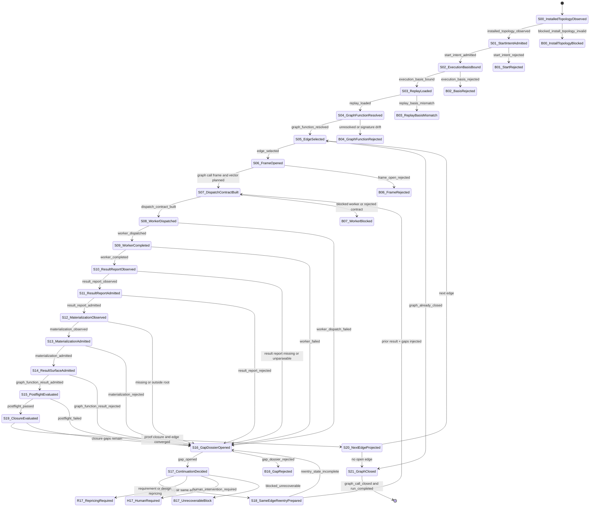

## Triage

This is a realization refactor under STDO governance.

The active requirements and design folder already state that `odd_sdlc` is
graph-function-first, ABG-owned for runtime truth, iterative through governed
repricing, and explicit about operational state transitions. This ticket does
not create a parallel design; it refactors the implementation and proof surfaces
to conform to that active design.

If the state comparison discovers missing constitutional wording, spawn a
separate requirement-reprice ticket. Do not hide requirement changes inside
this ticket.

## Dependency Correction

T-041 is the full operational RC envelope and therefore depends on this ticket.
It is not a blocking dependency for this ticket. T-066 consumes this
total-transition state-machine behavior for deeper materialization/evaluator
work, so T-076 must close before T-066 rather than depending on it.

## Consolidated Scope

`T-071` is consolidated into this ticket. Recursive deepening is not a separate
runner ticket. It is the fixed-point behavior of the active total transition
function over admitted state and gap evidence.

## Core Position

The algebra is not allowed to be ambiguous.

Event calculus does not contain an ambiguous transition. Ambiguity may be
observed only as explicit state data. If the runtime does not have enough
contracted surface truth to advance, the only lawful transition is to a typed
blocked or contract-violation state that emits replayable evidence.

Therefore:

- path-basis uncertainty is `contract_violation`, not a judgment call
- missing worker attachment is `blocked_worker_unattached`, not waiting folklore
- missing returned evidence is `blocked_missing_evidence`, not success
- mismatched postflight truth is `postflight_rejected`, not an operator note
- unresolved authority-to-code or code-to-test deltas are `gap_opened`, not
  closure
- retry or repair is a deterministic transition over admitted gap state, not a
  manual rerun convention

The result of a graph-function traversal is a surface. For `derive_code_surface`
that surface includes:

- the generated `code_surface.md`
- the materialized product file manifest
- the materialized source/test/build files
- the worker result report
- deterministic postflight verdict
- authority-to-code gap evidence
- code-to-test gap evidence
- retry, repair, continuation, or closure state
- ABG event/projection truth

The content of that surface may be produced by `F_P` and therefore vary across
runs. The state machine that admits, rejects, retries, repairs, or closes that
surface is deterministic.

## Contracted Surfaces

The TypeScript design must define these surfaces as explicit contracts. Each
surface needs a stable kind, identity rule, owner, producer, consumer,
persistence location, admissibility checks, and event relationship.

```text
StartIntentSurface
  owner: odd_sdlc domain
  purpose: user's requested scope, target, until mode, and worker policy
  event role: input to start_intent_admitted

RuntimeIdentitySurface
  owner: ABG substrate
  purpose: runtime, worker, backend, build, package, and install identity
  event role: input to execution_basis_bound

ExecutionBasisSurface
  owner: ABG substrate with odd_sdlc domain fields
  purpose: stable replay key for workspace, module, graph function, policy, run,
    work key, frame lineage, and until mode
  event role: emitted by execution_basis_bound; consumed by every later state

ReplayProjectionSurface
  owner: ABG substrate
  purpose: current event-derived graph/frame/vector state for the execution
    basis
  event role: input to graph_function_resolved and edge_selected

GtlModuleSurface
  owner: odd_sdlc domain
  purpose: admitted GTL module and graph-function catalog
  event role: input to graph_function_resolved

GraphFunctionSurface
  owner: odd_sdlc domain
  purpose: selected graph function, asset nodes, declared edges, and target
    output surface
  event role: input to edge_selected

EdgeTraversalContractSurface
  owner: odd_sdlc domain
  purpose: source assets, target asset, F_D/F_P/F_H regime, evaluator
    contract, output contract, and closure law for one edge
  event role: input to frame_opened and dispatch_contract_built

WorkerAttachmentSurface
  owner: odd_sdlc domain over ABG-compatible transport
  purpose: worker transport, command/callable identity, authority, and
    execution limits
  event role: input to dispatch_contract_built; absence emits
    blocked_worker_unattached

WorkerHandoffManifestSurface
  owner: odd_sdlc domain
  purpose: exact instructions, allowed write roots, output file, tenant root,
    materialization contract, required report schema, and prior state/gaps
  event role: emitted by dispatch_contract_built; consumed by worker_dispatched

WorkerRunSurface
  owner: ABG-compatible runtime adapter
  purpose: process invocation, timing, stdout/stderr refs, exit status, and
    transport errors
  event role: emitted by worker_completed or worker_failed

WorkerResultReportSurface
  owner: F_P worker, admitted by odd_sdlc F_D
  purpose: graph function, edge, output file, digest, unresolved reasons,
    materialized files, and evidence refs
  event role: input to result_report_admitted or result_report_rejected

ProductMaterializationContractSurface
  owner: odd_sdlc domain
  purpose: target tenant root, path basis, required file roles, permitted roles,
    digest law, and allowed output shape
  event role: input to materialization_observed and materialization_admitted

ProductMaterializationManifestSurface
  owner: odd_sdlc F_D
  purpose: admitted product files, tenant-root-relative paths, digests, byte
    counts, roles, and trace/evidence refs
  event role: emitted by materialization_admitted or rejected with reasons

GraphFunctionResultSurface
  owner: odd_sdlc domain over ABG event truth
  purpose: output asset plus admitted worker report, materialization manifest,
    postflight verdict, gaps, and closure/retry state
  event role: result surface for the traversal attempt

PostflightVerdictSurface
  owner: odd_sdlc F_D
  purpose: deterministic pass/block verdict and blocking reason inventory
  event role: emitted by postflight_passed or postflight_failed

GapDossierSurface
  owner: odd_sdlc domain
  purpose: machine-consumable authority-to-code and code-to-test deltas,
    blocking reasons, retry eligibility, and repricing candidates
  event role: emitted by gap_opened; consumed by continuation_decided

ContinuationDecisionSurface
  owner: ABG substrate with odd_sdlc domain policy input
  purpose: same-edge retry, repair, next-edge advance, human escalation,
    requirement/design repricing, or graph closure
  event role: emitted by continuation_decided

ClosureProofSurface
  owner: odd_sdlc F_D over ABG replay truth
  purpose: edge and graph closure proof, including source/test/runtime evidence
  event role: emitted by edge_closed or graph_closed

OperatorSummarySurface
  owner: odd_sdlc projection
  purpose: human-readable status and next lawful action
  event role: read model only; never transition authority
```

Archive files may store these surfaces, but storage is not authority. A surface
becomes state-machine truth only when it is admitted and correlated with the
execution basis through event/projection law.

## Full Required State Machine

The TypeScript design must implement or explicitly allocate every state below.
State names may be refined, but no state may disappear unless the design proves
it is merged into an equivalent typed transition with the same contracted
inputs and outputs.

```text
S00 InstalledTopologyObserved
  input surfaces: install manifest, RuntimeIdentitySurface
  guard: ABG and odd_sdlc install topology resolves
  event: installed_topology_observed
  next: S01 StartIntentAdmitted
  failure: blocked_install_topology_invalid

S01 StartIntentAdmitted
  input surfaces: StartIntentSurface
  guard: scope, target, until mode, and worker policy are typed
  event: start_intent_admitted
  next: S02 ExecutionBasisBound
  failure: start_intent_rejected

S02 ExecutionBasisBound
  input surfaces: StartIntentSurface, RuntimeIdentitySurface
  guard: execution basis is stable and replay-addressable
  event: execution_basis_bound
  next: S03 ReplayLoaded
  failure: execution_basis_rejected

S03 ReplayLoaded
  input surfaces: ExecutionBasisSurface, event log
  guard: replay projection can be derived for the exact basis
  event: replay_loaded
  next: S04 GraphFunctionResolved
  failure: replay_basis_mismatch or replay_unreadable

S04 GraphFunctionResolved
  input surfaces: ReplayProjectionSurface, GtlModuleSurface, GraphFunctionSurface
  guard: graph function exists and signature matches admitted module truth
  event: graph_function_resolved
  next: S05 EdgeSelected
  failure: graph_function_unresolved or graph_function_signature_drift

S05 EdgeSelected
  input surfaces: GraphFunctionSurface, ReplayProjectionSurface
  guard: next edge is deterministic from graph state and policy
  event: edge_selected
  next: S06 FrameOpened
  terminal: graph_already_closed

S06 FrameOpened
  input surfaces: ExecutionBasisSurface, EdgeTraversalContractSurface
  guard: frame and vector identifiers are correlated with execution basis
  events: graph_call_opened, frame_opened, vector_traversal_planned
  next: S07 DispatchContractBuilt
  failure: frame_open_rejected

S07 DispatchContractBuilt
  input surfaces: EdgeTraversalContractSurface, WorkerAttachmentSurface,
    prior GraphFunctionResultSurface, prior GapDossierSurface
  guard: worker contract, allowed writes, target output, prior state, and prior
    gaps are complete
  event: dispatch_contract_built
  next: S08 WorkerDispatched
  failure: blocked_worker_unattached or dispatch_contract_rejected

S08 WorkerDispatched
  input surfaces: WorkerHandoffManifestSurface
  guard: worker transport starts with the exact handoff manifest
  event: worker_dispatched
  next: S09 WorkerCompleted
  failure: worker_dispatch_failed

S09 WorkerCompleted
  input surfaces: WorkerRunSurface
  guard: process/callable outcome is captured with stdout/stderr/timing
  event: worker_completed
  next: S10 ResultReportObserved
  failure: worker_failed

S10 ResultReportObserved
  input surfaces: WorkerRunSurface, WorkerResultReportSurface candidate
  guard: result report exists and is parseable
  event: result_report_observed
  next: S11 ResultReportAdmitted
  failure: result_report_missing or result_report_unparseable

S11 ResultReportAdmitted
  input surfaces: WorkerHandoffManifestSurface, WorkerResultReportSurface
  guard: report graph function, edge, target, output file, digest, unresolved
    reasons, and evidence refs satisfy report schema
  event: result_report_admitted
  next: S12 MaterializationObserved
  failure: result_report_rejected

S12 MaterializationObserved
  input surfaces: ProductMaterializationContractSurface,
    WorkerResultReportSurface, filesystem observations
  guard: every declared materialized file exists under the contracted tenant root
  event: materialization_observed
  next: S13 MaterializationAdmitted
  failure: materialization_missing or materialization_outside_root

S13 MaterializationAdmitted
  input surfaces: ProductMaterializationContractSurface,
    ProductMaterializationManifestSurface
  guard: path basis, role, byte count, digest, and trace/evidence law pass
  event: materialization_admitted
  next: S14 GraphFunctionResultSurfaceAdmitted
  failure: materialization_rejected

S14 GraphFunctionResultSurfaceAdmitted
  input surfaces: output asset, WorkerResultReportSurface,
    ProductMaterializationManifestSurface
  guard: the edge result surface is complete enough for deterministic
    postflight
  event: graph_function_result_admitted
  next: S15 PostflightEvaluated
  failure: graph_function_result_rejected

S15 PostflightEvaluated
  input surfaces: GraphFunctionResultSurface, EdgeTraversalContractSurface
  guard: deterministic postflight returns pass or block with typed reasons
  events: postflight_passed or postflight_failed
  pass next: S19 ClosureEvaluated
  block next: S16 GapDossierOpened

S16 GapDossierOpened
  input surfaces: PostflightVerdictSurface, GraphFunctionResultSurface,
    authority surfaces, realized code/test surfaces
  guard: every blocking reason is classified as authority-to-code,
    code-to-test, contract violation, missing evidence, ambiguity, or repricing
  event: gap_opened
  next: S17 ContinuationDecided
  failure: gap_dossier_rejected

S17 ContinuationDecided
  input surfaces: GapDossierSurface, ExecutionBasisSurface, graph policy
  guard: deterministic policy chooses retry, repair, human escalation,
    repricing, next edge, or terminal block
  event: continuation_decided
  retry next: S18 SameEdgeReentryPrepared
  reprice terminal: repricing_required
  human terminal: human_intervention_required
  block terminal: blocked_unrecoverable

S18 SameEdgeReentryPrepared
  input surfaces: prior GraphFunctionResultSurface, GapDossierSurface,
    ContinuationDecisionSurface
  guard: next handoff includes prior materialization state and prior gap reasons
  event: same_edge_reentry_prepared
  next: S07 DispatchContractBuilt
  failure: reentry_state_incomplete

S19 ClosureEvaluated
  input surfaces: PostflightVerdictSurface, ClosureProofSurface candidate,
    authority-to-code and code-to-test gap inventories
  guard: no blocking gaps remain for the current edge
  events: proof_passed, closure_passed, edge_converged
  next: S20 NextEdgeProjected
  failure next: S16 GapDossierOpened

S20 NextEdgeProjected
  input surfaces: ReplayProjectionSurface, ClosureProofSurface
  guard: graph state deterministically selects next open edge or graph closure
  event: next_edge_projected
  edge next: S05 EdgeSelected
  graph next: S21 GraphClosed

S21 GraphClosed
  input surfaces: ClosureProofSurface, ReplayProjectionSurface
  guard: all required edges and output surfaces are closed for the graph
  events: graph_call_closed, run_completed
  terminal: converged
```

Contract violations are not side exits. They enter the machine through the same
event law as any other deterministic failure: observe, classify, emit, project,
then decide retry, repair, repricing, human escalation, or terminal block.

## Test35 Distributed State Machine

Test35 achieved productive recursive deepening through a distributed state
machine:

1. ABG/Genesis runtime opened and bound runs, graph calls, frames, and edges.
2. The odd_sdlc worker/control layer dispatched `F_P` turns.
3. Worker output was observed as an artifact, salvaged when needed, and
   admitted into ledgers/manifests.
4. Deterministic proof and closure gates emitted pass/fail facts.
5. Failures created continuation pressure instead of disappearing into local
   logs.
6. Later runs found prior artifacts, prior failures, and prior state.
7. Repeated `derive_code_surface` and test/archive edges deepened the same
   downstream product until a much larger source/test inventory and execution
   proof existed.

Evidence to compare:

- `/Users/jim/src/apps/ai_sdlc_examples/local_projects/data_mapper/data_mapper.test35/.ai-workspace/events/events.jsonl`
- `/Users/jim/src/apps/ai_sdlc_examples/local_projects/data_mapper/data_mapper.test35/.ai-workspace/fp_ledgers/`
- `/Users/jim/src/apps/ai_sdlc_examples/local_projects/data_mapper/data_mapper.test35/.ai-workspace/fp_manifests/`

The test35 implementation is precedent for capability, not TypeScript
architecture authority.

## Root Cause Split

The defect is two-layered.

Immediate code-edge result:

- test35: code-edge artifacts were admitted into event flow, assessed, and
  later re-entered, found, or replayed
- test49: the worker wrote files, but postflight rejected the report before
  hook/event admission

Failure semantics:

- test35: failure became runtime truth through proof, closure, and
  continuation events
- test49: failure stayed in the operator archive as `postflight_failed`; no
  retry or continuation event was appended

Re-entry mechanism:

- test35: runtime could select or re-enter the same edge from event truth
- test49: CLI returned `next_action: repair_worker_output`; operator or human
  restart is required

Gap payload:

- test35: prior artifact state and proof pressure were visible to later
  traversals
- test49: blocking reason is a flat string list, not a machine-consumable
  repair dossier

The immediate defect is a path contract mismatch.

The code worker wrote files under the right tenant root, but reported
`materializedFiles[].relativePath` as workspace-relative:

```text
build_tenants/scala_spark/cdme-compiler/src/main/scala/...
```

The TypeScript postflight checker expects `relativePath` to be relative to the
tenant root:

```text
cdme-compiler/src/main/scala/...
```

The deterministic check is in
`build_tenants/typescript/code/src/operator/handoff.ts:405`. It computes
`relative(tenantRoot, absolutePath)` at
`build_tenants/typescript/code/src/operator/handoff.ts:415` and rejects the
report at `build_tenants/typescript/code/src/operator/handoff.ts:416` when the
worker supplied value differs.

The deeper defect is that TypeScript does not promote postflight failure into
ABG continuation truth.

The installed operator handles failed postflight in
`build_tenants/typescript/code/src/operator/installed_operator.ts:438`. It
returns:

```text
status: postflight_failed
nextLawfulAction: repair_worker_output
emittedRuntimeEventKinds: []
```

The empty event emission at
`build_tenants/typescript/code/src/operator/installed_operator.ts:451` means ABG
replay never receives: this code edge failed with these repair obligations.
`gaps` can still show the current edge as `derive_code_surface`, but the
specific reason lives in an archive rather than in graph continuation algebra.

That is why test35 continued and test49 did not.

The required correction chain is:

```text
postflight failure
  -> admitted gap dossier
  -> ABG retry/continuation event
  -> same-edge re-entry with prior artifacts and repair reasons
```

Separately, the manifest wording and API must make
`materializedFiles[].relativePath` unambiguously tenant-root-relative.

## Current TypeScript State Machine

The test49 run proves that TypeScript has part of the state machine but not the
full event-calculus path.

Observed states:

1. installed `odd_sdlc` and ABG topology existed
2. `start --target next --until converged --worker process://codex` opened the
   selected graph-function edge
3. the worker received a handoff manifest
4. the worker wrote `code_surface.md` and product files
5. the worker reported `materializedFiles`
6. deterministic postflight found nine
   `materialized_product_relative_path_mismatch` defects
7. the installed operator wrote `postflight.json`
8. the installed operator returned `status=postflight_failed` and
   `nextLawfulAction=repair_worker_output`

The stop point is the defect: state 8 is archive/prose state, not event
calculus. No ABG retry, continuation, or admitted gap surface was emitted for
the failed graph-function result.

Evidence:

- `/Users/jim/src/apps/ai_sdlc_examples/local_projects/data_mapper/data_mapper.test49.ts/.ai-workspace/runtime/odd_sdlc/operator-runs/20260427T141653058Z_pid24760/postflight.json`
- `/Users/jim/src/apps/ai_sdlc_examples/local_projects/data_mapper/data_mapper.test49.ts/.ai-workspace/runtime/odd_sdlc/operator-runs/20260427T141653058Z_pid24760/worker_result_report.json`
- `/Users/jim/src/apps/ai_sdlc_examples/local_projects/data_mapper/data_mapper.test49.ts/.ai-workspace/runtime/odd_sdlc/operator-runs/20260427T141653058Z_pid24760/run.json`

## Required State Comparison

| State | Test35 Behavior | Current TypeScript Behavior | Required TypeScript Truth |
| --- | --- | --- | --- |
| S0 install/runtime seed | `.genesis` installed runtime and odd_sdlc bootloader existed | `.abiogenesis` and `.abiogenesis/odd_sdlc/typescript` install exist | keep installed topology; do not conflate install, source, product, and worksite |
| S1 start admission | run/start facts bind workspace and target graph | public start creates execution basis | basis must remain stable across start and gaps or fail with typed recovery |
| S2 graph call/frame open | graph call, frame, vector state emitted | graph_call_opened, frame_opened, vector_traversal_planned emitted for passing edges | same event sequence required for all attempts, including failed postflight attempts |
| S3 F_P dispatch | worker turn dispatch becomes runtime/control-frame fact | process worker is spawned from installed operator | dispatch must be an explicit state/event, not only a local process call |
| S4 result observation | result artifact observed/salvaged/admitted | worker_result_report.json is parsed locally | result observation must become admitted graph-function result state |
| S5 materialization admission | generated files and manifests become replayable evidence | files exist, but relativePath basis ambiguity causes rejection | report contract must name tenant-root-relative path basis and enforce it |
| S6 deterministic postflight | proof pass/fail participates in closure pressure | postflight.json is written to archive | postflight pass/fail must become event/gap truth |
| S7 failure handling | failure creates continuation pressure | postflight_failed returns with no emitted runtime events | failure must emit typed gap and continuation/repair state |
| S8 same-edge re-entry | later runs consume prior artifacts/failures | manual rerun would be required and prior gap is not admitted | ABG/GTL-owned re-entry consumes prior materialization and blocking reasons |
| S9 closure/advance | proof_passed, closure_passed, edge_converged, graph closed/run completed | passing edges emit assessed events; failed edge stops locally | closure family must be explicit and ordered for pass and fail paths |

## Mermaid State Machine: Test35 Distributed Precedent

Test35 used a distributed state machine. ABG/Genesis owned runtime event shape;
the odd_sdlc worker/control layer owned dispatch, artifact observation, proof,
and continuation pressure. The important behavior is that failed proof fed a
continuation loop rather than terminating as archive-only state.



## Mermaid State Machine: Current TypeScript Observed In Test49

The current TypeScript state machine reaches deterministic postflight, but the
failed result leaves event calculus. The red-path equivalent is the transition
from `TS_PostflightFailedArchiveOnly` to terminal stop. That is the algebraic
break: failed graph-function result state is archived but not admitted as gap,
continuation, or retry state.



## Mermaid State Machine: Required TypeScript Contract

The required TypeScript machine collapses the distributed test35 capability
into one explicit deterministic state model. All failed deterministic
admissions become typed event/gap state before any retry, repair, repricing, or
human escalation decision.



## Diagram-Derived Differences

Generating the diagrams makes the actual differences explicit:

1. Test35 has a proof-failure-to-continuation loop; current TypeScript has a
   postflight-failure-to-terminal-archive path.
2. Test35 re-enters with prior artifact and failure state; current TypeScript
   requires an operator/manual invocation and does not admit the failed
   postflight as replayable gap state.
3. Current TypeScript has no explicit event state for result observation,
   materialization admission, postflight failure, gap opening, continuation
   decision, or same-edge re-entry on the failed path.
4. Current TypeScript treats `nextLawfulAction` as useful output prose; the
   required machine treats next action as a projection over typed state only.
5. The required TypeScript machine does not allow ambiguity to branch outside
   the calculus. Contract ambiguity becomes `GapDossierOpened` or a typed
   blocked/repricing state.

## Mathematical Model

The required machine is not an ad hoc operator loop. It is an event-sourced
deterministic transducer over probabilistic proposal surfaces.

The closest established patterns are:

- labeled transition system: states and transitions are explicit and total over
  admitted inputs
- event-sourced process manager or saga: every transition is represented by an
  append-only event and current state is a projection over events
- statechart: blocked, retry, reprice, human, and closure branches are named
  states rather than implicit control flow
- Mealy transducer: next state and emitted events are a deterministic function
  of current state plus observed/admitted input
- monotone fixed-point iteration: each retry must consume prior evidence and
  reduce, refine, or reprice the open obligation set

For `odd_sdlc`, the model is:

```text
S = finite set of traversal states
E = append-only event alphabet
P = event-derived projection space
A = typed asset and result surfaces
G = typed gap dossier surfaces
D = continuation decisions

project : E* -> P
observe : ExternalWorld -> CandidateSurface
admit : CandidateSurface x Contract -> AdmittedSurface | GapDossier
delta : P x AdmittedSurface -> P x E*
kappa : P x GapDossier -> ContinuationDecision x E*
```

`F_P` does not own state transition. `F_P` proposes a candidate surface.

```text
F_P : InputSurface x HandoffManifest -> CandidateSurface
```

`F_D` owns admission and classification.

```text
F_D.admit : CandidateSurface x Contract -> AdmittedSurface | GapDossier
F_D.close : Projection x ClosureContract -> ClosureProof | GapDossier
```

The runtime transition law is deterministic:

```text
Projection + CandidateSurface
  -> F_D admission
  -> admitted event stream or typed gap event stream
  -> replay projection
  -> continuation decision
```

The probabilistic part is only candidate generation. Everything after candidate
generation is deterministic event calculus.

## Algebraic Closure Law

Each graph-function traversal attempts to construct an output surface from an
input surface:

```text
edge : A_in -> A_out
```

For generic ODD software-domain work, the constructive function is usually:

```text
Compute(edge) = F_D.preflight -> F_P.propose -> F_D.admit -> F_D.close
```

Where the result is not simply success or failure:

```text
TraversalResult =
  | Closed(AdmittedSurface, ClosureProof)
  | Open(GapDossier, ContinuationDecision)
  | Reprice(GapDossier, ReentryPoint)
  | Human(GapDossier)
  | Blocked(ContractViolation)
```

The retry loop is a fixed-point search over admitted state, not a blind repeat:

```text
state_0 = project(events_0)
state_n+1 = project(events_n + emitted_events_n)

continue while:
  obligations(state_n) is non-empty
  and kappa(state_n, gaps_n) selects same-edge retry or repair
```

Iteration is lawful only when it is monotone with respect to evidence:

- it preserves prior admitted artifacts unless a repair event supersedes them
- it carries prior gap reasons into the next handoff
- it adds, repairs, or reprices evidence
- it never erases unresolved obligations by omission

This is the mathematical reason test35 worked. It behaved like a noisy
candidate generator inside a deterministic proof and continuation calculus.
The current TypeScript failure shows that the candidate was rejected, but the
rejection did not enter the calculus.

## Surface Algebra

A graph-function result is an algebraic surface, not just a file.

```text
GraphFunctionResultSurface =
  OutputAssetSurface
  x WorkerResultReportSurface
  x ProductMaterializationManifestSurface
  x PostflightVerdictSurface
  x GapDossierSurface?
  x ClosureProofSurface?
  x EventCorrelation
```

The surface is admitted only when all required components have typed identity
and event correlation. If one component is missing or contradictory, the result
is not ambiguous. It is a typed `GapDossierSurface` or `ContractViolation`.

This makes the state machine total:

```text
forall state, observation:
  transition(state, observation)
    returns exactly one of:
      next_state_with_events
      gap_state_with_events
      reprice_state_with_events
      human_state_with_events
      terminal_block_with_events
```

There is no archive-only branch in the algebra.

## Functional Programming Shape

The required machine may look like cascading `if/then` logic when drawn as a
state diagram, but the FP realization should not be a procedural cascade.

In FP terms, this is a total reducer over algebraic data types:

```text
Transition : State x Input -> TransitionResult
```

Where `State`, `Input`, and `TransitionResult` are closed sum types:

```text
State =
  | InstalledTopologyObserved
  | StartIntentAdmitted
  | ExecutionBasisBound
  | ReplayLoaded
  | GraphFunctionResolved
  | EdgeSelected
  | FrameOpened
  | DispatchContractBuilt
  | WorkerDispatched
  | WorkerCompleted
  | ResultReportObserved
  | ResultReportAdmitted
  | MaterializationObserved
  | MaterializationAdmitted
  | ResultSurfaceAdmitted
  | PostflightEvaluated
  | GapDossierOpened
  | ContinuationDecided
  | SameEdgeReentryPrepared
  | ClosureEvaluated
  | NextEdgeProjected
  | GraphClosed

Input =
  | StartIntent
  | ReplayProjection
  | WorkerRunObserved
  | CandidateResultReport
  | FilesystemObservation
  | PostflightVerdict
  | GapDossier
  | ContinuationDecision

TransitionResult =
  | Advanced(nextState, emittedEvents)
  | OpenedGap(gapState, emittedEvents)
  | RequiresReprice(repriceState, emittedEvents)
  | RequiresHuman(humanState, emittedEvents)
  | Blocked(blockedState, emittedEvents)
```

The branching is represented by type constructors, not ambient control flow.
Every branch returns data.

In TypeScript, the shape should be close to:

```ts
type TransitionResult =
  | { readonly kind: "advanced"; readonly state: TraversalState; readonly events: readonly RuntimeEvent[] }
  | { readonly kind: "opened_gap"; readonly state: GapState; readonly events: readonly RuntimeEvent[] }
  | { readonly kind: "requires_reprice"; readonly state: RepriceState; readonly events: readonly RuntimeEvent[] }
  | { readonly kind: "requires_human"; readonly state: HumanState; readonly events: readonly RuntimeEvent[] }
  | { readonly kind: "blocked"; readonly state: BlockedState; readonly events: readonly RuntimeEvent[] };

function transition(
  state: TraversalState,
  input: TraversalInput
): TransitionResult {
  switch (state.kind) {
    case "materialization_observed":
      return admitMaterialization(state, input);
    case "postflight_evaluated":
      return routePostflight(state, input);
    case "gap_dossier_opened":
      return decideContinuation(state, input);
    default:
      return rejectUnexpectedInput(state, input);
  }
}
```

`rejectUnexpectedInput` is still a lawful transition. It emits a typed blocked
or contract-violation result. It does not throw the machine out of the
calculus.

The FP decomposition should separate pure transforms from effects:

```text
Pure core:
  validate contract
  classify observation
  build gap dossier
  decide continuation
  build events
  project events to state

Effect shell:
  read filesystem
  invoke worker
  write archive copies
  append events
```

The core loop is a fold:

```text
projection_n = fold(projectEvent, initialProjection, events_0..n)
```

And one traversal step is a pipeline:

```text
projection
  -> select edge
  -> build handoff
  -> observe worker result
  -> admit candidate surface
  -> emit events
  -> fold events into new projection
  -> decide next state
```

This is why the design should avoid imperative patch chains such as:

```text
if path bad then return archive
else if report bad then return archive
else if proof bad then return archive
```

The lawful FP shape is:

```text
candidate
  |> validateAgainstContract
  |> mapLeft(toGapDossier)
  |> chain(admitSurface)
  |> chain(evaluateClosure)
  |> fold(openGapOrContinue, closeEdge)
```

In this model, `Either`, `Result`, or `Validation` is the better local shape
than nested `if/then`. Use `Validation` where multiple blocking reasons should
accumulate, and `Result` or `Either` where the first contract failure should
stop the current admission step.

The design should use exhaustive pattern matching or discriminated-union
switching so adding a state, input, event, or gap class creates a compile-time
pressure point rather than a hidden default branch.

## Design Obligations

The design must specify:

- state names and typed carriers
- state transition function
- event kinds emitted at each transition
- replay projection for each state
- which module owns each transform/evaluator
- which state transitions belong to ABG substrate versus odd_sdlc domain
- how `F_P` output is admitted into deterministic state
- how deterministic failure becomes gap/continuation pressure
- how same-edge re-entry receives prior artifact and gap state
- how graph-function result surfaces are queried by `gaps`

No transition may be represented only by prose, comments, archive files, or
operator memory.

## Immediate Known Defects To Carry Into The Design

1. `materializedFiles[].relativePath` basis is ambiguous to the worker. The
   checker expects tenant-root-relative paths, but the handoff allows the
   worker to infer workspace-relative paths.
2. `postflight_failed` returns from `installed_operator.ts` with
   `emittedRuntimeEventKinds: []`.
3. `postflight.json` is archive evidence but not replay/event truth.
4. `nextLawfulAction=repair_worker_output` is useful UI prose but not a state
   transition.
5. `gaps --workspace .` after a converged-basis start can project the wrong
   basis unless `--until converged` is repeated.

## Implementation Direction

Prefer a single TypeScript state-management model that owns the whole installed
operator traversal lifecycle, with ABG owning generic runtime/event authority
and odd_sdlc owning domain-specific meaning and evaluation.

Do not rebuild Python's distributed control structure. Use test35 to identify
the missing states and productive capability, then collapse the TypeScript
realization into explicit typed carriers and graph/runtime events.

If ABG lacks a generic event or continuation hook required for this state
machine, open a linked abiogenesis ticket. Do not implement a hidden
odd_sdlc-only engine to compensate.

## Completion Evidence

Implemented deterministic postflight failure admission as event-visible retry
truth and same-edge re-entry pressure.

Closed surfaces:

- `build_tenants/typescript/code/src/operator/installed_operator.ts` admits
  postflight failure as a typed gap dossier and appends ordered retry,
  termination, and continuation events.
- `build_tenants/typescript/code/src/operator/handoff.ts` preserves the
  tenant-root-relative materialization path contract and rejects path-basis
  drift deterministically.
- `build_tenants/typescript/code/src/operator/carriers.ts` exposes retry
  context and prior gap dossiers in the worker handoff manifest.
- `build_tenants/typescript/test_env/tests/test_t076_deterministic_traversal_state_machine.test.mjs`
  proves source-local retry truth and an installed `data_mapper` successor run.

The installed proof starts from a fresh
`data_mapper.template` workspace, installs odd_sdlc.TypeScript and ABG,
validates installed initial state before graph traversal, advances to
`derive_code_surface`, forces a tenant-root path-basis failure, verifies replay
keeps the current edge open, and then reruns the same edge with the prior gap
dossier in the handoff manifest.

Verification passed:

- `npm run test:t076` - 2 tests
- `npm run test:t064` - 2 tests
- `npm run test:t066` - 2 tests
- `npm run test:t058` - 6 tests
- `npm run lint:semantic`
- `npm run test:semantic` - 107 tests
