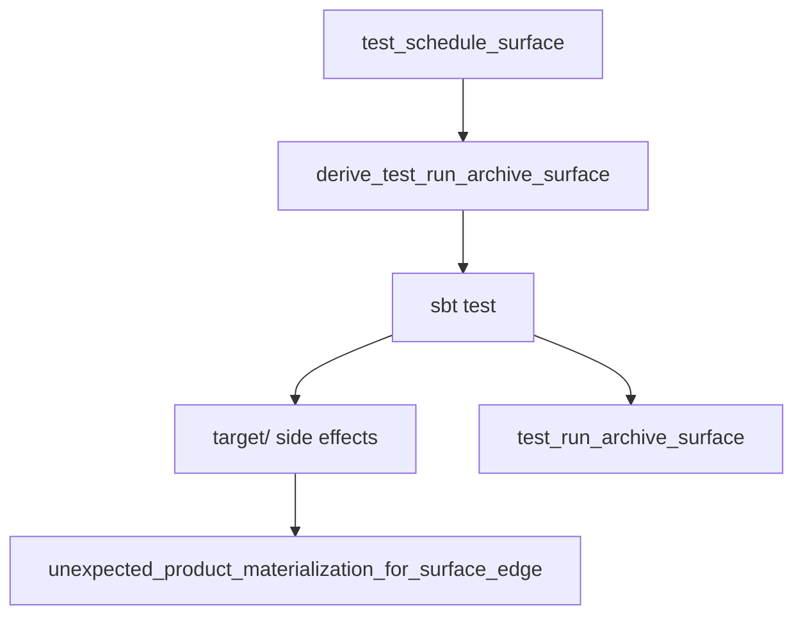
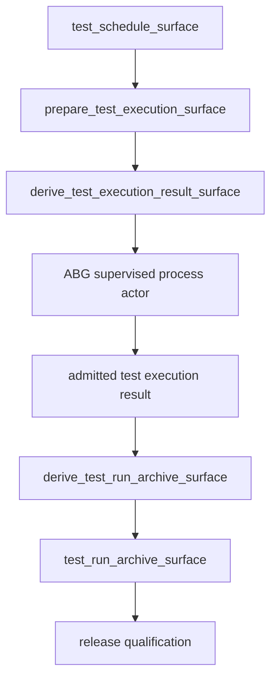

# T-104 Split Test Execution From Test Run Archive Surface

- id: T-104
- type: feature
- ticket_category: implementation_migration
- migration_strategy: inside_out_hard_break
- library_usage: consume
- governing_library: TypeScript graph catalog, ABG process/runtime truth, SDLC execution evidence carrier
- status: completed
- goal: typescript-rc-data-mapper-qualification
- change_intent: separate side-effecting test execution from the surface-only test run archive edge so build-tool side effects are lawful, observable, and admitted before archive closure
- change_class: design_reframe
- re_entry_point: design
- triaged_at: 2026-04-30
- created_at: 2026-04-30
- updated_at: 2026-05-01
- priority: high
- build_tenant: typescript
- owner: unassigned
- review_status: closed_fixed_2026-05-01
- links:
  - test60 final archive: `/Users/jim/src/apps/ai_sdlc_examples/local_projects/data_mapper/data_mapper.test60.TS.cl/.ai-workspace/runtime/odd_sdlc/operator-runs/20260430T111419518Z_pid62579`
  - related completed ticket: `.ai-workspace/tickets/completed/T-095-require-governed-live-test-execution-for-test-run-archive-edge.md`
  - related completed ticket: `.ai-workspace/tickets/completed/T-006-add-declarative-operational-state-transitions-for-build-test-and-deploy.md`

## STDO Triage

### First Missing Layer

Design.

The current `derive_test_run_archive_surface` edge combines two incompatible
contracts:

- the edge is surface-only and declares `productMaterialization.required =
  false`
- the edge asks for governed evidence from `sbt test`

For sbt, running tests necessarily creates `target/` files. Those are fresh
product-tree files under the selected tenant root, so the materialization
postflight rejects them as `unexpected_product_materialization_for_surface_edge`.

## Target Truth

Test execution and test-run archive are separate graph responsibilities.

The clean target shape is:

1. `prepare_test_execution_surface` or equivalent execution-prep surface:
   binds the command, working directory, expected report shape, and side-effect
   policy.
2. `derive_test_execution_result_surface` or equivalent execution result edge:
   runs or admits the side-effecting test execution through ABG process/runtime
   truth and materialization policy.
3. `derive_test_run_archive_surface`:
   archives admitted execution evidence and dependency refs. It does not run
   `sbt test` itself.

## Solution Design

Upstream engine-first solution reference:

`/Users/jim/src/apps/abiogenesis/.ai-workspace/comments/codex/20260430T224308AEST_abg_engine_first_holistic_solution.md`

Downstream SDLC solution reference:

`/Users/jim/src/apps/odd_sdlc/.ai-workspace/comments/codex/20260430T223828AEST_test60_bug_wave_domain_solution.md`

This ticket corrects the graph/domain model. The archive edge must not be the
effect edge that invokes the build tool.

Current broken shape:

Target shape:

Design-module checks:

- Effect-edge rule: `sbt test` is isolated in the execution edge.
- Authority seam closure: archive truth derives from admitted execution result
  truth.
- Prime law: execution result and archive are separate prime carriers because
  one is an effect result and one is a publication/archive surface.
- ODD method: the graph function catalog names the constructive program; test
  execution is not hidden inside prompt prose.

## Acceptance Criteria

- AC-1: the executive graph no longer asks a surface-only archive edge to run
  `sbt test`.
- AC-2: side-effecting test execution has an edge whose materialization policy
  permits build-tool byproducts or explicitly excludes cache/target outputs
  from product materialization violations.
- AC-3: test-run archive closure depends on admitted execution result truth,
  not on worker prose.
- AC-4: `gaps` and `query-domain` expose the test execution edge and archive
  edge as distinct domain concepts.
- AC-5: fresh data_mapper run can either admit a successful test execution or
  stop at a typed product-build defect before archive closure.
- AC-6: release qualification cannot bypass the execution result edge.

## Non-Closure Conditions

- Widening `productMaterialization.required` on the archive edge without
  separating execution from archival truth.
- Ignoring `target/` side effects rather than governing them.
- Treating a markdown archive that says tests were not run as release evidence.
- Keeping test execution hidden in a prompt instruction instead of a graph
  surface or execution contract.

## Required Migration Notes

This is a core graph-function migration. The ticket must inventory:

- old producer edge
- new producer edge(s)
- old consumers of `test_run_archive_surface`
- new consumers of execution result truth
- superseded closure paths
- release/report projections that depend on the archive

## Migration Declaration

- old truth path: `derive_test_run_archive_surface` was both the archive
  surface and the hidden side-effecting test-execution surface.
- new truth path: `prepare_test_execution_surface` and
  `derive_test_execution_result_surface` own execution command/evidence truth;
  `derive_test_run_archive_surface` is surface-only and consumes admitted
  execution-result source truth.
- old producers: archive prompt and report admission could emit fresh
  execution evidence directly on the archive edge.
- new producers: graph catalog schedule/execution edges, execution-result
  transform artifact, execution evidence carrier, and source-dependency
  obligations for the archive.
- old consumers: release qualification, archive postflight, gap dossier, and
  CLI/operator summaries could read archive prose as if it were execution
  proof.
- new consumers: archive postflight checks cited execution-result source
  truth, release qualification reads admitted execution-result/archive
  dependency truth, and gap projection reports the exact missing dependency.
- projection/read-model surfaces: graph catalog, `query-domain`, `gaps`,
  handoff manifest, postflight, gap dossier, release qualification, and
  semantic regression output.
- closure law: the migration closes only when fresh execution evidence on the
  archive edge fails closed, archive closure requires prior execution-result
  source truth, and live data_mapper evidence reaches the split execution path
  without treating archive prose as release proof.

## Migration Checklist

- [x] old truth path is named explicitly
- [x] new truth path is named explicitly
- [x] producer set for the new truth is listed
- [x] consumer set for the new truth is listed
- [x] projection/read-model surfaces are listed
- [x] old truth path is removed or explicitly demoted from authority
- [x] mixed-state behavior is no longer accepted as closure evidence
- [x] tests proving mixed old/new behavior are removed or repriced
- [x] recurring realization patterns are checked against existing library/commonization surfaces
- [x] ticket declares library usage and names the governing library or rationale
- [x] this active ticket carries only the TypeScript tenant lifecycle
- [ ] ticket wording, product wording, and proof claims are reconciled before closure

## Proof Surface

- Design update for the TypeScript graph function catalog.
- Query-domain/gaps projection tests for the new edge separation.
- Semantic tests proving archive closure cannot occur without admitted
  execution result truth.
- Live Claude data_mapper lane that stops at the correct edge or reaches
  admitted execution.
- External STDO review before closure.

## Implementation Checkpoint - 2026-05-01

Implemented in `build_tenants/typescript/code/src/graph/catalog.ts` and
`build_tenants/typescript/code/src/operator/handoff.ts`.

- `prepare_test_execution_surface` and
  `derive_test_execution_result_surface` are now part of the bootstrap release
  graph before `derive_test_run_archive_surface`.
- the archive edge now consumes `test_execution_result_surface`.
- duplicate operational test-execution catalog entries were removed so the
  graph catalog has one owner for these edges.
- `derive_test_execution_result_surface` admits typed execution evidence from
  transform artifacts.
- `derive_test_run_archive_surface` is now surface-only: its prompt forbids
  running test commands or emitting fresh `sdlc_worker_execution_evidence`, and
  it consumes prior `test_execution_result_surface` truth.
- archive postflight now blocks with `source_asset_dependency_missing` unless
  the archive cites its source asset dependencies, including
  `test_execution_result_surface`.
- legacy worker reports that try to attach fresh `executionEvidence` to
  non-execution-result targets are rejected at report admission.
- known build-tool byproducts such as `target/` and `.bsp/` are excluded from
  product materialization violations on execution-evidence surfaces.
- B-075 extends that byproduct exclusion to `test_module_surface`, because live
  `data_mapper.test61.TS.cl` proved build tooling can also emit byproducts
  before the dedicated execution-result edge.
- Regression coverage:
  `T-093 publishes schedule graph assets before materialization edges` and
  `T-093 ABG-owned start produces and consumes schedule surfaces`.
- Regression coverage:
  `T-104 test-run archive is surface-only and does not require fresh execution evidence`.

Verification:

- `npm run lint:semantic` passed on 2026-05-01.
- `npm run test:semantic` passed 153/153 on 2026-05-01.
- Re-verified in the current stabilization tranche on 2026-05-01:
  `npm run lint:semantic` passed and `npm run test:semantic` passed 158/158.
- Full tranche verification on 2026-05-01:
  `npm run lint:semantic` passed, `npm run test:semantic` passed 160/160,
  and `git diff --check` passed.
- Post-review T-104 focused verification on 2026-05-01:
  `npm run build:semantic` passed and focused
  `node --test test_env/tests/test_t066_product_materialization_contract.test.mjs test_env/tests/test_t093_scheduling_phase.test.mjs test_env/tests/test_t101_retry_report_rejection_loop.test.mjs`
  passed 23/23.
- Post-review full verification on 2026-05-01:
  `npm run lint:semantic` passed, `npm run test:semantic` passed 161/161,
  and `git diff --check` passed.
- Second post-review correction on 2026-05-01:
  `npm run build:semantic` passed, focused
  `node --test test_env/tests/test_t066_product_materialization_contract.test.mjs test_env/tests/test_t093_scheduling_phase.test.mjs test_env/tests/test_t101_retry_report_rejection_loop.test.mjs test_env/tests/test_t086_blocking_reason_carriers.test.mjs`
  passed 30/30, `npm run lint:semantic` passed, `npm run test:semantic`
  passed 163/163, and `git diff --check` passed.

Live checkpoint:

- `data_mapper.test62.TS.cl` reached and closed the new split edges through
  `prepare_test_execution_surface`.
- It then stopped later at `derive_test_execution_result_surface`, which is
  now correctly isolated as the side-effecting execution-result edge. Follow-on
  defects are tracked in B-077 and B-078.

Remaining before closure:

- fresh Claude data_mapper lane evidence
- external STDO review

## Test64 Live Evidence Boundary - 2026-05-01

`data_mapper.test64.TS.cl` stopped before the split test execution path. The
terminal edge was `derive_code_surface`, archive
`20260501T083037157Z_pid63915`, with typed `silent_worker_inactivity`.

This does not prove the execution/archive split in a fresh lane. T-104 remains
active until live evidence reaches either admitted `test_execution_result_surface`
truth or the expected typed product-build blocker before archive closure, plus
external review.

## STDO Review Correction - 2026-05-01

The 2026-05-01 STDO active-ticket code review found a remaining archive-closure
authority gap: `test_run_archive_surface` could close by naming
`test_execution_result_surface` in archive prose, without proving that the cited
source asset was an admitted execution-result report with shard truth.

Correction applied:

- source-asset handoff obligations now include prior operator-run
  `worker_result_report.json` refs for matching asset types, so archive workers
  receive concrete source carriers instead of only `asset-type://...` identity.
- archive postflight now checks the fulfilled
  `source_asset:test_execution_result_surface` assessment for a readable
  admitted `odd_sdlc.worker_result_report` whose target is
  `test_execution_result_surface`.
- the cited execution-result report must carry successful typed execution
  evidence for the current execution contract and registered shard rows.
- prose-only archive reports now fail closed with
  `source_asset_dependency_missing`, while archive reports that cite the prior
  admitted execution-result report pass without emitting fresh archive-edge
  execution evidence.

Verification:

- `npm run build:semantic` passed.
- focused `node --test test_env/tests/test_t066_product_materialization_contract.test.mjs`
  passed 21/21.
- `npm run lint:semantic` passed.
- `npm run test:semantic` passed 164/164.
- `git diff --check` passed.

Closure state remains active. The deterministic archive-truth blocker is
resolved, but this ticket still needs fresh live data_mapper proof,
publication/versioning of active ticket authority, and closure review before it
can move out of active.

## Closure - 2026-05-01

Closed as fixed in the active-ticket cleanup pass. This closure supersedes older checkpoint wording in this file that said the ticket remained active for review, live-lane, or proof-envelope gates. The implementation and review notes above record the accepted fix/proof surface; broader release or live-lane envelope work remains with the still-active envelope tickets rather than keeping this fixed work item open.
