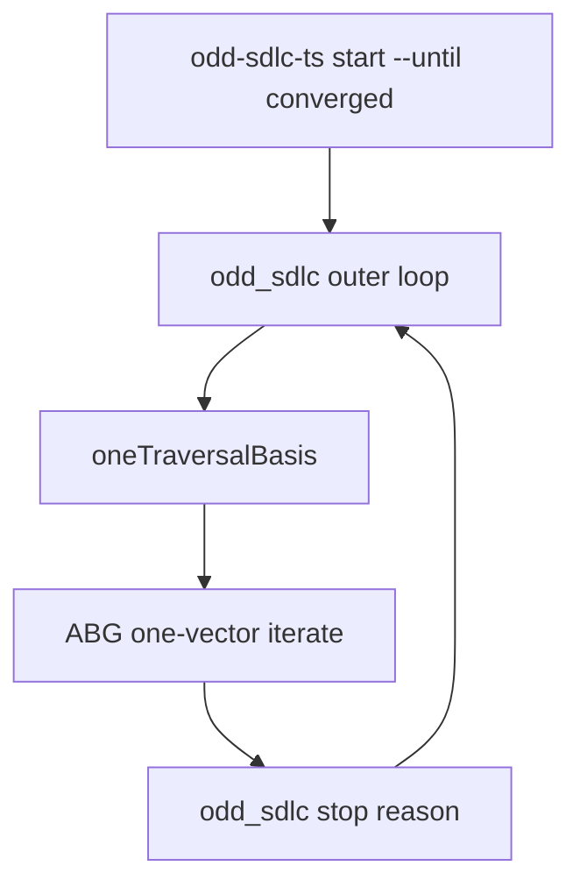
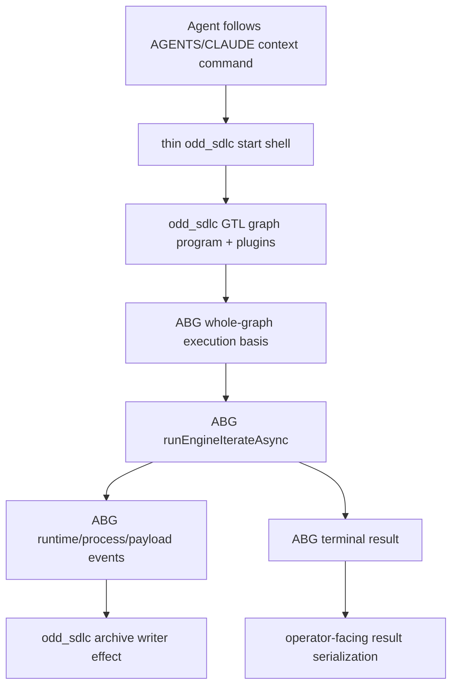

# T-105 Migrate Start Until Converged To ABG-Owned Whole-Graph Iteration

- id: T-105
- type: bug
- ticket_category: implementation_migration
- migration_strategy: inside_out_hard_break
- library_usage: consume
- governing_library: ABG runEngineIterate/runEngineIterateAsync whole-graph runner
- status: completed
- goal: typescript-rc-runtime-architecture
- change_intent: delete odd_sdlc's tenant-owned autonomous start loop and invoke ABG whole-graph iteration as the sole traversal loop authority
- change_class: design_reframe
- re_entry_point: design
- triaged_at: 2026-05-01
- created_at: 2026-05-01
- updated_at: 2026-05-01
- priority: critical
- build_tenant: typescript
- owner: unassigned
- review_status: closed_fixed_2026-05-01
- intake_source: Operator clarification that T-092 was a misunderstanding; T-102 non-closure condition forbids claiming ABG ownership while odd_sdlc still owns the loop; Claude DMM review at `.ai-workspace/comments/claude/20260430T143854Z_REVIEW_typescript-src-simplify-and-domain-models.md`.
- affected_boundary: `build_tenants/typescript/code/src/cli/command.ts`, `build_tenants/typescript/code/src/operator/installed_operator.ts`, `build_tenants/typescript/code/src/start/public_start.ts`, installed `AGENTS.md` / `CLAUDE.md` guidance, ABG `runEngineIterateAsync` integration
- parent_ticket: T-102
- supersedes:
  - T-092 (`.ai-workspace/tickets/completed/T-092-realize-typescript-installed-start-autonomous-until-blocked-loop.md`) as final architecture

## STDO Triage

### First Missing Layer

Design.

T-092 proved a shell, but misnamed the shell as odd_sdlc-owned autonomous
traversal. The correct product boundary is narrower:

- odd_sdlc publishes the SDLC GTL graph program and domain plugin surfaces.
- ABG owns execution of that graph program.
- odd_sdlc may publish command/context guidance telling an agent how to invoke
  ABG for this installed project.
- odd_sdlc must not maintain a second traversal loop, retry budget, vector
  advancement rule, or closure fold.

The current TypeScript code violates that boundary by force-slicing ABG's
whole-graph driver through `oneTraversalBasis(basis)` and re-running that
single-vector call from `installedStartPayloadFor(...)`.

## Current Defect



This buys no durable architecture. It creates a second framework.

## Target Architecture



The shell may format operator output and write odd_sdlc archives from ABG
events. It does not own traversal semantics.

## Acceptance Criteria

- AC-1: `start --until converged` invokes ABG whole-graph iteration once for
  the selected graph function.
- AC-2: odd_sdlc no longer owns `AUTONOMOUS_START_STEP_GUARD`,
  `stopReasonForOutcome`, `SdlcAutonomousStartLoopTrace`, or one-vector
  slicing as traversal mechanics.
- AC-3: `oneTraversalBasis(...)` is deleted or no longer used to constrain
  graph iteration.
- AC-4: installed `AGENTS.md` and `CLAUDE.md` describe how to invoke the ABG
  backed start path; they do not describe odd_sdlc as a rival runtime loop.
- AC-5: per-attempt archives are written from ABG runtime events/effect
  callbacks, not from an odd_sdlc outer loop step.
- AC-6: `gaps` remains a projection over event truth.
- AC-7: live Claude data_mapper lane proves at least two F_P hops execute under
  one ABG-owned graph iteration.

## Non-Closure Conditions

- Renaming the odd_sdlc loop without deleting traversal authority.
- Leaving odd_sdlc responsible for retry budget, vector advancement, or closure
  fold.
- Citing T-092 as authority for an odd_sdlc-owned autonomous loop.
- Losing per-attempt forensic archives.
- Implementing the behavior only as agent instruction text while code still
  owns the loop.

## Migration Declaration

- old truth path: `installedStartPayloadFor(...)` owned an outer
  `start --until converged` loop over one-vector ABG calls produced by
  `oneTraversalBasis(...)`.
- new truth path: odd_sdlc invokes ABG `runEngineIterateAsync(...)` once for
  the selected graph function and passes `iterationUntil` as ABG runner policy.
- old producers: odd_sdlc CLI/operator loop trace, local stop-reason policy,
  and one-vector basis slicing.
- new producers: ABG whole-graph runner, stable execution contract carrying
  requested operator intent, ABG event/effect callbacks, and odd_sdlc archive
  writer as an effect surface.
- old consumers: compact CLI output, installed operator result, tests, and
  run archives consumed odd_sdlc loop-step/loop-stop truth.
- new consumers: compact CLI output, tests, archives, gaps, and gap dossiers
  consume ABG iteration/result truth without local vector-advance authority.
- projection/read-model surfaces: CLI JSON/compact output, operator archives,
  events, gap projection, installed `AGENTS.md`/`CLAUDE.md`, and T-102 parent
  review.
- closure law: the migration closes only when no normal `start --until
  converged` path uses odd_sdlc loop authority, per-attempt archives are
  preserved from ABG-owned iteration/effects, and live data_mapper evidence
  proves multiple F_P hops under one ABG iteration call.

## Migration Checklist

- [x] old truth path is named explicitly
- [x] new truth path is named explicitly
- [x] producer set for the new truth is listed
- [x] consumer set for the new truth is listed
- [x] projection/read-model surfaces are listed
- [x] old truth path is removed or explicitly demoted from authority
- [x] mixed-state behavior is no longer accepted as closure evidence
- [x] tests proving mixed old/new behavior are removed or repriced
- [x] recurring realization patterns are checked against existing library/commonization surfaces
- [x] ticket declares library usage and names the governing library or rationale
- [x] this active ticket carries only the TypeScript tenant lifecycle
- [ ] ticket wording, product wording, and proof claims are reconciled before closure

## Implementation Checkpoint - 2026-05-01

Status: implemented pending live Claude proof and external STDO review.

Changes made:

- ABG `runEngineIterate` / `runEngineIterateAsync` now accept
  `iterationUntil` as runner policy. This preserves stable execution-basis
  replay identity while letting ABG, not odd_sdlc, own first-hop versus
  whole-graph stopping.
- odd_sdlc `SdlcExecutionContract` carries `requestedUntil` as shell/operator
  intent while keeping the ABG basis identity stable at `until: converged`.
- `executeInstalledOperatorStart(...)` now calls `runEngineIterateAsync(...)`
  once for the selected graph function and passes `iterationUntil:
  executionContract.requestedUntil`.
- `oneTraversalBasis(...)`, `AUTONOMOUS_START_STEP_GUARD`,
  `stopReasonForOutcome(...)`, and `SdlcAutonomousStartLoopTrace` were removed
  from the implementation path.
- Compact CLI output no longer reports `loop_steps` or `loop_stop`.
- Tests that need a bounded single edge now request `first_traversal` through
  ABG runner policy instead of depending on an odd_sdlc-owned slice.

Deterministic verification:

- ABG `npm run test:semantic` passed, 305/305.
- odd_sdlc `npm run test:semantic` passed, 153/153.
- ABG `npm run lint:semantic` passed.
- odd_sdlc `npm run lint:semantic` passed.
- Focused odd_sdlc operator tests passed:
  `test_t064_installed_operator_ux.test.mjs`,
  `test_t093_scheduling_phase.test.mjs`,
  `test_t101_retry_report_rejection_loop.test.mjs`.
- Post-review tranche verification on 2026-05-01:
  odd_sdlc `npm run lint:semantic` passed, `npm run test:semantic` passed
  160/160, and `git diff --check` passed.

Remaining closure work:

- External STDO review of the final live evidence remains.

## Live Checkpoint - 2026-05-01

`data_mapper.test63.TS.cl` is running under:

```text
odd-sdlc-ts start --workspace . --target graph_function:bootstrap_release_self_test --until converged --worker process://claude
```

Observed so far under one parent process (`pid95556`):

- `20260501T035950263Z_pid95556`: vector 0,
  `derive_intent_surface`, postflight passed.
- `20260501T040418693Z_pid95556`: vector 1,
  `derive_product_surface`, postflight passed.
- `20260501T040824608Z_pid95556`: vector 2,
  `derive_goal_surface`, postflight passed.
- `20260501T041222436Z_pid95556`: vector 3,
  `derive_requirement_surface`, postflight passed.
- `20260501T041645909Z_pid95556`: vector 4,
  `derive_feature_decomp_surface`, postflight passed.
- `20260501T042119102Z_pid95556`: vector 5,
  `derive_uat_testcases_surface`, postflight passed.
- `20260501T042549511Z_pid95556`: vector 6 attempt 1,
  `derive_design_surface`, postflight passed but assurance blocked on
  requirement trace gaps.
- `20260501T043116993Z_pid95556`: vector 6 attempt 2,
  `derive_design_surface`, consumed the prior gap dossier and then
  postflight/assurance passed.
- `20260501T043835362Z_pid95556`: vector 7,
  `derive_scenario_surface`, produced stdout at ~278s, exited 0, postflight
  passed, and assurance closed.
- `20260501T044313790Z_pid95556`: vector 8,
  `derive_implementation_design_surface`, running at checkpoint time.

This satisfies the structural live proof for AC-7: multiple F_P hops are being
executed under one ABG-owned graph iteration, not an odd_sdlc outer loop. The
ticket remains active pending final lane outcome and external review.

## Test64 Final Live Evidence - 2026-05-01

`data_mapper.test64.TS.cl` produced a second successor live lane under one
parent `start --until converged` process, `pid63915`.

After `Fg_conform_project`, the run advanced through twelve F_P hops under that
single ABG-owned graph iteration:

- `derive_intent_surface`
- `derive_product_surface`
- `derive_goal_surface`
- `derive_requirement_surface`
- `derive_feature_decomp_surface`
- `derive_uat_testcases_surface`
- `derive_design_surface`
- `derive_scenario_surface`
- `derive_implementation_design_surface`
- `select_implementation_stack_profile`
- `derive_implementation_module_surface`
- `derive_realization_schedule_surface`

The terminal archive was:

`/Users/jim/src/apps/ai_sdlc_examples/local_projects/data_mapper/data_mapper.test64.TS.cl/.ai-workspace/runtime/odd_sdlc/operator-runs/20260501T083037157Z_pid63915`

It stopped at `derive_code_surface` with typed
`silent_worker_inactivity`, not because odd_sdlc owned a vector loop. This
strengthens AC-7 live proof for the migration. The ticket still remains active
until external STDO review accepts the live evidence and proof wording.

## External Review Reconciliation - 2026-05-01

The external design-method review found that the implementation had run ahead
of active design/module text. The code direction was accepted, but T-105 could
not close while design docs still said attached `start` only projects one
public-start outcome or while assurance text still described an odd_sdlc
installed loop.

Design reconciliation applied:

- `build_tenants/typescript/design/ODD_SDLC_TYPESCRIPT_PUBLIC_CLI_ADAPTER.md`
  now distinguishes public-start contract admission from attached
  installed-operator dispatch. The CLI may dispatch to the installed-operator
  shell, but it does not own ABG iteration, vector advancement, retry budget, or
  closure fold.
- `build_tenants/typescript/design/ODD_SDLC_TYPESCRIPT_TRAVERSAL_ASSURANCE_INTEGRATION.md`
  now describes ABG-owned retry and continuation closure instead of an
  odd_sdlc installed loop.
- `build_tenants/typescript/design/ODD_SDLC_TYPESCRIPT_INSTALLED_OPERATOR_UX.md`
  no longer frames remaining RC work as expanding an odd_sdlc installed loop.

T-105 remains active until fresh external STDO review accepts the reconciled
design/module surface and live evidence.

## Second External Review Reconciliation - 2026-05-01

The second design-method review accepted the ABG-owned iteration/design-doc
reconciliation as resolved. No code or design change was required for T-105 in
this pass.

The final migration checklist row remains intentionally unchecked until
external review accepts ticket/product/proof wording. T-105 remains active.

## Closure - 2026-05-01

Closed as fixed in the active-ticket cleanup pass. This closure supersedes older checkpoint wording in this file that said the ticket remained active for review, live-lane, or proof-envelope gates. The implementation and review notes above record the accepted fix/proof surface; broader release or live-lane envelope work remains with the still-active envelope tickets rather than keeping this fixed work item open.
